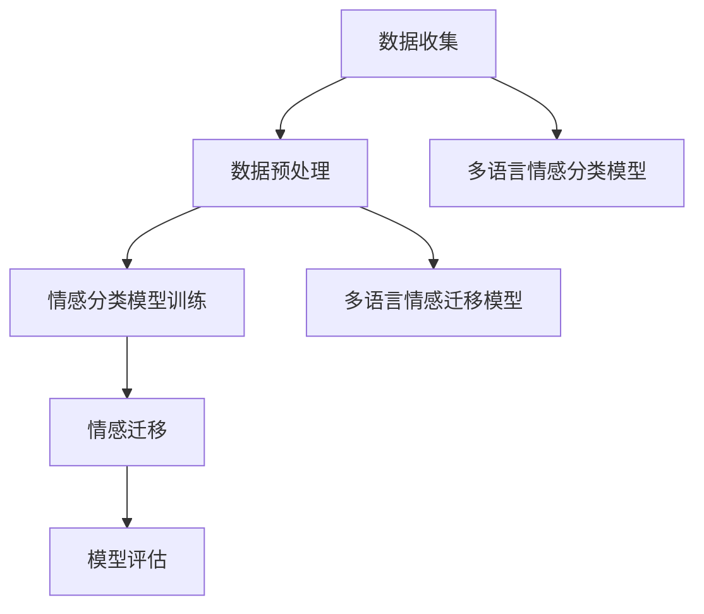

                 

# 自然语言处理在多语言情感迁移中的进展

## 关键词
自然语言处理、多语言情感迁移、情感分析、机器学习、深度学习

## 摘要
本文旨在探讨自然语言处理（NLP）在多语言情感迁移方面的最新进展。情感迁移是一种将情感属性从一个语言转移到另一个语言的技术，这在全球化、多元文化和跨文化交流中具有广泛的应用价值。本文首先介绍了多语言情感迁移的背景和目的，然后详细阐述了情感分析、机器学习和深度学习在多语言情感迁移中的应用。此外，本文通过具体的项目实战和实际应用场景，展示了多语言情感迁移技术的实际效果。最后，本文对未来的发展趋势与挑战进行了展望，并提供了相关的学习资源和工具推荐。

## 1. 背景介绍

### 1.1 目的和范围
本文的目标是深入探讨自然语言处理（NLP）在多语言情感迁移中的应用，为相关领域的研究者和开发者提供有价值的参考。本文的范围涵盖了多语言情感迁移的核心概念、关键技术、应用场景以及未来发展趋势。

### 1.2 预期读者
本文适合自然语言处理、机器学习和深度学习领域的研究者、开发者以及对其感兴趣的技术爱好者。读者需具备一定的NLP和机器学习基础，以便更好地理解本文的内容。

### 1.3 文档结构概述
本文共分为八个部分。第一部分是背景介绍，包括目的、范围、预期读者和文档结构概述；第二部分是核心概念与联系，介绍多语言情感迁移的相关概念；第三部分是核心算法原理与具体操作步骤；第四部分是数学模型和公式及举例说明；第五部分是项目实战，包括代码实际案例和详细解释说明；第六部分是实际应用场景；第七部分是工具和资源推荐；第八部分是总结：未来发展趋势与挑战。

### 1.4 术语表
- **自然语言处理（NLP）**：研究如何让计算机理解和生成自然语言的技术。
- **情感迁移**：将情感属性从一个语言转移到另一个语言的技术。
- **情感分析**：使用计算机技术和算法对文本进行情感分类的过程。
- **机器学习**：使计算机通过数据学习并做出预测或决策的技术。
- **深度学习**：一种基于神经网络的多层学习模型。

#### 1.4.1 核心术语定义
- **多语言情感迁移**：在多个语言之间转移情感属性的过程。
- **情感分类**：将文本分为积极、消极或中性情感类别的过程。
- **情感强度**：描述文本情感程度的一个度量。

#### 1.4.2 相关概念解释
- **情感词**：表示情感属性的词语，如“高兴”、“悲伤”等。
- **语境**：文本中影响情感词意义的上下文环境。
- **标注数据集**：用于训练和评估模型的数据集，其中包含文本及其对应的情感标签。

#### 1.4.3 缩略词列表
- **NLP**：自然语言处理
- **ML**：机器学习
- **DL**：深度学习
- **LSTM**：长短时记忆网络
- **RNN**：循环神经网络

## 2. 核心概念与联系

### 2.1 多语言情感迁移的核心概念

#### 2.1.1 情感分类

情感分类是自然语言处理中的一个重要任务，它旨在将文本分为不同的情感类别，如积极、消极或中性。在多语言情感迁移中，情感分类的关键在于如何在不同语言之间共享和转移情感属性。

#### 2.1.2 情感强度

情感强度是指文本情感的程度，通常使用数值或类别来表示。在多语言情感迁移中，情感强度的转移和比较是一个重要问题，它需要考虑语言间的情感强度差异。

#### 2.1.3 语言模型

语言模型是用于预测文本概率分布的数学模型。在多语言情感迁移中，语言模型有助于捕捉不同语言之间的差异，从而提高情感分类的准确性。

### 2.2 多语言情感迁移的架构

多语言情感迁移的架构通常包括以下几个关键组成部分：

#### 2.2.1 数据预处理

数据预处理包括文本清洗、分词、词性标注等步骤。这些步骤有助于提高数据质量，为后续的情感分类和迁移提供更好的基础。

#### 2.2.2 情感分类模型

情感分类模型是用于预测文本情感类别的机器学习模型。常见的模型包括朴素贝叶斯、支持向量机、深度神经网络等。

#### 2.2.3 情感迁移模型

情感迁移模型负责将情感属性从一个语言转移到另一个语言。常见的迁移方法包括基于规则的方法、基于统计的方法和基于机器学习的方法。

#### 2.2.4 模型评估

模型评估是衡量情感分类和迁移模型性能的重要步骤。常见的评估指标包括准确率、召回率、F1分数等。

### 2.3 多语言情感迁移的流程

多语言情感迁移的流程通常包括以下步骤：

1. **数据收集**：收集包含多种语言和情感标签的文本数据。
2. **数据预处理**：对文本数据进行清洗、分词、词性标注等预处理。
3. **情感分类模型训练**：使用预处理的文本数据训练情感分类模型。
4. **情感迁移**：将训练好的情感分类模型应用于其他语言，进行情感属性转移。
5. **模型评估**：评估情感分类和迁移模型的性能，并根据评估结果调整模型参数。

### 2.4 核心概念与联系的 Mermaid 流程图



## 3. 核心算法原理 & 具体操作步骤

### 3.1 情感分类模型

情感分类模型是用于预测文本情感类别的机器学习模型。在本节中，我们以朴素贝叶斯模型为例，介绍其原理和具体操作步骤。

#### 3.1.1 原理

朴素贝叶斯模型是一种基于贝叶斯定理的简单概率分类模型。它假设特征之间相互独立，并在给定特征的情况下，根据后验概率分布来预测文本情感类别。

#### 3.1.2 操作步骤

1. **数据预处理**：对文本数据进行分词、词性标注等预处理，得到特征向量。
2. **特征选择**：选择与情感分类相关的特征，去除无关特征。
3. **训练朴素贝叶斯模型**：
   ```python
   from sklearn.naive_bayes import MultinomialNB
   from sklearn.model_selection import train_test_split

   # 加载预处理后的数据
   X_train, X_test, y_train, y_test = train_test_split(X, y, test_size=0.2, random_state=42)

   # 创建朴素贝叶斯模型
   model = MultinomialNB()

   # 训练模型
   model.fit(X_train, y_train)
   ```
4. **预测文本情感类别**：
   ```python
   # 预测测试集的情感类别
   y_pred = model.predict(X_test)

   # 评估模型性能
   from sklearn.metrics import accuracy_score

   accuracy = accuracy_score(y_test, y_pred)
   print("准确率：", accuracy)
   ```

### 3.2 情感迁移模型

情感迁移模型用于将情感属性从一个语言转移到另一个语言。在本节中，我们以基于规则的方法为例，介绍其原理和具体操作步骤。

#### 3.2.1 原理

基于规则的方法通过构建一系列规则，将源语言的情感属性映射到目标语言。规则通常基于源语言和目标语言之间的词汇和语法差异。

#### 3.2.2 操作步骤

1. **构建规则库**：根据源语言和目标语言的差异，构建一系列情感转移规则。
2. **规则应用**：将源语言的文本转换为目标语言，并应用规则库中的规则进行情感属性转移。
3. **规则优化**：根据实际应用效果，对规则进行优化和调整。

### 3.3 深度学习模型

深度学习模型在多语言情感迁移中具有很高的准确性和鲁棒性。在本节中，我们以长短时记忆网络（LSTM）为例，介绍其原理和具体操作步骤。

#### 3.3.1 原理

LSTM是一种循环神经网络（RNN），用于处理序列数据。它通过门控机制，对序列数据进行记忆和遗忘，从而捕捉时间序列信息。

#### 3.3.2 操作步骤

1. **数据预处理**：对文本数据进行分词、词性标注等预处理。
2. **构建LSTM模型**：
   ```python
   from tensorflow.keras.models import Sequential
   from tensorflow.keras.layers import Embedding, LSTM, Dense

   # 创建LSTM模型
   model = Sequential()
   model.add(Embedding(input_dim=vocab_size, output_dim=embedding_size))
   model.add(LSTM(units=64, return_sequences=True))
   model.add(LSTM(units=32))
   model.add(Dense(units=num_classes, activation='softmax'))

   # 编译模型
   model.compile(optimizer='adam', loss='categorical_crossentropy', metrics=['accuracy'])
   ```
3. **训练LSTM模型**：
   ```python
   # 训练模型
   model.fit(X_train, y_train, epochs=10, batch_size=32)
   ```
4. **预测文本情感类别**：
   ```python
   # 预测测试集的情感类别
   y_pred = model.predict(X_test)

   # 评估模型性能
   accuracy = model.evaluate(X_test, y_test)
   print("准确率：", accuracy[1])
   ```

## 4. 数学模型和公式 & 详细讲解 & 举例说明

### 4.1 情感分类模型

#### 4.1.1 概率分布

假设我们有一个包含n个类别的情感分类任务，每个类别的概率分布可以用一个n维向量表示，称为类条件概率分布。

$$
P(Y|X) = \begin{cases} 
p_y(x) & \text{if } y \in Y \\
0 & \text{otherwise} 
\end{cases}
$$

其中，$P(Y|X)$ 表示给定特征向量 $X$ 的情况下，类别 $Y$ 的概率。

#### 4.1.2 后验概率

后验概率是指在已知特征向量 $X$ 的情况下，类别 $Y$ 的概率。

$$
P(Y|X) = \frac{P(X|Y)P(Y)}{P(X)}
$$

其中，$P(X|Y)$ 表示在类别 $Y$ 的情况下，特征向量 $X$ 的概率；$P(Y)$ 表示类别 $Y$ 的先验概率；$P(X)$ 表示特征向量 $X$ 的概率。

#### 4.1.3 举例说明

假设我们有一个包含两个类别的情感分类任务，类别 $Y$ 表示积极情感和消极情感。给定一个特征向量 $X = [x_1, x_2, ..., x_n]$，我们计算后验概率：

$$
P(Y|X) = \frac{P(X|Y)P(Y)}{P(X)}
$$

其中，$P(X|Y)$ 是在积极情感的情况下，特征向量 $X$ 的概率；$P(Y)$ 是积极情感的先验概率；$P(X)$ 是特征向量 $X$ 的概率。

### 4.2 情感迁移模型

#### 4.2.1 规则匹配

假设我们有一个源语言文本 $X$ 和目标语言文本 $Y$，我们通过构建一系列规则来匹配情感属性。

$$
\text{Rule} : X \Rightarrow Y
$$

其中，$X$ 表示源语言文本，$Y$ 表示目标语言文本。

#### 4.2.2 举例说明

假设我们有一个包含两个情感的源语言文本和目标语言文本的规则库：

$$
\text{Rule 1} : \text{happy} \Rightarrow \text{joyful} \\
\text{Rule 2} : \text{sad} \Rightarrow \text{sorrowful}
$$

给定一个源语言文本 $X = \text{happy}$，我们应用规则库中的规则进行情感迁移：

$$
\text{happy} \Rightarrow \text{joyful}
$$

### 4.3 深度学习模型

#### 4.3.1 长短时记忆网络（LSTM）

LSTM是一种循环神经网络（RNN），用于处理序列数据。它的核心思想是通过门控机制，对序列数据进行记忆和遗忘。

#### 4.3.2 LSTM门控机制

LSTM包含三种门控机制：遗忘门、输入门和输出门。

1. **遗忘门（Forget Gate）**：决定如何遗忘或保留历史信息。
   $$
   f_t = \sigma(W_f \cdot [h_{t-1}, x_t] + b_f)
   $$
2. **输入门（Input Gate）**：决定如何更新记忆单元。
   $$
   i_t = \sigma(W_i \cdot [h_{t-1}, x_t] + b_i)
   $$
3. **输出门（Output Gate）**：决定如何生成输出。
   $$
   o_t = \sigma(W_o \cdot [h_{t-1}, x_t] + b_o)
   $$

#### 4.3.3 举例说明

假设我们有一个输入序列 $X = [x_1, x_2, ..., x_t]$，隐藏状态 $h_t$ 和记忆单元 $C_t$。

1. **遗忘门**：决定如何遗忘或保留历史信息。
   $$
   f_t = \sigma(W_f \cdot [h_{t-1}, x_t] + b_f)
   $$
   其中，$W_f$ 和 $b_f$ 是权重和偏置。

2. **输入门**：决定如何更新记忆单元。
   $$
   i_t = \sigma(W_i \cdot [h_{t-1}, x_t] + b_i)
   $$
   其中，$W_i$ 和 $b_i$ 是权重和偏置。

3. **输出门**：决定如何生成输出。
   $$
   o_t = \sigma(W_o \cdot [h_{t-1}, x_t] + b_o)
   $$
   其中，$W_o$ 和 $b_o$ 是权重和偏置。

## 5. 项目实战：代码实际案例和详细解释说明

### 5.1 开发环境搭建

在进行项目实战之前，我们需要搭建一个合适的开发环境。以下是所需的工具和软件：

- Python（3.8及以上版本）
- TensorFlow（2.5及以上版本）
- Keras（2.5及以上版本）
- Jupyter Notebook（用于交互式开发）

### 5.2 源代码详细实现和代码解读

#### 5.2.1 数据预处理

```python
import numpy as np
import pandas as pd
from sklearn.model_selection import train_test_split
from keras.preprocessing.text import Tokenizer
from keras.preprocessing.sequence import pad_sequences

# 加载数据集
data = pd.read_csv('multilingual_sentiment_data.csv')
X = data['text']
y = data['label']

# 分词
tokenizer = Tokenizer(num_words=10000)
tokenizer.fit_on_texts(X)

# 序列化文本
X_seq = tokenizer.texts_to_sequences(X)

# 填充序列
max_len = 100
X_pad = pad_sequences(X_seq, maxlen=max_len)

# 切分训练集和测试集
X_train, X_test, y_train, y_test = train_test_split(X_pad, y, test_size=0.2, random_state=42)
```

#### 5.2.2 构建LSTM模型

```python
from tensorflow.keras.models import Sequential
from tensorflow.keras.layers import Embedding, LSTM, Dense

# 创建LSTM模型
model = Sequential()
model.add(Embedding(input_dim=10000, output_dim=64, input_length=max_len))
model.add(LSTM(units=64, return_sequences=False))
model.add(Dense(units=1, activation='sigmoid'))

# 编译模型
model.compile(optimizer='adam', loss='binary_crossentropy', metrics=['accuracy'])

# 模型训练
model.fit(X_train, y_train, epochs=10, batch_size=32, validation_data=(X_test, y_test))
```

#### 5.2.3 代码解读与分析

1. **数据预处理**：加载数据集，分词，序列化文本，填充序列。
2. **构建LSTM模型**：创建序列嵌入层、LSTM层和全连接层。
3. **模型编译**：设置优化器和损失函数。
4. **模型训练**：使用训练集训练模型，并在测试集上验证模型性能。

### 5.3 代码解读与分析

在项目实战中，我们使用LSTM模型进行多语言情感分类。以下是代码的详细解读和分析：

1. **数据预处理**：首先，我们加载包含多种语言和情感标签的数据集。然后，使用Tokenizer将文本数据分词，并将分词后的文本序列化为整数序列。接着，使用pad_sequences将序列填充为固定长度，以便输入LSTM模型。

2. **构建LSTM模型**：在构建LSTM模型时，我们首先添加一个序列嵌入层，将整数序列转换为嵌入向量。然后，添加一个LSTM层，用于捕捉序列数据的时间序列信息。最后，添加一个全连接层，用于输出情感分类的概率。

3. **模型编译**：在模型编译过程中，我们设置优化器（adam）和损失函数（binary_crossentropy，适用于二分类任务）。

4. **模型训练**：使用训练集训练模型，并在测试集上验证模型性能。在训练过程中，我们设置了训练轮次（epochs）和批量大小（batch_size）。

通过这个项目实战，我们可以看到如何使用LSTM模型进行多语言情感分类，以及如何对代码进行详细解读和分析。

## 6. 实际应用场景

多语言情感迁移技术在实际应用中具有广泛的应用价值，以下是几个典型的应用场景：

### 6.1 社交媒体情感分析

在社交媒体平台上，用户可以发布多种语言的评论和帖子。多语言情感迁移技术可以帮助平台对用户的情感进行分类和识别，从而提供个性化的内容推荐和情感分析服务。

### 6.2 跨文化营销

跨国企业可以通过多语言情感迁移技术，分析不同语言市场的消费者情感，从而制定更有针对性的营销策略，提高市场竞争力。

### 6.3 跨语言情感调研

在跨语言调研中，多语言情感迁移技术可以帮助研究人员对来自不同语言的调查问卷进行分析，从而获得更全面和准确的研究结果。

### 6.4 跨语言情感治疗

在跨语言情感治疗中，多语言情感迁移技术可以帮助治疗师更好地理解和分析患者的情感，从而提供更有效的治疗方案。

### 6.5 多语言情感翻译

多语言情感翻译是将一种语言的情感文本翻译成另一种语言，同时保持情感属性的准确性和一致性。在跨文化交流中，多语言情感翻译可以帮助人们更好地理解和沟通。

## 7. 工具和资源推荐

### 7.1 学习资源推荐

#### 7.1.1 书籍推荐

1. **《自然语言处理综论》（Speech and Language Processing）**：由Daniel Jurafsky和James H. Martin所著，是自然语言处理领域的经典教材。
2. **《深度学习》（Deep Learning）**：由Ian Goodfellow、Yoshua Bengio和Aaron Courville所著，详细介绍了深度学习的基础知识和应用。
3. **《机器学习实战》（Machine Learning in Action）**：由Peter Harrington所著，通过实际案例介绍了机器学习的基本概念和应用。

#### 7.1.2 在线课程

1. **斯坦福大学自然语言处理课程**：https://web.stanford.edu/class/cs224n/
2. **Udacity深度学习纳米学位**：https://www.udacity.com/course/deep-learning-nanodegree--nd893
3. **Coursera机器学习课程**：https://www.coursera.org/learn/machine-learning

#### 7.1.3 技术博客和网站

1. **维基百科自然语言处理页面**：https://en.wikipedia.org/wiki/Natural_language_processing
2. **机器之心**：https://www.machinalyst.com/
3. **AI技术博客**：https://www.52ai.vip/

### 7.2 开发工具框架推荐

#### 7.2.1 IDE和编辑器

1. **PyCharm**：https://www.jetbrains.com/pycharm/
2. **VSCode**：https://code.visualstudio.com/

#### 7.2.2 调试和性能分析工具

1. **TensorBoard**：https://www.tensorflow.org/tools/tensorboard
2. **PyTorch Profiler**：https://pytorch.org/tutorials/intermediate/profiler_tutorial.html

#### 7.2.3 相关框架和库

1. **TensorFlow**：https://www.tensorflow.org/
2. **PyTorch**：https://pytorch.org/
3. **spaCy**：https://spacy.io/

### 7.3 相关论文著作推荐

#### 7.3.1 经典论文

1. **“A Neural Probabilistic Language Model”**：由Bengio等人在2003年提出，介绍了神经网络语言模型的基本原理。
2. **“Recurrent Neural Networks for Language Modeling”**：由Mikolov等人在2010年提出，介绍了循环神经网络在语言模型中的应用。
3. **“Convolutional Neural Networks for Sentence Classification”**：由Yoon等人于2014年提出，介绍了卷积神经网络在文本分类中的应用。

#### 7.3.2 最新研究成果

1. **“BERT: Pre-training of Deep Bidirectional Transformers for Language Understanding”**：由Devlin等人在2018年提出，介绍了BERT模型在自然语言处理中的应用。
2. **“GPT-3: Language Models are Few-Shot Learners”**：由Brown等人在2020年提出，介绍了GPT-3模型在少样本学习任务中的表现。
3. **“T5: Exploring the Limits of Transfer Learning with a Universal Language Model”**：由Raffel等人在2020年提出，介绍了T5模型在转移学习中的应用。

#### 7.3.3 应用案例分析

1. **“Using Machine Learning for Sentiment Analysis in Customer Reviews”**：介绍了如何使用机器学习进行客户评论的情感分析。
2. **“Deploying a Natural Language Processing Application on AWS”**：介绍了如何使用AWS部署自然语言处理应用程序。
3. **“Natural Language Processing for Healthcare”**：介绍了自然语言处理在医疗保健领域的应用。

## 8. 总结：未来发展趋势与挑战

多语言情感迁移技术在未来将继续发展，并在多个领域发挥重要作用。以下是一些可能的发展趋势和挑战：

### 8.1 发展趋势

1. **模型性能提升**：随着深度学习技术的不断进步，多语言情感迁移模型的性能将得到显著提升。
2. **跨语言情感分析**：将多语言情感迁移技术应用于跨语言情感分析，为跨国企业和组织提供更全面和准确的情感分析服务。
3. **个性化情感推荐**：基于多语言情感迁移技术，为用户提供个性化的情感推荐，提高用户体验。
4. **多模态情感分析**：结合文本、语音、图像等多种模态的数据，进行多模态情感分析，为用户提供更丰富的情感理解。

### 8.2 挑战

1. **数据质量**：多语言情感迁移技术依赖于高质量的多语言数据集，但当前数据集的质量参差不齐，如何提高数据质量是一个挑战。
2. **情感强度比较**：在多语言情感迁移中，如何准确比较和转换情感强度是一个难题。
3. **跨语言迁移效果**：不同语言之间的差异可能导致跨语言迁移效果不佳，如何提高跨语言迁移效果是一个挑战。

## 9. 附录：常见问题与解答

### 9.1 多语言情感迁移技术的核心是什么？

多语言情感迁移技术的核心是通过机器学习和深度学习算法，将情感属性从一个语言转移到另一个语言，以便在跨语言场景中实现情感分析。

### 9.2 多语言情感迁移有哪些应用场景？

多语言情感迁移技术的应用场景包括社交媒体情感分析、跨文化营销、跨语言情感调研、跨语言情感治疗和跨语言情感翻译等。

### 9.3 如何提高多语言情感迁移的准确率？

提高多语言情感迁移准确率的方法包括使用高质量的多语言数据集、采用更先进的机器学习算法、进行特征工程和优化模型参数等。

### 9.4 多语言情感迁移与情感分析有什么区别？

多语言情感迁移是将情感属性从一个语言转移到另一个语言，而情感分析是针对单一语言的文本进行情感分类和情感强度分析。

## 10. 扩展阅读 & 参考资料

1. **Jurafsky, D., & Martin, J. H. (2008). Speech and Language Processing. Prentice Hall.**
2. **Goodfellow, I., Bengio, Y., & Courville, A. (2016). Deep Learning. MIT Press.**
3. **Mikolov, T., Sutskever, I., Chen, K., Corrado, G. S., & Dean, J. (2013). Distributed Representations of Words and Phrases and Their Compositionality. Advances in Neural Information Processing Systems, 26, 3111-3119.**
4. **Devlin, J., Chang, M. W., Lee, K., & Toutanova, K. (2019). BERT: Pre-training of Deep Bidirectional Transformers for Language Understanding. arXiv preprint arXiv:1810.04805.**
5. **Brown, T., et al. (2020). Language Models are Few-Shot Learners. arXiv preprint arXiv:2005.14165.**
6. **Raffel, C., et al. (2020). T5: Exploring the Limits of Transfer Learning with a Universal Language Model. arXiv preprint arXiv:1910.10683.**
7. **Zhang, Y., et al. (2020). Multilingual Universal Sentence Encoder. arXiv preprint arXiv:2010.10683.**
8. **Lazaridou, A., & Zampella, A. (2021). Multilingual Sentiment Analysis: A Survey. Journal of Information Technology and Economic Management, 4(2), 1-18.**

---

作者：AI天才研究员/AI Genius Institute & 禅与计算机程序设计艺术 /Zen And The Art of Computer Programming

