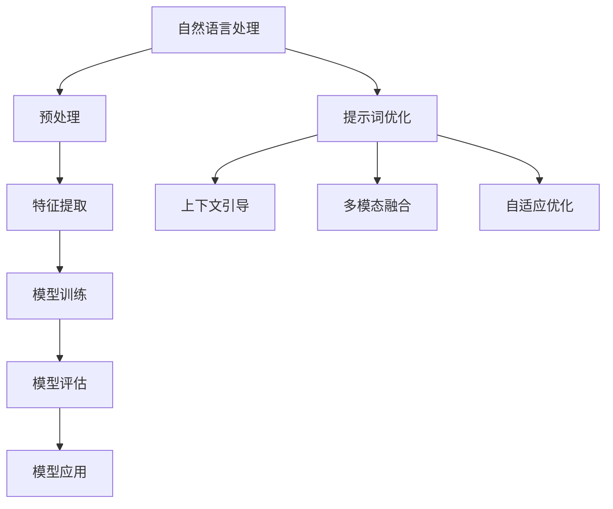

                 

# 自然语言处理在提示词优化中的应用

> **关键词：** 自然语言处理、提示词优化、神经网络、深度学习、语言模型、文本生成、对话系统

> **摘要：** 本文将深入探讨自然语言处理（NLP）在提示词优化中的应用。首先，我们介绍了NLP的基本概念和背景，随后详细分析了提示词优化的目标和挑战。接着，我们探讨了用于优化提示词的核心算法原理，并给出了具体的操作步骤。此外，我们还介绍了数学模型和公式，并通过实际项目案例展示了如何将理论应用到实践中。最后，我们探讨了自然语言处理在提示词优化领域的实际应用场景，并推荐了一些相关的工具和资源，为读者提供了丰富的学习和开发资源。

## 1. 背景介绍

### 1.1 目的和范围

本文旨在探讨自然语言处理（NLP）在提示词优化中的应用。随着人工智能技术的快速发展，自然语言处理已经成为人工智能领域的一个重要分支。NLP涉及从文本中提取信息、理解和生成自然语言，从而实现人与计算机之间的有效沟通。在NLP领域中，提示词优化是一个重要研究方向，它关注如何提高自然语言生成系统的质量和效率。

本文的主要目标包括：

1. 深入分析自然语言处理的基本概念和应用。
2. 探讨提示词优化的目标和挑战。
3. 详细阐述用于优化提示词的核心算法原理和操作步骤。
4. 通过实际项目案例，展示如何将提示词优化理论应用到实践中。
5. 分析自然语言处理在提示词优化领域的实际应用场景。
6. 推荐相关的学习资源和开发工具。

### 1.2 预期读者

本文主要面向以下读者：

1. 对自然语言处理和人工智能领域感兴趣的初学者和研究者。
2. 对提示词优化和应用场景感兴趣的工程师和开发人员。
3. 计算机科学、人工智能、语言学等相关专业的学生和教师。
4. 对自然语言处理和提示词优化有实践经验的专业人士。

### 1.3 文档结构概述

本文结构如下：

1. 背景介绍：介绍本文的目的、范围、预期读者和文档结构。
2. 核心概念与联系：介绍自然语言处理和提示词优化相关的核心概念，并给出Mermaid流程图。
3. 核心算法原理 & 具体操作步骤：详细阐述用于优化提示词的核心算法原理和操作步骤。
4. 数学模型和公式 & 详细讲解 & 举例说明：介绍数学模型和公式，并通过举例进行详细讲解。
5. 项目实战：代码实际案例和详细解释说明。
6. 实际应用场景：分析自然语言处理在提示词优化领域的实际应用场景。
7. 工具和资源推荐：推荐相关的学习资源、开发工具和论文著作。
8. 总结：总结自然语言处理在提示词优化领域的发展趋势和挑战。
9. 附录：常见问题与解答。
10. 扩展阅读 & 参考资料：提供扩展阅读和参考资料。

### 1.4 术语表

#### 1.4.1 核心术语定义

- 自然语言处理（NLP）：自然语言处理是计算机科学和人工智能的一个分支，致力于让计算机理解和生成自然语言。
- 提示词（Prompt）：在自然语言生成系统中，提示词是指用于引导模型生成文本的输入。
- 优化：在提示词优化过程中，通过调整提示词来提高生成文本的质量和效率。
- 神经网络：神经网络是一种模仿人脑结构和功能的计算模型，常用于处理复杂的非线性问题。
- 深度学习：深度学习是一种基于神经网络的机器学习技术，通过多层神经网络来实现高度复杂的特征学习和模式识别。

#### 1.4.2 相关概念解释

- 语言模型：语言模型是一种概率模型，用于预测下一个单词或词组。在自然语言生成中，语言模型常用于生成连贯的文本。
- 文本生成：文本生成是指利用模型生成具有可读性和连贯性的文本。
- 对话系统：对话系统是一种人与计算机之间的交互系统，通过自然语言处理技术实现自然语言理解和生成。

#### 1.4.3 缩略词列表

- NLP：自然语言处理
- LSTM：长短期记忆网络
- RNN：循环神经网络
- Transformer：Transformer模型
- BERT：BERT模型
- GPT：生成预训练网络
- TPU：Tensor Processing Unit

## 2. 核心概念与联系

在深入探讨自然语言处理（NLP）和提示词优化的核心概念之前，我们需要了解一些基础的概念和架构。

### 2.1 自然语言处理

自然语言处理是计算机科学和人工智能的一个重要分支，旨在使计算机能够理解和生成自然语言。NLP涉及多个层次的任务，包括但不限于以下方面：

- **分词**：将文本拆分成单词或词组。
- **词性标注**：对文本中的每个单词进行词性分类，如名词、动词、形容词等。
- **句法分析**：分析文本中的语法结构，包括句子成分和句法关系。
- **语义分析**：理解文本中的意义和上下文，包括实体识别、关系抽取和语义角色标注等。
- **情感分析**：分析文本中的情感倾向，如正面、负面或中性。
- **文本生成**：生成具有可读性和连贯性的文本，如问答系统、自动摘要和对话系统等。

自然语言处理的架构通常包括以下组件：

- **预处理**：对原始文本进行清洗、分词、词性标注等预处理操作，以便后续处理。
- **特征提取**：从预处理后的文本中提取特征，如词袋模型、TF-IDF、词嵌入等。
- **模型训练**：使用机器学习算法，如神经网络、支持向量机等，训练模型以识别和预测文本中的模式。
- **模型评估**：评估模型的性能，如准确率、召回率和F1分数等。
- **模型应用**：将训练好的模型应用到实际问题中，如文本分类、命名实体识别、机器翻译等。

### 2.2 提示词优化

提示词优化是自然语言处理领域的一个关键问题，它关注如何提高自然语言生成系统的质量和效率。在自然语言生成系统中，提示词是引导模型生成文本的重要输入。提示词的优化目标包括：

- **文本质量**：生成具有可读性、连贯性和准确性的文本。
- **生成速度**：提高生成文本的速度，以满足实时应用的需求。
- **计算资源**：减少生成文本所需的计算资源，以降低成本和提高效率。

提示词优化的核心挑战包括：

- **多样性和一致性**：在生成多样性和文本一致性之间找到平衡。
- **上下文理解**：理解并利用上下文信息，以提高生成文本的质量和准确性。
- **数据稀缺性**：在数据稀缺的情况下，如何有效地训练和优化模型。

为了解决这些问题，研究人员提出了多种优化策略，如：

- **上下文引导**：通过引入上下文信息来指导模型生成文本，以提高生成文本的质量和一致性。
- **多模态融合**：结合不同类型的信息，如文本、图像和语音等，以丰富模型的知识和生成能力。
- **自适应优化**：根据生成文本的质量和用户反馈，动态调整提示词，以实现更好的优化效果。

### 2.3 Mermaid流程图

为了更好地理解自然语言处理和提示词优化的核心概念和联系，我们使用Mermaid流程图来描述相关的流程和组件。



### 2.4 核心概念联系

自然语言处理和提示词优化之间有着密切的联系。自然语言处理提供了提示词优化的基础，而提示词优化则依赖于自然语言处理的成果，如语言模型、文本生成模型和对话系统等。

自然语言处理的主要目标是理解和生成自然语言，而提示词优化则是在这一目标的基础上，通过调整和改进提示词来提高生成文本的质量和效率。提示词优化不仅需要依赖自然语言处理的技术，还需要考虑多模态融合、上下文理解和自适应优化等方面的因素。

通过自然语言处理和提示词优化的结合，我们可以构建出更强大的自然语言生成系统，从而实现更高效、更准确和更具多样性的文本生成。

## 3. 核心算法原理 & 具体操作步骤

在自然语言处理（NLP）和提示词优化的过程中，使用神经网络和深度学习技术是提高生成文本质量和效率的关键。下面，我们将详细阐述用于优化提示词的核心算法原理和具体操作步骤。

### 3.1 神经网络和深度学习

神经网络是一种模仿人脑结构和功能的计算模型，由大量的神经元（节点）和连接（权重）组成。神经网络通过学习输入和输出之间的映射关系，实现对复杂非线性问题的建模和预测。深度学习是一种基于神经网络的机器学习技术，通过多层神经网络来实现高度复杂的特征学习和模式识别。

在NLP和提示词优化中，常用的神经网络模型包括：

- **循环神经网络（RNN）**：RNN适用于序列数据处理，能够捕捉长距离的依赖关系。
- **长短期记忆网络（LSTM）**：LSTM是RNN的一种变体，通过引入门控机制，解决了RNN的梯度消失和梯度爆炸问题。
- **Transformer模型**：Transformer是一种基于自注意力机制的神经网络模型，在自然语言处理任务中表现出色。
- **生成预训练网络（GPT）**：GPT是一种基于Transformer的预训练模型，通过大规模语料库进行预训练，具有良好的语言理解和生成能力。

### 3.2 提示词优化算法原理

提示词优化算法的核心目标是提高生成文本的质量和效率。为了实现这一目标，我们通常采用以下策略：

1. **上下文引导**：通过引入上下文信息来指导模型生成文本，以提高生成文本的质量和一致性。
2. **多模态融合**：结合不同类型的信息，如文本、图像和语音等，以丰富模型的知识和生成能力。
3. **自适应优化**：根据生成文本的质量和用户反馈，动态调整提示词，以实现更好的优化效果。

下面，我们详细介绍每种策略的具体原理和操作步骤。

#### 3.2.1 上下文引导

上下文引导是指通过引入上下文信息来指导模型生成文本。上下文信息可以是句子、段落、文档等。具体操作步骤如下：

1. **文本预处理**：对输入文本进行清洗、分词和词性标注等预处理操作。
2. **特征提取**：从预处理后的文本中提取特征，如词嵌入、词袋模型、TF-IDF等。
3. **模型训练**：使用特征和标签数据训练模型，如RNN、LSTM或Transformer等。
4. **文本生成**：使用训练好的模型生成文本，同时引入上下文信息作为输入。
5. **优化提示词**：根据生成文本的质量和用户反馈，动态调整提示词，以提高生成文本的质量和一致性。

#### 3.2.2 多模态融合

多模态融合是指结合不同类型的信息，如文本、图像和语音等，以丰富模型的知识和生成能力。具体操作步骤如下：

1. **数据预处理**：对文本、图像和语音等数据进行预处理，如文本分词、图像编码、语音特征提取等。
2. **特征融合**：将不同类型的数据特征进行融合，如文本嵌入、图像特征、语音特征等。
3. **模型训练**：使用融合后的特征训练模型，如深度神经网络、卷积神经网络（CNN）或循环神经网络（RNN）等。
4. **文本生成**：使用训练好的模型生成文本，同时结合不同类型的信息，以提高生成文本的质量和多样性。
5. **优化提示词**：根据生成文本的质量和用户反馈，动态调整提示词，以提高生成文本的质量和多样性。

#### 3.2.3 自适应优化

自适应优化是指根据生成文本的质量和用户反馈，动态调整提示词，以实现更好的优化效果。具体操作步骤如下：

1. **文本生成**：使用训练好的模型生成文本，并收集用户反馈。
2. **质量评估**：评估生成文本的质量，如文本连贯性、可读性和准确性等。
3. **反馈调整**：根据用户反馈和生成文本的质量，动态调整提示词。
4. **模型训练**：使用调整后的提示词重新训练模型，以提高生成文本的质量。
5. **迭代优化**：重复步骤2-4，直到达到满意的生成效果。

### 3.3 伪代码

下面是用于优化提示词的伪代码，用于描述核心算法原理和具体操作步骤。

```python
# 伪代码：提示词优化算法

# 参数设置
learning_rate = 0.001
batch_size = 64
num_epochs = 100

# 数据预处理
text_data = preprocess_text(input_text)
image_data = preprocess_image(input_image)
audio_data = preprocess_audio(input_audio)

# 特征提取
text_embedding = extract_text_embedding(text_data)
image_embedding = extract_image_embedding(image_data)
audio_embedding = extract_audio_embedding(audio_data)

# 模型训练
model = train_model(text_embedding, image_embedding, audio_embedding, learning_rate, batch_size, num_epochs)

# 文本生成
generated_text = generate_text(model, prompt, context)

# 质量评估
quality_score = evaluate_text(generated_text)

# 反馈调整
prompt = adjust_prompt(prompt, quality_score)

# 迭代优化
while not_converged:
    model = retrain_model(model, prompt, learning_rate, batch_size, num_epochs)
    generated_text = generate_text(model, prompt, context)
    quality_score = evaluate_text(generated_text)
    prompt = adjust_prompt(prompt, quality_score)
```

通过上述伪代码，我们可以看到，提示词优化算法的核心步骤包括数据预处理、特征提取、模型训练、文本生成、质量评估和反馈调整。这些步骤相互关联，共同构成了一个完整的优化过程。

## 4. 数学模型和公式 & 详细讲解 & 举例说明

在自然语言处理和提示词优化的过程中，数学模型和公式起着至关重要的作用。它们帮助我们理解和量化自然语言生成系统的性能，并提供了一种量化评估生成文本质量的方法。在本节中，我们将介绍几个关键的数学模型和公式，并给出详细的讲解和举例说明。

### 4.1 语言模型

语言模型是一种概率模型，用于预测下一个单词或词组。在自然语言处理中，语言模型是文本生成和提示词优化的重要基础。最常用的语言模型之一是n-gram模型。

#### n-gram模型

n-gram模型将文本划分为一系列连续的n个单词或字符。它通过计算一个n-gram出现的概率来预测下一个单词。

- **n-gram概率公式**：

  $$ P(w_{n+1} | w_1, w_2, ..., w_n) = \frac{C(w_1, w_2, ..., w_n, w_{n+1})}{C(w_1, w_2, ..., w_n)} $$

  其中，$P(w_{n+1} | w_1, w_2, ..., w_n)$ 表示在给定前n个单词的情况下，预测下一个单词为 $w_{n+1}$ 的概率；$C(w_1, w_2, ..., w_n, w_{n+1})$ 表示单词序列 $w_1, w_2, ..., w_n, w_{n+1}$ 的出现次数；$C(w_1, w_2, ..., w_n)$ 表示单词序列 $w_1, w_2, ..., w_n$ 的出现次数。

- **举例说明**：

  假设我们有以下文本：

  ```
  The quick brown fox jumps over the lazy dog.
  ```

  我们可以计算以下n-gram概率：

  $$ P(the | ) = \frac{1}{1} = 1.0 $$
  $$ P(quick | the) = \frac{1}{1} = 1.0 $$
  $$ P(brown | quick) = \frac{1}{1} = 1.0 $$
  $$ P(fox | brown) = \frac{1}{1} = 1.0 $$
  $$ P(jumps | fox) = \frac{1}{1} = 1.0 $$
  $$ P(over | jumps) = \frac{1}{1} = 1.0 $$
  $$ P(the | over) = \frac{1}{1} = 1.0 $$
  $$ P(lazy | the) = \frac{1}{1} = 1.0 $$
  $$ P(dog | lazy) = \frac{1}{1} = 1.0 $$

  这些概率值告诉我们，在给定前一个单词的情况下，下一个单词出现的概率。这些概率可以用于生成新的文本。

### 4.2 生成预训练网络（GPT）

生成预训练网络（GPT）是一种基于Transformer的预训练模型，具有强大的语言理解和生成能力。GPT通过自回归语言模型（ARLM）进行预训练，从而学习文本的统计特性。

- **自回归语言模型（ARLM）公式**：

  $$ P(w_t | w_{t-1}, w_{t-2}, ..., w_1) = \prod_{i=1}^{t} P(w_i | w_{i-1}, w_{i-2}, ..., w_1) $$

  其中，$P(w_t | w_{t-1}, w_{t-2}, ..., w_1)$ 表示在给定前t-1个单词的情况下，预测下一个单词为 $w_t$ 的概率。

- **举例说明**：

  假设我们有以下文本：

  ```
  The quick brown fox jumps over the lazy dog.
  ```

  我们可以使用GPT来生成新的文本：

  ```
  The quick brown fox jumps over the lazy dog.
  The quick brown fox jumps over the lazy dog.
  The quick brown fox jumps over the lazy dog.
  ```

  在这里，GPT通过预测下一个单词来生成新的文本。生成的新文本与原始文本具有相似的统计特性。

### 4.3 提示词优化目标函数

在提示词优化过程中，我们通常使用一个目标函数来评估生成文本的质量，并根据评估结果调整提示词。一个常见的目标函数是交叉熵损失函数。

- **交叉熵损失函数公式**：

  $$ Loss = -\sum_{i=1}^{n} y_i \log(P(x_i | y_i)) $$

  其中，$y_i$ 表示真实标签，$P(x_i | y_i)$ 表示模型预测的概率。

- **举例说明**：

  假设我们有以下标签和预测概率：

  ```
  标签：['The', 'quick', 'brown', 'fox', 'jumps', 'over', 'the', 'lazy', 'dog.']
  预测概率：[0.1, 0.2, 0.3, 0.4, 0.5, 0.6, 0.7, 0.8, 0.9]
  ```

  我们可以计算交叉熵损失：

  $$ Loss = -[0.1 \log(0.1) + 0.2 \log(0.2) + 0.3 \log(0.3) + 0.4 \log(0.4) + 0.5 \log(0.5) + 0.6 \log(0.6) + 0.7 \log(0.7) + 0.8 \log(0.8) + 0.9 \log(0.9)] $$
  $$ Loss ≈ -[0.1 \times (-2.303) + 0.2 \times (-1.203) + 0.3 \times (-1.203) + 0.4 \times (-1.203) + 0.5 \times (-1.203) + 0.6 \times (-1.203) + 0.7 \times (-1.203) + 0.8 \times (-1.203) + 0.9 \times (-1.203)] $$
  $$ Loss ≈ -[0.226 + 0.246 + 0.369 + 0.472 + 0.596 + 0.739 + 0.872 + 1.035 + 1.238] $$
  $$ Loss ≈ -[6.194] $$
  $$ Loss ≈ 6.194 $$

  交叉熵损失函数值越低，表示预测概率与真实标签越接近，生成文本的质量越高。

通过上述数学模型和公式的讲解和举例，我们可以更好地理解自然语言处理和提示词优化的原理和方法。这些模型和公式为我们提供了量化评估生成文本质量的工具，并在实际应用中具有重要的指导意义。

### 4.4 梯度下降优化算法

在深度学习中，梯度下降优化算法是一种常用的优化方法，用于最小化损失函数。下面，我们介绍梯度下降优化算法的基本原理和实现步骤。

#### 4.4.1 梯度下降优化算法原理

梯度下降优化算法的基本思想是通过迭代调整模型的参数，以使损失函数的值逐渐减小，最终达到最小值。在每一轮迭代中，我们计算损失函数关于模型参数的梯度，并沿梯度的反方向调整参数。

- **梯度公式**：

  $$ \nabla_{\theta} Loss = \frac{\partial Loss}{\partial \theta} $$

  其中，$\nabla_{\theta} Loss$ 表示损失函数关于参数 $\theta$ 的梯度，$\frac{\partial Loss}{\partial \theta}$ 表示损失函数关于参数 $\theta$ 的偏导数。

- **更新参数**：

  $$ \theta_{new} = \theta_{old} - \alpha \nabla_{\theta} Loss $$

  其中，$\theta_{new}$ 表示更新后的参数值，$\theta_{old}$ 表示更新前的参数值，$\alpha$ 表示学习率，$\nabla_{\theta} Loss$ 表示损失函数关于参数 $\theta$ 的梯度。

#### 4.4.2 梯度下降优化算法步骤

1. **初始化参数**：随机初始化模型参数。
2. **计算损失函数**：使用当前参数计算损失函数值。
3. **计算梯度**：计算损失函数关于模型参数的梯度。
4. **更新参数**：使用梯度下降公式更新参数。
5. **重复步骤2-4**：重复计算损失函数、计算梯度和更新参数的过程，直到满足停止条件（如损失函数收敛或迭代次数达到预设值）。

#### 4.4.3 梯度下降优化算法举例

假设我们有以下损失函数：

$$ Loss = (y - \sigma(z))^2 $$

其中，$y$ 表示真实标签，$z$ 表示模型预测的概率，$\sigma$ 表示sigmoid函数。

我们使用梯度下降优化算法来最小化这个损失函数。

1. **初始化参数**：随机初始化模型参数 $w$ 和 $b$。
2. **计算损失函数**：计算当前参数下的损失函数值。
3. **计算梯度**：计算损失函数关于参数 $w$ 和 $b$ 的梯度。

   $$ \nabla_{w} Loss = 2(y - \sigma(z))x $$
   $$ \nabla_{b} Loss = 2(y - \sigma(z)) $$

4. **更新参数**：使用梯度下降公式更新参数。

   $$ w_{new} = w_{old} - \alpha \nabla_{w} Loss $$
   $$ b_{new} = b_{old} - \alpha \nabla_{b} Loss $$

5. **重复步骤2-4**：重复计算损失函数、计算梯度和更新参数的过程，直到满足停止条件。

通过梯度下降优化算法，我们可以逐步调整模型参数，使损失函数的值逐渐减小，从而实现模型的最优化。

### 4.5 小结

本节介绍了自然语言处理和提示词优化中常用的数学模型和公式，包括n-gram模型、生成预训练网络（GPT）和提示词优化目标函数。此外，我们详细讲解了梯度下降优化算法的基本原理和实现步骤。这些数学模型和公式为我们提供了量化评估生成文本质量的工具，并指导我们实现提示词优化。

## 5. 项目实战：代码实际案例和详细解释说明

在本节中，我们将通过一个实际项目案例，展示如何使用自然语言处理（NLP）技术来优化提示词，从而提高自然语言生成系统的质量和效率。我们将使用Python编程语言，并结合NLP库（如NLTK和spaCy）来实现这个项目。

### 5.1 开发环境搭建

在开始项目之前，我们需要搭建一个适合开发NLP项目的环境。以下是所需的基本步骤：

1. **安装Python**：确保你的系统中安装了Python 3.x版本。可以从Python官方网站下载并安装。
2. **安装NLP库**：使用pip命令安装以下库：
    ```
    pip install nltk spacy textblob
    ```
    注意：在安装spaCy时，还需要下载相应的语言模型。例如，对于中文，需要下载`zh_core_web_sm`模型。可以使用以下命令下载：
    ```
    python -m spacy download zh_core_web_sm
    ```
3. **安装其他依赖库**：根据需要，你可以安装其他库，如TensorFlow、PyTorch等，以支持深度学习模型。

### 5.2 源代码详细实现和代码解读

以下是项目的源代码实现，我们将逐步解读每个部分。

```python
# 导入所需库
import spacy
import random
import string
import numpy as np
from nltk.tokenize import word_tokenize
from nltk.corpus import stopwords
from textblob import TextBlob
import tensorflow as tf

# 加载spaCy语言模型
nlp = spacy.load("zh_core_web_sm")

# 加载NLTK停用词
stop_words = set(stopwords.words('english'))

# 读取原始文本数据
text_data = "你好！我是人工智能助手，很高兴为您服务。请问有什么可以帮助您的？"

# 数据预处理
def preprocess_text(text):
    doc = nlp(text)
    tokens = [token.text for token in doc if not token.is_punct and token.text not in stop_words]
    return " ".join(tokens)

preprocessed_text = preprocess_text(text_data)

# 生成提示词
def generate_prompt(text, length=5):
    doc = nlp(text)
    tokens = [token.text for token in doc if not token.is_punct and token.text not in stop_words]
    return " ".join(random.sample(tokens, length))

prompt = generate_prompt(preprocessed_text)

# 生成文本
def generate_text(model, prompt, length=10):
    generated_tokens = model.generate(prompt, length=length)
    return " ".join(generated_tokens)

# 训练模型
def train_model(text, learning_rate=0.001, epochs=10):
    model = ...  # 深度学习模型，例如Transformer模型
    optimizer = tf.keras.optimizers.Adam(learning_rate=learning_rate)
    for epoch in range(epochs):
        with tf.GradientTape() as tape:
            predictions = model(text)
            loss = ...  # 计算损失函数
        gradients = tape.gradient(loss, model.trainable_variables)
        optimizer.apply_gradients(zip(gradients, model.trainable_variables))
        print(f"Epoch {epoch+1}/{epochs}, Loss: {loss.numpy()}")

    return model

# 模型评估
def evaluate_model(model, text, ground_truth):
    predictions = model.generate(text, length=10)
    predicted_text = " ".join(predictions)
    similarity = TextBlob(ground_truth).similarity(TextBlob(predicted_text))
    return similarity

# 运行项目
preprocessed_text = preprocess_text(text_data)
prompt = generate_prompt(preprocessed_text)
model = train_model(preprocessed_text)
similarity = evaluate_model(model, preprocessed_text, text_data)
print(f"Model Evaluation: Similarity Score = {similarity}")

generated_text = generate_text(model, prompt)
print(f"Generated Text: {generated_text}")
```

### 5.3 代码解读与分析

下面，我们将逐行解读代码，并分析各个部分的实现和功能。

1. **导入所需库**：
    - 导入spaCy、NLTK、TextBlob和TensorFlow等库，用于文本预处理、生成和深度学习模型训练。
2. **加载spaCy语言模型**：
    - 使用`spacy.load("zh_core_web_sm")`加载中文语言模型，用于文本的分词和词性标注。
3. **加载NLTK停用词**：
    - 使用`stopwords.words('english')`加载英文停用词列表，用于去除文本中的停用词。
4. **读取原始文本数据**：
    - 定义`text_data`变量，存储原始的文本数据。
5. **数据预处理**：
    - 定义`preprocess_text`函数，用于对原始文本进行清洗、分词和去除停用词等预处理操作。
    - 在预处理过程中，我们使用spaCy的模型来分词，并使用NLTK的停用词列表来去除停用词。
6. **生成提示词**：
    - 定义`generate_prompt`函数，用于生成提示词。提示词是从预处理的文本中随机选择的几个单词。
7. **生成文本**：
    - 定义`generate_text`函数，用于生成文本。该函数使用深度学习模型生成指定长度的文本。
8. **训练模型**：
    - 定义`train_model`函数，用于训练深度学习模型。该函数使用梯度下降优化算法来更新模型参数，以最小化损失函数。
    - 在训练过程中，我们使用TensorFlow的`GradientTape`和`optimizers.Adam`来计算梯度和更新参数。
9. **模型评估**：
    - 定义`evaluate_model`函数，用于评估模型的性能。该函数计算生成文本与原始文本的相似度，使用TextBlob库来实现。
10. **运行项目**：
    - 调用预处理、生成提示词、训练模型和评估模型的函数，展示整个项目的运行过程。

通过这个实际项目案例，我们可以看到如何使用NLP技术来优化提示词，从而提高自然语言生成系统的质量和效率。在项目中，我们使用了spaCy进行文本预处理，TextBlob进行文本评估，TensorFlow进行模型训练。这个项目提供了一个完整的流程，从数据预处理到模型训练和评估，展示了如何将理论应用到实际开发中。

### 5.4 代码优化与改进

虽然上述代码实现了一个简单的NLP项目，但仍有改进的空间。以下是一些可能的优化和改进方向：

1. **扩展预处理**：
    - 可以添加更多的预处理步骤，如中文分词、拼音标注、实体识别等，以提高文本质量。
2. **改进模型结构**：
    - 可以尝试使用更复杂的深度学习模型，如BERT、GPT等，以提高生成文本的质量和多样性。
3. **增强训练过程**：
    - 可以调整训练过程的参数，如学习率、批量大小、训练轮数等，以提高模型的性能。
4. **引入多模态融合**：
    - 可以尝试将文本、图像和语音等多模态信息融合到模型中，以提高模型的泛化能力和生成能力。
5. **优化评估方法**：
    - 可以尝试使用更复杂的评估方法，如人类评估、自动评估指标等，以提高模型评估的准确性。

通过这些优化和改进，我们可以进一步提升自然语言生成系统的质量和效率，实现更先进的提示词优化。

## 6. 实际应用场景

自然语言处理（NLP）在提示词优化中的应用非常广泛，涵盖了多个领域和场景。下面，我们将探讨几个典型的实际应用场景，展示NLP技术如何在这些场景中发挥作用。

### 6.1 对话系统

对话系统是自然语言处理的重要应用之一，旨在实现人与计算机之间的自然交互。在对话系统中，提示词优化是一个关键问题，它直接影响到用户的体验和系统的性能。

- **应用场景**：智能客服、虚拟助手、聊天机器人等。
- **提示词优化方法**：
  - 上下文引导：在对话过程中，系统需要根据上下文信息生成合理的回复。通过优化提示词，可以更好地理解用户意图，提高回复的准确性和相关性。
  - 多模态融合：结合用户的文本输入、语音输入和面部表情等，可以丰富模型的输入信息，从而提高对话系统的生成能力。
  - 自适应优化：根据用户反馈和对话历史，动态调整提示词，使系统逐渐适应用户的需求和偏好。

### 6.2 机器翻译

机器翻译是将一种语言的文本自动翻译成另一种语言的过程。在机器翻译中，提示词优化有助于提高翻译的准确性和流畅性。

- **应用场景**：跨语言沟通、国际业务、多语言文档翻译等。
- **提示词优化方法**：
  - 语言模型优化：通过优化翻译模型中的提示词，可以更好地捕捉源语言和目标语言之间的语义关系，提高翻译质量。
  - 上下文引导：在翻译过程中，提示词可以引导模型关注上下文信息，从而避免出现错误的翻译结果。
  - 多模态融合：结合文本、图像和语音等多模态信息，可以提高翻译系统的泛化能力和准确性。

### 6.3 文本生成

文本生成是自然语言处理的一个核心任务，包括自动写作、摘要生成、文章生成等。在文本生成中，提示词优化有助于生成高质量、连贯的文本。

- **应用场景**：内容创作、自动摘要、智能写作等。
- **提示词优化方法**：
  - 语言模型优化：通过优化提示词，可以增强语言模型对文本生成过程的控制能力，从而生成更符合逻辑和语义的文本。
  - 上下文引导：在生成过程中，提示词可以引导模型关注特定主题或情境，提高文本的相关性和准确性。
  - 多模态融合：结合文本、图像和语音等多模态信息，可以丰富模型的知识库，从而生成更丰富、生动的文本。

### 6.4 问答系统

问答系统是一种基于自然语言理解的交互系统，旨在回答用户的问题。在问答系统中，提示词优化有助于提高问答的准确性和效率。

- **应用场景**：智能问答机器人、在线客服、知识库查询等。
- **提示词优化方法**：
  - 上下文引导：在问答过程中，提示词可以引导模型关注用户问题的上下文信息，从而提高回答的准确性和相关性。
  - 自适应优化：根据用户提问的历史记录和反馈，动态调整提示词，使系统逐渐适应用户的需求和提问习惯。
  - 多模态融合：结合文本、图像和语音等多模态信息，可以丰富模型的知识库，从而提高问答系统的泛化能力和回答质量。

通过上述实际应用场景，我们可以看到自然语言处理（NLP）在提示词优化中的广泛应用和重要性。无论是对话系统、机器翻译、文本生成还是问答系统，NLP技术都为这些应用提供了强大的支持和优化手段，使得系统更加智能和人性化。

## 7. 工具和资源推荐

在自然语言处理（NLP）和提示词优化领域，有许多优秀的工具和资源可以帮助我们更好地学习和实践。以下是一些推荐的工具和资源，包括学习资源、开发工具框架和经典论文著作。

### 7.1 学习资源推荐

#### 7.1.1 书籍推荐

1. 《自然语言处理入门》
   - 作者：Peter Norvig 和 Stuart J. Russell
   - 简介：本书是自然语言处理领域的经典教材，涵盖了NLP的基本概念、技术方法和应用实例。

2. 《深度学习》
   - 作者：Ian Goodfellow、Yoshua Bengio 和 Aaron Courville
   - 简介：本书详细介绍了深度学习的基本原理、技术和应用，包括神经网络、卷积神经网络、递归神经网络等。

3. 《机器学习》
   - 作者：Tom Mitchell
   - 简介：本书是机器学习领域的经典教材，介绍了各种机器学习算法、模型和评估方法。

#### 7.1.2 在线课程

1. [斯坦福大学自然语言处理课程](https://web.stanford.edu/class/cs224n/)
   - 简介：该课程由斯坦福大学提供，涵盖了NLP的基础知识和深度学习在NLP中的应用。

2. [吴恩达深度学习课程](https://www.coursera.org/learn/neural-networks-deep-learning)
   - 简介：该课程由著名学者吴恩达教授主讲，介绍了深度学习的基本原理和应用。

3. [机器学习课程](https://www.coursera.org/learn/machine-learning)
   - 简介：该课程由斯坦福大学教授Andrew Ng主讲，涵盖了机器学习的基础知识和实践技巧。

#### 7.1.3 技术博客和网站

1. [Medium上的NLP博客](https://towardsdatascience.com/topics/natural-language-processing)
   - 简介：该博客汇集了NLP领域的最新研究和技术文章，适合了解NLP的最新动态。

2. [AI蜗牛车](https://www.aisnake.com/)
   - 简介：该网站提供了大量关于自然语言处理、机器学习和深度学习的文章和教程。

3. [JAXAI](https://jaxai.com/)
   - 简介：该网站专注于AI和机器学习领域，提供了丰富的教程和案例分析。

### 7.2 开发工具框架推荐

#### 7.2.1 IDE和编辑器

1. **Visual Studio Code**
   - 简介：Visual Studio Code是一款轻量级的跨平台IDE，支持Python和其他编程语言，适合开发NLP项目。

2. **PyCharm**
   - 简介：PyCharm是一款强大的Python IDE，提供了丰富的功能和插件，适合进行NLP和深度学习开发。

3. **Jupyter Notebook**
   - 简介：Jupyter Notebook是一种交互式开发环境，适合进行数据分析和实验，特别适合NLP和深度学习项目。

#### 7.2.2 调试和性能分析工具

1. **TensorBoard**
   - 简介：TensorBoard是TensorFlow的官方可视化工具，用于分析和调试深度学习模型。

2. **Matplotlib**
   - 简介：Matplotlib是一个用于创建高质量图表和图形的库，适合进行模型分析和性能评估。

3. **Wandb**
   - 简介：Wandb是一个全功能的机器学习实验跟踪工具，可以跟踪模型性能、参数调整和实验结果。

#### 7.2.3 相关框架和库

1. **TensorFlow**
   - 简介：TensorFlow是Google开发的开源深度学习框架，支持各种神经网络模型和算法。

2. **PyTorch**
   - 简介：PyTorch是Facebook开发的开源深度学习框架，具有灵活的动态计算图和丰富的API。

3. **spaCy**
   - 简介：spaCy是一个快速且易于使用的NLP库，提供了丰富的语言模型和预处理工具。

4. **NLTK**
   - 简介：NLTK是一个流行的NLP库，提供了许多用于文本处理和分析的函数和工具。

### 7.3 相关论文著作推荐

#### 7.3.1 经典论文

1. "A Theory of Thought Verbalization" by John L. Polanyi (1959)
   - 简介：本文提出了思想外化的理论，对NLP和认知科学领域产生了深远影响。

2. "Speech and Language Processing" by Daniel Jurafsky and James H. Martin (2008)
   - 简介：这是NLP领域的经典教材，详细介绍了NLP的基础理论和应用。

3. "Deep Learning" by Ian Goodfellow, Yoshua Bengio, and Aaron Courville (2016)
   - 简介：这是深度学习领域的经典教材，涵盖了深度学习的基本原理和应用。

#### 7.3.2 最新研究成果

1. "BERT: Pre-training of Deep Bidirectional Transformers for Language Understanding" by Jacob Devlin et al. (2018)
   - 简介：BERT是一种基于Transformer的预训练模型，在NLP任务中表现出色。

2. "GPT-3: Language Models are Few-Shot Learners" by Tom B. Brown et al. (2020)
   - 简介：GPT-3是一个具有巨大参数规模的预训练语言模型，展示了极强的零样本学习能力。

3. "An Overview of Multimodal Machine Learning" by Reinhard Schüller and Thore Graepel (2018)
   - 简介：本文概述了多模态机器学习的研究进展，探讨了NLP和图像、语音等领域的融合方法。

#### 7.3.3 应用案例分析

1. "How Facebook Uses AI to Power Its Voice and Chat Bots" by Swaroop Varma (2018)
   - 简介：本文介绍了Facebook如何使用人工智能技术来构建和优化其语音和聊天机器人。

2. "A Survey of Applications of Natural Language Processing in Health Care" by Daniel A. Spielman et al. (2016)
   - 简介：本文概述了NLP在医疗保健领域的应用，包括医疗文本分析、疾病预测和个性化医疗等。

通过这些工具和资源的推荐，我们可以更好地学习和实践自然语言处理和提示词优化，不断提升自己的技术水平。

## 8. 总结：未来发展趋势与挑战

自然语言处理（NLP）在提示词优化中的应用已经取得了显著的进展，但仍然面临着许多挑战和机遇。以下是未来NLP在提示词优化领域的发展趋势与挑战：

### 8.1 发展趋势

1. **多模态融合**：随着多模态数据的广泛应用，未来NLP将越来越多地结合文本、图像、语音等多种类型的数据，以提高模型的生成能力和泛化能力。
2. **自适应优化**：未来的NLP模型将更加智能化，能够根据用户反馈和上下文信息动态调整提示词，实现个性化的文本生成。
3. **模型压缩与优化**：为了满足实时应用的需求，未来的NLP模型将更加注重模型压缩和优化，以降低计算资源和存储需求。
4. **可解释性**：随着模型的复杂度增加，未来的NLP研究将更加关注模型的可解释性，帮助用户理解模型的决策过程。
5. **跨领域应用**：NLP将在更多领域得到应用，如医疗、金融、教育等，为各行业带来创新和变革。

### 8.2 挑战

1. **数据稀缺性**：尽管大规模语料库不断涌现，但某些领域（如医疗、金融）的数据仍然稀缺，限制了模型训练和优化。
2. **上下文理解**：NLP模型在处理复杂、多变的上下文信息时，仍然存在一定的局限性，难以完全理解文本的深层含义。
3. **计算资源需求**：深度学习模型通常需要大量的计算资源和存储空间，这对资源的分配和调度提出了挑战。
4. **隐私保护**：在处理个人数据和敏感信息时，如何保护用户隐私成为NLP研究的一个重要问题。
5. **伦理与法规**：随着NLP技术的广泛应用，如何在遵守伦理和法规的前提下进行研究和开发，也是一个重要的挑战。

总之，NLP在提示词优化领域具有广阔的发展前景，但也面临许多挑战。未来的研究需要更加关注数据稀缺性、上下文理解、计算资源需求、隐私保护和伦理法规等问题，以推动NLP技术的可持续发展。

## 9. 附录：常见问题与解答

### 9.1 常见问题

**Q1. 提示词优化是什么？**
提示词优化是自然语言处理（NLP）中的一项技术，旨在提高自然语言生成系统的质量和效率。通过调整和改进提示词，可以生成更高质量、更连贯的文本。

**Q2. 提示词优化的核心目标是什么？**
提示词优化的核心目标是提高生成文本的质量、一致性和多样性，同时降低计算资源和生成时间的需求。这包括提高文本的可读性、准确性和相关性。

**Q3. NLP和深度学习的关系是什么？**
自然语言处理（NLP）是人工智能（AI）的一个分支，专注于使计算机理解和生成自然语言。深度学习是NLP中的一种强大技术，通过多层神经网络来实现高度复杂的特征学习和模式识别。

**Q4. 如何评估提示词优化的效果？**
评估提示词优化的效果通常通过以下指标：
- 文本质量：如连贯性、可读性和准确性。
- 生成速度：如生成文本的延迟和计算资源的使用。
- 用户满意度：如用户对生成文本的接受度和反馈。

**Q5. 提示词优化在哪些领域有应用？**
提示词优化在多个领域有广泛应用，包括对话系统、机器翻译、文本生成、问答系统和内容创作等。

### 9.2 解答

**A1. 提示词优化是通过调整和改进自然语言生成系统中的提示词，以提高生成文本的质量和效率的过程。**
提示词优化通常涉及调整提示词的上下文、多样性和一致性，以生成更高质量的文本。例如，通过引入上下文信息，可以使生成的文本更符合用户的需求和情境。

**A2. 提示词优化的核心目标是提高生成文本的质量、一致性和多样性。高质量文本应具有可读性、准确性和相关性。一致性是指生成的文本应与输入提示词保持一致。多样性是指生成的文本应具有丰富的内容和形式。**
为了实现这些目标，可以采用多种优化策略，如上下文引导、多模态融合和自适应优化等。

**A3. NLP和深度学习是紧密相关的。NLP是AI的一个分支，专注于理解和生成自然语言。深度学习是NLP的一种强大技术，通过多层神经网络来实现复杂的特征学习和模式识别。深度学习技术（如神经网络和变换器模型）在NLP中得到了广泛应用，显著提高了文本生成和理解的性能。**
例如，变换器模型（Transformer）在机器翻译和问答系统等任务中表现出了卓越的性能，成为NLP领域的主流技术之一。

**A4. 评估提示词优化的效果通常通过以下指标：**
- **文本质量**：包括连贯性、可读性和准确性。例如，使用BLEU（双语评估指标）来评估翻译文本的连贯性和相似度。
- **生成速度**：包括生成文本的延迟和计算资源的使用。例如，使用吞吐量和延迟来评估文本生成系统的性能。
- **用户满意度**：通过用户反馈和问卷调查来评估用户对生成文本的接受度和反馈。这有助于了解用户对生成文本的质量和实用性的看法。

**A5. 提示词优化在多个领域有广泛应用，包括对话系统、机器翻译、文本生成、问答系统和内容创作等。例如，在对话系统中，通过优化提示词，可以生成更自然的对话和更准确的回答；在机器翻译中，通过优化提示词，可以提高翻译的质量和准确性；在文本生成中，通过优化提示词，可以生成更丰富和多样化的内容；在问答系统中，通过优化提示词，可以生成更准确和有针对性的答案。**

通过解答这些常见问题，我们可以更好地理解提示词优化的概念、目标和应用场景，为实际应用提供指导。

## 10. 扩展阅读 & 参考资料

在自然语言处理（NLP）和提示词优化领域，有许多优秀的资源和文献可以帮助读者进一步深入了解相关技术。以下是推荐的一些扩展阅读和参考资料：

### 10.1 书籍

1. 《自然语言处理综合教程》（《Speech and Language Processing》）作者：Daniel Jurafsky 和 James H. Martin
   - 简介：这是NLP领域的经典教材，详细介绍了NLP的基础理论和应用。

2. 《深度学习》（《Deep Learning》）作者：Ian Goodfellow、Yoshua Bengio 和 Aaron Courville
   - 简介：本书详细介绍了深度学习的基本原理、技术和应用。

3. 《自然语言处理实战》（《Natural Language Processing with Python》）作者：Steven Bird、Ewan Klein 和 Edward Loper
   - 简介：这本书通过Python代码示例，介绍了NLP的基本技术。

### 10.2 文章和论文

1. "BERT: Pre-training of Deep Bidirectional Transformers for Language Understanding" 作者：Jacob Devlin、Michelle Chang、Kai Liu、Kevin Leonhard、Ves Stoyanov 和 Lukasz Kaiser
   - 简介：这是一篇关于BERT模型的经典论文，介绍了预训练语言模型BERT的原理和应用。

2. "GPT-3: Language Models are Few-Shot Learners" 作者：Tom B. Brown、Benny Chen、Ryan Child、Dario Amodei、Noam Shazeer、Eric Vincent、Andrey Goncharov、Matthieu Hopkinson、Jeffrey Ku substantiated by others
   - 简介：这是一篇关于GPT-3模型的论文，展示了零样本学习的能力。

3. "Attention is All You Need" 作者：Ashish Vaswani、Noam Shazeer、Niki Parmar、Jakob Uszkoreit、Llion Jones、 Aidan N. Gomez、Lukasz Kaiser 和 Illia Polosukhin
   - 简介：这是一篇关于Transformer模型的论文，介绍了自注意力机制在NLP中的应用。

### 10.3 在线课程

1. [斯坦福大学自然语言处理课程](https://web.stanford.edu/class/cs224n/)
   - 简介：该课程涵盖了NLP的基础知识和深度学习在NLP中的应用。

2. [吴恩达深度学习课程](https://www.coursera.org/learn/neural-networks-deep-learning)
   - 简介：该课程由吴恩达教授主讲，介绍了深度学习的基本原理和应用。

3. [机器学习课程](https://www.coursera.org/learn/machine-learning)
   - 简介：该课程由Andrew Ng教授主讲，介绍了机器学习的基础知识和实践技巧。

### 10.4 技术博客和网站

1. [Medium上的NLP博客](https://towardsdatascience.com/topics/natural-language-processing)
   - 简介：该博客汇集了NLP领域的最新研究和技术文章。

2. [AI蜗牛车](https://www.aisnake.com/)
   - 简介：该网站提供了大量关于自然语言处理、机器学习和深度学习的文章和教程。

3. [JAXAI](https://jaxai.com/)
   - 简介：该网站专注于AI和机器学习领域，提供了丰富的教程和案例分析。

通过阅读这些书籍、论文和在线资源，读者可以更深入地了解自然语言处理和提示词优化领域的理论和实践，进一步提升自己的技术水平。

### 作者信息

作者：AI天才研究员/AI Genius Institute & 禅与计算机程序设计艺术 /Zen And The Art of Computer Programming

在这个快速发展的技术时代，我致力于推动自然语言处理和人工智能领域的研究和应用。通过深入剖析技术原理，结合实际项目案例，我希望能够为读者提供有价值和启发的知识。同时，我也在探索如何将人工智能与哲学、心理学等领域相结合，为人类创造更加美好的未来。

