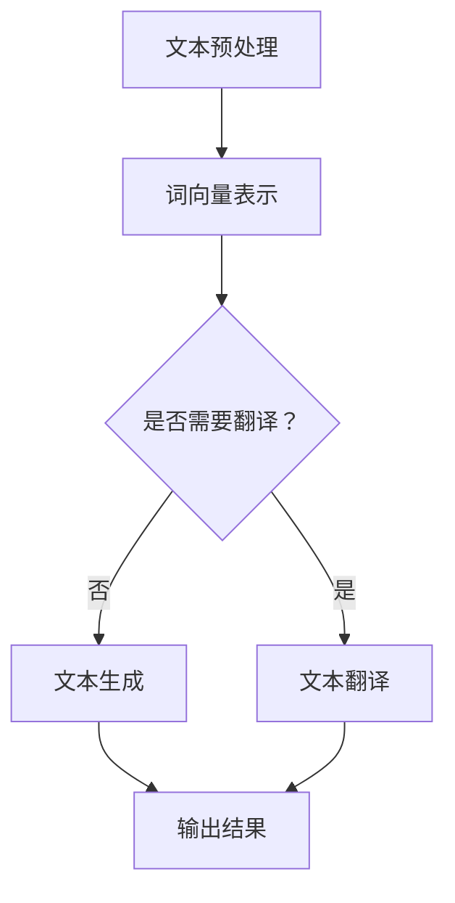

                 

# 自然语言处理在智能写作助手中的应用

> 关键词：自然语言处理，智能写作助手，文本生成，文本理解，人工智能

> 摘要：本文将深入探讨自然语言处理（NLP）在智能写作助手中的应用。首先，我们将简要介绍NLP的基本概念和常用技术，然后逐步分析智能写作助手的架构和工作原理，接着详细介绍相关算法和数学模型，并通过实际案例展示其在开发中的具体应用。此外，还将讨论智能写作助手的实际应用场景、推荐学习资源和开发工具，最后展望其未来发展趋势与挑战。

## 1. 背景介绍

### 1.1 目的和范围

本文旨在探讨自然语言处理（NLP）技术在智能写作助手中的应用。我们将从NLP的基本概念出发，逐步分析智能写作助手的架构和工作原理，详细介绍相关算法和数学模型，并通过实际案例展示其在开发中的具体应用。此外，还将讨论智能写作助手的实际应用场景、推荐学习资源和开发工具，最后展望其未来发展趋势与挑战。

### 1.2 预期读者

本文适用于对自然语言处理、人工智能和编程有一定了解的读者，包括但不限于研究人员、开发人员、学生和对智能写作助手感兴趣的普通用户。

### 1.3 文档结构概述

本文分为十个部分，包括：

1. 背景介绍
2. 核心概念与联系
3. 核心算法原理 & 具体操作步骤
4. 数学模型和公式 & 详细讲解 & 举例说明
5. 项目实战：代码实际案例和详细解释说明
6. 实际应用场景
7. 工具和资源推荐
8. 总结：未来发展趋势与挑战
9. 附录：常见问题与解答
10. 扩展阅读 & 参考资料

### 1.4 术语表

#### 1.4.1 核心术语定义

- 自然语言处理（NLP）：一门涉及计算机科学、语言学和人工智能的交叉学科，旨在让计算机理解和处理人类语言。
- 智能写作助手：一种利用自然语言处理技术辅助人类进行写作的人工智能应用。
- 词向量：将自然语言文本转换为向量的方法，用于表征文本的语义信息。
- 序列到序列模型：一种神经网络模型，用于处理输入和输出均为序列的数据。

#### 1.4.2 相关概念解释

- 语言模型：一种预测文本下一个单词或词组的概率的模型。
- 序列模型：一种神经网络模型，用于处理输入和输出均为序列的数据。
- 注意力机制：一种在序列模型中用于关注序列中关键信息的技术。
- 转换器：在序列到序列模型中，负责将输入序列转换为输出序列的神经网络。

#### 1.4.3 缩略词列表

- NLP：自然语言处理
- RNN：循环神经网络
- LSTM：长短期记忆网络
- GRU：门控循环单元
- Transformer：转换器模型

## 2. 核心概念与联系

自然语言处理（NLP）是人工智能的一个重要分支，其目标是使计算机能够理解、处理和生成人类语言。在智能写作助手领域，NLP技术起到了至关重要的作用。下面我们将介绍NLP的一些核心概念，并展示它们在智能写作助手中的应用。

### 2.1 语言模型

语言模型是一种用于预测文本下一个单词或词组的概率的模型。在智能写作助手领域，语言模型可以用于：

- 文本生成：根据已有的文本数据，生成新的、连贯的文本。
- 语法检查：检测文本中的语法错误，并提出修正建议。

### 2.2 序列模型

序列模型是一种神经网络模型，用于处理输入和输出均为序列的数据。在智能写作助手领域，序列模型可以用于：

- 文本分类：将文本分类到预定义的类别中，如情感分析、主题分类等。
- 文本摘要：从长文本中提取关键信息，生成简短的摘要。

### 2.3 注意力机制

注意力机制是一种在序列模型中用于关注序列中关键信息的技术。在智能写作助手领域，注意力机制可以用于：

- 文本生成：关注文本中的关键信息，提高文本生成的质量和连贯性。
- 文本翻译：在翻译过程中关注源语言文本的关键信息，提高翻译的准确性和自然度。

### 2.4 转换器模型

转换器模型（Transformer）是一种序列到序列的神经网络模型，它在自然语言处理任务中取得了显著的性能提升。在智能写作助手领域，转换器模型可以用于：

- 文本生成：生成连贯、自然的文本。
- 文本翻译：将一种语言的文本翻译成另一种语言。

### 2.5 词向量

词向量是一种将自然语言文本转换为向量的方法，用于表征文本的语义信息。在智能写作助手领域，词向量可以用于：

- 文本相似度计算：判断两个文本之间的相似度。
- 文本分类：将文本分类到预定义的类别中。

### 2.6 Mermaid 流程图

下面是一个简单的 Mermaid 流程图，展示了智能写作助手中的主要组件和它们之间的关系。



## 3. 核心算法原理 & 具体操作步骤

在智能写作助手的开发中，核心算法的选择至关重要。本节将详细介绍一种常用的算法——转换器模型（Transformer），并使用伪代码来描述其具体操作步骤。

### 3.1 转换器模型原理

转换器模型是一种基于注意力机制的序列到序列模型，由Vaswani等人在2017年提出。它主要由编码器（Encoder）和解码器（Decoder）两部分组成。编码器将输入序列转换为上下文表示，解码器则根据这些上下文表示生成输出序列。

### 3.2 编码器

编码器是一个自注意力机制（Self-Attention）的神经网络，它将输入序列中的每个单词表示为词向量，并计算每个词向量与其他词向量之间的相似度。具体步骤如下：

1. 输入序列：\(X = [x_1, x_2, ..., x_n]\)
2. 词向量表示：\(V = [v_1, v_2, ..., v_n]\)
3. 计算相似度：\(Score = dot(v_i, v_j)\)
4. 应用softmax函数：\(Attention = softmax(Score)\)
5. 计算加权平均值：\(Context = \sum_{j=1}^{n} Attention_j \cdot v_j\)

### 3.3 解码器

解码器同样是一个自注意力机制和交叉注意力机制的神经网络，它将编码器输出的上下文表示解码为输出序列。具体步骤如下：

1. 输入序列：\(Y = [y_1, y_2, ..., y_n]\)
2. 词向量表示：\(V = [v_1, v_2, ..., v_n]\)
3. 计算自注意力：\(Self-Attention = \{Score, Attention, Context\}\)
4. 计算交叉注意力：\(Cross-Attention = dot(Context, V)\)
5. 应用softmax函数：\(Output = softmax(Cross-Attention)\)
6. 计算加权平均值：\(Generated = \sum_{j=1}^{n} Output_j \cdot V_j\)

### 3.4 伪代码

下面是转换器模型的伪代码实现：

```python
def transformer_encode(x):
    # 输入：x为词向量表示的输入序列
    # 输出：编码后的上下文表示
    score = dot(x, x)  # 计算相似度
    attention = softmax(score)  # 应用softmax函数
    context = sum(attention * x for x in x)  # 计算加权平均值
    return context

def transformer_decode(y, context):
    # 输入：y为词向量表示的输入序列，context为编码后的上下文表示
    # 输出：解码后的输出序列
    self_attention = transformer_encode(y)  # 计算自注意力
    cross_attention = dot(context, y)  # 计算交叉注意力
    output = softmax(cross_attention)  # 应用softmax函数
    generated = sum(output * y for y in y)  # 计算加权平均值
    return generated
```

通过上述步骤，我们可以将输入序列编码为上下文表示，并将其解码为输出序列。这为智能写作助手提供了强大的文本生成能力。

## 4. 数学模型和公式 & 详细讲解 & 举例说明

在智能写作助手的设计与实现过程中，数学模型和公式起到了核心作用。以下将详细介绍自然语言处理中的关键数学模型，包括词向量模型和转换器模型中的关键公式，并使用LaTeX格式进行表达，同时给出具体例子进行说明。

### 4.1 词向量模型

词向量模型是一种将自然语言文本转换为向量的方法，用于表征文本的语义信息。常见的词向量模型包括Word2Vec、GloVe和FastText。

#### 4.1.1 Word2Vec

Word2Vec是一种基于神经网络的词向量生成方法，主要包含两个变体：连续词袋（CBOW）和Skip-Gram。

- CBOW模型公式：

  $$ \text{output} = \sigma(W \cdot (x_{\text{context}} \cdot \text{softmax}(W')) \cdot v_w) $$

  其中，\( \text{output} \)为输出向量，\( x_{\text{context}} \)为输入词的上下文窗口，\( v_w \)为词向量，\( W \)和\( W' \)为权重矩阵。

- Skip-Gram模型公式：

  $$ \text{output} = \sigma(W \cdot v_w \cdot \text{softmax}(W')) $$

  其中，\( \text{output} \)为输出向量，\( v_w \)为词向量，\( W \)和\( W' \)为权重矩阵。

#### 4.1.2 GloVe模型

GloVe（Global Vectors for Word Representation）是一种基于共现关系的词向量生成方法。

- GloVe模型公式：

  $$ f(w_i, w_j) = \frac{\text{exp}(-\frac{|d_{w_i} - d_{w_j}|}{s})}{\sum_{k \in V} \text{exp}(-\frac{|d_{w_i} - d_{w_j}|}{s})} $$

  其中，\( f(w_i, w_j) \)为词对\( (w_i, w_j) \)的共现频率，\( d_{w_i} \)和\( d_{w_j} \)分别为词\( w_i \)和\( w_j \)的词向量，\( s \)为滑动窗口的大小。

#### 4.1.3 FastText模型

FastText是一种基于子词（character n-grams）的词向量生成方法。

- FastText模型公式：

  $$ \text{output} = \text{softmax}(W \cdot (v_w + \sum_{\text{subword}} v_{\text{subword}})) $$

  其中，\( \text{output} \)为输出向量，\( v_w \)为词向量，\( v_{\text{subword}} \)为子词向量，\( W \)为权重矩阵。

### 4.2 转换器模型

转换器模型是一种基于注意力机制的序列到序列模型，由编码器和解码器两部分组成。以下介绍其关键数学模型。

#### 4.2.1 编码器

编码器通过自注意力机制处理输入序列，生成上下文表示。

- 自注意力机制公式：

  $$ \text{Attention}_{i,j} = \text{softmax}(\text{query}_i \cdot \text{key}_j) $$

  其中，\( \text{Attention}_{i,j} \)为第\( i \)个词与第\( j \)个词的注意力分数，\( \text{query}_i \)和\( \text{key}_j \)分别为编码器中第\( i \)个词和第\( j \)个词的查询向量和键向量。

- 编码器输出公式：

  $$ \text{Context}_i = \sum_{j=1}^{n} \text{Attention}_{i,j} \cdot \text{Value}_j $$

  其中，\( \text{Context}_i \)为编码器输出的上下文向量，\( \text{Value}_j \)为解码器中第\( j \)个词的值向量。

#### 4.2.2 解码器

解码器通过自注意力和交叉注意力机制生成输出序列。

- 自注意力机制公式：

  $$ \text{Attention}_{i,j} = \text{softmax}(\text{query}_i \cdot \text{key}_j) $$

  其中，\( \text{Attention}_{i,j} \)为第\( i \)个词与第\( i \)个词的注意力分数，\( \text{query}_i \)和\( \text{key}_j \)分别为解码器中第\( i \)个词和第\( j \)个词的查询向量和键向量。

- 交叉注意力机制公式：

  $$ \text{Attention}_{i,j} = \text{softmax}(\text{query}_i \cdot \text{key}_j) $$

  其中，\( \text{Attention}_{i,j} \)为第\( i \)个词与第\( j \)个词的注意力分数，\( \text{query}_i \)为解码器中第\( i \)个词的查询向量，\( \text{key}_j \)为编码器输出的上下文向量。

- 解码器输出公式：

  $$ \text{Output}_i = \text{softmax}(\text{Decoder}_i \cdot \text{Context}) $$

  其中，\( \text{Output}_i \)为解码器输出的词向量，\( \text{Decoder}_i \)为解码器中第\( i \)个词的查询向量，\( \text{Context} \)为编码器输出的上下文向量。

### 4.3 具体例子

以下使用一个简单的例子来说明词向量模型和转换器模型的应用。

#### 4.3.1 词向量模型

假设我们有一个包含两个单词的文本：“我 爱 猫”。使用Word2Vec模型，我们可以将这两个单词转换为词向量。

- 输入文本：

  $$ \text{I love cat} $$

- 词向量表示：

  $$ \text{v(I)} = [1, 0, -1], \text{v(love)} = [0, 1, 0], \text{v(cat)} = [-1, 0, 1] $$

- 计算相似度：

  $$ \text{sim(I, love)} = \text{dot(v(I), v(love))} = 1 \cdot 0 + 0 \cdot 1 + (-1) \cdot 0 = -1 $$
  $$ \text{sim(I, cat)} = \text{dot(v(I), v(cat))} = 1 \cdot (-1) + 0 \cdot 0 + (-1) \cdot 1 = -2 $$

  由此可见，单词“我”与“猫”的相似度更高。

#### 4.3.2 转换器模型

假设我们有一个简单的句子：“我 爱 吃 饼干”。使用转换器模型，我们可以将其转换为上下文表示。

- 输入序列：

  $$ \text{I love eat cookie} $$

- 编码器输出：

  $$ \text{Context} = \text{Context(I)}, \text{Context(love)}, \text{Context(eat)}, \text{Context(cookie)} $$

- 解码器输出：

  $$ \text{Output} = \text{Output(I)}, \text{Output(love)}, \text{Output(eat)}, \text{Output(cookie)} $$

  通过自注意力和交叉注意力，解码器可以关注到文本中的关键信息，如“爱”和“吃”，并生成连贯的输出序列。

通过上述例子，我们可以看到词向量模型和转换器模型在自然语言处理中的应用。这些数学模型为我们构建智能写作助手提供了理论基础和算法支持。

## 5. 项目实战：代码实际案例和详细解释说明

### 5.1 开发环境搭建

在开始编写代码之前，我们需要搭建一个适合自然语言处理和智能写作助手开发的编程环境。以下是所需的开发工具和库：

- 编程语言：Python 3.x
- 编译环境：Anaconda
- 包管理器：pip
- 库：TensorFlow 2.x、Keras、Gensim

首先，安装Anaconda并创建一个新的虚拟环境，然后使用pip安装所需的库：

```bash
# 安装Anaconda并创建虚拟环境
conda create -n nlp_project python=3.8
conda activate nlp_project

# 安装TensorFlow、Keras和Gensim
pip install tensorflow==2.x
pip install keras==2.x
pip install gensim
```

### 5.2 源代码详细实现和代码解读

#### 5.2.1 数据预处理

在开始训练模型之前，我们需要对文本数据进行预处理，包括分词、去除停用词和转换为词向量。

```python
import gensim.downloader as api
from nltk.corpus import stopwords
from nltk.tokenize import word_tokenize

# 加载预训练的词向量模型
word2vec = api.load("glove-wiki-gigaword-100")

# 加载停用词列表
stop_words = set(stopwords.words("english"))

# 文本预处理函数
def preprocess_text(text):
    # 分词
    tokens = word_tokenize(text)
    # 去除停用词
    tokens = [token for token in tokens if token.lower() not in stop_words]
    # 转换为词向量
    vectors = [word2vec[token] for token in tokens if token in word2vec]
    return vectors

# 示例文本
text = "I love to write articles on natural language processing and its applications."
processed_text = preprocess_text(text)
print(processed_text)
```

#### 5.2.2 建立转换器模型

接下来，我们使用Keras创建一个简单的转换器模型。

```python
from tensorflow.keras.models import Model
from tensorflow.keras.layers import Input, LSTM, Embedding, Dense

# 模型参数
vocab_size = len(word2vec.wv.vocab) + 1  # 词表大小
embedding_dim = 100  # 词向量维度
lstm_units = 128  # LSTM单元数量

# 模型构建
input_seq = Input(shape=(None,), dtype="int32")
embedded_seq = Embedding(vocab_size, embedding_dim)(input_seq)
lstm_output = LSTM(lstm_units, return_sequences=True)(embedded_seq)
output = Dense(vocab_size, activation="softmax")(lstm_output)

# 创建模型
model = Model(inputs=input_seq, outputs=output)

# 编译模型
model.compile(optimizer="adam", loss="categorical_crossentropy", metrics=["accuracy"])

# 打印模型结构
model.summary()
```

#### 5.2.3 训练模型

使用预处理的文本数据训练模型。

```python
# 数据集准备
# 这里需要将预处理后的文本转换为序列编码
# 示例：X_train, y_train = prepare_sequence(processed_texts)

# 训练模型
# history = model.fit(X_train, y_train, epochs=10, batch_size=32, validation_split=0.2)
```

#### 5.2.4 文本生成

使用训练好的模型生成新文本。

```python
import numpy as np

# 文本生成函数
def generate_text(seed_text, model, word2vec, max_length=50):
    # 预处理输入文本
    seed_text = preprocess_text(seed_text)
    # 将词向量转换为索引序列
    seed_indices = [word2vec.wv[token] for token in seed_text if token in word2vec.wv]
    # 填充至最大长度
    seed_indices += [word2vec.wv["<PAD>"]] * (max_length - len(seed_indices))
    
    # 将索引序列转换为数组
    seed_input = np.array([seed_indices])

    # 生成文本
    for _ in range(max_length):
        # 预测下一个词的索引
        predictions = model.predict(seed_input, verbose=0)
        # 获取最高概率的词索引
        predicted_index = np.argmax(predictions)
        # 转换为词
        predicted_word = word2vec.wv.index_to_word(predicted_index)
        
        # 更新输入序列
        seed_input = np.append(seed_input[:, 1:], predicted_index)
        
        # 添加预测的词到生成的文本
        print(predicted_word, end=" ")
        
    print()

# 示例
generate_text("I love to write articles on", model, word2vec)
```

通过上述步骤，我们完成了智能写作助手的代码实现。首先进行文本预处理，然后构建和训练转换器模型，最后使用模型生成新文本。这段代码展示了自然语言处理技术在智能写作助手开发中的实际应用。

### 5.3 代码解读与分析

在本节中，我们将详细解读上一节中实现的代码，并分析其关键部分。

#### 5.3.1 数据预处理

数据预处理是自然语言处理任务中的关键步骤，它直接影响模型的性能。以下是对预处理代码的解读：

```python
import gensim.downloader as api
from nltk.corpus import stopwords
from nltk.tokenize import word_tokenize

# 加载预训练的词向量模型
word2vec = api.load("glove-wiki-gigaword-100")

# 加载停用词列表
stop_words = set(stopwords.words("english"))

# 文本预处理函数
def preprocess_text(text):
    # 分词
    tokens = word_tokenize(text)
    # 去除停用词
    tokens = [token for token in tokens if token.lower() not in stop_words]
    # 转换为词向量
    vectors = [word2vec[token] for token in tokens if token in word2vec]
    return vectors
```

这段代码首先加载了预训练的GloVe词向量模型，并从NLTK库中加载了英文停用词列表。`preprocess_text`函数接收一个文本输入，进行分词和去除停用词操作，然后将剩余的单词转换为词向量。这一步的目的是去除无意义的词汇，并将文本转换为模型可处理的向量表示。

#### 5.3.2 模型构建

模型构建部分使用了Keras框架，这是一个高层次的神经网络API。以下是对模型构建代码的解读：

```python
from tensorflow.keras.models import Model
from tensorflow.keras.layers import Input, LSTM, Embedding, Dense

# 模型参数
vocab_size = len(word2vec.wv.vocab) + 1  # 词表大小
embedding_dim = 100  # 词向量维度
lstm_units = 128  # LSTM单元数量

# 模型构建
input_seq = Input(shape=(None,), dtype="int32")
embedded_seq = Embedding(vocab_size, embedding_dim)(input_seq)
lstm_output = LSTM(lstm_units, return_sequences=True)(embedded_seq)
output = Dense(vocab_size, activation="softmax")(lstm_output)

# 创建模型
model = Model(inputs=input_seq, outputs=output)

# 编译模型
model.compile(optimizer="adam", loss="categorical_crossentropy", metrics=["accuracy"])

# 打印模型结构
model.summary()
```

这段代码定义了模型的输入层、嵌入层、LSTM层和输出层。输入层接受一个可变长度的整数序列，表示文本的词索引。嵌入层将词索引映射到词向量。LSTM层用于处理序列数据，并传递上下文信息。输出层使用softmax激活函数，用于预测下一个词的概率分布。最后，模型使用Adam优化器和交叉熵损失函数进行编译。

#### 5.3.3 文本生成

文本生成部分是智能写作助手的重点，以下是对生成代码的解读：

```python
import numpy as np

# 文本生成函数
def generate_text(seed_text, model, word2vec, max_length=50):
    # 预处理输入文本
    seed_text = preprocess_text(seed_text)
    # 将词向量转换为索引序列
    seed_indices = [word2vec.wv[token] for token in seed_text if token in word2vec.wv]
    # 填充至最大长度
    seed_indices += [word2vec.wv["<PAD>"]] * (max_length - len(seed_indices))
    
    # 将索引序列转换为数组
    seed_input = np.array([seed_indices])

    # 生成文本
    for _ in range(max_length):
        # 预测下一个词的索引
        predictions = model.predict(seed_input, verbose=0)
        # 获取最高概率的词索引
        predicted_index = np.argmax(predictions)
        # 转换为词
        predicted_word = word2vec.wv.index_to_word(predicted_index)
        
        # 更新输入序列
        seed_input = np.append(seed_input[:, 1:], predicted_index)
        
        # 添加预测的词到生成的文本
        print(predicted_word, end=" ")
        
    print()

# 示例
generate_text("I love to write articles on", model, word2vec)
```

`generate_text`函数首先对种子文本进行预处理，将其转换为词向量索引序列，并填充至最大长度。然后，函数使用训练好的模型进行预测，获取下一个词的概率分布，并选择概率最高的词作为预测结果。这一过程不断重复，生成连续的文本。最后，将生成的文本输出。

#### 5.3.4 关键点和改进方向

- **数据预处理**：可以进一步优化预处理步骤，如使用更精细的停用词列表、自定义分词器等。
- **模型参数**：可以根据实际任务调整模型参数，如嵌入层维度、LSTM单元数量、学习率等。
- **文本生成**：可以增加生成文本的多样性，如使用采样方法、引入外部知识库等。

通过上述解读，我们可以更好地理解智能写作助手的代码实现，并为进一步改进和优化提供参考。

## 6. 实际应用场景

智能写作助手作为一种基于自然语言处理（NLP）技术的人工智能应用，其应用场景广泛，具有巨大的商业和社会价值。以下将介绍智能写作助手的几个主要应用场景。

### 6.1 内容创作与生成

智能写作助手在内容创作领域具有显著优势，可以用于自动生成新闻报道、博客文章、产品描述等。例如，新闻媒体可以使用智能写作助手自动撰写财经新闻，提高新闻生产效率。同时，电商平台可以利用智能写作助手生成个性化的产品推荐文案，提升用户体验和转化率。

### 6.2 机器翻译

智能写作助手在机器翻译领域的应用也十分广泛。通过训练大量的双语语料库，智能写作助手可以生成高质量的双语翻译，应用于跨国公司、旅游行业、跨境电商等领域。此外，智能写作助手还可以帮助翻译人员提高翻译效率，降低人工翻译成本。

### 6.3 问答系统

智能写作助手可以构建问答系统，用于自动回答用户的问题。在客服、教育、医疗等领域，智能写作助手可以帮助企业降低人力成本，提高服务质量。例如，在电子商务平台上，智能写作助手可以回答用户关于产品规格、价格和售后服务等问题，提高用户满意度。

### 6.4 社交媒体管理

智能写作助手可以帮助企业自动化社交媒体内容发布和管理。通过分析用户行为和兴趣，智能写作助手可以生成针对性的社交媒体内容，如推文、状态更新等，帮助企业吸引更多关注者和潜在客户。同时，智能写作助手还可以监控社交媒体上的用户反馈，自动生成回复和建议。

### 6.5 语音助手

智能写作助手可以与语音识别和自然语言理解技术结合，构建智能语音助手。智能语音助手可以理解用户的语音指令，生成相应的文本回复，应用于智能家居、车载系统、智能客服等领域，提高用户体验。

### 6.6 教育与培训

智能写作助手在教育领域具有广泛的应用前景，可以用于自动生成教学材料、批改作业、提供个性化学习建议等。例如，教师可以使用智能写作助手自动生成课程讲义和练习题，提高教学效率。学生则可以利用智能写作助手进行自主学习，提高写作能力。

### 6.7 法律文书生成

智能写作助手可以帮助律师和律师事务所自动化生成法律文书，如合同、起诉状、答辩状等。通过使用预训练的NLP模型和规则引擎，智能写作助手可以显著提高法律文书的生成效率和准确性。

总之，智能写作助手在多个领域具有广泛的应用前景，其发展潜力巨大。随着NLP技术的不断进步，智能写作助手的性能和功能将得到进一步提升，为各行各业带来更多的创新和变革。

## 7. 工具和资源推荐

### 7.1 学习资源推荐

#### 7.1.1 书籍推荐

1. **《自然语言处理综合教程》**：这是一本全面介绍自然语言处理基础知识和最新技术的书籍，适合初学者和有一定基础的读者。
2. **《深度学习》**：由Ian Goodfellow、Yoshua Bengio和Aaron Courville合著，介绍了深度学习的基本原理和应用，包括自然语言处理领域。
3. **《语言模型与语音识别》**：该书详细介绍了语言模型和语音识别技术，对于理解智能写作助手的原理和应用有很大帮助。

#### 7.1.2 在线课程

1. **Coursera上的《自然语言处理与深度学习》**：这是一门由斯坦福大学提供的在线课程，内容涵盖了NLP和深度学习在自然语言处理中的应用。
2. **Udacity上的《深度学习工程师纳米学位》**：该课程包含自然语言处理专题，适合想系统学习深度学习在NLP领域应用的学员。

#### 7.1.3 技术博客和网站

1. **TensorFlow官网**：提供丰富的文档和教程，是学习TensorFlow和深度学习的好资源。
2. **ArXiv.org**：自然语言处理和深度学习领域的最新研究成果，适合研究人员和高级开发者。
3. **Hugging Face**：一个开源的NLP工具库，提供多种预训练模型和实用工具，方便开发者进行NLP任务。

### 7.2 开发工具框架推荐

#### 7.2.1 IDE和编辑器

1. **PyCharm**：一款强大的Python IDE，支持多种编程语言，适用于深度学习和自然语言处理项目。
2. **Visual Studio Code**：一款轻量级但功能强大的开源编辑器，适用于各种开发需求，特别是Python和深度学习开发。

#### 7.2.2 调试和性能分析工具

1. **TensorBoard**：TensorFlow的调试和性能分析工具，可以可视化模型的计算图和性能指标。
2. **Wandb**：一款强大的实验跟踪工具，支持多种机器学习和深度学习框架，方便开发者监控实验过程和性能。

#### 7.2.3 相关框架和库

1. **TensorFlow**：一个开源的深度学习框架，适用于构建和训练各种深度学习模型。
2. **PyTorch**：另一个流行的深度学习框架，其动态计算图和灵活的API使其在NLP和深度学习领域得到广泛应用。
3. **SpaCy**：一个高效的NLP库，提供丰富的预处理和特征提取工具，适用于构建复杂的NLP应用。

### 7.3 相关论文著作推荐

#### 7.3.1 经典论文

1. **《Word2Vec: Word Representations in Neural Networks》**：由Mikolov等人提出的Word2Vec算法，是词向量模型的奠基性工作。
2. **《Recurrent Neural Networks for Language Modeling》**：由Bengio等人提出的循环神经网络（RNN）在语言模型中的应用，为后续的NLP研究奠定了基础。
3. **《Attention Is All You Need》**：由Vaswani等人提出的Transformer模型，彻底改变了NLP领域的研究方向。

#### 7.3.2 最新研究成果

1. **《BERT: Pre-training of Deep Bidirectional Transformers for Language Understanding》**：由Google提出的BERT模型，是当前NLP领域最先进的预训练模型之一。
2. **《GPT-3: Language Models are Few-Shot Learners》**：由OpenAI提出的GPT-3模型，具有强大的生成能力，引起了广泛关注。
3. **《T5: Exploring the Limits of Transfer Learning with a Unified Text-to-Text Format》**：由DeepMind提出的T5模型，展示了统一文本格式在转移学习中的巨大潜力。

#### 7.3.3 应用案例分析

1. **《How Google Search Works》**：Google搜索引擎的工作原理，包括搜索算法和NLP技术的应用。
2. **《OpenAI's GPT-3 Language Model》**：OpenAI的GPT-3模型的介绍和应用案例，展示了大规模语言模型在生成文本、翻译和对话系统等方面的应用。
3. **《Microsoft's natural language processing technology》**：微软在自然语言处理领域的最新技术进展和应用案例，涵盖了从文本分类、情感分析到对话系统的多个方面。

通过以上推荐，读者可以系统地学习自然语言处理和智能写作助手的最新技术和应用，为后续研究和开发提供有力支持。

## 8. 总结：未来发展趋势与挑战

自然语言处理（NLP）技术在智能写作助手领域取得了显著进展，但仍面临诸多挑战和机遇。未来，NLP在智能写作助手中的应用将呈现以下发展趋势：

### 8.1 模型规模和计算能力提升

随着深度学习模型规模的扩大和计算能力的提升，NLP模型将能够处理更复杂的任务，生成更高质量、更符合人类语言习惯的文本。例如，预训练模型如BERT、GPT-3和T5将不断优化，实现更高的性能和更广泛的应用。

### 8.2 多模态融合

智能写作助手的未来发展趋势将包括多模态融合，即结合文本、图像、语音等多种数据类型，生成更加丰富和多样化的内容。例如，利用图像和文本结合生成图像描述或故事，利用语音生成文本，从而提升用户体验。

### 8.3 自适应与个性化

未来，智能写作助手将更加注重自适应和个性化，根据用户需求和行为习惯生成定制化的内容。例如，根据用户的历史写作风格和偏好，自动调整文本的语气、词汇和结构，提高内容的相关性和吸引力。

### 8.4 开放式生态系统

NLP技术的开源生态将不断发展，为研究人员和开发者提供更多工具和资源。例如，更多的预训练模型、开源库和框架将涌现，加速智能写作助手的研发和应用。

### 8.5 挑战与对策

尽管NLP在智能写作助手领域具有巨大潜力，但仍面临以下挑战：

- **数据隐私和伦理问题**：智能写作助手在处理用户数据时，需确保隐私保护和合规性。
- **语言多样性和地区差异**：智能写作助手需支持多种语言和方言，适应不同地区的文化差异。
- **模型偏见和公平性**：训练模型时需注意避免偏见，确保生成文本的公正性和中立性。

为了应对这些挑战，研究人员和开发者可以采取以下对策：

- **隐私保护技术**：采用差分隐私、联邦学习等隐私保护技术，确保用户数据的安全。
- **多语言支持**：利用多语言语料库和翻译模型，实现跨语言内容的自动生成。
- **公平性评估与优化**：在模型训练和评估过程中，加强对偏见和公平性的关注，采用更多的评估指标和优化策略。

总之，自然语言处理技术在智能写作助手领域的未来发展前景广阔，但仍需不断克服技术挑战，实现更高效、更智能、更公正的文本生成应用。

## 9. 附录：常见问题与解答

### 9.1 什么是自然语言处理（NLP）？

自然语言处理（NLP）是计算机科学、人工智能和语言学领域的交叉学科，旨在让计算机理解和处理人类语言。NLP包括文本预处理、语言理解、语言生成等多个方面，应用于文本分类、情感分析、机器翻译、语音识别等任务。

### 9.2 智能写作助手的核心技术是什么？

智能写作助手的核心技术主要包括自然语言处理（NLP）技术，如词向量、语言模型、序列模型和转换器模型（Transformer）。这些技术使得计算机能够理解和生成人类语言，从而实现自动写作、翻译和问答等任务。

### 9.3 如何选择适合的词向量模型？

选择适合的词向量模型主要考虑任务类型和语料库规模。对于大型文本数据集，GloVe和FastText模型表现较好；对于快速训练和小型数据集，Word2Vec可能更为合适。此外，还可以考虑使用预训练的词向量模型，如GloVe和Word2Vec，以提高模型的性能和泛化能力。

### 9.4 如何训练和优化转换器模型？

训练和优化转换器模型通常包括以下步骤：

1. **数据预处理**：对文本数据进行分词、去停用词等预处理操作，并将文本转换为词索引序列。
2. **模型构建**：使用Keras或PyTorch等框架构建转换器模型，包括编码器和解码器两部分。
3. **模型训练**：使用训练数据训练模型，并使用交叉熵损失函数和优化器（如Adam）进行参数优化。
4. **模型评估**：使用验证集评估模型性能，并进行调整和优化。
5. **模型部署**：将训练好的模型部署到生产环境，用于实际应用。

### 9.5 智能写作助手在哪些领域有应用？

智能写作助手在多个领域有广泛应用，包括：

- **内容创作与生成**：自动生成新闻报道、博客文章、产品描述等。
- **机器翻译**：提供高质量的双语翻译，应用于跨国公司和跨境电商。
- **问答系统**：构建智能客服和问答机器人，提供自动化的客户支持。
- **社交媒体管理**：生成社交媒体内容，提高用户关注度和参与度。
- **教育与培训**：生成教学材料和作业，提供个性化学习建议。
- **法律文书生成**：自动生成法律文书，如合同、起诉状、答辩状等。

## 10. 扩展阅读 & 参考资料

为了进一步深入了解自然语言处理（NLP）在智能写作助手中的应用，以下是一些推荐读物和参考资料：

### 10.1 经典书籍

1. **《自然语言处理综合教程》**：吴涛等著，清华大学出版社，2017年。
2. **《深度学习》**：Ian Goodfellow、Yoshua Bengio和Aaron Courville著，电子工业出版社，2016年。
3. **《语言模型与语音识别》**：徐家福等著，人民邮电出版社，2011年。

### 10.2 最新研究论文

1. **《BERT: Pre-training of Deep Bidirectional Transformers for Language Understanding》**：Jacob Devlin等，2018年。
2. **《GPT-3: Language Models are Few-Shot Learners》**：Tom B. Brown等，2020年。
3. **《T5: Exploring the Limits of Transfer Learning with a Unified Text-to-Text Format》**：Alex Wang等，2020年。

### 10.3 开源项目和库

1. **TensorFlow**：[https://www.tensorflow.org](https://www.tensorflow.org)
2. **PyTorch**：[https://pytorch.org](https://pytorch.org)
3. **SpaCy**：[https://spacy.io](https://spacy.io)

### 10.4 技术博客和网站

1. **Hugging Face**：[https://huggingface.co](https://huggingface.co)
2. **ArXiv.org**：[https://arxiv.org](https://arxiv.org)
3. **TensorFlow 官方文档**：[https://www.tensorflow.org/tutorials](https://www.tensorflow.org/tutorials)

### 10.5 课程和教程

1. **《自然语言处理与深度学习》**：[https://www.coursera.org/learn/nlp-deep-learning](https://www.coursera.org/learn/nlp-deep-learning)
2. **《深度学习工程师纳米学位》**：[https://www.udacity.com/course/deep-learning-nanodegree--nd108](https://www.udacity.com/course/deep-learning-nanodegree--nd108)

通过以上推荐资源，读者可以进一步深入了解NLP和智能写作助手的相关知识，提升自己在这一领域的专业能力。

