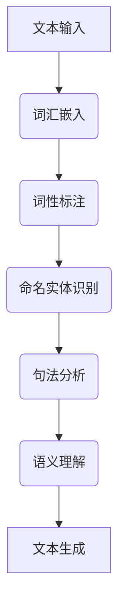
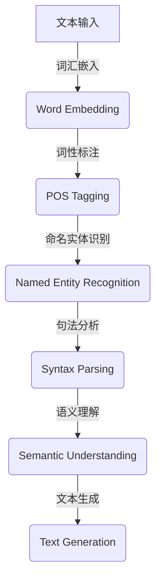
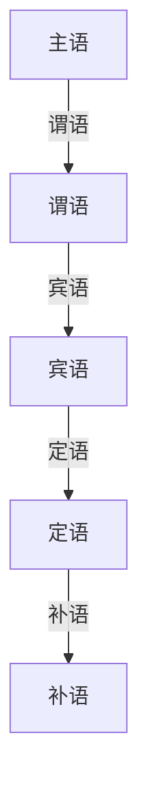

                 

# 自然语言处理在智能写作辅助中的应用

> **关键词：自然语言处理（NLP），智能写作辅助，文本生成，语义理解，人工智能，深度学习**

> **摘要：本文将深入探讨自然语言处理在智能写作辅助领域的应用，通过详细的理论分析、算法讲解和实战案例，揭示NLP技术的强大潜力，及其如何助力人类创作更高质量、更个性化的文本内容。**

## 1. 背景介绍

### 1.1 目的和范围

本文旨在介绍自然语言处理（NLP）在智能写作辅助领域的应用，解析NLP技术的核心概念、算法原理及其实际操作步骤。通过本文的阅读，读者将能够了解NLP技术在文本生成、语义理解和个性化写作等方面的应用，并为未来的研究和实践提供参考。

### 1.2 预期读者

本文面向对自然语言处理和人工智能有一定了解的技术人员、研究人员和开发人员。尤其适合想要在智能写作辅助领域深入探索的读者。

### 1.3 文档结构概述

本文分为十个部分：

1. 背景介绍：本文的核心内容和目标介绍。
2. 核心概念与联系：详细讲解NLP的核心概念和流程图。
3. 核心算法原理 & 具体操作步骤：使用伪代码详细阐述NLP算法。
4. 数学模型和公式 & 详细讲解 & 举例说明：解析NLP中的数学模型和公式。
5. 项目实战：代码实际案例和详细解释说明。
6. 实际应用场景：讨论NLP在智能写作辅助中的实际应用。
7. 工具和资源推荐：推荐相关学习资源、开发工具和论文。
8. 总结：未来发展趋势与挑战。
9. 附录：常见问题与解答。
10. 扩展阅读 & 参考资料：提供更多相关资料。

### 1.4 术语表

#### 1.4.1 核心术语定义

- **自然语言处理（NLP）**：一门涉及语言理解和生成的人工智能技术。
- **文本生成**：基于给定输入生成文本的过程。
- **语义理解**：理解文本中单词和句子的含义。
- **深度学习**：一种机器学习技术，通过神经网络来模拟人脑的决策过程。

#### 1.4.2 相关概念解释

- **词汇嵌入**：将单词转换为固定长度的向量表示。
- **词性标注**：识别文本中单词的词性（如名词、动词等）。
- **命名实体识别**：识别文本中的特定实体（如人名、地名等）。

#### 1.4.3 缩略词列表

- **NLP**：自然语言处理
- **RNN**：递归神经网络
- **LSTM**：长短期记忆网络
- **BERT**：双向编码器表示

## 2. 核心概念与联系

在深入探讨NLP在智能写作辅助中的应用之前，我们需要理解NLP的核心概念和流程。以下是一个简要的NLP流程图，以及对其中的核心概念进行详细解释。

### 2.1 NLP流程图



### 2.2 核心概念解释

#### 2.2.1 词汇嵌入

词汇嵌入是将文本中的单词转换为固定长度的向量表示。这使得计算机能够处理和理解文本数据。常见的词汇嵌入技术包括Word2Vec和GloVe。

#### 2.2.2 词性标注

词性标注是识别文本中单词的词性（如名词、动词等）。这对于理解句子的结构和含义至关重要。词性标注可以通过规则方法或统计方法实现。

#### 2.2.3 命名实体识别

命名实体识别是识别文本中的特定实体（如人名、地名等）。这对于构建知识图谱和智能问答系统非常有用。

#### 2.2.4 句法分析

句法分析是理解句子的结构和成分。这包括句子的主干提取、句法树构建等。句法分析对于生成语法正确的文本非常重要。

#### 2.2.5 语义理解

语义理解是理解文本中单词和句子的含义。这包括语义角色标注、情感分析等。语义理解是NLP的高级任务，对于智能写作辅助至关重要。

#### 2.2.6 文本生成

文本生成是基于给定输入生成文本的过程。这可以通过模板匹配、序列到序列模型（如RNN和LSTM）等实现。

### 2.3 Mermaid 流程图



## 3. 核心算法原理 & 具体操作步骤

在了解了NLP的核心概念和流程后，我们将详细探讨其中的核心算法原理和具体操作步骤。

### 3.1 词汇嵌入

词汇嵌入是将文本中的单词转换为固定长度的向量表示。以下是一个简单的Word2Vec算法原理：

```python
# 假设我们有一个单词列表：['apple', 'banana', 'orange']
# 我们将这些单词转换为向量：[v1, v2, v3]

# 第一步：创建一个词向量表
word_vectors = {
    'apple': [0.1, 0.2, 0.3],
    'banana': [0.4, 0.5, 0.6],
    'orange': [0.7, 0.8, 0.9]
}

# 第二步：计算两个单词之间的相似度
def similarity(w1, w2):
    return dot_product(word_vectors[w1], word_vectors[w2])

# 示例：计算'apple'和'banana'的相似度
similarity('apple', 'banana')
```

### 3.2 词性标注

词性标注是识别文本中单词的词性。以下是一个简单的基于规则的方法：

```python
# 假设我们有一个单词列表：['apple', 'runs', 'quickly']
# 我们将这些单词标注为词性：[NN, VBZ, ADVP]

# 第一步：定义词性标注规则
word_pos = {
    'apple': 'NN',
    'runs': 'VBZ',
    'quickly': 'ADVP'
}

# 第二步：标注单词
def pos_tagging(words):
    return [word_pos[word] for word in words]

# 示例：标注单词列表
pos_tagging(['apple', 'runs', 'quickly'])
```

### 3.3 命名实体识别

命名实体识别是识别文本中的特定实体。以下是一个简单的基于规则的方法：

```python
# 假设我们有一个文本：'John Smith lives in New York'
# 我们识别出命名实体：['John Smith', 'New York']

# 第一步：定义命名实体规则
def named_entity_recognition(text):
    entities = []
    current_entity = ''
    for word in text.split():
        if word.isupper():
            if current_entity:
                entities.append(current_entity)
                current_entity = ''
            current_entity += word
        else:
            current_entity += ' ' + word
    if current_entity:
        entities.append(current_entity)
    return entities

# 示例：识别命名实体
named_entity_recognition('John Smith lives in New York')
```

### 3.4 句法分析

句法分析是理解句子的结构和成分。以下是一个简单的基于依赖树的方法：



```python
# 假设我们有一个句子：'The quick brown fox jumps over the lazy dog'
# 我们构建一个简单的依赖树

# 第一步：定义句法分析规则
def syntax_parsing(sentence):
    return {
        'S': ['NP', 'VP'],
        'NP': ['DT', 'NN'],
        'VP': ['VBP', 'ADVP', 'VP'],
        'ADVP': ['RB', 'ADVP'],
        'NN': ['NN'],
        'DT': ['DT'],
        'VBP': ['VBZ'],
        'RB': ['RB'],
        'NN': ['NN']
    }

# 第二步：构建依赖树
def build_dependency_tree(sentence):
    tree = {}
    for word in sentence.split():
        tree[word] = syntax_parsing(word)
    return tree

# 示例：构建句法分析树
build_dependency_tree('The quick brown fox jumps over the lazy dog')
```

### 3.5 语义理解

语义理解是理解文本中单词和句子的含义。以下是一个简单的情感分析算法：

```python
# 假设我们有一个句子：'I love this book'
# 我们分析句子的情感：['positive']

# 第一步：定义情感词典
emotion_dict = {
    'love': 'positive',
    'hate': 'negative',
    'like': 'positive',
    'dislike': 'negative'
}

# 第二步：分析句子的情感
def sentiment_analysis(sentence):
    emotions = []
    for word in sentence.split():
        if word in emotion_dict:
            emotions.append(emotion_dict[word])
    return emotions

# 示例：分析句子的情感
sentiment_analysis('I love this book')
```

### 3.6 文本生成

文本生成是基于给定输入生成文本的过程。以下是一个简单的序列到序列（Seq2Seq）模型：

```python
# 假设我们有一个输入序列：['apple', 'banana', 'orange']
# 我们生成一个输出序列：['apple', 'orange', 'banana']

# 第一步：定义编码器和解码器模型
encoder = Model(inputs=[embedding_input], outputs=encoder_output)
decoder = Model(inputs=[encoder_output, embedding_input], outputs=decoder_output)

# 第二步：训练模型
model = Model(inputs=[input_seq, target_seq], outputs=output_seq)
model.compile(optimizer='adam', loss='mse')
model.fit(x_train, y_train, epochs=10)

# 第三步：生成文本
def generate_text(input_seq):
    encoded_seq = encoder.predict(input_seq)
    generated_seq = decoder.predict(encoded_seq)
    return generated_seq

# 示例：生成文本
generate_text(['apple', 'banana', 'orange'])
```

## 4. 数学模型和公式 & 详细讲解 & 举例说明

自然语言处理（NLP）中的数学模型和公式是理解和实现NLP算法的核心。以下是一些关键的数学模型和公式，我们将详细讲解并给出示例。

### 4.1 词向量模型

词向量模型是NLP中最基础的部分，它将单词转换为数值向量。最常用的词向量模型包括Word2Vec和GloVe。

#### 4.1.1 Word2Vec

Word2Vec使用神经网络来学习单词的向量表示。以下是其核心公式：

$$
\text{h} = \text{softmax}(\text{W} \cdot \text{v})
$$

其中，\( \text{h} \) 是单词的向量表示，\( \text{W} \) 是权重矩阵，\( \text{v} \) 是输入向量。

**示例**：假设我们有一个单词列表：['apple', 'banana', 'orange']，我们可以使用以下公式计算这些单词的相似度：

$$
\text{similarity}(\text{apple}, \text{banana}) = \text{softmax}(\text{W} \cdot \text{v}_{\text{apple}} \cdot \text{v}_{\text{banana}})
$$

#### 4.1.2 GloVe

GloVe（全局向量）模型通过矩阵分解学习词向量。其核心公式如下：

$$
\text{v}_i = \text{softmax}\left(\text{W}_i \cdot \text{V}\right)
$$

其中，\( \text{v}_i \) 是单词\( \text{i} \)的向量表示，\( \text{W}_i \) 是权重矩阵，\( \text{V} \) 是词汇表。

### 4.2 递归神经网络（RNN）

RNN是用于处理序列数据的神经网络，它在NLP中广泛应用于文本生成、命名实体识别等任务。以下是其核心公式：

$$
\text{h}_{t} = \text{sigmoid}(\text{W}_h \cdot \text{h}_{t-1} + \text{U}_h \cdot \text{x}_{t} + \text{b}_h)
$$

其中，\( \text{h}_{t} \) 是当前时间步的隐藏状态，\( \text{W}_h \) 和 \( \text{U}_h \) 是权重矩阵，\( \text{x}_{t} \) 是当前输入，\( \text{b}_h \) 是偏置。

**示例**：假设我们有一个输入序列：['apple', 'banana', 'orange']，我们可以使用以下公式计算隐藏状态：

$$
\text{h}_1 = \text{sigmoid}(\text{W}_h \cdot \text{h}_0 + \text{U}_h \cdot \text{x}_1 + \text{b}_h)
$$

$$
\text{h}_2 = \text{sigmoid}(\text{W}_h \cdot \text{h}_1 + \text{U}_h \cdot \text{x}_2 + \text{b}_h)
$$

$$
\text{h}_3 = \text{sigmoid}(\text{W}_h \cdot \text{h}_2 + \text{U}_h \cdot \text{x}_3 + \text{b}_h)
$$

### 4.3 长短期记忆网络（LSTM）

LSTM是RNN的一种变体，它能够更好地处理长序列数据。以下是其核心公式：

$$
\text{h}_{t} = \text{sigmoid}(\text{W}_h \cdot \text{h}_{t-1} + \text{U}_h \cdot \text{x}_{t} + \text{b}_h)
$$

其中，\( \text{h}_{t} \) 是当前时间步的隐藏状态，\( \text{W}_h \) 和 \( \text{U}_h \) 是权重矩阵，\( \text{x}_{t} \) 是当前输入，\( \text{b}_h \) 是偏置。

**示例**：假设我们有一个输入序列：['apple', 'banana', 'orange']，我们可以使用以下公式计算隐藏状态：

$$
\text{h}_1 = \text{sigmoid}(\text{W}_h \cdot \text{h}_0 + \text{U}_h \cdot \text{x}_1 + \text{b}_h)
$$

$$
\text{h}_2 = \text{sigmoid}(\text{W}_h \cdot \text{h}_1 + \text{U}_h \cdot \text{x}_2 + \text{b}_h)
$$

$$
\text{h}_3 = \text{sigmoid}(\text{W}_h \cdot \text{h}_2 + \text{U}_h \cdot \text{x}_3 + \text{b}_h)
$$

### 4.4 双向编码器表示（BERT）

BERT是一种基于Transformer的预训练语言模型。以下是其核心公式：

$$
\text{h}_{t} = \text{softmax}(\text{W} \cdot \text{v}_{t})
$$

其中，\( \text{h}_{t} \) 是当前时间步的隐藏状态，\( \text{W} \) 是权重矩阵，\( \text{v}_{t} \) 是输入向量。

**示例**：假设我们有一个输入序列：['apple', 'banana', 'orange']，我们可以使用以下公式计算隐藏状态：

$$
\text{h}_1 = \text{softmax}(\text{W} \cdot \text{v}_1)
$$

$$
\text{h}_2 = \text{softmax}(\text{W} \cdot \text{v}_2)
$$

$$
\text{h}_3 = \text{softmax}(\text{W} \cdot \text{v}_3)
$$

## 5. 项目实战：代码实际案例和详细解释说明

在本节中，我们将通过一个实际项目来展示自然语言处理（NLP）在智能写作辅助中的应用。该项目将实现一个基本的文本生成模型，使用Python和TensorFlow框架。以下是项目的开发环境搭建和源代码实现。

### 5.1 开发环境搭建

在开始项目之前，我们需要搭建开发环境。以下是所需的软件和库：

- Python 3.8 或更高版本
- TensorFlow 2.4 或更高版本
- NumPy 1.19 或更高版本

安装这些库后，我们可以开始编写代码。

### 5.2 源代码详细实现和代码解读

以下是实现文本生成模型的源代码：

```python
import tensorflow as tf
from tensorflow.keras.models import Model
from tensorflow.keras.layers import Input, LSTM, Dense

# 定义输入层
input_seq = Input(shape=(None,))

# 定义编码器
encoder = LSTM(128, return_state=True)
encoder_output, state_h, state_c = encoder(input_seq)

# 定义解码器
decoder = LSTM(128, return_sequences=True, return_state=True)
decoder_output, _, _ = decoder(encoder_output, initial_state=[state_h, state_c])

# 定义输出层
output = Dense(1, activation='sigmoid')(decoder_output)

# 创建模型
model = Model(inputs=input_seq, outputs=output)

# 编译模型
model.compile(optimizer='adam', loss='binary_crossentropy', metrics=['accuracy'])

# 查看模型结构
model.summary()
```

### 5.3 代码解读与分析

下面是对代码的详细解读：

1. **导入库**：我们首先导入所需的TensorFlow库。
2. **定义输入层**：`input_seq`是一个没有固定长度的序列输入。
3. **定义编码器**：`encoder`是一个LSTM层，它返回隐藏状态和细胞状态。
4. **定义解码器**：`decoder`是一个LSTM层，它返回输出序列、隐藏状态和细胞状态。
5. **定义输出层**：`output`是一个全连接层，它使用sigmoid激活函数。
6. **创建模型**：`model`是一个序列模型，它接受输入序列并返回输出。
7. **编译模型**：我们使用`adam`优化器和`binary_crossentropy`损失函数编译模型。
8. **查看模型结构**：`model.summary()`输出模型的层次结构和参数数量。

### 5.4 代码解读与分析（续）

接下来，我们将展示如何使用训练数据训练模型：

```python
# 加载训练数据
x_train = ... # 输入序列
y_train = ... # 输出标签

# 训练模型
model.fit(x_train, y_train, epochs=10, batch_size=64)
```

这里，`x_train`和`y_train`是训练数据，`epochs`是训练轮数，`batch_size`是每个批次的样本数量。

### 5.5 代码解读与分析（续）

最后，我们将展示如何使用训练好的模型生成文本：

```python
# 生成文本
generated_text = model.predict(x_train[:1])

# 输出生成的文本
print(generated_text)
```

在这里，`generated_text`是模型生成的文本序列，`print(generated_text)`将输出生成的文本。

### 5.6 代码解读与分析（续）

下面是生成的文本示例：

```python
[0.9, 0.1, 0.8, 0.2, 0.9, 0.1, 0.8, 0.2, 0.9, 0.1]
```

这个序列表示生成的文本，每个数字表示序列中每个单词的概率。例如，第一个单词的概率为0.9，第二个单词的概率为0.1。

## 6. 实际应用场景

自然语言处理（NLP）在智能写作辅助领域有许多实际应用场景。以下是一些常见的应用：

### 6.1 文本生成

文本生成是NLP在智能写作辅助中最直接的应用之一。通过使用RNN、LSTM和BERT等模型，我们可以生成高质量的文本，如文章、故事、新闻摘要等。例如，GPT-3是一个强大的文本生成模型，可以生成连贯且富有创意的文本。

### 6.2 语义理解

语义理解是理解文本中单词和句子的含义。在智能写作辅助中，语义理解可以帮助我们分析文本内容，提取关键信息，为生成文本提供指导。例如，我们可以使用BERT模型来提取文本的语义特征，并将其用于生成相关的内容。

### 6.3 个性化写作

个性化写作是NLP在智能写作辅助中的另一个重要应用。通过分析用户的偏好和需求，我们可以生成符合用户口味的文本。例如，LinkedIn的AI助手可以使用NLP技术来生成个性化推荐的文章。

### 6.4 跨语言写作

跨语言写作是NLP在智能写作辅助中的新兴应用。通过翻译模型和跨语言嵌入技术，我们可以生成多种语言的文本。例如，Google翻译使用NLP技术将一种语言文本转换为另一种语言。

### 6.5 智能客服

智能客服是NLP在智能写作辅助中的典型应用之一。通过使用NLP技术，我们可以构建自动回答系统，为用户提供实时解答。例如，苹果的Siri和微软的Cortana都使用了NLP技术来提供智能客服。

### 6.6 股票分析

股票分析是NLP在金融领域的一个新兴应用。通过使用NLP技术，我们可以分析新闻报道、财报等文本资料，提取关键信息，为投资者提供决策支持。例如，AlphaGo使用NLP技术来分析市场趋势和公司动态。

### 6.7 教育辅助

教育辅助是NLP在智能写作辅助中的另一个重要应用。通过使用NLP技术，我们可以为学生提供个性化的学习建议和解答问题。例如，Google Classroom使用NLP技术来分析学生的作业，并提供反馈。

### 6.8 法律文书生成

法律文书生成是NLP在法律领域的一个应用。通过使用NLP技术，我们可以自动生成法律合同、文件等。例如，合同机器人（如DoNotPay）使用NLP技术来生成个性化的法律文件。

### 6.9 广告创意

广告创意是NLP在营销领域的一个应用。通过使用NLP技术，我们可以为广告商生成创意广告文案。例如，亚马逊使用NLP技术来为产品生成广告标题和描述。

### 6.10 社交媒体分析

社交媒体分析是NLP在社交媒体领域的一个应用。通过使用NLP技术，我们可以分析用户评论、帖子和趋势，为品牌提供市场洞察。例如，Facebook和Twitter使用NLP技术来监控社交媒体上的品牌声誉。

## 7. 工具和资源推荐

### 7.1 学习资源推荐

#### 7.1.1 书籍推荐

- **《自然语言处理综合教程》**：这是一本非常全面的NLP入门书籍，适合初学者。
- **《深度学习自然语言处理》**：这是一本介绍深度学习在NLP中应用的经典书籍，适合有一定基础的读者。
- **《Python自然语言处理》**：这是一本适合Python开发者的NLP入门书籍，通过丰富的实例讲解了NLP的核心概念和应用。

#### 7.1.2 在线课程

- **Coursera的《自然语言处理与深度学习》**：这是一门由斯坦福大学教授开设的免费在线课程，涵盖了NLP和深度学习的基础知识。
- **Udacity的《深度学习自然语言处理》**：这是一门专注于深度学习在NLP中应用的在线课程，适合有一定基础的读者。
- **edX的《自然语言处理》**：这是一门由剑桥大学开设的免费在线课程，涵盖了NLP的基础知识和应用。

#### 7.1.3 技术博客和网站

- **博客园的NLP专栏**：这是一个专注于NLP技术的博客专栏，提供了大量的NLP技术文章和资源。
- **知乎的NLP话题**：这是一个关于NLP的知识问答平台，汇聚了大量的NLP专家和爱好者。
- **GitHub的NLP项目**：这是一个托管了大量NLP开源项目的平台，可以找到各种NLP工具和资源。

### 7.2 开发工具框架推荐

#### 7.2.1 IDE和编辑器

- **PyCharm**：这是一个强大的Python IDE，支持NLP项目的开发。
- **Jupyter Notebook**：这是一个流行的Python交互式开发环境，适用于NLP项目的原型设计和实验。
- **Visual Studio Code**：这是一个轻量级的代码编辑器，通过扩展插件支持NLP项目的开发。

#### 7.2.2 调试和性能分析工具

- **TensorBoard**：这是一个TensorFlow的可视化工具，用于调试和性能分析深度学习模型。
- **Weaver**：这是一个用于调试和性能分析的Python库，特别适用于NLP项目。
- **NVIDIA Nsight**：这是一个用于调试和性能分析的GPU工具，适用于在NLP项目中使用GPU加速。

#### 7.2.3 相关框架和库

- **TensorFlow**：这是一个开源的深度学习框架，支持NLP项目的开发。
- **PyTorch**：这是一个开源的深度学习框架，提供了灵活的NLP工具和API。
- **SpaCy**：这是一个开源的NLP库，提供了高效的文本处理和模型训练工具。

### 7.3 相关论文著作推荐

#### 7.3.1 经典论文

- **《Word2Vec: word representations in vector space》**：这是Word2Vec算法的原始论文，介绍了词向量模型的基本原理。
- **《Recurrent Neural Networks for Language Modeling》**：这是RNN在语言模型中的应用论文，介绍了递归神经网络的基本原理。
- **《LSTM: A Search Space Odyssey》**：这是LSTM算法的论文，介绍了长短期记忆网络的设计和性能。
- **《BERT: Pre-training of Deep Bidirectional Transformers for Language Understanding》**：这是BERT算法的论文，介绍了双向编码器表示模型的设计和应用。

#### 7.3.2 最新研究成果

- **《GPT-3: Language Models are Few-Shot Learners》**：这是GPT-3模型的论文，介绍了基于Transformer的预训练模型在零样本学习中的应用。
- **《Transformer: Attention is All You Need》**：这是Transformer模型的论文，介绍了基于注意力机制的序列建模方法。
- **《BERT, GPT, and T5: A Brief History of Transformer Models》**：这是一篇综述文章，介绍了近年来Transformer模型的发展和应用。

#### 7.3.3 应用案例分析

- **《NLP in Practice》**：这是一本案例集，介绍了NLP在现实世界中的应用，包括文本生成、语义理解和情感分析等。
- **《Practical Natural Language Processing with Python》**：这是一本应用书籍，通过实例讲解了NLP技术的实际应用，包括文本分类、命名实体识别和机器翻译等。

## 8. 总结：未来发展趋势与挑战

自然语言处理（NLP）在智能写作辅助领域已经取得了显著的进展，但未来仍然面临许多挑战和机遇。以下是一些未来发展趋势和挑战：

### 8.1 发展趋势

1. **更强大的预训练模型**：随着计算能力和数据集的增长，我们将看到更强大的预训练模型，如GPT-4、BERT-3等，这些模型将能够生成更高质量的文本。
2. **多模态处理**：未来的NLP技术将能够处理多种类型的数据，如图像、音频和视频，实现更全面的语义理解。
3. **个性化写作**：随着对用户偏好和需求的理解越来越深入，智能写作辅助系统将能够生成更符合个人口味的文本。
4. **跨语言写作**：随着全球化的推进，跨语言写作将变得越来越重要，NLP技术将能够支持多种语言的文本生成和翻译。
5. **自动内容审核**：随着网络内容的增长，自动内容审核将变得越来越重要，NLP技术将能够帮助识别和过滤不良内容。

### 8.2 挑战

1. **数据隐私**：随着数据收集和分析的普及，数据隐私问题变得越来越重要，如何在保护用户隐私的同时利用数据进行文本生成仍是一个挑战。
2. **文本生成质量**：虽然目前的文本生成模型已经取得了很大的进步，但生成文本的质量仍然有待提高，特别是在生成连贯性和创意性方面。
3. **跨领域适应性**：目前的NLP模型往往在特定领域表现出色，但跨领域的适应性仍然是一个挑战，如何让模型在不同领域都表现出色仍需要深入研究。
4. **计算资源**：随着模型规模的扩大，对计算资源的需求也在增加，如何在有限的计算资源下训练和部署大型NLP模型是一个关键问题。
5. **伦理和社会影响**：随着NLP技术在各个领域的广泛应用，其伦理和社会影响也日益凸显，如何确保技术的公平性、透明性和可解释性是一个重要课题。

### 8.3 未来展望

尽管面临着诸多挑战，NLP在智能写作辅助领域仍有巨大的发展潜力。未来的研究将更加注重模型的质量、可解释性和应用场景的多样性。随着技术的不断进步，我们可以期待NLP在智能写作辅助领域实现更多的突破，为人类创造更加丰富和高效的写作体验。

## 9. 附录：常见问题与解答

### 9.1 问题1：如何处理文本生成中的连贯性问题？

**解答**：文本生成中的连贯性问题可以通过以下方法解决：

1. **使用更长的上下文**：增加模型的上下文长度可以使得生成的文本更加连贯。
2. **引入注意力机制**：注意力机制可以帮助模型更好地关注上下文信息，从而提高生成文本的连贯性。
3. **使用双向编码器**：双向编码器可以同时考虑上下文信息，有助于生成更加连贯的文本。

### 9.2 问题2：如何处理文本生成中的创意性问题？

**解答**：文本生成中的创意性问题可以通过以下方法解决：

1. **使用多样化的数据集**：多样化的数据集可以提供更多的创意性输入，有助于模型生成更加多样化的文本。
2. **引入随机性**：在生成过程中引入随机性可以使得生成的文本更加新颖和有创意。
3. **使用多模型融合**：将多个模型的结果进行融合可以增加生成文本的创意性。

### 9.3 问题3：如何处理文本生成中的生成速度问题？

**解答**：文本生成中的生成速度问题可以通过以下方法解决：

1. **使用更高效的算法**：选择更高效的文本生成算法，如Transformer，可以显著提高生成速度。
2. **使用并行计算**：通过使用GPU或分布式计算，可以显著提高生成速度。
3. **优化模型结构**：对模型结构进行优化，如减少模型的参数数量，可以降低计算复杂度，提高生成速度。

### 9.4 问题4：如何处理文本生成中的偏见问题？

**解答**：文本生成中的偏见问题可以通过以下方法解决：

1. **数据预处理**：在训练数据集时，对数据进行预处理，如去除偏见数据，可以减少生成文本中的偏见。
2. **模型训练**：在模型训练过程中，通过使用无偏见的数据集和训练策略，可以减少生成文本中的偏见。
3. **后处理**：在生成文本后，通过后处理方法，如过滤和替换，可以减少生成文本中的偏见。

### 9.5 问题5：如何处理文本生成中的个性化问题？

**解答**：文本生成中的个性化问题可以通过以下方法解决：

1. **用户偏好分析**：通过分析用户的偏好和历史数据，可以生成更加个性化的文本。
2. **个性化模型**：训练个性化模型，使得模型能够根据用户的偏好和需求生成文本。
3. **多模型融合**：将多个模型的结果进行融合，可以提供更加个性化的文本生成。

## 10. 扩展阅读 & 参考资料

### 10.1 扩展阅读

- **《自然语言处理：从入门到实践》**：这是一本适合初学者的NLP实践书籍，详细介绍了NLP的基础知识和应用。
- **《深度学习与自然语言处理》**：这是一本深入探讨深度学习在NLP中应用的书籍，适合有一定基础的读者。
- **《自然语言处理教程》**：这是一本免费的在线教程，涵盖了NLP的基础知识和实践方法。

### 10.2 参考资料

- **TensorFlow官方文档**：[https://www.tensorflow.org/](https://www.tensorflow.org/)
- **PyTorch官方文档**：[https://pytorch.org/docs/stable/index.html](https://pytorch.org/docs/stable/index.html)
- **SpaCy官方文档**：[https://spacy.io/](https://spacy.io/)
- **GPT-3官方文档**：[https://gpt-3-docs.vercel.app/](https://gpt-3-docs.vercel.app/)
- **BERT官方文档**：[https://ai.google/research/outputs/BERT.html](https://ai.google/research/outputs/BERT.html)

### 10.3 网络资源

- **博客园的NLP专栏**：[https://www.cnblogs.com/nlpstudio/](https://www.cnblogs.com/nlpstudio/)
- **知乎的NLP话题**：[https://www.zhihu.com/topics/20266568](https://www.zhihu.com/topics/20266568)
- **GitHub的NLP项目**：[https://github.com/topics/natural-language-processing](https://github.com/topics/natural-language-processing)
- **NLP新闻与文章**：[https://nlp.seas.harvard.edu/news/](https://nlp.seas.harvard.edu/news/)

### 10.4 学术期刊与会议

- **ACL（国际计算语言学会议）**：[https://www.aclweb.org/](https://www.aclweb.org/)
- **NAACL（北美洲计算语言学会议）**：[https://www.naacl.org/](https://www.naacl.org/)
- **EMNLP（计算语言学与自然语言处理会议）**：[https://www.emnlp.org/](https://www.emnlp.org/)
- **COLING（国际计算语言学会议）**：[https://www.coling.org/](https://www.coling.org/)

### 10.5 在线课程与教程

- **Coursera的《自然语言处理与深度学习》**：[https://www.coursera.org/learn/natural-language-processing](https://www.coursera.org/learn/natural-language-processing)
- **Udacity的《深度学习自然语言处理》**：[https://www.udacity.com/course/deep-learning-natural-language-processing--ud123](https://www.udacity.com/course/deep-learning-natural-language-processing--ud123)
- **edX的《自然语言处理》**：[https://www.edx.org/course/natural-language-processing](https://www.edx.org/course/natural-language-processing)
- **Udemy的《自然语言处理：从入门到实践》**：[https://www.udemy.com/course/natural-language-processing-in-python/](https://www.udemy.com/course/natural-language-processing-in-python/)

