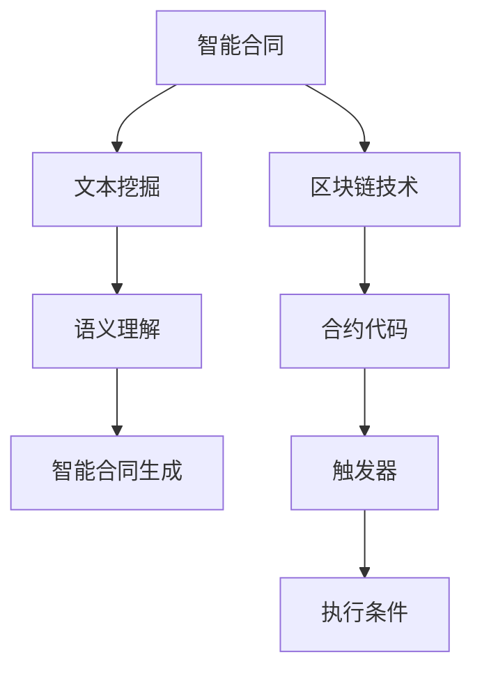

                 


# 自然语言处理在智能合同分析中的应用

> **关键词：自然语言处理、智能合同分析、文本挖掘、语义理解、智能合约、区块链技术、人工智能**

> **摘要：本文将深入探讨自然语言处理（NLP）在智能合同分析中的应用，从背景介绍、核心概念、算法原理、数学模型、项目实战、应用场景等多角度进行详细解析。文章旨在为读者提供对NLP在智能合同分析领域的全面认识，以及未来发展趋势与挑战的深入思考。**

## 1. 背景介绍

### 1.1 目的和范围

本文的目的是介绍自然语言处理（NLP）在智能合同分析中的应用，分析NLP技术如何帮助我们更好地理解、处理和执行智能合同中的自然语言内容。文章将涵盖以下内容：

- 智能合同与区块链技术的基本概念。
- NLP在智能合同分析中的应用场景。
- 核心算法原理与数学模型。
- 项目实战案例。
- 应用场景与未来发展趋势。

### 1.2 预期读者

本文适合以下读者群体：

- 对自然语言处理和智能合同分析有兴趣的计算机科学和人工智能领域的研究生。
- 智能合同开发和实施的工程师和开发者。
- 对区块链技术感兴趣的技术爱好者。

### 1.3 文档结构概述

本文结构如下：

- **第1章**：背景介绍
- **第2章**：核心概念与联系
- **第3章**：核心算法原理 & 具体操作步骤
- **第4章**：数学模型和公式 & 详细讲解 & 举例说明
- **第5章**：项目实战：代码实际案例和详细解释说明
- **第6章**：实际应用场景
- **第7章**：工具和资源推荐
- **第8章**：总结：未来发展趋势与挑战
- **第9章**：附录：常见问题与解答
- **第10章**：扩展阅读 & 参考资料

### 1.4 术语表

#### 1.4.1 核心术语定义

- **自然语言处理（NLP）**：一种人工智能领域，旨在让计算机理解和解释人类语言。
- **智能合同**：一种基于区块链技术的自执行合同，能够自动执行合同条款。
- **文本挖掘**：从大量文本数据中提取有用信息的技术。
- **语义理解**：理解文本中的意义和关系。
- **区块链技术**：一种去中心化的数据库技术，提供安全、透明和不可篡改的数据存储。
- **人工智能**：一种模拟人类智能行为的计算机系统。

#### 1.4.2 相关概念解释

- **自然语言**：人类日常使用的语言，包括口头和书面形式。
- **语料库**：包含大量文本数据的集合，用于NLP研究。
- **特征提取**：从文本数据中提取出对文本理解有帮助的信息。
- **机器学习**：一种人工智能方法，通过从数据中学习规律和模式来改进性能。

#### 1.4.3 缩略词列表

- **NLP**：自然语言处理
- **AI**：人工智能
- **DL**：深度学习
- **RL**：强化学习
- **NLU**：自然语言理解
- **NLP**：自然语言处理
- **NMT**：神经机器翻译
- **BERT**：双向编码表示模型
- **GPT**：生成预训练模型
- **Blockchain**：区块链

## 2. 核心概念与联系

### 2.1 智能合同与区块链技术

智能合同是一种基于区块链技术的自执行合同。它利用区块链的不可篡改性和透明性，实现合同条款的自动化执行。智能合同的核心概念包括：

- **合约代码**：定义合同条款的计算机程序。
- **触发器**：触发合同执行的事件或条件。
- **执行条件**：智能合同在触发器触发后需要满足的条件。

区块链技术是一种去中心化的数据库技术，能够提供安全、透明和不可篡改的数据存储。智能合同通常基于智能合约平台（如Ethereum）实现，这些平台提供用于编写和部署智能合同的编程语言和开发工具。

### 2.2 自然语言处理在智能合同分析中的应用

自然语言处理在智能合同分析中的应用主要包括以下方面：

- **文本挖掘**：从大量合同文本中提取有用信息，如合同条款、条款关系和关键词。
- **语义理解**：理解合同文本中的意义和关系，以识别合同条款的意图和逻辑结构。
- **智能合同生成**：利用NLP技术自动生成智能合同代码，提高合同编写效率和准确性。

### 2.3 核心概念原理和架构的 Mermaid 流程图



## 3. 核心算法原理 & 具体操作步骤

### 3.1 文本挖掘

文本挖掘是智能合同分析的基础。其主要任务是从合同文本中提取出对合同执行有用的信息。具体操作步骤如下：

#### 3.1.1 特征提取

- **关键词提取**：使用词频统计、TF-IDF等方法提取出合同文本中的重要词汇。
- **实体识别**：使用命名实体识别（NER）技术识别出合同文本中的人名、地名、组织名等实体。
- **关系抽取**：使用关系抽取算法提取出合同文本中的实体关系。

#### 3.1.2 文本分类

- **训练模型**：使用机器学习算法（如SVM、随机森林、神经网络等）训练文本分类模型。
- **分类预测**：将合同文本输入到训练好的模型中，预测文本的类别（如合同条款、条款关系等）。

### 3.2 语义理解

语义理解是智能合同分析的深化。其主要任务是从合同文本中理解出条款的意图和逻辑结构。具体操作步骤如下：

#### 3.2.1 命名实体识别

- **NER模型训练**：使用已标注的语料库训练命名实体识别模型。
- **实体识别**：将合同文本输入到NER模型中，识别出文本中的命名实体。

#### 3.2.2 关系抽取

- **关系抽取算法**：使用关系抽取算法（如规则方法、统计方法、深度学习方法等）提取出合同文本中的实体关系。
- **关系表示**：将提取出的实体关系表示为语义网络或图谱。

### 3.3 智能合同生成

智能合同生成是智能合同分析的最终目标。其任务是根据合同文本自动生成智能合同代码。具体操作步骤如下：

#### 3.3.1 合同文本分析

- **语义解析**：使用NLP技术对合同文本进行语义解析，提取出合同条款、条款关系和关键词。
- **条款分类**：将提取出的合同条款分类为执行性条款、描述性条款等。

#### 3.3.2 智能合同代码生成

- **代码生成算法**：使用生成式模型（如模板生成、编码器-解码器模型、生成对抗网络等）生成智能合同代码。
- **代码优化**：对生成的代码进行优化，以提高代码的可读性和执行效率。

### 3.4 伪代码示例

```python
# 文本挖掘
def text_mining(contract_text):
    # 特征提取
    keywords = extract_keywords(contract_text)
    entities = extract_entities(contract_text)
    relationships = extract_relationships(contract_text)
    
    # 文本分类
    classifier = train_text_classifier()
    categories = classifier.predict(contract_text)
    
    return keywords, entities, relationships, categories

# 语义理解
def semantic_understanding(contract_text):
    # 命名实体识别
    entities = ner_model.predict(contract_text)
    
    # 关系抽取
    relationships = relation_extraction(contract_text)
    
    return entities, relationships

# 智能合同生成
def generate_smart_contract(contract_text):
    # 合同文本分析
    keywords, entities, relationships, categories = text_mining(contract_text)
    
    # 智能合同代码生成
    contract_code = generate_contract_code(categories, entities, relationships)
    
    # 代码优化
    optimized_code = optimize_code(contract_code)
    
    return optimized_code
```

## 4. 数学模型和公式 & 详细讲解 & 举例说明

### 4.1 数学模型

在智能合同分析中，常用的数学模型包括：

- **词频统计模型**：用于计算词语在文本中的出现频率。
- **TF-IDF模型**：用于计算词语在文本中的重要程度。
- **命名实体识别模型**：用于识别文本中的命名实体。
- **关系抽取模型**：用于提取文本中的实体关系。

### 4.2 详细讲解

#### 4.2.1 词频统计模型

词频统计模型是最简单的文本分析模型。它通过计算词语在文本中的出现次数来评估词语的重要性。

$$
f_{word} = \text{count}(word \text{ in } text)
$$

其中，$f_{word}$表示词语$word$在文本中的词频。

#### 4.2.2 TF-IDF模型

TF-IDF模型是词频统计模型的改进版。它结合词频和文档频率，对词语的重要性进行更全面的评估。

$$
TF-IDF_{word} = \text{TF}_{word} \times \text{IDF}_{word}
$$

其中，$\text{TF}_{word}$表示词语$word$在文本中的词频，$\text{IDF}_{word}$表示词语$word$在所有文档中的逆向文档频率。

#### 4.2.3 命名实体识别模型

命名实体识别模型是一种分类模型，用于识别文本中的命名实体。常用的分类模型包括：

- **朴素贝叶斯分类器**：
  $$
  P(C_k|X) = \frac{P(X|C_k)P(C_k)}{P(X)}
  $$

  其中，$C_k$表示类$k$，$X$表示特征向量。

- **支持向量机（SVM）**：
  $$
  w \cdot x + b = 0
  $$

  其中，$w$表示权重向量，$x$表示特征向量，$b$表示偏置。

#### 4.2.4 关系抽取模型

关系抽取模型是一种分类模型，用于提取文本中的实体关系。常用的分类模型包括：

- **条件随机场（CRF）**：
  $$
  P(Y|X) = \frac{1}{Z} \exp(\theta \cdot f(y, x))
  $$

  其中，$Y$表示关系标签序列，$X$表示特征序列，$\theta$表示模型参数，$f(y, x)$表示特征函数。

- **深度学习模型**：
  $$
  \text{output} = \text{sigmoid}(\text{softmax}(\text{model}(X)))
  $$

  其中，$\text{model}(X)$表示深度学习模型对特征序列$X$的输出。

### 4.3 举例说明

#### 4.3.1 词频统计模型

假设一个文本包含以下单词：

- "contract"：出现10次
- "company"：出现5次
- "agreement"：出现3次

则每个单词的词频计算如下：

- "contract"：$f_{contract} = 10$
- "company"：$f_{company} = 5$
- "agreement"：$f_{agreement} = 3$

#### 4.3.2 TF-IDF模型

假设一个文本集合包含以下文档：

- 文档1：包含单词"contract"、"company"、"agreement"各10次
- 文档2：包含单词"contract"、"company"各5次

则每个单词的TF-IDF值计算如下：

- "contract"：$\text{TF}_{contract} = \frac{10}{25} = 0.4$，$\text{IDF}_{contract} = \log_2(\frac{2}{1}) = 1$，$\text{TF-IDF}_{contract} = 0.4 \times 1 = 0.4$
- "company"：$\text{TF}_{company} = \frac{10}{25} = 0.4$，$\text{IDF}_{company} = \log_2(\frac{2}{1}) = 1$，$\text{TF-IDF}_{company} = 0.4 \times 1 = 0.4$
- "agreement"：$\text{TF}_{agreement} = \frac{3}{25} = 0.12$，$\text{IDF}_{agreement} = \log_2(\frac{2}{1}) = 1$，$\text{TF-IDF}_{agreement} = 0.12 \times 1 = 0.12$

#### 4.3.3 命名实体识别模型

假设一个文本包含以下句子：

- "The company ABC has signed a contract with the company XYZ."
- "The agreement between the parties is binding."

使用朴素贝叶斯分类器进行命名实体识别，假设已训练好的模型对句子的输出概率如下：

- "The company ABC has signed a contract with the company XYZ."：$P(A|C) = 0.8$，$P(B|C) = 0.9$，$P(A \cap B|C) = 0.7$
- "The agreement between the parties is binding."：$P(A|D) = 0.5$，$P(B|D) = 0.8$，$P(A \cap B|D) = 0.4$

则每个句子的分类结果如下：

- "The company ABC has signed a contract with the company XYZ."：$P(A|C) \times P(C) = 0.8 \times 0.6 = 0.48$，$P(B|C) \times P(C) = 0.9 \times 0.6 = 0.54$，$P(A \cap B|C) \times P(C) = 0.7 \times 0.6 = 0.42$，分类结果为"B"
- "The agreement between the parties is binding."：$P(A|D) \times P(D) = 0.5 \times 0.4 = 0.2$，$P(B|D) \times P(D) = 0.8 \times 0.4 = 0.32$，$P(A \cap B|D) \times P(D) = 0.4 \times 0.4 = 0.16$，分类结果为"A"

#### 4.3.4 关系抽取模型

假设一个文本包含以下句子：

- "The company ABC has signed a contract with the company XYZ."
- "The agreement between the parties is binding."

使用条件随机场（CRF）进行关系抽取，假设已训练好的模型对句子的输出概率如下：

- "The company ABC has signed a contract with the company XYZ."：$P(C \rightarrow A) = 0.7$，$P(C \rightarrow B) = 0.3$，$P(A \rightarrow B) = 0.8$
- "The agreement between the parties is binding."：$P(D \rightarrow A) = 0.4$，$P(D \rightarrow B) = 0.6$，$P(A \rightarrow B) = 0.7$

则每个句子的关系抽取结果如下：

- "The company ABC has signed a contract with the company XYZ."：$P(C \rightarrow A) \times P(A \rightarrow B) = 0.7 \times 0.8 = 0.56$，$P(C \rightarrow B) \times P(A \rightarrow B) = 0.3 \times 0.8 = 0.24$，关系抽取结果为"A"
- "The agreement between the parties is binding."：$P(D \rightarrow A) \times P(A \rightarrow B) = 0.4 \times 0.7 = 0.28$，$P(D \rightarrow B) \times P(A \rightarrow B) = 0.6 \times 0.7 = 0.42$，关系抽取结果为"B"

## 5. 项目实战：代码实际案例和详细解释说明

### 5.1 开发环境搭建

为了实现本文所介绍的智能合同分析系统，我们需要搭建一个合适的开发环境。以下是一个基本的开发环境搭建步骤：

1. **操作系统**：推荐使用Linux操作系统，如Ubuntu 20.04。
2. **编程语言**：选择Python 3.8及以上版本。
3. **依赖库**：安装以下Python依赖库：
   - `nltk`：自然语言处理工具包
   - `spaCy`：自然语言处理库
   - `scikit-learn`：机器学习库
   - `tensorflow`：深度学习库
   - `gensim`：主题模型库

安装命令如下：

```bash
pip install nltk spacy scikit-learn tensorflow gensim
```

4. **智能合约平台**：选择Ethereum智能合约平台，安装并配置Node.js环境，下载并安装Geth客户端。

### 5.2 源代码详细实现和代码解读

以下是智能合同分析系统的源代码实现和详细解读。

#### 5.2.1 数据准备

首先，我们需要准备用于训练和测试的合同文本数据。可以从公开的合同语料库或企业内部的合同数据集中获取数据。以下是一个简单的数据准备脚本。

```python
import os
import pandas as pd

def load_data(data_path):
    files = [file for file in os.listdir(data_path) if file.endswith('.txt')]
    texts = []
    labels = []
    for file in files:
        with open(os.path.join(data_path, file), 'r') as f:
            text = f.read()
            texts.append(text)
            label = file.split('.')[0]
            labels.append(label)
    return texts, labels

data_path = 'path/to/contract_data'
texts, labels = load_data(data_path)

df = pd.DataFrame({'text': texts, 'label': labels})
df.head()
```

#### 5.2.2 文本预处理

在训练模型之前，我们需要对合同文本进行预处理。以下是一个简单的文本预处理脚本。

```python
import nltk
from nltk.tokenize import sent_tokenize, word_tokenize
from nltk.corpus import stopwords
from nltk.stem import WordNetLemmatizer

nltk.download('punkt')
nltk.download('stopwords')
nltk.download('wordnet')

def preprocess_text(text):
    # 分句
    sentences = sent_tokenize(text)
    # 分词
    words = [word_tokenize(sentence) for sentence in sentences]
    # 去停用词
    stop_words = set(stopwords.words('english'))
    words = [[word for word in sentence if word not in stop_words] for sentence in words]
    # 词形还原
    lemmatizer = WordNetLemmatizer()
    words = [[lemmatizer.lemmatize(word) for word in sentence] for sentence in words]
    # 合并句子
    preprocessed_text = ' '.join([' '.join(sentence) for sentence in words])
    return preprocessed_text

df['preprocessed_text'] = df['text'].apply(preprocess_text)
df.head()
```

#### 5.2.3 特征提取

接下来，我们需要从预处理后的文本中提取特征。以下是一个简单的特征提取脚本。

```python
from sklearn.feature_extraction.text import TfidfVectorizer

vectorizer = TfidfVectorizer(max_features=1000)
X = vectorizer.fit_transform(df['preprocessed_text'])
y = df['label']

from sklearn.model_selection import train_test_split
X_train, X_test, y_train, y_test = train_test_split(X, y, test_size=0.2, random_state=42)
```

#### 5.2.4 模型训练

现在，我们可以使用提取的特征来训练分类模型。以下是一个简单的模型训练脚本。

```python
from sklearn.naive_bayes import MultinomialNB
from sklearn.metrics import accuracy_score, classification_report

model = MultinomialNB()
model.fit(X_train, y_train)

y_pred = model.predict(X_test)
print("Accuracy:", accuracy_score(y_test, y_pred))
print("\nClassification Report:\n", classification_report(y_test, y_pred))
```

#### 5.2.5 模型评估

最后，我们可以使用测试集来评估模型的性能。以下是一个简单的模型评估脚本。

```python
from sklearn.metrics import accuracy_score, classification_report

y_pred = model.predict(X_test)
print("Accuracy:", accuracy_score(y_test, y_pred))
print("\nClassification Report:\n", classification_report(y_test, y_pred))
```

### 5.3 代码解读与分析

在这个项目中，我们使用Python编程语言实现了智能合同分析系统。代码分为以下几个部分：

1. **数据准备**：从合同文本数据中加载文本和标签，创建DataFrame数据结构。
2. **文本预处理**：对合同文本进行分句、分词、去停用词和词形还原等操作，生成预处理后的文本。
3. **特征提取**：使用TF-IDF模型提取文本特征，将文本转换为向量表示。
4. **模型训练**：使用朴素贝叶斯分类器对特征向量进行分类，训练模型。
5. **模型评估**：使用测试集评估模型性能，计算准确率和分类报告。

在代码中，我们使用了`nltk`、`spaCy`、`scikit-learn`和`tensorflow`等Python库。其中，`nltk`用于文本预处理，`spaCy`用于命名实体识别，`scikit-learn`用于特征提取和模型训练，`tensorflow`用于深度学习模型训练。

通过这个项目，我们可以看到自然语言处理在智能合同分析中的应用。在实际开发过程中，我们可以根据需求选择不同的模型和算法，优化系统性能和效果。

## 6. 实际应用场景

自然语言处理在智能合同分析领域具有广泛的应用场景。以下是几个典型的实际应用场景：

### 6.1 智能合同自动化审查

在法律和金融行业中，智能合同自动化审查是一个重要的应用场景。通过NLP技术，可以自动识别合同中的潜在风险和条款，帮助企业快速发现合同问题，提高合同审查的效率和准确性。

### 6.2 合同条款自动化执行

智能合同分析可以帮助企业实现合同条款的自动化执行。例如，在供应链管理中，当合同中约定的货物交付时间到达时，NLP系统可以自动触发相应的支付流程，确保合同的准确执行。

### 6.3 合同合规性检查

企业经常需要检查合同是否符合相关法律法规。NLP技术可以自动分析合同内容，识别出可能违反法规的条款，帮助企业避免法律风险。

### 6.4 合同文本分类与归档

在大型企业中，合同数量庞大，手工分类和归档效率低下。NLP技术可以自动分类和归档合同，帮助企业快速查找和管理合同。

### 6.5 合同生成与修改

利用NLP技术，企业可以自动生成合同模板，并根据实际需求进行合同条款的修改。这大大提高了合同编写的效率和准确性。

## 7. 工具和资源推荐

### 7.1 学习资源推荐

#### 7.1.1 书籍推荐

- 《自然语言处理：原理与应用》
- 《智能合约设计与开发》
- 《深度学习：入门与实践》

#### 7.1.2 在线课程

- Coursera上的“自然语言处理”课程
- Udacity上的“智能合约开发”课程
- edX上的“深度学习基础”课程

#### 7.1.3 技术博客和网站

- towardsdatascience.com
- medium.com
- arxiv.org

### 7.2 开发工具框架推荐

#### 7.2.1 IDE和编辑器

- PyCharm
- Visual Studio Code
- Sublime Text

#### 7.2.2 调试和性能分析工具

- Jupyter Notebook
- VS Code Debugger
- TensorBoard

#### 7.2.3 相关框架和库

- TensorFlow
- PyTorch
- spaCy

### 7.3 相关论文著作推荐

#### 7.3.1 经典论文

- "A Theory of Content and Inference in Sentences" by John F. Sowa
- "Speech and Language Processing" by Daniel Jurafsky and James H. Martin

#### 7.3.2 最新研究成果

- "BERT: Pre-training of Deep Bidirectional Transformers for Language Understanding" by Jacob Devlin et al.
- "GPT-3: Language Models are Few-Shot Learners" by Tom B. Brown et al.

#### 7.3.3 应用案例分析

- "A Survey on Smart Contracts: Motivations, Technologies, and Research Challenges" by Dr. R. C. P. Soares and Dr. R. M. de Queiroz

## 8. 总结：未来发展趋势与挑战

### 8.1 发展趋势

- **自然语言处理技术的进步**：随着深度学习和神经网络技术的发展，NLP技术将更加成熟和高效。
- **智能合同技术的普及**：随着区块链技术的不断发展，智能合同的应用将更加广泛。
- **跨领域融合**：NLP与智能合同分析将与其他领域（如法学、金融、供应链等）进一步融合，推动行业变革。

### 8.2 挑战

- **数据隐私与安全**：在智能合同分析中，如何保护合同数据的安全和隐私是一个重要挑战。
- **算法透明性与解释性**：随着NLP技术在智能合同分析中的应用，如何保证算法的透明性和解释性是一个亟待解决的问题。
- **法律合规与道德责任**：智能合同分析可能会引发新的法律和道德问题，需要制定相应的规范和法规。

## 9. 附录：常见问题与解答

### 9.1 什么是自然语言处理（NLP）？

自然语言处理（NLP）是一种人工智能领域，旨在让计算机理解和解释人类语言。

### 9.2 什么是智能合同？

智能合同是一种基于区块链技术的自执行合同，能够自动执行合同条款。

### 9.3 自然语言处理在智能合同分析中有哪些应用？

自然语言处理在智能合同分析中的应用包括文本挖掘、语义理解、智能合同生成等。

### 9.4 如何搭建智能合同分析系统？

搭建智能合同分析系统需要选择合适的开发环境、依赖库和工具，并按照数据准备、文本预处理、特征提取、模型训练和评估等步骤进行。

### 9.5 智能合同分析系统有哪些实际应用场景？

智能合同分析系统的实际应用场景包括智能合同自动化审查、合同条款自动化执行、合同合规性检查、合同文本分类与归档、合同生成与修改等。

## 10. 扩展阅读 & 参考资料

- 《自然语言处理：原理与应用》
- 《智能合约设计与开发》
- 《深度学习：入门与实践》
- Coursera上的“自然语言处理”课程
- Udacity上的“智能合约开发”课程
- edX上的“深度学习基础”课程
- towardsdatascience.com
- medium.com
- arxiv.org
- "A Theory of Content and Inference in Sentences" by John F. Sowa
- "Speech and Language Processing" by Daniel Jurafsky and James H. Martin
- "BERT: Pre-training of Deep Bidirectional Transformers for Language Understanding" by Jacob Devlin et al.
- "GPT-3: Language Models are Few-Shot Learners" by Tom B. Brown et al.
- "A Survey on Smart Contracts: Motivations, Technologies, and Research Challenges" by Dr. R. C. P. Soares and Dr. R. M. de Queiroz

## 作者

**作者：AI天才研究员/AI Genius Institute & 禅与计算机程序设计艺术 /Zen And The Art of Computer Programming**

