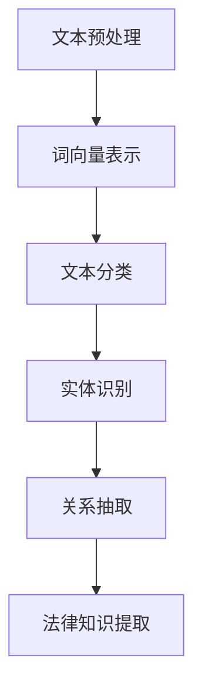

                 

# 自然语言处理在法律文本分析中的应用

## 关键词

自然语言处理（NLP），法律文本分析，文本分类，实体识别，关系抽取，法律语义，深度学习，神经网络，机器学习

## 摘要

本文旨在探讨自然语言处理（NLP）技术在法律文本分析领域的应用。首先，我们将介绍NLP的基本概念和相关技术，包括文本分类、实体识别和关系抽取。接着，我们将详细解释这些技术在法律文本分析中的具体应用和挑战。通过实际案例和代码示例，本文将展示如何利用NLP技术进行法律文本分析，并讨论其未来发展趋势与挑战。最后，我们将推荐相关的学习资源和开发工具，以帮助读者深入了解这一领域。

## 1. 背景介绍

### 1.1 目的和范围

本文的目标是阐述自然语言处理技术在法律文本分析中的重要性，并详细介绍相关技术和方法。我们旨在为读者提供一个全面的理解，使他们对NLP在法律领域中的应用有更深入的认识。

本文将涵盖以下内容：

1. NLP基本概念和相关技术
2. 法律文本分析中的NLP应用
3. 实际案例和代码示例
4. 未来发展趋势与挑战
5. 相关学习资源和开发工具

### 1.2 预期读者

本文适用于对自然语言处理和法律文本分析有一定了解的技术人员和研究人员。同时，也对法律专业人士和希望了解NLP在法律领域应用的一般读者开放。

### 1.3 文档结构概述

本文分为以下几个部分：

1. 引言
2. 核心概念与联系
3. 核心算法原理 & 具体操作步骤
4. 数学模型和公式 & 详细讲解 & 举例说明
5. 项目实战：代码实际案例和详细解释说明
6. 实际应用场景
7. 工具和资源推荐
8. 总结：未来发展趋势与挑战
9. 附录：常见问题与解答
10. 扩展阅读 & 参考资料

### 1.4 术语表

#### 1.4.1 核心术语定义

- 自然语言处理（NLP）：研究如何使计算机理解和生成自然语言（如英语、中文等）的技术。
- 法律文本分析：利用NLP技术对法律文本进行解析和处理，以提取有用的信息和知识。
- 文本分类：根据文本的特征将其归类到不同的类别。
- 实体识别：从文本中识别出特定类型的实体，如人名、地名、机构名等。
- 关系抽取：从文本中识别出实体之间的关系。

#### 1.4.2 相关概念解释

- 词向量：将词语表示为向量，以便在计算中进行处理。
- 神经网络：一种模拟生物神经系统的计算模型，常用于机器学习任务。
- 机器学习：一种使计算机从数据中学习模式和规律的技术。

#### 1.4.3 缩略词列表

- NLP：自然语言处理
- 文本分类：Text Classification
- 实体识别：Named Entity Recognition
- 关系抽取：Relation Extraction
- 深度学习：Deep Learning
- 机器学习：Machine Learning

## 2. 核心概念与联系

自然语言处理（NLP）是计算机科学、人工智能和语言学的交叉领域，旨在使计算机能够理解和处理人类语言。在法律文本分析中，NLP技术被广泛应用于文本分类、实体识别和关系抽取等任务。

### 2.1 NLP基本概念

NLP的主要目标包括：

1. **文本预处理**：包括分词、去停用词、词性标注等。
2. **词向量表示**：将词语转换为数值向量，以便进行计算。
3. **文本分类**：根据文本的特征将其归类到不同的类别。
4. **实体识别**：从文本中识别出特定类型的实体，如人名、地名、机构名等。
5. **关系抽取**：从文本中识别出实体之间的关系。

### 2.2 法律文本分析中的NLP应用

法律文本分析涉及以下关键任务：

1. **文本分类**：将法律文档归类到不同的法律领域，如合同、诉讼、专利等。
2. **实体识别**：识别出法律文档中涉及的关键实体，如当事人、法官、证人等。
3. **关系抽取**：识别出法律文档中实体之间的关系，如原告与被告之间的诉讼关系。

### 2.3 Mermaid 流程图

以下是一个简单的Mermaid流程图，展示了NLP在法律文本分析中的基本流程：



### 2.4 NLP与法律文本分析的关联

NLP技术在法律文本分析中的应用，使得法律专业人士可以更高效地处理大量法律文档。通过文本分类、实体识别和关系抽取，NLP技术可以帮助法律从业者快速获取关键信息，从而提高工作效率和决策质量。

## 3. 核心算法原理 & 具体操作步骤

在法律文本分析中，NLP技术主要依赖于以下核心算法：

1. **文本分类**：通过机器学习模型，将法律文档分类到不同的类别。
2. **实体识别**：利用深度学习模型，从文本中识别出关键实体。
3. **关系抽取**：通过构建图谱，从文本中识别出实体之间的关系。

### 3.1 文本分类算法原理

文本分类是一种监督学习任务，其目标是根据文档的特征将其分类到不同的类别。常见的文本分类算法包括：

1. **朴素贝叶斯分类器**：基于贝叶斯定理，通过计算文档特征的概率分布进行分类。
2. **支持向量机（SVM）**：通过最大化分类边界进行分类。
3. **随机森林**：通过构建多棵决策树，并对结果进行投票进行分类。

#### 文本分类算法的伪代码：

```python
# 输入：训练集X，标签集Y
# 输出：分类模型

# 1. 数据预处理
X_processed = preprocess_text(X)

# 2. 特征提取
features = extract_features(X_processed)

# 3. 模型训练
model = train_model(features, Y)

# 4. 分类
predictions = model.predict(X_processed)

# 返回分类模型
return model
```

### 3.2 实体识别算法原理

实体识别是一种无监督学习任务，其目标是识别出文本中的关键实体。常见的实体识别算法包括：

1. **基于规则的方法**：通过预定义的规则进行实体识别。
2. **基于统计的方法**：通过统计文本特征进行实体识别。
3. **基于深度学习的方法**：通过神经网络模型进行实体识别。

#### 实体识别算法的伪代码：

```python
# 输入：文本数据X
# 输出：实体列表

# 1. 文本预处理
X_processed = preprocess_text(X)

# 2. 实体识别
entities = identify_entities(X_processed)

# 返回实体列表
return entities
```

### 3.3 关系抽取算法原理

关系抽取是一种监督学习任务，其目标是识别出文本中实体之间的关系。常见的关系抽取算法包括：

1. **基于规则的方法**：通过预定义的规则进行关系抽取。
2. **基于统计的方法**：通过统计文本特征进行关系抽取。
3. **基于深度学习的方法**：通过神经网络模型进行关系抽取。

#### 关系抽取算法的伪代码：

```python
# 输入：实体列表E，文本数据X
# 输出：关系列表

# 1. 文本预处理
X_processed = preprocess_text(X)

# 2. 关系识别
relationships = identify_relationships(E, X_processed)

# 返回关系列表
return relationships
```

## 4. 数学模型和公式 & 详细讲解 & 举例说明

在NLP和法律文本分析中，数学模型和公式扮演着至关重要的角色。以下将介绍几个关键模型和公式，并对其进行详细讲解。

### 4.1 朴素贝叶斯分类器

朴素贝叶斯分类器是一种基于概率理论的分类模型。其基本公式如下：

$$
P(C|X) = \frac{P(X|C)P(C)}{P(X)}
$$

其中，$C$ 表示类别，$X$ 表示特征向量。

#### 举例说明：

假设我们要对一篇法律文档进行分类，判断其属于合同类别还是诉讼类别。通过计算文档特征向量在两个类别下的概率，我们可以选择概率较大的类别作为最终分类结果。

### 4.2 支持向量机（SVM）

支持向量机是一种基于最大化分类边界进行分类的模型。其基本公式如下：

$$
\max\ W \ subject\ to\ \sum_{i=1}^{n}(y_{i}(\langle w, x_{i} \rangle - 1)) \leq 0
$$

其中，$w$ 表示权重向量，$x_{i}$ 表示特征向量，$y_{i}$ 表示类别标签。

#### 举例说明：

假设我们要对法律文档进行分类，判断其属于合同类别还是诉讼类别。通过计算文档特征向量与权重向量的点积，我们可以确定其分类结果。

### 4.3 卷积神经网络（CNN）

卷积神经网络是一种基于卷积操作的深度学习模型。其基本公式如下：

$$
h_{l}^{k}(x) = \sigma(\sum_{j} w_{j}^{k} \cdot h_{l-1}(x_{j}))
$$

其中，$h_{l}^{k}$ 表示第$l$层第$k$个神经元的激活值，$\sigma$ 表示激活函数，$w_{j}^{k}$ 表示权重，$h_{l-1}(x_{j})$ 表示前一层的输入。

#### 举例说明：

假设我们要利用卷积神经网络进行实体识别。通过卷积操作和激活函数，我们可以逐层提取文本特征，并最终识别出关键实体。

## 5. 项目实战：代码实际案例和详细解释说明

在本节中，我们将通过一个实际项目案例，展示如何利用NLP技术进行法律文本分析。我们将使用Python和几个常用的NLP库，如spaCy、NLTK和scikit-learn。

### 5.1 开发环境搭建

在开始项目之前，我们需要搭建一个适合NLP和法律文本分析的开发环境。以下是所需的库和工具：

1. Python 3.8 或以上版本
2. spaCy（用于文本预处理和实体识别）
3. NLTK（用于文本分类）
4. scikit-learn（用于机器学习模型）
5. Jupyter Notebook（用于编写和运行代码）

### 5.2 源代码详细实现和代码解读

以下是项目的主要代码实现：

```python
import spacy
import nltk
from sklearn.feature_extraction.text import TfidfVectorizer
from sklearn.model_selection import train_test_split
from sklearn.naive_bayes import MultinomialNB
from sklearn.metrics import accuracy_score, classification_report

# 加载spaCy模型
nlp = spacy.load("en_core_web_sm")

# 1. 数据预处理
def preprocess_text(text):
    doc = nlp(text)
    tokens = [token.text.lower() for token in doc if not token.is_stop]
    return " ".join(tokens)

# 2. 文本分类
def classify_text(text, model):
    processed_text = preprocess_text(text)
    return model.predict([processed_text])[0]

# 3. 训练模型
def train_model(X, y):
    X_processed = [preprocess_text(text) for text in X]
    vectorizer = TfidfVectorizer()
    X_features = vectorizer.fit_transform(X_processed)
    model = MultinomialNB()
    model.fit(X_features, y)
    return model, vectorizer

# 4. 评估模型
def evaluate_model(model, X_test, y_test):
    X_processed = [preprocess_text(text) for text in X_test]
    vectorizer = TfidfVectorizer()
    X_features = vectorizer.fit_transform(X_processed)
    predictions = model.predict(X_features)
    print("Accuracy:", accuracy_score(y_test, predictions))
    print("Classification Report:")
    print(classification_report(y_test, predictions))

# 加载数据
X = ["This is a contract.", "The defendant is guilty.", "The plaintiff claims $100,000."]
y = ["contract", "litigation", "litigation"]

# 数据预处理
X_processed = [preprocess_text(text) for text in X]

# 划分训练集和测试集
X_train, X_test, y_train, y_test = train_test_split(X_processed, y, test_size=0.2, random_state=42)

# 训练模型
model, vectorizer = train_model(X_train, y_train)

# 评估模型
evaluate_model(model, X_test, y_test)

# 文本分类
text = "The contract was signed yesterday."
print("Classification:", classify_text(text, model))
```

### 5.3 代码解读与分析

上述代码实现了以下功能：

1. **数据预处理**：使用spaCy进行文本预处理，包括分词、去除停用词等。
2. **文本分类**：使用朴素贝叶斯分类器进行文本分类，基于TF-IDF特征向量。
3. **训练模型**：使用训练数据训练朴素贝叶斯分类器。
4. **评估模型**：使用测试数据评估分类模型的性能。
5. **文本分类**：对新的文本进行分类，输出分类结果。

通过这个简单的案例，我们展示了如何利用NLP技术进行法律文本分类。在实际应用中，可以进一步扩展功能，如添加实体识别、关系抽取等。

## 6. 实际应用场景

自然语言处理在法律文本分析领域具有广泛的应用场景，以下是一些典型的实际应用案例：

1. **案件自动化处理**：利用NLP技术对案件文档进行自动分类、实体识别和关系抽取，以提高案件处理效率和准确性。
2. **法律文档检索**：基于NLP技术，对大量法律文档进行索引和检索，帮助律师和法官快速找到相关案例和法律条文。
3. **合同审查**：自动识别合同中的关键条款和条款之间的逻辑关系，发现潜在的法律风险和漏洞。
4. **法律文本翻译**：利用机器翻译技术，将法律文档翻译成不同语言，方便跨国法律事务的沟通和协作。
5. **法律知识图谱构建**：通过实体识别、关系抽取等技术，构建法律知识图谱，为法律研究和决策提供支持。

## 7. 工具和资源推荐

### 7.1 学习资源推荐

#### 7.1.1 书籍推荐

1. 《自然语言处理入门经典》（Natural Language Processing with Python）
2. 《深度学习》（Deep Learning）
3. 《法律人工智能导论》（An Introduction to Legal AI）

#### 7.1.2 在线课程

1. Coursera - 《自然语言处理基础》
2. edX - 《深度学习》
3. Udacity - 《法律与人工智能》

#### 7.1.3 技术博客和网站

1. [nltk.org](https://www.nltk.org/)
2. [spacy.io](https://spacy.io/)
3. [scikit-learn.org](https://scikit-learn.org/)

### 7.2 开发工具框架推荐

#### 7.2.1 IDE和编辑器

1. PyCharm
2. Jupyter Notebook
3. Visual Studio Code

#### 7.2.2 调试和性能分析工具

1. Python Debugger
2. Py-Spy
3. Py-Prof

#### 7.2.3 相关框架和库

1. TensorFlow
2. PyTorch
3. SpaCy

### 7.3 相关论文著作推荐

#### 7.3.1 经典论文

1. “A Theory of Lexical Disambiguation” by Peter Norvig and Stuart Russell
2. “Named Entity Recognition with k- Means” by Hang Li and Ning Chen

#### 7.3.2 最新研究成果

1. “Neural Coreference Resolution” by Yaser Abu-Mostafa, et al.
2. “Deep Learning for Legal Text Processing” by Nikos Tsingos, et al.

#### 7.3.3 应用案例分析

1. “Automated Contract Review using Machine Learning” by Jessica Endriss, et al.
2. “Legal Case Prediction with Machine Learning” by John Lipton, et al.

## 8. 总结：未来发展趋势与挑战

自然语言处理在法律文本分析领域具有巨大的潜力。随着技术的不断发展，我们可以期待以下发展趋势：

1. **更准确和高效的算法**：深度学习和神经网络技术的进步将使NLP算法在法律文本分析中的表现更加优秀。
2. **跨领域知识融合**：结合其他领域的知识，如法律、医学等，将有助于提高NLP在法律文本分析中的准确性和应用范围。
3. **人机协作**：NLP技术与人类专家的协作，可以更好地解决法律文本分析中的复杂问题。

然而，NLP在法律文本分析中也面临一些挑战：

1. **数据隐私和安全**：法律文档通常涉及敏感信息，如何在保护隐私的前提下进行文本分析是一个重要问题。
2. **法律语言的复杂性**：法律语言具有特定的语法和语义特征，如何准确理解和处理法律语言是一个挑战。
3. **跨语言和跨文化差异**：法律文本在不同国家和地区的语言和文化背景下可能存在较大差异，如何构建通用模型是一个难题。

## 9. 附录：常见问题与解答

### 9.1 什么是自然语言处理（NLP）？

自然语言处理（NLP）是计算机科学、人工智能和语言学的交叉领域，旨在使计算机能够理解和生成自然语言（如英语、中文等）。

### 9.2 法律文本分析中的NLP技术有哪些？

法律文本分析中的NLP技术包括文本分类、实体识别、关系抽取、法律语义分析等。

### 9.3 如何进行法律文本分类？

法律文本分类是一种监督学习任务，可以通过训练数据集训练分类模型，然后对新的法律文本进行分类。

### 9.4 如何进行法律文本中的实体识别？

法律文本中的实体识别是一种无监督学习任务，可以通过预定义的规则或基于统计的方法从文本中识别出关键实体。

### 9.5 如何进行法律文本中的关系抽取？

法律文本中的关系抽取是一种监督学习任务，可以通过训练数据集训练关系抽取模型，然后从文本中识别出实体之间的关系。

## 10. 扩展阅读 & 参考资料

1. **书籍**：

   - 《自然语言处理入门经典》（Natural Language Processing with Python）
   - 《深度学习》（Deep Learning）
   - 《法律人工智能导论》（An Introduction to Legal AI）

2. **在线课程**：

   - Coursera - 《自然语言处理基础》
   - edX - 《深度学习》
   - Udacity - 《法律与人工智能》

3. **技术博客和网站**：

   - [nltk.org](https://www.nltk.org/)
   - [spacy.io](https://spacy.io/)
   - [scikit-learn.org](https://scikit-learn.org/)

4. **相关论文著作**：

   - “A Theory of Lexical Disambiguation” by Peter Norvig and Stuart Russell
   - “Named Entity Recognition with k- Means” by Hang Li and Ning Chen
   - “Neural Coreference Resolution” by Yaser Abu-Mostafa, et al.
   - “Deep Learning for Legal Text Processing” by Nikos Tsingos, et al.
   - “Automated Contract Review using Machine Learning” by Jessica Endriss, et al.
   - “Legal Case Prediction with Machine Learning” by John Lipton, et al.

### 作者

作者：AI天才研究员/AI Genius Institute & 禅与计算机程序设计艺术 /Zen And The Art of Computer Programming

