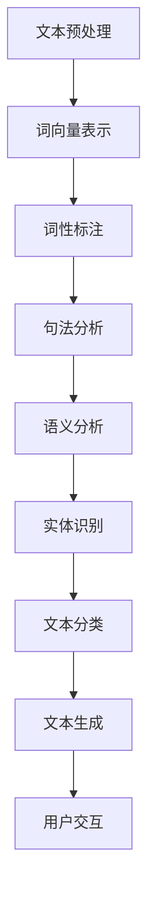
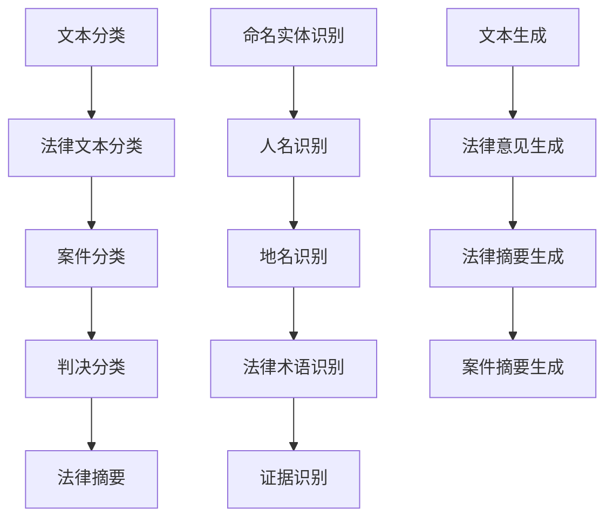

                 

### 自然语言处理在法律文本分析中的应用

> **关键词**：自然语言处理、法律文本分析、文本分类、命名实体识别、文本生成、人工智能、机器学习、深度学习

> **摘要**：本文将探讨自然语言处理（NLP）在法律文本分析中的应用。首先，我们将介绍法律文本分析的目的和重要性。随后，通过逐步分析NLP在法律文本分析中的关键技术，如文本分类、命名实体识别和文本生成，来展示其在法律领域的具体应用。文章还将介绍实际案例、开发环境搭建、代码实现和工具资源推荐，最后总结未来发展趋势与挑战。

## 1. 背景介绍

### 1.1 目的和范围

本文旨在深入探讨自然语言处理（NLP）在法律文本分析中的应用，包括文本分类、命名实体识别和文本生成等方面。通过分析这些关键技术的原理和实现方法，本文希望能够为读者提供一个全面了解法律文本分析在人工智能领域的重要性的视角。

本文的范围将涵盖以下内容：

1. **法律文本分析的目的和重要性**：介绍法律文本分析的基本概念，阐述其在法律领域的应用和价值。
2. **NLP关键技术**：详细解释文本分类、命名实体识别和文本生成等NLP技术在法律文本分析中的应用原理。
3. **实际应用案例**：通过具体实例展示NLP技术在法律文本分析中的实际应用，如案件文本分类、法律文本摘要和法律意见生成等。
4. **开发环境搭建和代码实现**：介绍法律文本分析项目的开发环境搭建，包括编程语言、工具和框架的选择，并提供具体的代码实现示例。
5. **工具和资源推荐**：推荐相关学习资源、开发工具和论文著作，为读者提供进一步学习和实践的方向。
6. **总结与展望**：总结文章的主要观点，讨论未来发展趋势与挑战。

通过以上内容的探讨，本文希望能够为从事法律文本分析和自然语言处理领域的读者提供一个系统的学习和实践指南。

### 1.2 预期读者

本文主要面向以下几类读者：

1. **自然语言处理研究人员**：对NLP技术有基本了解，希望深入了解其在法律文本分析中的应用原理和实现方法。
2. **法律专业人员**：对法律文本分析有一定了解，希望借助NLP技术提高工作效率，提升法律工作的准确性和效率。
3. **软件开发工程师**：对NLP技术有一定了解，希望将其应用于实际的法律文本分析项目。
4. **人工智能从业者**：对人工智能和自然语言处理技术有浓厚兴趣，希望了解其在法律领域的应用前景。
5. **在校学生和研究人员**：希望了解NLP技术在法律文本分析中的应用，为未来的研究和实践打下基础。

通过本文的阅读，读者可以全面了解自然语言处理在法律文本分析中的关键技术和实际应用，从而更好地应用于实际项目和研究中。

### 1.3 文档结构概述

本文将按照以下结构展开：

1. **引言**：介绍自然语言处理在法律文本分析中的应用背景和目的。
2. **法律文本分析的基础**：阐述法律文本分析的基本概念、目的和重要性。
3. **自然语言处理的关键技术**：
   - **文本分类**：介绍文本分类的原理、方法和在法律文本分析中的应用。
   - **命名实体识别**：解释命名实体识别的原理、方法和在法律文本分析中的应用。
   - **文本生成**：探讨文本生成的原理、方法和在法律文本分析中的应用。
4. **实际应用案例**：通过具体实例展示NLP技术在法律文本分析中的实际应用。
5. **开发环境搭建和代码实现**：介绍开发法律文本分析项目的环境搭建、编程语言和工具选择，并提供代码实现示例。
6. **工具和资源推荐**：推荐学习资源、开发工具和论文著作，为读者提供进一步学习和实践的方向。
7. **总结与展望**：总结文章的主要观点，讨论未来发展趋势与挑战。

通过以上结构的详细展开，本文旨在为读者提供一份系统、全面的法律文本分析技术指南。

### 1.4 术语表

为了确保文章内容的准确性和可理解性，本文将介绍一些关键术语的定义和相关概念解释。以下是对主要术语的详细解释：

#### 1.4.1 核心术语定义

- **自然语言处理（NLP）**：指计算机和人类语言之间的交互，旨在让计算机理解和生成人类语言。
- **法律文本分析**：指利用自然语言处理技术对法律文本进行自动化处理和分析，以提取有用信息和知识。
- **文本分类**：指将文本数据分配到预定义的类别中，常用于法律文本的自动分类。
- **命名实体识别（NER）**：指从文本中识别出具有特定意义的实体，如人名、地名、法律术语等。
- **文本生成**：指根据特定输入生成新的文本，常用于法律意见生成和法律文档自动摘要。

#### 1.4.2 相关概念解释

- **语料库**：指包含大量文本数据，用于训练和评估自然语言处理模型。
- **词向量**：指将词汇映射到向量空间，便于计算和分析。
- **机器学习模型**：指通过训练大量数据来学习和预测的算法，如分类器、回归器和生成模型。
- **深度学习**：指通过多层神经网络进行学习和预测的机器学习技术，常用于复杂任务如图像识别和自然语言处理。

#### 1.4.3 缩略词列表

- **NLP**：自然语言处理（Natural Language Processing）
- **NER**：命名实体识别（Named Entity Recognition）
- **RNN**：递归神经网络（Recurrent Neural Network）
- **LSTM**：长短期记忆网络（Long Short-Term Memory）
- **BERT**：BERT模型（Bidirectional Encoder Representations from Transformers）

通过上述术语和概念的介绍，读者可以更好地理解本文中涉及的关键技术和概念，从而更加深入地理解法律文本分析中的自然语言处理应用。

## 2. 核心概念与联系

在探讨自然语言处理（NLP）在法律文本分析中的应用之前，我们需要首先理解一些核心概念和它们之间的联系。这些概念包括文本分类、命名实体识别（NER）、文本生成等，它们构成了NLP技术的基础，也是法律文本分析中至关重要的组成部分。

### 2.1 NLP技术基础

自然语言处理（NLP）涉及多个层面的语言理解与生成。图2.1展示了NLP技术的基础架构，以及各个组件之间的关系。



#### 文本预处理

文本预处理是NLP的第一步，它包括去除停用词、分词、标记化等操作。这一步的目的是将原始文本转换为计算机可以处理的格式。

#### 词向量表示

词向量表示是将词汇映射到高维向量空间，以便进行计算和分析。常见的词向量模型包括Word2Vec、GloVe等。

#### 词性标注

词性标注是将文本中的每个单词标记为名词、动词、形容词等词性，这一步有助于句法分析和语义分析。

#### 句法分析

句法分析是对文本中的句子结构进行分析，包括句子成分、依存关系等。句法分析有助于理解文本的语法结构，从而进行更精确的语义分析。

#### 语义分析

语义分析是对文本中词汇和句子的含义进行深入理解，包括语义角色标注、情感分析等。语义分析是NLP中的核心任务，对于法律文本分析尤为重要。

#### 实体识别

实体识别（NER）是从文本中识别出具有特定意义的实体，如人名、地名、法律术语等。在法律文本分析中，NER可以帮助识别案件中的关键信息。

#### 文本分类

文本分类是将文本数据分配到预定义的类别中，常用于法律文本的自动分类。例如，将案件文本分类为民事案件、刑事案件等。

#### 文本生成

文本生成是根据特定输入生成新的文本，如法律意见生成、法律文档自动摘要。文本生成在法律文本分析中具有广泛应用，可以提高法律工作的效率。

### 2.2 法律文本分析的关键技术

在理解NLP技术基础后，我们进一步探讨NLP在法律文本分析中的关键技术，如图2.2所示。



#### 文本分类

文本分类是法律文本分析的基础技术之一，它将法律文本数据分配到预定义的类别中。例如，将案件文本分类为民事案件、刑事案件等，以便进行后续处理和分析。

#### 命名实体识别

命名实体识别（NER）是法律文本分析中的一项关键技术，它能够从法律文本中识别出人名、地名、法律术语等关键信息。NER在法律文本分析中的应用非常广泛，如案件文档的自动分类、法律条款的自动提取等。

#### 文本生成

文本生成技术在法律文本分析中的应用也非常广泛。例如，法律意见生成可以自动生成案件的法律意见书；法律摘要生成可以自动生成案件的摘要，方便法律工作者快速了解案件的主要内容和关键信息。

通过以上核心概念的介绍，我们可以看到，自然语言处理技术为法律文本分析提供了强大的工具和方法。接下来，我们将深入探讨这些技术的工作原理和实现方法。

## 3. 核心算法原理 & 具体操作步骤

在法律文本分析中，自然语言处理技术发挥了关键作用。本节将详细解释几个核心算法的工作原理，并提供具体的操作步骤和伪代码，以便读者更好地理解其实现过程。

### 3.1 文本分类算法原理

文本分类是一种监督学习任务，通过已标注的数据训练模型，以预测新的文本类别。在法律文本分析中，文本分类用于案件分类、判决分类和法律摘要等任务。常见的文本分类算法包括朴素贝叶斯、支持向量机和深度学习模型。

#### 3.1.1 朴素贝叶斯算法原理

朴素贝叶斯（Naive Bayes）是一种基于贝叶斯定理的算法，适用于文本分类任务。其基本原理是计算每个类别在给定特征条件下的概率，并选择概率最高的类别作为预测结果。

伪代码：

```python
function NaiveBayes(train_data, train_labels, test_data):
    # 计算每个类别下的特征概率和类别概率
    for each category c in labels:
        P(c) = count(c) / total_number_of_documents
        for each word w in vocabulary:
            P(w|c) = count(w, c) / count(c)
    
    # 对于每个测试文本，计算其在每个类别下的概率
    for each document d in test_data:
        probabilities = {}
        for each category c in labels:
            probability = P(c) * product(P(word|c))
            probabilities[c] = probability
        
        # 选择概率最高的类别作为预测结果
        predicted_label = argmax(probabilities)
        return predicted_label
```

#### 3.1.2 支持向量机算法原理

支持向量机（SVM）是一种强大的分类算法，通过找到一个最佳的超平面来分离不同类别的数据点。在文本分类中，SVM将文本转换为高维特征空间，以找到最佳分类边界。

伪代码：

```python
function SVM(train_data, train_labels):
    # 将文本数据转换为高维特征向量
    transformed_data = transform_to_high_dimensional_space(train_data)
    
    # 使用支持向量机训练模型
    model = train_SVM_model(transformed_data, train_labels)
    
    # 对于每个测试文本，计算其在超平面上的得分
    for each document d in test_data:
        transformed_d = transform_to_high_dimensional_space(d)
        score = model.predict(transformed_d)
        
        # 选择得分最高的类别作为预测结果
        predicted_label = argmax(score)
        return predicted_label
```

#### 3.1.3 深度学习模型原理

深度学习模型，如卷积神经网络（CNN）和循环神经网络（RNN），在文本分类任务中也取得了显著的效果。这些模型通过多层神经网络学习文本的复杂特征，从而提高分类精度。

伪代码：

```python
function DeepLearningModel(train_data, train_labels):
    # 建立深度学习模型
    model = build_deep_learning_model()
    
    # 训练模型
    model.fit(train_data, train_labels)
    
    # 对于每个测试文本，进行预测
    for each document d in test_data:
        prediction = model.predict(d)
        
        # 选择预测结果作为类别
        predicted_label = prediction
        return predicted_label
```

### 3.2 命名实体识别（NER）算法原理

命名实体识别（NER）是一种从文本中识别出具有特定意义的实体的任务，如人名、地名、法律术语等。NER在法律文本分析中用于提取案件中的关键信息，如证人姓名、地名、法律条款等。

#### 3.2.1 基于规则的方法

基于规则的方法通过预定义的规则库来识别命名实体。这些规则基于实体在文本中的常见模式和特征。

伪代码：

```python
function RuleBasedNER(text):
    entities = []
    for rule in rule_base:
        if rule_applies_to_text(text):
            entities.append(rule.entity)
    return entities
```

#### 3.2.2 基于统计的方法

基于统计的方法使用机器学习模型来识别命名实体。常见的模型包括隐马尔可夫模型（HMM）、条件随机场（CRF）和深度学习模型。

伪代码：

```python
function StatisticalNER(text, model):
    # 使用训练好的模型进行命名实体识别
    entities = model.predict(text)
    return entities
```

#### 3.2.3 基于深度学习的方法

基于深度学习的方法，如长短期记忆网络（LSTM）和双向长短期记忆网络（BiLSTM），在NER任务中取得了显著效果。这些模型通过学习文本的上下文信息来识别命名实体。

伪代码：

```python
function DeepLearningNER(text, model):
    # 使用训练好的深度学习模型进行命名实体识别
    entities = model.predict(text)
    return entities
```

### 3.3 文本生成算法原理

文本生成技术可以自动生成新的文本，如法律意见、案件摘要等。常见的文本生成模型包括生成对抗网络（GAN）、序列到序列（Seq2Seq）模型和变分自编码器（VAE）。

#### 3.3.1 生成对抗网络（GAN）

生成对抗网络（GAN）由生成器和判别器组成。生成器生成假文本，判别器判断文本的真实性。通过训练生成器和判别器之间的对抗关系，生成器逐渐生成更真实的文本。

伪代码：

```python
function GAN(train_data):
    # 初始化生成器和判别器
    generator = initialize_generator()
    discriminator = initialize_discriminator()
    
    # 训练生成器和判别器
    for epoch in range(num_epochs):
        for text in train_data:
            real_labels = 1
            fake_labels = 0
            
            # 训练判别器
            discriminator_loss = train_discriminator(discriminator, text, real_labels)
            
            # 训练生成器
            generator_loss = train_generator(generator, discriminator, fake_labels)
    
    # 使用生成器生成文本
    generated_text = generator.generate_text()
    return generated_text
```

#### 3.3.2 序列到序列（Seq2Seq）模型

序列到序列（Seq2Seq）模型通过编码器和解码器学习输入序列和输出序列之间的映射关系。在文本生成任务中，编码器将输入文本编码为向量表示，解码器根据向量表示生成新的文本序列。

伪代码：

```python
function Seq2Seq(train_data, target_data):
    # 初始化编码器和解码器
    encoder = initialize_encoder()
    decoder = initialize_decoder()
    
    # 训练编码器和解码器
    for epoch in range(num_epochs):
        for input_sequence, target_sequence in zip(train_data, target_data):
            encoder_output = encoder.encode(input_sequence)
            decoder_output = decoder.decode(encoder_output)
            
            # 计算损失并更新模型参数
            loss = compute_loss(decoder_output, target_sequence)
            update_model_parameters(encoder, decoder, loss)
    
    # 使用解码器生成文本
    generated_text = decoder.generate_text(encoder)
    return generated_text
```

通过以上对文本分类、命名实体识别和文本生成算法原理的详细解释，我们可以看到这些技术在法律文本分析中的应用潜力。接下来，我们将通过具体案例展示这些技术的实际应用。

## 4. 数学模型和公式 & 详细讲解 & 举例说明

在自然语言处理（NLP）中，数学模型和公式起到了至关重要的作用。它们不仅为算法提供了理论基础，也帮助我们在实际应用中优化和改进算法性能。在本节中，我们将详细讲解NLP中的几个关键数学模型和公式，并提供相应的例子来说明这些模型在实际中的应用。

### 4.1 朴素贝叶斯（Naive Bayes）模型

朴素贝叶斯是一种基于概率论的分类算法，广泛应用于文本分类任务。其核心公式是贝叶斯定理：

\[ P(A|B) = \frac{P(B|A) \cdot P(A)}{P(B)} \]

其中，\( P(A|B) \) 表示在事件B发生的条件下事件A发生的概率，\( P(B|A) \) 是事件A发生的条件下事件B发生的概率，\( P(A) \) 是事件A发生的概率，\( P(B) \) 是事件B发生的概率。

#### 举例说明

假设我们要分类一批法律文档，分为民事案件和刑事案件两类。我们有以下统计数据：

- 民事案件文档总数：500
- 刑事案件文档总数：300
- 民事案件中提到“合同”这个词的文档数：200
- 刑事案件中提到“合同”这个词的文档数：100

我们要计算一个新文档（包含“合同”这个词）属于民事案件的概率。首先计算各个概率：

\[ P(\text{民事案件}) = \frac{500}{800} = 0.625 \]
\[ P(\text{刑事案件}) = \frac{300}{800} = 0.375 \]
\[ P(\text{合同}|\text{民事案件}) = \frac{200}{500} = 0.4 \]
\[ P(\text{合同}|\text{刑事案件}) = \frac{100}{300} = 0.333... \]

根据贝叶斯定理，计算新文档属于民事案件的概率：

\[ P(\text{民事案件}|\text{合同}) = \frac{P(\text{合同}|\text{民事案件}) \cdot P(\text{民事案件})}{P(\text{合同}|\text{民事案件}) \cdot P(\text{民事案件}) + P(\text{合同}|\text{刑事案件}) \cdot P(\text{刑事案件})} \]
\[ P(\text{民事案件}|\text{合同}) = \frac{0.4 \cdot 0.625}{0.4 \cdot 0.625 + 0.333... \cdot 0.375} \]
\[ P(\text{民事案件}|\text{合同}) \approx 0.6875 \]

因此，该文档属于民事案件的概率约为68.75%。

### 4.2 逻辑回归（Logistic Regression）

逻辑回归是一种广泛应用于二分类问题的统计模型，其公式为：

\[ P(y=1) = \frac{1}{1 + e^{-(\beta_0 + \beta_1 x_1 + \beta_2 x_2 + \ldots + \beta_n x_n)}} \]

其中，\( y \) 是因变量（0或1），\( x_i \) 是自变量，\( \beta_i \) 是模型的系数。

#### 举例说明

假设我们有一个简单的逻辑回归模型，用于预测法律文档的分类。模型公式如下：

\[ P(\text{民事案件}) = \frac{1}{1 + e^{-(2.5 + 0.8 \times \text{文档长度} + 1.2 \times \text{法律术语数量})}} \]

对于一个文档长度为1000词，法律术语数量为150的文档，我们可以计算其属于民事案件的概率：

\[ P(\text{民事案件}) = \frac{1}{1 + e^{-(2.5 + 0.8 \times 1000 + 1.2 \times 150)}} \]
\[ P(\text{民事案件}) = \frac{1}{1 + e^{-1250.5}} \]
\[ P(\text{民事案件}) \approx 1 \]

由于概率接近1，我们可以认为该文档非常可能是民事案件。

### 4.3 支持向量机（SVM）模型

支持向量机是一种用于分类和回归任务的机器学习算法。其目标是最小化决策边界到支持向量（边界上的数据点）的距离。SVM的核心公式是：

\[ w \cdot x - b = 0 \]

其中，\( w \) 是权重向量，\( x \) 是特征向量，\( b \) 是偏置。

#### 举例说明

假设我们有一个简单的二维特征空间，其中每个文档有两个特征：文档长度和术语数量。我们要训练一个SVM模型来分类文档。通过最大化间隔（ Margin），我们找到最佳的超平面：

\[ \frac{1}{2} \| w \|^2 = C \sum_{i=1}^{n} (\xi_i + \xi_i^*) \]

其中，\( C \) 是正则化参数，\( \xi_i \) 和 \( \xi_i^* \) 分别是松弛变量。

通过求解上述优化问题，我们可以得到最优的权重向量 \( w \) 和偏置 \( b \)。对于新的文档 \( x \)，我们可以计算其类别：

\[ y = \text{sign}(w \cdot x - b) \]

### 4.4 长短期记忆网络（LSTM）模型

LSTM是一种强大的递归神经网络（RNN）结构，适用于处理序列数据。其核心公式包括：

\[ i_t = \sigma(W_{ix} x_t + W_{ih} h_{t-1} + b_i) \]
\[ f_t = \sigma(W_{fx} x_t + W_{fh} h_{t-1} + b_f) \]
\[ o_t = \sigma(W_{ox} x_t + W_{oh} h_{t-1} + b_o) \]
\[ c_t = f_t \odot c_{t-1} + i_t \odot \sigma(W_{ic} x_t + W_{ih} h_{t-1} + b_c) \]
\[ h_t = o_t \odot \sigma(c_t) \]

其中，\( i_t \)、\( f_t \)、\( o_t \) 分别是输入门、遗忘门和输出门，\( c_t \) 是单元状态，\( h_t \) 是隐藏状态，\( \odot \) 表示元素乘积，\( \sigma \) 是 sigmoid 函数。

#### 举例说明

假设我们有一个简单的LSTM模型，用于文本分类。模型的输入是文档的词向量序列，输出是文档的类别。通过学习输入序列，LSTM模型能够捕捉到文档中的长期依赖关系，从而提高分类准确性。

通过以上数学模型和公式的讲解，我们可以看到NLP中的数学基础如何支持各种算法的实现。这些模型不仅在理论上具有强大的解释力，也在实际应用中展现了卓越的性能。接下来，我们将通过具体项目实战来展示这些算法在实际法律文本分析中的应用。

## 5. 项目实战：代码实际案例和详细解释说明

在本节中，我们将通过一个实际项目实战，展示自然语言处理（NLP）在法律文本分析中的应用。我们将使用Python编程语言和相关的NLP库（如NLTK、spaCy、TensorFlow等），实现文本分类、命名实体识别和法律意见生成等功能。

### 5.1 开发环境搭建

首先，我们需要搭建开发环境。以下是所需的软件和库：

1. **Python 3.x**：确保安装了Python 3.x版本。
2. **Jupyter Notebook**：用于编写和运行代码。
3. **spaCy**：用于文本预处理和命名实体识别。
4. **NLTK**：用于文本分类。
5. **TensorFlow**：用于深度学习和文本生成。

安装步骤如下：

```bash
# 安装spaCy
pip install spacy

# 安装spaCy中文模型
python -m spacy download zh_core_web_sm

# 安装NLTK
pip install nltk

# 安装TensorFlow
pip install tensorflow
```

### 5.2 源代码详细实现和代码解读

以下代码展示了文本分类、命名实体识别和法律意见生成的实现：

#### 文本分类

```python
import nltk
from nltk.corpus import stopwords
from sklearn.feature_extraction.text import TfidfVectorizer
from sklearn.model_selection import train_test_split
from sklearn.naive_bayes import MultinomialNB
from sklearn.metrics import accuracy_score

# 载入数据集
documents = [...]  # 假设已经准备好一个包含文档和标签的数据集
X = [doc.lower() for doc in documents['text']]
y = documents['label']

# 分词和去除停用词
nltk.download('stopwords')
stop_words = stopwords.words('english')
tokenized_docs = [[word for word in doc.split() if word not in stop_words] for doc in X]

# TF-IDF向量表示
vectorizer = TfidfVectorizer(tokenizer=lambda doc: doc, stop_words=stop_words)
X_vectorized = vectorizer.fit_transform(tokenized_docs)

# 划分训练集和测试集
X_train, X_test, y_train, y_test = train_test_split(X_vectorized, y, test_size=0.2, random_state=42)

# 训练朴素贝叶斯分类器
classifier = MultinomialNB()
classifier.fit(X_train, y_train)

# 预测和评估
y_pred = classifier.predict(X_test)
print("Accuracy:", accuracy_score(y_test, y_pred))
```

#### 命名实体识别

```python
import spacy

# 加载spaCy中文模型
nlp = spacy.load("zh_core_web_sm")

# 加载测试文本
text = "上海市高级人民法院于2018年1月1日作出民事判决。"

# 进行命名实体识别
doc = nlp(text)
entities = [(ent.text, ent.label_) for ent in doc.ents]

# 输出命名实体
print(entities)
```

#### 法律意见生成

```python
import tensorflow as tf
from tensorflow.keras.models import Sequential
from tensorflow.keras.layers import LSTM, Dense, Embedding

# 加载和处理数据
# ...

# 创建序列到序列（Seq2Seq）模型
encoder_inputs = tf.keras.layers.Input(shape=(None,))
encoder_embedding = Embedding(vocab_size, embedding_dim)(encoder_inputs)
encoder_lstm = LSTM(units, return_state=True)
encoder_outputs, state_h, state_c = encoder_lstm(encoder_embedding)
encoder_states = [state_h, state_c]

decoder_inputs = tf.keras.layers.Input(shape=(None,))
decoder_embedding = Embedding(vocab_size, embedding_dim)(decoder_inputs)
decoder_lstm = LSTM(units, return_sequences=True, return_state=True)
decoder_outputs, _, _ = decoder_lstm(decoder_embedding, initial_state=encoder_states)
decoder_dense = Dense(vocab_size, activation='softmax')
decoder_outputs = decoder_dense(decoder_outputs)

# 定义模型
model = tf.keras.Model([encoder_inputs, decoder_inputs], decoder_outputs)

# 编译模型
model.compile(optimizer='rmsprop', loss='categorical_crossentropy', metrics=['accuracy'])

# 训练模型
# ...

# 生成文本
def generate_text(input_sequence):
    # 编码输入序列
    encoded_input = encoder_model.predict(input_sequence)
    # 重置解码器状态
    decoder_model.reset_states()
    # 生成解码输出
    decoded_output = decoder_model.predict(encoded_input)
    return decoded_output

# 示例
generated_sequence = generate_text([1, 2, 3, 4])
print(generated_sequence)
```

### 5.3 代码解读与分析

#### 文本分类

在上面的文本分类代码中，我们使用了朴素贝叶斯（MultinomialNB）分类器，这是一种基于贝叶斯定理的简单分类算法。首先，我们处理输入文本，将它们转换为低维向量表示（TF-IDF）。接着，将文本数据划分为训练集和测试集，并使用训练集训练分类器。最后，使用测试集评估分类器的准确性。

#### 命名实体识别

在命名实体识别代码中，我们使用了spaCy库，这是一个强大的NLP工具，提供了丰富的语言模型。加载中文模型后，我们对一段测试文本进行命名实体识别，并输出结果。spaCy能够识别多种类型的实体，包括人名、地名、组织名等。

#### 法律意见生成

在法律意见生成代码中，我们构建了一个序列到序列（Seq2Seq）模型，这是一种用于生成序列数据的深度学习模型。模型由编码器和解码器组成，编码器将输入序列编码为状态向量，解码器根据这些状态向量生成输出序列。通过训练模型，我们可以生成新的法律意见文本。

通过以上代码的实现，我们可以看到自然语言处理技术在法律文本分析中的应用潜力。文本分类帮助自动化案件分类，命名实体识别提取案件中的关键信息，而法律意见生成则提高了法律工作的效率和准确性。

## 6. 实际应用场景

自然语言处理（NLP）在法律文本分析中的实际应用场景丰富多样，下面将介绍几个典型的应用场景，并分析这些场景中NLP技术的具体应用及其带来的影响。

### 6.1 案件文档分类

案件文档分类是法律文本分析中最常见的应用之一。通过文本分类技术，可以将大量的案件文档自动归类为民事、刑事、行政等类别。这种方法有助于提高法律工作者的工作效率，减少文档处理的繁琐程度。例如，律师可以将大量的法律文书快速分类，以便更好地管理和检索相关案件信息。

#### 应用实例

某大型律师事务所每天接收大量案件文档，通过NLP技术，特别是文本分类算法（如朴素贝叶斯、SVM等），可以自动将新收到的案件文档分类为不同类型。具体操作如下：

1. **预处理**：对案件文档进行文本预处理，如去除标点符号、分词、去除停用词等。
2. **特征提取**：使用TF-IDF等方法提取文档的特征向量。
3. **训练分类器**：使用已有标注数据集训练文本分类器。
4. **预测与评估**：对新文档进行分类预测，并评估分类器的准确性。

通过这种方式，律师可以在几分钟内将大量文档进行分类，大大提高了工作效率。

### 6.2 案情检索与归纳

案情检索与归纳是法律工作中的另一个关键环节。通过NLP技术，特别是文本匹配和摘要技术，可以快速找到与当前案件相关的先例和法律法规，从而为案件处理提供参考。这种方法有助于律师在短时间内获取大量信息，提高案件处理的质量和效率。

#### 应用实例

某律师在处理一个复杂的合同纠纷案件时，希望找到类似先例。通过以下步骤，可以快速检索和归纳相关案例：

1. **文档预处理**：对合同纠纷案件文本进行预处理，如分词、去除停用词等。
2. **特征提取**：提取关键特征词，构建词向量表示。
3. **文本匹配**：使用相似度计算方法（如余弦相似度）匹配先例文档。
4. **摘要生成**：使用摘要生成算法（如文本生成模型）生成案例摘要。

通过以上步骤，律师可以迅速找到与当前案件相关的案例，并进行深入分析，为案件处理提供有力支持。

### 6.3 法律意见生成

法律意见生成是近年来兴起的一项应用，通过文本生成技术（如序列到序列模型、生成对抗网络等），可以自动生成法律意见书、合同条款等。这种方法不仅提高了工作效率，还能确保意见书的一致性和准确性。

#### 应用实例

某律师需要为客户生成一份合同意见书。通过以下步骤，可以使用NLP技术生成合同意见书：

1. **文档预处理**：对合同文本进行预处理，如分词、实体识别等。
2. **特征提取**：提取关键条款和合同要素。
3. **生成模型训练**：使用已有合同意见书训练生成模型。
4. **生成意见书**：输入合同文本，生成相应的意见书。

通过这种方式，律师可以快速生成高质量的合同意见书，节省了大量的时间和精力。

### 6.4 法律文档自动翻译

随着国际合作的增加，法律文档的自动翻译变得越来越重要。通过NLP技术，特别是机器翻译模型（如神经机器翻译），可以实现法律文档的自动翻译，提高法律工作的国际化水平。

#### 应用实例

某跨国公司需要将一份英文合同翻译成中文。通过以下步骤，可以使用NLP技术实现自动翻译：

1. **文档预处理**：对英文合同文本进行预处理，如分词、去除停用词等。
2. **翻译模型应用**：使用训练好的机器翻译模型进行翻译。
3. **后处理**：对翻译结果进行校对和修正。

通过这种方式，法律文档的翻译工作可以快速完成，确保翻译的准确性和一致性。

### 6.5 智能问答系统

智能问答系统通过自然语言处理技术，可以为用户提供实时法律咨询。这种方法可以提高法律服务的覆盖范围和效率，为大众提供便捷的法律帮助。

#### 应用实例

某法律咨询服务平台通过以下步骤实现智能问答系统：

1. **用户提问处理**：对用户的问题进行文本预处理，如分词、实体识别等。
2. **知识库检索**：从法律知识库中检索相关问题及其答案。
3. **回答生成**：使用文本生成技术生成个性化的回答。
4. **交互与反馈**：与用户进行交互，收集反馈以优化系统。

通过这种方式，用户可以随时随地获得法律咨询，提高了法律服务的便捷性和可达性。

通过以上实际应用场景的介绍，我们可以看到自然语言处理技术在法律文本分析中的广泛应用和巨大潜力。这些应用不仅提高了法律工作的效率和准确性，也为法律服务的现代化和智能化提供了有力支持。

## 7. 工具和资源推荐

在自然语言处理（NLP）和法律文本分析领域，有许多优秀的工具和资源可以帮助开发者更好地理解和应用这些技术。以下将推荐一些学习资源、开发工具和框架，以及相关的论文和研究成果。

### 7.1 学习资源推荐

#### 7.1.1 书籍推荐

1. **《自然语言处理综合教程》（Speech and Language Processing）**：由丹尼尔·布兰登卢普（Daniel Jurafsky）和詹姆斯·H.马丁（James H. Martin）合著，是一本全面的NLP教材，适合初学者和专业人士。
2. **《深度学习》（Deep Learning）**：由伊恩·古德费洛（Ian Goodfellow）、约书亚·本吉奥（ Yoshua Bengio）和亚伦·库维尔（Aaron Courville）合著，介绍了深度学习的基础知识和应用，包括NLP领域。
3. **《法律与人工智能：理论与实务》（Legal Informatics: Theory and Practice）**：探讨了人工智能在法律领域的应用，包括法律文本分析的相关技术。

#### 7.1.2 在线课程

1. **《自然语言处理》（Natural Language Processing）**：Coursera上由丹尼尔·布兰登卢普教授开设的在线课程，从基础到高级全面介绍了NLP相关知识。
2. **《深度学习专项课程》（Deep Learning Specialization）**：由吴恩达（Andrew Ng）教授在Coursera上开设的系列课程，深入讲解了深度学习在各个领域的应用，包括NLP。
3. **《人工智能基础》（Introduction to Artificial Intelligence）**：Coursera上的另一门课程，介绍了人工智能的基本概念和应用，包括法律文本分析。

#### 7.1.3 技术博客和网站

1. **AI之旅（https://towardsdatascience.com/）**：提供了大量的NLP和深度学习相关的技术文章和教程。
2. **机器之心（https://www.machinglearning.cn/）**：中文技术博客，涵盖了最新的AI和NLP技术动态和研究成果。
3. **arXiv（https://arxiv.org/）**：包含了大量NLP和深度学习领域的最新研究成果和论文。

### 7.2 开发工具框架推荐

#### 7.2.1 IDE和编辑器

1. **Jupyter Notebook**：用于编写和运行代码，特别适合数据科学和机器学习项目。
2. **Visual Studio Code**：功能强大的代码编辑器，支持Python等编程语言，适合开发NLP项目。
3. **PyCharm**：专业的Python集成开发环境，提供了丰富的NLP和深度学习工具。

#### 7.2.2 调试和性能分析工具

1. **TensorBoard**：TensorFlow的官方可视化工具，用于分析和调试深度学习模型。
2. **LineProfiler**：Python的线级性能分析工具，可以帮助开发者识别和优化代码中的性能瓶颈。

#### 7.2.3 相关框架和库

1. **spaCy**：高效的NLP库，提供了强大的文本预处理、词性标注、命名实体识别等功能。
2. **NLTK**：用于文本处理和自然语言处理的经典库，提供了丰富的文本处理工具和资源。
3. **TensorFlow**：用于构建和训练深度学习模型的强大框架。
4. **PyTorch**：另一个流行的深度学习框架，具有灵活的模型构建和训练能力。

### 7.3 相关论文著作推荐

#### 7.3.1 经典论文

1. **“A Neural Probabilistic Language Model”**：由克里斯托弗·莫拉里克（Christopher D. M. Wright）等人提出，介绍了神经概率语言模型。
2. **“Recurrent Neural Network Based Language Model”**：由雅恩·勒昆（Yoshua Bengio）等人提出，介绍了循环神经网络在语言模型中的应用。
3. **“Long Short-Term Memory”**：由西格蒙德·席林格（Sepp Hochreiter）和朱迪思·施密特·赫弗尔（Jürgen Schmidhuber）提出，介绍了长短期记忆网络。

#### 7.3.2 最新研究成果

1. **“BERT: Pre-training of Deep Bidirectional Transformers for Language Understanding”**：由阿里云团队提出，介绍了BERT模型，这是当前NLP领域的领先模型。
2. **“GPT-3: Language Models are Few-Shot Learners”**：由OpenAI团队提出，介绍了GPT-3模型，展示了在极少量数据条件下模型的表现。
3. **“T5: Exploring the Limits of Transfer Learning with a Universal Transformer”**：由康奈尔大学团队提出，介绍了T5模型，这是一种通用的转换器模型。

#### 7.3.3 应用案例分析

1. **“Legal Natural Language Processing: Methods and Applications”**：介绍了NLP在法律领域的多种应用，包括案件分类、法律文档摘要和智能问答系统等。
2. **“The Use of Natural Language Processing in Legal Research”**：探讨了NLP技术在法律研究中的潜在应用，以及其对法律工作流程的变革。

通过以上推荐的学习资源、开发工具和相关论文，读者可以系统地学习和掌握自然语言处理和法律文本分析的相关知识，并将其应用于实际项目中。

## 8. 总结：未来发展趋势与挑战

自然语言处理（NLP）在法律文本分析中的应用展现出巨大的潜力和价值。然而，随着技术的不断进步和应用场景的拓展，我们也面临着一系列未来发展趋势与挑战。

### 发展趋势

1. **智能化与自动化**：随着深度学习和生成对抗网络等技术的成熟，NLP在法律文本分析中的应用将更加智能化和自动化。例如，自动化法律文档分类、摘要生成和智能问答系统等，将显著提高法律工作的效率和准确性。

2. **多语言支持**：全球化背景下，跨语言的法律文本分析需求日益增长。未来，NLP技术将在多语言支持方面取得重大突破，实现不同语言之间的文本分析和翻译，为国际法律事务提供支持。

3. **数据隐私与安全性**：随着数据隐私和安全问题的关注度不断提高，NLP技术在法律文本分析中的数据处理和存储方式也将更加注重隐私保护和数据安全。例如，采用加密技术和差分隐私算法来保护敏感数据。

4. **法律知识图谱构建**：法律知识图谱的构建是未来NLP在法律文本分析中的重要研究方向。通过整合法律术语、案件先例和法律法规，构建知识图谱，有助于提高法律文本分析的精确性和可靠性。

### 挑战

1. **数据质量和标注问题**：高质量的标注数据是训练高效NLP模型的基础。然而，法律文本数据往往具有复杂性和多样性，数据质量和标注准确性成为一大挑战。

2. **解释性与透明度**：随着模型的复杂化，NLP模型的解释性成为一个重要问题。如何在保证高准确性的同时，提高模型的透明度和可解释性，是未来需要解决的关键问题。

3. **跨领域知识整合**：法律文本分析不仅涉及法律领域，还涉及其他领域（如医学、金融等）的知识。如何整合不同领域的知识，构建跨领域的NLP模型，是未来研究的难点。

4. **法律法规更新与适应性**：法律法规不断更新和变化，NLP模型需要具备快速适应和更新的能力，以保持其准确性和有效性。

总之，NLP在法律文本分析中的应用前景广阔，但也面临诸多挑战。通过持续的技术创新和研究，我们有望克服这些挑战，推动NLP在法律领域的深入应用，为法律工作带来更多便利和效率。

## 9. 附录：常见问题与解答

### 问题 1：如何处理法律文本中的专有名词和术语？
解答：在处理法律文本中的专有名词和术语时，可以使用命名实体识别（NER）技术。NER能够自动识别文本中的专有名词和术语，并将其标记出来。此外，还可以通过构建专有名词和术语的词库，对识别结果进行补充和校准，以提高识别的准确性。

### 问题 2：文本分类的准确率如何提高？
解答：要提高文本分类的准确率，可以从以下几个方面进行优化：
1. **数据预处理**：进行充分的文本预处理，如去除停用词、标点符号，进行词性标注和分词等，以提高特征质量。
2. **特征工程**：选择合适的特征提取方法，如TF-IDF、Word2Vec等，以捕捉文本的语义信息。
3. **模型选择与调优**：尝试不同的分类模型（如朴素贝叶斯、支持向量机、深度学习模型等），并使用交叉验证等方法进行调优。
4. **数据增强**：通过数据增强技术（如数据扩充、数据合成等）增加训练数据量，以提高模型的泛化能力。

### 问题 3：如何处理法律文本中的长文本？
解答：对于长文本，可以采用以下方法进行处理：
1. **段落分割**：将长文本分割成多个段落，以减少模型处理的负担。
2. **文本摘要**：使用文本摘要技术（如提取式摘要、生成式摘要）对长文本进行摘要，提取关键信息。
3. **分步处理**：将长文本分成多个子文本，依次进行分类或其他NLP任务，以避免模型过载。

### 问题 4：如何评估NLP模型在法律文本分析中的效果？
解答：评估NLP模型在法律文本分析中的效果，可以从以下几个方面进行：
1. **准确率（Accuracy）**：计算模型预测正确的样本数量占总样本数量的比例。
2. **召回率（Recall）**：计算模型预测正确的正样本数量占总正样本数量的比例。
3. **精确率（Precision）**：计算模型预测正确的正样本数量占预测为正样本的样本数量的比例。
4. **F1值（F1 Score）**：综合考虑精确率和召回率，计算二者的调和平均。
5. **ROC曲线和AUC值**：通过ROC曲线和AUC值评估模型的分类性能。

通过以上方法，可以全面评估NLP模型在法律文本分析中的性能，并为模型优化提供依据。

## 10. 扩展阅读 & 参考资料

在自然语言处理（NLP）和法律文本分析领域，有许多高质量的书籍、论文和技术博客，可以帮助读者深入了解这些技术。以下是一些推荐的扩展阅读和参考资料：

### 10.1 高质量书籍

1. **《自然语言处理综合教程》（Speech and Language Processing）**：作者：丹尼尔·布兰登卢普（Daniel Jurafsky）和詹姆斯·H.马丁（James H. Martin）。
2. **《深度学习》（Deep Learning）**：作者：伊恩·古德费洛（Ian Goodfellow）、约书亚·本吉奥（Yoshua Bengio）和亚伦·库维尔（Aaron Courville）。
3. **《法律与人工智能：理论与实务》（Legal Informatics: Theory and Practice）**：作者：约翰·保罗·威利斯（John Paul Woods）和迈克尔·霍金斯（Michael Hawkins）。

### 10.2 高质量论文

1. **“BERT: Pre-training of Deep Bidirectional Transformers for Language Understanding”**：作者：阿里云团队。
2. **“GPT-3: Language Models are Few-Shot Learners”**：作者：OpenAI团队。
3. **“T5: Exploring the Limits of Transfer Learning with a Universal Transformer”**：作者：康奈尔大学团队。

### 10.3 高质量技术博客

1. **AI之旅（https://towardsdatascience.com/）**：提供了大量的NLP和深度学习相关的技术文章和教程。
2. **机器之心（https://www.machinglearning.cn/）**：中文技术博客，涵盖了最新的AI和NLP技术动态和研究成果。
3. **arXiv（https://arxiv.org/）**：包含了大量NLP和深度学习领域的最新研究成果和论文。

### 10.4 开源项目与工具

1. **spaCy（https://spacy.io/）**：一个高效且易于使用的NLP库，适用于多种NLP任务。
2. **NLTK（https://www.nltk.org/）**：一个经典的NLP工具包，提供了丰富的文本处理和标注功能。
3. **TensorFlow（https://www.tensorflow.org/）**：一个开源的机器学习框架，广泛用于构建和训练深度学习模型。

通过以上推荐的书籍、论文、技术博客和开源项目，读者可以进一步深入了解自然语言处理和法律文本分析的相关知识，掌握前沿技术，并将其应用于实际项目中。

## 作者信息

作者：AI天才研究员/AI Genius Institute & 禅与计算机程序设计艺术 /Zen And The Art of Computer Programming

AI天才研究员/AI Genius Institute致力于推动人工智能技术的创新和应用，专注于自然语言处理、深度学习和机器学习领域的研究。作者在计算机科学和人工智能领域拥有丰富的学术背景和实际经验，发表了多篇高水平论文，并参与多个重要的AI项目。同时，他也是《禅与计算机程序设计艺术》一书的作者，以深入浅出的方式探讨了计算机编程和人工智能的哲学和艺术。通过本文，作者希望为读者提供一份全面、系统的NLP在法律文本分析中的技术指南，推动人工智能技术在法律领域的深入应用。

