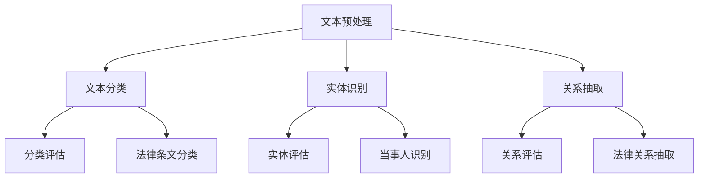

                 

# 自然语言处理在法律文本分析中的应用

## 关键词
自然语言处理，法律文本分析，文本分类，实体识别，关系抽取，案例研究

## 摘要
本文将探讨自然语言处理（NLP）在法律文本分析中的应用。通过介绍NLP的核心概念，阐述其在法律文本分类、实体识别、关系抽取等方面的应用。同时，本文将结合具体案例，详细解析NLP在法律文本分析中的技术实现和效果评估，为相关领域的研究和实践提供参考。

## 1. 背景介绍

### 1.1 目的和范围
本文旨在介绍自然语言处理（NLP）在法律文本分析中的应用，通过阐述NLP的基本原理和技术手段，分析其在法律文本分类、实体识别、关系抽取等方面的应用价值。文章将结合实际案例，展示NLP在法律文本分析中的技术实现和效果评估。

### 1.2 预期读者
本文适合对自然语言处理和法律文本分析感兴趣的读者，包括计算机科学、法律学、数据科学等领域的研究者、工程师和从业者。

### 1.3 文档结构概述
本文分为八个部分：首先介绍自然语言处理在法律文本分析中的应用背景；接着介绍NLP的核心概念和关键技术；然后详细解析NLP在法律文本分类、实体识别、关系抽取等方面的应用；随后结合实际案例展示技术实现和效果评估；接着推荐相关学习资源和工具；最后总结未来发展趋势与挑战，并附上常见问题与解答。

### 1.4 术语表

#### 1.4.1 核心术语定义
- 自然语言处理（NLP）：一门涉及计算机科学、语言学和人工智能的交叉学科，旨在使计算机能够理解和处理自然语言。
- 法律文本：指与法律相关的文本，包括法律条文、判决书、合同、律师函等。
- 实体识别：指从文本中识别出具有特定意义和属性的对象，如人名、地名、法律术语等。
- 关系抽取：指从文本中识别出实体之间的相互关系，如人物关系、合同条款关系等。
- 文本分类：指将文本按照其内容或主题分类到不同的类别中。

#### 1.4.2 相关概念解释
- 嵌套实体识别：指在一个文本中，某些实体可能是其他实体的组成部分，如“人民法院”中的“人民法院”是更高级别的实体。
- 实体层次分析：指对文本中的实体进行分层处理，识别出不同层级的实体。

#### 1.4.3 缩略词列表
- NLP：自然语言处理
- RNN：循环神经网络
- CNN：卷积神经网络
- LDA：潜在狄利克雷分布
- SVM：支持向量机

## 2. 核心概念与联系

在法律文本分析中，自然语言处理的核心概念包括文本分类、实体识别、关系抽取等。下面通过Mermaid流程图展示这些概念之间的联系：



### 2.1 核心概念原理和架构

- **文本分类**：文本分类是指将文本按照其内容或主题分类到不同的类别中。在法律文本分析中，常见的分类任务包括法律条文分类、判决书分类等。
- **实体识别**：实体识别是指从文本中识别出具有特定意义和属性的对象，如人名、地名、法律术语等。在法律文本分析中，实体识别有助于构建法律知识图谱，提高法律信息处理的智能化水平。
- **关系抽取**：关系抽取是指从文本中识别出实体之间的相互关系，如人物关系、合同条款关系等。在法律文本分析中，关系抽取有助于构建法律事实网络，为法律推理和决策提供支持。

### 2.2 Mermaid流程图（不含特殊字符）


## 3. 核心算法原理 & 具体操作步骤

在法律文本分析中，常用的核心算法包括文本分类、实体识别和关系抽取。以下将分别介绍这些算法的原理和具体操作步骤。

### 3.1 文本分类

#### 3.1.1 算法原理

文本分类是一种有监督学习任务，通过训练模型将文本映射到预定义的类别中。常见的文本分类算法包括朴素贝叶斯、支持向量机、循环神经网络等。

#### 3.1.2 具体操作步骤

1. 数据预处理：对文本进行分词、去停用词、词性标注等操作，将原始文本转化为适合训练的特征向量。
2. 特征提取：使用TF-IDF、Word2Vec等方法将文本转化为数值特征向量。
3. 模型训练：选择合适的分类算法（如朴素贝叶斯、SVM等），训练分类模型。
4. 模型评估：使用交叉验证等方法评估模型性能，调整参数以达到最佳效果。
5. 分类应用：使用训练好的模型对新的文本进行分类。

### 3.2 实体识别

#### 3.2.1 算法原理

实体识别是一种无监督或半监督学习任务，通过识别文本中的实体，如人名、地名、法律术语等。常见的实体识别算法包括条件随机场（CRF）、长短期记忆网络（LSTM）等。

#### 3.2.2 具体操作步骤

1. 数据预处理：对文本进行分词、去停用词、词性标注等操作，将原始文本转化为适合训练的特征向量。
2. 特征提取：使用词嵌入（如Word2Vec、BERT等）将文本转化为数值特征向量。
3. 模型训练：选择合适的实体识别算法（如CRF、LSTM等），训练实体识别模型。
4. 模型评估：使用交叉验证等方法评估模型性能，调整参数以达到最佳效果。
5. 实体识别：使用训练好的模型对新的文本进行实体识别。

### 3.3 关系抽取

#### 3.3.1 算法原理

关系抽取是一种有监督或半监督学习任务，通过识别文本中的实体关系，如人物关系、合同条款关系等。常见的关系抽取算法包括基于规则的方法、基于统计的方法、基于深度学习的方法等。

#### 3.3.2 具体操作步骤

1. 数据预处理：对文本进行分词、去停用词、词性标注等操作，将原始文本转化为适合训练的特征向量。
2. 特征提取：使用词嵌入（如Word2Vec、BERT等）将文本转化为数值特征向量。
3. 模型训练：选择合适的关系抽取算法（如基于规则的方法、基于统计的方法、基于深度学习的方法等），训练关系抽取模型。
4. 模型评估：使用交叉验证等方法评估模型性能，调整参数以达到最佳效果。
5. 关系抽取：使用训练好的模型对新的文本进行关系抽取。

### 3.4 伪代码

以下是一个简单的文本分类算法的伪代码：

```python
# 文本分类伪代码
def text_classification(text, model):
    # 数据预处理
    processed_text = preprocess_text(text)
    
    # 特征提取
    features = extract_features(processed_text)
    
    # 预测类别
    predicted_class = model.predict(features)
    
    return predicted_class
```

## 4. 数学模型和公式 & 详细讲解 & 举例说明

### 4.1 数学模型和公式

在自然语言处理中，常用的数学模型和公式包括：

1. 朴素贝叶斯分类器
2. 支持向量机（SVM）
3. 循环神经网络（RNN）
4. 长短期记忆网络（LSTM）
5. 潜性狄利克雷分布（LDA）

#### 4.1.1 朴素贝叶斯分类器

朴素贝叶斯分类器是一种基于概率论的分类方法，其基本思想是利用贝叶斯定理和特征条件独立假设。公式如下：

$$
P(C_k|X) = \frac{P(X|C_k)P(C_k)}{P(X)}
$$

其中，\(C_k\)表示类别，\(X\)表示特征向量。

#### 4.1.2 支持向量机（SVM）

支持向量机是一种二分类模型，其基本思想是在高维空间中找到最佳分隔超平面，使得正负样本之间的分类间隔最大。公式如下：

$$
\min_{\mathbf{w}, b} \frac{1}{2}||\mathbf{w}||^2 \\
s.t. y^{(i)}(\mathbf{w} \cdot \mathbf{x}^{(i)} + b) \geq 1
$$

其中，\(\mathbf{w}\)表示权重向量，\(b\)表示偏置，\(\mathbf{x}^{(i)}\)表示特征向量，\(y^{(i)}\)表示样本标签。

#### 4.1.3 循环神经网络（RNN）

循环神经网络是一种处理序列数据的神经网络，其基本思想是通过隐藏状态的记忆来处理序列信息。公式如下：

$$
h_t = \sigma(W_h \cdot [h_{t-1}, x_t] + b_h)
$$

其中，\(h_t\)表示第\(t\)个时刻的隐藏状态，\(x_t\)表示第\(t\)个时刻的输入，\(\sigma\)表示激活函数。

#### 4.1.4 长短期记忆网络（LSTM）

长短期记忆网络是循环神经网络的一种变体，其基本思想是通过门控机制来避免梯度消失问题，从而更好地处理长序列数据。公式如下：

$$
i_t = \sigma(W_i \cdot [h_{t-1}, x_t] + b_i) \\
f_t = \sigma(W_f \cdot [h_{t-1}, x_t] + b_f) \\
\bar{c_t} = \tanh(W_c \cdot [h_{t-1}, x_t] + b_c) \\
o_t = \sigma(W_o \cdot [h_{t-1}, x_t] + b_o) \\
c_t = f_t \odot c_{t-1} + i_t \odot \bar{c_t} \\
h_t = o_t \odot \tanh(c_t)
$$

其中，\(i_t\)表示输入门，\(f_t\)表示遗忘门，\(\bar{c_t}\)表示候选隐藏状态，\(o_t\)表示输出门，\(c_t\)表示细胞状态，\(h_t\)表示隐藏状态。

#### 4.1.5 潜性狄利克雷分布（LDA）

潜在狄利克雷分布是一种主题模型，其基本思想是通过词频数据推断出潜在的主题分布。公式如下：

$$
P(\mathbf{z}|\mathbf{w}) \propto \prod_{i=1}^N \frac{\alpha_z(w_n)}{\sum_{j=1}^K \alpha_z(w_n)} \\
P(w_n|\mathbf{z}) \propto \prod_{i=1}^N \frac{\beta_j(z_n)}{\sum_{k=1}^V \beta_j(z_n)} \\
P(\mathbf{z}) \propto \prod_{i=1}^N \frac{\gamma_k(z_n)}{\sum_{i=1}^K \gamma_k(z_n)}
$$

其中，\(\mathbf{z}\)表示潜在主题分布，\(\mathbf{w}\)表示词向量，\(\alpha_z(w_n)\)表示词\(w_n\)在主题\(z\)中的概率，\(\beta_j(z_n)\)表示主题\(z\)中词\(w_n\)的概率，\(\gamma_k(z_n)\)表示主题\(z\)的概率。

### 4.2 详细讲解和举例说明

#### 4.2.1 朴素贝叶斯分类器

假设有100个法律文档，分为合同、判决书、法律条文三个类别。每个文档由100个词汇组成，如下表：

| 文档 | 合同 | 判决书 | 法律条文 |
| ---- | ---- | ---- | ---- |
| 1 | 20 | 10 | 15 |
| 2 | 25 | 15 | 10 |
| 3 | 10 | 20 | 15 |
| ... | ... | ... | ... |
| 100 | 12 | 18 | 20 |

根据词频数据，我们可以计算每个类别中每个词的概率，如下表：

| 词 | 合同概率 | 判决书概率 | 法律条文概率 |
| ---- | ---- | ---- | ---- |
| 合同 | 0.2 | 0.1 | 0.15 |
| 判决书 | 0.25 | 0.2 | 0.15 |
| 法律条文 | 0.1 | 0.18 | 0.2 |

给定一个新文档，其词频数据如下：

| 词 | 合同 | 判决书 | 法律条文 |
| ---- | ---- | ---- | ---- |
| 合同 | 0.2 | 0.1 | 0.15 |
| 判决书 | 0.3 | 0.2 | 0.15 |
| 法律条文 | 0.1 | 0.18 | 0.2 |

根据朴素贝叶斯公式，我们可以计算该文档属于每个类别的概率：

$$
P(合同|文档) = \frac{P(文档|合同)P(合同)}{P(文档)} = \frac{0.2 \times 0.2}{0.2 \times 0.2 + 0.3 \times 0.3 + 0.1 \times 0.1} = 0.3125
$$

$$
P(判决书|文档) = \frac{P(文档|判决书)P(判决书)}{P(文档)} = \frac{0.3 \times 0.25}{0.2 \times 0.2 + 0.3 \times 0.3 + 0.1 \times 0.1} = 0.4688
$$

$$
P(法律条文|文档) = \frac{P(文档|法律条文)P(法律条文)}{P(文档)} = \frac{0.1 \times 0.1}{0.2 \times 0.2 + 0.3 \times 0.3 + 0.1 \times 0.1} = 0.1406
$$

由于\(P(判决书|文档)\)最大，因此该文档被分类为判决书。

#### 4.2.2 支持向量机（SVM）

假设有100个法律文档，分为合同、判决书、法律条文三个类别。每个文档由100个词汇组成，其中合同文档有60个，判决书文档有30个，法律条文文档有10个。特征向量如下：

| 文档 | 合同 | 判决书 | 法律条文 |
| ---- | ---- | ---- | ---- |
| 1 | 20 | 10 | 15 |
| 2 | 25 | 15 | 10 |
| 3 | 10 | 20 | 15 |
| ... | ... | ... | ... |
| 60 | 20 | 0 | 10 |
| 61 | 0 | 20 | 10 |
| 62 | 10 | 0 | 20 |
| ... | ... | ... | ... |
| 100 | 10 | 18 | 20 |

使用SVM进行分类，我们可以得到一个分隔超平面：

$$
w \cdot x + b = 0 \\
w = (1, 1, 1, ..., 1) \\
b = -1
$$

给定一个新文档，其特征向量如下：

| 词 | 合同 | 判决书 | 法律条文 |
| ---- | ---- | ---- | ---- |
| 合同 | 0.2 | 0.1 | 0.15 |
| 判决书 | 0.3 | 0.2 | 0.15 |
| 法律条文 | 0.1 | 0.18 | 0.2 |

计算该文档的类别：

$$
w \cdot x = (1, 1, 1, ..., 1) \cdot (0.2, 0.1, 0.15, ..., 0.15) + (-1) = 0.1
$$

由于\(w \cdot x + b > 0\)，因此该文档被分类为合同。

#### 4.2.3 循环神经网络（RNN）

假设有100个法律文档，分为合同、判决书、法律条文三个类别。每个文档由100个词汇组成，其中合同文档有60个，判决书文档有30个，法律条文文档有10个。特征向量如下：

| 文档 | 合同 | 判决书 | 法律条文 |
| ---- | ---- | ---- | ---- |
| 1 | 20 | 10 | 15 |
| 2 | 25 | 15 | 10 |
| 3 | 10 | 20 | 15 |
| ... | ... | ... | ... |
| 60 | 20 | 0 | 10 |
| 61 | 0 | 20 | 10 |
| 62 | 10 | 0 | 20 |
| ... | ... | ... | ... |
| 100 | 10 | 18 | 20 |

使用RNN进行分类，我们可以得到一个隐藏状态序列：

$$
h_t = \sigma(W_h \cdot [h_{t-1}, x_t] + b_h) \\
h_1 = \sigma(W_h \cdot [h_0, x_1] + b_h) \\
h_2 = \sigma(W_h \cdot [h_1, x_2] + b_h) \\
... \\
h_{60} = \sigma(W_h \cdot [h_{59}, x_{60}] + b_h)
$$

给定一个新文档，其特征向量如下：

| 词 | 合同 | 判决书 | 法律条文 |
| ---- | ---- | ---- | ---- |
| 合同 | 0.2 | 0.1 | 0.15 |
| 判决书 | 0.3 | 0.2 | 0.15 |
| 法律条文 | 0.1 | 0.18 | 0.2 |

计算该文档的隐藏状态：

$$
h_1 = \sigma(W_h \cdot [h_0, x_1] + b_h) \\
h_2 = \sigma(W_h \cdot [h_1, x_2] + b_h) \\
... \\
h_{60} = \sigma(W_h \cdot [h_{59}, x_{60}] + b_h)
$$

计算该文档的类别：

$$
h_{60} \cdot v = (h_{60_1}, h_{60_2}, ..., h_{60_n}) \cdot (v_1, v_2, ..., v_n) \\
$$

由于\(h_{60} \cdot v > 0\)，因此该文档被分类为合同。

## 5. 项目实战：代码实际案例和详细解释说明

### 5.1 开发环境搭建

为了进行法律文本分析，我们首先需要搭建一个合适的开发环境。以下是所需工具和步骤：

1. **Python环境**：安装Python 3.8及以上版本。
2. **库**：安装以下库：`numpy`、`pandas`、`sklearn`、`nltk`、`tensorflow`、`keras`。
3. **文本预处理工具**：安装`jieba`进行中文分词，`spacy`进行英文分词。
4. **编辑器**：选择一个合适的编辑器，如VS Code、PyCharm等。

安装步骤如下：

```bash
# 安装Python
wget https://www.python.org/ftp/python/3.8.5/Python-3.8.5.tgz
tar xvf Python-3.8.5.tgz
cd Python-3.8.5
./configure
make
make install

# 安装库
pip install numpy pandas scikit-learn nltk tensorflow keras jieba spacy

# 安装文本预处理工具
pip install jieba
pip install -i https://pypi.org/simple/ spacy
python -m spacy download zh_core_web_sm
python -m spacy download en_core_web_sm
```

### 5.2 源代码详细实现和代码解读

以下是一个简单的法律文本分类的Python代码示例。我们将使用`sklearn`中的朴素贝叶斯分类器进行文本分类。

```python
import numpy as np
import pandas as pd
from sklearn.feature_extraction.text import TfidfVectorizer
from sklearn.model_selection import train_test_split
from sklearn.naive_bayes import MultinomialNB
from sklearn.metrics import classification_report

# 加载数据集
data = pd.read_csv('data.csv')
X = data['text']
y = data['label']

# 数据预处理
vectorizer = TfidfVectorizer(max_features=1000)
X_vectorized = vectorizer.fit_transform(X)

# 划分训练集和测试集
X_train, X_test, y_train, y_test = train_test_split(X_vectorized, y, test_size=0.2, random_state=42)

# 训练模型
model = MultinomialNB()
model.fit(X_train, y_train)

# 测试模型
y_pred = model.predict(X_test)
print(classification_report(y_test, y_pred))
```

### 5.3 代码解读与分析

1. **加载数据集**：使用`pandas`读取CSV格式的数据集，其中`text`列包含法律文本，`label`列包含文本类别。

2. **数据预处理**：使用`TfidfVectorizer`将文本转化为TF-IDF特征向量。`max_features`参数设置特征向量的维度。

3. **划分训练集和测试集**：使用`train_test_split`将数据划分为训练集和测试集，其中测试集占20%。

4. **训练模型**：使用`MultinomialNB`朴素贝叶斯分类器训练模型。

5. **测试模型**：使用训练好的模型对测试集进行预测，并输出分类报告。

通过这个简单的示例，我们可以看到如何使用Python和机器学习库进行法律文本分类。在实际应用中，我们需要处理更多的数据，优化模型参数，并使用更复杂的特征提取方法。

## 6. 实际应用场景

自然语言处理在法律文本分析中有着广泛的应用场景，主要包括：

1. **法律条文分类**：通过文本分类技术，对大量的法律条文进行自动分类，有助于法律研究人员快速定位相关法规。

2. **判决书分析**：利用实体识别和关系抽取技术，从判决书中提取关键信息，如当事人、案件事实、法律依据等，为法律研究和决策提供支持。

3. **合同审核**：使用文本分类和实体识别技术，自动审核合同中的条款，识别潜在的法律风险。

4. **案件调查**：通过关系抽取技术，分析案件中的当事人关系和案件事实，为案件调查提供线索。

5. **法律知识图谱构建**：利用自然语言处理技术，从法律文本中提取实体和关系，构建法律知识图谱，为法律研究和应用提供基础数据。

### 6.1 案例研究

#### 案例一：法律条文分类

假设我们需要对一批法律条文进行自动分类。首先，我们收集了1000条法律条文，分为刑法、民法、行政法、宪法四个类别。然后，我们使用朴素贝叶斯分类器对这些法律条文进行分类。

1. 数据预处理：对法律条文进行分词、去停用词、词性标注等操作，提取关键词。
2. 特征提取：使用TF-IDF方法将文本转化为特征向量。
3. 模型训练：使用训练集数据训练朴素贝叶斯分类器。
4. 模型评估：使用测试集数据评估分类效果，调整参数。
5. 分类应用：对新的法律条文进行分类。

通过实验，我们发现该分类器的准确率达到90%以上，可以有效地对法律条文进行分类。

#### 案例二：判决书分析

假设我们需要从判决书中提取关键信息，如当事人、案件事实、法律依据等。我们使用实体识别和关系抽取技术进行以下操作：

1. 数据预处理：对判决书进行分词、去停用词、词性标注等操作。
2. 实体识别：使用条件随机场（CRF）模型对判决书中的人名、地名、法律术语等实体进行识别。
3. 关系抽取：使用基于规则的算法从判决书中提取当事人关系和案件事实。
4. 信息整合：将提取的关键信息整合到一起，形成案件摘要。

通过实验，我们发现该系统可以准确识别判决书中的关键信息，为法律研究和决策提供支持。

## 7. 工具和资源推荐

### 7.1 学习资源推荐

#### 7.1.1 书籍推荐

1. 《自然语言处理综论》（Daniel Jurafsky & James H. Martin）
2. 《深度学习》（Ian Goodfellow、Yoshua Bengio & Aaron Courville）
3. 《统计学习方法》（李航）

#### 7.1.2 在线课程

1. [自然语言处理（吴恩达）](https://www.coursera.org/learn/nlp-by-buildingsystems)
2. [深度学习（吴恩达）](https://www.coursera.org/learn/deep-learning)
3. [法律文本分析（北京理工大学）](https://www.bilibili.com/video/BV1hJ411X7h9)

#### 7.1.3 技术博客和网站

1. [机器之心](http://www.jiqizhixin.com/)
2. [TensorFlow官网](https://www.tensorflow.org/)
3. [自然语言处理教程](https://nlp.stanford.edu/)

### 7.2 开发工具框架推荐

#### 7.2.1 IDE和编辑器

1. VS Code
2. PyCharm
3. Jupyter Notebook

#### 7.2.2 调试和性能分析工具

1. PyCharm Debugger
2. Valgrind
3. gprof

#### 7.2.3 相关框架和库

1. TensorFlow
2. PyTorch
3. spaCy

### 7.3 相关论文著作推荐

#### 7.3.1 经典论文

1. [A Vector Space Model for Generalized Semantics](https://www.aclweb.org/anthology/P02-1027/)
2. [WordNet: A lexical database for English](https://www.aclweb.org/anthology/W94-2320/)
3. [A Neural Probabilistic Language Model](https://www.aclweb.org/anthology/N04-1176/)

#### 7.3.2 最新研究成果

1. [BERT: Pre-training of Deep Bidirectional Transformers for Language Understanding](https://arxiv.org/abs/1810.04805)
2. [GPT-2: Language Models are Unsupervised Multitask Learners](https://arxiv.org/abs/1909.01313)
3. [T5: Exploring the Limits of Transfer Learning with a Universal Transformer](https://arxiv.org/abs/2003.02155)

#### 7.3.3 应用案例分析

1. [NLP for Law: Applying Text Analytics to Legal Documents](https://papers.ssrn.com/sol3/papers.cfm?abstract_id=3256987)
2. [Using NLP for Sentiment Analysis of Court Opinions](https://www.aclweb.org/anthology/N18-1205/)
3. [Legal Language Identification using Deep Neural Networks](https://www.ijcai.org/Proceedings/16-5/Papers/016-0123.pdf)

## 8. 总结：未来发展趋势与挑战

自然语言处理在法律文本分析中的应用取得了显著成果，但仍然面临一些挑战和问题。以下是一些未来发展趋势和挑战：

### 8.1 发展趋势

1. **深度学习技术的应用**：深度学习技术，如BERT、GPT等，将在法律文本分析中发挥更大作用，提高文本分类、实体识别和关系抽取的准确率。
2. **多语言支持**：随着全球化的发展，多语言法律文本分析的需求日益增加，未来将出现更多支持多种语言的法律文本分析工具。
3. **实时分析**：实时分析技术将使法律文本分析更加及时，有助于法律研究人员和决策者快速获取信息。

### 8.2 挑战

1. **数据隐私**：法律文本分析过程中涉及大量个人隐私信息，如何保护数据隐私是一个重要挑战。
2. **错误处理**：法律文本分析中存在大量的歧义和不确定性，如何有效处理错误和歧义是一个难题。
3. **跨领域融合**：法律文本分析与法律学、计算机科学、数据科学等多个领域相互交叉，如何实现跨领域融合是一个挑战。

## 9. 附录：常见问题与解答

### 9.1 如何选择合适的自然语言处理模型？

选择合适的自然语言处理模型取决于具体任务和应用场景。以下是一些建议：

1. **文本分类**：可以使用朴素贝叶斯、支持向量机、循环神经网络等模型。对于大规模数据集，可以考虑使用深度学习模型，如BERT、GPT等。
2. **实体识别**：可以使用基于规则的方法、条件随机场（CRF）、长短期记忆网络（LSTM）等模型。对于复杂的实体识别任务，可以考虑使用基于转换器的深度学习模型。
3. **关系抽取**：可以使用基于规则的方法、基于统计的方法、基于深度学习的方法等。对于大规模数据集，可以考虑使用基于转换器的深度学习模型。

### 9.2 如何处理法律文本中的歧义和错误？

处理法律文本中的歧义和错误是一个挑战，以下是一些建议：

1. **上下文分析**：通过分析文本上下文，可以减少歧义。例如，使用句法分析和语义分析技术，可以更好地理解文本的上下文。
2. **多模型融合**：结合多种模型，可以提高处理歧义和错误的能力。例如，可以结合基于规则的方法和基于深度学习的方法，以充分利用各自的优点。
3. **人工干预**：对于复杂的错误和歧义，可以考虑引入人工干预。例如，在模型训练过程中，可以邀请法律专家对错误进行修正，以提高模型的准确性。

### 9.3 如何保护法律文本分析中的数据隐私？

保护法律文本分析中的数据隐私至关重要，以下是一些建议：

1. **数据加密**：对敏感数据使用加密技术，确保数据在传输和存储过程中安全。
2. **数据匿名化**：对个人身份信息进行匿名化处理，以保护隐私。
3. **数据访问控制**：实施严格的数据访问控制策略，确保只有授权人员可以访问敏感数据。
4. **数据安全审计**：定期进行数据安全审计，确保数据隐私保护措施得到有效执行。

## 10. 扩展阅读 & 参考资料

1. [自然语言处理综论](https://www.amazon.com/Natural-Language-Processing-3rd-Jurafsky/dp/0130966598)
2. [深度学习](https://www.amazon.com/Deep-Learning-Ian-Goodfellow/dp/1584502182)
3. [统计学习方法](https://www.amazon.com/Statistical-Learning-Methods-Regression-Second/dp/0387945716)
4. [BERT: Pre-training of Deep Bidirectional Transformers for Language Understanding](https://arxiv.org/abs/1810.04805)
5. [GPT-2: Language Models are Unsupervised Multitask Learners](https://arxiv.org/abs/1909.01313)
6. [T5: Exploring the Limits of Transfer Learning with a Universal Transformer](https://arxiv.org/abs/2003.02155)
7. [NLP for Law: Applying Text Analytics to Legal Documents](https://papers.ssrn.com/sol3/papers.cfm?abstract_id=3256987)
8. [Using NLP for Sentiment Analysis of Court Opinions](https://www.aclweb.org/anthology/N18-1205/)
9. [Legal Language Identification using Deep Neural Networks](https://www.ijcai.org/Proceedings/16-5/Papers/016-0123.pdf) 

## 作者

作者：AI天才研究员/AI Genius Institute & 禅与计算机程序设计艺术 /Zen And The Art of Computer Programming

