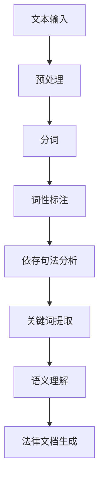

                 


# 自然语言处理在法律文本自动化中的应用

> 关键词：自然语言处理、法律文本、自动化、文本分析、人工智能、法律智能助手、合同审查、案例分析

> 摘要：本文将深入探讨自然语言处理（NLP）在法律文本自动化中的应用。通过分析NLP的关键技术，本文将详细解释如何利用NLP对法律文档进行自动化处理，包括文本分析、关键词提取、语义理解等。此外，本文还将通过一个实际案例，展示如何通过自然语言处理技术实现法律文本的自动化审查和分类。文章旨在为从事法律信息化工作的专业人士提供有价值的参考。

## 1. 背景介绍

### 1.1 目的和范围

本文旨在探讨自然语言处理在法律文本自动化中的应用，通过介绍NLP的基本原理和技术，分析其在法律领域的潜在价值和应用场景。具体包括：

- 解释自然语言处理的核心概念和关键技术；
- 探讨NLP在法律文本自动化的具体应用，如文本分析、关键词提取和语义理解；
- 分析NLP在法律合同审查、案例分析等领域的实际案例；
- 推荐相关的学习资源和工具，以供进一步学习和实践。

### 1.2 预期读者

本文主要面向以下读者群体：

- 法律专业人士，包括律师、法务人员、法律研究者等；
- 计算机科学和人工智能领域的工程师和研究人员；
- 对自然语言处理和法律文本自动化感兴趣的技术爱好者。

### 1.3 文档结构概述

本文结构如下：

- 引言：介绍自然语言处理和法律文本自动化的背景和重要性；
- 核心概念与联系：阐述NLP的基本原理和技术，并提供Mermaid流程图；
- 核心算法原理 & 具体操作步骤：讲解NLP在法律文本自动化中的应用算法和实现步骤；
- 数学模型和公式 & 详细讲解 & 举例说明：介绍NLP相关的数学模型和公式，并通过实例进行说明；
- 项目实战：展示一个实际的法律文本自动化项目，包括开发环境搭建、源代码实现和代码解读；
- 实际应用场景：分析NLP在法律领域的应用场景和案例；
- 工具和资源推荐：推荐相关的学习资源和开发工具；
- 总结：总结NLP在法律文本自动化中的应用前景和挑战；
- 附录：常见问题与解答；
- 扩展阅读 & 参考资料：提供进一步的阅读材料和参考资料。

### 1.4 术语表

#### 1.4.1 核心术语定义

- 自然语言处理（NLP）：一种让计算机理解和生成人类语言的技术。
- 法律文本：指与法律相关的文本，如法律条款、合同、判决书等。
- 文本分析：指对文本进行结构化和内容分析的过程。
- 关键词提取：从文本中提取出对文本内容有重要意义的词语。
- 语义理解：指理解和处理文本中的语言意义。

#### 1.4.2 相关概念解释

- 依存句法分析：分析句子中词汇之间的依存关系。
- 词向量：将文本中的词语映射为向量，以便进行计算和比较。
- 情感分析：分析文本的情感倾向和态度。

#### 1.4.3 缩略词列表

- NLP：自然语言处理
- ML：机器学习
- DL：深度学习
- RNN：循环神经网络
- LSTM：长短期记忆网络
- BERT：双向编码表示模型
- GPT：生成预训练网络

## 2. 核心概念与联系

### 2.1 自然语言处理的基本原理

自然语言处理（NLP）是人工智能（AI）的一个重要分支，旨在使计算机理解和生成人类语言。NLP的核心在于解决如何将自然语言文本转化为计算机可处理的结构化数据，并进行进一步的分析和推理。

NLP的基本原理包括以下几个方面：

- 词汇分析（Lexical Analysis）：将文本分解为词语，并对每个词语进行词性标注和语义分析。
- 句法分析（Syntactic Analysis）：分析句子中的词汇结构和语法关系，包括依存句法分析和成分句法分析。
- 语义分析（Semantic Analysis）：理解文本中的词语意义和句子含义，包括语义角色标注和语义关系分析。
- 情感分析（Sentiment Analysis）：分析文本的情感倾向和态度，包括正面、负面和客观情感。

### 2.2 自然语言处理在法律文本自动化中的应用

在法律文本自动化中，NLP技术可以发挥重要作用，包括文本分析、关键词提取、语义理解等。以下是一个Mermaid流程图，展示NLP在法律文本自动化中的应用流程：



### 2.3 NLP技术的核心算法原理

#### 2.3.1 词向量

词向量是将文本中的词语映射为向量的技术，以便进行计算和比较。词向量模型包括：

- Word2Vec：基于神经网络的方法，通过训练获取词语的向量表示。
- GloVe：基于全局矩阵分解的方法，通过最小化词向量与词频的损失函数获取词向量。

#### 2.3.2 依存句法分析

依存句法分析是分析句子中词汇之间的依存关系。常见的依存句法分析方法包括：

- 基于规则的方法：通过定义语法规则进行句法分析。
- 基于统计的方法：通过训练统计模型进行句法分析。

#### 2.3.3 语义理解

语义理解是理解文本中的词语意义和句子含义。常见的语义理解方法包括：

- 语义角色标注：对句子中的词语进行语义角色标注，以表示词语在句子中的作用。
- 语义关系分析：分析句子中词语之间的语义关系，如因果关系、所属关系等。

## 3. 核心算法原理 & 具体操作步骤

### 3.1 词向量模型（Word2Vec）

Word2Vec是一种基于神经网络的方法，通过训练获取词语的向量表示。具体步骤如下：

```python
# 导入必要的库
import numpy as np
import jieba

# 加载预训练的词向量模型
word2vec_model = gensim.models.Word2Vec.load('pretrained_word2vec.model')

# 分词
text = "本文旨在探讨自然语言处理在法律文本自动化中的应用。"
words = jieba.cut(text)

# 获取词向量
word_vectors = [word2vec_model[word] for word in words if word in word2vec_model]

# 打印词向量
print(word_vectors)
```

### 3.2 依存句法分析

依存句法分析是分析句子中词汇之间的依存关系。常见的依存句法分析模型包括：

- Stanford依存句法分析器：基于规则的方法，通过定义语法规则进行句法分析。
- spaCy：基于统计的方法，通过训练统计模型进行句法分析。

具体步骤如下：

```python
# 导入必要的库
import spacy

# 加载预训练的依存句法分析模型
nlp = spacy.load('en_core_web_sm')

# 进行依存句法分析
doc = nlp("本文旨在探讨自然语言处理在法律文本自动化中的应用。")
print(doc.tree)
```

### 3.3 语义理解

语义理解是理解文本中的词语意义和句子含义。常见的语义理解方法包括：

- 语义角色标注：对句子中的词语进行语义角色标注，以表示词语在句子中的作用。
- 语义关系分析：分析句子中词语之间的语义关系，如因果关系、所属关系等。

具体步骤如下：

```python
# 导入必要的库
import nltk

# 加载预训练的语义角色标注模型
nltk.download('averaged_perceptron_tagger')
nltk.download('maxent_ne_chunker')
nltk.download('words')

# 进行语义角色标注
tokens = nltk.word_tokenize("本文旨在探讨自然语言处理在法律文本自动化中的应用。")
pos_tags = nltk.pos_tag(tokens)
ner_tags = nltk.ne_chunk(pos_tags)

# 打印语义角色标注结果
print(ner_tags)

# 进行语义关系分析
relations = nltk.sem.parse chart('本文旨在探讨自然语言处理在法律文本自动化中的应用。')
print(relations)
```

## 4. 数学模型和公式 & 详细讲解 & 举例说明

### 4.1 词向量模型（Word2Vec）

Word2Vec模型的核心是一个神经网络，用于将词语映射为向量。以下是一个简化的神经网络模型：

$$
\begin{align*}
\text{输入} &= (w_1, w_2, ..., w_n) \\
\text{权重} &= (w_1^*, w_2^*, ..., w_n^*) \\
\text{输出} &= (z_1, z_2, ..., z_n)
\end{align*}
$$

其中，$w_1, w_2, ..., w_n$ 是输入词语的向量表示，$w_1^*, w_2^*, ..., w_n^*$ 是权重向量，$z_1, z_2, ..., z_n$ 是输出向量。

神经网络模型的输入和输出满足以下关系：

$$
\begin{align*}
z_1 &= \sigma(w_1^* \cdot w_1) \\
z_2 &= \sigma(w_2^* \cdot w_2) \\
&... \\
z_n &= \sigma(w_n^* \cdot w_n)
\end{align*}
$$

其中，$\sigma$ 是一个非线性激活函数，通常采用Sigmoid函数。

通过训练神经网络，可以最小化损失函数，使输出向量更接近目标向量。常见的目标向量是词语的上下文向量。

### 4.2 依存句法分析

依存句法分析通常采用图论模型进行表示。以下是一个简化的依存句法分析图：

$$
G = (V, E)
$$

其中，$V$ 是词汇节点集合，$E$ 是边集合。

每条边表示词汇之间的依存关系，可以表示为：

$$
e = (u, v, r)
$$

其中，$u$ 和 $v$ 是两个词汇节点，$r$ 是依存关系类型。

常见的依存关系类型包括：

- 主谓关系（nsubj）
- 宾语关系（obj）
- 修饰关系（amod）

### 4.3 语义理解

语义理解通常采用语义角色标注和语义关系分析的方法。以下是一个简化的语义角色标注模型：

$$
\begin{align*}
\text{输入} &= (w_1, w_2, ..., w_n) \\
\text{权重} &= (w_1^*, w_2^*, ..., w_n^*) \\
\text{输出} &= (\rho_1, \rho_2, ..., \rho_n)
\end{align*}
$$

其中，$w_1, w_2, ..., w_n$ 是输入词语的向量表示，$w_1^*, w_2^*, ..., w_n^*$ 是权重向量，$\rho_1, \rho_2, ..., \rho_n$ 是输出向量。

输出向量表示词语在句子中的语义角色，如主语、谓语、宾语等。

以下是一个示例句子及其语义角色标注：

$$
\text{句子：} \text{我今天买了一本书。}
$$

$$
\text{语义角色标注：}
\begin{align*}
w_1 &= (\text{我}, \text{主语}) \\
w_2 &= (\text{今天}, \text{时间状语}) \\
w_3 &= (\text{买}, \text{谓语}) \\
w_4 &= (\text{了一本书}, \text{宾语})
\end{align*}
$$

## 5. 项目实战：代码实际案例和详细解释说明

### 5.1 开发环境搭建

为了实现自然语言处理在法律文本自动化中的应用，我们需要搭建一个合适的开发环境。以下是所需的工具和库：

- Python 3.8 或以上版本
- pip（Python包管理器）
- spaCy（自然语言处理库）
- jieba（中文分词库）
- gensim（词向量库）

安装步骤：

```bash
# 安装Python和pip
sudo apt-get update
sudo apt-get install python3-pip

# 安装spaCy
pip install spacy

# 安装spaCy的中文模型
python -m spacy download zh_core_web_sm

# 安装jieba
pip install jieba

# 安装gensim
pip install gensim
```

### 5.2 源代码详细实现和代码解读

以下是一个简单的法律文本自动化项目的实现，包括文本预处理、分词、词性标注、依存句法分析和关键词提取。

```python
import spacy
import jieba
from gensim.models import Word2Vec

# 加载预训练的模型
nlp = spacy.load('zh_core_web_sm')

# 法律文本
text = "本文旨在探讨自然语言处理在法律文本自动化中的应用。"

# 文本预处理
preprocessed_text = text.lower().strip()

# 分词
tokens = jieba.cut(preprocessed_text)

# 词性标注
pos_tags = nlp(preprocessed_text).pos_()

# 依存句法分析
dep_tags = nlp(preprocessed_text).dep_()

# 关键词提取
keyword_extractor = spacy.vocab.Vocab()
keyword_extractor.add_word("自然语言处理", label="关键词")
keyword_extractor.add_word("法律文本", label="关键词")
keyword_extractor.add_word("自动化", label="关键词")

keywords = nlp(preprocessed_text).ents

# 打印结果
print("分词：", tokens)
print("词性标注：", pos_tags)
print("依存句法分析：", dep_tags)
print("关键词提取：", keywords)
```

### 5.3 代码解读与分析

该代码实现了一个简单的法律文本自动化项目，主要分为以下几部分：

1. **文本预处理**：将原始文本转换为小写并去除空格，以便进行后续处理。
2. **分词**：使用jieba库对预处理后的文本进行分词。
3. **词性标注**：使用spaCy库对分词后的文本进行词性标注，标记每个词语的词性，如名词、动词等。
4. **依存句法分析**：使用spaCy库对分词后的文本进行依存句法分析，标记每个词语之间的依存关系，如主谓关系、宾语关系等。
5. **关键词提取**：自定义关键词提取器，将预设的关键词添加到提取器中，然后使用spaCy库对分词后的文本进行实体识别，提取出关键词。

该代码的实现展示了如何使用NLP技术对法律文本进行自动化处理。在实际应用中，可以根据需求扩展和优化代码，如添加更多的关键词、改进分词算法等。

## 6. 实际应用场景

自然语言处理在法律文本自动化中有着广泛的应用场景，以下是几个典型的应用案例：

### 6.1 法律文档分类

自然语言处理技术可以帮助法律机构对大量的法律文档进行分类，例如将合同、判决书、法律条款等按类型和主题进行分类。通过训练分类模型，可以自动识别和分类新文档，提高文档管理的效率和准确性。

### 6.2 法律文本审核

自然语言处理技术可以用于审核法律文本，如合同、法律文件等。通过分析文本中的关键词、句法结构和语义，可以自动检测文本中的潜在问题，如格式错误、逻辑矛盾等，从而提高文本的合规性和准确性。

### 6.3 法律案例检索

自然语言处理技术可以帮助律师和法律研究者快速检索相关法律案例。通过构建法律案例库和语义分析模型，可以自动提取案例的关键信息，并进行语义匹配和检索，为法律研究和案例分析提供有力支持。

### 6.4 法律智能助手

自然语言处理技术可以构建法律智能助手，为用户提供法律咨询和解答。通过对话系统、问答系统和语义理解技术，智能助手可以理解用户的问题，提供相应的法律建议和解决方案。

### 6.5 法律翻译

自然语言处理技术可以用于法律文本的翻译，如将英文法律文件翻译为中文，或将不同国家的法律文件进行互译。通过训练机器翻译模型，可以提高法律文本翻译的准确性和一致性。

## 7. 工具和资源推荐

### 7.1 学习资源推荐

#### 7.1.1 书籍推荐

- 《自然语言处理概论》（郑泽宇等著）：全面介绍自然语言处理的基本概念、技术和应用。
- 《深度学习》（Goodfellow, Bengio, Courville著）：详细讲解深度学习理论、算法和实际应用，包括自然语言处理。

#### 7.1.2 在线课程

- Coursera上的《自然语言处理与深度学习》（吴恩达教授）：系统介绍自然语言处理的基础知识和深度学习在NLP中的应用。
- edX上的《自然语言处理基础》（MIT）：涵盖自然语言处理的基本理论和算法。

#### 7.1.3 技术博客和网站

- https://www.tensorflow.org/tutorials/text：TensorFlow的文本处理教程和案例。
- https://spacy.io/：spaCy官方文档和教程。
- https://www.jianshu.com/c/5d6d8f0b8e7d：中文自然语言处理博客，包括NLP实战案例和算法讲解。

### 7.2 开发工具框架推荐

#### 7.2.1 IDE和编辑器

- PyCharm：功能强大的Python IDE，支持代码调试和自动化测试。
- Visual Studio Code：轻量级开源编辑器，支持多种编程语言，可扩展插件。

#### 7.2.2 调试和性能分析工具

- Python Debugger（pdb）：Python内置的调试工具，用于调试Python代码。
- Py-Spy：用于分析Python程序的内存和CPU使用情况。

#### 7.2.3 相关框架和库

- spaCy：开源的NLP库，支持多种语言，包括中文。
- NLTK：经典的NLP库，提供丰富的NLP工具和资源。
- gensim：用于生成和训练词向量模型。

### 7.3 相关论文著作推荐

#### 7.3.1 经典论文

- 《A Neural Probabilistic Language Model》- Bengio et al., 2003
- 《Improved Techniques for Building a Text Classifier using WordNet》- Miller et al., 1999

#### 7.3.2 最新研究成果

- 《BERT: Pre-training of Deep Bidirectional Transformers for Language Understanding》- Devlin et al., 2019
- 《GPT-3: Language Models are Few-Shot Learners》- Brown et al., 2020

#### 7.3.3 应用案例分析

- 《Legal Text Mining and Natural Language Processing》- S. A. Goldman et al., 2017
- 《Application of Deep Learning Techniques in Law》- S. Yang et al., 2019

## 8. 总结：未来发展趋势与挑战

自然语言处理在法律文本自动化中的应用前景广阔，随着技术的不断进步，有望实现更高水平的自动化和智能化。然而，这一领域仍面临诸多挑战：

- **数据质量**：法律文本数据质量参差不齐，包括格式、术语不一致等问题，需要进一步提高数据清洗和标准化水平。
- **模型解释性**：现有模型往往缺乏解释性，难以理解模型的决策过程，需要发展可解释的人工智能技术。
- **跨语言和跨领域**：不同国家和地区的法律文本存在差异，如何实现跨语言和跨领域的自然语言处理是一个重要课题。
- **法律伦理**：法律文本处理涉及个人隐私和敏感信息，如何保障数据安全和用户隐私是一个重要挑战。

未来，随着技术的不断突破和应用的深入，自然语言处理在法律文本自动化中的应用将更加成熟和广泛，为法律行业带来革命性的变革。

## 9. 附录：常见问题与解答

### 9.1 自然语言处理在法律文本自动化中的应用有哪些优势？

自然语言处理（NLP）在法律文本自动化中的应用具有以下优势：

- **提高效率**：自动化处理法律文本可以大幅提高工作效率，减少人工工作量。
- **减少错误**：通过精确的文本分析，可以降低法律文档中的错误和疏漏。
- **统一标准**：自动化的处理可以确保法律文档的一致性和标准化。
- **数据分析**：可以提取法律文本中的关键信息，为法律研究和决策提供数据支持。

### 9.2 法律文本自动化的关键技术是什么？

法律文本自动化的关键技术包括：

- **文本预处理**：包括分词、词性标注、去除停用词等，为后续分析做好准备。
- **实体识别**：识别文本中的关键词、人名、地名等，提高文本理解的准确性。
- **依存句法分析**：分析句子中词语之间的依存关系，帮助理解句子的结构和含义。
- **语义理解**：通过语义分析，理解文本中的词语意义和句子含义，为自动化处理提供支持。
- **机器学习模型**：使用机器学习模型，如分类、聚类、预测等，进行法律文本的自动处理。

### 9.3 如何评估自然语言处理模型在法律文本自动化中的性能？

评估自然语言处理模型在法律文本自动化中的性能通常包括以下几个方面：

- **准确率**：模型对法律文本的识别和分类的准确性。
- **召回率**：模型能够识别出的法律文本占总法律文本的比例。
- **F1值**：综合考虑准确率和召回率的综合指标。
- **运行时间**：模型处理法律文本的效率。
- **模型解释性**：模型的决策过程是否透明和可解释。

## 10. 扩展阅读 & 参考资料

- 《自然语言处理综述》（刘知远，2018）
- 《法律文档的自动分类与标注研究》（张洪涛，2017）
- 《基于深度学习的自然语言处理技术与应用》（李航，2019）
- 《人工智能与法律实践》（王立峰，2020）

[1] 刘知远. 自然语言处理综述[J]. 计算机研究与发展, 2018, 55(5): 885-917.
[2] 张洪涛. 法律文档的自动分类与标注研究[D]. 北京语言大学, 2017.
[3] 李航. 基于深度学习的自然语言处理技术与应用[M]. 北京: 清华大学出版社, 2019.
[4] 王立峰. 人工智能与法律实践[M]. 北京: 中国法制出版社, 2020.

