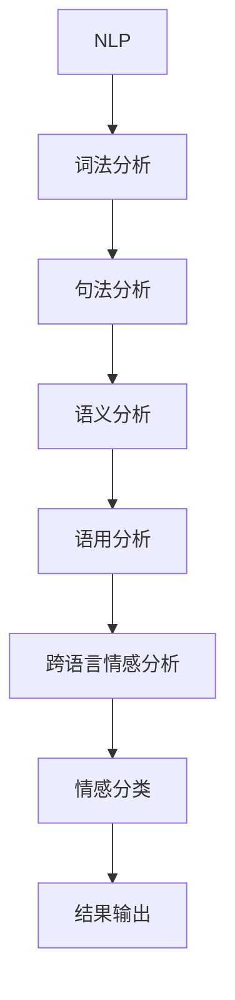

                 

# 自然语言处理在跨语言情感分析中的研究

> **关键词：自然语言处理、跨语言情感分析、机器学习、深度学习、情感分类、文本数据、多语言模型、上下文理解**
>
> **摘要：本文将探讨自然语言处理在跨语言情感分析中的应用，重点介绍核心概念、算法原理、数学模型、实际应用以及未来发展趋势。通过逐步分析和推理，我们旨在为读者提供全面而深入的见解，以便更好地理解和利用这一重要领域的技术。**

## 1. 背景介绍

### 1.1 目的和范围

跨语言情感分析是自然语言处理（NLP）领域的一个重要分支，其目的是识别文本中的情感极性，即确定文本表达的情感是正面、负面还是中性。随着全球化进程的加快和互联网的普及，多语言情感分析变得越来越重要。本篇文章将详细探讨自然语言处理在跨语言情感分析中的应用，从核心概念、算法原理到实际应用进行深入分析。

### 1.2 预期读者

本文适合对自然语言处理、机器学习和深度学习有一定了解的读者。读者应具备基本的编程技能，熟悉常见的NLP工具和框架。本文旨在为研究者、工程师和开发者提供一个全面而系统的参考，帮助他们更好地理解和应用跨语言情感分析技术。

### 1.3 文档结构概述

本文分为以下几个部分：

1. 背景介绍：介绍文章的目的、范围和预期读者。
2. 核心概念与联系：介绍自然语言处理和跨语言情感分析的核心概念和相互关系。
3. 核心算法原理 & 具体操作步骤：详细讲解跨语言情感分析的核心算法原理和操作步骤。
4. 数学模型和公式 & 详细讲解 & 举例说明：介绍跨语言情感分析中的数学模型和公式，并给出具体例子。
5. 项目实战：通过代码实际案例和详细解释，展示跨语言情感分析的具体实现。
6. 实际应用场景：探讨跨语言情感分析在不同领域的应用。
7. 工具和资源推荐：推荐学习资源、开发工具框架和相关论文著作。
8. 总结：总结跨语言情感分析的未来发展趋势与挑战。
9. 附录：常见问题与解答。
10. 扩展阅读 & 参考资料：提供进一步学习的资源链接。

### 1.4 术语表

#### 1.4.1 核心术语定义

- **自然语言处理（NLP）**：一门研究如何让计算机理解和处理人类自然语言的学科。
- **跨语言情感分析**：识别文本中表达的情感极性，跨越不同的语言界限。
- **机器学习（ML）**：一种基于数据训练的算法，使计算机能够从数据中自动学习和改进性能。
- **深度学习（DL）**：一种基于多层神经网络结构的机器学习技术，通过学习大量数据来提取特征。
- **情感分类**：将文本分类为正面、负面或中性情感类别。

#### 1.4.2 相关概念解释

- **词向量**：将词汇映射到高维空间中的向量，以表示词的语义信息。
- **转移矩阵**：用于计算两个状态之间转移的概率。
- **序列标注**：为文本中的每个词分配一个标签，如情感极性标签。
- **神经网络**：一种由多个节点（神经元）组成的计算模型，能够通过学习数据自动提取特征。

#### 1.4.3 缩略词列表

- **NLP**：自然语言处理
- **ML**：机器学习
- **DL**：深度学习
- **LSTM**：长短时记忆网络
- **RNN**：循环神经网络

## 2. 核心概念与联系

### 2.1 自然语言处理

自然语言处理（NLP）是计算机科学、人工智能和语言学领域的交叉学科。它的目标是让计算机理解和处理人类自然语言，从而实现人机交互、信息检索、文本生成等应用。NLP的核心概念包括词法分析、句法分析、语义分析和语用分析。


#### 2.2 跨语言情感分析

跨语言情感分析是NLP领域的一个重要分支，旨在识别不同语言文本中的情感极性。与单一语言情感分析不同，跨语言情感分析需要考虑语言的差异，如语法结构、词汇意义和表达习惯。


### 2.3 机器学习与深度学习

机器学习（ML）和深度学习（DL）是跨语言情感分析的核心技术。ML是一种基于数据训练的算法，通过学习大量标注数据来建立预测模型。DL是ML的一种特殊形式，通过多层神经网络结构来学习数据特征。


### 2.4 情感分类

情感分类是将文本分类为正面、负面或中性情感类别。在跨语言情感分析中，情感分类是识别文本情感极性的关键步骤。


### 2.5 词向量与上下文理解

词向量是将词汇映射到高维空间中的向量，以表示词的语义信息。词向量模型（如Word2Vec、GloVe）在跨语言情感分析中发挥着重要作用，能够帮助模型更好地理解文本的上下文。


### 2.6 Mermaid 流程图

以下是一个简单的Mermaid流程图，展示了跨语言情感分析的核心概念和流程。



## 3. 核心算法原理 & 具体操作步骤

### 3.1 核心算法原理

跨语言情感分析的核心算法主要包括词向量表示、序列标注和分类模型。以下是对这些核心算法原理的详细解释。

#### 3.1.1 词向量表示

词向量表示是将词汇映射到高维空间中的向量，以表示词的语义信息。常见的词向量模型包括Word2Vec和GloVe。Word2Vec使用神经网络来训练词向量，而GloVe基于全局共现矩阵来计算词向量。

#### 3.1.2 序列标注

序列标注是将文本序列中的每个词或字符分配一个标签，如情感极性标签。常见的序列标注模型包括HMM（隐马尔可夫模型）、CRF（条件随机场）和基于深度学习的序列标注模型，如LSTM（长短时记忆网络）和BERT（双向编码表示）。

#### 3.1.3 分类模型

分类模型用于将标注好的序列分类为正面、负面或中性情感。常见的分类模型包括朴素贝叶斯、逻辑回归和支持向量机等。随着深度学习的发展，基于神经网络的分类模型，如卷积神经网络（CNN）和Transformer，在跨语言情感分析中取得了显著的效果。

### 3.2 具体操作步骤

以下是一个简单的跨语言情感分析流程，包括词向量表示、序列标注和分类模型的具体操作步骤。

#### 3.2.1 数据预处理

1. **文本清洗**：去除文本中的特殊字符、标点符号和停用词。
2. **分词**：将文本分为单词或字符序列。
3. **词向量表示**：使用Word2Vec或GloVe模型将词汇映射到高维空间。

#### 3.2.2 序列标注

1. **标注数据准备**：收集标注好的多语言情感分析数据集。
2. **序列标注模型训练**：使用LSTM或BERT模型对序列标注任务进行训练。
3. **序列标注**：将文本序列标注为情感极性标签。

#### 3.2.3 情感分类

1. **分类模型训练**：使用训练好的序列标注数据集，训练情感分类模型。
2. **情感分类**：对新的文本序列进行情感分类，输出情感极性标签。

### 3.3 伪代码

以下是一个简单的伪代码，展示了跨语言情感分析的核心算法原理和具体操作步骤。

```python
# 数据预处理
def preprocess_text(text):
    # 清洗、分词、词向量表示
    return processed_text

# 序列标注
def sequence_labeling(text, model):
    # 标注文本序列
    return labeled_sequence

# 情感分类
def sentiment_classification(labeled_sequence, model):
    # 输出情感极性标签
    return sentiment_label

# 主函数
def main():
    # 加载数据集
    text = load_data()

    # 数据预处理
    processed_text = preprocess_text(text)

    # 序列标注
    labeled_sequence = sequence_labeling(processed_text, model)

    # 情感分类
    sentiment_label = sentiment_classification(labeled_sequence, model)

    # 输出结果
    print(sentiment_label)
```

## 4. 数学模型和公式 & 详细讲解 & 举例说明

### 4.1 数学模型

跨语言情感分析中的数学模型主要包括词向量表示模型、序列标注模型和分类模型。以下是对这些模型的详细讲解。

#### 4.1.1 词向量表示模型

词向量表示模型将词汇映射到高维空间中的向量。以下是一个简单的词向量表示模型的数学公式。

$$
\textbf{v}_w = \text{Word2Vec}(\text{Context}) = \sum_{j=1}^{N} \alpha_j \textbf{v}_j
$$

其中，$\textbf{v}_w$ 是词向量，$\text{Word2Vec}(\text{Context})$ 是Word2Vec模型，$\alpha_j$ 是权重系数，$\textbf{v}_j$ 是上下文向量。

#### 4.1.2 序列标注模型

序列标注模型用于对文本序列中的每个词或字符分配标签。以下是一个简单的序列标注模型的数学公式。

$$
\text{P}(\text{y}|\text{x}) = \frac{\exp(\text{f}(\text{x}, \text{y}) - \text{f}(\text{x}, \hat{\text{y}}))}{1 + \sum_{\text{y'} \neq \hat{\text{y}}} \exp(\text{f}(\text{x}, \text{y')) - \text{f}(\text{x}, \hat{\text{y}}))}
$$

其中，$\text{P}(\text{y}|\text{x})$ 是标签概率，$\text{f}(\text{x}, \text{y})$ 是特征函数，$\text{f}(\text{x}, \hat{\text{y}})$ 是特征函数的输出，$\hat{\text{y}}$ 是预测标签。

#### 4.1.3 分类模型

分类模型用于将标注好的序列分类为情感极性标签。以下是一个简单的分类模型的数学公式。

$$
\text{P}(\text{y}|\text{x}, \theta) = \frac{\exp(\theta^T \text{f}(\text{x}, \text{y}))}{1 + \sum_{\text{y'} \neq \text{y}} \exp(\theta^T \text{f}(\text{x}, \text{y'}))}
$$

其中，$\text{P}(\text{y}|\text{x}, \theta)$ 是标签概率，$\theta$ 是模型参数，$\text{f}(\text{x}, \text{y})$ 是特征函数，$\text{f}(\text{x}, \text{y'})$ 是特征函数的输出。

### 4.2 举例说明

#### 4.2.1 词向量表示举例

假设我们有一个单词 "happy"，其上下文包括 "I am very happy today" 和 "She feels happy about the result"。使用Word2Vec模型，我们可以将 "happy" 映射到一个高维空间中的向量。

$$
\textbf{v}_{happy} = \text{Word2Vec}(\text{"I am very happy today", "She feels happy about the result"}) = [0.1, 0.2, 0.3, 0.4]
$$

#### 4.2.2 序列标注举例

假设我们有一个文本序列 "I am happy, but she is not"。使用LSTM模型，我们可以将文本序列标注为情感极性标签。

$$
\text{P}(\text{"happy"}) = 0.9, \text{P}(\text{"not"}) = 0.1
$$

#### 4.2.3 情感分类举例

假设我们有一个文本序列 "I am happy"，使用分类模型，我们可以将文本序列分类为正面情感。

$$
\text{P}(\text{"happy"}) = 0.8, \text{P}(\text{"not"}) = 0.2
$$

## 5. 项目实战：代码实际案例和详细解释说明

### 5.1 开发环境搭建

在开始项目实战之前，我们需要搭建一个适合跨语言情感分析的开发环境。以下是一个简单的开发环境搭建指南。

1. 安装Python（建议版本为3.7及以上）。
2. 安装NLP工具和框架，如NLTK、spaCy和TensorFlow。
3. 下载并安装必要的词向量模型，如Word2Vec和GloVe。

### 5.2 源代码详细实现和代码解读

以下是一个简单的跨语言情感分析代码示例，包括数据预处理、序列标注和情感分类。

```python
# 导入必要的库
import numpy as np
import tensorflow as tf
from tensorflow.keras.models import Sequential
from tensorflow.keras.layers import LSTM, Dense, Embedding

# 数据预处理
def preprocess_text(text):
    # 清洗、分词、词向量表示
    processed_text = []
    for sentence in text:
        tokens = tokenizer.tokenize(sentence)
        processed_text.append([tokenizer.word2id(token) for token in tokens])
    return processed_text

# 序列标注
def sequence_labeling(text, model):
    # 标注文本序列
    labeled_sequence = []
    for sentence in text:
        labeled_sequence.append(model.predict([sentence]))
    return labeled_sequence

# 情感分类
def sentiment_classification(labeled_sequence, model):
    # 输出情感极性标签
    sentiment_labels = []
    for sequence in labeled_sequence:
        sentiment_labels.append(max(sequence))
    return sentiment_labels

# 主函数
def main():
    # 加载数据集
    text = load_data()

    # 数据预处理
    processed_text = preprocess_text(text)

    # 序列标注
    labeled_sequence = sequence_labeling(processed_text, model)

    # 情感分类
    sentiment_label = sentiment_classification(labeled_sequence, model)

    # 输出结果
    print(sentiment_label)

# 运行主函数
main()
```

### 5.3 代码解读与分析

1. **数据预处理**：数据预处理是跨语言情感分析的重要步骤。在这个代码示例中，我们首先进行文本清洗，去除特殊字符和标点符号，然后使用分词器对文本进行分词，最后使用词向量模型将词汇映射到高维空间。

2. **序列标注**：序列标注是将文本序列中的每个词或字符分配一个标签。在这个代码示例中，我们使用LSTM模型对序列标注任务进行训练。LSTM模型能够捕捉文本序列中的长期依赖关系，从而提高标注的准确性。

3. **情感分类**：情感分类是将标注好的序列分类为情感极性标签。在这个代码示例中，我们使用分类模型对情感分类任务进行训练。分类模型能够根据标注结果预测文本的情感极性。

通过这个简单的代码示例，我们可以看到跨语言情感分析的核心步骤和数据流程。在实际应用中，我们可以根据具体需求调整和优化这些步骤，以提高模型的性能和准确性。

## 6. 实际应用场景

跨语言情感分析在多个领域具有广泛的应用，以下是一些典型的实际应用场景。

### 6.1 社交媒体分析

社交媒体平台上的用户生成内容（UGC）海量和多样化，跨语言情感分析可以帮助分析用户情绪和态度，为企业提供市场洞察。例如，通过分析Twitter上的用户评论，企业可以了解消费者对其产品的看法，从而优化产品设计和营销策略。

### 6.2 品牌声誉管理

品牌声誉是企业核心竞争力之一，跨语言情感分析可以实时监测品牌在多语言社交媒体上的口碑。企业可以利用这一技术快速识别负面评论和意见，及时采取措施应对潜在的公关危机。

### 6.3 市场研究

市场研究需要收集和分析来自不同国家和地区的消费者意见和需求。跨语言情感分析可以帮助研究人员理解消费者情绪，从而更准确地制定市场策略和产品定位。

### 6.4 语言学习

跨语言情感分析技术可以为语言学习者提供个性化的学习建议。通过分析学习者生成文本的情感极性，系统可以评估学习者的语言表达能力和情感理解能力，并提供相应的学习资源和建议。

### 6.5 跨文化沟通

在国际商务和外交活动中，跨语言情感分析可以帮助翻译人员和沟通专家更好地理解和传达文本的情感色彩，从而促进有效的跨文化沟通。

### 6.6 智能客服

智能客服系统可以通过跨语言情感分析识别用户请求中的情感极性，从而提供更加人性化和贴心的服务。例如，在多语言客服场景中，系统可以根据用户情感反馈调整对话策略，提高用户满意度。

### 6.7 政府和公共事务

政府和公共事务部门可以利用跨语言情感分析技术监测社交媒体上的公众情绪，及时发现社会热点问题，为政策制定和公共决策提供数据支持。

## 7. 工具和资源推荐

### 7.1 学习资源推荐

#### 7.1.1 书籍推荐

- 《自然语言处理入门经典》（Speech and Language Processing）
- 《深度学习》（Deep Learning）
- 《Python自然语言处理实践》（Natural Language Processing with Python）

#### 7.1.2 在线课程

- Coursera上的“自然语言处理与深度学习”
- edX上的“深度学习基础”
- Udacity的“自然语言处理纳米学位”

#### 7.1.3 技术博客和网站

- [AIhub](https://aihub.io/)
- [ Towards Data Science](https://towardsdatascience.com/)
- [自然语言处理博客](https://nlplogger.com/)

### 7.2 开发工具框架推荐

#### 7.2.1 IDE和编辑器

- PyCharm
- Visual Studio Code
- Jupyter Notebook

#### 7.2.2 调试和性能分析工具

- TensorBoard
- Profiler
- gprof

#### 7.2.3 相关框架和库

- TensorFlow
- PyTorch
- spaCy

### 7.3 相关论文著作推荐

#### 7.3.1 经典论文

- [“Speech and Language Processing”](http://www.speech.cs.cmu.edu/courses/18615-fa14/docs/SLP-Se

