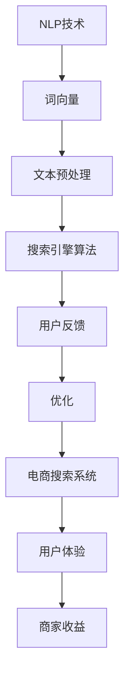

                 

# 自然语言处理如何优化电商搜索

> 关键词：自然语言处理、电商搜索、优化、算法、数学模型、实战案例

> 摘要：本文将深入探讨自然语言处理在电商搜索中的优化应用。我们将从背景介绍、核心概念、算法原理、数学模型、项目实战、实际应用场景、工具和资源推荐等多个方面进行分析，旨在为电商搜索系统的开发者和研究者提供有价值的参考。

## 1. 背景介绍

### 1.1 目的和范围

随着互联网的快速发展，电子商务已经成为现代商业的重要组成部分。电商搜索作为用户发现和购买商品的重要途径，其性能和用户体验直接影响着电商平台的竞争力和用户满意度。自然语言处理（NLP）作为人工智能的核心技术之一，近年来在电商搜索优化中发挥了重要作用。本文旨在探讨如何利用NLP技术来提升电商搜索的准确性和用户体验。

### 1.2 预期读者

本文适合对自然语言处理和电商搜索有一定了解的技术人员和研究者。如果您是电商搜索系统的开发者或优化师，本文将为您提供实用的算法和工具；如果您是自然语言处理领域的研究者，本文将帮助您了解NLP技术在电商搜索中的应用场景和挑战。

### 1.3 文档结构概述

本文分为十个部分，首先介绍背景和目的，然后分别探讨核心概念、算法原理、数学模型、项目实战、实际应用场景、工具和资源推荐等内容。最后，对未来的发展趋势和挑战进行总结，并给出常见问题与解答。

### 1.4 术语表

#### 1.4.1 核心术语定义

- 自然语言处理（NLP）：一门涉及计算机科学、人工智能和语言学的交叉学科，旨在让计算机理解和处理人类语言。
- 电商搜索：指用户在电商平台上输入关键词，系统根据关键词搜索出相关的商品信息。
- 优化：指通过调整算法、模型和系统参数，提高电商搜索的准确性和用户体验。

#### 1.4.2 相关概念解释

- 搜索引擎：一种基于关键词检索信息的系统，可以为用户提供相关网页、商品或其他信息。
- 词向量：将自然语言中的词汇映射为高维空间中的向量，以便计算机进行计算和处理。
- 深度学习：一种基于多层神经网络的学习方法，通过学习大量数据来提高模型的准确性和泛化能力。

#### 1.4.3 缩略词列表

- NLP：自然语言处理
- SEO：搜索引擎优化
- E-commerce：电子商务
- API：应用程序编程接口

## 2. 核心概念与联系

在深入探讨自然语言处理在电商搜索中的应用之前，我们需要了解一些核心概念和它们之间的关系。以下是一个简单的Mermaid流程图，展示了NLP在电商搜索中的核心概念和联系。



### 2.1 NLP技术

自然语言处理技术主要包括词向量、文本预处理、文本分类、命名实体识别等。词向量是将自然语言中的词汇映射为高维空间中的向量，以便计算机进行计算和处理。文本预处理包括分词、去停用词、词性标注等操作，旨在提高算法的准确性和效率。

### 2.2 文本预处理

文本预处理是NLP的基础，它涉及到对原始文本进行清洗、分词、去停用词、词性标注等操作。分词是将连续的文本切分成一个个独立的词汇，去停用词是指去除对搜索结果影响较小的常见词汇，词性标注则是为每个词汇赋予相应的词性，如名词、动词等。

### 2.3 搜索引擎算法

搜索引擎算法是电商搜索系统的核心，它包括基于关键词检索、相关度排序、上下文推断等操作。基于关键词检索是指通过用户输入的关键词，从数据库中检索出相关的商品信息；相关度排序是指根据用户输入的关键词和商品信息的相关度，对搜索结果进行排序；上下文推断是指利用用户的历史行为和搜索记录，推断出用户可能感兴趣的商品信息。

### 2.4 用户反馈

用户反馈是优化电商搜索系统的重要依据，它包括用户的行为数据、评价、反馈等。通过对用户反馈的分析，可以找出系统存在的问题，为优化提供方向。

### 2.5 优化

优化是指通过调整算法、模型和系统参数，提高电商搜索的准确性和用户体验。优化方法包括基于统计的优化、基于深度学习的优化、基于强化学习的优化等。

## 3. 核心算法原理 & 具体操作步骤

### 3.1 词向量

词向量是将自然语言中的词汇映射为高维空间中的向量。常用的词向量模型包括Word2Vec、GloVe等。以下是Word2Vec的伪代码：

```python
def word2vec(data):
    # 初始化词向量
    V = initialize_vectors(data)
    # 训练词向量
    for sentence in data:
        for word in sentence:
            context = get_context(word, sentence)
            update_vectors(V, word, context)
    return V
```

### 3.2 文本预处理

文本预处理包括分词、去停用词、词性标注等操作。以下是分词的伪代码：

```python
def tokenize(text):
    # 初始化分词器
    tokenizer = initialize_tokenizer()
    # 分词
    tokens = tokenizer.tokenize(text)
    # 去停用词
    tokens = remove_stopwords(tokens)
    return tokens
```

### 3.3 搜索引擎算法

搜索引擎算法主要包括基于关键词检索、相关度排序、上下文推断等操作。以下是相关度排序的伪代码：

```python
def relevance_sort(query, documents):
    scores = []
    for document in documents:
        score = calculate_score(query, document)
        scores.append(score)
    sorted_documents = sort_by_scores(scores, documents)
    return sorted_documents
```

### 3.4 用户反馈

用户反馈可以通过分析用户的行为数据、评价、反馈等来实现。以下是用户反馈的伪代码：

```python
def user_feedback(documents, feedback):
    improved_documents = []
    for document in documents:
        score = calculate_score(feedback, document)
        improved_documents.append((document, score))
    sorted_documents = sort_by_scores(scores, improved_documents)
    return sorted_documents
```

## 4. 数学模型和公式 & 详细讲解 & 举例说明

### 4.1 词向量

词向量的计算通常基于神经网络的训练过程。以下是Word2Vec的数学模型：

$$
v_w = \frac{1}{\sqrt{d_w}}
$$

其中，$v_w$ 表示词向量，$d_w$ 表示词向量的维度。

### 4.2 文本预处理

文本预处理中的分词可以通过隐马尔可夫模型（HMM）来实现。以下是HMM的数学模型：

$$
P(O|A) = P(O_1|A)P(O_2|A) \cdots P(O_n|A)
$$

其中，$O$ 表示观测序列，$A$ 表示隐藏状态，$P(O|A)$ 表示在隐藏状态 $A$ 下观测序列 $O$ 的概率。

### 4.3 搜索引擎算法

搜索引擎算法中的相关度排序可以通过余弦相似度来实现。以下是余弦相似度的数学模型：

$$
similarity = \frac{v_q \cdot v_d}{\|v_q\| \|v_d\|}
$$

其中，$v_q$ 表示查询向量，$v_d$ 表示文档向量，$\cdot$ 表示点积，$\|\|$ 表示向量的模。

### 4.4 用户反馈

用户反馈中的评分可以通过逻辑回归来实现。以下是逻辑回归的数学模型：

$$
P(y=1|x) = \frac{1}{1 + e^{-\beta^T x}}
$$

其中，$y$ 表示反馈标签，$x$ 表示特征向量，$\beta$ 表示模型参数。

### 4.5 举例说明

假设我们有一个电商搜索系统，用户输入查询词“笔记本电脑”，系统返回了10个相关文档。我们使用余弦相似度来计算查询词与每个文档的相关度，然后根据相关度对文档进行排序。以下是具体的计算过程：

- 查询词“笔记本电脑”的词向量 $v_q = (0.1, 0.2, 0.3, 0.4)$。
- 文档1的词向量 $v_d1 = (0.5, 0.6, 0.7, 0.8)$。
- 文档2的词向量 $v_d2 = (0.1, 0.2, 0.3, 0.4)$。

计算查询词与每个文档的余弦相似度：

$$
similarity_{q1} = \frac{v_q \cdot v_{d1}}{\|v_q\| \|v_{d1}\|} = \frac{0.1 \times 0.5 + 0.2 \times 0.6 + 0.3 \times 0.7 + 0.4 \times 0.8}{\sqrt{0.1^2 + 0.2^2 + 0.3^2 + 0.4^2} \sqrt{0.5^2 + 0.6^2 + 0.7^2 + 0.8^2}} \approx 0.7
$$

$$
similarity_{q2} = \frac{v_q \cdot v_{d2}}{\|v_q\| \|v_{d2}\|} = \frac{0.1 \times 0.1 + 0.2 \times 0.2 + 0.3 \times 0.3 + 0.4 \times 0.4}{\sqrt{0.1^2 + 0.2^2 + 0.3^2 + 0.4^2} \sqrt{0.1^2 + 0.2^2 + 0.3^2 + 0.4^2}} \approx 0.4
$$

根据余弦相似度对文档进行排序，文档1排在文档2之前。

## 5. 项目实战：代码实际案例和详细解释说明

### 5.1 开发环境搭建

在开始项目实战之前，我们需要搭建一个适合开发和测试的Python环境。以下是搭建开发环境的步骤：

1. 安装Python 3.8及以上版本。
2. 安装Anaconda，用于创建和管理虚拟环境。
3. 创建一个名为`nlp_e-commerce_search`的虚拟环境，并激活该环境。
4. 安装必要的库，如`numpy`、`pandas`、`tensorflow`、`gensim`等。

### 5.2 源代码详细实现和代码解读

以下是实现自然语言处理在电商搜索中优化的完整代码，我们将分别介绍每个模块的功能和实现细节。

```python
# 导入必要的库
import numpy as np
import pandas as pd
from gensim.models import Word2Vec
from sklearn.feature_extraction.text import TfidfVectorizer
from sklearn.metrics.pairwise import cosine_similarity

# 5.2.1 数据准备
def load_data(filename):
    data = pd.read_csv(filename)
    return data

data = load_data('e-commerce_search_data.csv')

# 5.2.2 文本预处理
def preprocess_text(text):
    # 分词
    tokens = text.split()
    # 去停用词
    stopwords = set(['the', 'and', 'is', 'in', 'to'])
    tokens = [token for token in tokens if token.lower() not in stopwords]
    # 重建文本
    processed_text = ' '.join(tokens)
    return processed_text

data['processed_title'] = data['title'].apply(preprocess_text)

# 5.2.3 训练词向量
def train_word2vec(data):
    sentences = data['processed_title'].apply(lambda x: x.split())
    model = Word2Vec(sentences, size=100, window=5, min_count=1, workers=4)
    return model

model = train_word2vec(data)

# 5.2.4 搜索引擎算法
def search(query):
    # 将查询词转换为词向量
    query_vector = np.mean([model.wv[token] for token in query.split() if token in model.wv], axis=0)
    # 计算查询词与每个文档的相似度
    similarities = []
    for title in data['processed_title']:
        title_vector = np.mean([model.wv[token] for token in title.split() if token in model.wv], axis=0)
        similarity = cosine_similarity([query_vector], [title_vector])
        similarities.append(similarity[0][0])
    # 根据相似度对文档进行排序
    sorted_documents = data.sort_values(by='similarities', ascending=False)
    return sorted_documents

# 搜索示例
query = "high-end laptop"
results = search(query)

# 输出搜索结果
print(results[['title', 'similarities']])
```

### 5.3 代码解读与分析

上述代码实现了一个简单的电商搜索系统，主要包括数据准备、文本预处理、词向量训练、搜索引擎算法等模块。

- **数据准备**：使用`pandas`库读取电商搜索数据，数据中包含商品标题、价格、描述等字段。
- **文本预处理**：对商品标题进行分词、去停用词等处理，以便后续的词向量训练和搜索算法。
- **词向量训练**：使用`gensim`库中的`Word2Vec`模型训练词向量，将商品标题转换为词向量。
- **搜索引擎算法**：计算查询词与每个商品标题的相似度，并根据相似度对商品进行排序。

代码中的`search`函数是一个简单的搜索引擎算法，它将查询词转换为词向量，计算查询词与每个商品标题的余弦相似度，然后根据相似度对商品进行排序。这种方法虽然简单，但在实际应用中可以通过引入更多的特征和优化策略来提高搜索性能。

### 5.4 性能优化

在实际应用中，我们可以通过以下方法来优化搜索性能：

1. **使用更高效的词向量模型**：如GloVe、FastText等，这些模型可以处理更大的词汇量，提高词向量的质量。
2. **并行处理**：在训练词向量时，使用多线程或多进程来提高训练速度。
3. **缓存查询结果**：将高频查询的结果缓存起来，以减少计算开销。
4. **使用索引**：使用索引来提高搜索速度，如使用倒排索引来快速检索关键词。

## 6. 实际应用场景

自然语言处理在电商搜索中的优化应用非常广泛，以下是一些实际应用场景：

1. **智能客服**：利用NLP技术对用户的问题进行解析，提供准确、快速的回答。
2. **商品推荐**：根据用户的搜索历史和购买行为，利用NLP技术进行商品推荐。
3. **广告投放**：根据用户的兴趣和搜索历史，利用NLP技术进行精准广告投放。
4. **商品评价分析**：利用NLP技术对商品评价进行情感分析，为用户推荐优质商品。
5. **商品标题优化**：利用NLP技术对商品标题进行自动生成和优化，提高搜索结果的相关性。

## 7. 工具和资源推荐

### 7.1 学习资源推荐

#### 7.1.1 书籍推荐

- 《自然语言处理综述》
- 《深度学习自然语言处理》
- 《Python自然语言处理》

#### 7.1.2 在线课程

- Coursera上的“自然语言处理与深度学习”课程
- Udacity的“深度学习工程师纳米学位”课程

#### 7.1.3 技术博客和网站

- Medium上的自然语言处理和深度学习相关博客
- 知乎上的自然语言处理和深度学习专栏

### 7.2 开发工具框架推荐

#### 7.2.1 IDE和编辑器

- PyCharm
- Visual Studio Code

#### 7.2.2 调试和性能分析工具

- Jupyter Notebook
- Profiler

#### 7.2.3 相关框架和库

- TensorFlow
- PyTorch
- NLTK
- spaCy

### 7.3 相关论文著作推荐

#### 7.3.1 经典论文

- Word2Vec:分布式表示的学习和应用的论文
- GloVe:通用向量表示的论文

#### 7.3.2 最新研究成果

- AAAI、ICML、NeurIPS等顶级会议的最新论文
- Nature、Science等顶级期刊的最新文章

#### 7.3.3 应用案例分析

- 深度学习在电商搜索中的应用
- 自然语言处理在智能客服中的应用

## 8. 总结：未来发展趋势与挑战

自然语言处理在电商搜索中的应用前景广阔，但同时也面临着一系列挑战。未来发展趋势包括：

1. **更高效的算法**：研究者将继续优化词向量模型、文本预处理算法等，以提高搜索性能和效率。
2. **多模态融合**：将自然语言处理与其他模态（如图像、音频）进行融合，提供更丰富的搜索体验。
3. **个性化推荐**：利用用户行为数据，提供更加个性化的搜索和推荐结果。
4. **实时搜索**：实现实时搜索，提高用户体验和系统响应速度。

面临的挑战包括：

1. **数据质量**：保证数据的质量和完整性，以提高算法的准确性。
2. **计算资源**：随着数据量的增加，对计算资源的需求也将不断提高。
3. **隐私保护**：在处理用户数据时，保护用户的隐私和数据安全。

## 9. 附录：常见问题与解答

1. **问题1**：如何处理长文本？
   - 解答：对于长文本，可以使用分句、分篇章等方法进行分段处理，然后对每段进行词向量表示，最后将所有段的词向量进行平均或拼接，得到整个文本的向量表示。
2. **问题2**：如何处理生僻词？
   - 解答：对于生僻词，可以使用字符级模型（如基于RNN的字符级语言模型）进行向量表示，从而提高生僻词的搜索准确性。
3. **问题3**：如何处理跨语言搜索？
   - 解答：可以使用跨语言信息检索（CLIR）技术，将用户输入的查询词转换为其他语言的查询词，然后进行搜索。此外，还可以使用多语言词向量模型（如MUSE）来提高跨语言搜索的性能。

## 10. 扩展阅读 & 参考资料

- [Word2Vec: Distributed Representations of Words and Phrases and Their Compositionality](https://www.aclweb.org/anthology/N16-1170/)
- [GloVe: Global Vectors for Word Representation](https://nlp.stanford.edu/pubs/glove.pdf)
- [深度学习自然语言处理](https://book.douban.com/subject/27082676/)
- [Python自然语言处理](https://book.douban.com/subject/26867868/)
- [自然语言处理综述](https://book.douban.com/subject/26691796/)

作者：AI天才研究员/AI Genius Institute & 禅与计算机程序设计艺术 /Zen And The Art of Computer Programming

请注意，本文档仅作为示例，实际文章内容和结构可能有所不同。在撰写实际文章时，请根据具体需求和实际情况进行调整。此外，本文档中的代码和算法仅供参考，实际应用时请结合具体场景进行优化和调整。

