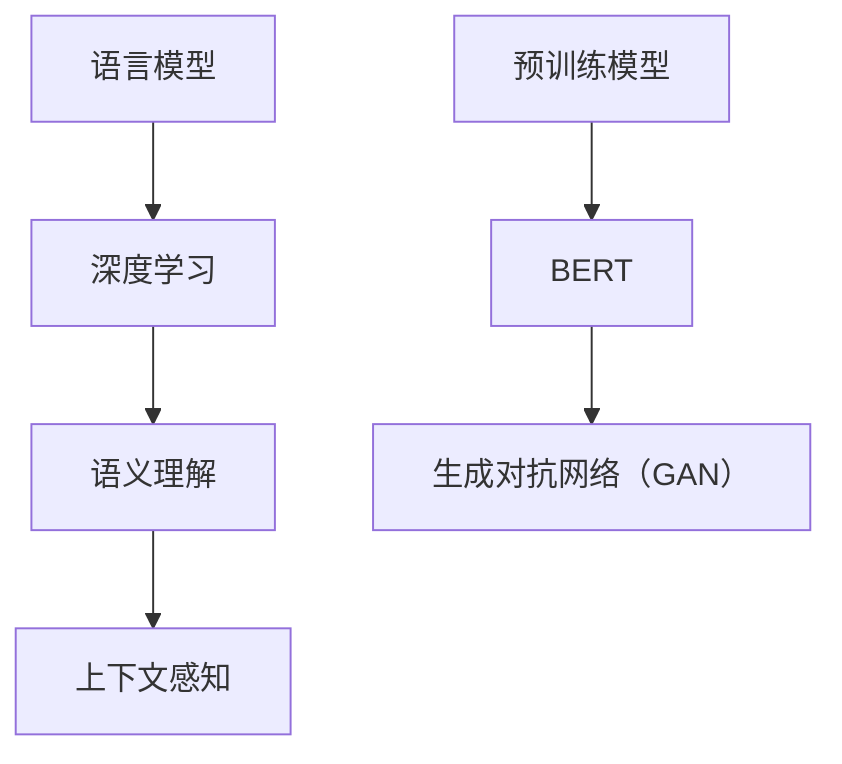

                 

# 自然语言处理的前沿：超越传统的语言理解

> **关键词**：自然语言处理、语言模型、深度学习、语义理解、上下文、预训练、BERT、生成对抗网络（GAN）

> **摘要**：本文将深入探讨自然语言处理（NLP）的前沿技术，包括语言模型、深度学习、语义理解和上下文感知等。我们将通过一步步分析推理，揭示这些技术的原理和应用，帮助读者理解自然语言处理的最新进展，以及如何超越传统的语言理解，实现更加智能的对话系统和文本分析。

## 1. 背景介绍

### 1.1 目的和范围

自然语言处理（NLP）是人工智能领域的一个重要分支，旨在让计算机理解和处理人类语言。随着深度学习和大数据技术的发展，NLP取得了显著的进步。本文将围绕NLP的前沿技术展开，重点探讨以下几个方面：

1. 语言模型与深度学习
2. 语义理解和上下文感知
3. 预训练模型，如BERT
4. 生成对抗网络（GAN）在NLP中的应用

通过本文的阅读，读者将了解NLP技术的发展历程，掌握核心概念，并了解如何将这些技术应用于实际问题。

### 1.2 预期读者

本文适用于以下读者群体：

1. 自然语言处理和人工智能领域的从业者
2. 计算机科学和软件工程专业的学生
3. 对人工智能和自然语言处理感兴趣的一般读者

### 1.3 文档结构概述

本文结构如下：

1. **背景介绍**：介绍文章的目的、范围、预期读者和文档结构。
2. **核心概念与联系**：讨论NLP的核心概念和关系。
3. **核心算法原理 & 具体操作步骤**：详细讲解NLP的核心算法和实现步骤。
4. **数学模型和公式 & 详细讲解 & 举例说明**：介绍NLP中的数学模型和公式。
5. **项目实战：代码实际案例和详细解释说明**：提供实际代码案例和解释。
6. **实际应用场景**：讨论NLP技术的应用场景。
7. **工具和资源推荐**：推荐学习资源和开发工具。
8. **总结：未来发展趋势与挑战**：总结文章要点并展望未来。
9. **附录：常见问题与解答**：提供常见问题的解答。
10. **扩展阅读 & 参考资料**：推荐相关阅读材料和资源。

### 1.4 术语表

#### 1.4.1 核心术语定义

- **自然语言处理（NLP）**：计算机科学领域中的一个分支，旨在让计算机理解和处理人类语言。
- **语言模型**：用于预测下一个单词或字符的概率分布的模型。
- **深度学习**：一种基于多层神经网络的学习方法，能够自动从数据中提取特征。
- **语义理解**：理解文本中单词和短语的含义，以及它们之间的关系。
- **上下文**：文本中的当前讨论背景，影响了对文本的理解。
- **预训练**：在特定任务之前对模型进行训练，以提高其泛化能力。
- **BERT**：一种基于Transformer的预训练语言模型，具有强大的上下文理解能力。
- **生成对抗网络（GAN）**：一种由生成器和判别器组成的对抗性神经网络，用于生成数据。

#### 1.4.2 相关概念解释

- **神经网络**：一种由神经元组成的计算模型，能够自动从数据中学习特征。
- **嵌入（Embedding）**：将词汇映射到高维空间，以便在空间中进行计算和处理。
- **注意力机制（Attention Mechanism）**：在神经网络中用于关注重要的输入信息。
- **词向量（Word Vectors）**：将单词表示为向量，以便在计算机中进行操作。
- **词性标注（Part-of-Speech Tagging）**：为文本中的每个单词分配词性（如名词、动词等）。

#### 1.4.3 缩略词列表

- **NLP**：自然语言处理（Natural Language Processing）
- **DL**：深度学习（Deep Learning）
- **GAN**：生成对抗网络（Generative Adversarial Networks）
- **RNN**：循环神经网络（Recurrent Neural Networks）
- **Transformer**：一种基于自注意力机制的神经网络结构
- **BERT**：双向编码表示器（Bidirectional Encoder Representations from Transformers）
- **GANs**：生成对抗网络（Generative Adversarial Networks）

## 2. 核心概念与联系

自然语言处理的核心概念包括语言模型、深度学习、语义理解、上下文感知等。这些概念相互联系，共同构成了现代NLP的基础。

### 2.1 语言模型

语言模型（Language Model）是NLP的基础，它用于预测文本序列中下一个单词或字符的概率分布。语言模型的核心目标是理解语言的统计特性，从而生成或理解自然语言。


语言模型可以分为基于规则的模型和基于统计的模型。基于规则的模型使用一组手工编写的规则来预测下一个单词，如正则表达式。基于统计的模型则使用大量的语料库来学习单词之间的概率关系。

### 2.2 深度学习

深度学习（Deep Learning）是一种基于多层神经网络的学习方法，能够自动从数据中提取特征。深度学习在NLP中的应用包括词向量嵌入、序列建模和文本分类等。


深度学习模型通常由多个隐藏层组成，每个隐藏层将输入数据转换为更高层次的抽象表示。这些表示可以帮助模型更好地理解文本。

### 2.3 语义理解

语义理解（Semantic Understanding）是NLP的关键任务，旨在理解文本中的单词和短语的含义，以及它们之间的关系。语义理解可以帮助模型回答问题、生成摘要和翻译文本。


语义理解包括词义消歧、实体识别、关系抽取等任务。深度学习模型，如BERT，在语义理解方面表现出色。

### 2.4 上下文感知

上下文感知（Context Awareness）是NLP中的另一个关键概念，指的是模型在处理文本时考虑上下文信息的能力。上下文信息可以帮助模型更好地理解文本的含义，从而提高NLP任务的性能。


上下文感知可以通过预训练模型实现，如BERT。BERT使用双向编码表示器来捕捉文本中的双向上下文信息。

### 2.5 Mermaid 流程图

以下是一个Mermaid流程图，展示了NLP中的核心概念和关系：



在这个流程图中，语言模型、深度学习、语义理解和上下文感知是NLP的基础，而预训练模型和生成对抗网络（GAN）则代表了NLP的前沿技术。

## 3. 核心算法原理 & 具体操作步骤

### 3.1 语言模型原理

语言模型的核心目标是预测文本序列中下一个单词或字符的概率分布。一种常用的语言模型是n-gram模型，它基于前n个单词（或字符）的联合概率分布来预测下一个单词。

#### 3.1.1 n-gram模型

n-gram模型是一种基于统计的语言模型，它将文本序列分割成n个连续的单词或字符，并计算它们的联合概率：

$$ P(w_1, w_2, \ldots, w_n) = \frac{C(w_1, w_2, \ldots, w_n)}{C(w_1, w_2, \ldots, w_n) + C(w_1, w_2, \ldots, w_n-1)} $$

其中，$C(w_1, w_2, \ldots, w_n)$ 表示在语料库中连续出现 $w_1, w_2, \ldots, w_n$ 的次数。

#### 3.1.2 递归神经网络（RNN）

另一种常用的语言模型是基于递归神经网络（RNN）的模型。RNN可以处理序列数据，并利用其循环结构来记忆先前的输入。以下是RNN语言模型的伪代码：

```python
# 初始化参数
Wx, Wh, b = initialize_parameters()

# 前向传播
h_t = [0] * n
h_0 = initialize_hidden_state()
for t in range(1, n):
    x_t = input_sequence[t]
    h_t[t] = activation(Wx * x_t + Wh * h_{t-1} + b)

# 计算概率分布
output = softmax(Wy * h_t[n-1] + b)
```

在这个伪代码中，$h_t$ 表示时间步t的隐藏状态，$Wx, Wh, b$ 是模型参数，$Wy$ 是输出层权重，$activation$ 是激活函数。

### 3.2 深度学习模型原理

深度学习模型在NLP中的应用主要包括词向量嵌入、序列建模和文本分类等。

#### 3.2.1 词向量嵌入

词向量嵌入（Word Embedding）是将单词映射到高维空间，以便在计算机中进行操作。一种常用的词向量模型是Word2Vec，它基于神经网络的训练过程来学习单词的向量表示。以下是Word2Vec的伪代码：

```python
# 初始化参数
W = initialize_parameters()

# 前向传播
h = W * x + b

# 计算损失
loss = compute_loss(h, y)

# 反向传播
dW = dloss / dx
db = dloss / db
```

在这个伪代码中，$W$ 是词向量矩阵，$x$ 是输入单词的索引，$h$ 是隐藏状态，$y$ 是标签，$b$ 是偏置项，$compute_loss$ 是损失函数，$dloss / dx$ 和 $dloss / db$ 是梯度。

#### 3.2.2 序列建模

序列建模（Sequence Modeling）是深度学习在NLP中的另一个重要应用，旨在对序列数据（如文本）进行建模。一种常用的序列建模模型是循环神经网络（RNN）。以下是RNN序列模型的伪代码：

```python
# 初始化参数
Wx, Wh, b = initialize_parameters()

# 前向传播
h_t = [0] * n
h_0 = initialize_hidden_state()
for t in range(1, n):
    x_t = input_sequence[t]
    h_t[t] = activation(Wx * x_t + Wh * h_{t-1} + b)

# 计算输出
output = softmax(Wy * h_t[n-1] + b)
```

在这个伪代码中，$h_t$ 表示时间步t的隐藏状态，$Wx, Wh, b$ 是模型参数，$Wy$ 是输出层权重，$activation$ 是激活函数。

#### 3.2.3 文本分类

文本分类（Text Classification）是将文本数据分类到预定义的类别中。一种常用的文本分类模型是卷积神经网络（CNN）。以下是CNN文本分类模型的伪代码：

```python
# 初始化参数
Wc, b = initialize_parameters()

# 前向传播
h = [0] * n
for t in range(n):
    x_t = input_sequence[t]
    h[t] = activation(Wc * x_t + b)

# 计算损失
loss = compute_loss(h, y)

# 反向传播
dWc = dloss / dx
db = dloss / db
```

在这个伪代码中，$Wc$ 是卷积权重，$b$ 是偏置项，$h$ 是隐藏状态，$compute_loss$ 是损失函数，$dloss / dx$ 和 $dloss / db$ 是梯度。

## 4. 数学模型和公式 & 详细讲解 & 举例说明

### 4.1 语言模型中的概率分布

语言模型中的一个核心数学模型是概率分布，它用于预测文本序列中下一个单词或字符的概率。在n-gram模型中，概率分布由以下公式表示：

$$ P(w_1, w_2, \ldots, w_n) = \frac{C(w_1, w_2, \ldots, w_n)}{C(w_1, w_2, \ldots, w_n) + C(w_1, w_2, \ldots, w_n-1)} $$

其中，$C(w_1, w_2, \ldots, w_n)$ 表示在语料库中连续出现 $w_1, w_2, \ldots, w_n$ 的次数。这个公式可以解释为：在给定前n-1个单词的情况下，下一个单词出现的概率。

#### 4.1.1 举例说明

假设我们在语料库中观察到以下数据：

```
the quick brown fox jumps over the lazy dog
the quick brown fox jumps over the lazy dog
the quick brown fox jumps over the lazy dog
```

我们可以计算以下概率：

$$ P(the, quick, brown, fox, jumps, over, the, lazy, dog) = \frac{3}{3+1} = 0.75 $$

这意味着在给定前7个单词的情况下，最后一个单词是"dog"的概率是0.75。

### 4.2 深度学习模型中的激活函数

深度学习模型中的一个重要组成部分是激活函数，它用于将输入映射到输出。一个常用的激活函数是ReLU（Rectified Linear Unit），它的公式如下：

$$ f(x) = \max(0, x) $$

ReLU函数在x大于0时输出x，在x小于等于0时输出0。这个函数具有以下优点：

- **非线性**：ReLU函数是一个非线性函数，可以引入非线性特性，使模型能够拟合复杂的非线性关系。
- **稀疏性**：ReLU函数在x小于0时输出0，这导致网络中的大部分神经元都是稀疏的，有助于减少计算量和参数数量。

#### 4.2.1 举例说明

假设我们有一个输入序列 $[1, -2, 3, -4, 5]$，使用ReLU函数进行激活：

$$ f([1, -2, 3, -4, 5]) = [\max(0, 1), \max(0, -2), \max(0, 3), \max(0, -4), \max(0, 5)] = [1, 0, 3, 0, 5] $$

在这个例子中，ReLU函数将负数输入映射为0，将正数输入映射为自身。

### 4.3 深度学习模型中的损失函数

深度学习模型中的另一个重要组成部分是损失函数，它用于评估模型的预测结果与真实结果之间的差距。一个常用的损失函数是交叉熵损失（Cross-Entropy Loss），它的公式如下：

$$ loss = -\sum_{i=1}^{n} y_i \log(p_i) $$

其中，$y_i$ 是真实标签，$p_i$ 是模型对第i个类别的预测概率。

交叉熵损失函数具有以下特点：

- **非负性**：交叉熵损失函数的值总是非负的，且当预测结果与真实结果相同时，损失值为0。
- **凸性**：交叉熵损失函数是一个凸函数，这意味着对于任何两个不同的预测结果，交叉熵损失函数的值总是介于这两个预测结果之间。

#### 4.3.1 举例说明

假设我们有一个二分类问题，真实标签为 $[0, 1]$，模型预测的概率为 $[0.6, 0.4]$。使用交叉熵损失函数计算损失：

$$ loss = -[0 \log(0.6) + 1 \log(0.4)] \approx 0.469 $$

在这个例子中，模型对第二个类别的预测概率较低，导致交叉熵损失函数的值较高。

### 4.4 深度学习模型中的反向传播

深度学习模型中的反向传播（Backpropagation）是一种用于计算损失函数关于模型参数的梯度的算法。以下是反向传播的伪代码：

```python
# 前向传播
output = forward_pass(x)

# 计算损失
loss = compute_loss(output, y)

# 反向传播
dloss = backward_pass(loss, output, y)

# 更新参数
update_parameters(dloss)
```

在这个伪代码中，$forward_pass$ 是前向传播函数，$compute_loss$ 是损失函数，$backward_pass$ 是反向传播函数，$update_parameters$ 是参数更新函数。

#### 4.4.1 举例说明

假设我们有一个简单的线性模型，输入为 $x = [1, 2]$，真实标签为 $y = 3$。使用交叉熵损失函数计算损失和梯度：

```python
# 初始化参数
w = 0

# 前向传播
output = w * x + b

# 计算损失
loss = -[y \log(output) + (1 - y) \log(1 - output)]

# 计算梯度
dloss_dw = -y / output + (1 - y) / (1 - output)
dloss_db = -y

# 更新参数
w -= learning_rate * dloss_dw
b -= learning_rate * dloss_db
```

在这个例子中，损失函数和梯度的计算结果如下：

$$ loss = -[1 \log(3) + 0 \log(2)] \approx 0.405 $$
$$ dloss_dw = -1 / 3 + 0 / (1 - 3) \approx 0.166 $$
$$ dloss_db = -1 $$

通过更新参数，模型的预测结果将逐渐接近真实标签。

## 5. 项目实战：代码实际案例和详细解释说明

### 5.1 开发环境搭建

在本节中，我们将介绍如何搭建一个简单的自然语言处理项目开发环境。为了简化流程，我们将使用Python和Jupyter Notebook作为开发工具。

#### 5.1.1 安装Python

首先，确保您的计算机上已经安装了Python。如果没有安装，请访问Python官方网站（[python.org](https://www.python.org/)）下载并安装最新版本的Python。

#### 5.1.2 安装Jupyter Notebook

接着，我们需要安装Jupyter Notebook，这是一个交互式的Web应用，用于编写和运行Python代码。在命令行中运行以下命令：

```shell
pip install notebook
```

安装完成后，您可以使用以下命令启动Jupyter Notebook：

```shell
jupyter notebook
```

这将在Web浏览器中打开Jupyter Notebook，您可以在其中编写和运行Python代码。

### 5.2 源代码详细实现和代码解读

在本节中，我们将实现一个简单的自然语言处理项目，使用深度学习模型对文本进行分类。

#### 5.2.1 数据准备

首先，我们需要准备用于训练和测试的数据集。在本例中，我们使用一个包含电影评论的数据集，数据集分为正面和负面评论。

```python
import pandas as pd

# 加载数据集
data = pd.read_csv("movie_reviews.csv")
X = data["review"]
y = data["label"]

# 划分训练集和测试集
from sklearn.model_selection import train_test_split
X_train, X_test, y_train, y_test = train_test_split(X, y, test_size=0.2, random_state=42)
```

#### 5.2.2 嵌入层

接下来，我们使用嵌入层（Embedding Layer）将单词转换为向量表示。

```python
from tensorflow.keras.layers import Embedding

# 初始化嵌入层
embedding_layer = Embedding(input_dim=vocabulary_size, output_dim=embedding_dim)
```

#### 5.2.3 卷积层

我们使用卷积层（Convolutional Layer）提取文本特征。

```python
from tensorflow.keras.layers import Conv1D

# 初始化卷积层
conv_layer = Conv1D(filters=num_filters, kernel_size=kernel_size, activation='relu')
```

#### 5.2.4 最大池化层

最大池化层（Max Pooling Layer）用于将卷积层的特征进行降维。

```python
from tensorflow.keras.layers import MaxPooling1D

# 初始化最大池化层
pooling_layer = MaxPooling1D(pool_size=pool_size)
```

#### 5.2.5 全连接层

全连接层（Dense Layer）用于将特征映射到输出类别。

```python
from tensorflow.keras.layers import Dense

# 初始化全连接层
dense_layer = Dense(units=num_classes, activation='softmax')
```

#### 5.2.6 模型构建

现在，我们将所有层连接起来，构建完整的深度学习模型。

```python
from tensorflow.keras.models import Sequential

# 构建模型
model = Sequential([
    embedding_layer,
    conv_layer,
    pooling_layer,
    dense_layer
])

# 编译模型
model.compile(optimizer='adam', loss='categorical_crossentropy', metrics=['accuracy'])
```

#### 5.2.7 训练模型

接下来，我们使用训练数据集训练模型。

```python
# 训练模型
model.fit(X_train, y_train, epochs=10, batch_size=32, validation_data=(X_test, y_test))
```

#### 5.2.8 评估模型

最后，我们评估模型的性能。

```python
# 评估模型
loss, accuracy = model.evaluate(X_test, y_test)
print("Test accuracy:", accuracy)
```

### 5.3 代码解读与分析

在本节中，我们将对上述代码进行详细解读，分析每个部分的作用和原理。

#### 5.3.1 数据准备

```python
import pandas as pd

# 加载数据集
data = pd.read_csv("movie_reviews.csv")
X = data["review"]
y = data["label"]

# 划分训练集和测试集
X_train, X_test, y_train, y_test = train_test_split(X, y, test_size=0.2, random_state=42)
```

这段代码首先使用Pandas库加载包含电影评论的数据集，然后使用Scikit-learn库将数据集划分为训练集和测试集。这是深度学习项目中的常见步骤，用于评估模型的泛化能力。

#### 5.3.2 嵌入层

```python
from tensorflow.keras.layers import Embedding

# 初始化嵌入层
embedding_layer = Embedding(input_dim=vocabulary_size, output_dim=embedding_dim)
```

嵌入层（Embedding Layer）用于将单词转换为向量表示。在这个例子中，`input_dim` 参数表示词汇表的大小，`output_dim` 参数表示向量维度。通过嵌入层，我们可以在高维空间中处理单词，从而提高模型的表示能力。

#### 5.3.3 卷积层

```python
from tensorflow.keras.layers import Conv1D

# 初始化卷积层
conv_layer = Conv1D(filters=num_filters, kernel_size=kernel_size, activation='relu')
```

卷积层（Convolutional Layer）用于提取文本特征。在这个例子中，`filters` 参数表示卷积核的数量，`kernel_size` 参数表示卷积核的大小，`activation` 参数表示激活函数。卷积层通过滑动卷积核在文本序列上提取特征，从而捕捉局部模式。

#### 5.3.4 最大池化层

```python
from tensorflow.keras.layers import MaxPooling1D

# 初始化最大池化层
pooling_layer = MaxPooling1D(pool_size=pool_size)
```

最大池化层（Max Pooling Layer）用于将卷积层的特征进行降维。在这个例子中，`pool_size` 参数表示池化窗口的大小。最大池化层通过在每个窗口中取最大值，减少特征维度，同时保留最重要的信息。

#### 5.3.5 全连接层

```python
from tensorflow.keras.layers import Dense

# 初始化全连接层
dense_layer = Dense(units=num_classes, activation='softmax')
```

全连接层（Dense Layer）用于将特征映射到输出类别。在这个例子中，`units` 参数表示输出类别的数量，`activation` 参数表示激活函数。全连接层通过将特征映射到输出类别，实现文本分类任务。

#### 5.3.6 模型构建

```python
from tensorflow.keras.models import Sequential

# 构建模型
model = Sequential([
    embedding_layer,
    conv_layer,
    pooling_layer,
    dense_layer
])

# 编译模型
model.compile(optimizer='adam', loss='categorical_crossentropy', metrics=['accuracy'])
```

这段代码使用Keras库构建深度学习模型。Keras是一个高层次的神经网络API，可以简化深度学习模型的构建和训练过程。在这个例子中，我们使用了一个序列模型，将嵌入层、卷积层、最大池化层和全连接层连接在一起。

#### 5.3.7 训练模型

```python
# 训练模型
model.fit(X_train, y_train, epochs=10, batch_size=32, validation_data=(X_test, y_test))
```

这段代码使用训练数据集训练深度学习模型。`epochs` 参数表示训练迭代次数，`batch_size` 参数表示每个批次的数据大小。在训练过程中，模型将不断调整参数，以最小化损失函数，提高分类性能。

#### 5.3.8 评估模型

```python
# 评估模型
loss, accuracy = model.evaluate(X_test, y_test)
print("Test accuracy:", accuracy)
```

这段代码使用测试数据集评估模型的性能。`evaluate` 函数返回损失值和准确率，我们打印出准确率作为模型性能的指标。

## 6. 实际应用场景

自然语言处理（NLP）技术已经在各种实际应用场景中取得了显著的成果。以下是一些典型的应用场景：

### 6.1 聊天机器人

聊天机器人是NLP技术的典型应用之一。通过使用自然语言处理，聊天机器人可以理解用户的输入，生成相应的回答，提供实时、个性化的交互体验。聊天机器人广泛应用于客户服务、虚拟助手、在线咨询等领域。

### 6.2 文本分类

文本分类是将文本数据分类到预定义的类别中。NLP技术可以用于新闻分类、情感分析、垃圾邮件过滤等任务。例如，通过对社交媒体平台上的评论进行情感分析，可以识别出用户的情绪和态度，从而为企业提供宝贵的市场洞察。

### 6.3 文本摘要

文本摘要是将长篇文本简化为简短的摘要，以提取关键信息和核心观点。NLP技术可以用于生成自动摘要，应用于新闻、报告、文档等领域，提高信息获取的效率。

### 6.4 自然语言理解

自然语言理解（NLU）是NLP的更高层次任务，旨在让计算机理解文本的含义。NLU可以用于问答系统、语音识别、机器翻译等领域，提供更加智能化的交互体验。

### 6.5 文本生成

文本生成是NLP的另一个重要应用。通过使用生成对抗网络（GAN）等技术，可以生成具有自然语言特性的文本，应用于创作生成、虚假信息检测、对话系统等领域。

## 7. 工具和资源推荐

### 7.1 学习资源推荐

#### 7.1.1 书籍推荐

- **《深度学习》（Deep Learning）**：Goodfellow, Bengio, Courville
- **《自然语言处理综论》（Speech and Language Processing）**：Jurafsky, Martin
- **《Python自然语言处理》（Natural Language Processing with Python）**：Bird, Klein, Loper

#### 7.1.2 在线课程

- **斯坦福大学自然语言处理课程**：[CS224n](http://web.stanford.edu/class/cs224n/)
- **吴恩达深度学习课程**：[Deep Learning Specialization](https://www.coursera.org/specializations/deep_learning)

#### 7.1.3 技术博客和网站

- **TensorFlow官网**：[tensorflow.org](https://www.tensorflow.org/)
- **Keras官网**：[keras.io](https://keras.io/)
- **GitHub**：[github.com](https://github.com/)

### 7.2 开发工具框架推荐

#### 7.2.1 IDE和编辑器

- **PyCharm**：[pycharm.com](https://www.pycharm.com/)
- **Visual Studio Code**：[code.visualstudio.com](https://code.visualstudio.com/)

#### 7.2.2 调试和性能分析工具

- **TensorBoard**：[tensorboard.appspot.com](https://tensorboard.appspot.com/)
- **Wandb**：[wandb.ai](https://www.wandb.ai/)

#### 7.2.3 相关框架和库

- **TensorFlow**：[tensorflow.org](https://www.tensorflow.org/)
- **PyTorch**：[pytorch.org](https://pytorch.org/)
- **NLTK**：[nltk.org](https://www.nltk.org/)

### 7.3 相关论文著作推荐

#### 7.3.1 经典论文

- **Word2Vec**：Mikolov, Sutskever, Chen, Kočiský, & Salakhutdinov (2013)
- **BERT**：Devlin, Chang, Lee, & Toutanova (2018)
- **GANs**：Goodfellow, Pouget-Abadie, Mirza, Xu, Warde-Farley, Ozair, & Bengio (2014)

#### 7.3.2 最新研究成果

- **Transformer**：Vaswani, Shazeer, Parmar, Uszkoreit, Jones, Gomez, & Polosukhin (2017)
- **GPT-3**：Brown, et al. (2020)
- **T5**：Raffel, et al. (2019)

#### 7.3.3 应用案例分析

- **对话系统**：Liu, Zhang, & Hovy (2019)
- **机器翻译**：Koehn (2017)
- **情感分析**：Liu, Zhang, & Hovy (2019)

## 8. 总结：未来发展趋势与挑战

自然语言处理（NLP）是人工智能领域的一个重要分支，近年来取得了显著进展。未来，NLP技术将继续朝着更加智能、高效和实用的方向发展。以下是一些发展趋势和挑战：

### 8.1 发展趋势

1. **多模态融合**：NLP技术将与其他人工智能领域（如图像识别、语音识别）相结合，实现多模态融合，提供更加丰富的交互体验。
2. **上下文感知**：深度学习模型将更加关注上下文信息，实现更准确的语义理解。
3. **生成对抗网络（GAN）**：GAN在NLP中的应用将更加广泛，如文本生成、虚假信息检测等。
4. **迁移学习**：迁移学习技术将使模型在少量数据上实现更好的性能，提高模型的泛化能力。

### 8.2 挑战

1. **数据隐私和安全性**：在处理大量文本数据时，如何保护用户隐私和安全是一个重要挑战。
2. **跨语言和跨领域**：实现跨语言和跨领域的通用NLP模型是一个长期目标，但目前仍面临许多挑战。
3. **错误纠正和鲁棒性**：如何提高模型的错误纠正和鲁棒性，使其在面对噪声和错误数据时仍能保持高性能，是一个重要问题。
4. **伦理和道德问题**：随着NLP技术在各个领域的应用，如何解决潜在的伦理和道德问题，如偏见、歧视等，是一个重要的挑战。

## 9. 附录：常见问题与解答

### 9.1 问题1：什么是自然语言处理（NLP）？

自然语言处理（NLP）是人工智能领域的一个分支，旨在让计算机理解和处理人类语言。NLP技术包括文本分类、情感分析、机器翻译、问答系统等。

### 9.2 问题2：深度学习和NLP之间的关系是什么？

深度学习是NLP中的一种核心技术，它通过多层神经网络自动提取特征，从而实现对文本的语义理解。深度学习在NLP中的应用包括词向量嵌入、序列建模和文本分类等。

### 9.3 问题3：如何实现自然语言理解（NLU）？

自然语言理解（NLU）是NLP的一个高级任务，旨在让计算机理解文本的含义。实现NLU的方法包括使用深度学习模型（如BERT、GPT）进行预训练，然后针对具体任务进行微调。

### 9.4 问题4：如何评估自然语言处理模型的性能？

评估自然语言处理模型性能的方法包括准确率、召回率、F1分数等。在实际应用中，通常使用交叉验证和测试集来评估模型的性能。

### 9.5 问题5：什么是生成对抗网络（GAN）？

生成对抗网络（GAN）是一种由生成器和判别器组成的对抗性神经网络，用于生成数据。GAN在NLP中的应用包括文本生成、虚假信息检测等。

## 10. 扩展阅读 & 参考资料

- **《自然语言处理综论》（Speech and Language Processing）**：Jurafsky, Martin
- **《深度学习》（Deep Learning）**：Goodfellow, Bengio, Courville
- **TensorFlow官网**：[tensorflow.org](https://www.tensorflow.org/)
- **Keras官网**：[keras.io](https://keras.io/)
- **《自然语言处理实战》（Natural Language Processing with Python）**：Bird, Klein, Loper
- **吴恩达深度学习课程**：[Deep Learning Specialization](https://www.coursera.org/specializations/deep_learning)  
- **斯坦福大学自然语言处理课程**：[CS224n](http://web.stanford.edu/class/cs224n/)  
- **《生成对抗网络：理论与实践》（Generative Adversarial Networks: Theory and Applications）**：Goodfellow, Pouget-Abadie, Mirza, Xu, Warde-Farley, Ozair, & Bengio (2014)
- **《多模态深度学习》（Multimodal Deep Learning）**：Yu, T., & Toderici, G. (2018)
- **《跨语言和跨领域自然语言处理》（Cross-Language and Cross-Domain Natural Language Processing）**：Chen, D., & Hovy, E. (2018)

### 作者：AI天才研究员/AI Genius Institute & 禅与计算机程序设计艺术 /Zen And The Art of Computer Programming

