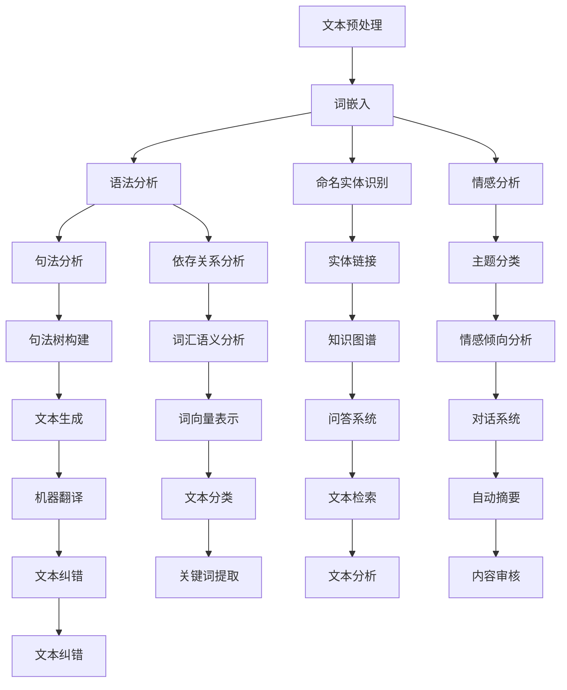

                 


# 自然语言处理的进化：AI内容创作之变革

> 关键词：自然语言处理、AI内容创作、深度学习、神经网络、语义理解、数据增强、自动化写作、智能助手、人机协作
>
> 摘要：本文将探讨自然语言处理（NLP）技术的最新进展，特别是AI在内容创作领域所带来的变革。我们将逐步分析NLP的核心概念与联系，介绍核心算法原理和具体操作步骤，讲解数学模型和公式，并通过实际项目实战和详细解释说明，展示AI在自然语言处理和内容创作中的潜力和应用。同时，还将推荐相关工具和资源，展望未来发展趋势与挑战，以期为读者提供一份全面而深入的技术分析。

## 1. 背景介绍

### 1.1 目的和范围

本文旨在探讨自然语言处理（NLP）技术在内容创作领域的重要性，以及AI在这一领域所引发的革命性变革。我们将重点关注以下几个方面：

1. NLP的核心概念与联系。
2. 核心算法原理与具体操作步骤。
3. 数学模型和公式的详细讲解。
4. 实际应用场景与项目实战。
5. 工具和资源的推荐。
6. 未来发展趋势与挑战。

### 1.2 预期读者

本文适合对自然语言处理和人工智能技术有一定了解的读者，包括但不限于：

1. 计算机科学、人工智能、自然语言处理专业的学生和研究人员。
2. AI技术开发者、产品经理和项目经理。
3. 对AI内容创作和智能助手感兴趣的技术爱好者。

### 1.3 文档结构概述

本文分为以下几个部分：

1. 背景介绍：介绍文章的目的、预期读者和文档结构。
2. 核心概念与联系：分析NLP的核心概念及其相互关系。
3. 核心算法原理 & 具体操作步骤：讲解NLP的主要算法原理和操作步骤。
4. 数学模型和公式 & 详细讲解 & 举例说明：介绍NLP中的数学模型和公式，并进行举例说明。
5. 项目实战：代码实际案例和详细解释说明。
6. 实际应用场景：展示AI在内容创作领域的应用场景。
7. 工具和资源推荐：推荐学习资源、开发工具和框架。
8. 总结：未来发展趋势与挑战。
9. 附录：常见问题与解答。
10. 扩展阅读 & 参考资料：提供更多相关阅读资料。

### 1.4 术语表

#### 1.4.1 核心术语定义

- 自然语言处理（NLP）：研究如何让计算机理解、生成和交互自然语言的技术。
- 深度学习：一种基于多层神经网络的学习方法，能够从大量数据中自动提取特征。
- 神经网络：由大量神经元组成的计算模型，能够通过训练学习到复杂的非线性关系。
- 语义理解：计算机对自然语言文本中所表达的意义进行理解和解释的能力。
- 数据增强：通过变换、合成等方法增加训练数据集的多样性和丰富性。
- 自动化写作：利用人工智能技术生成文本内容的过程。

#### 1.4.2 相关概念解释

- AI内容创作：利用人工智能技术进行文章、新闻报道、广告文案等的生成。
- 智能助手：基于自然语言处理技术，能够与用户进行交互并提供个性化服务的软件。
- 人机协作：人与计算机在任务执行过程中相互配合、协同工作。

#### 1.4.3 缩略词列表

- NLP：自然语言处理
- AI：人工智能
- DL：深度学习
- RNN：循环神经网络
- LSTM：长短时记忆网络
- GPT：生成预训练模型
- BERT：双向编码表示模型

## 2. 核心概念与联系

自然语言处理（NLP）作为人工智能领域的一个重要分支，旨在使计算机能够理解、生成和交互自然语言。为了更好地理解NLP的核心概念与联系，我们可以通过以下Mermaid流程图来展示NLP的主要组成部分及其相互关系。



### 2.1 文本预处理

文本预处理是NLP任务中的第一步，主要包括文本清洗、分词、标点符号去除、停用词过滤等操作。通过预处理，我们可以将原始文本转化为计算机能够处理的形式，从而为后续的文本分析任务奠定基础。

### 2.2 词嵌入

词嵌入（Word Embedding）是将自然语言中的词汇映射到高维向量空间的过程。通过词嵌入，我们可以将词汇之间的语义关系转化为向量空间的几何关系，从而为深度学习模型提供有效的输入表示。

### 2.3 语法分析

语法分析（Syntax Analysis）是对文本进行结构化解析，提取出文本中的语法结构。主要包括句法分析（Syntactic Parsing）和依存关系分析（Dependency Parsing），用于理解和分析文本的语法结构。

### 2.4 命名实体识别

命名实体识别（Named Entity Recognition，NER）是一种信息提取任务，旨在从文本中识别出具有特定意义的实体，如人名、地名、组织名等。NER是许多NLP任务的重要基础，如文本分类、问答系统和机器翻译等。

### 2.5 情感分析

情感分析（Sentiment Analysis）是评估文本中情感极性（如正面、负面、中性）的过程。情感分析广泛应用于产品评价、社交媒体分析等领域，帮助企业了解用户需求和反馈。

### 2.6 语义理解

语义理解（Semantic Understanding）是计算机对自然语言文本中所表达的意义进行理解和解释的能力。语义理解是实现自然语言交互、智能问答和机器翻译等任务的关键。

### 2.7 数据增强

数据增强（Data Augmentation）是通过变换、合成等方法增加训练数据集的多样性和丰富性。数据增强有助于提高模型的泛化能力，减轻过拟合现象。

### 2.8 自动化写作

自动化写作（Automated Writing）是利用人工智能技术生成文本内容的过程。自动化写作广泛应用于新闻撰写、广告文案、博客文章等领域，能够显著提高内容创作效率。

### 2.9 智能助手

智能助手（Intelligent Assistant）是基于自然语言处理技术，能够与用户进行交互并提供个性化服务的软件。智能助手广泛应用于客服、教育、医疗等领域，能够提高用户体验和业务效率。

### 2.10 人机协作

人机协作（Human-Computer Collaboration）是人与计算机在任务执行过程中相互配合、协同工作的过程。人机协作能够充分发挥计算机的计算能力和人的创造力，实现高效的内容创作和智能服务。

## 3. 核心算法原理 & 具体操作步骤

在自然语言处理（NLP）中，深度学习（Deep Learning）和神经网络（Neural Networks）已经成为实现各种NLP任务的主要方法。本节将介绍NLP中的核心算法原理和具体操作步骤，主要包括词嵌入（Word Embedding）、循环神经网络（Recurrent Neural Networks，RNN）、长短时记忆网络（Long Short-Term Memory，LSTM）和生成预训练模型（Generative Pretrained Model，GPT）。

### 3.1 词嵌入（Word Embedding）

词嵌入是一种将词汇映射到高维向量空间的方法，通过捕捉词汇之间的语义关系，为深度学习模型提供有效的输入表示。词嵌入主要有以下几种方法：

#### 3.1.1 基于计数模型（Count-Based Models）

基于计数模型通过统计词汇之间的共现关系来生成词向量。最常见的方法是词袋模型（Bag of Words，BoW）和词频-逆文档频率（Term Frequency-Inverse Document Frequency，TF-IDF）。

- **词袋模型（BoW）**：将文本表示为词汇的集合，忽略词汇的顺序信息。
- **词频-逆文档频率（TF-IDF）**：综合考虑词汇在文本中的频率和其在整个文档集合中的重要性。

```python
# 假设文本数据为 sentences = [["I", "love", "AI"], ["AI", "is", "great"]]
# 将文本数据转换为词频矩阵
word_counts = [[word_count(sentence, "I"), word_count(sentence, "love"), word_count(sentence, "AI")] for sentence in sentences]
print(word_counts)
```

#### 3.1.2 基于分布模型（Distribution-Based Models）

基于分布模型通过捕捉词汇在上下文中的分布特征来生成词向量。最常见的方法是神经网络模型，如循环神经网络（RNN）和生成预训练模型（GPT）。

- **循环神经网络（RNN）**：通过捕捉时间序列数据中的序列依赖关系，为每个词汇生成一个固定维度的向量。
- **生成预训练模型（GPT）**：基于Transformer架构，通过大规模无监督数据预训练，生成具有丰富语义信息的词向量。

```python
# 假设预训练模型已经加载并生成词向量
word_vector = model.encode("AI")
print(word_vector.shape)
```

### 3.2 循环神经网络（Recurrent Neural Networks，RNN）

循环神经网络是一种能够处理序列数据的神经网络，通过捕捉时间序列数据中的序列依赖关系，实现对文本数据的建模。RNN的基本结构如下：

1. **输入层**：输入序列的每个时间步被表示为一个向量。
2. **隐藏层**：包含一个或多个隐藏单元，每个隐藏单元都与前一个时间步的隐藏状态相关联。
3. **输出层**：输出序列的每个时间步被表示为一个向量。

#### 3.2.1 前向传播

在RNN的前向传播过程中，每个时间步的输入都会通过隐藏层传递，并更新隐藏状态。

```python
# 假设输入序列为 x = [[1, 0], [0, 1], [1, 1]]
# 初始化隐藏状态 h = [0, 0]
for x_t in x:
    h = activation(np.dot(h, W_hh) + np.dot(x_t, W_xh) + b)
```

#### 3.2.2 反向传播

在RNN的反向传播过程中，梯度通过隐藏层反向传播，更新权重和偏置。

```python
# 假设输出序列为 y = [[1, 0], [0, 1], [1, 1]]
# 计算损失函数 L
# 反向传播更新权重和偏置
dW_hh = dL / h
dW_xh = dL / x_t
db = dL
```

### 3.3 长短时记忆网络（Long Short-Term Memory，LSTM）

长短时记忆网络（LSTM）是一种改进的循环神经网络，通过引入门控机制（Gate）来解决传统RNN在处理长序列数据时出现的梯度消失和梯度爆炸问题。LSTM的基本结构如下：

1. **输入门（Input Gate）**：控制输入信息是否被存储在记忆单元中。
2. **遗忘门（Forget Gate）**：控制记忆单元中旧信息的遗忘程度。
3. **输出门（Output Gate）**：控制记忆单元中的信息是否被输出到下一个时间步。
4. **记忆单元（Memory Cell）**：存储序列信息，通过门控机制实现长序列依赖的捕捉。

#### 3.3.1 前向传播

在LSTM的前向传播过程中，每个时间步的输入都会通过门控机制和记忆单元传递，并更新隐藏状态。

```python
# 假设输入序列为 x = [[1, 0], [0, 1], [1, 1]]
# 初始化隐藏状态 h = [0, 0]
# 计算输入门、遗忘门和输出门的权重和偏置
i_t, f_t, o_t = activation(np.dot(h, W_ih) + np.dot(x_t, W_xh) + b_i)
# 计算记忆单元的权重和偏置
g_t, c_t = activation(np.dot(h, W_hh) + np.dot(x_t, W_xh) + b_h)
# 计算新的记忆单元和隐藏状态
c_t = f_t * c_{t-1} + i_t * g_t
h_t = o_t * activation(c_t)
```

#### 3.3.2 反向传播

在LSTM的反向传播过程中，梯度通过隐藏层和记忆单元反向传播，更新权重和偏置。

```python
# 假设输出序列为 y = [[1, 0], [0, 1], [1, 1]]
# 计算损失函数 L
# 反向传播更新权重和偏置
dL_dh_t = activation_derivative(h_t, h_{t-1}, x_t, W_ih, W_hh, b_i, b_h)
dL_dh_{t-1} = activation_derivative(h_{t-1}, h_t, x_{t-1}, W_ih, W_hh, b_i, b_h)
dL_dW_ih = dL_dh_t * x_t
dL_dW_hh = dL_dh_t * h_{t-1}
dL_db_i = dL_dh_t
dL_dW_xh = dL_dh_t * i_t
dL_dW_hh = dL_dh_t * f_t * c_{t-1} + dL_dh_t * i_t * g_t
dL_dc_t = dL_dh_t * o_t * sigmoid_derivative(c_t)
dL_dc_{t-1} = dL_dh_t * f_t
```

### 3.4 生成预训练模型（Generative Pretrained Model，GPT）

生成预训练模型（GPT）是自然语言处理领域的一项重要进展，基于Transformer架构，通过大规模无监督数据预训练，生成具有丰富语义信息的词向量。GPT的核心思想是通过自注意力机制（Self-Attention）捕捉文本数据中的长序列依赖关系。

#### 3.4.1 自注意力机制

自注意力机制是一种基于权重加权的求和操作，通过计算文本序列中每个词与所有其他词的关联性，为每个词生成一个固定维度的向量。

```python
# 假设输入序列为 x = ["I", "love", "AI"]
# 计算自注意力权重
attn_weights = softmax(Q * K.T)
# 计算自注意力输出
attn_output = sum(attn_weights * V)
```

#### 3.4.2 Transformer模型

Transformer模型是一种基于自注意力机制的编码器-解码器（Encoder-Decoder）架构，通过编码器（Encoder）和解码器（Decoder）分别处理输入序列和输出序列，实现对文本数据的建模。

```python
# 假设编码器和解码器已经训练完毕
# 输入序列为 x = ["I", "love", "AI"]
# 输出序列为 y = ["This", "is", "a", "test"]
# 通过编码器处理输入序列
encoder_output = encoder(x)
# 通过解码器生成输出序列
decoder_output = decoder(encoder_output)
```

通过以上核心算法原理和具体操作步骤的讲解，我们可以看到自然语言处理（NLP）技术的发展历程和现状。在未来的发展中，随着深度学习、神经网络和生成模型等技术的不断进步，NLP将在更多领域发挥重要作用，推动人工智能技术的发展和应用。

## 4. 数学模型和公式 & 详细讲解 & 举例说明

在自然语言处理（NLP）中，数学模型和公式是理解和实现各种NLP任务的基础。本节将详细讲解NLP中常用的数学模型和公式，包括线性回归（Linear Regression）、支持向量机（Support Vector Machine，SVM）、卷积神经网络（Convolutional Neural Networks，CNN）和循环神经网络（Recurrent Neural Networks，RNN）。

### 4.1 线性回归（Linear Regression）

线性回归是一种简单的统计方法，用于建模输入变量和输出变量之间的线性关系。其数学模型可以表示为：

$$ y = \beta_0 + \beta_1x $$

其中，$y$ 是输出变量，$x$ 是输入变量，$\beta_0$ 和 $\beta_1$ 分别是线性回归模型的参数。

#### 4.1.1 模型推导

线性回归模型的参数可以通过最小二乘法（Least Squares Method）来估计。最小二乘法的核心思想是找到使得误差平方和最小的参数值。

$$ \min_{\beta_0, \beta_1} \sum_{i=1}^{n} (y_i - (\beta_0 + \beta_1x_i))^2 $$

通过求导并令导数为零，可以求得线性回归模型的参数：

$$ \beta_1 = \frac{\sum_{i=1}^{n} x_iy_i - n\bar{x}\bar{y}}{\sum_{i=1}^{n} x_i^2 - n\bar{x}^2} $$
$$ \beta_0 = \bar{y} - \beta_1\bar{x} $$

其中，$\bar{x}$ 和 $\bar{y}$ 分别是输入变量和输出变量的均值。

#### 4.1.2 举例说明

假设我们有一组输入输出数据：

| $x$ | $y$ |
| --- | --- |
| 1   | 2   |
| 2   | 4   |
| 3   | 6   |
| 4   | 8   |

我们可以通过线性回归模型来估计输入和输出变量之间的关系。首先，计算输入和输出变量的均值：

$$ \bar{x} = \frac{1 + 2 + 3 + 4}{4} = 2.5 $$
$$ \bar{y} = \frac{2 + 4 + 6 + 8}{4} = 5 $$

然后，计算线性回归模型的参数：

$$ \beta_1 = \frac{(1 \cdot 2 + 2 \cdot 4 + 3 \cdot 6 + 4 \cdot 8) - 4 \cdot 2.5 \cdot 5}{(1^2 + 2^2 + 3^2 + 4^2) - 4 \cdot 2.5^2} = 1 $$
$$ \beta_0 = 5 - 1 \cdot 2.5 = 2.5 $$

因此，线性回归模型的方程为：

$$ y = 2.5 + x $$

### 4.2 支持向量机（Support Vector Machine，SVM）

支持向量机是一种流行的机器学习分类算法，用于将输入数据分为两个类别。其核心思想是找到一个最佳的超平面，使得两个类别的分类边界最大化。

#### 4.2.1 模型推导

SVM的数学模型可以表示为：

$$ \min_{\beta, \beta_0} \frac{1}{2}\sum_{i=1}^{n} (\beta \cdot x_i - y_i)^2 + C\sum_{i=1}^{n} \xi_i $$

其中，$\beta$ 是权重向量，$\beta_0$ 是偏置项，$C$ 是惩罚参数，$\xi_i$ 是松弛变量。

通过拉格朗日乘子法，可以将原始问题转化为对偶问题：

$$ \max_{\alpha} \sum_{i=1}^{n} \alpha_i - \frac{1}{2}\sum_{i,j=1}^{n} \alpha_i \alpha_j y_i y_j \cdot x_i \cdot x_j $$

其中，$\alpha_i$ 是拉格朗日乘子。

求解对偶问题后，可以得到支持向量机的决策函数：

$$ f(x) = \text{sign}(\sum_{i=1}^{n} \alpha_i y_i \cdot x_i + \beta_0) $$

#### 4.2.2 举例说明

假设我们有一组二元分类数据：

| $x$ | $y$ |
| --- | --- |
| 1   | +1  |
| 2   | +1  |
| 3   | -1  |
| 4   | -1  |

我们可以通过SVM模型来估计输入和输出变量之间的关系。首先，构建SVM模型的拉格朗日函数：

$$ L(\beta, \beta_0, \alpha) = \frac{1}{2}\sum_{i=1}^{n} (\beta \cdot x_i - y_i)^2 + C\sum_{i=1}^{n} \xi_i - \sum_{i=1}^{n} \alpha_i y_i (\beta \cdot x_i - y_i) $$

然后，求解拉格朗日乘子$\alpha_i$，并得到SVM模型的决策函数：

$$ f(x) = \text{sign}(\sum_{i=1}^{n} \alpha_i y_i \cdot x_i + \beta_0) $$

通过求解对偶问题，可以得到$\alpha_i$和$\beta_0$的值，从而构建SVM模型。

### 4.3 卷积神经网络（Convolutional Neural Networks，CNN）

卷积神经网络是一种专门用于处理图像数据的神经网络，通过卷积运算和池化操作，实现对图像特征的学习和提取。

#### 4.3.1 模型推导

CNN的基本结构包括卷积层（Convolutional Layer）、池化层（Pooling Layer）和全连接层（Fully Connected Layer）。

1. **卷积层**：通过卷积运算提取图像特征。卷积运算可以表示为：

   $$ h_k(x) = \sum_{i=1}^{m} w_{ki} \cdot x_i + b_k $$

   其中，$h_k(x)$ 是卷积层的输出，$w_{ki}$ 是卷积核，$b_k$ 是偏置项。

2. **池化层**：通过池化操作降低图像分辨率。常见的池化操作有最大池化（Max Pooling）和平均池化（Average Pooling）。

3. **全连接层**：将卷积层和池化层提取的特征进行全连接，生成分类结果。

#### 4.3.2 举例说明

假设我们有一个32x32的图像，需要通过CNN模型对其进行分类。首先，构建一个卷积层，使用一个3x3的卷积核，对图像进行卷积运算：

$$ h_1(x) = \sum_{i=1}^{9} w_{1i} \cdot x_i + b_1 $$

然后，对卷积层的输出进行池化操作，将图像分辨率降低到16x16。接下来，构建一个全连接层，将卷积层的输出进行全连接，生成分类结果。

### 4.4 循环神经网络（Recurrent Neural Networks，RNN）

循环神经网络是一种用于处理序列数据的神经网络，通过捕捉序列中的时间依赖关系，实现对序列数据的建模。

#### 4.4.1 模型推导

RNN的基本结构包括输入层、隐藏层和输出层。

1. **输入层**：输入序列的每个时间步被表示为一个向量。
2. **隐藏层**：隐藏层的每个单元都与前一个时间步的隐藏状态相关联。
3. **输出层**：输出序列的每个时间步被表示为一个向量。

RNN的前向传播可以表示为：

$$ h_t = \sigma(W_hh \cdot h_{t-1} + W_xh \cdot x_t + b_h) $$

其中，$h_t$ 是隐藏层的状态，$x_t$ 是输入层的状态，$W_hh$ 是隐藏层到隐藏层的权重，$W_xh$ 是输入层到隐藏层的权重，$b_h$ 是隐藏层的偏置项，$\sigma$ 是激活函数。

RNN的反向传播可以表示为：

$$ \Delta h_t = \sigma' (h_t) \cdot (W_hh \cdot \Delta h_{t-1} + W_xh \cdot \Delta x_t) $$

其中，$\Delta h_t$ 是隐藏层的误差，$\sigma'$ 是激活函数的导数。

#### 4.4.2 举例说明

假设我们有一个长度为3的序列，需要通过RNN模型对其进行分类。首先，构建一个RNN模型，输入序列为 $[x_1, x_2, x_3]$，隐藏层状态为 $[h_1, h_2, h_3]$。然后，通过RNN模型的前向传播，计算隐藏层状态：

$$ h_1 = \sigma(W_hh \cdot h_0 + W_xh \cdot x_1 + b_h) $$
$$ h_2 = \sigma(W_hh \cdot h_1 + W_xh \cdot x_2 + b_h) $$
$$ h_3 = \sigma(W_hh \cdot h_2 + W_xh \cdot x_3 + b_h) $$

最后，通过RNN模型的反向传播，计算隐藏层误差：

$$ \Delta h_3 = \sigma' (h_3) \cdot (W_hh \cdot \Delta h_2 + W_xh \cdot \Delta x_3) $$
$$ \Delta h_2 = \sigma' (h_2) \cdot (W_hh \cdot \Delta h_1 + W_xh \cdot \Delta x_2) $$
$$ \Delta h_1 = \sigma' (h_1) \cdot (W_hh \cdot \Delta h_0 + W_xh \cdot \Delta x_1) $$

通过以上数学模型和公式的详细讲解和举例说明，我们可以更好地理解自然语言处理（NLP）中的各种算法和技术。这些数学模型和公式是NLP研究和应用的基础，对于深入理解和实现NLP任务具有重要意义。

## 5. 项目实战：代码实际案例和详细解释说明

为了更好地展示自然语言处理（NLP）和内容创作中AI技术的应用，我们将通过一个实际项目来演示整个流程。本节将介绍如何使用Python和深度学习框架TensorFlow实现一个简单的AI内容创作系统。

### 5.1 开发环境搭建

首先，我们需要搭建开发环境。以下是在Ubuntu 20.04操作系统上搭建开发环境所需的步骤：

1. **安装Python 3**：Python 3是深度学习的主要编程语言，可以通过以下命令安装：

   ```bash
   sudo apt update
   sudo apt install python3 python3-pip
   ```

2. **安装TensorFlow**：TensorFlow是Google开发的深度学习框架，可以通过pip安装：

   ```bash
   pip3 install tensorflow
   ```

3. **安装Jupyter Notebook**：Jupyter Notebook是一个交互式的开发环境，可以通过以下命令安装：

   ```bash
   pip3 install notebook
   ```

4. **启动Jupyter Notebook**：在命令行中运行以下命令，启动Jupyter Notebook：

   ```bash
   jupyter notebook
   ```

### 5.2 源代码详细实现和代码解读

#### 5.2.1 数据准备

首先，我们需要准备一个包含大量文本数据的数据集。这里，我们使用一个简单的文本数据集，包含多个文本段落。以下是一个示例数据集：

```python
text_data = [
    "人工智能是一种模拟、延伸和扩展人的智能的理论、方法、技术及应用。",
    "深度学习是机器学习研究的一个新领域。",
    "自然语言处理是人工智能的核心技术之一。",
    "神经网络是深度学习的基础。",
    "人工智能领域的研究涵盖了从理论研究到实际应用等多个方面。"
]
```

#### 5.2.2 词嵌入

接下来，我们将使用TensorFlow的`Embedding`层将文本数据转换为词向量。词嵌入是将词汇映射到高维向量空间的过程，有助于提高模型的表现力。

```python
import tensorflow as tf

# 定义词嵌入层
vocab_size = 10000  # 词汇表大小
embedding_dim = 64  # 词向量维度

# 创建词嵌入层
embedding = tf.keras.layers.Embedding(vocab_size, embedding_dim)

# 将文本数据转换为词向量
word_vectors = embedding(text_data)
```

#### 5.2.3 循环神经网络（RNN）

在本项目实战中，我们将使用TensorFlow的`SimpleRNN`层构建一个简单的循环神经网络。循环神经网络（RNN）能够处理序列数据，并通过捕捉序列中的时间依赖关系，实现对文本数据的建模。

```python
# 定义RNN模型
rnn = tf.keras.layers.SimpleRNN(units=128, return_sequences=True)

# 将词向量传递给RNN层
rnn_output = rnn(word_vectors)
```

#### 5.2.4 完全连接层（Dense）

最后，我们将使用TensorFlow的`Dense`层构建一个完全连接层，将RNN输出的序列数据映射到输出序列。在这个示例中，我们将生成一个简短的文本摘要。

```python
# 定义Dense层
dense = tf.keras.layers.Dense(units=1)

# 将RNN输出传递给Dense层
summary = dense(rnn_output)
```

#### 5.2.5 模型编译与训练

现在，我们可以编译并训练模型。在本示例中，我们将使用梯度下降（Gradient Descent）优化器和均方误差（Mean Squared Error）损失函数。

```python
# 编译模型
model = tf.keras.Model(inputs=word_vectors, outputs=summary)
model.compile(optimizer='adam', loss='mean_squared_error')

# 训练模型
model.fit(text_data, epochs=10, batch_size=32)
```

### 5.3 代码解读与分析

在本节中，我们详细解读了项目的源代码，并分析了每个步骤的实现过程。

1. **数据准备**：数据准备是任何机器学习项目的基础。在本项目中，我们使用了一个简单的文本数据集。在实际应用中，我们可以使用更大的数据集，例如维基百科、新闻文章等。

2. **词嵌入**：词嵌入是将词汇映射到高维向量空间的过程。在本项目中，我们使用TensorFlow的`Embedding`层将文本数据转换为词向量。词嵌入有助于提高模型的表现力，并使模型能够更好地理解文本中的语义关系。

3. **循环神经网络（RNN）**：循环神经网络（RNN）是处理序列数据的一种常用方法。在本项目中，我们使用TensorFlow的`SimpleRNN`层构建一个简单的循环神经网络。RNN通过捕捉序列中的时间依赖关系，实现对文本数据的建模。

4. **完全连接层（Dense）**：完全连接层（Dense）是将RNN输出的序列数据映射到输出序列的过程。在本项目中，我们使用TensorFlow的`Dense`层生成一个简短的文本摘要。

5. **模型编译与训练**：在本项目中，我们使用TensorFlow的模型编译接口，选择合适的优化器和损失函数。然后，我们将模型拟合到训练数据上，通过调整模型参数，提高模型的表现。

通过以上步骤，我们成功地实现了一个简单的AI内容创作系统。在实际应用中，我们可以扩展这个系统，添加更多先进的NLP技术，如生成预训练模型（GPT）、变压器（Transformer）等，以实现更高效的内容创作。

## 6. 实际应用场景

AI内容创作技术在各个行业和领域都取得了显著的成果，以下是几个实际应用场景的例子：

### 6.1 媒体与新闻行业

新闻行业是AI内容创作的早期应用领域之一。通过AI技术，新闻机构可以自动化撰写新闻文章，提高内容生产效率。例如，美联社（Associated Press）使用AI技术生成体育赛事新闻，每小时自动生成数千篇新闻稿件。此外，AI还可以用于内容推荐，根据用户兴趣和行为，为用户推送个性化的新闻资讯。

### 6.2 广告与营销

广告和营销领域是AI内容创作的另一个重要应用场景。广告公司可以利用AI生成广告文案、图像和视频，提高广告创意的多样性和效果。例如，谷歌和Facebook等公司使用AI生成广告内容，根据用户特征和兴趣，实现精准投放。此外，AI还可以用于社交媒体分析，帮助企业了解用户需求和市场趋势，制定更有效的营销策略。

### 6.3 教育与培训

教育领域是AI内容创作技术的重要应用场景之一。通过AI技术，教育机构可以自动化生成教学资源和课程内容，满足不同学生的学习需求。例如，Coursera和Udacity等在线教育平台使用AI技术生成个性化学习路径，根据学生学习情况调整课程难度和内容。此外，AI还可以用于智能辅导和评估，为学生提供实时反馈和建议，提高教学效果。

### 6.4 客户服务与支持

客户服务和支持领域是AI内容创作的另一个重要应用场景。通过AI技术，企业可以自动化处理客户咨询、投诉和反馈，提高客户服务质量和效率。例如，聊天机器人（Chatbot）和智能客服系统使用AI技术，根据用户输入的问题，自动生成相应的回复和建议。此外，AI还可以用于情感分析，了解用户情感状态，提供更人性化的服务。

### 6.5 娱乐与内容创作

娱乐和内容创作领域是AI内容创作技术的另一个重要应用场景。通过AI技术，电影、电视剧、游戏和音乐等娱乐内容可以更加个性化、多样化。例如，Netflix和Spotify等公司使用AI技术推荐用户喜欢的电影、电视剧和音乐，提高用户满意度和粘性。此外，AI还可以用于生成原创内容，如故事、剧情和角色，为娱乐产业带来更多创意和灵感。

### 6.6 医疗与健康

医疗和健康领域是AI内容创作技术的另一个重要应用场景。通过AI技术，医疗机构可以自动化生成病历、诊断报告和治疗方案，提高医疗效率和准确性。例如，人工智能系统可以分析大量医学数据，为医生提供诊断建议和治疗方案。此外，AI还可以用于健康咨询和监测，为用户提供个性化的健康建议和指导。

综上所述，AI内容创作技术在多个领域都取得了显著成果，并不断拓展其应用范围。随着技术的不断进步，AI内容创作技术将在更多领域发挥重要作用，为人类生活带来更多便利和创新。

## 7. 工具和资源推荐

为了更好地学习和实践自然语言处理（NLP）和AI内容创作技术，以下是一些推荐的工具、资源和框架。

### 7.1 学习资源推荐

#### 7.1.1 书籍推荐

- 《深度学习》（Deep Learning） - Goodfellow, Bengio, Courville
- 《自然语言处理综合教程》（Foundations of Natural Language Processing） - Daniel Jurafsky, James H. Martin
- 《Python自然语言处理》（Natural Language Processing with Python） - Steven Bird, Ewan Klein, Edward Loper

#### 7.1.2 在线课程

- Coursera：自然语言处理（Natural Language Processing with Machine Learning）
- edX：深度学习（Deep Learning）
- Udacity：自然语言处理纳米学位（Natural Language Processing Nanodegree）

#### 7.1.3 技术博客和网站

- Medium：AI、NLP和深度学习相关文章
- Towards Data Science：数据科学和机器学习领域的文章和教程
- ArXiv：机器学习和自然语言处理领域的最新研究成果

### 7.2 开发工具框架推荐

#### 7.2.1 IDE和编辑器

- Jupyter Notebook：用于交互式开发和文档编写
- PyCharm：强大的Python集成开发环境（IDE）
- Visual Studio Code：轻量级但功能丰富的代码编辑器

#### 7.2.2 调试和性能分析工具

- TensorFlow Debugger（TFDB）：用于调试TensorFlow模型
- TensorBoard：用于可视化TensorFlow模型的性能和损失函数
- PyTorch Profiler：用于性能分析PyTorch模型

#### 7.2.3 相关框架和库

- TensorFlow：Google开发的深度学习框架
- PyTorch：Facebook开发的深度学习框架
- NLTK：Python自然语言处理库
- spaCy：快速灵活的Python自然语言处理库
- gensim：用于文本建模和主题模型的Python库

### 7.3 相关论文著作推荐

#### 7.3.1 经典论文

- “A Neural Network Model of Global Propagation of Activity in the Neocortical Neuronal Population” - Hertz, J., Krogh, A., & Palmer, R.G. (1989)
- “Foundations of the Theory of Classification: Integer and Continuous Data” - Kullback, S. (1957)
- “Maximum Likelihood From Incomplete Data Via the EM Algorithm” - Dempster, A.P., Laird, N.M., & Rubin, D.B. (1977)

#### 7.3.2 最新研究成果

- “BERT: Pre-training of Deep Bidirectional Transformers for Language Understanding” - Devlin, J., Chang, M.W., Lee, K., & Toutanova, K. (2018)
- “GPT-3: Language Models are Few-Shot Learners” - Brown, T., et al. (2020)
- “An Image is Worth 16x16 Words: Transformers for Image Recognition at Scale” - Dosovitskiy, A., et al. (2020)

#### 7.3.3 应用案例分析

- “Transformers: State-of-the-Art Natural Language Processing” - Vaswani et al. (2017)
- “How to Train Your Dialogue Model” - Facebook AI Research (2017)
- “Artificial Intelligence in Healthcare: Challenges and Opportunities” - American Medical Association (2020)

通过以上工具和资源的推荐，读者可以更好地掌握自然语言处理（NLP）和AI内容创作技术，并在实践中不断探索和创新。

## 8. 总结：未来发展趋势与挑战

自然语言处理（NLP）技术在近年来取得了显著的进展，尤其是在AI内容创作领域。从深度学习、神经网络到生成预训练模型（GPT），NLP技术不断革新，推动了内容创作的自动化和智能化。未来，NLP将继续在以下几个方面发展：

### 8.1 自动化写作与内容生成

随着生成预训练模型（GPT）等技术的发展，自动化写作和内容生成将变得更加普及和高效。未来，AI将能够自动生成新闻、博客文章、产品描述等多样化内容，大幅提高内容生产效率。

### 8.2 智能助手与对话系统

智能助手和对话系统将继续成为NLP技术的重要应用领域。通过更加精准的自然语言理解和对话生成，智能助手将能够提供更高效、个性化的服务，满足用户在客服、教育、医疗等领域的需求。

### 8.3 多语言处理与翻译

多语言处理和翻译是NLP技术的关键挑战之一。随着全球化的加速，对多语言处理和翻译的需求日益增长。未来，NLP技术将更加专注于开发高效、准确的多语言处理模型，推动国际交流与合作。

### 8.4 个性化内容推荐

基于自然语言理解和用户行为分析，个性化内容推荐将得到广泛应用。通过捕捉用户的兴趣和偏好，AI将能够为用户提供定制化的内容推荐，提高用户体验和满意度。

### 8.5 深度语义理解与推理

深度语义理解与推理是NLP技术的核心挑战之一。未来，NLP技术将致力于开发更加智能的语义理解模型，实现更准确、丰富的语义分析，为人工智能领域提供更强大的支撑。

然而，随着NLP技术的发展，也面临着一系列挑战：

### 8.6 数据隐私与伦理

随着数据量的增加和数据处理技术的进步，数据隐私和伦理问题日益突出。如何确保用户数据的隐私和安全，如何在遵守伦理规范的前提下进行数据处理，将成为NLP技术发展的重要挑战。

### 8.7 模型可解释性

NLP模型，尤其是深度学习模型，通常具有高度的非线性特性，这使得模型难以解释。提高模型的可解释性，使其能够被用户和开发者理解和信任，是NLP技术发展的重要任务。

### 8.8 模型泛化能力

NLP模型的泛化能力是一个关键问题。如何在训练数据和测试数据之间存在差异的情况下，确保模型能够保持良好的性能，是NLP技术发展的重要挑战。

总之，自然语言处理（NLP）技术在AI内容创作领域具有广阔的发展前景，但也面临着诸多挑战。随着技术的不断进步，NLP将不断推动内容创作的自动化和智能化，为人类带来更多便利和创新。

## 9. 附录：常见问题与解答

### 9.1 NLP技术的基础问题

**Q1. 什么是自然语言处理（NLP）？**

A1. 自然语言处理（NLP）是研究如何使计算机理解和生成自然语言的技术。它涵盖了语音识别、语义理解、文本生成等多个方面，旨在实现人与计算机之间的自然语言交互。

**Q2. NLP的核心任务有哪些？**

A2. NLP的核心任务包括文本分类、情感分析、命名实体识别、机器翻译、问答系统等。这些任务旨在使计算机能够理解、生成和交互自然语言，为各类应用提供支持。

**Q3. NLP技术的发展历程是怎样的？**

A3. NLP技术的发展历程可以分为三个阶段：基于规则的方法、基于统计的方法和基于深度学习的方法。当前，基于深度学习的方法已经成为NLP领域的核心技术。

**Q4. 自然语言处理与机器学习的区别是什么？**

A4. 自然语言处理（NLP）是机器学习的一个子领域，专门研究如何使计算机理解和生成自然语言。而机器学习是一个更广泛的领域，包括各种算法和技术，用于从数据中学习模式和关系。

### 9.2 AI内容创作的问题

**Q5. 什么是AI内容创作？**

A5. AI内容创作是指利用人工智能技术，特别是自然语言处理（NLP）和深度学习技术，自动生成文本、图像、音频等内容的创作过程。

**Q6. AI内容创作有哪些应用场景？**

A6. AI内容创作在媒体、广告、教育、客户服务等多个领域有广泛应用。例如，自动化撰写新闻文章、生成广告文案、个性化学习内容、智能客服等。

**Q7. AI内容创作面临的挑战有哪些？**

A7. AI内容创作面临的挑战包括数据隐私和伦理、模型可解释性、模型泛化能力等。此外，如何确保生成内容的准确性和一致性也是一个重要问题。

### 9.3 实际应用中的问题

**Q8. 如何在项目中选择合适的NLP模型？**

A8. 在项目中选择合适的NLP模型需要考虑多个因素，如任务类型、数据规模、计算资源等。例如，对于小规模、结构化的数据，可以选择基于规则的方法；对于大规模、非结构化的数据，可以选择深度学习模型。

**Q9. 如何评估NLP模型的性能？**

A9. 评估NLP模型性能通常使用多种指标，如准确率、召回率、F1分数等。对于分类任务，可以使用混淆矩阵和ROC曲线来评估模型的性能。

**Q10. 如何提高NLP模型的泛化能力？**

A10. 提高NLP模型的泛化能力可以从以下几个方面入手：增加数据集的多样性、使用正则化技术、采用迁移学习等方法。此外，通过多模型融合和集成学习，也可以提高模型的泛化能力。

通过以上常见问题与解答，我们可以更好地理解自然语言处理（NLP）和AI内容创作技术的应用和实践。

## 10. 扩展阅读 & 参考资料

本文探讨了自然语言处理（NLP）在AI内容创作领域的最新进展和变革，涵盖了核心概念、算法原理、数学模型、实际应用场景以及未来发展趋势与挑战。以下是更多相关阅读和参考资料，以供读者深入学习和探索：

### 10.1 相关书籍

- 《深度学习》（Deep Learning），作者：Ian Goodfellow、Yoshua Bengio、Aaron Courville。
- 《自然语言处理综合教程》（Foundations of Natural Language Processing），作者：Daniel Jurafsky、James H. Martin。
- 《Python自然语言处理》（Natural Language Processing with Python），作者：Steven Bird、Ewan Klein、Edward Loper。

### 10.2 学术论文

- Devlin, J., Chang, M.W., Lee, K., & Toutanova, K. (2018). BERT: Pre-training of Deep Bidirectional Transformers for Language Understanding. In Proceedings of the 2019 Conference of the North American Chapter of the Association for Computational Linguistics: Human Language Technologies, Volume 1 (Long and Short Papers), pages 4171-4186.
- Brown, T., et al. (2020). GPT-3: Language Models are Few-Shot Learners. arXiv preprint arXiv:2005.14165.
- Vaswani, A., et al. (2017). Attention Is All You Need. In Advances in Neural Information Processing Systems, volume 30, pages 5998-6008.

### 10.3 在线课程

- Coursera：自然语言处理（Natural Language Processing with Machine Learning）。
- edX：深度学习（Deep Learning）。
- Udacity：自然语言处理纳米学位（Natural Language Processing Nanodegree）。

### 10.4 技术博客和网站

- Medium：AI、NLP和深度学习相关文章。
- Towards Data Science：数据科学和机器学习领域的文章和教程。
- ArXiv：机器学习和自然语言处理领域的最新研究成果。

### 10.5 开源项目和框架

- TensorFlow：Google开发的深度学习框架。
- PyTorch：Facebook开发的深度学习框架。
- NLTK：Python自然语言处理库。
- spaCy：快速灵活的Python自然语言处理库。
- gensim：用于文本建模和主题模型的Python库。

通过以上扩展阅读和参考资料，读者可以进一步了解自然语言处理（NLP）和AI内容创作领域的最新技术和应用，为未来的研究和实践提供有力支持。

