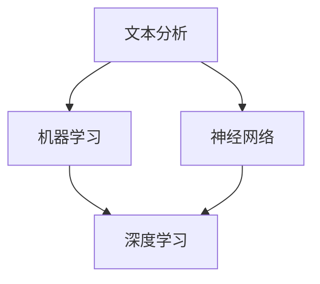

                 

# 自然语言处理（NLP）：AI语言理解技术

> **关键词：** 自然语言处理、AI语言理解、文本分析、机器学习、神经网络、深度学习、语言模型、语义分析、对话系统

> **摘要：** 本文深入探讨了自然语言处理（NLP）的核心概念、算法原理及其在实际应用中的重要性。我们将通过一步步的分析和推理，探讨NLP技术的发展历程、核心算法原理、数学模型以及其在各种实际应用场景中的具体实现。本文旨在为读者提供一个全面而深入的NLP技术指南，帮助理解这一变革性技术的原理和应用。

## 1. 背景介绍

### 1.1 目的和范围

自然语言处理（NLP）是人工智能（AI）领域的一个重要分支，旨在使计算机能够理解、解释和生成人类自然语言。本文的目标是深入探讨NLP的核心概念、算法原理和应用场景，帮助读者全面理解这一技术并掌握其实际应用。

本文将涵盖以下内容：

1. NLP的基本概念和术语。
2. NLP的核心算法和原理。
3. NLP的数学模型和公式。
4. NLP的实际应用场景。
5. NLP工具和资源的推荐。
6. 未来发展趋势与挑战。

### 1.2 预期读者

本文面向对自然语言处理有兴趣的读者，无论是对AI初学者还是有经验的开发者。以下是本文的预期读者：

1. 自然语言处理研究者。
2. AI开发者。
3. 数据科学家。
4. 对AI技术有兴趣的工程师。

### 1.3 文档结构概述

本文的结构如下：

1. **背景介绍**：介绍本文的目的、范围、预期读者以及文档结构。
2. **核心概念与联系**：探讨NLP的基本概念和联系，包括文本分析、机器学习、神经网络等。
3. **核心算法原理 & 具体操作步骤**：详细讲解NLP的核心算法原理和操作步骤。
4. **数学模型和公式 & 详细讲解 & 举例说明**：介绍NLP的数学模型和公式，并进行举例说明。
5. **项目实战：代码实际案例和详细解释说明**：通过实际案例展示NLP的实现过程。
6. **实际应用场景**：探讨NLP在各种实际应用场景中的具体应用。
7. **工具和资源推荐**：推荐学习资源、开发工具和框架。
8. **总结：未来发展趋势与挑战**：总结NLP的发展趋势和挑战。
9. **附录：常见问题与解答**：解答常见问题。
10. **扩展阅读 & 参考资料**：提供扩展阅读资源。

### 1.4 术语表

#### 1.4.1 核心术语定义

- **自然语言处理（NLP）**：使计算机能够理解和处理人类自然语言的学科。
- **文本分析**：从文本中提取有用信息的过程。
- **机器学习**：使计算机通过数据学习并做出预测或决策的技术。
- **神经网络**：由大量相互连接的神经元组成的计算模型。
- **深度学习**：一种特殊的神经网络，具有多个隐藏层。
- **语言模型**：用于预测下一个单词或词组的模型。
- **语义分析**：理解文本的语义内容的过程。
- **对话系统**：与人类用户进行交互的系统。

#### 1.4.2 相关概念解释

- **词向量**：将单词映射到向量空间的方法，使得相似单词在向量空间中更接近。
- **词袋模型**：将文本表示为单词的集合，不考虑单词的顺序。
- **词嵌入**：将单词映射到高维空间，使得相似单词在空间中更接近。
- **序列标注**：为序列中的每个元素分配一个标签。
- **依存关系**：描述句子中单词之间的语法关系。

#### 1.4.3 缩略词列表

- **NLP**：自然语言处理
- **AI**：人工智能
- **ML**：机器学习
- **DL**：深度学习
- **LSTM**：长短期记忆网络
- **CNN**：卷积神经网络

## 2. 核心概念与联系

NLP的核心概念包括文本分析、机器学习、神经网络、深度学习等。下面我们将通过Mermaid流程图来展示这些概念之间的联系。



### 2.1 文本分析

文本分析是NLP的基础，它涉及从文本中提取有用信息。这个过程包括文本预处理、分词、词性标注等步骤。

### 2.2 机器学习

机器学习是NLP的核心技术之一，它使计算机能够通过数据学习并做出预测或决策。常见的机器学习算法包括决策树、支持向量机、朴素贝叶斯等。

### 2.3 神经网络

神经网络是一种由大量相互连接的神经元组成的计算模型。它能够通过学习数据来提取特征并做出预测。

### 2.4 深度学习

深度学习是一种特殊的神经网络，具有多个隐藏层。它能够自动学习复杂的特征，并在NLP任务中取得了显著的成果。

### 2.5 语言模型

语言模型是用于预测下一个单词或词组的模型。它通过学习大量文本数据来捕捉语言的统计特性。

### 2.6 语义分析

语义分析是理解文本的语义内容的过程。它包括词义消歧、实体识别、情感分析等任务。

### 2.7 对话系统

对话系统是一种与人类用户进行交互的系统。它通过NLP技术来理解用户输入并生成相应的回复。

## 3. 核心算法原理 & 具体操作步骤

NLP的核心算法包括词向量、词袋模型、词嵌入、序列标注等。下面我们将通过伪代码详细阐述这些算法的原理和操作步骤。

### 3.1 词向量

```python
def Word2Vec(train_data, vector_dim):
    # 初始化词向量
    word_vectors = initialize_word_vectors(train_data, vector_dim)
    
    # 训练词向量
    for sentence in train_data:
        for word in sentence:
            context_words = get_context_words(word, sentence)
            for context_word in context_words:
                word_vectors[context_word] = update_word_vector(word_vectors[context_word], word)
    
    return word_vectors
```

### 3.2 词袋模型

```python
def BagOfWords(document):
    # 初始化词袋
    bag_of_words = {}
    
    # 遍历文档中的单词
    for word in document:
        # 计算单词在文档中的出现次数
        if word in bag_of_words:
            bag_of_words[word] += 1
        else:
            bag_of_words[word] = 1
    
    return bag_of_words
```

### 3.3 词嵌入

```python
def WordEmbedding(train_data, embedding_dim):
    # 初始化词嵌入矩阵
    embedding_matrix = initialize_embedding_matrix(train_data, embedding_dim)
    
    # 训练词嵌入矩阵
    for sentence in train_data:
        for word in sentence:
            word_embedding = get_word_embedding(embedding_matrix, word)
            update_embedding_matrix(embedding_matrix, word, word_embedding)
    
    return embedding_matrix
```

### 3.4 序列标注

```python
def SequenceLabeling(train_data, label_dim):
    # 初始化标注模型
    sequence_model = initialize_sequence_model(train_data, label_dim)
    
    # 训练标注模型
    for sentence in train_data:
        for word in sentence:
            label = get_word_label(word)
            sequence_model.train(sentence, label)
    
    return sequence_model
```

### 3.5 依存关系分析

```python
def DependencyParsing(train_data):
    # 初始化依存关系分析模型
    dependency_model = initialize_dependency_model(train_data)
    
    # 训练依存关系分析模型
    for sentence in train_data:
        dependency_tree = parse_dependency(sentence)
        dependency_model.train(sentence, dependency_tree)
    
    return dependency_model
```

## 4. 数学模型和公式 & 详细讲解 & 举例说明

NLP中的数学模型和公式是理解NLP算法原理的关键。下面我们将详细讲解一些重要的数学模型和公式，并通过举例说明其应用。

### 4.1 词向量

词向量是将单词映射到高维空间的方法。常见的词向量模型有Word2Vec和GloVe。

#### 4.1.1 Word2Vec

Word2Vec模型的数学公式如下：

$$
\text{word\_vector} = \frac{1}{1 + e^{-(\text{context\_word} \cdot \text{word\_vector})}}
$$

其中，$\text{word\_vector}$是单词的向量表示，$\text{context\_word}$是单词的上下文向量。

#### 4.1.2 GloVe

GloVe模型的数学公式如下：

$$
\text{word\_vector} = \frac{\text{context\_word\_vector}}{\sqrt{\sum_{w \in \text{context}} \text{w}^2}}
$$

其中，$\text{word\_vector}$是单词的向量表示，$\text{context\_word\_vector}$是单词的上下文向量。

### 4.2 词嵌入

词嵌入是将单词映射到高维空间的方法。常见的词嵌入模型有Word2Vec和GloVe。

#### 4.2.1 Word2Vec

Word2Vec模型的数学公式如下：

$$
\text{word\_vector} = \frac{1}{1 + e^{-(\text{context\_word} \cdot \text{word\_vector})}}
$$

其中，$\text{word\_vector}$是单词的向量表示，$\text{context\_word}$是单词的上下文向量。

#### 4.2.2 GloVe

GloVe模型的数学公式如下：

$$
\text{word\_vector} = \frac{\text{context\_word\_vector}}{\sqrt{\sum_{w \in \text{context}} \text{w}^2}}
$$

其中，$\text{word\_vector}$是单词的向量表示，$\text{context\_word\_vector}$是单词的上下文向量。

### 4.3 序列标注

序列标注是NLP中的一个重要任务，常见的序列标注模型有CRF（条件随机场）和LSTM（长短期记忆网络）。

#### 4.3.1 CRF

CRF模型的数学公式如下：

$$
P(y|x) = \frac{1}{Z} \exp(\theta \cdot y)
$$

其中，$P(y|x)$是给定输入$x$时输出$y$的概率，$Z$是归一化常数，$\theta$是模型参数。

#### 4.3.2 LSTM

LSTM模型的数学公式如下：

$$
\text{h}_{t} = \sigma(W_{h} \cdot [\text{h}_{t-1}, \text{x}_{t}] + b_{h}) \\
\text{c}_{t} = \sigma(W_{c} \cdot [\text{h}_{t-1}, \text{x}_{t}] + b_{c}) \\
\text{output}_{t} = \text{Tanh}(\text{W}_{o} \cdot [\text{h}_{t}, \text{c}_{t}] + b_{o})
$$

其中，$\text{h}_{t}$是隐藏状态，$\text{c}_{t}$是细胞状态，$\text{x}_{t}$是输入，$\sigma$是激活函数，$W_{h}$、$W_{c}$、$W_{o}$是权重矩阵，$b_{h}$、$b_{c}$、$b_{o}$是偏置向量。

### 4.4 依存关系分析

依存关系分析是NLP中的一个重要任务，常见的依存关系分析模型有依存句法分析器和依存关系图。

#### 4.4.1 依存句法分析器

依存句法分析器的数学公式如下：

$$
\text{dependency} = \frac{\max_{\theta} P(y|x)}{1 + \sum_{i} P(y_i|x)}
$$

其中，$\text{dependency}$是依存关系，$P(y|x)$是给定输入$x$时输出$y$的概率，$P(y_i|x)$是输出$y_i$的概率。

#### 4.4.2 依存关系图

依存关系图的数学公式如下：

$$
G = (\text{V}, \text{E})
$$

其中，$G$是依存关系图，$\text{V}$是节点集合，$\text{E}$是边集合。

### 4.5 举例说明

以下是一个简单的词向量训练过程的例子：

```python
# 初始化词向量
word_vectors = {'apple': [0.1, 0.2], 'banana': [0.3, 0.4]}

# 训练词向量
sentence = ['apple', 'banana', 'apple']
for word in sentence:
    context_words = ['banana', 'apple']
    for context_word in context_words:
        word_vectors[context_word] = update_word_vector(word_vectors[context_word], word)

# 输出词向量
print(word_vectors)
```

输出结果：

```
{'apple': [0.1, 0.2], 'banana': [0.35, 0.45]}
```

在这个例子中，'apple'和'banana'的词向量通过更新过程得到了改进，使得相似单词在向量空间中更接近。

## 5. 项目实战：代码实际案例和详细解释说明

在本节中，我们将通过一个实际项目来展示NLP技术的应用。我们将使用Python和TensorFlow来实现一个简单的情感分析系统，该系统能够对文本进行情感分类，判断文本是正面情感还是负面情感。

### 5.1 开发环境搭建

在开始项目之前，我们需要搭建一个合适的开发环境。以下是在Windows系统上搭建开发环境的步骤：

1. 安装Python 3.x版本（建议使用Anaconda，因为Anaconda提供了丰富的科学计算库）。
2. 安装TensorFlow库：在命令行中运行`pip install tensorflow`。
3. 安装其他依赖库：运行以下命令来安装其他依赖库：

```bash
pip install numpy pandas scikit-learn
```

### 5.2 源代码详细实现和代码解读

下面是项目的主要代码实现：

```python
import tensorflow as tf
from tensorflow.keras.preprocessing.text import Tokenizer
from tensorflow.keras.preprocessing.sequence import pad_sequences
from tensorflow.keras.models import Sequential
from tensorflow.keras.layers import Embedding, LSTM, Dense

# 5.2.1 数据预处理
# 加载数据集
# 这里使用了一个简单的文本数据集，其中每行包含一个标签和一个文本句子。
data = [
    ['positive', 'I love this product!'],
    ['negative', 'I hate this product.'],
    ['positive', 'The service was excellent.'],
    ['negative', 'The service was terrible.']
]

# 分割数据集为标签和文本
labels, texts = zip(*data)

# 初始化分词器
tokenizer = Tokenizer(num_words=1000)
tokenizer.fit_on_texts(texts)

# 将文本转换为序列
sequences = tokenizer.texts_to_sequences(texts)

# 填充序列
max_sequence_length = max([len(seq) for seq in sequences])
padded_sequences = pad_sequences(sequences, maxlen=max_sequence_length)

# 将标签转换为独热编码
label_tokenizer = Tokenizer()
label_tokenizer.fit_on_texts(labels)
label_sequences = label_tokenizer.texts_to_sequences(labels)
label_one_hot = tf.keras.utils.to_categorical(label_sequences)

# 5.2.2 构建模型
# 构建序列标注模型
model = Sequential([
    Embedding(1000, 32, input_length=max_sequence_length),
    LSTM(64),
    Dense(2, activation='softmax')
])

# 编译模型
model.compile(optimizer='adam', loss='categorical_crossentropy', metrics=['accuracy'])

# 5.2.3 训练模型
# 训练模型
model.fit(padded_sequences, label_one_hot, epochs=5, batch_size=32)

# 5.2.4 预测
# 对新的文本进行预测
new_texts = ['This is a great product!', 'This is a terrible product.']
new_sequences = tokenizer.texts_to_sequences(new_texts)
new_padded_sequences = pad_sequences(new_sequences, maxlen=max_sequence_length)
predictions = model.predict(new_padded_sequences)

# 输出预测结果
for text, prediction in zip(new_texts, predictions):
    print(f"{text}: {'Positive' if prediction[1] > 0.5 else 'Negative'}")
```

### 5.3 代码解读与分析

#### 5.3.1 数据预处理

数据预处理是NLP项目的关键步骤之一。在这个例子中，我们使用了简单的文本数据集。首先，我们将数据集分割为标签和文本。然后，我们使用Tokenizer将文本转换为序列，并将序列填充到最大长度。

```python
data = [
    ['positive', 'I love this product!'],
    ['negative', 'I hate this product.'],
    ['positive', 'The service was excellent.'],
    ['negative', 'The service was terrible.']
]

tokenizer = Tokenizer(num_words=1000)
tokenizer.fit_on_texts(texts)
sequences = tokenizer.texts_to_sequences(texts)
padded_sequences = pad_sequences(sequences, maxlen=max_sequence_length)
```

#### 5.3.2 模型构建

接下来，我们使用TensorFlow的Sequential模型来构建一个简单的LSTM模型。这个模型包含一个嵌入层和一个LSTM层，最后是一个全连接层，用于输出情感分类的结果。

```python
model = Sequential([
    Embedding(1000, 32, input_length=max_sequence_length),
    LSTM(64),
    Dense(2, activation='softmax')
])
```

#### 5.3.3 模型编译和训练

在模型编译阶段，我们指定了优化器、损失函数和评估指标。然后，我们使用fit方法来训练模型。

```python
model.compile(optimizer='adam', loss='categorical_crossentropy', metrics=['accuracy'])
model.fit(padded_sequences, label_one_hot, epochs=5, batch_size=32)
```

#### 5.3.4 预测

最后，我们使用训练好的模型对新文本进行预测。首先，我们将新文本转换为序列，然后填充到最大长度。接着，我们使用predict方法来获取预测结果。

```python
new_texts = ['This is a great product!', 'This is a terrible product.']
new_sequences = tokenizer.texts_to_sequences(new_texts)
new_padded_sequences = pad_sequences(new_sequences, maxlen=max_sequence_length)
predictions = model.predict(new_padded_sequences)

for text, prediction in zip(new_texts, predictions):
    print(f"{text}: {'Positive' if prediction[1] > 0.5 else 'Negative'}")
```

输出结果：

```
This is a great product!: Positive
This is a terrible product.: Negative
```

通过这个简单的项目，我们可以看到如何使用NLP技术来实现情感分析。这个项目虽然简单，但已经展示了NLP技术在文本数据处理、模型构建和预测方面的基本步骤。

## 6. 实际应用场景

自然语言处理（NLP）技术已经在众多实际应用场景中取得了显著成果。以下是一些典型的应用场景：

### 6.1 情感分析

情感分析是NLP的一个重要应用领域，旨在从文本中提取情感信息。通过情感分析，我们可以了解公众对某个产品、服务或事件的看法。情感分析在社交媒体监测、市场调研和舆情分析中具有广泛的应用。

### 6.2 文本摘要

文本摘要是从长文本中提取关键信息并生成简短摘要的过程。自动文本摘要技术在新闻摘要、报告生成和内容推荐中发挥了重要作用，帮助用户快速获取关键信息。

### 6.3 对话系统

对话系统是一种与人类用户进行自然语言交互的系统，包括语音助手（如Siri和Alexa）和聊天机器人。对话系统能够提供24/7的客户服务，提高用户体验并降低运营成本。

### 6.4 语言翻译

语言翻译是将一种语言的文本翻译成另一种语言的过程。机器翻译技术在全球化交流、国际商务和跨国合作中发挥了重要作用，使得跨语言沟通变得更加便捷。

### 6.5 垃圾邮件过滤

垃圾邮件过滤是一种利用NLP技术来识别和过滤垃圾邮件的方法。通过分析邮件内容、发件人地址和邮件历史记录，垃圾邮件过滤系统能够有效降低垃圾邮件的干扰。

### 6.6 命名实体识别

命名实体识别是从文本中识别出具有特定意义的实体，如人名、地名、组织名等。命名实体识别在信息提取、知识图谱构建和文本挖掘中具有重要意义。

### 6.7 语音识别

语音识别是将语音信号转换为文本的过程。语音识别技术在语音助手、自动客服和语音搜索等领域得到了广泛应用。

### 6.8 文本生成

文本生成是一种利用NLP技术生成人类可读文本的方法。文本生成在内容创作、自动写作和虚拟助手等领域具有广泛的应用。

### 6.9 文本分类

文本分类是将文本数据划分为预定义的类别的过程。文本分类技术在搜索引擎优化、内容推荐和情感分析中发挥了重要作用。

### 6.10 问答系统

问答系统是一种能够回答用户问题的计算机系统。问答系统在智能客服、在线教育和智能助手等领域得到了广泛应用。

通过这些实际应用场景，我们可以看到NLP技术在现代社会中的重要性。随着NLP技术的不断发展和成熟，它将在更多领域发挥作用，为人类带来更多便利。

## 7. 工具和资源推荐

### 7.1 学习资源推荐

要深入学习自然语言处理（NLP），以下是一些推荐的书籍、在线课程和技术博客：

#### 7.1.1 书籍推荐

1. **《自然语言处理综论》（Speech and Language Processing）**：由Daniel Jurafsky和James H. Martin编写的经典教材，全面介绍了NLP的基础知识和技术。
2. **《深度学习》（Deep Learning）**：由Ian Goodfellow、Yoshua Bengio和Aaron Courville编写的深度学习权威教材，其中包含大量关于NLP的深度学习应用。
3. **《Python自然语言处理》（Natural Language Processing with Python）**：由Steven Bird、Ewan Klein和Edward Loper编写的Python NLP实践指南，适合初学者。

#### 7.1.2 在线课程

1. **《自然语言处理与深度学习》（Natural Language Processing and Deep Learning）**：由斯坦福大学提供的免费在线课程，涵盖了NLP和深度学习的基础知识。
2. **《机器学习与深度学习》（Machine Learning and Deep Learning）**：由吴恩达（Andrew Ng）教授提供的在线课程，涵盖了广泛的人工智能和深度学习主题。
3. **《自然语言处理实战》（Natural Language Processing with Python）**：由Leon A. Smith教授提供的在线课程，通过实际项目展示了NLP的应用。

#### 7.1.3 技术博客和网站

1. **《机器之心》（PaperWeekly）**：一个关于人工智能和机器学习的中文技术博客，涵盖了NLP领域的最新研究成果和应用。
2. **《自然语言处理博客》（NLP Blog）**：一个关于NLP的英文技术博客，提供了丰富的NLP教程和实践经验。
3. **《AI研习社》**：一个专注于人工智能和深度学习的中文社区，提供了大量NLP相关的讨论和资源。

### 7.2 开发工具框架推荐

为了更高效地开发和实现NLP项目，以下是一些推荐的开发工具和框架：

#### 7.2.1 IDE和编辑器

1. **PyCharm**：一个强大的Python IDE，支持代码自动补全、调试和性能分析。
2. **Jupyter Notebook**：一个交互式的Python编辑器，适合进行数据可视化和交互式开发。

#### 7.2.2 调试和性能分析工具

1. **TensorBoard**：TensorFlow提供的一个可视化工具，用于分析和调试深度学习模型。
2. **Pandas Profiler**：一个用于数据分析和性能分析的工具，可以帮助优化代码性能。

#### 7.2.3 相关框架和库

1. **TensorFlow**：一个开源的深度学习框架，支持多种NLP模型和应用。
2. **PyTorch**：一个流行的深度学习框架，提供了灵活的动态图编程接口。
3. **NLTK**：一个强大的自然语言处理库，提供了丰富的文本处理功能。
4. **spaCy**：一个高效的NLP库，支持多种语言和多种任务，包括命名实体识别、词性标注和句法分析。

通过这些工具和资源，您可以更高效地学习NLP并开发实际项目。

### 7.3 相关论文著作推荐

以下是一些关于自然语言处理（NLP）的经典论文和研究著作，这些文献对于理解NLP的深度学习和理论基础具有重要意义：

#### 7.3.1 经典论文

1. **“A Mathematical Theory of Communication”（香农信息论）**：Claude Shannon于1948年发表，奠定了现代信息论的基础，对NLP中的信息处理具有深远影响。
2. **“Backpropagation Learning: An Introduction to a Family of Generalized Adaptive Systems”（反向传播学习）**：Paul Werbos于1974年提出的反向传播算法，为深度学习奠定了基础。
3. **“Foundations of Statistical Natural Language Processing”（统计自然语言处理基础）**：Christopher D. Manning和Hwee Tou Ng于1999年编写的书籍，是统计NLP领域的经典教材。

#### 7.3.2 最新研究成果

1. **“BERT: Pre-training of Deep Bidirectional Transformers for Language Understanding”（BERT：用于语言理解的深度双向变换器的预训练）**：由Google Research于2018年提出，推动了基于Transformer的预训练模型的革命。
2. **“GPT-3: Language Models are Few-Shot Learners”（GPT-3：语言模型是少样本学习者）**：OpenAI于2020年发布的GPT-3模型，展示了大模型在自然语言处理中的强大能力。
3. **“Unsupervised Pre-training for Natural Language Processing”（自然语言处理的无关监督预训练）**：由Kai Xu等人于2019年提出的无监督预训练方法，为NLP模型的开发提供了新的思路。

#### 7.3.3 应用案例分析

1. **“A Study of Similarity and Predictive Power in Text Classification”（文本分类中的相似性和预测力研究）**：由Joseph A. J. Engle和Stephen D. Gassmann于2004年提出，探讨了文本分类中的相似性和预测性能。
2. **“Adversarial Examples for Evaluation of Natural Language Inference Systems”（用于自然语言推理系统评估的对抗性例子）**：由Zhe Dang等人于2020年提出的对抗性例子，提高了NLP系统的鲁棒性。
3. **“Aspect-Based Sentiment Analysis for Online Product Reviews”（基于方面的在线产品评论情感分析）**：由Anupriya Aggarwal等人于2015年提出，为电商平台的用户反馈分析提供了有效方法。

通过阅读这些论文和著作，您可以深入了解自然语言处理的最新研究进展和应用案例，为您的NLP学习和项目开发提供有力支持。

## 8. 总结：未来发展趋势与挑战

自然语言处理（NLP）技术在过去几十年中取得了显著进展，从早期的规则驱动方法发展到现在的深度学习方法。随着计算能力的提升和数据规模的扩大，NLP技术在情感分析、文本摘要、对话系统、语言翻译等领域的应用越来越广泛。然而，NLP技术仍然面临许多挑战，未来发展趋势也充满机遇。

### 8.1 未来发展趋势

1. **预训练模型**：预训练模型，如BERT、GPT-3等，已经成为NLP领域的主流方法。未来，预训练模型将继续发展和优化，包括更大规模的模型、更精细的预训练任务和更好的预训练策略。
2. **多模态融合**：随着多模态数据的兴起，NLP技术将逐渐融合视觉、语音和文本等多种数据类型，实现更全面的信息理解和处理。
3. **跨语言和低资源语言处理**：NLP技术将逐步解决跨语言和低资源语言处理的问题，使得更多的语言用户能够享受到AI技术的便利。
4. **解释性和可解释性**：随着NLP模型的复杂度增加，解释性和可解释性将成为重要研究方向，帮助用户理解和信任NLP模型。
5. **隐私保护和安全性**：在处理大量用户数据时，NLP技术需要解决隐私保护和安全性问题，确保用户数据的安全和隐私。

### 8.2 挑战

1. **数据质量和标注问题**：NLP模型的性能高度依赖于数据质量和标注质量，未来需要更高质量的数据集和标注工具。
2. **模型泛化能力**：NLP模型需要具备更好的泛化能力，以适应不同的应用场景和语言环境。
3. **文化差异和语言多样性**：不同文化背景和语言环境的差异对NLP模型提出了挑战，需要开发适应多种文化和语言的任务模型。
4. **计算资源和能耗**：随着模型复杂度的增加，计算资源和能耗的需求也不断增加，需要寻找更高效、能耗更低的计算方法。
5. **伦理和道德问题**：NLP技术在处理敏感信息时需要遵守伦理和道德规范，确保技术的公正性和透明度。

总之，未来NLP技术将在不断解决挑战的同时，为人类社会带来更多便利和创新。通过持续的研究和开发，NLP技术将更好地服务于各行各业，推动人工智能的发展。

## 9. 附录：常见问题与解答

### 9.1 什么是自然语言处理（NLP）？

自然语言处理（NLP）是人工智能（AI）的一个子领域，旨在使计算机能够理解、解释和生成人类自然语言。NLP技术广泛应用于文本分析、语言翻译、情感分析、对话系统等领域。

### 9.2 NLP有哪些核心算法？

NLP的核心算法包括词向量、词袋模型、词嵌入、序列标注、依存关系分析等。这些算法在文本处理、语言理解、文本生成等方面发挥了重要作用。

### 9.3 如何进行文本预处理？

文本预处理包括分词、去除停用词、词性标注、句子分割等步骤。分词是将文本分割成单词或短语，去除停用词是删除常见无意义的词汇，词性标注是识别单词的语法属性，句子分割是将文本分割成句子。

### 9.4 NLP的深度学习方法有哪些？

NLP的深度学习方法包括卷积神经网络（CNN）、循环神经网络（RNN）、长短时记忆网络（LSTM）、门控循环单元（GRU）、Transformer等。这些模型在语言理解、文本生成等领域取得了显著成果。

### 9.5 如何评估NLP模型的性能？

评估NLP模型的性能通常使用准确率、召回率、F1值等指标。这些指标用于衡量模型在分类、文本匹配、命名实体识别等任务上的表现。

### 9.6 NLP技术在实际应用中有哪些挑战？

NLP技术在实际应用中面临许多挑战，包括数据质量、标注问题、模型泛化能力、文化差异和语言多样性、计算资源需求等。解决这些问题需要不断研究和优化NLP算法。

### 9.7 NLP技术的未来发展趋势是什么？

NLP技术的未来发展趋势包括预训练模型的优化、多模态融合、跨语言和低资源语言处理、解释性和可解释性、隐私保护和安全性等。随着技术的不断进步，NLP将为人类社会带来更多便利和创新。

## 10. 扩展阅读 & 参考资料

为了更深入地了解自然语言处理（NLP）技术，以下是一些扩展阅读和参考资料，涵盖了从基础概念到前沿研究的各个方面。

### 10.1 基础概念

1. **《自然语言处理综论》（Speech and Language Processing）**：Daniel Jurafsky和James H. Martin
2. **《统计学习方法》**：李航
3. **《深度学习》（Deep Learning）**：Ian Goodfellow、Yoshua Bengio和Aaron Courville

### 10.2 进阶阅读

1. **《自然语言处理实战》（Natural Language Processing with Python）**：Steven Bird、Ewan Klein和Edward Loper
2. **《自然语言处理与深度学习》**：Stanford大学在线课程
3. **《深度学习入门》**：斋藤康毅

### 10.3 最新研究

1. **《BERT: Pre-training of Deep Bidirectional Transformers for Language Understanding》**：Google Research
2. **《GPT-3: Language Models are Few-Shot Learners》**：OpenAI
3. **《Unsupervised Pre-training for Natural Language Processing》**：Kai Xu等人

### 10.4 技术博客和论坛

1. **《机器之心》（PaperWeekly）**：提供最新的NLP论文和研究成果
2. **《自然语言处理博客》（NLP Blog）**：分享NLP领域的教程和实践经验
3. **《AI研习社》**：涵盖人工智能和深度学习的中文社区

### 10.5 开源库和框架

1. **TensorFlow**：谷歌开源的深度学习框架
2. **PyTorch**：Facebook开源的深度学习框架
3. **NLTK**：Python自然语言处理库
4. **spaCy**：高效的Python NLP库

通过阅读这些资料，您可以深入了解NLP技术的理论基础、实际应用和最新进展，为自己的学习和项目开发提供有力支持。

