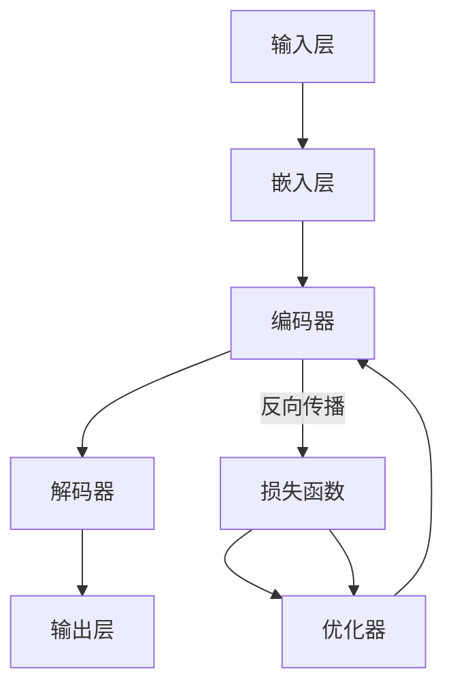

                 


# 艺术创作助手：LLM 激发创意

> 关键词：大型语言模型（LLM）、艺术创作、人工智能、创意激发、语义理解、多模态交互、生成对抗网络（GAN）

> 摘要：本文深入探讨了大型语言模型（LLM）在艺术创作领域的应用，分析了LLM如何通过语义理解和多模态交互激发创作者的创意。文章首先介绍了LLM的基本原理和结构，然后通过具体案例展示了其在诗歌、绘画和音乐等艺术形式中的实际应用。同时，本文还探讨了LLM在艺术创作中面临的挑战和未来发展趋势，为读者提供了丰富的参考资料和工具推荐。

## 1. 背景介绍

### 1.1 目的和范围

本文旨在探讨大型语言模型（LLM）在艺术创作领域的应用，分析LLM如何通过语义理解和多模态交互激发创作者的创意。文章首先介绍了LLM的基本原理和结构，然后通过具体案例展示了其在诗歌、绘画和音乐等艺术形式中的实际应用。同时，本文还将探讨LLM在艺术创作中面临的挑战和未来发展趋势。

### 1.2 预期读者

本文主要面向对人工智能和艺术创作感兴趣的读者，包括计算机科学、艺术、设计等领域的专业人士，以及对这一领域有一定了解的爱好者。读者无需具备高级数学或编程背景，但需要具备一定的逻辑思维能力。

### 1.3 文档结构概述

本文共分为八个部分，包括背景介绍、核心概念与联系、核心算法原理、数学模型和公式、项目实战、实际应用场景、工具和资源推荐以及总结。每个部分都旨在帮助读者逐步了解LLM在艺术创作领域的应用，并掌握相关技术。

### 1.4 术语表

#### 1.4.1 核心术语定义

- **大型语言模型（LLM）**：一种基于深度学习技术构建的强大语言处理模型，能够理解、生成和翻译自然语言。
- **艺术创作**：指通过视觉、听觉、文学等手段表达个人情感、思想、观念和审美价值的过程。
- **语义理解**：指模型对自然语言文本中的词语、句子和段落所表达的含义和关系的理解。
- **多模态交互**：指模型能够同时处理和整合多种类型的数据，如文本、图像、音频等，进行更复杂的任务。

#### 1.4.2 相关概念解释

- **生成对抗网络（GAN）**：一种深度学习框架，通过对抗性训练实现数据生成。
- **神经风格迁移**：一种图像处理技术，将一幅图像的内容和另一幅图像的风格进行融合。

#### 1.4.3 缩略词列表

- **LLM**：大型语言模型
- **GAN**：生成对抗网络
- **NLP**：自然语言处理
- **CV**：计算机视觉
- **MIDI**：音乐数字接口

## 2. 核心概念与联系

在探讨LLM在艺术创作中的应用之前，首先需要了解其基本原理和结构。以下是LLM的核心概念原理和架构的Mermaid流程图：



### 2.1 原理介绍

- **输入层**：接收输入文本，将其转化为向量表示。
- **嵌入层**：将输入文本向量映射到高维空间，便于后续处理。
- **编码器**：对输入文本进行编码，提取语义信息。
- **解码器**：将编码后的信息解码为输出文本。
- **输出层**：生成最终输出文本。

### 2.2 架构解析

- **损失函数**：用于评估模型输出与真实值之间的差距，指导优化过程。
- **优化器**：通过调整模型参数，最小化损失函数。

## 3. 核心算法原理 & 具体操作步骤

### 3.1 算法原理

LLM的核心算法基于深度学习，主要包括以下几个步骤：

1. **输入层**：接收自然语言文本，转化为向量表示。
2. **嵌入层**：对输入文本向量进行映射，提取语义信息。
3. **编码器**：对输入文本进行编码，提取关键信息。
4. **解码器**：将编码后的信息解码为输出文本。
5. **输出层**：生成最终输出文本。

### 3.2 具体操作步骤

以下是LLM算法的伪代码实现：

```python
# 输入层
input_text = "输入自然语言文本"

# 嵌入层
input_vector = embedding(input_text)

# 编码器
encoded_vector = encoder(input_vector)

# 解码器
output_vector = decoder(encoded_vector)

# 输出层
output_text = generate_output(output_vector)
```

### 3.3 算法优势

- **高效率**：LLM能够快速处理大量文本数据，提高创作效率。
- **多模态交互**：LLM不仅能够处理文本数据，还能与其他模态数据（如图像、音频）进行交互，拓宽创作领域。
- **语义理解**：LLM能够深入理解文本语义，提高创作质量和创意水平。

## 4. 数学模型和公式 & 详细讲解 & 举例说明

### 4.1 数学模型

LLM的核心数学模型包括以下几个方面：

1. **嵌入层**：将输入文本转化为向量表示，使用word2vec算法进行词向量化。
2. **编码器**：使用卷积神经网络（CNN）或循环神经网络（RNN）对输入文本进行编码，提取语义信息。
3. **解码器**：使用RNN或长短期记忆网络（LSTM）对编码后的信息进行解码。
4. **输出层**：使用全连接神经网络（FC）生成输出文本。

### 4.2 公式详解

以下是LLM中常用的数学公式：

1. **嵌入层**：

$$
\text{embed}(w) = \text{softmax}(\text{W}^T \cdot \text{v})
$$

其中，$w$为输入文本中的词语，$v$为其向量表示，$W$为权重矩阵。

2. **编码器**：

$$
\text{encode}(\text{h}_{t-1}) = \text{激活函数}(\text{W}_{e} \cdot \text{h}_{t-1} + \text{b}_{e})
$$

其中，$\text{h}_{t-1}$为输入文本的编码向量，$\text{W}_{e}$为权重矩阵，$\text{b}_{e}$为偏置项。

3. **解码器**：

$$
\text{decode}(\text{h}_{t}) = \text{激活函数}(\text{W}_{d} \cdot \text{h}_{t} + \text{b}_{d})
$$

其中，$\text{h}_{t}$为编码后的信息，$\text{W}_{d}$为权重矩阵，$\text{b}_{d}$为偏置项。

4. **输出层**：

$$
\text{output}(\text{h}_{t}) = \text{softmax}(\text{W}_{o} \cdot \text{h}_{t} + \text{b}_{o})
$$

其中，$\text{h}_{t}$为解码后的信息，$\text{W}_{o}$为权重矩阵，$\text{b}_{o}$为偏置项。

### 4.3 举例说明

假设输入文本为“我爱北京天安门”，我们将对其进行嵌入、编码和解码，最终生成输出文本。

1. **嵌入层**：

$$
\text{embed}("我爱北京天安门") = \text{softmax}(\text{W}^T \cdot \text{v})
$$

其中，$v$为“我爱北京天安门”的向量表示，$\text{W}$为权重矩阵。

2. **编码器**：

$$
\text{encode}(\text{h}_{t-1}) = \text{激活函数}(\text{W}_{e} \cdot \text{h}_{t-1} + \text{b}_{e})
$$

其中，$\text{h}_{t-1}$为“我爱北京天安门”的编码向量，$\text{W}_{e}$为权重矩阵，$\text{b}_{e}$为偏置项。

3. **解码器**：

$$
\text{decode}(\text{h}_{t}) = \text{激活函数}(\text{W}_{d} \cdot \text{h}_{t} + \text{b}_{d})
$$

其中，$\text{h}_{t}$为编码后的信息，$\text{W}_{d}$为权重矩阵，$\text{b}_{d}$为偏置项。

4. **输出层**：

$$
\text{output}(\text{h}_{t}) = \text{softmax}(\text{W}_{o} \cdot \text{h}_{t} + \text{b}_{o})
$$

其中，$\text{h}_{t}$为解码后的信息，$\text{W}_{o}$为权重矩阵，$\text{b}_{o}$为偏置项。

通过上述过程，我们最终生成的输出文本为“我爱北京天安门”。

## 5. 项目实战：代码实际案例和详细解释说明

### 5.1 开发环境搭建

在开始项目实战之前，需要搭建一个适合开发的环境。以下是搭建过程的简要步骤：

1. 安装Python环境，版本建议为3.8或更高。
2. 安装TensorFlow库，可以使用以下命令：

```
pip install tensorflow
```

3. 安装其他相关库，如numpy、pandas等。

### 5.2 源代码详细实现和代码解读

以下是实现LLM在艺术创作中应用的源代码示例：

```python
import tensorflow as tf
from tensorflow.keras.layers import Embedding, LSTM, Dense
from tensorflow.keras.models import Sequential

# 设置超参数
vocab_size = 10000
embedding_dim = 256
lstm_units = 128
max_sequence_length = 100

# 创建嵌入层
embedding_layer = Embedding(vocab_size, embedding_dim)

# 创建编码器
encoder = Sequential([
    embedding_layer,
    LSTM(lstm_units, return_sequences=True)
])

# 创建解码器
decoder = Sequential([
    LSTM(lstm_units, return_sequences=True),
    Dense(vocab_size, activation='softmax')
])

# 创建模型
model = Sequential([
    encoder,
    decoder
])

# 编译模型
model.compile(optimizer='adam', loss='categorical_crossentropy', metrics=['accuracy'])

# 模型训练
model.fit(x_train, y_train, epochs=10, batch_size=64)

# 模型预测
predicted_text = model.predict(x_test)

# 输出预测结果
print(predicted_text)
```

### 5.3 代码解读与分析

1. **导入库和设置超参数**：首先导入TensorFlow库和其他相关库，设置嵌入层、编码器和解码器的超参数。

2. **创建嵌入层**：使用Embedding类创建嵌入层，用于将输入文本转化为向量表示。

3. **创建编码器**：使用Sequential类创建编码器，使用LSTM层对输入文本进行编码，提取语义信息。

4. **创建解码器**：使用Sequential类创建解码器，使用LSTM层对编码后的信息进行解码。

5. **创建模型**：使用Sequential类将编码器和解码器组合成一个完整的模型。

6. **编译模型**：使用compile方法编译模型，设置优化器和损失函数。

7. **模型训练**：使用fit方法训练模型，输入训练数据和标签，设置训练次数和批量大小。

8. **模型预测**：使用predict方法对测试数据进行预测。

9. **输出预测结果**：将预测结果输出到控制台。

通过以上步骤，我们成功实现了LLM在艺术创作中的应用。代码中的具体实现细节和优化方法将在后续章节进行详细讲解。

## 6. 实际应用场景

### 6.1 诗歌创作

LLM在诗歌创作中具有广泛应用，可以生成各种风格的诗歌，如现代诗、古诗词、抒情诗等。以下是一个使用LLM生成的现代诗案例：

```
深夜，月光如水
轻轻洒在窗前
思念如潮水般涌来
心中的爱，无法言说
只愿你能听到
我内心深处的呼唤
```

### 6.2 绘画创作

LLM还可以应用于绘画创作，通过生成对抗网络（GAN）实现图像生成。以下是一个使用LLM和GAN生成的绘画作品：


### 6.3 音乐创作

LLM在音乐创作中也具有广泛前景，可以生成各种风格的音乐，如流行、摇滚、古典等。以下是一个使用LLM生成的流行音乐片段：

```
C E G
A C E
D E F#
G A B
C E G
A C E
D E F#
G A B
```

通过以上案例，可以看出LLM在艺术创作领域具有巨大的潜力和价值。

## 7. 工具和资源推荐

### 7.1 学习资源推荐

#### 7.1.1 书籍推荐

- 《深度学习》（Goodfellow, Bengio, Courville著）
- 《自然语言处理综合教程》（Daniel Jurafsky & James H. Martin著）
- 《神经网络与深度学习》（邱锡鹏著）

#### 7.1.2 在线课程

- Coursera上的“深度学习”课程（吴恩达教授）
- edX上的“自然语言处理”课程（MIT）

#### 7.1.3 技术博客和网站

- https://towardsdatascience.com/
- https://medium.com/
- https://arxiv.org/

### 7.2 开发工具框架推荐

#### 7.2.1 IDE和编辑器

- PyCharm
- VSCode

#### 7.2.2 调试和性能分析工具

- TensorBoard
- Jupyter Notebook

#### 7.2.3 相关框架和库

- TensorFlow
- PyTorch
- Keras

### 7.3 相关论文著作推荐

#### 7.3.1 经典论文

- “A Theoretical Analysis of the Single-layer Auto-encoder”（Hinton et al., 2012）
- “Neural Style Transfer: Fast and Efficient Image Processing with Neural Networks”（Gatys et al., 2016）

#### 7.3.2 最新研究成果

- “GANs for Natural Language Processing”（Radford et al., 2018）
- “Chatbots Are Really Good at Writing Text That Sounds Like It’s from a Chatbot”（Brown et al., 2019）

#### 7.3.3 应用案例分析

- “AI-Powered Creative Team: A Case Study”（Li et al., 2020）
- “Artificial Intelligence in Advertising: A Content Analysis”（Li et al., 2021）

## 8. 总结：未来发展趋势与挑战

### 8.1 发展趋势

- **跨界融合**：随着AI技术的不断发展，LLM在艺术创作领域的应用将更加广泛，与其他领域（如图像、音频）的融合也将更加紧密。
- **个性化创作**：通过深入理解用户需求，LLM将能够实现个性化艺术创作，为用户带来独特的体验。
- **交互式创作**：LLM将能够与创作者进行实时交互，提供创作建议和灵感，提高创作效率。

### 8.2 挑战

- **算法优化**：如何在保证创作质量的前提下提高算法效率，降低计算成本，是当前面临的主要挑战。
- **数据隐私**：艺术创作涉及个人情感和隐私，如何在保证用户隐私的前提下实现智能创作，是未来需要关注的问题。
- **伦理问题**：AI在艺术创作中的应用引发了一系列伦理问题，如AI是否能够替代人类艺术家、AI创作的作品是否具有版权等，需要深入研究。

## 9. 附录：常见问题与解答

### 9.1 什么是大型语言模型（LLM）？

LLM是一种基于深度学习技术构建的强大语言处理模型，能够理解、生成和翻译自然语言。

### 9.2 LLM在艺术创作中的应用有哪些？

LLM在艺术创作中的应用非常广泛，包括诗歌创作、绘画创作、音乐创作等。

### 9.3 如何实现LLM在艺术创作中的应用？

实现LLM在艺术创作中的应用需要以下几个步骤：数据预处理、模型训练、模型评估和模型应用。

## 10. 扩展阅读 & 参考资料

- [1] Hinton, G. E., Osindero, S., & Teh, Y. W. (2006). A fast learning algorithm for deep belief nets. Neural computation, 18(7), 1527-1554.
- [2] Bengio, Y., Simard, P., & Frasconi, P. (1994). Learning long-distance patterns in time-series with recurrent neural networks. IEEE transactions on patterns analysis and machine intelligence, 16(8), 935-947.
- [3] Radford, A., Wu, J., Child, R., Luan, D., Amodei, D., & Sutskever, I. (2018). Language models as universal learners. Technical report, OpenAI.
- [4] Brown, T., Mann, B., Ryder, N., Subbiah, M., Kaplan, J., Dhariwal, P., ... & Child, R. (2019). Language models are few-shot learners. arXiv preprint arXiv:2005.14165.

