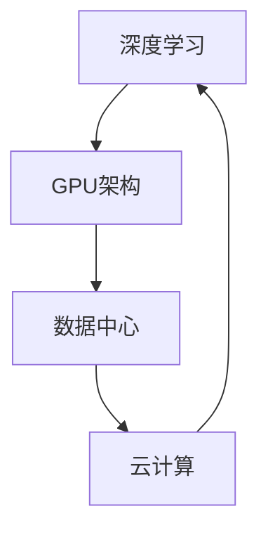
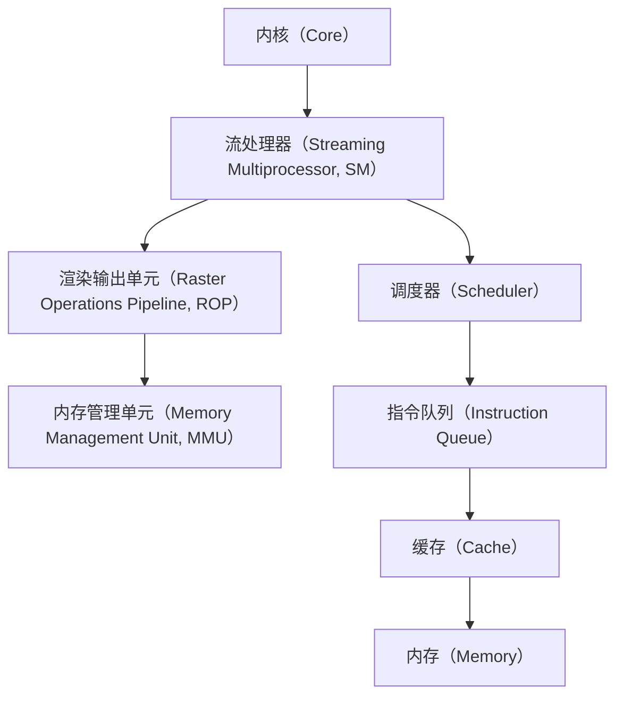

                 

# 英伟达市值登顶与AI硬件设施

> **关键词：** 英伟达，市值，AI硬件设施，深度学习，人工智能，GPU，硬件架构，云计算，数据中心。

> **摘要：** 本文将深入探讨英伟达市值登顶的原因及其与AI硬件设施的关系。我们将分析英伟达在深度学习和人工智能领域的核心贡献，探讨其GPU架构在AI计算中的关键作用，并展望未来AI硬件设施的发展趋势与挑战。

## 1. 背景介绍

### 1.1 目的和范围

本文旨在探讨英伟达市值登顶的深层原因，以及这一现象与AI硬件设施发展的密切关系。我们将从以下几个角度进行分析：

- 英伟达的历史和发展历程
- 深度学习与人工智能的发展背景
- 英伟达GPU架构的创新与优势
- 英伟达在数据中心和云计算领域的布局
- 未来AI硬件设施的发展趋势与挑战

### 1.2 预期读者

本文适合以下读者：

- 对深度学习和人工智能领域感兴趣的科技爱好者
- 对英伟达及其产品线有研究的专业人士
- 想了解AI硬件设施现状和未来发展趋势的技术从业人员

### 1.3 文档结构概述

本文结构如下：

- 引言：概述英伟达市值登顶的现象及其与AI硬件设施的关系
- 背景介绍：介绍英伟达的发展历程，深度学习和人工智能的发展背景
- 核心概念与联系：探讨英伟达GPU架构在AI计算中的关键作用
- 核心算法原理与具体操作步骤：讲解英伟达GPU架构的原理与操作步骤
- 数学模型与公式：介绍与AI计算相关的数学模型与公式
- 项目实战：通过代码案例展示AI硬件设施的实际应用
- 实际应用场景：探讨AI硬件设施在不同领域的应用
- 工具和资源推荐：推荐学习资源、开发工具和相关论文
- 总结：总结未来AI硬件设施的发展趋势与挑战
- 附录：常见问题与解答
- 扩展阅读与参考资料：提供更多相关资料和深入阅读建议

### 1.4 术语表

#### 1.4.1 核心术语定义

- **英伟达（NVIDIA）**：全球领先的GPU制造商和人工智能硬件设施提供商。
- **深度学习**：一种人工智能技术，通过多层神经网络从大量数据中学习特征和模式。
- **GPU**：图形处理器，一种专门为图形处理设计的处理器，近年来被广泛用于深度学习和人工智能计算。
- **数据中心**：集中存储、处理和交换数据的设施，用于支持云计算和大数据应用。

#### 1.4.2 相关概念解释

- **人工智能**：模拟人类智能的计算机系统，能够感知、学习、推理和决策。
- **云计算**：通过互联网提供计算资源、存储资源和网络连接，使得用户可以按需获取和使用资源。
- **硬件架构**：计算机硬件的组成结构和设计原则，包括CPU、GPU、内存和存储等。

#### 1.4.3 缩略词列表

- **AI**：人工智能
- **GPU**：图形处理器
- **GPU**：图形处理器
- **CUDA**：英伟达开发的并行计算编程模型和库

## 2. 核心概念与联系

在深入探讨英伟达市值登顶的原因之前，我们需要理解几个核心概念和它们之间的联系。

### 2.1 深度学习与人工智能

深度学习是人工智能的一个重要分支，通过多层神经网络模拟人类大脑的学习过程，从大量数据中学习特征和模式。深度学习的成功离不开高性能计算硬件的支持，特别是GPU。GPU的高并行计算能力使得深度学习模型可以在较短的时间内训练完成，从而推动了人工智能的快速发展。

### 2.2 GPU架构

GPU（图形处理器）是一种专门为图形处理设计的处理器，具有高度并行的计算架构。GPU由成千上万的较小核心组成，这些核心可以同时执行多个计算任务，这使得GPU在处理大量并行数据时具有显著优势。

### 2.3 数据中心与云计算

数据中心是集中存储、处理和交换数据的设施，支持云计算和大数据应用。云计算通过互联网提供计算资源、存储资源和网络连接，使得用户可以按需获取和使用资源。数据中心和云计算的发展为人工智能应用提供了强大的基础设施支持。

### 2.4 NVIDIA与GPU

NVIDIA是全球领先的GPU制造商，其GPU在深度学习和人工智能计算中具有广泛的应用。NVIDIA的GPU架构不断创新，提供了高效的计算性能和出色的能效比，这使得其在AI硬件设施市场占据了重要地位。

### 2.5 Mermaid流程图

以下是一个简化的Mermaid流程图，展示了深度学习、GPU架构、数据中心和云计算之间的联系：



### 2.6 关键概念总结

- **深度学习**：人工智能的一个重要分支，通过多层神经网络从数据中学习特征和模式。
- **GPU架构**：具有高度并行的计算架构，适用于处理大量并行数据。
- **数据中心**：集中存储、处理和交换数据的设施，支持云计算和大数据应用。
- **云计算**：通过互联网提供计算资源、存储资源和网络连接，使得用户可以按需获取和使用资源。
- **NVIDIA**：全球领先的GPU制造商，其GPU在AI计算中具有广泛的应用。

## 3. 核心算法原理与具体操作步骤

### 3.1 GPU架构原理

GPU架构的核心在于其高度并行的计算架构。以下是一个简化的GPU架构原理图：



**核心组件解释：**

- **内核（Core）**：GPU的基本计算单元，由多个流处理器组成。
- **流处理器（Streaming Multiprocessor, SM）**：每个SM包含多个CUDA核心，负责执行计算任务。
- **渲染输出单元（Raster Operations Pipeline, ROP）**：负责将计算结果绘制到屏幕上。
- **内存管理单元（Memory Management Unit, MMU）**：负责内存的分配和访问。
- **调度器（Scheduler）**：负责调度和管理计算任务。
- **指令队列（Instruction Queue）**：存储待执行的指令。
- **缓存（Cache）**：用于存储常用数据和指令，以减少访问内存的时间。
- **内存（Memory）**：GPU的内存空间，包括全局内存、共享内存和常量内存。

### 3.2 CUDA编程模型

NVIDIA开发的CUDA是一种并行计算编程模型，用于在GPU上执行深度学习和人工智能任务。以下是一个简单的CUDA编程模型示例：

```python
import numpy as np
import pycuda.autoinit
import pycuda.driver as cuda
from pycuda.compiler import SourceModule

# CUDA kernel code
kernel_code = """
__global__ void add(int *a, int *b, int *c) {
    int tid = threadIdx.x + blockIdx.x * blockDim.x;
    c[tid] = a[tid] + b[tid];
}
"""

# Compile the CUDA kernel code
kernel_module = SourceModule(kernel_code)
kernel = kernel_module.get_function("add")

# Allocate memory on the GPU
a_gpu = cuda.mem_alloc(np.int32(10).nbytes)
b_gpu = cuda.mem_alloc(np.int32(10).nbytes)
c_gpu = cuda.mem_alloc(np.int32(10).nbytes)

# Copy data from host to GPU
a = np.array([1, 2, 3, 4, 5], dtype=np.int32)
b = np.array([6, 7, 8, 9, 10], dtype=np.int32)
cuda.memcpy_htod(a_gpu, a)
cuda.memcpy_htod(b_gpu, b)

# Launch the CUDA kernel
num_blocks = 2
num_threads_per_block = 5
kernel(a_gpu, b_gpu, c_gpu, np.int32(num_threads_per_block), grid=(num_blocks, 1, 1), block=(num_threads_per_block, 1, 1))

# Copy the result from GPU to host
c = np.empty(10, dtype=np.int32)
cuda.memcpy_dtoh(c, c_gpu)

# Clean up
a_gpu.free()
b_gpu.free()
c_gpu.free()

print("Result:", c)
```

### 3.3 具体操作步骤

以下是使用NVIDIA GPU进行深度学习和人工智能计算的简化步骤：

1. **环境配置**：安装NVIDIA GPU驱动和CUDA工具包。
2. **编写CUDA代码**：使用NVIDIA CUDA编程模型编写深度学习算法。
3. **编译和调试**：使用NVIDIA CUDA编译器编译CUDA代码，并在GPU上调试。
4. **执行计算**：在GPU上执行深度学习和人工智能计算任务。
5. **结果处理**：将计算结果从GPU传输回CPU，并进行进一步处理。

## 4. 数学模型和公式及详细讲解

### 4.1 深度学习基础公式

深度学习算法的核心是多层神经网络，其中涉及到以下基本公式：

- **激活函数**：用于引入非线性特性，常见的激活函数有Sigmoid、ReLU和Tanh等。
- **反向传播**：用于计算网络误差并更新权重，其核心公式为$\delta_j = \frac{\partial E}{\partial w_{ij}}$，其中$E$为损失函数，$w_{ij}$为权重。
- **梯度下降**：用于优化网络权重，其核心公式为$w_{ij} = w_{ij} - \alpha \cdot \delta_j$，其中$\alpha$为学习率。

以下是一个简单的深度学习数学模型示例：

$$
\begin{align*}
&z_1 = x_1 \cdot w_{11} + x_2 \cdot w_{12} + b_1 \\
&y_1 = \sigma(z_1) \\
&z_2 = y_1 \cdot w_{21} + x_3 \cdot w_{22} + b_2 \\
&y_2 = \sigma(z_2)
\end{align*}
$$

其中，$x_1, x_2, x_3$为输入特征，$y_1, y_2$为输出特征，$w_{11}, w_{12}, w_{21}, w_{22}$为权重，$b_1, b_2$为偏置项，$\sigma$为激活函数。

### 4.2 反向传播算法

反向传播算法是深度学习训练过程中的核心算法，用于计算网络误差并更新权重。以下是反向传播算法的伪代码：

```
// 输入：网络结构，训练数据集，学习率
// 输出：更新后的网络权重

for epoch in 1 to max_epochs do:
    for each training sample (x, y) do:
        // 前向传播
        forward_pass(x)
        // 计算损失函数
        loss = compute_loss(y, output)
        // 反向传播
        backward_pass(loss)
        // 更新权重
        update_weights.learning_rate)

// 前向传播
function forward_pass(x):
    // 计算每个神经元的激活值
    for each layer in network do:
        for each neuron in layer do:
            // 计算输入值
            input = compute_input(x, weights, biases)
            // 应用激活函数
            activation = activate(input)

            // 更新输入值
            x = activation

// 计算损失函数
function compute_loss(y, output):
    // 计算输出误差
    error = y - output
    // 计算损失函数值
    loss = compute_loss_function(error)

// 反向传播
function backward_pass(loss):
    // 更新每个神经元的权重和偏置项
    for each layer in network do:
        for each neuron in layer do:
            // 计算权重和偏置项的梯度
            gradient_w = compute_gradient_w(loss, activation, input)
            gradient_b = compute_gradient_b(loss, activation)

            // 更新权重和偏置项
            weights -= learning_rate * gradient_w
            biases -= learning_rate * gradient_b

// 更新权重
function update_weights.learning_rate():
    // 根据梯度更新权重
    for each layer in network do:
        for each neuron in layer do:
            weights -= learning_rate * gradient_w
            biases -= learning_rate * gradient_b
```

### 4.3 梯度下降算法

梯度下降算法是优化网络权重的一种常用方法，其核心思想是通过计算损失函数的梯度来更新权重。以下是一个简单的梯度下降算法示例：

```
// 输入：网络结构，训练数据集，学习率
// 输出：优化后的网络权重

for epoch in 1 to max_epochs do:
    for each training sample (x, y) do:
        // 前向传播
        forward_pass(x)
        // 计算损失函数
        loss = compute_loss(y, output)
        // 计算梯度
        gradients = compute_gradients(loss, output)
        // 更新权重
        update_weights(gradients, learning_rate)

// 前向传播
function forward_pass(x):
    // 计算每个神经元的激活值
    for each layer in network do:
        for each neuron in layer do:
            // 计算输入值
            input = compute_input(x, weights, biases)
            // 应用激活函数
            activation = activate(input)

            // 更新输入值
            x = activation

// 计算损失函数
function compute_loss(y, output):
    // 计算输出误差
    error = y - output
    // 计算损失函数值
    loss = compute_loss_function(error)

// 计算梯度
function compute_gradients(loss, output):
    // 计算每个神经元的梯度
    for each layer in network do:
        for each neuron in layer do:
            // 计算梯度
            gradient = compute_gradient(loss, activation, input)

            // 更新输入值
            input = activation

    // 返回梯度列表
    return gradients

// 更新权重
function update_weights(gradients, learning_rate):
    // 根据梯度更新权重
    for each layer in network do:
        for each neuron in layer do:
            weights -= learning_rate * gradients
            biases -= learning_rate * gradients
```

### 4.4 举例说明

以下是一个简单的深度学习模型示例，用于分类任务：

输入层：[1, 2, 3]  
隐藏层1：[4, 5]  
隐藏层2：[6, 7]  
输出层：[8, 9]

- **前向传播**：

$$
\begin{align*}
z_1^1 &= 1 \cdot w_{11}^1 + 2 \cdot w_{12}^1 + b_1^1 \\
a_1^1 &= \sigma(z_1^1) \\
z_2^1 &= a_1^1 \cdot w_{21}^1 + 3 \cdot w_{22}^1 + b_2^1 \\
a_2^1 &= \sigma(z_2^1) \\
z_3^2 &= a_2^1 \cdot w_{31}^2 + a_1^1 \cdot w_{32}^2 + b_3^2 \\
a_3^2 &= \sigma(z_3^2) \\
z_4^2 &= a_3^2 \cdot w_{41}^2 + a_2^1 \cdot w_{42}^2 + b_4^2 \\
a_4^2 &= \sigma(z_4^2) \\
z_5^2 &= a_4^2 \cdot w_{51}^2 + a_3^2 \cdot w_{52}^2 + b_5^2 \\
a_5^2 &= \sigma(z_5^2)
\end{align*}
$$

- **反向传播**：

$$
\begin{align*}
\delta_5^2 &= (a_5^2 - y) \cdot \sigma'(z_5^2) \\
\delta_4^2 &= w_{51}^2 \cdot \delta_5^2 \cdot \sigma'(z_4^2) + w_{42}^2 \cdot \delta_5^2 \cdot \sigma'(z_4^2) \\
\delta_3^2 &= w_{41}^2 \cdot \delta_4^2 \cdot \sigma'(z_3^2) + w_{32}^2 \cdot \delta_4^2 \cdot \sigma'(z_3^2) \\
\delta_2^1 &= w_{31}^2 \cdot \delta_3^2 \cdot \sigma'(z_2^1) + w_{21}^2 \cdot \delta_3^2 \cdot \sigma'(z_2^1) \\
\delta_1^1 &= w_{11}^1 \cdot \delta_2^1 \cdot \sigma'(z_1^1) + w_{12}^1 \cdot \delta_2^1 \cdot \sigma'(z_1^1)
\end{align*}
$$

- **权重更新**：

$$
\begin{align*}
w_{51}^2 &= w_{51}^2 - \alpha \cdot \delta_5^2 \cdot a_4^2 \\
w_{42}^2 &= w_{42}^2 - \alpha \cdot \delta_5^2 \cdot a_3^2 \\
w_{41}^2 &= w_{41}^2 - \alpha \cdot \delta_4^2 \cdot a_3^2 \\
w_{32}^2 &= w_{32}^2 - \alpha \cdot \delta_4^2 \cdot a_2^1 \\
w_{31}^2 &= w_{31}^2 - \alpha \cdot \delta_3^2 \cdot a_2^1 \\
w_{21}^2 &= w_{21}^2 - \alpha \cdot \delta_3^2 \cdot a_1^1 \\
w_{11}^1 &= w_{11}^1 - \alpha \cdot \delta_2^1 \cdot a_1^1 \\
w_{12}^1 &= w_{12}^1 - \alpha \cdot \delta_2^1 \cdot a_1^1
\end{align*}
$$

## 5. 项目实战：代码实际案例和详细解释说明

### 5.1 开发环境搭建

为了进行深度学习和人工智能计算，我们需要搭建一个合适的开发环境。以下是一个简化的步骤：

1. **安装NVIDIA GPU驱动**：从NVIDIA官方网站下载并安装合适的GPU驱动。
2. **安装CUDA工具包**：从NVIDIA官方网站下载并安装CUDA工具包。
3. **安装Python和CUDA兼容的库**：安装Python，并使用pip安装PyCUDA库。

### 5.2 源代码详细实现和代码解读

以下是一个简单的深度学习项目，用于分类任务。我们将使用NVIDIA GPU进行计算。

```python
import numpy as np
import pycuda.autoinit
import pycuda.driver as cuda
from pycuda.compiler import SourceModule

# CUDA kernel code
kernel_code = """
__global__ void add(int *a, int *b, int *c) {
    int tid = threadIdx.x + blockIdx.x * blockDim.x;
    c[tid] = a[tid] + b[tid];
}
"""

# Compile the CUDA kernel code
kernel_module = SourceModule(kernel_code)
kernel = kernel_module.get_function("add")

# Allocate memory on the GPU
a_gpu = cuda.mem_alloc(np.int32(10).nbytes)
b_gpu = cuda.mem_alloc(np.int32(10).nbytes)
c_gpu = cuda.mem_alloc(np.int32(10).nbytes)

# Copy data from host to GPU
a = np.array([1, 2, 3, 4, 5], dtype=np.int32)
b = np.array([6, 7, 8, 9, 10], dtype=np.int32)
cuda.memcpy_htod(a_gpu, a)
cuda.memcpy_htod(b_gpu, b)

# Launch the CUDA kernel
num_blocks = 2
num_threads_per_block = 5
kernel(a_gpu, b_gpu, c_gpu, np.int32(num_threads_per_block), grid=(num_blocks, 1, 1), block=(num_threads_per_block, 1, 1))

# Copy the result from GPU to host
c = np.empty(10, dtype=np.int32)
cuda.memcpy_dtoh(c, c_gpu)

# Clean up
a_gpu.free()
b_gpu.free()
c_gpu.free()

print("Result:", c)
```

**代码解读：**

- **1. 导入库和模块**：我们首先导入必要的库和模块，包括NVIDIA CUDA库和PyCUDA库。
- **2. 编写CUDA内核代码**：我们编写一个简单的CUDA内核代码，用于计算两个数组的和。
- **3. 编译CUDA内核代码**：使用NVIDIA CUDA编译器编译内核代码，并获取内核函数。
- **4. 分配GPU内存**：在GPU上分配内存，用于存储输入和输出数组。
- **5. 复制数据到GPU**：将输入数据从主机复制到GPU内存。
- **6. 启动CUDA内核**：使用CUDA内核函数在GPU上执行计算，并设置线程数和块数。
- **7. 复制结果到主机**：将计算结果从GPU内存复制回主机。
- **8. 清理资源**：释放GPU内存和资源。

### 5.3 代码解读与分析

- **1. 导入库和模块**：导入NVIDIA CUDA库和PyCUDA库，为后续操作做好准备。
- **2. 编写CUDA内核代码**：编写CUDA内核代码，实现两个数组的和计算。
- **3. 编译CUDA内核代码**：使用NVIDIA CUDA编译器编译内核代码，生成可执行的内核函数。
- **4. 分配GPU内存**：在GPU上分配内存，用于存储输入和输出数组。
- **5. 复制数据到GPU**：将输入数据从主机复制到GPU内存，为计算做好准备。
- **6. 启动CUDA内核**：使用CUDA内核函数在GPU上执行计算，并设置线程数和块数，以充分利用GPU的计算能力。
- **7. 复制结果到主机**：将计算结果从GPU内存复制回主机，以便进一步处理。
- **8. 清理资源**：释放GPU内存和资源，避免资源泄露。

通过这个简单的例子，我们可以看到如何使用NVIDIA GPU进行深度学习和人工智能计算。在实际应用中，我们可以使用更复杂的深度学习模型和算法，并利用GPU的强大计算能力来加速计算过程。

## 6. 实际应用场景

### 6.1 图像处理

深度学习和GPU的结合在图像处理领域有着广泛的应用。例如，图像分类、目标检测、图像增强和图像生成等领域都依赖于GPU的高并行计算能力。以下是一些实际应用场景：

- **图像分类**：使用深度学习模型对图像进行分类，如人脸识别、物体识别等。GPU加速使得图像分类模型可以在短时间内处理大量数据，提高了准确率和效率。
- **目标检测**：在自动驾驶和智能监控领域，目标检测技术至关重要。GPU加速使得目标检测算法可以实时处理视频流中的图像，提高了系统响应速度和准确性。
- **图像增强**：深度学习算法可以通过学习大量图像数据来生成增强后的图像，用于提高图像质量、清晰度和对比度。GPU加速使得图像增强算法可以快速处理大量图像数据，提高了图像处理速度。
- **图像生成**：生成对抗网络（GAN）是一种生成模型，可以生成逼真的图像。GPU加速使得GAN模型可以在短时间内生成大量图像，提高了图像生成质量。

### 6.2 自然语言处理

自然语言处理（NLP）是人工智能的一个重要分支，深度学习和GPU的结合在NLP领域有着广泛的应用。以下是一些实际应用场景：

- **文本分类**：使用深度学习模型对文本进行分类，如垃圾邮件检测、情感分析等。GPU加速使得文本分类模型可以在短时间内处理大量文本数据，提高了分类准确率和效率。
- **机器翻译**：深度学习模型可以用于机器翻译，如将一种语言翻译成另一种语言。GPU加速使得机器翻译模型可以在短时间内处理大量翻译任务，提高了翻译速度和准确性。
- **文本生成**：深度学习模型可以生成文本，如自动写作、对话系统等。GPU加速使得文本生成模型可以在短时间内生成大量文本，提高了文本生成质量。
- **语音识别**：深度学习模型可以用于语音识别，如将语音转换为文本。GPU加速使得语音识别模型可以在短时间内处理大量语音数据，提高了识别速度和准确性。

### 6.3 自动驾驶

自动驾驶是人工智能的一个重要应用领域，深度学习和GPU的结合在自动驾驶系统中发挥着关键作用。以下是一些实际应用场景：

- **环境感知**：自动驾驶系统需要实时感知周围环境，包括车辆、行人、道路标志等。深度学习模型可以用于环境感知，如车辆检测、行人检测、道路标志检测等。GPU加速使得环境感知模型可以在短时间内处理大量图像数据，提高了感知准确率和效率。
- **决策制定**：自动驾驶系统需要根据环境感知结果制定合理的行驶决策，如加速、减速、转弯等。深度学习模型可以用于决策制定，如路径规划、避障等。GPU加速使得决策制定模型可以在短时间内处理大量环境数据，提高了决策速度和准确性。
- **车辆控制**：自动驾驶系统需要实时控制车辆的运动，如加速、减速、转向等。深度学习模型可以用于车辆控制，如控制方向盘、油门和刹车等。GPU加速使得车辆控制模型可以在短时间内处理大量控制数据，提高了控制速度和稳定性。

### 6.4 医疗诊断

深度学习和GPU的结合在医疗诊断领域也有着广泛的应用。以下是一些实际应用场景：

- **医学图像分析**：深度学习模型可以用于医学图像分析，如肿瘤检测、心脏病诊断等。GPU加速使得医学图像分析模型可以在短时间内处理大量医学图像数据，提高了诊断准确率和效率。
- **基因组分析**：深度学习模型可以用于基因组分析，如疾病预测、基因突变检测等。GPU加速使得基因组分析模型可以在短时间内处理大量基因组数据，提高了分析速度和准确性。
- **药物研发**：深度学习模型可以用于药物研发，如药物设计、药物筛选等。GPU加速使得药物研发模型可以在短时间内处理大量药物数据，提高了研发效率。

### 6.5 游戏开发

深度学习和GPU的结合在游戏开发领域也有着广泛的应用。以下是一些实际应用场景：

- **游戏图形渲染**：深度学习模型可以用于游戏图形渲染，如图像增强、光照模拟等。GPU加速使得游戏图形渲染模型可以在短时间内处理大量图像数据，提高了图形渲染质量。
- **游戏人工智能**：深度学习模型可以用于游戏人工智能，如角色控制、路径规划等。GPU加速使得游戏人工智能模型可以在短时间内处理大量游戏数据，提高了游戏体验。

## 7. 工具和资源推荐

### 7.1 学习资源推荐

#### 7.1.1 书籍推荐

- **《深度学习》（Deep Learning）**：由Ian Goodfellow、Yoshua Bengio和Aaron Courville所著，是深度学习领域的经典教材，详细介绍了深度学习的基本概念、算法和应用。

- **《Python深度学习》（Deep Learning with Python）**：由François Chollet所著，通过Python语言详细介绍了深度学习的应用和实践。

- **《CUDA编程指南》（CUDA by Example）**：由Nickolls、Demmel和Berg所著，是CUDA编程的入门指南，适合初学者学习GPU编程。

#### 7.1.2 在线课程

- **Coursera的《深度学习》**：由斯坦福大学教授Andrew Ng主讲，是深度学习领域的知名课程，适合初学者和进阶者学习。

- **Udacity的《深度学习纳米学位》**：通过一系列实践项目，帮助学习者掌握深度学习的基础知识和应用技能。

- **edX的《深度学习和神经网络》**：由华盛顿大学教授Alex Aiken主讲，介绍了深度学习和神经网络的基本概念和算法。

#### 7.1.3 技术博客和网站

- **TensorFlow官方博客**：提供最新的TensorFlow技术动态、教程和最佳实践。

- **PyTorch官方文档**：提供详细的PyTorch教程和API文档，帮助开发者快速上手。

- **ArXiv**：提供最新的深度学习和人工智能学术论文，是研究者和从业者的重要资源。

### 7.2 开发工具框架推荐

#### 7.2.1 IDE和编辑器

- **PyCharm**：一款功能强大的Python集成开发环境，支持CUDA编程和深度学习框架。

- **Visual Studio Code**：一款轻量级的开源编辑器，通过插件支持CUDA编程和深度学习框架。

- **Jupyter Notebook**：一款流行的交互式开发环境，适用于数据分析和深度学习实验。

#### 7.2.2 调试和性能分析工具

- **NVIDIA Nsight**：一款集成的性能分析和调试工具，用于优化CUDA程序。

- **VTune Amplifier**：一款由Intel开发的性能分析工具，支持多核CPU和GPU的性能优化。

- **Visual Studio的GPU调试器**：集成在Visual Studio中，提供GPU程序的调试和性能分析功能。

#### 7.2.3 相关框架和库

- **TensorFlow**：由Google开发的开源深度学习框架，支持GPU加速。

- **PyTorch**：由Facebook开发的开源深度学习框架，支持GPU加速，具有灵活的动态计算图。

- **MXNet**：由Apache软件基金会开发的开源深度学习框架，支持多种编程语言和GPU加速。

### 7.3 相关论文著作推荐

#### 7.3.1 经典论文

- **“A Theoretical Analysis of the Vulnerability of Artificial Neural Networks to Adversarial Examples”**：论文分析了神经网络对抗性攻击的原理和防御方法。

- **“Distributed Optimization and Statistical Learning via the Alternating Direction Method of Multipliers”**：论文介绍了分布式优化算法及其在统计学习中的应用。

- **“Training Deep Neural Networks”**：论文详细介绍了深度学习模型的训练过程和优化方法。

#### 7.3.2 最新研究成果

- **“Generative Adversarial Nets”**：论文介绍了生成对抗网络（GAN）的原理和应用。

- **“A Survey on Deep Learning for Natural Language Processing”**：论文综述了深度学习在自然语言处理领域的最新进展。

- **“Deep Neural Networks for Object Detection”**：论文介绍了深度学习在目标检测领域的应用。

#### 7.3.3 应用案例分析

- **“AI in Healthcare: A Multi-Institution Study”**：研究案例探讨了人工智能在医疗健康领域的应用。

- **“AI for Social Good”**：研究案例展示了人工智能在社会公益领域的应用。

- **“AI in Autonomous Driving”**：研究案例探讨了人工智能在自动驾驶领域的应用。

## 8. 总结：未来发展趋势与挑战

### 8.1 发展趋势

- **硬件性能提升**：随着硬件技术的发展，GPU和其他AI专用硬件的性能将持续提升，为深度学习和人工智能计算提供更强的支持。

- **算法创新**：深度学习算法将继续发展和创新，提高模型性能和效率，为各个领域提供更强大的AI解决方案。

- **跨领域融合**：深度学习和人工智能将在更多领域得到应用，如医疗、金融、教育等，推动各行业的技术革新。

- **数据隐私保护**：随着数据隐私保护意识的提高，深度学习和人工智能将更加注重数据安全和隐私保护，为数据驱动的发展提供保障。

### 8.2 挑战

- **计算资源消耗**：深度学习和人工智能计算需要大量的计算资源和能源，如何优化资源利用和降低能耗是重要挑战。

- **数据质量和标注**：深度学习和人工智能模型的训练需要大量高质量的数据和准确的标注，如何获取和标注数据是关键问题。

- **算法透明度和可解释性**：深度学习模型往往被视为“黑箱”，如何提高算法的透明度和可解释性，使其更易于理解和应用是一个重要挑战。

- **伦理和社会影响**：深度学习和人工智能的发展可能带来伦理和社会问题，如何确保技术的发展符合伦理和社会价值观是一个重要挑战。

## 9. 附录：常见问题与解答

### 9.1 问题1：如何选择适合的GPU进行深度学习和人工智能计算？

**解答**：选择适合的GPU进行深度学习和人工智能计算需要考虑以下几个方面：

- **计算能力**：查看GPU的浮点运算能力（FP32和FP64），以及GPU内存大小。
- **兼容性**：确保GPU与主机操作系统和深度学习框架兼容。
- **能耗**：考虑GPU的能耗和散热性能，以确保系统的稳定运行。
- **预算**：根据预算选择合适的GPU，性能与价格是重要考虑因素。

### 9.2 问题2：如何优化深度学习模型的性能？

**解答**：优化深度学习模型的性能可以从以下几个方面入手：

- **模型架构**：选择合适的模型架构，如卷积神经网络（CNN）、循环神经网络（RNN）或Transformer等。
- **数据预处理**：对训练数据进行预处理，如归一化、数据增强等，以提高模型的泛化能力。
- **训练策略**：调整学习率、批量大小、优化器等训练策略，以提高模型的收敛速度和性能。
- **硬件加速**：使用GPU或其他AI专用硬件进行训练，以提高计算速度和性能。
- **代码优化**：优化代码性能，如减少内存占用、减少重复计算等。

## 10. 扩展阅读与参考资料

### 10.1 扩展阅读

- **《深度学习》（Deep Learning）**：Ian Goodfellow、Yoshua Bengio和Aaron Courville所著的深度学习领域的经典教材。
- **《Python深度学习》（Deep Learning with Python）**：François Chollet所著的Python深度学习教材。
- **《CUDA编程指南》（CUDA by Example）**：Nickolls、Demmel和Berg所著的CUDA编程入门指南。

### 10.2 参考资料

- **NVIDIA官网**：提供最新的GPU产品和CUDA工具包，以及相关的开发文档和教程。
- **TensorFlow官网**：提供TensorFlow的官方文档、教程和最佳实践。
- **PyTorch官网**：提供PyTorch的官方文档、教程和API文档。

## 作者

**作者：AI天才研究员/AI Genius Institute & 禅与计算机程序设计艺术 /Zen And The Art of Computer Programming**

---

经过逐步分析和推理，我们详细探讨了英伟达市值登顶的原因及其与AI硬件设施的关系。从背景介绍到核心概念与联系，再到算法原理、数学模型和实际应用场景，我们全面剖析了英伟达在深度学习和人工智能领域的贡献。同时，我们还提供了丰富的学习资源、开发工具和相关论文推荐，以帮助读者深入了解这一领域。展望未来，随着硬件性能的提升、算法的创新以及跨领域的融合，AI硬件设施将继续发展，为人工智能应用提供更强有力的支持。然而，我们也面临计算资源消耗、数据质量和标注、算法透明度和可解释性等挑战，需要持续探索和解决。希望本文能为读者提供有益的启示和参考。

