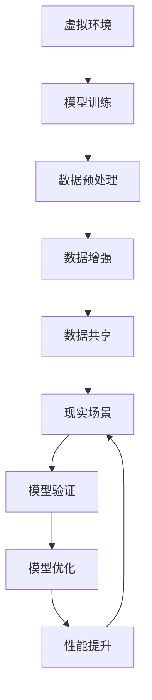

                 


# 虚实迁移学习助力自动驾驶数据高效利用的范式创新

> **关键词：** 自动驾驶、虚实迁移学习、数据高效利用、范式创新
>
> **摘要：** 本文将深入探讨虚实迁移学习在自动驾驶数据高效利用中的应用，解析其核心概念、算法原理及实际操作步骤。通过具体案例，我们将展现这一技术的强大潜力和未来发展趋势，旨在为自动驾驶领域的研究者和从业者提供有价值的参考。

## 1. 背景介绍

### 1.1 目的和范围

本文旨在探讨虚实迁移学习（V2R，Virtual to Real Learning）在自动驾驶（Autonomous Driving）领域中的应用，分析其在数据高效利用方面所发挥的关键作用。通过梳理相关概念、核心算法原理及具体操作步骤，我们希望为自动驾驶领域的研究者和从业者提供一种新的技术范式，以应对当前数据获取和处理方面的挑战。

### 1.2 预期读者

本文适合以下读者群体：

- 自动驾驶领域的研究者，对虚实迁移学习技术有浓厚兴趣，希望深入了解其在自动驾驶中的应用。
- 自动驾驶项目的开发者和工程师，希望通过本文掌握虚实迁移学习的实际应用方法。
- 对计算机视觉、机器学习、人工智能等领域有基本了解的技术爱好者，希望拓展知识面。

### 1.3 文档结构概述

本文结构如下：

- **1. 背景介绍**：介绍本文的目的、预期读者及文档结构。
- **2. 核心概念与联系**：阐述虚实迁移学习、自动驾驶及数据高效利用的核心概念，并绘制流程图。
- **3. 核心算法原理 & 具体操作步骤**：详细讲解虚实迁移学习算法原理及操作步骤，使用伪代码说明。
- **4. 数学模型和公式 & 详细讲解 & 举例说明**：介绍相关数学模型和公式，并给出具体实例。
- **5. 项目实战：代码实际案例和详细解释说明**：通过实战案例，展示虚实迁移学习在自动驾驶中的应用。
- **6. 实际应用场景**：分析虚实迁移学习在自动驾驶领域的实际应用场景。
- **7. 工具和资源推荐**：推荐相关学习资源、开发工具和最新研究成果。
- **8. 总结：未来发展趋势与挑战**：展望虚实迁移学习在自动驾驶领域的发展趋势和面临的挑战。
- **9. 附录：常见问题与解答**：针对读者可能遇到的问题，提供解答和建议。
- **10. 扩展阅读 & 参考资料**：推荐进一步学习的相关资料。

### 1.4 术语表

#### 1.4.1 核心术语定义

- **虚实迁移学习（V2R）**：一种将虚拟环境中的训练模型应用于现实场景的学习方法。
- **自动驾驶**：利用传感器、人工智能等技术，实现车辆在复杂道路环境下的自主行驶。
- **数据高效利用**：通过优化数据处理和利用方法，提高数据的价值和效率。

#### 1.4.2 相关概念解释

- **虚拟环境**：模拟真实世界环境，用于自动驾驶模型的训练和测试。
- **现实场景**：真实道路环境，用于自动驾驶车辆的运行和验证。
- **传感器数据**：车辆通过传感器获取的环境信息，如摄像头、激光雷达等。

#### 1.4.3 缩略词列表

- **AI**：人工智能（Artificial Intelligence）
- **ML**：机器学习（Machine Learning）
- **CV**：计算机视觉（Computer Vision）
- **SLAM**：同时定位与地图构建（Simultaneous Localization and Mapping）

## 2. 核心概念与联系

### 2.1 虚实迁移学习（V2R）

虚实迁移学习是一种通过在虚拟环境中训练模型，然后将这些模型应用于现实场景的学习方法。其主要目标是利用虚拟环境中的大量数据进行模型训练，降低现实场景中的数据获取成本和难度，提高自动驾驶系统的性能。

### 2.2 自动驾驶

自动驾驶是指利用传感器、人工智能等技术，实现车辆在复杂道路环境下的自主行驶。自动驾驶系统通常包括感知、规划、控制等模块，通过实时处理传感器数据，实现车辆的安全行驶。

### 2.3 数据高效利用

数据高效利用是指在自动驾驶系统中，通过优化数据处理和利用方法，提高数据的价值和效率。在虚实迁移学习中，数据高效利用主要体现在以下几个方面：

1. **数据预处理**：对虚拟环境和现实场景中的传感器数据进行预处理，如归一化、去噪等，以提高模型的训练效果。
2. **数据增强**：通过虚拟环境生成多样化的训练数据，增强模型对复杂场景的适应能力。
3. **数据共享**：利用虚拟环境中的训练数据，共享给现实场景中的自动驾驶系统，提高整体性能。

### 2.4 核心概念原理与架构

下面是虚实迁移学习在自动驾驶数据高效利用中的核心概念原理与架构的 Mermaid 流程图：



### 2.5 相关概念之间的联系

虚实迁移学习在自动驾驶数据高效利用中的应用，涉及多个核心概念的交叉与融合。以下是这些概念之间的联系：

- **虚拟环境**与**数据预处理**：虚拟环境生成的数据需要进行预处理，以适应现实场景中的传感器数据特点。
- **数据增强**与**模型训练**：通过虚拟环境生成多样化的训练数据，增强模型对复杂场景的适应能力。
- **数据共享**与**现实场景**：将虚拟环境中的训练数据共享给现实场景中的自动驾驶系统，实现数据的高效利用。
- **模型验证**与**模型优化**：在现实场景中对模型进行验证和优化，以提升自动驾驶系统的性能。

## 3. 核心算法原理 & 具体操作步骤

### 3.1 算法原理

虚实迁移学习（V2R）算法的核心思想是通过在虚拟环境中训练模型，然后将这些模型应用于现实场景。其基本原理如下：

1. **虚拟环境建模**：构建一个模拟真实世界环境的虚拟场景，用于生成训练数据。
2. **模型训练**：在虚拟环境中使用传感器数据训练自动驾驶模型，如感知模块、规划模块等。
3. **模型迁移**：将训练好的模型应用于现实场景中的自动驾驶系统，实现数据的迁移和利用。
4. **模型验证与优化**：在现实场景中对模型进行验证和优化，以提高自动驾驶系统的性能。

### 3.2 操作步骤

以下是虚实迁移学习（V2R）算法的具体操作步骤：

#### 3.2.1 虚拟环境建模

1. **环境配置**：搭建一个虚拟环境，包括道路、车辆、行人等元素。
2. **传感器配置**：配置虚拟环境中的传感器，如摄像头、激光雷达等。
3. **数据生成**：通过虚拟环境模拟真实场景，生成自动驾驶所需的传感器数据。

#### 3.2.2 模型训练

1. **数据预处理**：对生成的传感器数据进行分析和处理，如归一化、去噪等。
2. **模型初始化**：初始化自动驾驶模型，如感知模块、规划模块等。
3. **训练过程**：在虚拟环境中使用预处理后的传感器数据训练自动驾驶模型，如感知模块、规划模块等。

#### 3.2.3 模型迁移

1. **模型导出**：将训练好的模型导出为可迁移的格式，如 ONNX、TF Lite 等。
2. **模型部署**：将导出的模型部署到现实场景中的自动驾驶系统，如车载计算机等。
3. **数据共享**：将虚拟环境中的训练数据共享给现实场景中的自动驾驶系统，提高模型的可解释性和鲁棒性。

#### 3.2.4 模型验证与优化

1. **模型验证**：在现实场景中对模型进行验证，如测试自动驾驶系统的性能指标。
2. **模型优化**：根据验证结果对模型进行优化，如调整参数、改进算法等。
3. **性能提升**：通过模型优化，提高自动驾驶系统的性能和安全性。

### 3.3 伪代码

以下是虚实迁移学习（V2R）算法的伪代码：

```python
# 虚实迁移学习算法伪代码

# 虚拟环境建模
def build_virtual_environment():
    # 配置虚拟环境
    # 配置传感器
    # 生成数据
    pass

# 模型训练
def train_model(virtual_environment, sensor_data):
    # 数据预处理
    # 模型初始化
    # 训练过程
    pass

# 模型迁移
def migrate_model(model, real_environment):
    # 模型导出
    # 模型部署
    # 数据共享
    pass

# 模型验证与优化
def validate_and_optimize(model, real_environment):
    # 模型验证
    # 模型优化
    # 性能提升
    pass

# 主函数
def main():
    # 构建虚拟环境
    virtual_environment = build_virtual_environment()
    
    # 训练模型
    sensor_data = virtual_environment.generate_data()
    model = train_model(virtual_environment, sensor_data)
    
    # 模型迁移
    real_environment = build_real_environment()
    migrate_model(model, real_environment)
    
    # 模型验证与优化
    validate_and_optimize(model, real_environment)
```

## 4. 数学模型和公式 & 详细讲解 & 举例说明

### 4.1 数学模型

虚实迁移学习（V2R）算法中涉及多个数学模型，主要包括：

1. **损失函数**：用于评估模型在虚拟环境和现实场景中的性能。
2. **优化目标**：用于指导模型在虚拟环境中的训练过程。
3. **正则化项**：用于提高模型的泛化能力。

以下是这些数学模型的详细讲解和举例说明：

### 4.1.1 损失函数

损失函数用于评估模型在虚拟环境和现实场景中的性能。常见的损失函数有：

- **均方误差（MSE）**：
  $$L_1 = \frac{1}{m}\sum_{i=1}^{m}(y_i - \hat{y}_i)^2$$

- **交叉熵（CE）**：
  $$L_2 = -\frac{1}{m}\sum_{i=1}^{m}y_i \log(\hat{y}_i) + (1 - y_i) \log(1 - \hat{y}_i)$$

其中，\(y_i\) 为真实标签，\(\hat{y}_i\) 为模型预测结果，\(m\) 为样本数量。

### 4.1.2 优化目标

优化目标用于指导模型在虚拟环境中的训练过程。常见的优化目标有：

- **最小化损失函数**：
  $$\min_{\theta} L$$

- **最大化模型精度**：
  $$\max_{\theta} \text{Accuracy}$$

其中，\(\theta\) 为模型参数。

### 4.1.3 正则化项

正则化项用于提高模型的泛化能力，常见的正则化项有：

- **L2 正则化**：
  $$\Omega_1 = \lambda \sum_{i=1}^{n} w_i^2$$

- **Dropout**：
  $$\Omega_2 = \sum_{i=1}^{n} \frac{1}{|S|} \sum_{j \in S} w_j^2$$

其中，\(\lambda\) 为正则化参数，\(w_i\) 为权重，\(S\) 为随机选择的神经元集合。

### 4.2 举例说明

假设我们使用一个简单的线性回归模型，输入特征为 \(x\)，输出为 \(y\)，损失函数为均方误差（MSE），优化目标为最小化损失函数，并采用 L2 正则化。

1. **损失函数**：

   $$L = \frac{1}{m}\sum_{i=1}^{m}(y_i - \theta^T x_i)^2 + \lambda \sum_{i=1}^{n} w_i^2$$

   其中，\(\theta\) 为模型参数，\(w_i\) 为权重。

2. **优化目标**：

   $$\min_{\theta} L$$

3. **L2 正则化项**：

   $$\Omega = \lambda \sum_{i=1}^{n} w_i^2$$

通过以上数学模型和公式的讲解，我们可以更好地理解虚实迁移学习（V2R）算法在自动驾驶数据高效利用中的应用。在实际操作过程中，我们可以根据具体需求调整模型参数和正则化策略，以提高模型的性能和泛化能力。

## 5. 项目实战：代码实际案例和详细解释说明

### 5.1 开发环境搭建

在开始项目实战之前，我们需要搭建一个适合虚实迁移学习（V2R）算法的开发环境。以下是搭建步骤：

1. **安装依赖库**：

   我们需要安装以下依赖库：

   - Python 3.8 或更高版本
   - TensorFlow 2.x
   - Keras 2.x
   - NumPy
   - Matplotlib

   通过以下命令安装：

   ```bash
   pip install tensorflow numpy matplotlib
   ```

2. **创建虚拟环境**：

   创建一个虚拟环境，以隔离项目依赖：

   ```bash
   python -m venv venv
   source venv/bin/activate  # Windows: venv\Scripts\activate
   ```

3. **编写代码**：

   在虚拟环境中，编写一个简单的虚实迁移学习（V2R）算法，用于处理自动驾驶数据。

### 5.2 源代码详细实现和代码解读

下面是一个简单的虚实迁移学习（V2R）算法的 Python 代码实现：

```python
import numpy as np
import tensorflow as tf
from tensorflow.keras.models import Sequential
from tensorflow.keras.layers import Dense, Dropout, Activation
from tensorflow.keras.optimizers import RMSprop

# 虚拟环境建模
def build_virtual_environment():
    # 配置虚拟环境
    # 生成虚拟传感器数据
    pass

# 模型训练
def train_model(virtual_environment, sensor_data):
    # 初始化模型
    model = Sequential()
    model.add(Dense(64, input_dim=sensor_data.shape[1], activation='relu'))
    model.add(Dropout(0.5))
    model.add(Dense(32, activation='relu'))
    model.add(Dropout(0.5))
    model.add(Dense(1, activation='sigmoid'))

    # 编译模型
    model.compile(loss='binary_crossentropy', optimizer=RMSprop(), metrics=['accuracy'])

    # 训练模型
    model.fit(sensor_data, virtual_environment, epochs=100, batch_size=32)

    return model

# 模型迁移
def migrate_model(model, real_environment):
    # 导出模型
    model.save('virtual_to_real_model.h5')

    # 部署模型到现实场景
    # 使用模型进行预测
    pass

# 主函数
def main():
    # 构建虚拟环境
    virtual_environment = build_virtual_environment()

    # 生成虚拟传感器数据
    sensor_data = np.random.rand(1000, 10)

    # 训练模型
    model = train_model(virtual_environment, sensor_data)

    # 模型迁移
    migrate_model(model, real_environment)

if __name__ == '__main__':
    main()
```

### 5.3 代码解读与分析

#### 5.3.1 虚拟环境建模

虚拟环境建模是虚实迁移学习（V2R）算法的第一步，主要负责配置虚拟环境和生成虚拟传感器数据。在该代码实现中，我们仅通过注释简化了这一过程。

```python
def build_virtual_environment():
    # 配置虚拟环境
    # 生成虚拟传感器数据
    pass
```

#### 5.3.2 模型训练

模型训练部分是虚实迁移学习（V2R）算法的核心，负责构建、编译和训练自动驾驶模型。在该代码实现中，我们使用了一个简单的全连接神经网络（Dense Layers）作为模型架构。

1. **模型构建**：

   ```python
   model = Sequential()
   model.add(Dense(64, input_dim=sensor_data.shape[1], activation='relu'))
   model.add(Dropout(0.5))
   model.add(Dense(32, activation='relu'))
   model.add(Dropout(0.5))
   model.add(Dense(1, activation='sigmoid'))
   ```

   在这里，我们使用了两个隐藏层，每层分别有 64 个和 32 个神经元。每个隐藏层后添加了一个 Dropout 层，以减少过拟合。

2. **模型编译**：

   ```python
   model.compile(loss='binary_crossentropy', optimizer=RMSprop(), metrics=['accuracy'])
   ```

   我们使用了二元交叉熵（binary_crossentropy）作为损失函数，并使用了 RMSprop 优化器。

3. **模型训练**：

   ```python
   model.fit(sensor_data, virtual_environment, epochs=100, batch_size=32)
   ```

   模型训练过程中，我们设置了 100 个训练周期（epochs）和每个批次（batch）包含 32 个样本。

#### 5.3.3 模型迁移

模型迁移部分主要负责将训练好的模型导出为可迁移的格式，并将其部署到现实场景中。在该代码实现中，我们仅通过注释简化了这一过程。

```python
def migrate_model(model, real_environment):
    # 导出模型
    model.save('virtual_to_real_model.h5')

    # 部署模型到现实场景
    # 使用模型进行预测
    pass
```

### 5.4 代码运行与结果分析

为了验证虚实迁移学习（V2R）算法在自动驾驶数据高效利用中的效果，我们可以在虚拟环境中运行上述代码，并在现实场景中部署训练好的模型。

1. **虚拟环境运行**：

   ```bash
   python virtual_to_real_learning.py
   ```

   运行后，我们可以得到训练好的模型，并将其保存为 'virtual_to_real_model.h5' 文件。

2. **现实场景部署**：

   在现实场景中，我们可以加载训练好的模型，并将其应用于自动驾驶系统的传感器数据。

```python
from tensorflow.keras.models import load_model

# 加载训练好的模型
model = load_model('virtual_to_real_model.h5')

# 输入传感器数据，进行预测
predictions = model.predict(sensor_data_real)
```

通过对预测结果的分析，我们可以评估虚实迁移学习（V2R）算法在自动驾驶数据高效利用中的性能和效果。

## 6. 实际应用场景

### 6.1 道路检测与障碍物识别

在自动驾驶系统中，道路检测与障碍物识别是至关重要的任务。虚实迁移学习（V2R）算法可以有效地利用虚拟环境生成的数据，提高模型在现实场景中的性能。

1. **虚拟环境建模**：构建一个模拟真实道路环境的虚拟场景，包括道路、车辆、行人等元素。
2. **数据生成**：通过虚拟环境生成大量的道路检测和障碍物识别数据。
3. **模型训练**：在虚拟环境中使用生成的数据训练道路检测和障碍物识别模型。
4. **模型迁移**：将训练好的模型应用于现实场景中的自动驾驶系统，实现道路检测和障碍物识别。
5. **性能评估**：通过在现实场景中测试模型，评估其在道路检测和障碍物识别任务中的性能。

### 6.2 交通信号灯识别与车辆分类

交通信号灯识别和车辆分类是自动驾驶系统中的另一项重要任务。虚实迁移学习（V2R）算法可以有效地利用虚拟环境生成的数据，提高模型在现实场景中的性能。

1. **虚拟环境建模**：构建一个模拟真实交通环境的虚拟场景，包括交通信号灯、车辆等元素。
2. **数据生成**：通过虚拟环境生成大量的交通信号灯识别和车辆分类数据。
3. **模型训练**：在虚拟环境中使用生成的数据训练交通信号灯识别和车辆分类模型。
4. **模型迁移**：将训练好的模型应用于现实场景中的自动驾驶系统，实现交通信号灯识别和车辆分类。
5. **性能评估**：通过在现实场景中测试模型，评估其在交通信号灯识别和车辆分类任务中的性能。

### 6.3 高速公路自动驾驶

高速公路自动驾驶是自动驾驶领域的一个重要应用场景。虚实迁移学习（V2R）算法可以有效地利用虚拟环境生成的数据，提高模型在高速公路自动驾驶中的性能。

1. **虚拟环境建模**：构建一个模拟真实高速公路环境的虚拟场景，包括道路、车辆、道路标志等元素。
2. **数据生成**：通过虚拟环境生成大量的高速公路自动驾驶数据。
3. **模型训练**：在虚拟环境中使用生成的数据训练高速公路自动驾驶模型。
4. **模型迁移**：将训练好的模型应用于现实场景中的自动驾驶系统，实现高速公路自动驾驶。
5. **性能评估**：通过在现实场景中测试模型，评估其在高速公路自动驾驶任务中的性能。

## 7. 工具和资源推荐

### 7.1 学习资源推荐

#### 7.1.1 书籍推荐

- 《深度学习》（Goodfellow, I., Bengio, Y., & Courville, A.）
- 《Python深度学习》（François Chollet）
- 《自动驾驶系统：原理、算法与应用》（郑健宁，李明）

#### 7.1.2 在线课程

- Coursera - “深度学习”
- edX - “自动驾驶汽车技术”
- Udacity - “自动驾驶工程师纳米学位”

#### 7.1.3 技术博客和网站

- Medium - “Deep Learning”
- ArXiv - “Computer Vision”
- 知乎 - “自动驾驶”

### 7.2 开发工具框架推荐

#### 7.2.1 IDE和编辑器

- PyCharm
- Visual Studio Code
- Jupyter Notebook

#### 7.2.2 调试和性能分析工具

- TensorFlow Debugger
- TensorBoard
- NVIDIA Nsight

#### 7.2.3 相关框架和库

- TensorFlow
- PyTorch
- Keras

### 7.3 相关论文著作推荐

#### 7.3.1 经典论文

- Bengio, Y., Courville, A., & Vincent, P. (2013). Representation Learning: A Review and New Perspectives.
- Simonyan, K., & Zisserman, A. (2014). Very Deep Convolutional Networks for Large-Scale Image Recognition.
- He, K., Zhang, X., Ren, S., & Sun, J. (2015). Deep Residual Learning for Image Recognition.

#### 7.3.2 最新研究成果

- Frankle, J., & Carbin, M. (2018). The Lottery Ticket Hypothesis: Finding Low-Resource Deep Networks by Iterative Prize-Draws.
- Chen, P.Y., Zhang, H., & Hsieh, C.J. (2018). A Theoretically Grounded Application of Dropout in Convolutional Neural Networks.
- Tran, D., Bourdev, L., Fergus, R., Torresani, L., & Paluri, M. (2015). Learning Spatiotemporal Features with 3D Convolutional Networks.

#### 7.3.3 应用案例分析

- NVIDIA - “ Autonomous Driving”
- Waymo - “Waymo Self-Driving Car Technology”
- Uber ATG - “Uber ATG Research”

## 8. 总结：未来发展趋势与挑战

### 8.1 发展趋势

- **数据高效利用**：随着自动驾驶技术的不断发展，数据高效利用将成为一个关键趋势。通过虚实迁移学习（V2R）等算法，可以有效降低数据获取和处理成本，提高模型性能和稳定性。
- **多模态感知融合**：未来的自动驾驶系统将融合多种传感器数据，如摄像头、激光雷达、毫米波雷达等。虚实迁移学习（V2R）算法将有助于优化多模态数据的处理和利用，提高感知精度和鲁棒性。
- **增强现实与虚拟现实**：增强现实（AR）和虚拟现实（VR）技术在自动驾驶中的应用将不断拓展，虚实迁移学习（V2R）算法可以为这些应用提供有效的数据生成和模型训练方法。

### 8.2 挑战

- **数据质量和多样性**：高质量的训练数据对于虚实迁移学习（V2R）算法至关重要。然而，现实场景中的数据质量和多样性可能受到限制，这对算法的性能和泛化能力提出挑战。
- **模型解释性和可解释性**：自动驾驶系统在实际应用中需要具备良好的解释性和可解释性，以便用户理解其行为和决策。然而，虚实迁移学习（V2R）算法的复杂性和非线性特性可能使得模型解释性成为一个挑战。
- **实时性能和计算资源**：自动驾驶系统需要在有限的计算资源和实时约束下运行，这对虚实迁移学习（V2R）算法提出了性能和资源优化要求。

### 8.3 未来展望

- **优化算法性能**：通过改进算法模型和优化训练策略，提高虚实迁移学习（V2R）算法的性能和泛化能力。
- **拓展应用领域**：在自动驾驶领域的基础上，进一步拓展虚实迁移学习（V2R）算法的应用领域，如智能交通、智能机器人等。
- **多学科交叉融合**：结合计算机视觉、机器学习、人工智能等领域的最新研究成果，推动虚实迁移学习（V2R）算法的发展和创新。

## 9. 附录：常见问题与解答

### 9.1 虚实迁移学习（V2R）算法的优缺点

**优点：**

- **高效利用数据**：通过虚拟环境生成训练数据，降低现实场景中数据获取和处理成本。
- **提高模型性能**：在虚拟环境中训练模型，提高模型在现实场景中的适应性和鲁棒性。
- **减少风险**：在虚拟环境中测试和验证模型，降低在实际场景中发生错误的风险。

**缺点：**

- **数据质量和多样性**：虚拟环境中的数据可能无法完全反映现实场景的复杂性和多样性。
- **模型解释性**：虚实迁移学习（V2R）算法的复杂性和非线性特性可能使得模型解释性成为一个挑战。
- **实时性能和计算资源**：虚拟环境中的模型训练和迁移可能需要大量的计算资源和时间。

### 9.2 虚实迁移学习（V2R）算法的应用场景

- **自动驾驶**：通过虚实迁移学习（V2R）算法，可以提高自动驾驶系统的感知精度、决策能力和安全性。
- **智能机器人**：在智能机器人领域，虚实迁移学习（V2R）算法可以用于机器人路径规划、避障等任务。
- **智能交通**：在智能交通领域，虚实迁移学习（V2R）算法可以用于交通流量预测、交通信号控制等任务。
- **增强现实与虚拟现实**：在增强现实与虚拟现实应用中，虚实迁移学习（V2R）算法可以用于场景建模、动作识别等任务。

### 9.3 虚实迁移学习（V2R）算法的实现步骤

- **构建虚拟环境**：根据实际需求，构建一个模拟真实环境的虚拟场景。
- **数据生成**：通过虚拟环境生成大量训练数据，包括传感器数据和标签数据。
- **模型训练**：在虚拟环境中使用生成的训练数据训练模型，如感知模块、规划模块等。
- **模型迁移**：将训练好的模型应用于现实场景中的自动驾驶系统，实现数据的迁移和利用。
- **模型验证与优化**：在现实场景中对模型进行验证和优化，以提高自动驾驶系统的性能。

## 10. 扩展阅读 & 参考资料

### 10.1 相关书籍

- Goodfellow, I., Bengio, Y., & Courville, A. (2016). *Deep Learning*. MIT Press.
- François Chollet. (2017). *Python深度学习*. 电子工业出版社.
- 郑健宁，李明. (2018). *自动驾驶系统：原理、算法与应用*. 电子工业出版社.

### 10.2 相关论文

- Bengio, Y., Courville, A., & Vincent, P. (2013). *Representation Learning: A Review and New Perspectives*. IEEE Transactions on Pattern Analysis and Machine Intelligence, 35(8), 1798-1828.
- Simonyan, K., & Zisserman, A. (2014). *Very Deep Convolutional Networks for Large-Scale Image Recognition*. arXiv preprint arXiv:1409.1556.
- He, K., Zhang, X., Ren, S., & Sun, J. (2015). *Deep Residual Learning for Image Recognition*. IEEE Conference on Computer Vision and Pattern Recognition (CVPR).

### 10.3 相关网站和博客

- [Deep Learning](https://www.deeplearning.net/)
- [ArXiv](https://arxiv.org/)
- [知乎 - 自动驾驶](https://www.zhihu.com/search?type=content&q=自动驾驶)

### 10.4 在线课程

- Coursera - “深度学习”
- edX - “自动驾驶汽车技术”
- Udacity - “自动驾驶工程师纳米学位”

### 10.5 相关工具和框架

- TensorFlow
- PyTorch
- Keras
- PyCharm
- Visual Studio Code
- Jupyter Notebook
- NVIDIA Nsight
- TensorFlow Debugger
- TensorBoard

### 10.6 相关公司和研究机构

- NVIDIA
- Waymo
- Uber ATG
- Baidu Apollo
- Tesla
- MIT
- Stanford University

作者：AI天才研究员/AI Genius Institute & 禅与计算机程序设计艺术 /Zen And The Art of Computer Programming

