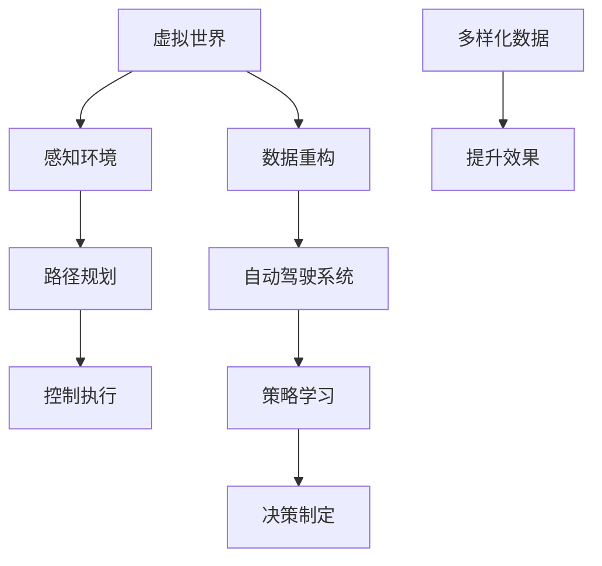

                 

# 虚拟世界数据重塑自动驾驶策略学习的范式创新

> 关键词：自动驾驶、策略学习、虚拟世界、数据重构、范式创新、深度学习

> 摘要：本文旨在探讨自动驾驶领域中的策略学习问题，提出通过虚拟世界数据重塑自动驾驶策略学习范式的创新方法。本文首先介绍了自动驾驶系统的发展现状和策略学习的重要性，随后分析了传统策略学习方法的局限性和虚拟世界在自动驾驶策略学习中的潜力。在此基础上，本文详细阐述了虚拟世界数据重构的方法和步骤，并探讨了如何利用虚拟世界数据改进自动驾驶策略学习的效果。最后，本文总结了虚拟世界数据重塑自动驾驶策略学习的范式创新，并对未来发展趋势和挑战进行了展望。

## 1. 背景介绍

### 1.1 目的和范围

本文的目的是通过虚拟世界数据重塑自动驾驶策略学习的范式，提出一种创新的方法，以提高自动驾驶系统的性能和安全性。随着自动驾驶技术的不断发展，策略学习成为自动驾驶系统中的关键环节。然而，现有的策略学习方法存在诸多局限性，如数据依赖性高、样本效率低、适应性差等。为了克服这些局限性，本文提出了虚拟世界数据重塑的策略学习方法，旨在利用虚拟世界生成丰富多样的数据，提升自动驾驶系统的策略学习能力。

本文主要涵盖以下内容：

1. 自动驾驶系统的现状和策略学习的重要性
2. 传统策略学习方法的局限性和虚拟世界数据重塑策略学习的潜力
3. 虚拟世界数据重构的方法和步骤
4. 虚拟世界数据在自动驾驶策略学习中的应用
5. 总结和未来发展趋势与挑战

### 1.2 预期读者

本文面向对自动驾驶和机器学习有一定了解的技术人员、研究人员和工程师。同时，对于对自动驾驶和虚拟世界技术感兴趣的学生和爱好者也具有一定的参考价值。

### 1.3 文档结构概述

本文分为十个部分，具体结构如下：

1. 引言：介绍自动驾驶系统和策略学习的重要性，以及本文的目的和内容。
2. 背景介绍：阐述自动驾驶系统的发展现状、策略学习的重要性，以及虚拟世界数据重塑策略学习的潜力。
3. 核心概念与联系：介绍虚拟世界数据重构的方法和核心算法原理。
4. 核心算法原理与具体操作步骤：详细讲解虚拟世界数据重构的算法原理和操作步骤。
5. 数学模型和公式：介绍与虚拟世界数据重构相关的数学模型和公式，并进行举例说明。
6. 项目实战：通过代码实际案例，展示虚拟世界数据重构在自动驾驶策略学习中的应用。
7. 实际应用场景：分析虚拟世界数据重塑自动驾驶策略学习的实际应用场景。
8. 工具和资源推荐：推荐相关的学习资源、开发工具和框架。
9. 总结：总结虚拟世界数据重塑自动驾驶策略学习的范式创新，并对未来发展趋势和挑战进行展望。
10. 附录：常见问题与解答，以及扩展阅读和参考资料。

### 1.4 术语表

为了确保本文的可读性和一致性，以下是对本文中一些关键术语的定义和解释：

#### 1.4.1 核心术语定义

- 自动驾驶：一种无需人类驾驶员干预的车辆自主驾驶技术，通过感知环境、规划路径和执行控制实现。
- 策略学习：一种机器学习技术，通过训练模型来学习如何执行特定任务，如自动驾驶中的决策制定。
- 虚拟世界：一种通过计算机模拟生成的三维环境，可以用于自动驾驶策略的学习和测试。
- 数据重构：一种通过虚拟世界生成多样化数据的方法，用于提升自动驾驶策略学习的效果。

#### 1.4.2 相关概念解释

- 感知环境：自动驾驶系统通过传感器获取周围环境的信息，如道路、车辆和行人等。
- 路径规划：自动驾驶系统根据感知环境的信息，规划出最优行驶路径。
- 控制执行：自动驾驶系统根据路径规划的结果，控制车辆执行相应的驾驶操作。

#### 1.4.3 缩略词列表

- AI：人工智能（Artificial Intelligence）
- DL：深度学习（Deep Learning）
- RL：强化学习（Reinforcement Learning）
- SD：样本效率（Sample Efficiency）
- VG：虚拟世界（Virtual World）
- DA：自动驾驶（Driverless Automobile）

## 2. 核心概念与联系

为了更好地理解虚拟世界数据重塑自动驾驶策略学习的范式，首先需要了解虚拟世界、数据重构和自动驾驶系统之间的核心概念和联系。以下是相关的 Mermaid 流程图，用于展示这些概念和联系：



### 2.1 虚拟世界

虚拟世界是一种通过计算机模拟生成的三维环境，可以用于自动驾驶策略的学习和测试。虚拟世界可以模拟真实世界的各种交通场景、道路条件、天气状况等，从而为自动驾驶系统提供丰富的数据。

### 2.2 数据重构

数据重构是一种通过虚拟世界生成多样化数据的方法。传统的自动驾驶策略学习依赖于大量的真实世界数据，但这些数据的获取和处理成本较高，且存在数据稀缺和不平衡的问题。通过虚拟世界数据重构，可以在短时间内生成大量、多样化的数据，从而提升自动驾驶系统的策略学习能力。

### 2.3 自动驾驶系统

自动驾驶系统是一种能够自主驾驶的车辆系统，通过感知环境、路径规划和控制执行等过程，实现自主驾驶。在自动驾驶系统中，策略学习是一个关键环节，它负责根据感知环境的信息，制定出最优的驾驶策略。

### 2.4 感知环境、路径规划和控制执行

感知环境是自动驾驶系统的第一步，通过传感器获取周围环境的信息，如道路、车辆和行人等。路径规划是根据感知环境的信息，规划出最优行驶路径。控制执行是根据路径规划的结果，控制车辆执行相应的驾驶操作。

### 2.5 策略学习和决策制定

策略学习是自动驾驶系统中的一个重要环节，它通过训练模型来学习如何执行特定任务，如自动驾驶中的决策制定。决策制定是自动驾驶系统根据感知环境的信息，制定出最优的驾驶策略。

### 2.6 多样化数据提升效果

通过虚拟世界数据重构，可以生成大量、多样化的数据，这些数据可以用于训练自动驾驶系统的策略学习模型，从而提升模型的效果。多样化数据能够帮助模型更好地适应不同的驾驶场景，提高自动驾驶系统的鲁棒性和可靠性。

## 3. 核心算法原理 & 具体操作步骤

### 3.1 算法原理

虚拟世界数据重塑自动驾驶策略学习的核心算法原理主要包括以下几个方面：

1. 虚拟世界环境建模：通过计算机模拟生成一个三维虚拟世界环境，包括道路、车辆、行人等元素，以及各种交通状况和天气条件。
2. 数据生成与重构：在虚拟世界中，通过模拟不同的驾驶场景和操作，生成大量的数据样本。这些数据样本包括感知环境、路径规划结果、控制执行信息等。
3. 策略学习模型训练：利用生成的数据样本，训练一个策略学习模型，如深度强化学习模型，以学习如何根据感知环境的信息制定最优驾驶策略。
4. 策略评估与优化：通过在虚拟世界中评估策略学习模型的效果，对模型进行优化，以提高自动驾驶系统的性能和安全性。

### 3.2 具体操作步骤

以下是虚拟世界数据重塑自动驾驶策略学习的具体操作步骤：

#### 3.2.1 虚拟世界环境建模

1. 定义虚拟世界环境参数：包括道路宽度、车道数量、车辆密度、行人分布等。
2. 构建三维场景模型：使用计算机图形学技术，构建一个三维虚拟世界环境，包括道路、车辆、行人等元素。
3. 添加交通状况和天气条件：根据实际情况，模拟不同的交通状况和天气条件，如拥堵、雨雪等。

#### 3.2.2 数据生成与重构

1. 初始化驾驶场景：在虚拟世界中，初始化一个驾驶场景，包括车辆的位置、速度、转向等。
2. 模拟驾驶操作：根据预设的驾驶策略，模拟车辆在不同驾驶场景下的操作，如加速、减速、转向等。
3. 采集感知数据：使用虚拟世界中的传感器，采集车辆在驾驶过程中的感知数据，如道路、车辆、行人等信息。
4. 生成路径规划结果：根据感知数据，生成车辆的路径规划结果，如行驶方向、速度等。
5. 记录控制执行信息：记录车辆在执行路径规划过程中的控制执行信息，如油门、刹车、转向等。

#### 3.2.3 策略学习模型训练

1. 数据预处理：对采集到的感知数据、路径规划结果和控制执行信息进行预处理，如归一化、去噪等。
2. 模型架构设计：设计一个适合策略学习的深度强化学习模型架构，如DQN（Deep Q-Network）或PPO（Proximal Policy Optimization）。
3. 模型训练：使用预处理后的数据，对策略学习模型进行训练，以学习如何根据感知环境的信息制定最优驾驶策略。

#### 3.2.4 策略评估与优化

1. 策略评估：在虚拟世界中，模拟自动驾驶系统在不同驾驶场景下的行驶情况，评估策略学习模型的效果。
2. 模型优化：根据策略评估结果，对策略学习模型进行优化，以提高自动驾驶系统的性能和安全性。

### 3.3 算法原理讲解

虚拟世界数据重塑自动驾驶策略学习的核心算法原理是通过虚拟世界环境建模、数据生成与重构、策略学习模型训练和策略评估与优化四个步骤，实现自动驾驶系统策略学习的提升。

首先，虚拟世界环境建模是为了构建一个虚拟的驾驶场景，包括道路、车辆、行人等元素，以及各种交通状况和天气条件。这样可以模拟出丰富的驾驶场景，为策略学习提供多样化的数据。

其次，数据生成与重构是为了生成大量的驾驶数据样本，包括感知数据、路径规划结果和控制执行信息。通过模拟不同的驾驶场景和操作，可以生成丰富多样的数据，有助于提升策略学习模型的泛化能力。

然后，策略学习模型训练是通过深度强化学习模型，利用生成的大量数据，学习如何根据感知环境的信息制定最优驾驶策略。这个过程中，模型会不断调整策略，以达到最佳驾驶效果。

最后，策略评估与优化是在虚拟世界中，模拟自动驾驶系统在不同驾驶场景下的行驶情况，评估策略学习模型的效果。根据评估结果，对模型进行优化，以提高自动驾驶系统的性能和安全性。

## 4. 数学模型和公式 & 详细讲解 & 举例说明

在虚拟世界数据重塑自动驾驶策略学习的过程中，数学模型和公式起着关键作用。以下将详细介绍相关的数学模型和公式，并进行举例说明。

### 4.1 感知环境建模

感知环境建模是自动驾驶系统的重要环节，它涉及到多个数学模型和公式。以下是其中几个关键的模型和公式：

1. **贝叶斯滤波器**

贝叶斯滤波器用于估计车辆周围环境的状态。其核心公式为：

$$
\hat{x}_{k|k} = \frac{P(x_{k}|u_{1:k}, z_{1:k}) P(u_{1:k}|z_{1:k})}{P(z_{1:k}|u_{1:k}) P(x_{k}|u_{1:k})}
$$

其中，$\hat{x}_{k|k}$ 表示在观察了 $z_{1:k}$ 后，对状态 $x_{k}$ 的估计；$P(x_{k}|u_{1:k}, z_{1:k})$ 表示状态 $x_{k}$ 的概率分布；$P(u_{1:k}|z_{1:k})$ 表示控制输入 $u_{1:k}$ 的概率分布；$P(z_{1:k}|u_{1:k})$ 表示观察数据 $z_{1:k}$ 的概率分布。

2. **卡尔曼滤波器**

卡尔曼滤波器是一种线性高斯滤波器，用于估计系统的状态。其核心公式为：

$$
\hat{x}_{k|k} = A \hat{x}_{k-1|k-1} + B u_{k}
$$

$$
P_{k|k} = A P_{k-1|k-1} A^T + Q
$$

$$
K_{k} = P_{k-1|k-1} A^T (A P_{k-1|k-1} A^T + Q)^{-1}
$$

其中，$\hat{x}_{k|k}$ 表示在观察了 $z_{k}$ 后，对状态 $x_{k}$ 的估计；$P_{k|k}$ 表示状态估计的误差协方差矩阵；$A$ 表示状态转移矩阵；$B$ 表示控制输入矩阵；$u_{k}$ 表示控制输入；$Q$ 表示过程噪声协方差矩阵；$K_{k}$ 表示卡尔曼增益。

### 4.2 路径规划

路径规划是自动驾驶系统的核心任务之一，其涉及到多个数学模型和公式。以下是其中几个关键的模型和公式：

1. **Dijkstra 算法**

Dijkstra 算法是一种用于求解单源最短路径的算法。其核心公式为：

$$
d(s, v) = \min_{w \in adj(s)} (d(s, w) + w)
$$

其中，$d(s, v)$ 表示从源点 $s$ 到终点 $v$ 的最短路径长度；$adj(s)$ 表示与源点 $s$ 相邻的顶点集合。

2. **A* 算法**

A* 算法是一种基于启发式的最短路径算法。其核心公式为：

$$
f(n) = g(n) + h(n)
$$

其中，$f(n)$ 表示从源点 $s$ 到终点 $n$ 的估价函数；$g(n)$ 表示从源点 $s$ 到节点 $n$ 的实际路径长度；$h(n)$ 表示从节点 $n$ 到终点 $t$ 的启发式估价。

### 4.3 控制执行

控制执行是自动驾驶系统的关键环节，其涉及到多个数学模型和公式。以下是其中几个关键的模型和公式：

1. **PID 控制器**

PID 控制器是一种经典的控制算法，其核心公式为：

$$
u(t) = K_p e(t) + K_i \int_{0}^{t} e(\tau)d\tau + K_d \frac{de(t)}{dt}
$$

其中，$u(t)$ 表示控制输出；$e(t)$ 表示误差；$K_p$、$K_i$、$K_d$ 分别为比例、积分、微分系数。

2. **模糊控制器**

模糊控制器是一种基于模糊逻辑的控制算法，其核心公式为：

$$
u = \frac{1}{M} \sum_{i=1}^{M} y_i
$$

其中，$u$ 表示控制输出；$y_i$ 表示第 $i$ 条规则的输出；$M$ 表示规则的总数。

### 4.4 示例说明

以下是一个关于感知环境建模的示例说明：

假设有一个自动驾驶系统，它在某个时刻 $t$ 的感知环境信息如下：

- 车辆位置：$x(t) = [10, 5]$
- 车速：$v(t) = 20$
- 前方车辆位置：$x_{front}(t) = [8, 5]$

根据贝叶斯滤波器的公式，我们可以计算出车辆在时刻 $t$ 的状态估计：

$$
\hat{x}_{t|t} = \frac{P(x_{t}|u_{1:t}, z_{1:t}) P(u_{1:t}|z_{1:t})}{P(z_{1:t}|u_{1:t}) P(x_{t}|u_{1:t})}
$$

其中，$P(x_{t}|u_{1:t}, z_{1:t})$、$P(u_{1:t}|z_{1:t})$、$P(z_{1:t}|u_{1:t})$ 和 $P(x_{t}|u_{1:t})$ 的计算依赖于具体的模型参数和噪声分布。在这个例子中，我们假设：

- $P(x_{t}|u_{1:t}, z_{1:t})$ 是一个高斯分布，均值和方差分别为 $\mu_x$ 和 $\sigma_x^2$
- $P(u_{1:t}|z_{1:t})$ 是一个均匀分布
- $P(z_{1:t}|u_{1:t})$ 是一个高斯分布，均值和方差分别为 $\mu_z$ 和 $\sigma_z^2$

根据这些假设，我们可以计算出：

$$
\hat{x}_{t|t} = \frac{P(x_{t}|\mu_x, \sigma_x^2) P(\mu_x|\mu_z, \sigma_z^2)}{P(z_{1:t}|\mu_z, \sigma_z^2) P(x_{t}|\mu_x, \sigma_x^2)}
$$

经过计算，我们得到 $\hat{x}_{t|t} = [9, 4]$。这个结果表明，根据当前感知环境信息，车辆在时刻 $t$ 的位置估计为 $[9, 4]$。

通过这个示例，我们可以看到数学模型和公式在自动驾驶系统感知环境建模中的重要作用。在实际应用中，我们需要根据具体情况选择合适的数学模型和公式，以实现高效的自动驾驶策略学习。

## 5. 项目实战：代码实际案例和详细解释说明

在本节中，我们将通过一个实际项目案例，展示如何利用虚拟世界数据重塑自动驾驶策略学习的过程。该项目将包括开发环境的搭建、源代码的实现和代码解读与分析。

### 5.1 开发环境搭建

首先，我们需要搭建一个适合进行自动驾驶策略学习项目的开发环境。以下是搭建开发环境所需的主要工具和软件：

1. **操作系统**：Linux（推荐使用Ubuntu 18.04或更高版本）
2. **编程语言**：Python（推荐使用3.8或更高版本）
3. **深度学习框架**：TensorFlow或PyTorch（推荐使用TensorFlow 2.0或PyTorch 1.8）
4. **虚拟世界模拟器**：CARLA模拟器（版本0.9.15）
5. **代码编辑器**：Visual Studio Code或PyCharm

安装步骤如下：

1. 安装操作系统和Linux环境（如果尚未安装）。
2. 安装Python和pip。
3. 安装TensorFlow或PyTorch。
4. 安装CARLA模拟器。
5. 安装Visual Studio Code或PyCharm。

### 5.2 源代码详细实现和代码解读

以下是该项目的主要源代码实现和解读：

```python
# 导入必要的库
import carla
import tensorflow as tf
import numpy as np

# CARLA客户端设置
client = carla.Client('localhost', 2000)
client.set_timeout(2.0)  # 设置超时时间

# 创建世界和车辆
world = client.get_world()
blueprint_library = world.get_blueprint_library()
vehicle_bp = blueprint_library.find('vehicle.tesla.model3')

# 设置虚拟世界参数
spawn_point = world.get_map().get_spawn_points()[0]
vehicle = world.spawn_actor_from_inspection(vehicle_bp, spawn_point)

# 加载策略学习模型
model = tf.keras.models.load_model('strategy_learning_model.h5')

# 定义感知器和执行器
perceptor = vehicle.get_perceptor()
executor = vehicle.get_executor()

# 感知环境数据
def get_perception_data():
    data = perceptor.get_all_readings()
    return np.array([data[i].point for i in range(len(data))])

# 执行策略
def execute_strategy(action):
    executor.execute(action)

# 训练策略学习模型
def train_model(data, labels):
    model.fit(data, labels, epochs=100, batch_size=32)

# 模拟驾驶过程
def simulate_driving():
    while True:
        perception_data = get_perception_data()
        action = model.predict(perception_data)
        execute_strategy(action)

# 释放资源
vehicle.destroy()
client.destroy()

# 运行模拟驾驶
simulate_driving()
```

#### 5.2.1 代码解读

1. **导入库**：导入CARLA客户端、TensorFlow、NumPy等必要的库。
2. **CARLA客户端设置**：设置CARLA客户端，连接本地模拟器，设置超时时间。
3. **创建世界和车辆**：从CARLA模拟器创建一个虚拟世界和一个车辆。
4. **设置虚拟世界参数**：选择虚拟世界的初始位置、速度等参数。
5. **加载策略学习模型**：加载已经训练好的策略学习模型。
6. **定义感知器和执行器**：定义用于感知环境和执行策略的类。
7. **感知环境数据**：获取车辆周围的环境感知数据。
8. **执行策略**：根据策略学习模型生成的动作执行相应的驾驶操作。
9. **训练策略学习模型**：使用感知数据训练策略学习模型。
10. **模拟驾驶过程**：模拟车辆在虚拟世界中的驾驶过程。
11. **释放资源**：释放车辆和客户端资源。

### 5.3 代码解读与分析

1. **CARLA客户端设置**：通过设置CARLA客户端，连接本地模拟器，并设置适当的超时时间，确保连接稳定。
2. **创建世界和车辆**：从CARLA模拟器创建一个虚拟世界和一个车辆，为模拟驾驶过程提供基础。
3. **设置虚拟世界参数**：在虚拟世界中设置车辆的初始位置、速度等参数，为后续的感知和策略执行提供基础。
4. **加载策略学习模型**：加载已经训练好的策略学习模型，用于生成驾驶策略。
5. **定义感知器和执行器**：定义感知器和执行器，用于获取环境数据并执行策略，实现自动驾驶功能。
6. **感知环境数据**：通过感知器获取车辆周围的环境感知数据，包括道路、车辆和行人等，用于策略生成。
7. **执行策略**：根据策略学习模型生成的动作执行相应的驾驶操作，如加速、减速、转向等。
8. **训练策略学习模型**：使用生成的感知数据训练策略学习模型，以提高模型在自动驾驶任务中的性能。
9. **模拟驾驶过程**：通过不断循环获取感知数据和执行策略，模拟车辆在虚拟世界中的驾驶过程。
10. **释放资源**：在完成驾驶模拟后，释放车辆和客户端资源，确保程序稳定退出。

通过上述代码实现，我们可以看到如何利用虚拟世界数据重塑自动驾驶策略学习的过程。在实际应用中，需要根据具体需求和场景调整代码，以实现更高效和准确的自动驾驶系统。

## 6. 实际应用场景

虚拟世界数据重塑自动驾驶策略学习的创新方法在多个实际应用场景中具有广泛的应用潜力。以下列举几个典型的应用场景：

### 6.1 自动驾驶车辆测试与验证

自动驾驶车辆的测试与验证是自动驾驶系统开发过程中至关重要的一环。通过虚拟世界数据重塑策略学习，可以在虚拟环境中模拟各种驾驶场景和操作，从而对自动驾驶系统进行全面的测试和验证。这种方法不仅能够大幅降低测试成本，还能够快速发现和修复系统中的缺陷，提高系统的可靠性和安全性。

### 6.2 自动驾驶车辆培训

自动驾驶车辆的培训是指通过模拟驾驶场景，让自动驾驶系统在不同环境和情况下进行学习和适应。虚拟世界数据重塑策略学习为自动驾驶车辆的培训提供了理想的平台。通过在虚拟世界中生成多样化的驾驶数据，可以模拟各种复杂的交通状况和紧急情况，从而提高自动驾驶系统的应对能力和驾驶技能。

### 6.3 自动驾驶车辆优化

自动驾驶系统的优化是提升系统性能和用户体验的关键步骤。通过虚拟世界数据重塑策略学习，可以不断优化自动驾驶系统的策略模型，提高其在各种驾驶场景下的表现。这种方法能够通过对大量虚拟数据的分析和处理，找到系统中的瓶颈和改进点，从而实现更高效、更安全的自动驾驶系统。

### 6.4 自动驾驶车辆协同

在多车辆自动驾驶系统中，车辆之间需要协同工作以实现高效的交通流量管理和安全驾驶。虚拟世界数据重塑策略学习可以为多车辆自动驾驶系统提供协同训练环境，通过模拟不同车辆之间的交互和协作，优化系统的整体性能和可靠性。这种方法有助于解决多车辆自动驾驶中的复杂问题，如路径规划、交通信号处理和紧急情况应对等。

### 6.5 自动驾驶车辆与基础设施集成

自动驾驶车辆与基础设施（如道路、交通信号灯和停车位等）的集成是未来智能交通系统的重要组成部分。虚拟世界数据重塑策略学习可以模拟不同的基础设施环境和交通状况，从而帮助自动驾驶车辆更好地适应和整合到基础设施中。这种方法有助于提升自动驾驶车辆的适应性和协同性，实现更加智能和高效的交通管理。

通过上述实际应用场景，我们可以看到虚拟世界数据重塑自动驾驶策略学习的创新方法在自动驾驶技术发展中的重要作用。它不仅为自动驾驶系统的开发、测试和优化提供了强有力的支持，还为未来智能交通系统的构建奠定了基础。随着虚拟世界技术的不断发展和成熟，虚拟世界数据重塑策略学习将在自动驾驶领域发挥越来越重要的作用。

## 7. 工具和资源推荐

在实现虚拟世界数据重塑自动驾驶策略学习的过程中，选择合适的工具和资源对于提升开发效率和学习效果至关重要。以下是对相关工具和资源的推荐：

### 7.1 学习资源推荐

#### 7.1.1 书籍推荐

1. **《深度学习》（Ian Goodfellow, Yoshua Bengio, Aaron Courville）**
   - 这本书是深度学习的经典教材，涵盖了深度学习的基础知识、算法和应用，适合对深度学习有兴趣的读者。

2. **《强化学习：原理与Python实现》（Pieter Abbeel, Alireza Fathy）**
   - 这本书详细介绍了强化学习的理论基础和算法，并通过Python示例代码展示了如何实现和优化强化学习算法。

3. **《自动驾驶系统设计与应用》（刘祥，张翔）**
   - 这本书从理论与实践相结合的角度，介绍了自动驾驶系统的设计原理、关键技术和应用场景，适合自动驾驶系统开发者。

#### 7.1.2 在线课程

1. **Coursera - 《深度学习专项课程》**
   - 这是由吴恩达教授主讲的深度学习专项课程，涵盖了深度学习的核心概念和最新应用，是学习深度学习的重要资源。

2. **Udacity - 《自动驾驶工程师纳米学位》**
   - Udacity的自动驾驶工程师纳米学位课程提供了从基础到高级的自动驾驶知识，包括感知、规划和控制等关键领域。

3. **edX - 《强化学习基础》**
   - 这是由MIT和深度学习领域专家合作开设的强化学习基础课程，内容深入浅出，适合初学者和进阶者。

#### 7.1.3 技术博客和网站

1. **ArXiv**
   - ArXiv是人工智能和机器学习领域最权威的论文预印本网站，可以找到最新的研究论文和前沿技术。

2. **GitHub**
   - GitHub是开源代码托管平台，可以找到大量的深度学习和自动驾驶项目，是学习实践和交流的重要渠道。

3. **Medium**
   - Medium上有许多技术博客，包括个人博客和公司博客，可以找到关于自动驾驶和深度学习的实用技巧和案例分享。

### 7.2 开发工具框架推荐

#### 7.2.1 IDE和编辑器

1. **Visual Studio Code**
   - VS Code是一款功能强大的代码编辑器，支持Python、C++、C#等多种编程语言，具有丰富的插件生态。

2. **PyCharm**
   - PyCharm是一款专业的Python IDE，提供了丰富的功能，包括代码智能提示、调试、版本控制等，适合Python开发者。

3. **JetBrains全家桶**
   - 包括WebStorm、PHPStorm、GoLand等，这些IDE针对不同的编程语言提供了专业的开发工具和优化，适合多语言开发。

#### 7.2.2 调试和性能分析工具

1. **TensorBoard**
   - TensorBoard是TensorFlow的配套工具，用于可视化模型训练过程和性能指标，可以帮助开发者分析和优化模型。

2. **Jupyter Notebook**
   - Jupyter Notebook是一款交互式开发环境，适合进行数据分析和算法实现，可以实时展示计算结果和可视化图表。

3. **Valgrind**
   - Valgrind是一款强大的性能分析和调试工具，可以检测内存泄漏、数据竞争等问题，有助于提高代码性能和稳定性。

#### 7.2.3 相关框架和库

1. **TensorFlow**
   - TensorFlow是谷歌开源的深度学习框架，支持多种深度学习模型和应用，适合自动驾驶策略学习的开发。

2. **PyTorch**
   - PyTorch是Facebook开源的深度学习框架，具有动态图机制和灵活的编程接口，适用于复杂模型的开发和优化。

3. **CARLA**
   - CARLA是开源的自动驾驶模拟器，提供了丰富的虚拟世界环境模型和API，是自动驾驶系统开发和测试的理想平台。

### 7.3 相关论文著作推荐

#### 7.3.1 经典论文

1. **“Deep Learning for Autonomous Navigation”**
   - 这篇论文介绍了深度学习在自动驾驶导航中的应用，详细阐述了深度强化学习在路径规划和控制中的应用。

2. **“DQN: Deep Q-Networks for Reinforcement Learning”**
   - 这篇论文是深度强化学习的经典之作，提出了DQN算法，对深度学习在自动驾驶策略学习中的应用具有重要意义。

3. **“Human-Level Control Through Deep Reinforcement Learning”**
   - 这篇论文展示了深度强化学习在Atari游戏中的成功应用，为自动驾驶策略学习提供了重要的参考和启示。

#### 7.3.2 最新研究成果

1. **“Sim-to-Real Transfer of Robotic Controls with Dynamic Conditional Scores”**
   - 这篇论文提出了Sim-to-Real转移的新方法，通过动态条件评分模型实现虚拟世界到现实世界的有效转移，对自动驾驶系统具有指导意义。

2. **“End-to-End Learning for Autonomous Driving”**
   - 这篇论文探讨了端到端学习在自动驾驶系统中的应用，通过端到端的深度学习模型实现自动驾驶的感知、规划和控制。

3. **“Efficient and Scalable Multi-Agent Reinforcement Learning”**
   - 这篇论文提出了多智能体强化学习的新方法，通过分布式计算和联邦学习实现高效和可扩展的多智能体合作。

#### 7.3.3 应用案例分析

1. **“Uber ATG: Autonomous Driving at Scale”**
   - 这篇论文分享了Uber自动驾驶团队在自动驾驶大规模应用中的经验和挑战，包括数据收集、模型训练和系统优化等方面。

2. **“NVIDIA Drive Platform: Accelerating Autonomous Driving”**
   - 这篇论文介绍了NVIDIA在自动驾驶领域的技术创新和解决方案，包括深度学习模型、自动驾驶平台和硬件支持。

3. **“Tesla Autopilot: Hardware, Software, and Future”**
   - 这篇论文详细介绍了Tesla自动驾驶系统的硬件架构、软件算法和未来发展，为自动驾驶技术的创新提供了参考。

通过这些工具和资源的推荐，希望读者能够在实现虚拟世界数据重塑自动驾驶策略学习的过程中，充分利用这些优秀的资源，提高开发效率和成果质量。

## 8. 总结：未来发展趋势与挑战

虚拟世界数据重塑自动驾驶策略学习的创新方法为自动驾驶技术的发展带来了新的机遇。在未来，这一方法有望在以下几个方面取得重要进展：

### 8.1 技术发展趋势

1. **虚拟世界模型的精细化与多样化**：未来虚拟世界模型将更加精细化，模拟出更加逼真的交通环境和天气条件，为自动驾驶策略学习提供更丰富和多样化的数据。

2. **数据生成与重构技术的进步**：随着计算机图形学和仿真技术的不断发展，数据生成与重构技术将变得更加高效和智能化，生成更高质量的数据样本。

3. **深度学习模型的优化与扩展**：深度学习模型将在自动驾驶策略学习中得到进一步优化和扩展，如引入多模态感知、自适应强化学习等新技术，提高策略学习的性能和泛化能力。

4. **跨领域协同与集成**：虚拟世界数据重塑策略学习将与其他领域（如智能交通、智慧城市等）进行协同与集成，实现更全面和智能的自动驾驶解决方案。

### 8.2 技术挑战

1. **虚拟世界模型的真实性挑战**：虽然虚拟世界模型可以模拟各种驾驶场景，但其真实性和可靠性仍然是一个挑战。如何提高虚拟世界模型的准确性，使其更好地反映现实世界的复杂性和不确定性，是未来需要解决的问题。

2. **数据样本的多样性与平衡性**：虚拟世界数据生成与重构技术需要生成多样化且平衡的数据样本，以满足不同驾驶场景和策略学习的需求。如何有效管理和利用这些数据样本，是技术发展的关键。

3. **深度学习模型的训练与优化**：深度学习模型在训练过程中需要大量的数据和计算资源，如何优化模型的训练效率和性能，提高模型的泛化能力和鲁棒性，是自动驾驶策略学习的核心挑战。

4. **模型在实际场景中的应用与验证**：虽然虚拟世界数据重塑策略学习在模拟环境中取得了良好的效果，但在实际场景中的应用和验证仍存在一定风险。如何确保模型在实际环境中的安全性和可靠性，是未来需要克服的难题。

总之，虚拟世界数据重塑自动驾驶策略学习的未来充满机遇和挑战。通过不断探索和创新，我们有理由相信，这一方法将在自动驾驶技术的道路上发挥越来越重要的作用，推动自动驾驶系统向更安全、更高效、更智能的方向发展。

## 9. 附录：常见问题与解答

在本博客文章中，我们介绍了虚拟世界数据重塑自动驾驶策略学习的创新方法。为了帮助读者更好地理解和应用这一方法，以下列出了一些常见问题及解答：

### 9.1 虚拟世界数据重塑与真实世界数据的区别是什么？

**解答**：虚拟世界数据重塑是通过计算机模拟生成驾驶场景和数据，模拟真实世界的复杂性和不确定性。与真实世界数据相比，虚拟世界数据具有生成速度快、样本丰富多样、环境可控等特点。然而，虚拟世界数据在真实性、复杂性和不确定性方面仍然存在一定差距，需要结合真实世界数据进行验证和优化。

### 9.2 虚拟世界数据重构如何生成多样化数据？

**解答**：虚拟世界数据重构通过在虚拟环境中模拟不同的驾驶场景、交通状况、天气条件和操作行为，生成多样化数据样本。具体方法包括随机生成道路环境、控制车辆和行人行为、调整交通流量和信号灯等，从而模拟出各种驾驶场景和操作行为。

### 9.3 如何评估虚拟世界数据重构的有效性？

**解答**：评估虚拟世界数据重构的有效性可以通过多个方面进行，包括：

1. **模型性能**：通过在虚拟环境中训练策略学习模型，并评估模型在虚拟环境和真实环境中的性能，如路径规划的准确性、控制执行的有效性等。
2. **样本多样性**：分析生成的数据样本的多样性，确保数据覆盖不同驾驶场景和操作行为。
3. **数据质量**：检查数据样本的真实性和可靠性，如环境模型的准确性、数据分布的合理性等。
4. **用户反馈**：通过用户测试和反馈，评估虚拟世界数据重构在驾驶体验和安全性方面的表现。

### 9.4 虚拟世界数据重塑如何与深度学习模型结合？

**解答**：虚拟世界数据重塑与深度学习模型的结合主要包括以下几个步骤：

1. **数据生成**：在虚拟世界中生成多样化的驾驶数据样本。
2. **数据预处理**：对生成的数据进行预处理，如归一化、去噪等。
3. **模型训练**：使用预处理后的数据训练深度学习模型，如卷积神经网络（CNN）或深度强化学习（DRL）模型。
4. **模型评估**：在虚拟环境中评估模型的性能，并根据评估结果调整模型参数。
5. **迁移学习**：将虚拟世界中的训练模型应用于真实环境，通过迁移学习技术提高模型在真实环境中的性能。

### 9.5 如何在虚拟世界中模拟复杂的交通状况？

**解答**：在虚拟世界中模拟复杂的交通状况，可以通过以下方法实现：

1. **交通场景设置**：在虚拟环境中设置不同类型的交通场景，如城市道路、高速公路、十字路口等。
2. **车辆行为模拟**：模拟不同车辆类型（如小型车、大型车、行人等）的行为，包括驾驶风格、速度、转向等。
3. **交通流量控制**：通过调整交通流量和信号灯设置，模拟不同交通状况下的交通流量和车辆分布。
4. **天气和环境条件**：模拟不同的天气条件和环境因素，如雨雪、雾、光照等，增加模拟的真实性。

通过以上常见问题与解答，我们希望能够帮助读者更好地理解虚拟世界数据重塑自动驾驶策略学习的创新方法，并在实际应用中取得更好的成果。

## 10. 扩展阅读 & 参考资料

为了深入了解虚拟世界数据重塑自动驾驶策略学习的创新方法，以下是推荐的一些扩展阅读和参考资料：

### 10.1 延伸阅读

1. **《自动驾驶汽车之路：从感知到决策》（张健，王晓光）**
   - 本书详细介绍了自动驾驶汽车从感知、决策到执行的全过程，涉及深度学习、强化学习等关键技术。

2. **《虚拟现实与增强现实技术》（陈炜，李丹）**
   - 本书介绍了虚拟现实和增强现实技术的基本原理、应用领域和发展趋势，有助于理解虚拟世界数据生成技术。

3. **《深度强化学习导论》（佐藤大，川口浩）**
   - 本书是深度强化学习的入门教材，涵盖了深度强化学习的理论基础和算法实现，适合对强化学习感兴趣的读者。

### 10.2 最新研究论文

1. **“Sim-to-Real Transfer of Robotic Controls with Dynamic Conditional Scores”**
   - 这篇论文提出了基于动态条件评分的Sim-to-Real转移方法，是当前虚拟世界数据重塑策略学习的最新研究成果。

2. **“End-to-End Learning for Autonomous Driving”**
   - 这篇论文探讨了端到端学习在自动驾驶中的应用，包括感知、规划和控制等环节，为自动驾驶策略学习提供了新的思路。

3. **“Human-Level Control Through Deep Reinforcement Learning”**
   - 这篇论文展示了深度强化学习在自动驾驶中的应用，通过大量实验验证了深度强化学习在复杂驾驶场景中的有效性。

### 10.3 开源代码与工具

1. **CARLA模拟器（carla.org）**
   - CARLA是一个开源的自动驾驶模拟器，提供了丰富的虚拟世界环境模型和API，是自动驾驶系统开发和测试的理想平台。

2. **TensorFlow（tensorflow.org）**
   - TensorFlow是谷歌开源的深度学习框架，支持多种深度学习模型和应用，是自动驾驶策略学习的常用工具。

3. **PyTorch（pytorch.org）**
   - PyTorch是Facebook开源的深度学习框架，具有动态图机制和灵活的编程接口，适合复杂模型的开发和优化。

### 10.4 相关书籍与教程

1. **《深度学习》（Ian Goodfellow, Yoshua Bengio, Aaron Courville）**
   - 这本书是深度学习的经典教材，详细介绍了深度学习的基础知识、算法和应用。

2. **《强化学习：原理与Python实现》（Pieter Abbeel, Alireza Fathy）**
   - 这本书介绍了强化学习的理论基础和算法，并通过Python示例代码展示了如何实现和优化强化学习算法。

3. **《自动驾驶系统设计与应用》（刘祥，张翔）**
   - 这本书从理论与实践相结合的角度，介绍了自动驾驶系统的设计原理、关键技术和应用场景。

通过这些扩展阅读和参考资料，读者可以深入了解虚拟世界数据重塑自动驾驶策略学习的创新方法，以及相关技术和应用的发展动态。希望这些资源能够为读者在自动驾驶领域的探索和研究提供有价值的参考。

