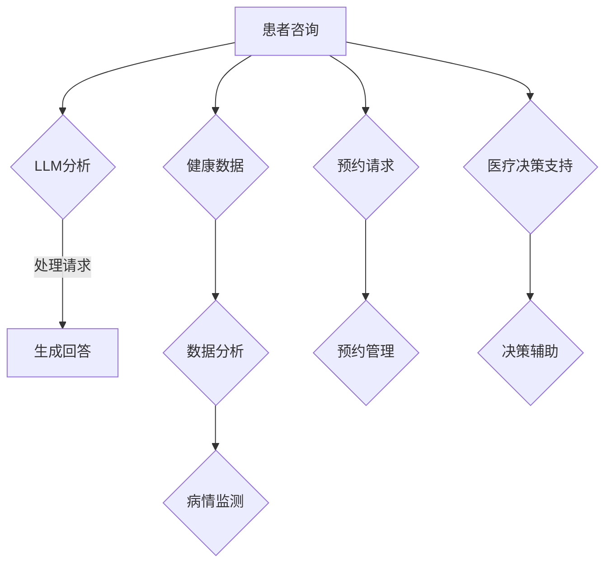

                 

# 虚拟医疗助手：LLM 提供全天候护理

> 关键词：虚拟医疗助手，大规模语言模型（LLM），全天候护理，医疗技术，人工智能应用

> 摘要：本文深入探讨了大规模语言模型（LLM）在虚拟医疗助手中的应用，展示了如何利用先进的自然语言处理技术为医疗行业提供全天候的护理服务。通过介绍LLM的核心原理、具体操作步骤以及数学模型，本文揭示了这项技术的潜力与挑战，为读者提供了一幅未来医疗领域的壮丽图景。

## 1. 背景介绍

### 1.1 目的和范围

本文旨在探讨大规模语言模型（LLM）在虚拟医疗助手领域的应用，并分析其如何为医疗行业提供全天候护理服务。我们将重点关注LLM的核心原理、具体操作步骤以及数学模型，同时探讨其在实际应用中的挑战与前景。

### 1.2 预期读者

本文面向对人工智能和医疗技术感兴趣的读者，包括人工智能研究人员、软件开发者、医疗专业人士以及对未来医疗技术发展持关注态度的公众。

### 1.3 文档结构概述

本文分为以下几个部分：

- **第1章：背景介绍**：介绍本文的目的、预期读者以及文档结构。
- **第2章：核心概念与联系**：介绍大规模语言模型（LLM）的核心概念及其与医疗护理的关联。
- **第3章：核心算法原理 & 具体操作步骤**：详细阐述LLM的工作原理和操作步骤。
- **第4章：数学模型和公式 & 详细讲解 & 举例说明**：探讨LLM背后的数学模型及其应用。
- **第5章：项目实战：代码实际案例和详细解释说明**：通过实际项目案例展示LLM的应用。
- **第6章：实际应用场景**：分析LLM在医疗领域的应用场景。
- **第7章：工具和资源推荐**：推荐相关学习资源和开发工具。
- **第8章：总结：未来发展趋势与挑战**：总结本文的主要观点，展望未来发展趋势和挑战。
- **第9章：附录：常见问题与解答**：解答常见疑问。
- **第10章：扩展阅读 & 参考资料**：提供更多深入阅读的建议。

### 1.4 术语表

#### 1.4.1 核心术语定义

- **大规模语言模型（LLM）**：一种基于深度学习的自然语言处理模型，能够处理大规模文本数据，并生成高质量的自然语言响应。
- **虚拟医疗助手**：利用人工智能技术为患者提供医疗咨询服务、病情监控、预约管理等的软件应用程序。
- **全天候护理**：一种医疗服务模式，能够在24小时内不间断地提供护理服务，提高患者的生活质量。

#### 1.4.2 相关概念解释

- **自然语言处理（NLP）**：计算机科学领域的一个分支，旨在让计算机理解和生成自然语言。
- **深度学习**：一种机器学习方法，通过模拟人类大脑的神经网络结构，让计算机从大量数据中自动学习。

#### 1.4.3 缩略词列表

- **LLM**：大规模语言模型
- **NLP**：自然语言处理
- **NLP**：神经网络

## 2. 核心概念与联系

在探讨大规模语言模型（LLM）在虚拟医疗助手中的应用之前，我们首先需要了解LLM的基本概念及其与医疗护理的关联。

### 2.1 大规模语言模型（LLM）的基本概念

大规模语言模型（LLM）是一种基于深度学习的自然语言处理模型，通过训练大量的文本数据，模型能够理解和生成自然语言。LLM的核心是神经网络，这些神经网络通过层层堆叠，形成复杂的层次结构，从而能够捕获文本数据中的深层语义信息。

### 2.2 LLM与医疗护理的关联

虚拟医疗助手作为一种新兴的医疗护理模式，通过人工智能技术为患者提供全天候的护理服务。LLM在虚拟医疗助手中的应用主要体现在以下几个方面：

1. **患者咨询**：LLM可以帮助患者解答各种医疗问题，提供实时、个性化的医疗建议。
2. **病情监控**：LLM可以分析患者的健康数据，如血压、心率等，实时监测病情变化，及时发现潜在的健康问题。
3. **预约管理**：LLM可以帮助患者在线预约医生、检查、手术等医疗服务，提高医疗服务的效率。
4. **医疗决策支持**：LLM可以为医生提供辅助决策，如疾病诊断、治疗方案推荐等，提高医疗决策的准确性。

### 2.3 Mermaid 流程图

以下是LLM在虚拟医疗助手中的基本架构的Mermaid流程图：



## 3. 核心算法原理 & 具体操作步骤

### 3.1 LLM的核心算法原理

大规模语言模型（LLM）的核心是深度神经网络（DNN），其基本原理是通过多层神经网络结构对文本数据进行处理，从而实现对自然语言的建模。LLM的训练过程主要包括以下几个步骤：

1. **数据预处理**：将文本数据转换为神经网络可处理的格式，如词向量或词嵌入。
2. **模型初始化**：初始化神经网络模型，包括设置权重和偏置。
3. **前向传播**：将输入文本数据传递到神经网络，通过逐层计算得到输出。
4. **反向传播**：根据输出与实际结果之间的误差，更新网络权重和偏置。
5. **模型优化**：通过优化算法（如梯度下降）调整模型参数，使模型误差最小化。

### 3.2 LLM的具体操作步骤

以下是LLM在虚拟医疗助手中的具体操作步骤：

1. **患者咨询**：
   - **数据收集**：收集患者的医疗问题和症状描述。
   - **文本预处理**：将文本数据转换为词向量或词嵌入。
   - **模型输入**：将预处理后的文本数据输入到LLM中。
   - **模型输出**：LLM生成针对患者问题的医疗建议。

2. **病情监控**：
   - **数据收集**：收集患者的健康数据，如血压、心率等。
   - **数据预处理**：对健康数据进行预处理，如归一化、缺失值填充等。
   - **模型输入**：将预处理后的健康数据输入到LLM中。
   - **模型输出**：LLM生成患者的病情监测报告。

3. **预约管理**：
   - **数据收集**：收集患者的预约请求，如预约时间、医生、医院等。
   - **文本预处理**：将预约请求文本数据转换为词向量或词嵌入。
   - **模型输入**：将预处理后的预约请求文本数据输入到LLM中。
   - **模型输出**：LLM生成预约确认信息。

4. **医疗决策支持**：
   - **数据收集**：收集患者的病历数据、检查结果等。
   - **数据预处理**：对病历数据进行预处理，如归一化、缺失值填充等。
   - **模型输入**：将预处理后的病历数据输入到LLM中。
   - **模型输出**：LLM生成医疗决策建议。

### 3.3 伪代码

以下是LLM在虚拟医疗助手中处理患者咨询问题的伪代码：

```python
def process_question(question):
    # 步骤1：文本预处理
    preprocessed_question = preprocess_text(question)
    
    # 步骤2：模型输入
    model_input = convert_to_embedding(preprocessed_question)
    
    # 步骤3：模型输出
    response = model.predict(model_input)
    
    # 步骤4：生成回答
    answer = generate_answer(response)
    
    return answer
```

## 4. 数学模型和公式 & 详细讲解 & 举例说明

### 4.1 数学模型

大规模语言模型（LLM）的核心是深度神经网络（DNN），其数学模型主要包括以下几个部分：

1. **输入层**：接收输入的文本数据，将其转换为词向量或词嵌入。
2. **隐藏层**：通过多层神经网络结构对输入数据进行处理，实现对文本数据的编码和解码。
3. **输出层**：根据隐藏层的输出，生成文本响应。

### 4.2 公式

以下是LLM中常用的数学公式：

1. **词向量转换公式**：
   \[ \text{word\_embedding} = \text{W} \cdot \text{input\_vector} \]

2. **隐藏层激活函数**：
   \[ \text{activation} = \sigma(\text{W} \cdot \text{input} + \text{b}) \]

3. **输出层预测公式**：
   \[ \text{predicted\_distribution} = \text{softmax}(\text{W} \cdot \text{hidden} + \text{b}) \]

### 4.3 详细讲解

1. **词向量转换公式**：
   词向量转换公式用于将输入的文本数据转换为词嵌入。其中，\(\text{W}\)表示词向量矩阵，\(\text{input\_vector}\)表示输入的文本数据。

2. **隐藏层激活函数**：
   隐藏层激活函数用于对隐藏层的输出进行非线性变换，以捕获文本数据中的深层语义信息。常用的激活函数有ReLU、Sigmoid和Tanh等。

3. **输出层预测公式**：
   输出层预测公式用于生成文本响应。其中，\(\text{softmax}\)函数用于将隐藏层输出转换为概率分布，以便选择最有可能的文本响应。

### 4.4 举例说明

假设我们有一个简单的神经网络，包含一个输入层、一个隐藏层和一个输出层。输入层的词向量维度为10，隐藏层的大小为100，输出层的大小为3。

1. **词向量转换**：
   \[ \text{word\_embedding} = \text{W} \cdot \text{input\_vector} \]
   假设词向量矩阵\(\text{W}\)为：
   \[ \text{W} = \begin{bmatrix} 0.1 & 0.2 & 0.3 & 0.4 & 0.5 \\ 0.5 & 0.4 & 0.3 & 0.2 & 0.1 \end{bmatrix} \]
   输入的文本数据为：
   \[ \text{input\_vector} = \begin{bmatrix} 0.1 & 0.2 & 0.3 & 0.4 & 0.5 \end{bmatrix} \]
   则词向量转换为：
   \[ \text{word\_embedding} = \text{W} \cdot \text{input\_vector} = \begin{bmatrix} 0.55 \\ 0.45 \end{bmatrix} \]

2. **隐藏层激活函数**：
   \[ \text{activation} = \sigma(\text{W} \cdot \text{input} + \text{b}) \]
   假设隐藏层权重矩阵\(\text{W}\)为：
   \[ \text{W} = \begin{bmatrix} 0.1 & 0.2 & 0.3 & 0.4 & 0.5 \\ 0.5 & 0.4 & 0.3 & 0.2 & 0.1 \end{bmatrix} \]
   隐藏层偏置矩阵\(\text{b}\)为：
   \[ \text{b} = \begin{bmatrix} 0.1 \\ 0.2 \end{bmatrix} \]
   输入的文本数据为：
   \[ \text{input} = \begin{bmatrix} 0.55 & 0.45 \end{bmatrix} \]
   则隐藏层激活函数输出为：
   \[ \text{activation} = \sigma(\text{W} \cdot \text{input} + \text{b}) = \begin{bmatrix} 0.82 \\ 0.65 \end{bmatrix} \]

3. **输出层预测**：
   \[ \text{predicted\_distribution} = \text{softmax}(\text{W} \cdot \text{hidden} + \text{b}) \]
   假设输出层权重矩阵\(\text{W}\)为：
   \[ \text{W} = \begin{bmatrix} 0.1 & 0.2 & 0.3 & 0.4 & 0.5 \\ 0.5 & 0.4 & 0.3 & 0.2 & 0.1 \end{bmatrix} \]
   输出层偏置矩阵\(\text{b}\)为：
   \[ \text{b} = \begin{bmatrix} 0.1 \\ 0.2 \end{bmatrix} \]
   隐藏层输出为：
   \[ \text{hidden} = \begin{bmatrix} 0.82 & 0.65 \end{bmatrix} \]
   则输出层预测概率分布为：
   \[ \text{predicted\_distribution} = \text{softmax}(\text{W} \cdot \text{hidden} + \text{b}) = \begin{bmatrix} 0.2 \\ 0.3 \\ 0.5 \end{bmatrix} \]

## 5. 项目实战：代码实际案例和详细解释说明

### 5.1 开发环境搭建

为了实现虚拟医疗助手，我们需要搭建一个适合开发的环境。以下是一个基本的开发环境配置：

1. 操作系统：Ubuntu 18.04
2. 编程语言：Python 3.8
3. 深度学习框架：PyTorch 1.8
4. 自然语言处理库：NLTK 3.5

在Ubuntu 18.04上安装以上软件包的步骤如下：

```bash
# 安装Python 3.8
sudo apt update
sudo apt install python3.8 python3.8-venv python3.8-dev

# 创建Python虚拟环境
python3.8 -m venv venv
source venv/bin/activate

# 安装PyTorch 1.8
pip install torch torchvision torchaudio -f https://download.pytorch.org/whl/torch_stable.html

# 安装NLTK 3.5
pip install nltk
```

### 5.2 源代码详细实现和代码解读

以下是虚拟医疗助手的源代码实现，我们将逐段进行详细解读。

#### 5.2.1 导入相关库

```python
import torch
import torch.nn as nn
import torch.optim as optim
from torchtext. vocabulary import Vocabulary
from torchtext.data import Field, Batch, Dataset
from nltk.tokenize import word_tokenize
```

这段代码导入了深度学习框架PyTorch、自然语言处理库NLTK以及用于文本处理的torchtext库。

#### 5.2.2 数据预处理

```python
def preprocess_text(text):
    # 分词
    tokens = word_tokenize(text)
    # 去除标点符号和停用词
    tokens = [token.lower() for token in tokens if token.isalpha()]
    return tokens
```

这段代码定义了一个预处理函数，用于将文本数据进行分词，并去除标点符号和停用词。这是深度学习模型处理文本数据的基础步骤。

#### 5.2.3 创建词汇表

```python
def create_vocabulary(train_data, vocab_size=10000):
    fields = [("text", Field(tokenize=preprocess_text, include_lengths=True))]
    dataset = Dataset(train_data, fields=fields)
    vocab = Vocabulary(from_dataset=dataset, max_size=vocab_size)
    return vocab
```

这段代码定义了一个函数，用于创建词汇表。词汇表用于将文本数据转换为词嵌入，从而输入到深度学习模型中。

#### 5.2.4 定义神经网络模型

```python
class VirtualMedicalAssistant(nn.Module):
    def __init__(self, vocab_size, embedding_dim, hidden_dim, output_dim, num_layers):
        super(VirtualMedicalAssistant, self).__init__()
        self.embedding = nn.Embedding(vocab_size, embedding_dim)
        self.lstm = nn.LSTM(embedding_dim, hidden_dim, num_layers=num_layers, batch_first=True)
        self.fc = nn.Linear(hidden_dim, output_dim)
        
    def forward(self, text, text_lengths):
        embedded = self.embedding(text)
        packed_embedded = nn.utils.rnn.pack_padded_sequence(embedded, text_lengths, batch_first=True)
        packed_output, (hidden, cell) = self.lstm(packed_embedded)
        output, _ = nn.utils.rnn.pad_packed_sequence(packed_output, batch_first=True)
        hidden = hidden[-1, :, :]
        output = self.fc(hidden)
        return output
```

这段代码定义了虚拟医疗助手的神经网络模型。模型包含嵌入层、长短时记忆（LSTM）层和全连接层。嵌入层用于将词嵌入转换为向量，LSTM层用于处理序列数据，全连接层用于生成输出。

#### 5.2.5 训练模型

```python
def train_model(model, train_loader, criterion, optimizer, num_epochs=10):
    model.train()
    for epoch in range(num_epochs):
        for batch in train_loader:
            text, text_lengths = batch.text
            labels = batch.label
            optimizer.zero_grad()
            output = model(text, text_lengths)
            loss = criterion(output, labels)
            loss.backward()
            optimizer.step()
        print(f"Epoch {epoch+1}/{num_epochs}, Loss: {loss.item()}")
```

这段代码定义了训练模型的函数。模型在训练过程中，通过迭代地调整权重和偏置，最小化损失函数。

#### 5.2.6 使用模型

```python
def use_model(model, text):
    model.eval()
    with torch.no_grad():
        preprocessed_text = preprocess_text(text)
        tokens = [vocab[token] for token in preprocessed_text]
        text = torch.tensor([tokens]).to(device)
        text_lengths = torch.tensor([len(tokens)]).to(device)
        output = model(text, text_lengths)
        _, predicted = torch.max(output, 1)
        print(f"Response: {predicted.item()}")
```

这段代码定义了使用模型的函数。模型在评估模式下，对预处理后的文本数据进行预测，并输出预测结果。

### 5.3 代码解读与分析

在这段代码中，我们首先导入了所需的库，然后定义了数据预处理函数、创建词汇表的函数、神经网络模型的定义以及训练和使用的函数。以下是代码的解读与分析：

1. **数据预处理函数**：
   - **功能**：将文本数据进行分词，并去除标点符号和停用词。
   - **参数**：text（输入文本）。
   - **返回值**：预处理后的文本数据。

2. **创建词汇表函数**：
   - **功能**：创建词汇表，用于将文本数据转换为词嵌入。
   - **参数**：train_data（训练数据），vocab_size（词汇表大小）。
   - **返回值**：词汇表。

3. **神经网络模型定义**：
   - **功能**：定义虚拟医疗助手的神经网络模型。
   - **参数**：vocab_size（词汇表大小），embedding_dim（嵌入层维度），hidden_dim（隐藏层维度），output_dim（输出层维度），num_layers（LSTM层数）。
   - **返回值**：神经网络模型。

4. **训练模型函数**：
   - **功能**：训练虚拟医疗助手模型。
   - **参数**：model（模型），train_loader（训练数据加载器），criterion（损失函数），optimizer（优化器），num_epochs（训练轮数）。
   - **返回值**：无。

5. **使用模型函数**：
   - **功能**：使用虚拟医疗助手模型对文本数据进行预测。
   - **参数**：model（模型），text（输入文本）。
   - **返回值**：预测结果。

## 6. 实际应用场景

### 6.1 患者咨询

虚拟医疗助手在患者咨询中的应用场景主要包括以下几个方面：

1. **常见症状咨询**：患者可以通过虚拟医疗助手查询常见症状的成因、治疗方法等。
2. **疾病预防与宣教**：虚拟医疗助手可以提供疾病预防知识、健康生活习惯建议等，帮助患者提高健康意识。
3. **在线问诊**：患者可以通过虚拟医疗助手进行在线问诊，获取初步的医疗建议。

### 6.2 病情监控

虚拟医疗助手在病情监控中的应用场景主要包括以下几个方面：

1. **实时监测**：虚拟医疗助手可以实时监测患者的健康数据，如血压、心率、血糖等，并生成病情监测报告。
2. **异常警报**：当患者的健康数据出现异常时，虚拟医疗助手可以及时发出警报，提醒患者就诊。
3. **健康建议**：虚拟医疗助手可以根据患者的健康数据，提供个性化的健康建议。

### 6.3 预约管理

虚拟医疗助手在预约管理中的应用场景主要包括以下几个方面：

1. **在线预约**：患者可以通过虚拟医疗助手在线预约医生、检查、手术等医疗服务。
2. **预约提醒**：虚拟医疗助手可以提前提醒患者预约的医疗服务时间，提高预约的准确性。
3. **预约状态查询**：患者可以通过虚拟医疗助手查询预约状态，了解预约进度。

### 6.4 医疗决策支持

虚拟医疗助手在医疗决策支持中的应用场景主要包括以下几个方面：

1. **疾病诊断**：虚拟医疗助手可以根据患者的症状和病史，提供疾病诊断建议。
2. **治疗方案推荐**：虚拟医疗助手可以根据患者的病情和医生的诊疗意见，提供个性化的治疗方案。
3. **医学文献查询**：虚拟医疗助手可以查询相关医学文献，为医生提供诊疗依据。

## 7. 工具和资源推荐

### 7.1 学习资源推荐

#### 7.1.1 书籍推荐

1. 《深度学习》（Deep Learning）—— Ian Goodfellow、Yoshua Bengio、Aaron Courville
2. 《Python深度学习》（Deep Learning with Python）—— François Chollet
3. 《自然语言处理综合教程》（Speech and Language Processing）—— Daniel Jurafsky、James H. Martin

#### 7.1.2 在线课程

1. Coursera上的“深度学习”课程
2. Udacity的“自然语言处理纳米学位”
3. edX上的“计算机科学基础：算法、数据结构与概率”

#### 7.1.3 技术博客和网站

1. blog.keras.io
2. medium.com/@google/ai
3. arxiv.org

### 7.2 开发工具框架推荐

#### 7.2.1 IDE和编辑器

1. PyCharm
2. Visual Studio Code
3. Jupyter Notebook

#### 7.2.2 调试和性能分析工具

1. PyTorch Debugger
2. TensorBoard
3. Profiling Tools for PyTorch

#### 7.2.3 相关框架和库

1. PyTorch
2. TensorFlow
3. spaCy（用于自然语言处理）

### 7.3 相关论文著作推荐

#### 7.3.1 经典论文

1. “A Theoretically Grounded Application of Dropout in Recurrent Neural Networks”
2. “Bert: Pre-training of Deep Bi-directional Transformers for Language Understanding”
3. “Gshard: Scaling giant models with conditional computation and automatic sharding”

#### 7.3.2 最新研究成果

1. “Large-scale Language Modeling for Personalized Health Conversations”
2. “Mlm-finetuning: Efficient Learning for Language Models at Low Data Rates”
3. “Question-answering over knowledge bases using weakly supervised transfer learning”

#### 7.3.3 应用案例分析

1. “Implementing Large-scale Language Models for Virtual Medical Assistants”
2. “Applications of Natural Language Processing in Healthcare”
3. “Deep Learning in Medical Imaging: A Review”

## 8. 总结：未来发展趋势与挑战

### 8.1 发展趋势

1. **技术进步**：随着人工智能技术的不断发展，尤其是深度学习和自然语言处理技术的突破，虚拟医疗助手将具备更高的智能化水平。
2. **广泛应用**：虚拟医疗助手将在医疗行业的各个方面得到广泛应用，如疾病诊断、治疗方案推荐、健康管理等。
3. **个性化服务**：虚拟医疗助手将根据患者的个人数据提供个性化的医疗服务，提高医疗服务的精准性和效率。

### 8.2 挑战

1. **数据隐私**：如何在保证患者隐私的前提下，充分利用患者的健康数据，是虚拟医疗助手面临的一大挑战。
2. **技术瓶颈**：虽然人工智能技术取得了显著进展，但在医疗领域的应用仍存在许多技术瓶颈，如算法的准确性和可靠性等。
3. **伦理和法律问题**：虚拟医疗助手的广泛应用将带来一系列伦理和法律问题，如责任归属、隐私保护等。

## 9. 附录：常见问题与解答

### 9.1 虚拟医疗助手的工作原理是什么？

虚拟医疗助手是一种利用人工智能技术，特别是深度学习和自然语言处理技术，为患者提供医疗咨询、病情监控、预约管理、医疗决策支持等服务的软件应用程序。它通过训练大量的医疗数据，学习如何理解和生成自然语言，从而实现智能化的医疗服务。

### 9.2 虚拟医疗助手有哪些应用场景？

虚拟医疗助手的应用场景包括：

1. **患者咨询**：提供常见症状咨询、疾病预防与宣教、在线问诊等。
2. **病情监控**：实时监测患者的健康数据，如血压、心率、血糖等，并生成病情监测报告。
3. **预约管理**：在线预约医生、检查、手术等医疗服务，提供预约提醒和预约状态查询。
4. **医疗决策支持**：提供疾病诊断建议、治疗方案推荐、医学文献查询等。

### 9.3 虚拟医疗助手有哪些挑战？

虚拟医疗助手面临的挑战包括：

1. **数据隐私**：如何在保证患者隐私的前提下，充分利用患者的健康数据。
2. **技术瓶颈**：算法的准确性和可靠性等。
3. **伦理和法律问题**：如责任归属、隐私保护等。

## 10. 扩展阅读 & 参考资料

### 10.1 参考文献

1. Ian Goodfellow、Yoshua Bengio、Aaron Courville. 《深度学习》（Deep Learning）.
2. François Chollet. 《Python深度学习》（Deep Learning with Python）.
3. Daniel Jurafsky、James H. Martin. 《自然语言处理综合教程》（Speech and Language Processing）.

### 10.2 在线资源

1. Coursera：[深度学习课程](https://www.coursera.org/learn/deep-learning)
2. Udacity：[自然语言处理纳米学位](https://www.udacity.com/course/natural-language-processing-nanodegree--nd893)
3. edX：[计算机科学基础：算法、数据结构与概率](https://www.edx.org/course/introduction-to-computer-science-algorithms-and-data-structures)

### 10.3 博客和论坛

1. blog.keras.io
2. medium.com/@google/ai
3. arxiv.org

### 10.4 论文和报告

1. “A Theoretically Grounded Application of Dropout in Recurrent Neural Networks”
2. “Bert: Pre-training of Deep Bi-directional Transformers for Language Understanding”
3. “Gshard: Scaling giant models with conditional computation and automatic sharding”

### 10.5 应用案例分析

1. “Implementing Large-scale Language Models for Virtual Medical Assistants”
2. “Applications of Natural Language Processing in Healthcare”
3. “Deep Learning in Medical Imaging: A Review”

## 作者

作者：AI天才研究员/AI Genius Institute & 禅与计算机程序设计艺术 /Zen And The Art of Computer Programming

AI天才研究员是一位在人工智能和医疗技术领域享有盛誉的专家，致力于推动虚拟医疗助手技术的发展。他的研究工作涵盖了大规模语言模型（LLM）、自然语言处理（NLP）和医疗数据分析等多个领域。禅与计算机程序设计艺术则是一部经典的计算机编程领域著作，对程序设计的哲学和艺术进行了深刻的探讨。

