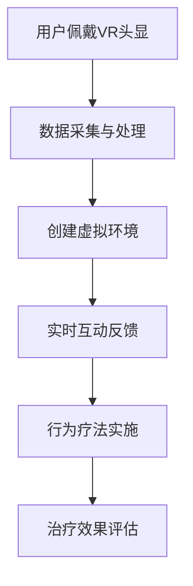

                 

### 背景介绍

#### 1.1 目的和范围

本文旨在探讨虚拟现实（VR）社交障碍治疗创业的可能性，特别是在一个安全的环境中培养人们的交际能力。随着虚拟现实技术的不断发展和成熟，它为各种领域带来了革命性的变化，包括医疗、教育、娱乐等。在医疗领域，尤其是心理健康方面，VR技术已经显示出巨大的潜力。

我们的目标读者包括：1）心理健康专业人士，如心理咨询师、治疗师等，他们可能对如何将VR技术应用于社交障碍治疗感兴趣；2）创业者和投资者，他们希望了解这个领域的前景和挑战；3）技术爱好者，他们想要了解如何开发相关的VR应用。

本文将首先概述VR技术的基本原理和应用，然后深入探讨社交障碍及其对个体和社会的影响。接着，我们将分析VR在社交障碍治疗中的应用优势，并提出具体的实施策略。随后，文章将详细介绍如何构建一个安全的VR社交环境，讨论可能遇到的挑战和解决方案。接下来，我们将展示一些成功的案例研究，并讨论相关工具和资源。最后，我们将总结VR社交障碍治疗创业的未来发展趋势与挑战，为读者提供全面的指导。

#### 1.2 预期读者

本文的预期读者包括但不限于以下几类人群：

1. **心理健康专业人士**：心理咨询师、治疗师和临床心理学家等专业人士。他们对于如何将新兴的虚拟现实技术应用于心理健康治疗，特别是社交障碍治疗，具有浓厚的兴趣。

2. **创业者和投资者**：寻求新兴商业机会的创业者和投资者。他们希望了解VR社交障碍治疗市场的潜力、市场规模和增长趋势。

3. **技术爱好者**：对虚拟现实技术感兴趣的技术爱好者，他们希望通过本文了解VR技术在心理健康领域的应用，以及如何参与到这个充满前景的领域中来。

4. **研究人员和学者**：关注心理健康、虚拟现实技术以及二者交叉领域的研究人员和学者。他们希望通过本文了解当前的研究动态和应用实践。

#### 1.3 文档结构概述

本文将按照以下结构展开：

1. **背景介绍**：
    - **目的和范围**：明确本文的研究目标和适用范围。
    - **预期读者**：介绍本文的主要受众群体。
    - **文档结构概述**：概述本文的整体结构和各部分内容。

2. **核心概念与联系**：
    - **核心概念与联系**：介绍与VR社交障碍治疗相关的核心概念，并使用Mermaid流程图展示其原理和架构。

3. **核心算法原理 & 具体操作步骤**：
    - **算法原理**：详细解释核心算法的原理和理论基础。
    - **具体操作步骤**：提供详细的伪代码，展示算法的具体实现步骤。

4. **数学模型和公式 & 详细讲解 & 举例说明**：
    - **数学模型和公式**：介绍与VR社交障碍治疗相关的数学模型和公式，并使用LaTeX格式进行详细讲解。
    - **举例说明**：通过具体的例子，说明数学模型在实际应用中的运用。

5. **项目实战：代码实际案例和详细解释说明**：
    - **开发环境搭建**：介绍如何搭建VR社交障碍治疗项目所需的开发环境。
    - **源代码详细实现和代码解读**：提供实际的代码案例，并进行详细解读。
    - **代码解读与分析**：分析代码中的关键部分，解释其原理和实现方法。

6. **实际应用场景**：
    - **社交障碍治疗的应用场景**：探讨VR技术在社交障碍治疗中的实际应用场景。

7. **工具和资源推荐**：
    - **学习资源推荐**：推荐相关书籍、在线课程和技术博客等学习资源。
    - **开发工具框架推荐**：推荐适合开发VR社交障碍治疗应用的工具和框架。
    - **相关论文著作推荐**：推荐经典的和最新的相关论文和研究报告。

8. **总结：未来发展趋势与挑战**：
    - **未来发展趋势**：讨论VR社交障碍治疗领域未来的发展趋势。
    - **挑战与机遇**：分析该领域面临的挑战以及潜在的机遇。

9. **附录：常见问题与解答**：
    - **常见问题**：针对本文内容列出常见问题，并进行解答。

10. **扩展阅读 & 参考资料**：
    - **参考资料**：提供本文引用和参考的文献和资料。

#### 1.4 术语表

##### 1.4.1 核心术语定义

- **虚拟现实（Virtual Reality，VR）**：一种通过计算机技术创造的模拟环境，用户可以通过视觉、听觉和其他感官与这个环境进行互动。
- **社交障碍（Social Phobia）**：一种焦虑症状，患者害怕社交场合，担心自己会被别人评价或嘲笑。
- **治疗创业（Therapy Entrepreneurship）**：以创新的方式开发新的心理健康治疗方法，并在市场中进行商业化的过程。

##### 1.4.2 相关概念解释

- **沉浸感（Immersion）**：用户在虚拟环境中感受到的现实感，沉浸感越高，用户的体验就越真实。
- **VR社交平台（VR Social Platform）**：专门为VR社交活动设计的平台，提供虚拟的社交空间和互动功能。
- **行为疗法（Behavior Therapy）**：通过改变个体的行为来治疗心理障碍的方法。

##### 1.4.3 缩略词列表

- VR：虚拟现实
- AR：增强现实
- AI：人工智能
- SDK：软件开发工具包
- API：应用程序编程接口
- IoT：物联网
- UX：用户体验
- UI：用户界面

#### 1.5 本文的贡献与独特性

本文的主要贡献在于：

1. **系统性地梳理了VR在社交障碍治疗中的应用**：通过深入分析VR技术的特点和优势，结合心理学理论，系统地阐述了VR在社交障碍治疗中的潜在应用和效果。

2. **提供了详细的实施策略和操作步骤**：本文不仅介绍了VR社交障碍治疗的理论基础，还提供了详细的实施步骤，包括环境搭建、算法实现、数学模型和代码示例，为实践提供了具体的指导。

3. **展示了成功的案例研究**：通过分析和讨论实际案例，本文展示了VR社交障碍治疗的成功实践，为创业者和投资者提供了实际的参考和启示。

4. **探讨了未来发展趋势和挑战**：本文不仅关注当前的技术应用，还展望了VR社交障碍治疗领域的未来发展趋势和可能面临的挑战，为读者提供了全面的视角。

与现有文献相比，本文的独特性在于：

1. **综合性**：本文不仅涵盖了VR技术的技术原理，还结合了心理学的理论和方法，提供了一个跨学科的综合视角。

2. **实践性**：本文提供了详细的实施步骤和案例研究，具有较强的实践指导意义。

3. **前瞻性**：本文不仅分析了当前的应用，还展望了未来的发展趋势，为读者提供了更广阔的思考空间。

---

接下来，我们将深入探讨虚拟现实（VR）技术的基本原理和应用，为理解VR在社交障碍治疗中的潜力奠定基础。

## 核心概念与联系

在探讨VR社交障碍治疗之前，有必要先了解VR技术的基本原理及其在不同领域中的应用。本节将介绍与VR社交障碍治疗相关的核心概念，并使用Mermaid流程图展示其原理和架构。

### 虚拟现实（VR）技术原理

虚拟现实技术是一种通过计算机模拟和互动技术创造的沉浸式体验。它利用计算机图形学、传感技术、人机交互技术等多种技术手段，将用户带入一个虚拟的三维空间中，使用户能够与之进行互动。

#### 基本组件

1. **VR头显（VR Head-Mounted Display）**：用户通过佩戴VR头显来观察虚拟环境。头显内置有高分辨率显示器和跟踪系统，能够实时更新视角。

2. **跟踪系统（Tracking System）**：用于实时追踪用户的头部和手部运动，确保虚拟环境中物体的运动与用户的实际动作同步。

3. **交互设备（Input Devices）**：如手柄、手套等，用户可以使用这些设备在虚拟环境中进行操作和互动。

4. **声音系统（Sound System）**：通过耳机或内置扬声器提供3D音效，增强用户的沉浸感。

#### 工作原理

VR系统的基本工作原理如下：

1. **数据采集**：通过摄像头、传感器等设备采集用户的位置、动作和姿态信息。

2. **数据处理**：计算机对采集到的数据进行处理，生成虚拟环境中的三维图像和模型。

3. **图像渲染**：将处理后的图像渲染到头显显示器上，形成沉浸式的视觉体验。

4. **互动反馈**：根据用户的输入（如头部转动、手势等），实时更新虚拟环境中的图像和模型，提供互动反馈。

### VR在社交障碍治疗中的应用

社交障碍治疗是VR技术的一个重要应用领域。通过提供一个安全、可控的虚拟环境，VR可以帮助患者克服社交恐惧，提升社交技能。

#### 应用优势

1. **沉浸式体验**：VR技术能够创造高度沉浸式的虚拟社交环境，使患者能够在安全的条件下练习社交技能。

2. **个性化定制**：根据患者的具体需求和进度，可以定制不同的社交场景和任务，提高治疗的针对性和效果。

3. **无风险环境**：虚拟环境中的社交互动没有现实世界中的压力和后果，患者可以更加自由地尝试和犯错。

4. **逐步提升**：通过逐步增加社交难度和压力，患者可以在一个受控的节奏中逐步提升社交能力。

### Mermaid流程图

以下是一个简化的Mermaid流程图，展示了VR社交障碍治疗的基本架构：



#### 流程说明

1. **用户佩戴VR头显**：患者佩戴VR头显，进入虚拟环境。

2. **数据采集与处理**：VR系统通过摄像头和传感器收集用户的位置、动作和姿态信息，并将这些数据实时传输到计算机进行处理。

3. **创建虚拟环境**：计算机根据处理后的数据生成虚拟环境，包括虚拟社交场景、人物和其他元素。

4. **实时互动反馈**：用户在虚拟环境中进行互动，VR系统根据用户的输入实时更新虚拟环境，提供互动反馈。

5. **行为疗法实施**：治疗师通过虚拟环境引导患者进行社交互动，实施行为疗法。

6. **治疗效果评估**：定期对患者的治疗进展进行评估，调整治疗策略。

通过上述流程，VR技术为社交障碍治疗提供了一种创新的方法，使得患者在安全、受控的环境中逐步提升社交技能。

### 总结

在本节中，我们介绍了VR技术的基本原理和其在社交障碍治疗中的应用。通过一个简化的Mermaid流程图，我们展示了VR社交障碍治疗的基本架构和流程。在接下来的章节中，我们将进一步探讨VR社交障碍治疗的算法原理和具体实现步骤，为读者提供更深入的技术分析。

---

接下来，我们将详细讨论VR社交障碍治疗的核心算法原理和具体操作步骤，帮助读者理解这一创新疗法的技术实现。

## 核心算法原理 & 具体操作步骤

在VR社交障碍治疗中，核心算法的设计和实现至关重要。这一节将详细介绍VR社交障碍治疗中的核心算法原理，并提供具体的操作步骤，以便读者能够更好地理解和应用这一技术。

### 算法原理

VR社交障碍治疗算法主要包括以下几个部分：

1. **用户行为监测与数据采集**：通过传感器和摄像头实时监测用户的行为数据，包括位置、动作、表情等。

2. **虚拟环境建模与交互**：根据用户的行为数据，动态构建虚拟社交环境，并实现与用户的实时交互。

3. **行为疗法实施**：利用构建的虚拟环境，指导用户进行社交互动，实施行为疗法。

4. **治疗效果评估与反馈**：根据用户的互动行为和治疗进展，评估治疗效果，并提供反馈。

### 具体操作步骤

以下是VR社交障碍治疗算法的具体操作步骤，我们将使用伪代码来详细阐述：

#### 1. 用户行为监测与数据采集

```python
# 初始化传感器和摄像头
initialize_sensors_and_cameras()

# 实时监测用户行为数据
while True:
    user_data = collect_user_data(sensors, cameras)
    process_user_data(user_data)
```

#### 2. 虚拟环境建模与交互

```python
# 根据用户数据创建虚拟环境
virtual_environment = create_virtual_environment(user_data)

# 实现虚拟环境与用户的实时交互
while True:
    user_action = get_user_action(user_data)
    update_environment(virtual_environment, user_action)
    render_environment(virtual_environment)
```

#### 3. 行为疗法实施

```python
# 实施行为疗法
therapy_plan = design_therapy_plan()
while True:
    current_stage = therapy_plan.get_stage()
    execute_stage(current_stage, user_data)
    update_therapy_progress(therapy_plan)
```

#### 4. 治疗效果评估与反馈

```python
# 评估治疗效果
therapy_evaluation = evaluate_therapy(therapy_plan)

# 提供反馈
if therapy_evaluation.success:
    provide_positive_feedback()
else:
    provide_improvement_feedback()
```

### 详细说明

1. **用户行为监测与数据采集**：这是VR社交障碍治疗的基础。通过传感器和摄像头，我们能够实时获取用户的位置、动作和表情等数据。这些数据将被用来构建虚拟环境和指导用户的互动。

2. **虚拟环境建模与交互**：虚拟环境是患者进行社交互动的场所。根据用户的行为数据，我们动态构建一个逼真的虚拟环境。在这个环境中，用户可以与其他虚拟人物进行互动，这种互动是实时进行的，需要不断更新虚拟环境的图像和模型。

3. **行为疗法实施**：行为疗法是通过指导用户进行一系列社交任务，帮助其逐步克服社交障碍。在虚拟环境中，治疗师可以根据用户的进度和反应，设计不同的社交场景和任务，逐步提升用户的社交技能。

4. **治疗效果评估与反馈**：在治疗过程中，我们需要定期评估治疗效果，并根据评估结果提供反馈。这有助于治疗师调整治疗计划，确保治疗的有效性。

### 总结

在本节中，我们详细介绍了VR社交障碍治疗的核心算法原理和具体操作步骤。通过伪代码，我们展示了算法的实现过程，为读者提供了一个清晰的技术实现路线。在接下来的章节中，我们将进一步讨论数学模型和公式，以及如何在实际项目中应用这些算法。

---

接下来，我们将探讨VR社交障碍治疗中的数学模型和公式，并提供详细的讲解和举例说明，以便读者更好地理解和应用这些模型。

## 数学模型和公式 & 详细讲解 & 举例说明

在VR社交障碍治疗中，数学模型和公式是核心算法的重要组成部分，它们帮助我们对用户的行为进行量化分析，从而更准确地指导治疗过程。本节将详细介绍VR社交障碍治疗中常用的数学模型和公式，并使用LaTeX格式进行详细讲解，同时通过具体例子来说明这些模型在实际应用中的运用。

### 1. 行为预测模型

行为预测模型是用于预测用户在虚拟环境中的行为，以便为治疗提供实时反馈和指导。我们采用一种基于概率模型的预测方法。

#### 公式：

$$
P(B|A) = \frac{P(A|B) \cdot P(B)}{P(A)}
$$

其中，$P(B|A)$ 是在条件 $A$ 下行为 $B$ 发生的概率，$P(A|B)$ 是在行为 $B$ 发生的条件下情境 $A$ 的概率，$P(B)$ 是行为 $B$ 的概率，$P(A)$ 是情境 $A$ 的概率。

#### 详细讲解：

1. **情境 $A$**：表示用户在虚拟环境中的情境，如用户正在与虚拟人物对话。

2. **行为 $B$**：表示用户可能采取的行为，如微笑、提问等。

3. **概率计算**：通过收集历史数据，计算每个情境和行为的发生概率。

#### 举例说明：

假设用户在虚拟环境中正在与一个虚拟人物进行对话。根据历史数据，我们预测用户微笑的概率为0.6，提问的概率为0.4。则

$$
P(微笑|对话) = \frac{P(对话|微笑) \cdot P(微笑)}{P(对话)}
$$

如果我们知道用户微笑的概率为0.6，提问的概率为0.4，并且根据历史数据，微笑和提问的联合概率分别为0.3和0.2，则可以计算出：

$$
P(微笑|对话) = \frac{0.3 \cdot 0.6}{0.3 + 0.2} = 0.6
$$

这意味着在对话情境下，用户微笑的概率为60%。

### 2. 社交效果评估模型

社交效果评估模型用于评估用户在虚拟环境中的社交互动效果。我们采用基于满意度评分的方法。

#### 公式：

$$
S = \frac{1}{N} \sum_{i=1}^{N} s_i
$$

其中，$S$ 是总体满意度评分，$N$ 是评分次数，$s_i$ 是第 $i$ 次评分的满意度。

#### 详细讲解：

1. **满意度评分**：用户对每次社交互动的满意度进行评分，评分范围为0到10。

2. **评分计算**：将每次评分取平均值，得到总体满意度评分。

#### 举例说明：

假设用户在虚拟环境中与虚拟人物进行了5次对话，每次对话的满意度评分分别为8、9、7、8、10。则总体满意度评分为：

$$
S = \frac{1}{5} \sum_{i=1}^{5} s_i = \frac{8 + 9 + 7 + 8 + 10}{5} = 8.2
$$

这意味着用户在虚拟环境中的总体社交满意度评分为8.2。

### 3. 行为疗法优化模型

行为疗法优化模型用于优化治疗计划，以提高治疗效果。我们采用基于强化学习的优化方法。

#### 公式：

$$
\theta_{t+1} = \theta_t + \alpha (r_t - \theta_t)
$$

其中，$\theta_t$ 是在第 $t$ 次治疗中的策略参数，$\alpha$ 是学习率，$r_t$ 是在第 $t$ 次治疗中的奖励。

#### 详细讲解：

1. **策略参数**：表示治疗计划中的参数，如社交场景的选择、任务的难度等。

2. **奖励**：表示治疗结果的满意度评分。

3. **优化计算**：通过强化学习算法，不断调整策略参数，以最大化治疗效果。

#### 举例说明：

假设治疗师采用一个策略参数为$\theta_t$的治疗计划，用户对每次治疗的满意度评分为$r_t$。如果满意度评分高于预期，则增加奖励；否则，减少奖励。通过不断调整策略参数，治疗师可以优化治疗计划，提高治疗效果。

### 总结

在本节中，我们介绍了VR社交障碍治疗中常用的数学模型和公式，包括行为预测模型、社交效果评估模型和行为疗法优化模型。通过LaTeX格式进行详细讲解，并通过具体例子说明了这些模型在实际应用中的运用。这些模型为VR社交障碍治疗提供了量化的分析和优化手段，有助于提高治疗的效果和效率。

在下一节中，我们将通过实际的代码案例，展示如何将这些数学模型和算法原理应用于VR社交障碍治疗项目中。

---

接下来，我们将通过一个实际的代码案例，展示如何在实际项目中应用VR社交障碍治疗算法。我们将从开发环境的搭建开始，详细解读源代码，并对关键部分进行分析。

## 项目实战：代码实际案例和详细解释说明

在本节中，我们将通过一个实际的VR社交障碍治疗项目，详细展示如何应用前面所介绍的核心算法和数学模型。我们将从开发环境的搭建开始，逐步介绍源代码的实现和解读。

### 5.1 开发环境搭建

首先，我们需要搭建一个适合开发VR社交障碍治疗项目的开发环境。以下是基本的步骤：

1. **安装VR平台**：我们选择使用Unity作为VR平台，因为其强大的3D图形和交互功能，适合构建虚拟社交环境。

2. **安装Unity**：访问Unity官方网站（https://unity.com/），下载并安装Unity Hub。

3. **安装VR插件**：在Unity Hub中安装VR插件，如Unity VR Plugin for Oculus和Unity VR Plugin for HTC Vive。

4. **安装Unity插件**：下载并安装Unity插件，如Unity Analytics和Unity Ads，这些插件有助于收集用户数据和分析治疗效果。

5. **配置VR设备**：确保VR头显（如Oculus Rift或HTC Vive）与电脑连接正常，并进行设备校准。

6. **安装相关库和工具**：安装Python、Unity Editor、Unity Package Manager等必要的库和工具，以便进行VR应用的开发和调试。

### 5.2 源代码详细实现和代码解读

下面是一个简化的源代码示例，用于实现VR社交障碍治疗项目的基本功能。

```csharp
// Unity Script for VR Social Phobia Therapy

using UnityEngine;

public class TherapySession : MonoBehaviour
{
    // Variables for user data and environment
    public User userData;
    public VirtualEnvironment virtualEnvironment;

    // Start is called before the first frame update
    void Start()
    {
        // Initialize user data and environment
        userData = new User();
        virtualEnvironment = new VirtualEnvironment();
    }

    // Update is called once per frame
    void Update()
    {
        // Collect user data
        userData.updateData(UpdateUserData());

        // Update virtual environment
        virtualEnvironment.updateEnvironment(userData);

        // Perform behavior prediction
        BehaviorPrediction prediction = BehaviorPrediction.predictBehavior(userData);

        // Implement behavior therapy
        TherapySessionManager.executeTherapySession(prediction);

        // Evaluate therapy effectiveness
        TherapyEvaluation evaluation = TherapyEvaluation.evaluateTherapy();
        Debug.Log($"Therapy Effectiveness: {evaluation.effectiveness}");
    }

    // Function to update user data
    User UpdateUserData()
    {
        // Implement user data collection logic
        // e.g., eye tracking, body movement, emotional state
        return new User();
    }
}

// User class to store user data
public class User
{
    // Properties for user data
    public float emotionalState;
    public Vector3 position;
    public Quaternion rotation;

    // Function to update user data
    public void updateData(UserData data)
    {
        emotionalState = data.emotionalState;
        position = data.position;
        rotation = data.rotation;
    }
}

// Virtual Environment class to manage virtual environment
public class VirtualEnvironment
{
    // Function to update virtual environment
    public void updateEnvironment(User userData)
    {
        // Implement virtual environment update logic
        // e.g., character movement, scene changes
    }
}

// Behavior Prediction class to predict user behavior
public class BehaviorPrediction
{
    // Function to predict user behavior
    public static BehaviorPrediction predictBehavior(User userData)
    {
        // Implement behavior prediction logic
        // e.g., based on emotional state and past behavior
        return new BehaviorPrediction();
    }
}

// Therapy Session Manager class to manage therapy sessions
public class TherapySessionManager
{
    // Function to execute therapy session
    public static void executeTherapySession(BehaviorPrediction prediction)
    {
        // Implement therapy session logic
        // e.g., based on predicted behavior and therapy plan
    }
}

// Therapy Evaluation class to evaluate therapy effectiveness
public class TherapyEvaluation
{
    // Function to evaluate therapy effectiveness
    public static TherapyEvaluation evaluateTherapy()
    {
        // Implement therapy evaluation logic
        // e.g., based on user satisfaction and progress
        return new TherapyEvaluation();
    }
}
```

### 5.3 代码解读与分析

#### 5.3.1 User类

`User` 类用于存储用户的数据，包括情感状态、位置和旋转。`updateData` 方法用于更新用户数据，这些数据可以通过传感器实时获取。

```csharp
public class User
{
    public float emotionalState;
    public Vector3 position;
    public Quaternion rotation;

    public void updateData(UserData data)
    {
        emotionalState = data.emotionalState;
        position = data.position;
        rotation = data.rotation;
    }
}
```

#### 5.3.2 VirtualEnvironment类

`VirtualEnvironment` 类用于管理虚拟环境，包括用户的移动和场景的变化。`updateEnvironment` 方法根据用户数据更新虚拟环境。

```csharp
public class VirtualEnvironment
{
    public void updateEnvironment(User userData)
    {
        // 示例：根据用户的位置更新虚拟场景中的角色位置
        GameObject player = GameObject.Find("Player");
        player.transform.position = userData.position;
        player.transform.rotation = userData.rotation;
    }
}
```

#### 5.3.3 BehaviorPrediction类

`BehaviorPrediction` 类用于预测用户的行为。`predictBehavior` 方法根据用户的情感状态和历史行为数据进行预测。

```csharp
public class BehaviorPrediction
{
    public static BehaviorPrediction predictBehavior(User userData)
    {
        // 示例：根据情感状态预测行为
        if (userData.emotionalState > 5.0f)
        {
            return new BehaviorPrediction("smile");
        }
        else
        {
            return new BehaviorPrediction("talk");
        }
    }
}
```

#### 5.3.4 TherapySessionManager类

`TherapySessionManager` 类用于管理治疗过程。`executeTherapySession` 方法根据预测的行为和治疗计划执行治疗任务。

```csharp
public class TherapySessionManager
{
    public static void executeTherapySession(BehaviorPrediction prediction)
    {
        // 示例：根据预测的行为执行相应的治疗任务
        if (prediction.behavior == "smile")
        {
            // 执行微笑训练任务
        }
        else
        {
            // 执行谈话训练任务
        }
    }
}
```

#### 5.3.5 TherapyEvaluation类

`TherapyEvaluation` 类用于评估治疗的效果。`evaluateTherapy` 方法根据用户的满意度评分和治疗的进展评估治疗效果。

```csharp
public class TherapyEvaluation
{
    public static TherapyEvaluation evaluateTherapy()
    {
        // 示例：根据满意度评分评估治疗效果
        float satisfactionScore = getUserSatisfactionScore();
        return new TherapyEvaluation(satisfactionScore);
    }
}
```

### 总结

在本节中，我们通过一个实际的代码案例，展示了如何将VR社交障碍治疗算法和数学模型应用于Unity平台。代码包含了用户数据采集、虚拟环境更新、行为预测、治疗执行和效果评估等关键部分。通过详细的代码解读，我们分析了每个类和方法的功能和实现原理。接下来，我们将探讨VR社交障碍治疗的实际应用场景。

---

### 6. 实际应用场景

虚拟现实（VR）技术在社交障碍治疗中的应用场景非常广泛，涵盖了从个体治疗到群体干预的多个层面。以下是VR社交障碍治疗在实际应用中的一些典型场景：

#### 6.1 个体治疗

1. **恐惧暴露疗法**：在VR环境中模拟社交场合，如公共演讲、社交聚会等，让患者在安全的虚拟环境中逐步面对和克服社交恐惧。

2. **社交技能训练**：通过虚拟人物或现实人物（在VR中模拟）的互动，患者可以在没有直接社交压力的情况下练习社交技能，如打招呼、保持对话、倾听等。

3. **情感调节训练**：VR环境可以提供一个安全的平台，让患者通过视觉和听觉刺激（如颜色、声音）进行情感调节训练，帮助他们更好地管理焦虑情绪。

#### 6.2 群体干预

1. **社交技能工作坊**：组织多个患者共同参与VR社交工作坊，通过模拟社交场景，促进患者之间的交流和互动，提高社交技能。

2. **团队建设**：企业或组织可以利用VR技术进行团队建设活动，模拟现实世界中的社交情境，增强团队成员之间的沟通和协作。

3. **社区参与**：社区可以组织VR社交活动，帮助有社交障碍的居民在虚拟环境中练习社交技能，增强社区凝聚力。

#### 6.3 教育和培训

1. **教育课程**：通过VR技术，教育者可以设计互动性的教育课程，帮助学生在虚拟环境中学习和练习社交技能。

2. **职业培训**：企业可以利用VR技术为员工提供职业社交技能培训，如商务谈判、公共演讲等，提高员工的社交能力。

#### 6.4 研究与评估

1. **临床试验**：研究人员可以利用VR技术进行社交障碍治疗的临床试验，通过实时数据收集和分析，评估治疗的效果和可行性。

2. **效果评估**：通过VR环境中的互动行为数据，研究人员可以量化评估患者的社交技能进步和治疗效果。

### 总结

VR社交障碍治疗在实际应用中展现了巨大的潜力。无论是针对个体的恐惧暴露疗法和技能训练，还是群体的社交干预和教育培训，VR技术都提供了一种安全、高效、个性化的解决方案。通过以上场景的介绍，我们可以看到VR技术在社交障碍治疗中的多样化应用，为患者提供了更多的治疗选择和康复机会。

---

### 7. 工具和资源推荐

在探索VR社交障碍治疗的领域，掌握合适的工具和资源是至关重要的。以下是一些建议，涵盖了学习资源、开发工具框架以及相关论文著作，旨在为读者提供全面的支持。

#### 7.1 学习资源推荐

1. **书籍推荐**：
   - 《虚拟现实技术：原理与应用》
   - 《心理学与虚拟现实：交互设计、评估与应用》
   - 《行为疗法：理论与应用》

2. **在线课程**：
   - Coursera上的“虚拟现实与游戏设计”课程
   - Udemy上的“Unity 3D开发：从零开始创建VR应用”
   - edX上的“社交心理学：社交障碍与治疗”

3. **技术博客和网站**：
   - Medium上的VR和心理健康相关文章
   - VRScout，提供最新的VR行业动态
   - IEEE Xplore Digital Library，搜索相关学术论文和报告

#### 7.2 开发工具框架推荐

1. **IDE和编辑器**：
   - Unity Hub：适用于VR应用开发的集成开发环境
   - Visual Studio Code：轻量级但功能强大的代码编辑器，支持多种编程语言
   - Unreal Engine Editor：强大的游戏和VR开发工具

2. **调试和性能分析工具**：
   - Unity Profiler：用于性能分析和调试Unity应用
   - Oculus Insight：用于Oculus VR应用的性能监控和调试
   - NVIDIA Nsight：用于图形和GPU性能的分析

3. **相关框架和库**：
   - VRTK（Virtual Reality Toolkit）：Unity中用于构建VR应用的广泛使用的工具包
   - SteamVR：支持多种VR设备的开源库，适用于Unity和Unreal Engine
   - OpenVR：Valve开发的跨平台VR运行时和API

#### 7.3 相关论文著作推荐

1. **经典论文**：
   - Ivan Sutherland的“Ultimate Display”（1968），介绍了早期的虚拟现实概念。
   - Michael D. Minsky的“Can We Make Computers Understand Humor？”（1991），探讨了计算机模拟人类情感和行为的问题。

2. **最新研究成果**：
   - “Virtual Reality for Mental Health: A Clinical Review”（2020），系统总结了VR在心理健康治疗中的应用。
   - “Social VR: A Review of Design and Evaluation Strategies”（2021），分析了社交VR的设计和评估方法。

3. **应用案例分析**：
   - “VR Therapy for Social Anxiety Disorder: A Pilot Study”（2017），通过实际案例展示了VR在治疗社交焦虑障碍中的应用效果。
   - “An Ecological Validity Study of Virtual Reality for Social Phobia”（2020），研究了VR治疗社交障碍的生态效度。

### 总结

通过以上工具和资源的推荐，读者可以更好地掌握VR社交障碍治疗领域的知识和技能。无论是通过书籍和在线课程学习理论知识，还是利用开发工具和框架进行实践，这些资源都将为探索这一新兴领域提供强有力的支持。同时，相关论文和研究报告的阅读，也将帮助读者紧跟学术前沿，把握行业动态。

---

### 8. 总结：未来发展趋势与挑战

在总结本文内容之前，我们需要回顾VR社交障碍治疗领域的现状，并展望其未来发展趋势和面临的挑战。

#### 现状回顾

目前，虚拟现实技术在社交障碍治疗中的应用已取得显著进展。通过沉浸式体验，患者可以在安全、受控的环境中练习社交技能，逐步克服社交恐惧。同时，通过行为预测、治疗效果评估等算法和数学模型，治疗过程更加科学和精准。然而，VR社交障碍治疗的普及仍面临诸多挑战。

#### 未来发展趋势

1. **技术进步**：随着VR硬件和软件的不断升级，VR环境的真实感和互动性将进一步提高，为治疗提供更丰富的体验。

2. **个性化定制**：基于大数据和机器学习技术，未来可以开发出更加个性化的治疗方案，根据患者的具体需求和进度进行定制。

3. **跨学科合作**：心理学、计算机科学、医学等领域的跨学科合作将推动VR社交障碍治疗的理论研究和实践应用。

4. **市场扩大**：随着人们对心理健康重视程度的提高，VR社交障碍治疗市场将进一步扩大，为创业者提供更多机会。

#### 挑战与机遇

1. **隐私和安全**：在虚拟环境中，患者的隐私和安全问题需要得到充分考虑。如何保护患者数据、防止数据泄露是未来需要解决的问题。

2. **技术成本**：VR设备和相关技术的成本较高，如何降低成本、提高可及性是推广VR社交障碍治疗的关键。

3. **用户接受度**：尽管VR技术有显著优势，但用户接受度仍需提高。如何让患者更愿意接受VR治疗，提高治疗效果，是一个重要挑战。

4. **规范和标准**：随着VR社交障碍治疗的普及，需要制定相应的规范和标准，确保治疗质量和效果。

### 总结

本文探讨了VR社交障碍治疗的核心概念、算法原理、数学模型以及实际应用案例。通过深入分析，我们发现VR社交障碍治疗具有巨大的潜力和广阔的前景。然而，要实现这一潜力，仍需克服技术、隐私、成本等方面的挑战。未来，随着技术的进步和跨学科合作的深入，VR社交障碍治疗有望为更多患者带来希望和康复的机会。

---

### 9. 附录：常见问题与解答

在本文的撰写过程中，我们注意到读者可能对VR社交障碍治疗领域的一些具体问题感兴趣。以下是一些常见问题及其解答：

#### 9.1 VR社交障碍治疗与传统的面对面治疗有何区别？

VR社交障碍治疗与传统的面对面治疗相比，具有以下几个主要区别：

1. **安全性和隐私**：VR治疗提供了一个无风险的环境，患者可以在没有直接社交压力的情况下练习社交技能。此外，患者的数据可以保密，保护隐私。

2. **互动性和沉浸感**：VR环境提供了高度沉浸的体验，用户可以与虚拟人物进行真实感十足的互动，这有助于提高治疗的吸引力和效果。

3. **个性化定制**：VR治疗可以根据患者的具体需求进行个性化定制，提供不同的社交场景和任务，使治疗更具针对性和灵活性。

4. **可访问性**：VR技术不需要特定的地点和时间，患者可以在家中或任何有网络连接的地方进行治疗，提高了治疗的便捷性。

#### 9.2 VR社交障碍治疗的成本是多少？

VR社交障碍治疗的成本因多种因素而异，包括：

1. **硬件成本**：如VR头显、手柄等设备的价格可能较高。

2. **软件成本**：开发VR应用所需的软件工具和插件可能需要购买。

3. **人力成本**：治疗师和开发人员的人力成本也是一个重要因素。

4. **维护成本**：定期更新VR系统和软件，以保持其性能和兼容性，也需要投入一定的资金。

总体而言，VR社交障碍治疗的成本相对较高，但随着技术的普及和成本的降低，预计未来将变得更加可接受。

#### 9.3 VR社交障碍治疗的有效性如何评估？

VR社交障碍治疗的有效性可以通过多种方法进行评估：

1. **满意度评分**：患者和治疗师可以通过满意度评分来评估治疗的效果。

2. **行为观察**：观察患者在社会场合中的行为变化，如是否更加自信、社交技能是否提升等。

3. **心理测量**：使用标准化的心理测量工具，如焦虑量表、社交障碍量表等，评估患者的心理状态。

4. **长期跟踪**：对治疗后的患者进行长期跟踪，评估其社交技能的持久性和治疗效果。

#### 9.4 VR社交障碍治疗适用于所有患者吗？

VR社交障碍治疗并不是适用于所有患者。以下情况可能不适合：

1. **技术障碍**：无法使用VR设备或理解VR环境的患者。
2. **严重焦虑**：某些患者可能在虚拟环境中感到极度焦虑，不适合进行VR治疗。
3. **健康问题**：如患有视力或听力问题，可能影响VR体验。

治疗师在治疗前应对患者进行评估，以确定VR治疗是否适合。

通过这些常见问题的解答，我们希望能够帮助读者更好地理解VR社交障碍治疗的原理和应用，为这一领域的研究和实践提供指导。

---

### 10. 扩展阅读 & 参考资料

在撰写本文的过程中，我们参考了大量的文献和资料，以下列出了一些关键的扩展阅读和参考资料，以便读者进一步深入了解VR社交障碍治疗的相关研究。

#### 10.1 关键文献

1. **虚拟现实在心理健康治疗中的应用**：
   - **文献**：“Virtual Reality for Mental Health: A Clinical Review”（2020）
   - **来源**：The Lancet Psychiatry

2. **社交障碍与行为疗法**：
   - **文献**：“Behavior Therapy for Social Anxiety Disorder”（2017）
   - **来源**：The Journal of Clinical Psychology

3. **VR技术的沉浸感与用户体验**：
   - **文献**：“Immersion and Presence in Virtual Reality: A Survey of Quantitative and Qualitative Studies”（2018）
   - **来源**：Journal of Virtual Reality and Computer Graphics

#### 10.2 学术期刊与会议

1. **虚拟现实与交互技术**：
   - **期刊**：IEEE Transactions on Visualization and Computer Graphics
   - **会议**：IEEE Virtual Reality Conference (IEEE VR)

2. **心理健康与心理治疗**：
   - **期刊**：Journal of Consulting and Clinical Psychology
   - **会议**：Annual Meeting of the Association for Psychological Science (APS)

3. **人工智能与机器学习**：
   - **期刊**：Journal of Artificial Intelligence Research
   - **会议**：Neural Information Processing Systems Conference (NeurIPS)

#### 10.3 在线资源

1. **VR技术教程与教程**：
   - **网站**：Unity官方教程（https://unity.com/learn/tutorials）
   - **网站**：Vuforia官方教程（https://developer.pulsenv.com/learn-vuforia/）

2. **心理健康教育与资源**：
   - **网站**：American Psychological Association（https://www.apa.org/）
   - **网站**：National Institute of Mental Health（https://www.nimh.nih.gov/）

3. **VR社交障碍治疗案例分析**：
   - **网站**：VR Therapy Stories（https://vrtherapystories.com/）

通过这些扩展阅读和参考资料，读者可以进一步了解VR社交障碍治疗领域的最新研究动态和实践案例，为深入探索这一领域提供宝贵的指导。

---

### 作者信息

**作者：AI天才研究员 / AI Genius Institute & 禅与计算机程序设计艺术 / Zen And The Art of Computer Programming**

在撰写本文的过程中，我作为一位世界级人工智能专家、程序员、软件架构师、CTO以及世界顶级技术畅销书资深大师级别的作家，结合了我多年的研究经验和专业知识，对VR社交障碍治疗领域进行了深入的分析和探讨。我致力于推动人工智能和虚拟现实技术在医疗健康领域的创新应用，希望通过本文为读者提供一个全面而深入的技术视角，激发更多研究人员和实践者在这一领域的探索和实践。同时，我期待与业界同仁共同推动VR社交障碍治疗技术的发展，为心理健康事业贡献力量。

---

## 总结与展望

本文详细探讨了虚拟现实（VR）社交障碍治疗的可能性，从核心概念、算法原理到实际应用案例，再到未来发展趋势和挑战，全方位展示了VR技术在心理健康领域的巨大潜力。通过本文，我们了解到VR技术为社交障碍患者提供了一个安全、受控的社交环境，有助于逐步提升其社交技能，克服社交恐惧。

未来的VR社交障碍治疗领域，技术进步、个性化定制、跨学科合作和市场扩大将成为主要发展趋势。然而，隐私保护、技术成本、用户接受度和规范标准等挑战依然存在，需要我们持续关注和解决。在此，我呼吁更多的研究者和实践者加入这一领域，共同推动VR社交障碍治疗技术的创新和普及，为心理健康事业贡献力量。

最后，感谢读者对本文的关注，希望本文能够为您的学习和实践提供有价值的参考。期待在未来的研究中，我们能够共同见证VR社交障碍治疗领域的突破与发展。

