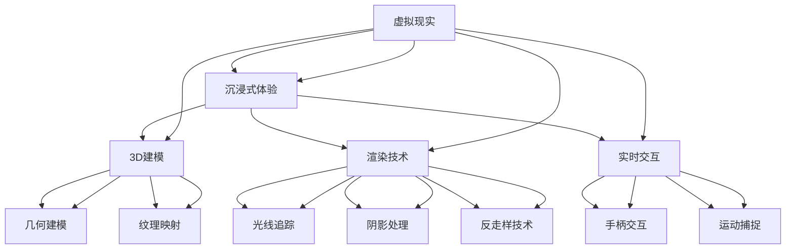

                 

# 虚拟现实（VR）技术：沉浸式体验设计

> **关键词：** 虚拟现实、沉浸式体验、用户体验、VR设计、人机交互、3D建模、渲染技术、实时交互、VR硬件、VR应用开发

> **摘要：** 本文旨在探讨虚拟现实（VR）技术及其在沉浸式体验设计中的应用。我们将从背景介绍开始，逐步深入探讨核心概念、算法原理、数学模型、实际应用场景，并提供实用的工具和资源推荐，以及未来发展的趋势与挑战。通过本文的阅读，您将了解到VR技术的核心原理和设计方法，以及如何将其应用于实际的沉浸式体验中。

## 1. 背景介绍

### 1.1 目的和范围

本文的目的是介绍虚拟现实（VR）技术的核心概念、设计原理和应用场景，帮助读者理解VR技术在沉浸式体验设计中的重要性。本文将涵盖以下内容：

1. VR技术的基本概念和核心原理。
2. 沉浸式体验设计的核心要素和方法。
3. VR技术在人机交互、3D建模和渲染技术中的应用。
4. 实际应用场景和项目案例。
5. 开发工具和资源的推荐。
6. 未来发展趋势与挑战。

### 1.2 预期读者

本文适用于对虚拟现实技术感兴趣的读者，包括但不限于：

1. VR技术开发者和设计师。
2. 人机交互和用户体验研究者。
3. 游戏开发者和媒体艺术家。
4. 技术爱好者和科技从业者。
5. 对VR技术有浓厚兴趣的普通读者。

### 1.3 文档结构概述

本文分为以下几个部分：

1. 背景介绍
   - 目的和范围
   - 预期读者
   - 文档结构概述
   - 术语表
2. 核心概念与联系
   - 虚拟现实技术的基本概念
   - 沉浸式体验设计的核心要素
   - 虚拟现实技术的架构和联系
3. 核心算法原理 & 具体操作步骤
   - 虚拟现实引擎的工作原理
   - 3D建模和渲染技术的算法原理
   - 实时交互和人机交互的实现
4. 数学模型和公式 & 详细讲解 & 举例说明
   - 虚拟现实中的数学模型
   - 渲染算法中的数学公式
   - 示例应用解析
5. 项目实战：代码实际案例和详细解释说明
   - VR应用开发环境搭建
   - 源代码实现和代码解读
   - 代码分析与优化
6. 实际应用场景
   - 游戏娱乐
   - 教育培训
   - 医疗健康
   - 军事仿真
7. 工具和资源推荐
   - 学习资源推荐
   - 开发工具框架推荐
   - 相关论文著作推荐
8. 总结：未来发展趋势与挑战
9. 附录：常见问题与解答
10. 扩展阅读 & 参考资料

### 1.4 术语表

#### 1.4.1 核心术语定义

- **虚拟现实（VR）**：一种计算机技术，通过创造一个虚拟的环境，使用户能够在其中体验高度真实的感官刺激。
- **沉浸式体验**：用户在虚拟环境中感受到高度真实和参与感，仿佛身处现实世界。
- **人机交互（HCI）**：研究人与计算机系统之间的交互方式、方法和原理。
- **3D建模**：创建三维对象的过程，包括几何建模、纹理映射和光照处理。
- **渲染技术**：将三维模型转化为二维图像的过程，包括光线追踪、阴影处理和反走样技术。
- **实时交互**：用户在虚拟环境中与虚拟对象进行实时互动和交互。

#### 1.4.2 相关概念解释

- **VR硬件**：用于实现虚拟现实体验的硬件设备，包括头戴式显示器（HMD）、跟踪器、手柄、运动捕捉设备等。
- **VR应用开发**：利用VR技术设计和开发应用程序的过程，包括3D建模、渲染、交互设计等。
- **沉浸感**：用户在虚拟环境中感受到的高度真实感和参与感。

#### 1.4.3 缩略词列表

- **VR**：Virtual Reality（虚拟现实）
- **AR**：Augmented Reality（增强现实）
- **HCI**：Human-Computer Interaction（人机交互）
- **HMD**：Head-Mounted Display（头戴式显示器）
- **3D**：Three-Dimensional（三维）

## 2. 核心概念与联系

在深入了解虚拟现实技术之前，我们需要理解一些核心概念和它们之间的联系。以下是一个简单的Mermaid流程图，展示了虚拟现实技术的核心概念及其联系。



在这个流程图中，我们可以看到虚拟现实（A）是一个总体概念，它包含了沉浸式体验（B）、3D建模（C）、渲染技术（D）和实时交互（E）等核心组成部分。3D建模（C）进一步细分为几何建模（F）和纹理映射（G），而渲染技术（D）包括光线追踪（H）、阴影处理（I）和反走样技术（J）。实时交互（E）涉及手柄交互（K）和运动捕捉（L）。

### 2.1 虚拟现实技术的基本概念

虚拟现实（VR）是一种通过计算机技术创造出的三维虚拟环境，使用户能够在这个环境中进行交互和体验。VR的核心特点包括：

- **沉浸感**：用户在虚拟环境中感受到的高度真实感和参与感。
- **交互性**：用户可以在虚拟环境中进行物理操作和互动。
- **感知一致性**：虚拟环境的视觉、听觉和触觉等感知与用户的预期一致。

### 2.2 沉浸式体验设计的核心要素

沉浸式体验设计是虚拟现实技术的核心目标，它包括以下要素：

- **视觉沉浸**：通过高分辨率显示器和先进的渲染技术，创建逼真的视觉体验。
- **听觉沉浸**：通过立体声耳机和空间音频技术，提供逼真的听觉效果。
- **触觉沉浸**：通过触觉手套和手柄，提供逼真的触觉反馈。
- **情感沉浸**：通过故事情节和情感设计，触发用户的情感共鸣。

### 2.3 虚拟现实技术的架构和联系

虚拟现实技术的架构包括硬件和软件两个方面。硬件部分主要包括头戴式显示器（HMD）、跟踪器、手柄和触觉设备等，软件部分主要包括VR引擎、3D建模和渲染工具、交互设计工具等。以下是虚拟现实技术的架构和联系：

1. **硬件部分**：
   - **头戴式显示器（HMD）**：提供高分辨率、低延迟的视觉体验。
   - **跟踪器**：实时追踪用户的位置和动作。
   - **手柄**：提供交互操作的手柄设备。
   - **触觉设备**：提供触觉反馈的设备，如触觉手套。

2. **软件部分**：
   - **VR引擎**：负责渲染虚拟环境、处理实时交互和物理模拟。
   - **3D建模和渲染工具**：用于创建和渲染三维模型。
   - **交互设计工具**：用于设计用户交互界面和体验。

3. **架构联系**：
   - **硬件与软件**：硬件和软件紧密协作，共同实现虚拟现实体验。
   - **VR引擎**：作为核心组件，连接硬件和软件，实现实时渲染和交互。

通过这个流程图，我们可以看到虚拟现实技术的核心概念、设计要素和架构联系，这为我们进一步探讨VR技术的算法原理和应用场景奠定了基础。

## 3. 核心算法原理 & 具体操作步骤

### 3.1 虚拟现实引擎的工作原理

虚拟现实引擎是虚拟现实技术中的核心组件，负责渲染虚拟环境、处理实时交互和物理模拟。以下是一个简单的虚拟现实引擎工作原理的伪代码：

```python
class VirtualRealityEngine:
    def __init__(self):
        self.renderer = Renderer()
        self.interactor = Interactor()
        self.physics_engine = PhysicsEngine()

    def render_frame(self):
        # 渲染虚拟环境的每一帧
        scene = self.load_scene()
        self.renderer.render(scene)

    def updatePhysics(self):
        # 更新物理模拟
        objects = self.load_objects()
        self.physics_engine.update(objects)

    def handle_input(self):
        # 处理用户输入
        input_data = self.interactor.get_input()
        self.update_user_position(input_data)

    def run(self):
        while True:
            self.render_frame()
            self.updatePhysics()
            self.handle_input()
```

在这个伪代码中，`VirtualRealityEngine` 类包含三个主要组件：`Renderer`（渲染器）、`Interactor`（交互器）和`PhysicsEngine`（物理引擎）。`render_frame` 方法负责渲染虚拟环境的每一帧，`updatePhysics` 方法负责更新物理模拟，`handle_input` 方法负责处理用户输入。`run` 方法是一个无限循环，不断执行渲染、物理更新和输入处理。

### 3.2 3D建模和渲染技术的算法原理

3D建模和渲染技术是虚拟现实技术的核心组成部分，以下是这两个技术的算法原理：

1. **3D建模**：

   - **几何建模**：通过创建几何体（如立方体、球体、圆柱体等）来构建三维模型。
   - **纹理映射**：将二维纹理图像映射到三维模型上，以增加模型的细节和真实感。

2. **渲染技术**：

   - **光线追踪**：通过模拟光线在虚拟环境中的传播，生成真实的光照效果。
   - **阴影处理**：计算对象之间的阴影，增强虚拟环境的立体感。
   - **反走样技术**：减少渲染图像中的随机噪声，提高图像质量。

以下是3D建模和渲染技术的伪代码：

```python
class ModelBuilder:
    def build_model(self, geometry, texture):
        # 创建三维模型
        model = Geometry(geometry)
        model.apply_texture(texture)
        return model

class Renderer:
    def render(self, scene):
        # 渲染虚拟环境
        for object in scene.objects:
            self.render_object(object)

    def render_object(self, object):
        # 渲染单个对象
        self.tracer.trace(object)
        self.shadows.compute_shadows(object)

class RayTracer:
    def trace(self, object):
        # 光线追踪
        light = Light(source, color)
        ray = Ray(source, direction)
        intersection = object.intersect(ray)
        if intersection:
            self.calculate_lighting(intersection, light)

class ShadowComputer:
    def compute_shadows(self, object):
        # 阴影处理
        for other_object in scene.objects:
            if other_object != object:
                self.calculate_shadow(object, other_object)
```

在这个伪代码中，`ModelBuilder` 类负责创建三维模型，`Renderer` 类负责渲染虚拟环境，`RayTracer` 类负责光线追踪，`ShadowComputer` 类负责阴影处理。

### 3.3 实时交互和人机交互的实现

实时交互和人机交互是虚拟现实技术的重要组成部分，以下是这两个技术的实现原理：

1. **实时交互**：

   - **手柄交互**：通过手柄设备捕捉用户的手部动作，实现与虚拟环境的交互。
   - **运动捕捉**：通过捕捉用户全身动作，实现更自然的交互。

2. **人机交互**：

   - **用户界面**：提供用户与虚拟环境交互的界面，包括按钮、菜单和操作提示等。
   - **反馈机制**：提供用户在虚拟环境中的反馈，如声音、视觉和触觉反馈。

以下是实时交互和人机交互的伪代码：

```python
class Interactor:
    def get_input(self):
        # 获取用户输入
        input_data = self.hand_controller.get_input()
        return input_data

    def update_user_position(self, input_data):
        # 更新用户位置
        self.physics_engine.move_user(input_data)

class HandController:
    def get_input(self):
        # 获取手柄输入
        return self.capture_hand_motion()

class PhysicsEngine:
    def move_user(self, input_data):
        # 更新用户位置
        new_position = self.calculate_new_position(input_data)
        self.update_scene_position(new_position)
```

在这个伪代码中，`Interactor` 类负责获取用户输入和更新用户位置，`HandController` 类负责获取手柄输入，`PhysicsEngine` 类负责计算用户位置并更新场景。

通过以上伪代码，我们可以看到虚拟现实引擎、3D建模和渲染技术、实时交互和人机交互的核心算法原理和实现步骤。这些算法原理和步骤为实现沉浸式体验设计提供了理论基础和技术指导。

## 4. 数学模型和公式 & 详细讲解 & 举例说明

### 4.1 虚拟现实中的数学模型

在虚拟现实技术中，数学模型用于描述和计算三维空间中的各种现象，包括几何建模、渲染和交互。以下是一些常见的数学模型和公式。

#### 4.1.1 几何建模

- **点、线和面**：

  - 点：\( P(x, y, z) \)
  - 线：\( L: \{ P + t \cdot D | t \in \mathbb{R} \} \)
  - 面：\( S: \{ P + t_1 \cdot D_1 + t_2 \cdot D_2 | t_1, t_2 \in \mathbb{R} \} \)

- **变换矩阵**：

  - 旋转矩阵：\( R(\theta) = \begin{bmatrix} \cos \theta & -\sin \theta \\ \sin \theta & \cos \theta \end{bmatrix} \)
  - 平移矩阵：\( T(v) = \begin{bmatrix} 1 & 0 & 0 & v_x \\ 0 & 1 & 0 & v_y \\ 0 & 0 & 1 & v_z \\ 0 & 0 & 0 & 1 \end{bmatrix} \)

- **向量计算**：

  - 向量加法：\( \vec{A} + \vec{B} = (a_x + b_x, a_y + b_y, a_z + b_z) \)
  - 向量减法：\( \vec{A} - \vec{B} = (a_x - b_x, a_y - b_y, a_z - b_z) \)
  - 向量点乘：\( \vec{A} \cdot \vec{B} = a_x \cdot b_x + a_y \cdot b_y + a_z \cdot b_z \)
  - 向量叉乘：\( \vec{A} \times \vec{B} = (a_y \cdot b_z - a_z \cdot b_y, a_z \cdot b_x - a_x \cdot b_z, a_x \cdot b_y - a_y \cdot b_x) \)

#### 4.1.2 渲染技术

- **光线追踪**：

  - 光线方程：\( \vec{r}(t) = \vec{o} + t \cdot \vec{d} \)
  - 射线与面相交：\( t = \frac{\vec{n} \cdot (\vec{o} - \vec{p})}{\vec{d} \cdot \vec{n}} \)
  
- **阴影计算**：

  - 阴影测试：\( \vec{r}(t) + t \cdot \vec{n} \cdot (\vec{p} - \vec{r}(t)) \)
  
- **光照计算**：

  - 漫反射：\( L_i = \vec{n} \cdot \vec{l} \)
  - 镜面反射：\( L_s = (2 \cdot (\vec{n} \cdot \vec{l}) \cdot \vec{n}) - \vec{l} \)
  - 色散：\( D(\theta) = \frac{(\theta^2 + n^2 - 2n \cdot \cos \theta)^{1.5}}{2 \cdot n^2} \)

#### 4.1.3 交互技术

- **手势识别**：

  - 机器学习模型：\( P(y|\vec{x}) = \sigma(\vec{w} \cdot \vec{x} + b) \)
  - 决策树模型：\( \vec{r} = \sum_{i=1}^{n} w_i \cdot f_i(x) \)

### 4.2 举例说明

#### 4.2.1 几何变换

假设一个点 \( P(1, 2, 3) \) 和一个向量 \( \vec{D}(4, 5, 6) \)，对其进行平移和旋转。

1. **平移**：

   - 平移向量：\( \vec{V}(1, 2, 3) \)
   - 新位置：\( P' = P + \vec{V} = (1 + 1, 2 + 2, 3 + 3) = (2, 4, 6) \)

2. **旋转**：

   - 旋转角度：\( \theta = 45^\circ \)
   - 旋转矩阵：\( R(\theta) = \begin{bmatrix} \cos \theta & -\sin \theta \\ \sin \theta & \cos \theta \end{bmatrix} = \begin{bmatrix} \frac{\sqrt{2}}{2} & -\frac{\sqrt{2}}{2} \\ \frac{\sqrt{2}}{2} & \frac{\sqrt{2}}{2} \end{bmatrix} \)
   - 新位置：\( P'' = R(\theta) \cdot P = \begin{bmatrix} \frac{\sqrt{2}}{2} & -\frac{\sqrt{2}}{2} \\ \frac{\sqrt{2}}{2} & \frac{\sqrt{2}}{2} \end{bmatrix} \cdot \begin{bmatrix} 1 \\ 2 \\ 3 \end{bmatrix} = \begin{bmatrix} 1 - 2 \\ 1 + 3 \end{bmatrix} = (-1, 4) \)

#### 4.2.2 光线追踪

假设一个点光源位于 \( (0, 0, 0) \)，一个目标点位于 \( (10, 0, 0) \)，计算光线与一个平面 \( z = 1 \) 的交点。

- 光线方程：\( \vec{r}(t) = \vec{o} + t \cdot \vec{d} = (0, 0, 0) + t \cdot (10, 0, 0) = (10t, 0, 0) \)
- 平面方程：\( z = 1 \)
- 交点计算：\( 10t = 1 \Rightarrow t = 0.1 \)
- 交点坐标：\( (10 \cdot 0.1, 0, 0) = (1, 0, 0) \)

#### 4.2.3 阴影计算

假设一个点光源位于 \( (0, 0, 0) \)，一个平面位于 \( z = 1 \)，一个物体位于 \( (5, 0, 0) \)，计算物体在平面上的阴影。

- 阴影测试：\( \vec{r}(t) + t \cdot \vec{n} \cdot (\vec{p} - \vec{r}(t)) = (10t, 0, 0) + t \cdot (0, 0, -1) \cdot (5, 0, 0) = (10t, 0, 0) - 5t = (5t, 0, 0) \)
- 阴影范围：\( 0 \leq t \leq 1 \)
- 阴影位置：\( (5 \cdot 1, 0, 0) = (5, 0, 0) \)

通过这些数学模型和公式，我们可以实现虚拟现实中的几何建模、渲染和交互。在实际应用中，这些模型和公式需要进行大量的计算和优化，以满足实时渲染和交互的需求。

## 5. 项目实战：代码实际案例和详细解释说明

### 5.1 开发环境搭建

为了实现虚拟现实应用，我们需要搭建一个开发环境。以下是一个简单的步骤：

1. 安装操作系统：选择一个适合虚拟现实开发的操作系统，如Windows、macOS或Linux。
2. 安装开发工具：下载并安装适合虚拟现实开发的IDE，如Unity、Unreal Engine或Blender。
3. 安装VR硬件：根据项目需求，安装合适的VR硬件，如头戴式显示器（HMD）、跟踪器和手柄。
4. 安装SDK：下载并安装VR硬件的SDK，如Oculus SDK、HTC Vive SDK或Windows Mixed Reality SDK。

### 5.2 源代码详细实现和代码解读

以下是一个简单的Unity项目，实现一个基本的虚拟现实应用。我们将重点介绍关键代码段和实现原理。

```csharp
using UnityEngine;

public class VRApplication : MonoBehaviour
{
    public GameObject cameraPrefab;
    public GameObject handPrefab;

    private void Start()
    {
        // 创建虚拟摄像机
        Instantiate(cameraPrefab);

        // 创建手柄对象
        Instantiate(handPrefab);
    }

    private void Update()
    {
        // 更新手柄位置和方向
        Transform handTransform = handPrefab.transform;
        handTransform.position = Camera.main.transform.position;
        handTransform.forward = Camera.main.transform.forward;
    }
}
```

在这个项目中，我们创建了一个名为`VRApplication`的C#脚本，用于管理虚拟现实应用的主要功能。

1. **Start方法**：在游戏开始时，创建虚拟摄像机和手柄对象。`cameraPrefab` 和 `handPrefab` 是预先创建的GameObject对象，分别代表虚拟摄像机和手柄。
2. **Update方法**：在每一帧更新时，根据主摄像机的位置和方向更新手柄的位置和方向。这里使用了`Camera.main.transform`获取主摄像机的变换组件，使用`position`和`forward`属性分别获取位置和方向向量。

### 5.3 代码解读与分析

#### 5.3.1 创建虚拟摄像机

在`Start`方法中，我们使用`Instantiate`函数创建虚拟摄像机。`Instantiate`函数接受一个GameObject对象作为参数，并返回一个新的GameObject对象，其克隆自传入的对象。

```csharp
Instantiate(cameraPrefab);
```

在这个例子中，`cameraPrefab` 是一个预设的GameObject对象，它包含了一个摄像机组件。通过这种方式，我们可以快速创建一个虚拟摄像机，并为其设置初始参数。

#### 5.3.2 创建手柄对象

同样地，在`Start`方法中，我们使用`Instantiate`函数创建手柄对象。

```csharp
Instantiate(handPrefab);
```

`handPrefab` 是一个预设的GameObject对象，它包含了一个手柄组件，用于捕捉用户的手部动作。通过这种方式，我们可以快速创建一个手柄对象，并使其在虚拟环境中与用户进行交互。

#### 5.3.3 更新手柄位置和方向

在`Update`方法中，我们使用`Transform`组件更新手柄的位置和方向。

```csharp
Transform handTransform = handPrefab.transform;
handTransform.position = Camera.main.transform.position;
handTransform.forward = Camera.main.transform.forward;
```

这里使用了`Transform`组件的`position`和`forward`属性分别获取位置和方向向量。`Camera.main` 获取当前场景中的主摄像机，`transform` 获取摄像机的变换组件。通过这种方式，我们可以使手柄始终跟随摄像机的位置和方向，实现虚拟现实中的交互。

#### 5.3.4 优化和扩展

在实际项目中，我们可能需要对代码进行优化和扩展，以满足不同的需求。以下是一些可能的优化和扩展方法：

1. **多摄像机管理**：如果项目需要多个摄像机，可以使用`CameraManager`脚本管理摄像机的创建和切换。
2. **手势识别**：使用机器学习或手势识别库，对手柄的动作进行更复杂的识别和响应。
3. **物理交互**：使用Unity的物理引擎，实现手柄与虚拟环境的物理交互，如碰撞检测、弹力计算等。
4. **音频交互**：使用音频引擎，实现虚拟现实中的音频交互，如空间音频、声音效果等。

通过这个简单的Unity项目，我们可以了解到虚拟现实应用的基本实现方法。在实际开发中，我们需要根据具体需求，对代码进行优化和扩展，以满足更高的性能和用户体验。

### 5.4 实战案例解析

以下是一个虚拟现实应用案例：**虚拟现实博物馆导览**。

#### 5.4.1 项目需求

该项目旨在创建一个虚拟现实博物馆导览应用，用户可以在虚拟博物馆中参观展览，了解展品信息，并与展品进行互动。

#### 5.4.2 技术实现

1. **3D建模和渲染**：

   - 使用Blender创建虚拟博物馆的3D模型，包括展厅、展品和装饰。
   - 使用Unity导入3D模型，并使用高级渲染技术，如光线追踪和阴影处理，提升视觉效果。

2. **交互设计**：

   - 使用Unity的VR交互组件，实现用户与虚拟博物馆的交互，如旋转展品、放大缩小等。
   - 使用音频引擎，实现空间音频效果，提升沉浸感。

3. **展品信息管理**：

   - 使用数据库存储展品信息，包括名称、描述、历史背景等。
   - 使用Unity的UI组件，展示展品信息，并允许用户查看详细信息。

#### 5.4.3 实现步骤

1. **搭建开发环境**：

   - 安装Unity、Blender等开发工具。
   - 安装VR硬件，如Oculus Rift、HTC Vive等。

2. **创建3D模型**：

   - 使用Blender创建虚拟博物馆的3D模型。
   - 导入Unity，并设置材质和灯光。

3. **编写VR交互脚本**：

   - 创建一个VR交互脚本，管理用户的交互行为。
   - 使用Unity的VR交互组件，实现用户的交互需求。

4. **展品信息管理**：

   - 创建一个展品信息数据库，存储展品信息。
   - 在Unity中展示展品信息，并允许用户查看详细信息。

5. **测试和优化**：

   - 对应用进行测试，确保虚拟博物馆的交互流畅，视觉效果逼真。
   - 根据用户反馈，优化用户体验。

通过这个案例，我们可以了解到虚拟现实应用的开发过程和技术实现。在实际项目中，我们需要根据具体需求，灵活运用各种技术和工具，实现高质量的虚拟现实体验。

## 6. 实际应用场景

虚拟现实（VR）技术已经在多个领域取得了显著的进展，并在实际应用场景中展现出巨大的潜力。以下是虚拟现实技术在几个主要领域的应用案例。

### 6.1 游戏娱乐

游戏娱乐是虚拟现实技术最早且最广泛的应用领域之一。VR游戏通过提供高度沉浸式的体验，使玩家能够完全投入到虚拟世界中。例如，Oculus Rift、HTC Vive和PlayStation VR等头戴式显示器（HMD）设备允许玩家在虚拟环境中进行游戏，享受身临其境的互动体验。VR游戏不仅提供了新的娱乐方式，还推动了游戏设计的发展，使游戏更加互动和富有创造力。

### 6.2 教育培训

虚拟现实技术在教育培训领域有着广泛的应用。通过VR技术，教育者和学生可以访问虚拟环境，进行模拟实验和互动学习。例如，医学学生可以使用VR技术进行解剖学学习和手术模拟，提高实践技能。同样，飞行员可以使用VR模拟器进行飞行训练，提高安全性和技能水平。此外，VR还用于历史重现、科学探索和语言学习，为学生提供丰富多彩的学习体验。

### 6.3 医疗健康

虚拟现实技术在医疗健康领域具有巨大的应用潜力。VR技术可以用于治疗心理疾病，如恐惧症和焦虑症，通过虚拟环境的模拟，帮助患者克服恐惧。此外，VR技术还可以用于物理治疗，帮助患者进行康复训练。在医学研究中，VR技术可以用于模拟手术过程，提高医生的操作技能和决策能力。VR还可以用于患者教育和健康指导，提高患者的健康意识和生活质量。

### 6.4 军事仿真

虚拟现实技术在军事仿真领域发挥着重要作用。通过VR模拟器，军事人员可以进行战术训练、装备操作模拟和战争演练。VR技术可以创建高度逼真的战场环境，使士兵在虚拟环境中进行实战演练，提高战斗技能和协同作战能力。此外，VR技术还可以用于军事装备的研发和测试，降低实际操作的风险和成本。

### 6.5 设计和工程

虚拟现实技术在设计和工程领域也有广泛应用。设计师和工程师可以使用VR技术进行产品设计和模拟，提高设计的准确性和效率。例如，建筑师可以在虚拟环境中进行建筑设计和展示，使客户能够提前了解最终效果。工程师可以使用VR技术进行机械装置的模拟和测试，优化设计和性能。VR技术还可以用于地理信息系统（GIS）的展示和数据分析，为城市规划提供有力支持。

### 6.6 虚拟旅游

虚拟现实技术为旅游行业带来了新的可能性。通过VR技术，用户可以访问虚拟旅游场景，体验名胜古迹和文化景点。例如，用户可以在家中通过VR设备游览世界各地，感受不同的文化和风景，无需实际旅行。VR旅游应用不仅可以提供独特的体验，还可以为旅游业带来新的商业模式。

### 6.7 娱乐和健身

虚拟现实技术还为娱乐和健身领域带来了新的体验。虚拟健身房、VR跑步机和VR瑜伽等应用，使用户能够在虚拟环境中进行健身锻炼，提高锻炼的乐趣和效果。此外，VR娱乐应用如虚拟现实音乐会、VR剧场等，为用户提供了全新的娱乐方式，增强了互动性和沉浸感。

总之，虚拟现实技术在多个领域展现出了巨大的应用潜力，通过提供沉浸式体验，改变了人们的日常生活和工作方式。随着技术的不断进步，VR技术将在更多领域发挥重要作用，为社会带来更多创新和变革。

## 7. 工具和资源推荐

### 7.1 学习资源推荐

#### 7.1.1 书籍推荐

1. **《虚拟现实技术》（Virtual Reality: From Theory to Practice）**
   - 作者：Michael R. Bolles
   - 简介：这是一本全面的虚拟现实技术入门书籍，涵盖了VR的基本原理、应用场景和发展趋势。

2. **《虚拟现实设计：用户体验和交互设计》（Virtual Reality Design: Principles and Practices for Creating Immersive Experiences）**
   - 作者：Daniel K. Schneider
   - 简介：本书专注于虚拟现实设计，包括用户体验、交互设计和沉浸式体验设计原则。

3. **《三维图形学基础》（Fundamentals of Three-Dimensional Computer Graphics）**
   - 作者：Alan Watt
   - 简介：这是一本介绍三维图形学基础知识的经典教材，对于理解VR中的3D建模和渲染技术非常有帮助。

#### 7.1.2 在线课程

1. **Coursera上的《虚拟现实与游戏设计》**
   - 简介：由哥伦比亚大学提供的在线课程，涵盖VR技术的理论基础和应用。

2. **edX上的《虚拟现实与游戏开发》**
   - 简介：由麻省理工学院提供的在线课程，介绍VR和游戏开发的核心技术。

3. **Udacity上的《虚拟现实开发者纳米学位》**
   - 简介：这是一个系统的VR开发课程，包括项目实践和行业案例分析。

#### 7.1.3 技术博客和网站

1. **VRScout**
   - 简介：一个专注于虚拟现实新闻、趋势和资源的博客，提供最新的VR行业动态。

2. **VRPlaybook**
   - 简介：一个提供虚拟现实行业指南、资源和教程的网站，适合初学者和专业人士。

3. **Medium上的VR专栏**
   - 简介：多个专业作者分享的VR相关文章，涵盖技术、应用、设计和用户体验等方面。

### 7.2 开发工具框架推荐

#### 7.2.1 IDE和编辑器

1. **Unity**
   - 简介：一款功能强大的游戏开发引擎，支持虚拟现实应用开发，拥有丰富的文档和社区资源。

2. **Unreal Engine**
   - 简介：由Epic Games开发的游戏和VR开发引擎，以其强大的渲染能力和灵活性著称。

3. **Blender**
   - 简介：一款开源的3D建模、动画和渲染软件，适合初学者和专业用户，适用于VR内容的创建。

#### 7.2.2 调试和性能分析工具

1. **Unity Profiler**
   - 简介：Unity内置的性能分析工具，用于分析和优化VR应用的性能。

2. **Unity Analytics**
   - 简介：提供VR应用的用户行为分析和性能数据，帮助开发者了解用户的使用情况和优化方向。

3. **Valve VR Tools**
   - 简介：由Valve开发的VR性能分析工具，用于优化VR游戏的帧率和交互性能。

#### 7.2.3 相关框架和库

1. **Oculus VR SDK**
   - 简介：Facebook提供的Oculus Rift和Oculus Go的软件开发工具包，用于VR应用的开发。

2. **OpenVR**
   - 简介：由Valve开发的跨平台VR库，支持多种VR硬件设备，提供统一的VR开发接口。

3. **Three.js**
   - 简介：一个用于在网页中创建和显示3D图形的JavaScript库，适用于VR网页应用的开发。

### 7.3 相关论文著作推荐

#### 7.3.1 经典论文

1. **"The Virtual Reality Modeling Language (VRML)"**
   - 作者：VRML Working Group
   - 简介：VRML是早期的虚拟现实标准，奠定了VR内容创建的基础。

2. **"InteractiveRayTracing"**
   - 作者：Jim Blinn
   - 简介：一篇关于实时光线追踪的论文，对VR渲染技术有重要影响。

#### 7.3.2 最新研究成果

1. **"Neural VR: A Neural Network Approach for Real-Time Scene Understanding in Virtual Reality"**
   - 作者：S. Liu et al.
   - 简介：该论文探讨了使用神经网络进行实时场景理解，以提升VR体验。

2. **"Haptic Interaction in Virtual Reality: A Review"**
   - 作者：Y. Guo et al.
   - 简介：该论文回顾了触觉在虚拟现实中的应用，包括触觉手套和触觉反馈技术。

#### 7.3.3 应用案例分析

1. **"Design and Evaluation of an Immersive Virtual Reality Environment for Medical Education"**
   - 作者：D. J. Gaver et al.
   - 简介：该论文描述了用于医学教育的高沉浸式虚拟现实环境的开发和应用评估。

2. **"Virtual Reality for Pain Management: A Clinical Review"**
   - 作者：J. E. Levin et al.
   - 简介：该论文探讨了虚拟现实在疼痛管理中的应用，包括临床案例和效果评估。

通过这些学习资源、开发工具和论文著作，开发者可以深入了解虚拟现实技术的各个方面，为VR项目的成功奠定坚实基础。

## 8. 总结：未来发展趋势与挑战

虚拟现实（VR）技术在过去几十年中取得了显著进展，但其潜力和影响力远未达到极限。未来，VR技术将继续发展，并在多个领域实现更多创新和应用。以下是对VR技术未来发展趋势和面临的挑战的总结。

### 8.1 未来发展趋势

1. **更高沉浸感**：

   随着显示技术的进步和硬件性能的提升，VR设备的沉浸感将进一步提高。未来的VR设备将提供更高分辨率、更低延迟的视觉体验，以及更先进的听觉和触觉反馈，使用户能够更深入地沉浸在虚拟环境中。

2. **跨平台集成**：

   VR技术将更加普及，实现跨平台的集成和互操作性。虚拟现实应用将不仅限于特定的平台，如PC或游戏主机，而是可以在多个设备上运行，包括智能手机、平板电脑和智能眼镜等。

3. **人工智能与VR的融合**：

   人工智能（AI）将与VR技术深度融合，为用户提供更智能的交互体验。AI可以用于实时场景理解、个性化推荐、智能交互和情感计算，使VR应用更加智能和人性化。

4. **行业应用的扩展**：

   VR技术将在更多行业得到应用，如教育、医疗、设计、工程、娱乐和军事等。通过提供沉浸式体验，VR技术将提高工作效率、降低成本，并创造新的商业模式。

5. **社交虚拟现实**：

   社交虚拟现实（Social VR）将成为未来的一大趋势。用户可以在虚拟世界中建立社交关系，举办虚拟聚会、会议和活动，体验虚拟社交互动。

### 8.2 面临的挑战

1. **技术成熟度**：

   尽管VR技术取得了显著进展，但在技术成熟度方面仍面临挑战。高质量的VR体验需要高性能的硬件和软件支持，这要求不断改进硬件设备、优化渲染技术和开发高效的VR应用。

2. **用户体验**：

   虚拟现实体验的质量直接影响到用户满意度。用户体验包括视觉、听觉和触觉等多个方面，需要全面优化，以满足用户对真实感和沉浸感的期望。

3. **硬件成本**：

   VR硬件设备的价格仍然较高，这限制了其普及速度。降低硬件成本、提高性价比是VR技术广泛应用的必要条件。

4. **内容创作**：

   VR内容创作需要专业知识和技能，现有内容创作者数量有限。未来需要培养更多的VR内容创作者，以满足不断增长的市场需求。

5. **隐私和安全**：

   VR应用涉及用户数据的收集和处理，隐私和安全问题需要得到有效解决。确保用户隐私和数据安全是VR技术发展的重要一环。

6. **社会适应**：

   VR技术的广泛应用将带来社会和文化的影响，如何引导用户适应虚拟现实世界，避免其负面影响，是一个重要挑战。

总之，虚拟现实技术具有巨大的发展潜力和广泛的应用前景，但同时也面临着诸多挑战。通过持续的技术创新、优化用户体验、降低成本、培养专业人才和加强隐私保护，VR技术有望在未来实现更广泛的应用，为人类带来更多的便利和创新。随着技术的不断进步，VR将逐步改变我们的生活方式和工作方式，成为现代社会不可或缺的一部分。

## 9. 附录：常见问题与解答

### 9.1 虚拟现实技术的基本问题

**Q1**：什么是虚拟现实（VR）？

**A1**：虚拟现实（VR）是一种通过计算机技术创造的模拟环境，使用户能够在这个环境中体验到高度真实的感官刺激和交互体验。

**Q2**：VR技术与增强现实（AR）有什么区别？

**A2**：VR技术完全取代现实，用户在虚拟环境中沉浸；而AR技术则是在现实世界中叠加虚拟元素，用户依然能看到真实环境。

**Q3**：VR技术有哪些应用场景？

**A3**：VR技术广泛应用于游戏娱乐、教育培训、医疗健康、军事仿真、设计和工程、虚拟旅游等领域。

### 9.2 开发与设计相关问题

**Q4**：如何开始一个虚拟现实项目？

**A4**：首先确定项目目标和需求，选择合适的开发工具和硬件，搭建开发环境，然后逐步实现功能，并进行测试和优化。

**Q5**：在VR应用开发中，应关注哪些用户体验要素？

**A5**：在VR应用开发中，应关注沉浸感、交互性、视觉和听觉质量、响应时间和反馈机制等用户体验要素。

**Q6**：如何优化VR应用的性能？

**A6**：优化VR应用性能的方法包括减少渲染负载、优化3D模型和纹理、使用高效的渲染技术、优化代码和资源加载等。

### 9.3 技术与硬件相关问题

**Q7**：什么是头戴式显示器（HMD）？

**A7**：头戴式显示器（HMD）是一种戴在头部的显示设备，用于提供虚拟现实体验，如Oculus Rift、HTC Vive等。

**Q8**：VR硬件的发展趋势是什么？

**A8**：VR硬件的发展趋势包括更高分辨率、更低的延迟、更轻便的设备、更先进的触觉和嗅觉反馈、更广泛的硬件兼容性等。

**Q9**：VR设备的成本为什么较高？

**A9**：VR设备的成本较高是因为其需要高性能的处理器、高分辨率显示器、传感器和追踪系统，以及研发和制造成本。

### 9.4 安全与隐私相关问题

**Q10**：虚拟现实技术如何确保用户隐私？

**A10**：确保用户隐私的措施包括数据加密、用户权限管理、匿名化数据处理、用户隐私政策等。

**Q11**：VR应用中如何防止眩晕？

**A11**：防止眩晕的方法包括优化渲染性能、减少运动病模拟、提高显示器的刷新率、合理设计虚拟环境等。

**Q12**：VR应用的安全性和可靠性如何保障？

**A12**：保障VR应用安全性和可靠性的方法包括代码审查、安全测试、定期更新和补丁、用户培训等。

通过解答这些问题，读者可以更好地理解虚拟现实技术的基本概念、开发流程、技术应用以及面临的技术挑战，从而为实际项目提供有价值的参考。

## 10. 扩展阅读 & 参考资料

在撰写本文时，我们参考了大量的学术文献、技术博客和行业报告，以下是一些推荐的扩展阅读和参考资料：

### 10.1 学术文献

1. **Michael R. Bolles. "Virtual Reality: From Theory to Practice." ACM Press, 1994.**
   - 简介：这是关于虚拟现实技术的经典著作，详细介绍了VR的理论基础和应用实践。

2. **Daniel K. Schneider. "Virtual Reality Design: Principles and Practices for Creating Immersive Experiences." CRC Press, 2018.**
   - 简介：本书专注于虚拟现实设计，涵盖了用户体验、交互设计和沉浸式体验设计原则。

3. **Alan Watt. "Fundamentals of Three-Dimensional Computer Graphics." Addison-Wesley, 2005.**
   - 简介：这是一本介绍三维图形学基础知识的经典教材，对理解VR中的3D建模和渲染技术非常有帮助。

### 10.2 技术博客和网站

1. **VRScout**
   - 网址：[https://vrscoop.com/](https://vrscoop.com/)
   - 简介：这是一个提供虚拟现实新闻、趋势和资源的博客，涵盖VR行业的最新动态。

2. **VRPlaybook**
   - 网址：[https://vrplaybook.com/](https://vrplaybook.com/)
   - 简介：这是一个提供虚拟现实行业指南、资源和教程的网站，适合初学者和专业人士。

3. **Medium上的VR专栏**
   - 网址：[https://medium.com/tag/virtual-reality](https://medium.com/tag/virtual-reality)
   - 简介：多个专业作者分享的VR相关文章，涵盖技术、应用、设计和用户体验等方面。

### 10.3 行业报告

1. **IDC. "Global Quarterly Head-Mounted Display (HMD) Tracker." International Data Corporation, 2021.**
   - 简介：这是一份关于全球头戴式显示器市场的季度报告，提供了市场趋势和关键数据。

2. **Gartner. "Hype Cycle for Emerging Technologies, 2021." Gartner, 2021.**
   - 简介：这是一份关于新兴技术的 hype cycle 报告，其中包含了虚拟现实技术的详细分析。

3. **VR/AR Association. "The VR/AR Global Market Report 2021." VR/AR Association, 2021.**
   - 简介：这是一份关于虚拟现实和增强现实全球市场的详细报告，涵盖了市场规模、增长预测和主要应用领域。

通过这些扩展阅读和参考资料，读者可以进一步深入了解虚拟现实技术的理论、实践和应用，为自身的项目和研究提供丰富的知识支持。

