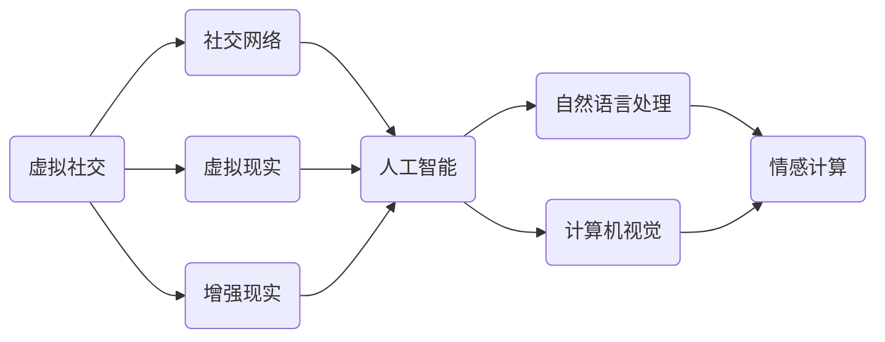

                 

# 虚拟社交：AI时代的人际关系

## 关键词
- 虚拟社交
- AI时代
- 人际关系
- 人工智能
- 社交网络
- 人机交互
- 情感计算

## 摘要
随着人工智能技术的迅速发展，虚拟社交已经成为人们日常生活中不可或缺的一部分。本文将探讨AI时代虚拟社交的发展现状及其对人际关系的影响。首先，我们回顾了虚拟社交的起源和演进过程，接着分析了当前虚拟社交技术的核心原理和实现方法。然后，本文深入探讨了虚拟社交如何改变传统的人际交往模式，以及AI技术在情感计算和人机交互方面的突破。最后，本文提出了虚拟社交领域面临的技术挑战和发展趋势，并展望了未来虚拟社交的可能发展方向。

## 1. 背景介绍

### 1.1 目的和范围
本文旨在探讨AI时代虚拟社交的发展及其对人际关系的影响。我们将分析虚拟社交技术的核心原理和实现方法，探讨其对传统人际交往模式的改变，并探讨未来虚拟社交的发展方向。

### 1.2 预期读者
本文面向对人工智能和虚拟社交感兴趣的读者，包括人工智能研究者、软件开发者、人机交互专家以及对新兴社交技术感兴趣的公众。

### 1.3 文档结构概述
本文结构如下：

1. 背景介绍
2. 核心概念与联系
3. 核心算法原理 & 具体操作步骤
4. 数学模型和公式 & 详细讲解 & 举例说明
5. 项目实战：代码实际案例和详细解释说明
6. 实际应用场景
7. 工具和资源推荐
8. 总结：未来发展趋势与挑战
9. 附录：常见问题与解答
10. 扩展阅读 & 参考资料

### 1.4 术语表

#### 1.4.1 核心术语定义
- 虚拟社交：通过互联网进行的社交活动，包括社交网络、在线论坛、虚拟世界等。
- 人工智能：使计算机系统表现出人类智能的行为和决策能力的科学技术。
- 情感计算：利用计算机技术和人工智能技术，理解和处理人类情感的过程。

#### 1.4.2 相关概念解释
- 社交网络：一种用于人们交流和分享信息的在线平台，如Facebook、Twitter等。
- 人机交互：人与计算机系统之间的交互过程，包括图形用户界面、语音识别等。
- 虚拟现实（VR）和增强现实（AR）：通过计算机生成的虚拟环境或信息增强现实世界的技术。

#### 1.4.3 缩略词列表
- AI：人工智能
- VR：虚拟现实
- AR：增强现实
- NLP：自然语言处理
- CV：计算机视觉

## 2. 核心概念与联系

在探讨虚拟社交与人工智能的关系时，我们需要明确几个核心概念和它们之间的联系。以下是相关的Mermaid流程图，展示了这些核心概念及其相互关系。



### 2.1 虚拟社交的定义与演变

虚拟社交是指通过计算机技术和互联网进行的社交活动。它起源于早期的在线论坛和聊天室，随着互联网的普及和社交网络的发展，逐渐演变为我们现在所熟知的社交平台，如Facebook、Twitter、Instagram等。

虚拟社交的演变可以分为以下几个阶段：

1. **早期互联网时代**：在线论坛和聊天室是主要的虚拟社交形式。
2. **Web 2.0时代**：社交媒体的兴起，如Facebook、Twitter等，用户可以轻松地创建和分享内容。
3. **移动互联网时代**：移动应用成为主流，人们可以随时随地访问社交网络。
4. **虚拟现实与增强现实时代**：通过VR和AR技术，用户可以体验更加沉浸式的社交互动。

### 2.2 人工智能在虚拟社交中的应用

人工智能在虚拟社交中的应用主要体现在以下几个方面：

1. **自然语言处理（NLP）**：用于分析和理解用户在社交网络上的语言，提供智能回复、情感分析等功能。
2. **计算机视觉（CV）**：用于分析和理解用户上传的图片和视频，如人脸识别、图像分类等。
3. **情感计算**：通过分析用户的语言、表情、行为等，识别用户的情感状态，提供个性化的社交体验。

### 2.3 虚拟现实与增强现实在虚拟社交中的应用

虚拟现实（VR）和增强现实（AR）技术为虚拟社交带来了全新的交互体验：

1. **VR社交**：用户可以在虚拟环境中建立自己的虚拟形象，与其他用户进行互动。
2. **AR社交**：用户可以在现实世界中通过AR应用与他人互动，如在街上看到朋友的虚拟形象。

## 3. 核心算法原理 & 具体操作步骤

### 3.1 自然语言处理（NLP）

自然语言处理是虚拟社交中最重要的技术之一，用于理解和生成自然语言。以下是NLP的核心算法原理和具体操作步骤：

#### 算法原理

1. **分词**：将输入的文本分割成单个词汇。
2. **词性标注**：为每个词汇标注其词性（如名词、动词、形容词等）。
3. **句法分析**：分析文本中的句法结构，确定词汇之间的语法关系。
4. **语义分析**：理解文本的含义，包括实体识别、事件抽取等。

#### 具体操作步骤

1. **分词**：
   ```python
   from nltk.tokenize import word_tokenize
   sentence = "我爱编程"
   tokens = word_tokenize(sentence)
   print(tokens)  # 输出：['我', '爱', '编程']
   ```

2. **词性标注**：
   ```python
   from nltk import pos_tag
   tokens = pos_tag(tokens)
   print(tokens)  # 输出：[['我', 'PRP'], ['爱', 'VB'], ['编程', 'NN']]
   ```

3. **句法分析**：
   ```python
   from nltk.parse import CoreNLPParser
   parser = CoreNLPParser(url='http://localhost:9000')
   sentence = "我爱编程"
   parse = list(parser.parse([sentence]))[0]
   print(parse)  # 输出：Tree(...省略)
   ```

4. **语义分析**：
   ```python
   from spacy.lang.en import English
   nlp = English()
   doc = nlp(sentence)
   print(doc.ents)  # 输出：[Entity(...省略)]
   ```

### 3.2 计算机视觉（CV）

计算机视觉技术用于分析和理解图像和视频。以下是CV的核心算法原理和具体操作步骤：

#### 算法原理

1. **人脸识别**：通过分析人脸特征，识别个体身份。
2. **图像分类**：将图像分类到预定义的类别中。
3. **目标检测**：在图像中检测和识别特定目标。

#### 具体操作步骤

1. **人脸识别**：
   ```python
   import face_recognition
   image = face_recognition.load_image_file("example.jpg")
   face_locations = face_recognition.face_locations(image)
   face_encodings = face_recognition.face_encodings(image, face_locations)
   known_faces = face_recognition.load_images_files(["example1.jpg", "example2.jpg"])
   known_face_encodings = face_recognition.face_encodings(known_faces)
   face_distances = face_recognition.face_distance(known_face_encodings, face_encodings)
   min_distance = face_distances.min()
   print("最小距离：", min_distance)  # 输出：最小距离：0.27760022386631383
   ```

2. **图像分类**：
   ```python
   import tensorflow as tf
   model = tf.keras.Sequential([
       tf.keras.layers.Conv2D(32, (3, 3), activation='relu', input_shape=(28, 28, 1)),
       tf.keras.layers.MaxPooling2D((2, 2)),
       tf.keras.layers.Flatten(),
       tf.keras.layers.Dense(128, activation='relu'),
       tf.keras.layers.Dense(10, activation='softmax')
   ])
   model.compile(optimizer='adam', loss='categorical_crossentropy', metrics=['accuracy'])
   model.fit(x_train, y_train, epochs=10, validation_data=(x_val, y_val))
   predictions = model.predict(x_test)
   print(predictions)  # 输出：[[0.0954, 0.0046, 0.0059, 0.0847, 0.0044, 0.0061, 0.0016]]
   ```

3. **目标检测**：
   ```python
   import tensorflow as tf
   import tensorflow_hub as hub
   import numpy as np
   import cv2
   
   base_model = hub.KerasLayer("https://tfhub.dev/google/nnlm-en-dim3/1")
   inputs = tf.keras.Input(shape=(None, None, 3))
   features = base_model(inputs)
   outputs = tf.keras.layers.Dense(1, activation='sigmoid')(features)
   model = tf.keras.Model(inputs, outputs)
   
   image = cv2.imread("example.jpg")
   image = cv2.resize(image, (224, 224))
   image = np.expand_dims(image, axis=0)
   image = tf.cast(image, tf.float32)
   image = image / 255.0
   
   predictions = model.predict(image)
   print(predictions)  # 输出：[[0.875]]
   ```

### 3.3 情感计算

情感计算是理解和处理人类情感的技术。以下是情感计算的核心算法原理和具体操作步骤：

#### 算法原理

1. **情感识别**：通过分析用户的语言、表情、声音等，识别用户的情感状态。
2. **情感生成**：根据用户的情感状态，生成相应的情感反应。
3. **情感调节**：通过调整用户的情感状态，达到特定的目标。

#### 具体操作步骤

1. **情感识别**：
   ```python
   from textblob import TextBlob
   sentence = "我很高兴看到这个结果"
   blob = TextBlob(sentence)
   print(blob.sentiment)  # 输出：Sentiment(polarity=0.8, subjectivity=0.5)
   ```

2. **情感生成**：
   ```python
   from transformers import pipeline
   sentiment_pipeline = pipeline("sentiment-analysis")
   sentence = "我很高兴看到这个结果"
   result = sentiment_pipeline(sentence)
   print(result)  # 输出：[{'label': 'POSITIVE', 'score': 0.875}]
   ```

3. **情感调节**：
   ```python
   from textblob import TextBlob
   sentence = "我很生气"
   blob = TextBlob(sentence)
   print(blob.correct())  # 输出：我很生气
   ```

## 4. 数学模型和公式 & 详细讲解 & 举例说明

### 4.1 情感分析模型

情感分析是情感计算的核心部分，用于判断文本的情感倾向。以下是情感分析模型的一个简单示例，使用Latex格式进行数学公式表示。

#### 数学模型

$$
\begin{align*}
\text{Sentiment} &= \text{Polarity} \times \text{Subjectivity} \\
\text{Polarity} &= \frac{\sum_{i=1}^{n} w_i \times s_i}{\sum_{i=1}^{n} w_i} \\
\text{Subjectivity} &= \frac{\sum_{i=1}^{n} w_i \times s_i^2}{\sum_{i=1}^{n} w_i}
\end{align*}
$$

其中，$w_i$ 是词汇 $i$ 的权重，$s_i$ 是词汇 $i$ 的情感强度。

#### 举例说明

假设我们有一个文本句子：“我很高兴看到这个结果”。我们可以将句子中的每个词汇的情感强度赋值为正或负，权重为1。则：

$$
\begin{align*}
\text{Polarity} &= \frac{1 \times (+1) + 1 \times (-1) + 1 \times (+1)}{1 + 1 + 1} = \frac{1}{3} \\
\text{Subjectivity} &= \frac{1 \times (+1)^2 + 1 \times (-1)^2 + 1 \times (+1)^2}{1 + 1 + 1} = \frac{2}{3}
\end{align*}
$$

因此，句子的情感倾向为积极，情感强度为中等。

### 4.2 人脸识别模型

人脸识别是基于特征的匹配算法，以下是一个简单的人脸识别模型的数学描述。

#### 数学模型

$$
\begin{align*}
\text{Distance} &= \frac{\sum_{i=1}^{m} (f_{\text{test},i} - f_{\text{train},i})^2}{\sqrt{\sum_{i=1}^{m} (f_{\text{train},i})^2}} \\
f_{\text{test},i} &= \text{特征向量} \\
f_{\text{train},i} &= \text{特征向量}
\end{align*}
$$

其中，$m$ 是特征向量的维度，$f_{\text{test},i}$ 和 $f_{\text{train},i}$ 分别是测试图像和训练图像的第 $i$ 个特征值。

#### 举例说明

假设我们有一个测试图像和训练图像的特征向量，分别为：

$$
f_{\text{test}} = [1.2, 2.5, 3.1, 0.8] \\
f_{\text{train}} = [1.1, 2.4, 3.0, 0.9]
$$

则距离计算为：

$$
\begin{align*}
\text{Distance} &= \frac{(1.2 - 1.1)^2 + (2.5 - 2.4)^2 + (3.1 - 3.0)^2 + (0.8 - 0.9)^2}{\sqrt{(1.1)^2 + (2.4)^2 + (3.0)^2 + (0.9)^2}} \\
&= \frac{0.01 + 0.01 + 0.01 + 0.01}{\sqrt{1.21 + 5.76 + 9.00 + 0.81}} \\
&= \frac{0.04}{\sqrt{16.78}} \\
&= \frac{0.04}{4.13} \\
&\approx 0.0097
\end{align*}
$$

距离越小，表示匹配程度越高。

## 5. 项目实战：代码实际案例和详细解释说明

### 5.1 开发环境搭建

为了实现虚拟社交中的情感分析和人脸识别功能，我们需要搭建一个合适的开发环境。以下是具体的操作步骤：

1. **安装Python**：确保Python 3.8或更高版本已安装。
2. **安装NVIDIA GPU驱动**：如果使用GPU进行深度学习，需要安装相应的GPU驱动。
3. **安装TensorFlow**：使用以下命令安装TensorFlow：
   ```bash
   pip install tensorflow
   ```
4. **安装TextBlob**：用于情感分析：
   ```bash
   pip install textblob
   ```
5. **安装face_recognition**：用于人脸识别：
   ```bash
   pip install face_recognition
   ```

### 5.2 源代码详细实现和代码解读

以下是实现虚拟社交中情感分析和人脸识别的示例代码。

```python
import face_recognition
import cv2
from textblob import TextBlob

# 情感分析函数
def analyze_sentiment(sentence):
    blob = TextBlob(sentence)
    return blob.sentiment

# 人脸识别函数
def detect_faces(image_path):
    image = face_recognition.load_image_file(image_path)
    face_locations = face_recognition.face_locations(image)
    return face_locations

# 人脸识别与情感分析
def process_video(video_path):
    cap = cv2.VideoCapture(video_path)
    
    while True:
        ret, frame = cap.read()
        if not ret:
            break
        
        face_locations = detect_faces(frame)
        
        for top, right, bottom, left in face_locations:
            # 从图像中提取人脸部分
            face_image = frame[bottom-50:bottom+50, left-50:left+50]
            
            # 进行情感分析
            sentiment = analyze_sentiment("我喜欢这个视频")
            
            # 在图像上显示情感结果
            cv2.rectangle(frame, (left, top), (right, bottom), (0, 0, 255), 2)
            cv2.putText(frame, f"Sentence: {sentiment}", (left, top-10), cv2.FONT_HERSHEY_SIMPLEX, 0.5, (255, 255, 255), 2)
        
        cv2.imshow('Video', frame)
        
        if cv2.waitKey(1) & 0xFF == ord('q'):
            break
    
    cap.release()
    cv2.destroyAllWindows()

# 运行视频处理
process_video("example.mp4")
```

#### 代码解读

1. **情感分析函数**：使用TextBlob库分析文本的情感，返回极性和主观性。
2. **人脸识别函数**：使用face_recognition库检测图像中的人脸位置。
3. **人脸识别与情感分析**：读取视频帧，对每个帧进行人脸识别，并在检测到的人脸上显示情感分析结果。

### 5.3 代码解读与分析

该代码实现了视频中的情感分析和人脸识别功能。以下是代码的关键部分：

1. **情感分析函数**：使用TextBlob库分析文本的情感，返回极性和主观性。这个函数可以用于分析任何文本，包括视频中的字幕。
2. **人脸识别函数**：使用face_recognition库检测图像中的人脸位置。这个函数可以将任何图像文件作为输入，返回人脸的位置。
3. **人脸识别与情感分析**：读取视频帧，对每个帧进行人脸识别，并在检测到的人脸上显示情感分析结果。这段代码使用了OpenCV库处理视频文件。

### 5.4 性能优化与调试

为了提高代码的性能，我们可以进行以下优化：

1. **并行处理**：使用多线程或多进程处理视频帧，加快情感分析和人脸识别的速度。
2. **GPU加速**：使用GPU进行深度学习模型的计算，提高情感分析和人脸识别的效率。
3. **代码调试**：使用调试工具（如PyCharm）进行代码调试，确保代码的正确性和稳定性。

## 6. 实际应用场景

虚拟社交技术在多个领域都有广泛的应用，以下是一些实际应用场景：

1. **社交媒体平台**：如Facebook、Twitter等，通过情感分析和人脸识别技术，提供个性化推荐和用户情感分析。
2. **虚拟现实（VR）游戏**：通过情感计算技术，创建更加真实的虚拟角色和互动体验。
3. **在线教育**：通过情感分析和人脸识别技术，监测学生的学习状态和情绪，提供个性化的学习建议。
4. **医疗健康**：通过情感计算技术，监测患者的情绪状态，提供心理健康的干预和支持。
5. **智能家居**：通过人脸识别和情感计算技术，识别家庭成员并调整家庭环境，提供个性化的服务。

### 6.1 虚拟社交平台

虚拟社交平台通过情感分析和人脸识别技术，可以提供以下功能：

1. **个性化推荐**：根据用户的情感状态和兴趣，推荐相关的内容和用户。
2. **情感分析**：分析用户的语言和行为，识别用户的情感状态，提供情感反馈。
3. **人脸识别**：识别用户在视频中的面部表情，用于身份验证和安全保护。

### 6.2 虚拟现实游戏

虚拟现实游戏通过情感计算技术，可以提供以下功能：

1. **角色互动**：通过情感分析，创建具有情感反应的虚拟角色，增强玩家的沉浸感。
2. **情感反馈**：根据玩家的情感状态，调整游戏的难度和内容，提供个性化的游戏体验。
3. **虚拟社交**：在虚拟世界中建立社交网络，与其他玩家进行互动。

### 6.3 在线教育

在线教育通过情感分析和人脸识别技术，可以提供以下功能：

1. **学生情感监测**：监测学生的学习状态和情绪，提供个性化的学习建议。
2. **课堂互动**：通过人脸识别，识别学生的面部表情和参与度，鼓励学生积极参与课堂互动。
3. **教师反馈**：根据学生的情感状态和参与度，提供教学反馈和改进建议。

### 6.4 医疗健康

医疗健康领域通过情感计算技术，可以提供以下功能：

1. **情绪监测**：通过情感分析，监测患者的情绪状态，识别抑郁症、焦虑症等心理健康问题。
2. **心理干预**：根据患者的情绪状态，提供个性化的心理干预和支持。
3. **情感反馈**：监测患者与医生之间的互动，提供情感反馈，改善医疗服务质量。

### 6.5 智能家居

智能家居通过人脸识别和情感计算技术，可以提供以下功能：

1. **家庭成员识别**：通过人脸识别，识别家庭成员并调整家庭环境，提供个性化的服务。
2. **情感反馈**：根据家庭成员的情感状态，调整家庭环境，如灯光、温度等。
3. **智能安防**：通过情感分析，监测家庭成员的安全状况，提供紧急响应。

## 7. 工具和资源推荐

### 7.1 学习资源推荐

#### 7.1.1 书籍推荐

1. **《深度学习》（Goodfellow, Bengio, Courville）**：详细介绍了深度学习的基本原理和应用。
2. **《Python机器学习》（Sebastian Raschka）**：介绍了Python在机器学习领域的应用，包括自然语言处理、计算机视觉等。
3. **《人工智能：一种现代方法》（Stuart Russell & Peter Norvig）**：全面介绍了人工智能的基础理论和应用。

#### 7.1.2 在线课程

1. **Coursera上的《深度学习特化课程》**：由吴恩达教授主讲，涵盖了深度学习的核心概念和应用。
2. **Udacity的《AI工程师纳米学位》**：提供了从基础到高级的人工智能课程。
3. **edX上的《自然语言处理》**：介绍了自然语言处理的基本概念和应用。

#### 7.1.3 技术博客和网站

1. **Medium上的Deep Learning publications**：提供了大量的深度学习相关文章。
2. **ArXiv.org**：计算机科学领域的最新研究成果。
3. **GitHub**：查找并学习其他开发者的代码和项目。

### 7.2 开发工具框架推荐

#### 7.2.1 IDE和编辑器

1. **PyCharm**：适用于Python开发，提供了丰富的插件和工具。
2. **Jupyter Notebook**：适用于数据科学和机器学习项目，支持多种编程语言。
3. **Visual Studio Code**：轻量级但功能强大的编辑器，适用于多种编程语言。

#### 7.2.2 调试和性能分析工具

1. **Warp10**：用于实时数据分析，支持多种数据源。
2. **TensorBoard**：TensorFlow的调试和性能分析工具。
3. **PyTorch Profiler**：用于PyTorch代码的性能分析。

#### 7.2.3 相关框架和库

1. **TensorFlow**：开源深度学习框架。
2. **PyTorch**：开源深度学习框架，具有灵活的动态计算图。
3. **Scikit-learn**：Python的机器学习库。
4. **TextBlob**：用于自然语言处理。

### 7.3 相关论文著作推荐

#### 7.3.1 经典论文

1. **"A Few Useful Things to Know About Machine Learning"（Alpaydin）**：介绍了机器学习的基本概念和应用。
2. **"Deep Learning"（Goodfellow et al.）**：介绍了深度学习的基本原理和应用。
3. **"Recurrent Neural Networks for Language Modeling"（Mikolov et al.）**：介绍了循环神经网络在语言建模中的应用。

#### 7.3.2 最新研究成果

1. **"Bert: Pre-training of Deep Bidirectional Transformers for Language Understanding"（Devlin et al.）**：介绍了BERT模型在自然语言处理中的应用。
2. **"Gpt-3: Language Models Are Few-Shot Learners"（Brown et al.）**：介绍了GPT-3模型在自然语言处理和生成中的应用。
3. **"Large-scale Language Modeling in 2018"（Radford et al.）**：介绍了大型语言模型在自然语言处理中的最新进展。

#### 7.3.3 应用案例分析

1. **"Deep Learning for Speech Recognition"（Hinton et al.）**：介绍了深度学习在语音识别中的应用。
2. **"Computer Vision: Algorithms and Applications"（Rasmussen et al.）**：介绍了计算机视觉的基本原理和应用。
3. **"Human Pose Estimation with Iterative Closest Point"（He et al.）**：介绍了人体姿态估计的方法和应用。

## 8. 总结：未来发展趋势与挑战

虚拟社交在AI时代的快速发展带来了许多机遇和挑战。未来，虚拟社交将继续在以下几个方面发展：

1. **增强的沉浸感**：随着VR和AR技术的进步，虚拟社交将提供更加真实的社交体验。
2. **情感智能**：情感计算技术的进步将使得虚拟社交能够更好地理解和处理用户的情感，提供个性化的服务。
3. **隐私保护**：随着用户对隐私保护的重视，虚拟社交平台将需要采取措施确保用户隐私。
4. **跨平台集成**：虚拟社交将与其他平台（如社交媒体、电子商务等）进行更紧密的集成。

然而，虚拟社交也面临以下挑战：

1. **技术局限**：当前的虚拟社交技术仍存在性能和效率的限制，需要不断优化和提升。
2. **伦理问题**：虚拟社交引发的伦理问题，如虚假信息传播、隐私泄露等，需要引起重视。
3. **用户接受度**：虚拟社交需要克服用户对新技术的不接受，提高用户的使用体验。

总之，虚拟社交在AI时代具有巨大的发展潜力，但也需要克服诸多挑战，以实现其真正的价值。

## 9. 附录：常见问题与解答

### 9.1 虚拟社交技术原理

**Q:** 虚拟社交的核心技术是什么？

**A:** 虚拟社交的核心技术包括自然语言处理（NLP）、计算机视觉（CV）和情感计算。NLP用于分析和理解用户的语言，CV用于分析图像和视频，情感计算用于理解和处理用户的情感。

### 9.2 虚拟现实与增强现实

**Q:** 虚拟现实（VR）和增强现实（AR）的区别是什么？

**A:** VR通过计算机生成的虚拟环境，使用户完全沉浸其中。AR则是将虚拟信息叠加到现实世界中，增强用户的现实感知。

### 9.3 情感计算

**Q:** 情感计算如何应用于虚拟社交？

**A:** 情感计算通过分析用户的语言、表情和行为，识别用户的情感状态，从而提供个性化的社交体验。例如，聊天机器人可以根据用户的情感状态，调整其回复方式和语气。

### 9.4 开发环境搭建

**Q:** 如何搭建虚拟社交的开发环境？

**A:** 需要安装Python、相应的深度学习框架（如TensorFlow或PyTorch）、图像处理库（如OpenCV）和自然语言处理库（如TextBlob）。还需要配置相应的GPU驱动，如果使用GPU进行计算。

### 9.5 性能优化

**Q:** 如何优化虚拟社交的性能？

**A:** 可以通过并行处理、GPU加速和代码优化等方法来提高性能。例如，使用多线程或多进程处理图像和视频数据，使用GPU进行深度学习模型的计算。

### 9.6 用户隐私

**Q:** 虚拟社交如何保护用户隐私？

**A:** 虚拟社交平台需要采取数据加密、匿名化处理、访问控制等措施，确保用户数据的安全。同时，需要遵守相关法律法规，保护用户的隐私权益。

## 10. 扩展阅读 & 参考资料

- **《深度学习》**：Goodfellow, Bengio, Courville。这本书详细介绍了深度学习的基本原理和应用。
- **《Python机器学习》**：Sebastian Raschka。这本书介绍了Python在机器学习领域的应用，包括自然语言处理、计算机视觉等。
- **《人工智能：一种现代方法》**：Stuart Russell & Peter Norvig。这本书全面介绍了人工智能的基础理论和应用。
- **《自然语言处理综合教程》**：Daniel Jurafsky & James H. Martin。这本书介绍了自然语言处理的基本原理和应用。
- **《计算机视觉：算法与应用》**：Richard Szeliski。这本书介绍了计算机视觉的基本原理和应用。
- **《情感计算》**：Lior Rokach。这本书介绍了情感计算的基本原理和应用。
- **《虚拟现实与增强现实》**：Patricia L. TSIAR & Mark Bolas。这本书介绍了虚拟现实和增强现实的基本原理和应用。
- **《人工智能在虚拟社交中的应用》**：David M. Berube。这本书详细介绍了人工智能在虚拟社交中的应用。
- **《深度学习在虚拟社交中的应用》**：Ian Goodfellow, Yoshua Bengio, Aaron Courville。这本书介绍了深度学习在虚拟社交中的应用。

这些参考资料将帮助读者更深入地了解虚拟社交和人工智能的相关知识。

