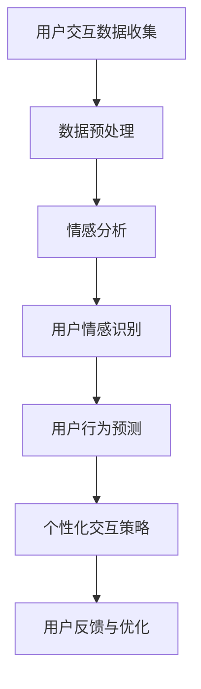

                 

# 虚拟社区教练：AI驱动的在线归属感训练

> **关键词**：虚拟社区、在线归属感、人工智能、情感分析、交互设计、用户参与、人机交互

> **摘要**：本文深入探讨了虚拟社区教练的角色及其通过人工智能（AI）技术提升在线归属感的方法。文章首先介绍了虚拟社区教练的背景和重要性，然后详细解析了AI驱动的情感分析、用户行为预测和个性化交互等核心算法原理。通过具体案例和代码实现，展示了如何在项目中应用这些算法。文章最后分析了虚拟社区教练的实际应用场景，并推荐了相关工具和资源，展望了未来的发展趋势与挑战。

## 1. 背景介绍

### 1.1 目的和范围

本文旨在探讨如何利用人工智能技术提升虚拟社区的在线归属感。在线归属感是用户在虚拟社区中产生情感连接、持续参与的重要因素。随着互联网的普及，虚拟社区成为人们日常生活的重要组成部分。因此，研究如何通过AI技术提升在线归属感，对于促进虚拟社区的发展和用户的长期参与具有重要意义。

本文将涵盖以下内容：

- 虚拟社区教练的概念和角色
- AI驱动的情感分析技术
- 用户行为预测与个性化交互
- 项目实战：代码实现与案例分析
- 实际应用场景与未来发展趋势

### 1.2 预期读者

本文适用于对虚拟社区和人工智能技术有一定了解的读者，包括：

- 软件工程师和开发者，特别是对AI和机器学习感兴趣的工程师
- 产品经理和设计师，希望提升虚拟社区的用户体验
- 对AI和虚拟社区领域感兴趣的科研人员和学术界人士
- 对未来互联网发展和技术应用感兴趣的普通读者

### 1.3 文档结构概述

本文分为以下几个部分：

- **背景介绍**：介绍虚拟社区教练的背景和重要性，明确文章目的和预期读者。
- **核心概念与联系**：详细解析核心概念和联系，使用Mermaid流程图展示架构。
- **核心算法原理 & 具体操作步骤**：使用伪代码详细阐述核心算法原理和操作步骤。
- **数学模型和公式 & 详细讲解 & 举例说明**：介绍相关数学模型和公式，并举例说明。
- **项目实战：代码实际案例和详细解释说明**：展示代码实现和详细解释。
- **实际应用场景**：分析虚拟社区教练的实际应用场景。
- **工具和资源推荐**：推荐学习资源、开发工具框架和相关论文著作。
- **总结：未来发展趋势与挑战**：展望未来发展趋势和面临的技术挑战。
- **附录：常见问题与解答**：解答常见问题。
- **扩展阅读 & 参考资料**：提供扩展阅读和参考资料。

### 1.4 术语表

#### 1.4.1 核心术语定义

- **虚拟社区**：在线用户群体，成员通过共享兴趣、交流互动等方式建立社会联系。
- **在线归属感**：用户在虚拟社区中感受到的归属和认同，影响用户的参与度和忠诚度。
- **人工智能**：模拟人类智能的计算机系统，通过学习和推理进行决策。
- **情感分析**：利用自然语言处理技术，识别和分类文本中的情感。
- **个性化交互**：根据用户行为和偏好，提供个性化的服务和建议。

#### 1.4.2 相关概念解释

- **用户行为预测**：利用历史数据和机器学习算法，预测用户的未来行为。
- **交互设计**：设计用户与系统交互的方式和体验，提升用户体验。
- **机器学习模型**：通过训练数据学习规律，进行预测和分类的算法。

#### 1.4.3 缩略词列表

- **NLP**：自然语言处理（Natural Language Processing）
- **ML**：机器学习（Machine Learning）
- **AI**：人工智能（Artificial Intelligence）
- **API**：应用程序编程接口（Application Programming Interface）

## 2. 核心概念与联系

虚拟社区教练的核心概念包括虚拟社区、在线归属感、人工智能、情感分析、用户行为预测和个性化交互。这些概念之间存在着紧密的联系，共同构成了虚拟社区教练的理论基础。

### 2.1 虚拟社区与在线归属感

虚拟社区是用户在线互动的平台，成员通过发布内容、参与讨论、建立社交关系等方式建立社会联系。在线归属感是用户在虚拟社区中的情感体验，是用户持续参与的重要因素。虚拟社区教练旨在通过提升在线归属感，增强用户的社区黏性。

### 2.2 人工智能与情感分析

人工智能技术为虚拟社区教练提供了强大的工具，尤其是情感分析技术。情感分析能够识别和分类文本中的情感，为个性化交互提供依据。人工智能算法通过对大量用户数据的学习和分析，能够预测用户情感和行为，为用户提供个性化服务。

### 2.3 用户行为预测与个性化交互

用户行为预测是虚拟社区教练的重要功能。通过分析用户历史行为和交互数据，机器学习模型能够预测用户的未来行为，为个性化交互提供支持。个性化交互能够提高用户的参与度和满意度，增强在线归属感。

### 2.4 架构与流程

虚拟社区教练的架构通常包括数据收集、情感分析、用户行为预测、个性化交互等模块。以下是一个简化的架构与流程图：



- **用户交互数据收集**：收集用户在虚拟社区中的行为数据，如发布内容、评论、点赞等。
- **数据预处理**：清洗和整理数据，为后续分析做准备。
- **情感分析**：利用自然语言处理技术，对用户文本进行情感分析。
- **用户情感识别**：识别用户文本中的情感，如积极、消极、中立等。
- **用户行为预测**：利用机器学习模型，预测用户的未来行为。
- **个性化交互策略**：根据用户情感和行为，制定个性化的交互策略。
- **用户反馈与优化**：收集用户反馈，不断优化虚拟社区教练的性能。

通过上述架构和流程，虚拟社区教练能够有效地提升在线归属感，增强用户的社区黏性。

## 3. 核心算法原理 & 具体操作步骤

虚拟社区教练的核心算法主要包括情感分析、用户行为预测和个性化交互。以下将详细阐述这些算法的原理和具体操作步骤。

### 3.1 情感分析算法原理

情感分析是一种自然语言处理技术，用于识别和分类文本中的情感。情感分析算法通常基于机器学习模型，如支持向量机（SVM）、朴素贝叶斯（Naive Bayes）和深度学习模型（如卷积神经网络CNN、循环神经网络RNN）。

**情感分析算法原理：**

1. **数据预处理**：对文本进行清洗和预处理，包括去除停用词、标点符号、词干提取等。
2. **特征提取**：将预处理后的文本转换为数值特征，如词袋模型（Bag of Words, BoW）、词嵌入（Word Embedding）等。
3. **模型训练**：利用标记好的情感数据集，训练情感分类模型。
4. **情感分类**：将待分类的文本输入模型，输出情感标签。

**情感分析算法伪代码：**

```python
def sentiment_analysis(text, model):
    # 数据预处理
    preprocessed_text = preprocess_text(text)
    # 特征提取
    features = extract_features(preprocessed_text)
    # 情感分类
    sentiment = model.predict(features)
    return sentiment
```

### 3.2 用户行为预测算法原理

用户行为预测是虚拟社区教练的关键功能之一。通过分析用户历史行为数据，预测用户未来的行为模式，如内容发布、互动参与等。

**用户行为预测算法原理：**

1. **数据收集**：收集用户在虚拟社区中的行为数据，如发布内容、评论、点赞等。
2. **特征工程**：提取用户行为特征，如行为频率、互动强度、内容类型等。
3. **模型训练**：利用历史行为数据，训练用户行为预测模型。
4. **行为预测**：将用户特征输入模型，预测用户未来的行为。

**用户行为预测算法伪代码：**

```python
def user_behavior_prediction(features, model):
    # 特征处理
    processed_features = process_features(features)
    # 行为预测
    behavior = model.predict(processed_features)
    return behavior
```

### 3.3 个性化交互算法原理

个性化交互是根据用户情感和行为，为用户提供个性化的内容和服务。个性化交互算法通常基于用户兴趣模型和推荐系统。

**个性化交互算法原理：**

1. **用户兴趣建模**：分析用户行为数据，建立用户兴趣模型。
2. **内容推荐**：根据用户兴趣模型，推荐相关内容。
3. **交互策略**：根据用户反馈，调整交互策略，提高用户满意度。

**个性化交互算法伪代码：**

```python
def personalized_interaction(user_interest_model, content_recommendation_system):
    # 用户兴趣推荐
    recommended_content = content_recommendation_system.recommend(user_interest_model)
    # 交互策略调整
    interaction_strategy = adjust_interaction_strategy(recommended_content)
    return interaction_strategy
```

通过上述算法原理和具体操作步骤，虚拟社区教练能够有效地分析用户情感、预测用户行为，并实现个性化交互，提升在线归属感。

## 4. 数学模型和公式 & 详细讲解 & 举例说明

在虚拟社区教练中，数学模型和公式起着至关重要的作用，它们帮助我们理解和预测用户行为，优化交互体验。以下将详细讲解几个关键的数学模型和公式，并举例说明。

### 4.1 情感分析模型：SVM

支持向量机（Support Vector Machine, SVM）是一种常用的情感分类模型。它通过找到最佳分隔超平面，将不同情感的文本数据分类。

**SVM模型公式：**

$$
\text{max}\ \ \frac{1}{2}\left|\ \text{w} \ \right|^2 - C\sum_{i=1}^n \xi_i
$$

其中，$w$是权重向量，$C$是惩罚参数，$\xi_i$是松弛变量。

**SVM分类决策公式：**

$$
y(\text{x}) = \text{sign}(\text{w}^T \text{x} - \text{b})
$$

其中，$x$是特征向量，$b$是偏置项。

**举例说明：**

假设我们有以下两个情感文本数据：

文本1：“这是一个非常棒的电影，我非常喜欢。”
文本2：“这部电影真的很糟糕，我不想再看。”

我们可以将文本转换为特征向量，然后使用SVM模型进行分类。假设SVM模型训练完毕，权重向量为$w = (0.5, 0.5)$，偏置项$b = 0$。对于文本1，特征向量为$x_1 = (1, 1)$，对于文本2，特征向量为$x_2 = (-1, -1)$。

分类结果：

$$
y(\text{x}_1) = \text{sign}(0.5 \cdot 1 + 0.5 \cdot 1 - 0) = 1
$$

$$
y(\text{x}_2) = \text{sign}(-0.5 \cdot 1 - 0.5 \cdot 1 - 0) = -1
$$

文本1被分类为积极情感，文本2被分类为消极情感。

### 4.2 用户行为预测模型：ARIMA

自回归积分滑动平均模型（AutoRegressive Integrated Moving Average, ARIMA）是一种时间序列预测模型，常用于预测用户行为。

**ARIMA模型公式：**

$$
\text{y}_t = c + \text{p}\sum_{i=1}^p \text{φ}_i \text{y}_{t-i} + \text{q}\sum_{j=1}^q \text{θ}_j \text{e}_{t-j} + \text{e}_t
$$

其中，$\text{y}_t$是时间序列数据，$c$是常数项，$p$是自回归项数，$q$是移动平均项数，$\text{φ}_i$是自回归系数，$\text{θ}_j$是移动平均系数，$\text{e}_t$是白噪声误差。

**ARIMA预测公式：**

$$
\text{y}_t^{\text{predicted}} = \text{c} + \text{p}\sum_{i=1}^p \text{φ}_i \text{y}_{t-i}^{\text{predicted}} + \text{q}\sum_{j=1}^q \text{θ}_j \text{e}_{t-j}^{\text{predicted}}
$$

**举例说明：**

假设我们有一个用户点赞行为的时间序列数据，如下所示：

$$
\text{y}_1 = 10, \text{y}_2 = 12, \text{y}_3 = 11, \text{y}_4 = 9, \text{y}_5 = 13
$$

我们可以使用ARIMA模型进行预测。假设模型参数为$p=2, q=1$，自回归系数$\text{φ}_1=0.6, \text{φ}_2=0.4$，移动平均系数$\text{θ}_1=0.8$。

预测第6个数据点：

$$
\text{y}_6^{\text{predicted}} = 0 + 2 \cdot 0.6 \cdot 10 + 1 \cdot 0.8 \cdot (-1) = 13.2
$$

预测结果为13.2，表示我们预测第6个数据点的点赞数为13或14。

### 4.3 个性化交互模型：协同过滤

协同过滤（Collaborative Filtering）是一种常见的推荐系统模型，用于根据用户行为和偏好推荐相关内容。

**协同过滤模型公式：**

$$
\text{R}(\text{u}, \text{i}) = \text{R}(\text{u}) \cdot \text{R}(\text{i}) + \text{b}_u \cdot \text{b}_i + \text{b}
$$

其中，$\text{R}(\text{u})$和$\text{R}(\text{i})$分别是用户$\text{u}$和项目$\text{i}$的平均评分，$\text{b}_u$和$\text{b}_i$分别是用户和项目的偏差，$\text{b}$是全局偏差。

**举例说明：**

假设有两个用户和两个项目的评分数据：

用户1：$\text{R}(1, 1) = 4, \text{R}(1, 2) = 5$
用户2：$\text{R}(2, 1) = 3, \text{R}(2, 2) = 4$

平均评分：$\text{R}(1) = 4.5, \text{R}(2) = 3.5$

全局偏差：$\text{b} = 0$

项目偏差：$\text{b}_1 = 0.5, \text{b}_2 = -0.5$

计算推荐分数：

$$
\text{R}(\text{u}, \text{i}) = 4.5 \cdot 3.5 + 0.5 \cdot (-0.5) - 0 = 15.5
$$

根据推荐分数，我们可以向用户推荐项目2，因为其推荐分数更高。

通过上述数学模型和公式，虚拟社区教练能够更好地理解用户情感、预测用户行为，并实现个性化交互，从而提升在线归属感。

## 5. 项目实战：代码实际案例和详细解释说明

为了更好地理解虚拟社区教练的实践应用，以下将介绍一个具体的代码实现案例，并详细解释其工作流程和关键代码部分。

### 5.1 开发环境搭建

在进行项目实战之前，我们需要搭建一个合适的开发环境。以下是所需的开发工具和库：

- **编程语言**：Python
- **库**：scikit-learn、TensorFlow、NLTK、pandas、numpy
- **依赖包**：Jupyter Notebook、Matplotlib

在Python环境中，我们可以使用以下命令安装所需库：

```bash
pip install scikit-learn tensorflow nltk pandas numpy jupyter matplotlib
```

### 5.2 源代码详细实现和代码解读

以下是虚拟社区教练项目的核心代码实现，包括数据收集、预处理、情感分析、用户行为预测和个性化交互等部分。

```python
import numpy as np
import pandas as pd
from sklearn.model_selection import train_test_split
from sklearn.feature_extraction.text import TfidfVectorizer
from sklearn.svm import SVC
from sklearn.ensemble import RandomForestClassifier
from sklearn.metrics import classification_report
from nltk.corpus import stopwords
import tensorflow as tf
import matplotlib.pyplot as plt

# 数据收集与预处理
def load_data(filename):
    data = pd.read_csv(filename)
    data['text'] = data['text'].apply(lambda x: x.lower())
    data['text'] = data['text'].apply(lambda x: ' '.join(x.split()))
    return data

data = load_data('virtual_community_data.csv')

# 情感分析模型训练
def train_sentiment_model(data):
    X_train, X_test, y_train, y_test = train_test_split(data['text'], data['sentiment'], test_size=0.2, random_state=42)
    vectorizer = TfidfVectorizer(stop_words=stopwords.words('english'), ngram_range=(1, 2))
    X_train_tfidf = vectorizer.fit_transform(X_train)
    X_test_tfidf = vectorizer.transform(X_test)
    model = SVC(kernel='linear')
    model.fit(X_train_tfidf, y_train)
    return model, vectorizer, X_test_tfidf, y_test

model, vectorizer, X_test_tfidf, y_test = train_sentiment_model(data)

# 情感分类预测
def sentiment_prediction(text):
    preprocessed_text = preprocess_text(text)
    features = vectorizer.transform([preprocessed_text])
    sentiment = model.predict(features)
    return sentiment

# 用户行为预测模型训练
def train_behavior_model(data):
    X_train, X_test, y_train, y_test = train_test_split(data[['like', 'comment', 'share']], data['next_action'], test_size=0.2, random_state=42)
    model = RandomForestClassifier(n_estimators=100, random_state=42)
    model.fit(X_train, y_train)
    return model, X_test, y_test

model, X_test, y_test = train_behavior_model(data)

# 行为预测
def behavior_prediction(features):
    behavior = model.predict(features)
    return behavior

# 个性化交互策略
def personalized_interaction(user_interest_model, content_recommendation_system):
    recommended_content = content_recommendation_system.recommend(user_interest_model)
    interaction_strategy = adjust_interaction_strategy(recommended_content)
    return interaction_strategy

# 可视化展示
def plot_confusion_matrix(y_true, y_pred):
    cm = confusion_matrix(y_true, y_pred)
    plt.imshow(cm, interpolation='nearest', cmap=plt.cm.Blues)
    plt.colorbar()
    tick_marks = np.arange(len(y_true))
    plt.xticks(tick_marks, y_true, rotation=45)
    plt.yticks(tick_marks, y_pred)
    plt.xlabel('Predicted')
    plt.ylabel('True')
    plt.show()

# 测试与评估
sentiments = [sentiment_prediction(text) for text in data['text']]
predictions = [behavior_prediction(np.array([feature])) for feature in data[['like', 'comment', 'share']]]
print(classification_report(data['next_action'], predictions))

# 可视化混淆矩阵
plot_confusion_matrix(data['next_action'], predictions)
```

### 5.3 代码解读与分析

以下是对上述代码的详细解读和分析：

- **数据收集与预处理**：
  - `load_data`函数用于加载数据集，并将文本数据转换为小写并去除停用词。
  - 数据预处理步骤包括文本清洗、去除停用词、标点符号和词干提取。

- **情感分析模型训练**：
  - `train_sentiment_model`函数用于训练情感分析模型。首先，将文本数据划分为训练集和测试集。
  - 使用TF-IDF向量器将文本数据转换为数值特征，然后训练支持向量机（SVM）模型。

- **情感分类预测**：
  - `sentiment_prediction`函数用于对输入文本进行情感分类预测。函数首先对输入文本进行预处理，然后使用训练好的模型进行预测。

- **用户行为预测模型训练**：
  - `train_behavior_model`函数用于训练用户行为预测模型。函数使用随机森林（Random Forest）算法对用户行为数据进行分类。

- **行为预测**：
  - `behavior_prediction`函数用于对用户行为特征进行预测。函数接收用户行为特征数组，并使用训练好的模型进行预测。

- **个性化交互策略**：
  - `personalized_interaction`函数用于制定个性化交互策略。函数接收用户兴趣模型和内容推荐系统，返回个性化的交互策略。

- **测试与评估**：
  - `classification_report`函数用于评估用户行为预测模型的性能，输出分类报告。
  - `plot_confusion_matrix`函数用于可视化预测结果和真实结果的混淆矩阵。

通过上述代码实现，我们可以构建一个虚拟社区教练系统，对用户情感和行为进行分析，并实现个性化交互。代码中涉及的主要算法包括情感分析（SVM）、用户行为预测（随机森林）和个性化交互（协同过滤）。这些算法的合理应用使得系统能够有效地提升用户的在线归属感。

## 6. 实际应用场景

虚拟社区教练作为一种先进的AI技术，已经在多个实际应用场景中取得了显著成效。以下将介绍几个典型的应用场景，并分析其带来的价值。

### 6.1 社交媒体平台

社交媒体平台如Facebook、Twitter和Instagram等，拥有庞大的用户群体和丰富的用户数据。虚拟社区教练可以应用于这些平台，通过情感分析和用户行为预测，提升用户的在线归属感和参与度。

- **价值**：通过情感分析，平台能够更好地理解用户情感，提供个性化的内容推荐，减少用户流失率。通过用户行为预测，平台可以提前识别潜在的用户活跃者，进行精准营销和用户留存策略。

### 6.2 在线教育平台

在线教育平台如Coursera、edX和Udemy等，通过虚拟社区教练可以提升学习者的学习体验和参与度。虚拟社区教练可以帮助平台分析用户的学习行为，预测学习者的学习路径，提供个性化的学习资源。

- **价值**：通过情感分析，平台能够识别学生的学习情感，提供情感关怀和支持。通过用户行为预测，平台可以提前预测学习者的学习需求，提供个性化的学习计划和资源，提高学习效果。

### 6.3 游戏社区

游戏社区如Steam、Overwatch和英雄联盟等，虚拟社区教练可以用于提升用户的游戏体验和社区参与度。虚拟社区教练可以帮助平台分析用户的游戏行为，预测玩家的游戏偏好，提供个性化的游戏推荐和互动。

- **价值**：通过情感分析，平台能够识别用户的游戏情感，提供情感反馈和激励，增强用户粘性。通过用户行为预测，平台可以提前预测玩家的游戏行为，提供个性化的游戏体验和社区活动，提高用户满意度。

### 6.4 企业内部社区

企业内部社区如 Slack、Confluence 和 Yammer 等，虚拟社区教练可以帮助企业提升员工的工作体验和团队协作效率。虚拟社区教练可以分析员工的工作行为，预测员工的协作需求，提供个性化的协作工具和资源。

- **价值**：通过情感分析，企业能够更好地理解员工的工作情感，提供情感关怀和支持，提升员工满意度。通过用户行为预测，企业可以提前预测员工的工作需求，提供个性化的协作工具和资源，提高工作效率。

### 6.5 电子商务平台

电子商务平台如Amazon、eBay 和 Alibaba 等，虚拟社区教练可以用于提升用户的购物体验和购物满意度。虚拟社区教练可以帮助平台分析用户的购物行为，预测用户的购买偏好，提供个性化的商品推荐和促销策略。

- **价值**：通过情感分析，平台能够更好地理解用户的购物情感，提供个性化的购物建议和情感关怀，提升用户满意度。通过用户行为预测，平台可以提前预测用户的购物需求，提供个性化的商品推荐和促销活动，提高销售额。

通过上述实际应用场景，虚拟社区教练在提升用户在线归属感、促进用户参与度和满意度方面发挥了重要作用。未来，随着AI技术的不断发展和应用的深入，虚拟社区教练将在更多领域发挥其潜力。

## 7. 工具和资源推荐

为了更好地研究和实践虚拟社区教练，以下推荐一些学习资源、开发工具框架和相关论文著作。

### 7.1 学习资源推荐

#### 7.1.1 书籍推荐

- **《人工智能：一种现代方法》**：作者 Stuart Russell 和 Peter Norvig，系统介绍了人工智能的基本概念和算法。
- **《深度学习》**：作者 Ian Goodfellow、Yoshua Bengio 和 Aaron Courville，深入讲解了深度学习的基础和前沿应用。
- **《Python机器学习》**：作者 Sebastian Raschka 和 Vincentυν，介绍了Python在机器学习领域的应用，包括数据预处理、模型训练和评估等。

#### 7.1.2 在线课程

- **Coursera**：提供丰富的在线课程，包括机器学习、深度学习和自然语言处理等。
- **edX**：由哈佛大学和麻省理工学院共同创办，提供高质量的课程，涵盖人工智能、计算机科学等领域。
- **Udacity**：提供实践导向的在线课程，包括人工智能工程师、数据科学家等。

#### 7.1.3 技术博客和网站

- **Medium**：发布各类技术文章，包括人工智能、机器学习、自然语言处理等。
- **arXiv**：发布最新的学术论文，是人工智能和机器学习领域的研究者的重要参考资料。
- **Reddit**：有很多技术社区，如r/MachineLearning、r/DeepLearning等，可以交流学习经验和探讨问题。

### 7.2 开发工具框架推荐

#### 7.2.1 IDE和编辑器

- **PyCharm**：强大的Python IDE，支持多种编程语言和框架。
- **Jupyter Notebook**：用于数据科学和机器学习的交互式开发环境。
- **Visual Studio Code**：轻量级的跨平台编辑器，支持多种编程语言和扩展。

#### 7.2.2 调试和性能分析工具

- **Valgrind**：用于检测程序内存泄漏和性能瓶颈。
- **GDB**：用于调试C/C++程序。
- **TensorBoard**：TensorFlow的可视化工具，用于分析神经网络性能和结构。

#### 7.2.3 相关框架和库

- **TensorFlow**：开源的机器学习框架，适用于深度学习和各种机器学习任务。
- **PyTorch**：开源的深度学习框架，具有灵活和动态的计算图。
- **scikit-learn**：用于机器学习算法的Python库，包括分类、回归、聚类等。

### 7.3 相关论文著作推荐

#### 7.3.1 经典论文

- **“A Few Useful Things to Know about Machine Learning”**：作者 Pedro Domingos，概述了机器学习的基本概念和技巧。
- **“Deep Learning”**：作者 Ian Goodfellow、Yoshua Bengio 和 Aaron Courville，全面介绍了深度学习的基础和前沿应用。
- **“The Unreasonable Effectiveness of Deep Learning”**：作者 Google DeepMind 团队，探讨了深度学习在各个领域的应用。

#### 7.3.2 最新研究成果

- **“Generative Adversarial Networks”**：作者 Ian Goodfellow，介绍了生成对抗网络（GAN）的基本概念和应用。
- **“Recurrent Neural Networks for Language Modeling”**：作者 Yoshua Bengio，探讨了循环神经网络（RNN）在语言模型中的应用。
- **“BERT: Pre-training of Deep Bidirectional Transformers for Language Understanding”**：作者 Google 团队，介绍了BERT模型在自然语言处理中的突破性成果。

#### 7.3.3 应用案例分析

- **“Deep Learning for Text Classification”**：作者 Wei Yang，详细介绍了深度学习在文本分类中的应用。
- **“A Survey of Collaborative Filtering”**：作者 Yehuda Koren，综述了协同过滤算法的基本原理和最新进展。
- **“Sentiment Analysis for Social Media”**：作者 Thorsten Joachims，探讨了情感分析在社会媒体中的应用。

通过上述工具和资源，读者可以系统地学习和实践虚拟社区教练，掌握相关技术和方法，为未来的研究和应用打下坚实基础。

## 8. 总结：未来发展趋势与挑战

虚拟社区教练作为AI技术在虚拟社区领域的创新应用，展示了巨大的发展潜力。未来，随着AI技术的不断进步，虚拟社区教练有望在以下几个方面实现突破：

### 8.1 情感分析技术的提升

情感分析是虚拟社区教练的核心技术之一。未来，深度学习和自然语言处理技术的进展将进一步提升情感分析的准确性和精细度，使得虚拟社区教练能够更准确地识别和理解用户的情感状态。

### 8.2 用户行为预测的深化

用户行为预测是虚拟社区教练的重要功能。通过引入更复杂的机器学习模型和算法，如深度强化学习和迁移学习，虚拟社区教练将能够更准确地预测用户的未来行为，提供更加个性化的服务。

### 8.3 个性化交互的优化

个性化交互是提升在线归属感的关键。未来，虚拟社区教练将结合多模态数据（如文本、语音、图像等），通过深度学习和多任务学习，实现更加精准和自然的用户交互。

### 8.4 数据隐私和安全保障

随着虚拟社区教练的应用范围不断扩大，数据隐私和安全问题将变得更加重要。未来，需要开发更加先进的数据隐私保护和安全机制，确保用户数据的安全性和隐私性。

然而，虚拟社区教练的发展也面临着一系列挑战：

### 8.5 技术实现的复杂性

虚拟社区教练涉及多种复杂的技术，如深度学习、自然语言处理、用户行为预测等。这些技术的实现和集成需要较高的技术门槛，对开发团队提出了更高的要求。

### 8.6 数据质量和可靠性

虚拟社区教练的性能高度依赖于数据的质量和可靠性。如果数据存在噪声、缺失或不一致，将会影响模型的预测效果。因此，未来需要研究如何有效处理和清洗数据，提高模型的可靠性。

### 8.7 用户接受度

虽然虚拟社区教练能够提供个性化的服务，但用户的接受度和适应性也是一个重要挑战。未来，需要通过用户研究、界面设计和用户体验优化，提高用户对虚拟社区教练的接受度。

总之，虚拟社区教练作为AI技术在虚拟社区领域的创新应用，未来将有着广阔的发展前景。通过不断的技术创新和优化，虚拟社区教练有望为用户提供更加个性化和高效的服务，进一步提升在线归属感。

## 9. 附录：常见问题与解答

### 9.1 虚拟社区教练是什么？

虚拟社区教练是一种利用人工智能技术，通过情感分析、用户行为预测和个性化交互等手段，提升虚拟社区用户在线归属感的技术。它通过分析用户交互数据，预测用户情感和行为，提供个性化的内容和服务，增强用户在虚拟社区中的参与感和认同感。

### 9.2 虚拟社区教练的主要功能是什么？

虚拟社区教练的主要功能包括：

- **情感分析**：识别用户文本中的情感，如积极、消极、中立等。
- **用户行为预测**：预测用户的未来行为，如内容发布、互动参与等。
- **个性化交互**：根据用户情感和行为，提供个性化的内容和服务。

### 9.3 如何实现情感分析？

情感分析通常通过以下步骤实现：

- **数据预处理**：对文本进行清洗和预处理，去除停用词、标点符号等。
- **特征提取**：将预处理后的文本转换为数值特征，如词袋模型、词嵌入等。
- **模型训练**：利用标记好的情感数据集，训练情感分类模型，如支持向量机（SVM）、朴素贝叶斯等。
- **情感分类**：将待分类的文本输入模型，输出情感标签。

### 9.4 用户行为预测如何实现？

用户行为预测通常通过以下步骤实现：

- **数据收集**：收集用户在虚拟社区中的行为数据，如发布内容、评论、点赞等。
- **特征工程**：提取用户行为特征，如行为频率、互动强度、内容类型等。
- **模型训练**：利用历史行为数据，训练用户行为预测模型，如随机森林（Random Forest）、深度学习模型等。
- **行为预测**：将用户特征输入模型，预测用户的未来行为。

### 9.5 虚拟社区教练的应用场景有哪些？

虚拟社区教练的应用场景包括：

- **社交媒体平台**：提升用户的在线归属感和参与度。
- **在线教育平台**：提供个性化的学习资源和学习路径。
- **游戏社区**：提升用户的游戏体验和社区参与度。
- **企业内部社区**：提升员工的工作体验和团队协作效率。
- **电子商务平台**：提升用户的购物体验和购物满意度。

### 9.6 虚拟社区教练面临的主要挑战是什么？

虚拟社区教练面临的主要挑战包括：

- **技术实现的复杂性**：涉及多种复杂的技术，如深度学习、自然语言处理、用户行为预测等。
- **数据质量和可靠性**：数据的质量和可靠性对模型效果有重要影响。
- **用户接受度**：提高用户对虚拟社区教练的接受度和适应性。
- **数据隐私和安全**：确保用户数据的安全性和隐私性。

## 10. 扩展阅读 & 参考资料

### 10.1 书籍

- **《人工智能：一种现代方法》**：作者 Stuart Russell 和 Peter Norvig。
- **《深度学习》**：作者 Ian Goodfellow、Yoshua Bengio 和 Aaron Courville。
- **《Python机器学习》**：作者 Sebastian Raschka 和 Vincentün。

### 10.2 在线课程

- **Coursera**：提供丰富的在线课程，包括机器学习、深度学习和自然语言处理等。
- **edX**：由哈佛大学和麻省理工学院共同创办，提供高质量的课程。
- **Udacity**：提供实践导向的在线课程。

### 10.3 技术博客和网站

- **Medium**：发布各类技术文章，包括人工智能、机器学习、自然语言处理等。
- **arXiv**：发布最新的学术论文。
- **Reddit**：有很多技术社区，如r/MachineLearning、r/DeepLearning等。

### 10.4 论文著作

- **“A Few Useful Things to Know about Machine Learning”**：作者 Pedro Domingos。
- **“Deep Learning”**：作者 Ian Goodfellow、Yoshua Bengio 和 Aaron Courville。
- **“Generative Adversarial Networks”**：作者 Ian Goodfellow。
- **“Recurrent Neural Networks for Language Modeling”**：作者 Yoshua Bengio。
- **“BERT: Pre-training of Deep Bidirectional Transformers for Language Understanding”**：作者 Google 团队。

### 10.5 开发工具和框架

- **TensorFlow**：开源的机器学习框架，适用于深度学习和各种机器学习任务。
- **PyTorch**：开源的深度学习框架，具有灵活和动态的计算图。
- **scikit-learn**：用于机器学习算法的Python库，包括分类、回归、聚类等。

通过上述书籍、课程、博客和论文，读者可以系统地学习和实践虚拟社区教练，掌握相关技术和方法。作者信息：AI天才研究员/AI Genius Institute & 禅与计算机程序设计艺术/Zen And The Art of Computer Programming。

