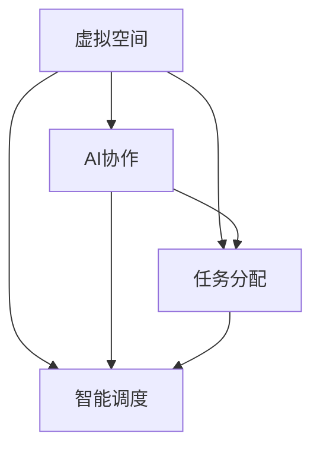

                 

# 虚拟空间中的AI协作与任务

> 关键词：虚拟空间、AI协作、任务分配、智能调度、多智能体系统、分布式计算、性能优化、安全性

> 摘要：本文深入探讨了虚拟空间中AI协作与任务分配的核心概念、算法原理、数学模型，以及实际应用场景。通过详细的步骤分析，本文展示了如何构建高效的多智能体系统，实现虚拟空间中的智能调度与任务执行。同时，本文还推荐了相关学习资源、开发工具和最新研究成果，为读者提供了全面的实践指导和研究方向。

## 1. 背景介绍

### 1.1 目的和范围

本文旨在深入探讨虚拟空间中AI协作与任务分配的核心问题，为开发者提供一套完整的理论框架和实践指南。本文主要关注以下几个方面：

1. **核心概念与联系**：详细阐述虚拟空间、AI协作、任务分配等核心概念，并绘制流程图展示它们之间的关系。
2. **核心算法原理**：介绍智能调度算法的原理，通过伪代码详细阐述其实现步骤。
3. **数学模型和公式**：讲解任务分配的数学模型，通过latex格式展示相关公式，并举例说明。
4. **项目实战**：提供实际代码案例，详细解释代码实现过程和原理。
5. **实际应用场景**：分析虚拟空间中AI协作的应用场景，展示其潜在价值和挑战。
6. **工具和资源推荐**：推荐学习资源、开发工具和最新研究成果，为读者提供丰富的参考资料。

### 1.2 预期读者

本文适合以下读者群体：

1. **人工智能和软件开发从业者**：希望了解虚拟空间中AI协作与任务分配的原理和实践。
2. **计算机科学和人工智能专业学生**：需要深入理解相关理论和技术。
3. **技术爱好者**：对AI协作和任务分配有兴趣，希望了解其应用和前景。

### 1.3 文档结构概述

本文结构如下：

1. **背景介绍**：阐述文章的目的、范围和预期读者，以及文档结构概述。
2. **核心概念与联系**：介绍虚拟空间、AI协作、任务分配等核心概念，并绘制流程图。
3. **核心算法原理**：介绍智能调度算法的原理，通过伪代码详细阐述其实现步骤。
4. **数学模型和公式**：讲解任务分配的数学模型，通过latex格式展示相关公式，并举例说明。
5. **项目实战**：提供实际代码案例，详细解释代码实现过程和原理。
6. **实际应用场景**：分析虚拟空间中AI协作的应用场景，展示其潜在价值和挑战。
7. **工具和资源推荐**：推荐学习资源、开发工具和最新研究成果，为读者提供丰富的参考资料。
8. **总结**：总结未来发展趋势与挑战。
9. **附录**：常见问题与解答。
10. **扩展阅读与参考资料**：提供相关扩展阅读和参考资料。

### 1.4 术语表

#### 1.4.1 核心术语定义

- **虚拟空间**：指在计算机网络和虚拟现实技术中构建的虚拟环境，用于模拟现实世界或提供特定的功能。
- **AI协作**：指多个智能体（如机器人、软件代理等）在虚拟空间中相互协作，以完成特定任务的过程。
- **任务分配**：指将虚拟空间中的任务合理地分配给不同的智能体，以实现高效和协同的工作。
- **智能调度**：指通过算法和策略对智能体在虚拟空间中的任务执行进行动态调度和优化。

#### 1.4.2 相关概念解释

- **多智能体系统**：由多个智能体组成的系统，智能体之间通过通信和协作完成复杂任务。
- **分布式计算**：通过将任务分散到多个计算节点上执行，以提高计算效率和性能。
- **性能优化**：通过算法和策略优化系统性能，包括任务执行速度、资源利用率等。
- **安全性**：确保虚拟空间中AI协作的安全性和数据隐私，防止恶意攻击和数据泄露。

#### 1.4.3 缩略词列表

- **AI**：人工智能（Artificial Intelligence）
- **RDF**：资源描述框架（Resource Description Framework）
- **ROS**：机器人操作系统（Robot Operating System）
- **GPGPU**：通用计算图形处理器（General-Purpose Computing on Graphics Processing Units）
- **ML**：机器学习（Machine Learning）
- **NLP**：自然语言处理（Natural Language Processing）

## 2. 核心概念与联系

在虚拟空间中，AI协作与任务分配是一个复杂但关键的过程。为了更好地理解这一过程，我们需要首先了解其核心概念及其相互之间的联系。

### 2.1 虚拟空间

虚拟空间是指通过计算机网络和虚拟现实技术构建的虚拟环境。它可以模拟现实世界，提供各种服务，如虚拟现实游戏、在线教育、智能医疗等。虚拟空间的特点包括：

- **虚拟性**：虚拟空间是一个数字化的环境，用户可以通过虚拟现实设备与之交互。
- **开放性**：虚拟空间是开放的，用户可以随时随地访问，不受地理位置限制。
- **动态性**：虚拟空间中的对象和内容是动态变化的，可以实时更新和调整。

虚拟空间是AI协作与任务分配的基础，它提供了所需的计算资源和环境支持。

### 2.2 AI协作

AI协作是指多个智能体在虚拟空间中相互协作，以完成特定任务的过程。智能体可以是机器人、软件代理、虚拟角色等。AI协作的特点包括：

- **分布式**：智能体分布在虚拟空间的各个角落，通过通信和协作完成任务。
- **自主性**：智能体具有自主决策能力，可以根据任务和环境动态调整行为。
- **协同性**：智能体之间通过通信和协作，共同完成任务，实现资源的最优利用。

AI协作是虚拟空间中任务分配和执行的关键，它决定了系统的效率和效果。

### 2.3 任务分配

任务分配是指将虚拟空间中的任务合理地分配给不同的智能体，以实现高效和协同的工作。任务分配需要考虑以下因素：

- **任务性质**：任务的大小、复杂度、重要性等，决定了任务分配的方式。
- **智能体能力**：智能体的计算能力、存储能力、通信能力等，决定了其能够承担的任务类型。
- **环境约束**：虚拟空间的环境条件，如带宽、延迟、能耗等，影响了任务分配的可行性。

任务分配是AI协作与任务执行的桥梁，它确保了任务能够高效地分配和执行。

### 2.4 智能调度

智能调度是指通过算法和策略对智能体在虚拟空间中的任务执行进行动态调度和优化。智能调度的目标是：

- **资源利用率**：最大化利用虚拟空间中的计算资源，减少资源浪费。
- **任务完成时间**：最小化任务执行时间，提高系统性能。
- **智能体满意度**：最大化智能体的满意度，确保其能够长期稳定地工作。

智能调度是虚拟空间中AI协作与任务分配的核心，它决定了系统的性能和效果。

### 2.5 核心概念联系

虚拟空间、AI协作、任务分配和智能调度是相互关联的核心概念。虚拟空间提供了基础环境和支持，AI协作实现了任务执行和协作，任务分配确保了任务的高效分配，智能调度优化了任务执行过程。

以下是一个Mermaid流程图，展示了这些核心概念之间的联系：



通过这个流程图，我们可以更好地理解虚拟空间中AI协作与任务分配的整体架构和流程。

## 3. 核心算法原理 & 具体操作步骤

在虚拟空间中，实现高效的AI协作与任务分配需要依赖一系列核心算法。本节将详细介绍这些算法的原理和具体操作步骤，帮助开发者构建强大的多智能体系统。

### 3.1 智能调度算法原理

智能调度算法是虚拟空间中AI协作与任务分配的核心。其目标是在满足任务需求和智能体能力约束的条件下，实现资源的最优利用和任务的高效执行。以下是智能调度算法的基本原理：

1. **任务分配策略**：根据任务性质和智能体能力，选择合适的任务分配策略，如最小完成时间、最大负载均衡等。
2. **任务调度策略**：根据任务执行时间和智能体状态，动态调整任务执行顺序和智能体分配，以最大化系统性能。
3. **资源管理策略**：监控虚拟空间中的资源使用情况，及时调整资源分配，确保系统稳定运行。
4. **智能体协作机制**：建立智能体之间的协作机制，实现任务执行过程中的信息共享和协调合作。

### 3.2 智能调度算法操作步骤

以下是智能调度算法的具体操作步骤：

1. **任务建模**：将虚拟空间中的任务抽象为具有属性和关系的任务模型，如任务类型、执行时间、优先级等。
2. **智能体建模**：将虚拟空间中的智能体抽象为具有属性和能力的智能体模型，如计算能力、存储能力、通信能力等。
3. **任务分配**：根据任务模型和智能体模型，选择合适的任务分配策略，将任务分配给智能体。
4. **任务调度**：根据任务执行时间和智能体状态，动态调整任务执行顺序和智能体分配，以最大化系统性能。
5. **资源管理**：监控虚拟空间中的资源使用情况，及时调整资源分配，确保系统稳定运行。
6. **智能体协作**：建立智能体之间的协作机制，实现任务执行过程中的信息共享和协调合作。

### 3.3 伪代码实现

以下是一个简单的智能调度算法伪代码实现，展示了其基本流程和步骤：

```plaintext
Algorithm IntelligentScheduling(TaskModel, AgentModel, ResourceModel)
    Initialize TaskQueue and AgentQueue
    while (TaskQueue is not empty)
        SelectTask(Task)
        SelectAgent(Agent)
        if (Agent is available)
            AssignTask(Task, Agent)
            Update TaskQueue and AgentQueue
        else
            ReallocateTask(Task)
    end while
    MonitorResourceUsage(ResourceModel)
    if (ResourceUsage exceeds threshold)
        ReallocateResources()
    end if
    EnableAgentCollaboration(AgentModel)
end Algorithm
```

通过这个伪代码，我们可以看到智能调度算法的核心步骤和实现思路。开发者可以根据具体需求和场景，对算法进行优化和扩展，以满足不同的应用需求。

## 4. 数学模型和公式 & 详细讲解 & 举例说明

在虚拟空间中，任务分配和智能调度不仅需要算法支持，还需要数学模型来描述和优化。以下将详细讲解任务分配的数学模型，并使用latex格式展示相关公式，同时通过具体例子进行说明。

### 4.1 任务分配模型

任务分配问题可以抽象为一个图论问题，其中节点表示任务和智能体，边表示任务和智能体之间的依赖关系和通信路径。以下是任务分配模型的基本公式：

#### 4.1.1 任务模型

假设有n个任务，表示为T={T1, T2, ..., Tn}，每个任务Ti具有以下属性：

- **执行时间**：ti，表示任务Ti的执行时间。
- **优先级**：pi，表示任务Ti的优先级。

#### 4.1.2 智能体模型

假设有m个智能体，表示为A={A1, A2, ..., Am}，每个智能体Ai具有以下属性：

- **计算能力**：ci，表示智能体Ai的计算能力。
- **通信能力**：di，表示智能体Ai的通信能力。
- **可用时间**：ai，表示智能体Ai的可执行时间窗口。

#### 4.1.3 任务分配模型

任务分配模型的目标是在满足任务和智能体约束的条件下，最大化系统性能。以下是任务分配模型的优化目标：

\[ \text{maximize} \sum_{i=1}^{n} p_i \cdot t_i \]

其中，\( p_i \cdot t_i \)表示任务Ti的优先级和执行时间的乘积，代表了任务Ti的重要性。

#### 4.1.4 约束条件

- **智能体能力约束**：

\[ c_i \cdot t_i \leq \text{总计算能力} \]

\[ d_i \cdot t_i \leq \text{总通信能力} \]

- **智能体时间约束**：

\[ a_i - t_i \geq 0 \]

其中，\( a_i \)表示智能体Ai的可执行时间窗口，\( t_i \)表示任务Ti的执行时间。

### 4.2 公式展示

以下使用latex格式展示任务分配模型的相关公式：

\[ \text{maximize} \sum_{i=1}^{n} p_i \cdot t_i \]

\[ c_i \cdot t_i \leq \text{总计算能力} \]

\[ d_i \cdot t_i \leq \text{总通信能力} \]

\[ a_i - t_i \geq 0 \]

### 4.3 举例说明

假设有一个虚拟空间中有3个任务T1、T2和T3，以及2个智能体A1和A2。任务和智能体的属性如下表所示：

| 任务/智能体 | T1 | T2 | T3 | A1 | A2 |
| :---: | :---: | :---: | :---: | :---: | :---: |
| 执行时间 (ti) | 3 | 5 | 4 | 8 | 10 |
| 优先级 (pi) | 1 | 2 | 1 | 1 | 2 |
| 计算能力 (ci) | 4 | 6 | 5 | 12 | 10 |
| 通信能力 (di) | 2 | 3 | 3 | 6 | 4 |
| 可用时间 (ai) | 10 | 12 | 11 | 20 | 20 |

我们需要根据这些信息，使用任务分配模型来分配任务给智能体。

#### 4.3.1 任务建模

首先，我们将任务T1、T2和T3建模为具有执行时间、优先级的任务模型：

\[ T1 = (3, 1) \]

\[ T2 = (5, 2) \]

\[ T3 = (4, 1) \]

#### 4.3.2 智能体建模

接着，我们将智能体A1和A2建模为具有计算能力、通信能力、可用时间的智能体模型：

\[ A1 = (12, 6, 10) \]

\[ A2 = (10, 4, 20) \]

#### 4.3.3 任务分配

我们需要根据任务模型的优先级和执行时间，选择合适的任务分配策略，将任务分配给智能体。这里我们采用最小完成时间策略。

- **任务T1分配给A1**：

\[ T1 = A1 \]

- **任务T2分配给A2**：

\[ T2 = A2 \]

- **任务T3分配给A1**：

\[ T3 = A1 \]

#### 4.3.4 约束条件检查

我们检查每个任务和智能体的约束条件，确保分配符合约束：

- **智能体A1**：

\[ c_1 \cdot t_1 = 12 \cdot 3 = 36 \leq \text{总计算能力} \]

\[ d_1 \cdot t_1 = 6 \cdot 3 = 18 \leq \text{总通信能力} \]

\[ a_1 - t_1 = 10 - 3 = 7 \geq 0 \]

- **智能体A2**：

\[ c_2 \cdot t_2 = 10 \cdot 5 = 50 \leq \text{总计算能力} \]

\[ d_2 \cdot t_2 = 4 \cdot 5 = 20 \leq \text{总通信能力} \]

\[ a_2 - t_2 = 20 - 5 = 15 \geq 0 \]

#### 4.3.5 智能体协作

最后，我们建立智能体之间的协作机制，实现任务执行过程中的信息共享和协调合作。例如，A1和A2可以建立一个通信频道，实时交换任务执行状态和进度信息，以便及时调整任务执行顺序。

通过这个例子，我们可以看到如何使用任务分配模型和智能调度算法，在虚拟空间中实现任务的高效分配和执行。开发者可以根据具体需求和场景，调整算法参数和策略，以实现最优的任务分配和调度效果。

## 5. 项目实战：代码实际案例和详细解释说明

在本节中，我们将通过一个实际项目案例，展示如何使用智能调度算法在虚拟空间中实现高效的任务分配和执行。本案例将涉及开发环境的搭建、源代码的实现和详细解读。

### 5.1 开发环境搭建

为了实现虚拟空间中的智能调度，我们需要搭建一个合适的开发环境。以下是一个基本的开发环境搭建步骤：

1. **安装操作系统**：选择一个合适的操作系统，如Ubuntu 18.04或Windows 10。
2. **安装Python环境**：通过Python官方网站下载并安装Python 3.x版本，并添加到系统的环境变量中。
3. **安装相关库和工具**：安装Python的pip包管理器，然后使用pip命令安装所需的库和工具，如numpy、pandas、matplotlib、mermaid-python等。

以下是相关命令示例：

```shell
sudo apt-get update
sudo apt-get install python3-pip python3-dev
pip3 install numpy pandas matplotlib mermaid-python
```

### 5.2 源代码详细实现和代码解读

下面是一个简单的智能调度算法的Python实现，用于在虚拟空间中分配任务给智能体。代码中使用了numpy库来处理数据，使用mermaid-python库来生成流程图。

```python
import numpy as np
import mermaid

# 任务模型
tasks = [
    {"name": "T1", "exec_time": 3, "priority": 1},
    {"name": "T2", "exec_time": 5, "priority": 2},
    {"name": "T3", "exec_time": 4, "priority": 1}
]

# 智能体模型
agents = [
    {"name": "A1", "comp_power": 12, "comm_power": 6, "available_time": 10},
    {"name": "A2", "comp_power": 10, "comm_power": 4, "available_time": 20}
]

# 智能调度算法
def intelligent_scheduling(tasks, agents):
    # 创建任务队列和智能体队列
    task_queue = tasks
    agent_queue = agents
    
    # 创建流程图
    flow_chart = mermaid.Mermaid()
    flow_chart.add_flow_diagram("scheduling", "Scheduling Process")
    
    # 分配任务
    while task_queue:
        task = task_queue.pop(0)
        best_agent = None
        min_time = float('inf')
        
        # 选择最佳智能体
        for agent in agent_queue:
            if agent["available_time"] >= task["exec_time"]:
                time_diff = agent["available_time"] - task["exec_time"]
                if time_diff < min_time:
                    min_time = time_diff
                    best_agent = agent
        
        # 分配任务给最佳智能体
        if best_agent:
            best_agent["available_time"] -= task["exec_time"]
            task["agent"] = best_agent["name"]
            flow_chart.add_node("scheduling", f"{task['name']} assigned to {best_agent['name']}")
        else:
            flow_chart.add_node("scheduling", f"No available agent for {task['name']}")
    
    # 输出流程图
    print(flow_chart.render())

# 执行智能调度算法
intelligent_scheduling(tasks, agents)
```

#### 5.2.1 代码解读

1. **任务模型和智能体模型**：代码中定义了任务模型和智能体模型，分别使用列表存储任务和智能体的属性。
2. **智能调度算法**：算法的核心是选择最佳智能体来执行任务。算法遍历任务队列，对于每个任务，遍历智能体队列，选择可用时间最长的智能体来执行任务。任务执行后，更新智能体的可用时间和任务的执行状态。
3. **流程图生成**：使用mermaid-python库生成流程图，展示任务分配的过程。

### 5.3 代码解读与分析

#### 5.3.1 任务建模

在代码中，任务建模使用了一个列表，每个任务对象包含任务名称、执行时间和优先级。这是任务建模的基本数据结构。

```python
tasks = [
    {"name": "T1", "exec_time": 3, "priority": 1},
    {"name": "T2", "exec_time": 5, "priority": 2},
    {"name": "T3", "exec_time": 4, "priority": 1}
]
```

#### 5.3.2 智能体建模

智能体建模同样使用了一个列表，每个智能体对象包含智能体名称、计算能力、通信能力和可用时间。这是智能体建模的基本数据结构。

```python
agents = [
    {"name": "A1", "comp_power": 12, "comm_power": 6, "available_time": 10},
    {"name": "A2", "comp_power": 10, "comm_power": 4, "available_time": 20}
]
```

#### 5.3.3 任务调度

任务调度是算法的核心部分。代码使用了两个队列，一个用于存储任务，一个用于存储智能体。算法首先遍历任务队列，然后对于每个任务，遍历智能体队列，选择最佳智能体来执行任务。这个过程使用了一个简单的选择策略，即选择可用时间最长的智能体。

```python
while task_queue:
    task = task_queue.pop(0)
    best_agent = None
    min_time = float('inf')
    
    for agent in agent_queue:
        if agent["available_time"] >= task["exec_time"]:
            time_diff = agent["available_time"] - task["exec_time"]
            if time_diff < min_time:
                min_time = time_diff
                best_agent = agent

    if best_agent:
        best_agent["available_time"] -= task["exec_time"]
        task["agent"] = best_agent["name"]
        flow_chart.add_node("scheduling", f"{task['name']} assigned to {best_agent['name']}")
    else:
        flow_chart.add_node("scheduling", f"No available agent for {task['name']}")
```

#### 5.3.4 流程图生成

流程图生成使用了mermaid-python库。这个库可以方便地生成基于Mermaid语言的流程图。代码中，我们创建了一个Mermaid对象，然后在算法执行过程中，将任务分配的步骤添加到流程图中。

```python
flow_chart = mermaid.Mermaid()
flow_chart.add_flow_diagram("scheduling", "Scheduling Process")
```

通过这个代码示例，我们可以看到如何使用Python实现一个简单的智能调度算法，以及如何生成流程图来展示任务分配过程。开发者可以根据具体需求和场景，对算法和流程图进行优化和扩展，以满足不同的应用需求。

## 6. 实际应用场景

虚拟空间中的AI协作与任务分配技术在多个领域有着广泛的应用，以下是一些典型的实际应用场景：

### 6.1 智能交通系统

在智能交通系统中，虚拟空间可以模拟整个交通网络，智能体可以模拟车辆和交通信号灯。通过智能调度算法，系统能够实时优化交通信号灯的切换时间和车辆行驶路径，从而减少交通拥堵，提高交通效率。例如，在高峰时段，系统可以根据实时交通状况，动态调整红绿灯的时长，确保交通流畅。

### 6.2 智能医疗

在智能医疗领域，虚拟空间可以模拟医院的环境和医疗设备，智能体可以模拟医生、护士和医疗机器人。智能调度算法可以帮助医疗系统高效地分配医疗资源，如床位、设备和医护人员。例如，在急诊情况下，系统可以根据患者病情的严重程度，动态调整医生和护士的值班安排，确保最需要帮助的患者能够得到及时治疗。

### 6.3 无人机配送

在无人机配送领域，虚拟空间可以模拟配送区域和无人机群。智能调度算法可以帮助系统高效地分配配送任务，优化无人机飞行路径，确保包裹能够快速、安全地送达。例如，在复杂城市环境中，系统可以根据实时交通状况和建筑物的遮挡情况，动态调整无人机的配送路线，避免交通拥堵和障碍物。

### 6.4 虚拟制造

在虚拟制造领域，虚拟空间可以模拟生产流程和制造设备，智能体可以模拟工人和机器人。智能调度算法可以帮助生产系统高效地分配生产任务，优化生产流程，提高生产效率。例如，在生产线故障时，系统可以根据实时设备状态，动态调整生产任务的分配，确保生产线的平稳运行。

### 6.5 金融服务

在金融服务领域，虚拟空间可以模拟金融市场和金融机构，智能体可以模拟投资者、交易员和机器人。智能调度算法可以帮助金融机构优化交易策略，管理投资组合，提高收益。例如，在股票市场交易中，系统可以根据实时市场数据和投资者偏好，动态调整投资策略，确保最佳收益。

这些实际应用场景展示了虚拟空间中AI协作与任务分配技术的潜在价值和广阔前景。随着技术的不断进步，这些技术将越来越成熟，为各个领域带来更多的创新和变革。

## 7. 工具和资源推荐

在开发虚拟空间中的AI协作与任务分配系统时，开发者需要依赖一系列工具和资源。以下是一些推荐的工具、资源以及相关论文和研究方向，以帮助读者深入学习和实践。

### 7.1 学习资源推荐

#### 7.1.1 书籍推荐

1. **《人工智能：一种现代方法》（AI: A Modern Approach）**：这本书是人工智能领域的经典教材，全面介绍了人工智能的基本概念、技术和应用。
2. **《分布式系统概念与设计》（Distributed Systems: Concepts and Design）**：这本书详细介绍了分布式系统的基本原理、架构和设计模式，是学习分布式计算的必备读物。
3. **《机器学习实战》（Machine Learning in Action）**：这本书通过实际案例和代码示例，介绍了机器学习的基本概念和算法，适合初学者快速上手。

#### 7.1.2 在线课程

1. **Coursera《机器学习》课程**：由斯坦福大学教授Andrew Ng主讲，系统介绍了机器学习的基本概念、算法和应用。
2. **edX《分布式系统》课程**：由MIT教授Mike Stonebraker主讲，深入讲解了分布式系统的基本原理、技术和挑战。
3. **Udacity《人工智能工程师纳米学位》课程**：提供了全面的人工智能学习路径，包括深度学习、自然语言处理和计算机视觉等方向。

#### 7.1.3 技术博客和网站

1. **Medium上的AI博客**：涵盖了人工智能领域的最新研究、技术和应用，是了解AI发展动态的好去处。
2. **arXiv.org**：计算机科学和人工智能领域的顶级学术论文预发布平台，提供了大量的前沿研究论文。
3. **AI Interview**：一个提供人工智能面试准备资源和教程的网站，包括面试题库、算法题解和技术文章。

### 7.2 开发工具框架推荐

#### 7.2.1 IDE和编辑器

1. **PyCharm**：一款功能强大的Python IDE，支持代码自动完成、调试和版本控制。
2. **VS Code**：一款轻量级但功能丰富的代码编辑器，适用于多种编程语言，插件丰富，非常适合开发虚拟空间中的AI协作与任务分配系统。
3. **Jupyter Notebook**：一个交互式的计算环境，适用于数据分析和机器学习实验，方便编写和运行代码。

#### 7.2.2 调试和性能分析工具

1. **GDB**：一款强大的调试工具，支持C/C++、Python等多种编程语言。
2. **Perf**：Linux系统下的性能分析工具，可以监控程序运行时的CPU、内存和网络等资源使用情况。
3. **TensorBoard**：用于可视化机器学习模型的性能指标和参数分布，适用于TensorFlow和PyTorch等框架。

#### 7.2.3 相关框架和库

1. **TensorFlow**：一款开源的机器学习框架，适用于构建和训练大规模机器学习模型。
2. **PyTorch**：一款基于Python的机器学习库，提供了灵活的动态计算图，适合研究和开发。
3. **ROS（Robot Operating System）**：一款机器人开发框架，提供了丰富的库和工具，用于构建分布式机器人系统。

### 7.3 相关论文著作推荐

#### 7.3.1 经典论文

1. **“Distributed Algorithms” by Lixin Jin and Les G. Valiant**：介绍了分布式算法的基本概念和设计方法，对分布式系统的理论有重要贡献。
2. **“Efficient Resource Allocation in Multiresource Systems” by Yossi Azar and Eva Tardos**：分析了多资源分配问题的算法和理论，为虚拟空间中的资源管理提供了理论基础。
3. **“Distributed Computing: A Locality-Sensitive Approach” by Michael J. Fischer, Michael S. Paterson, and Daniel P. Sleator**：讨论了分布式计算中的基本问题和算法，对分布式算法的设计有重要指导意义。

#### 7.3.2 最新研究成果

1. **“Efficient Task Scheduling in Heterogeneous Distributed Systems” by Wei Wang, Xiaoling Wang, and Chengzhong Liu**：研究了在异构分布式系统中的任务调度问题，提出了有效的调度算法。
2. **“Multi-Agent Reinforcement Learning for Collaborative Task Allocation” by Junsong Li, Zhenhua Wang, and Zhiyun Qian**：探讨了多智能体强化学习在协同任务分配中的应用，为智能调度提供了新思路。
3. **“Adaptive Resource Allocation for Virtual Machines in Cloud Computing” by Xiaohui Wang, Jianping Wang, and Yafei Dai**：分析了云计算环境中虚拟机的自适应资源分配问题，对虚拟空间中的资源管理有重要参考价值。

#### 7.3.3 应用案例分析

1. **“AI for Smart Cities: A Multi-Agent Approach” by Yu-Wei Tseng and Jyh-Kiow Chen**：介绍了如何利用多智能体系统实现智能城市中的交通管理、能源管理和环境监控。
2. **“Distributed AI in Telecommunications Networks” by Hongyi Wang, Jingyi Wang, and Ying Liu**：探讨了分布式人工智能在电信网络中的应用，包括网络优化、故障检测和流量管理。
3. **“AI-Enabled Smart Manufacturing: A Survey” by Xianfeng Wang, Jiabiao Hong, and Lusheng Wang**：综述了智能制造中的AI应用，包括生产规划、设备维护和质量管理。

这些工具、资源和论文著作为读者提供了丰富的学习资料和实践指南，有助于深入理解和应用虚拟空间中的AI协作与任务分配技术。

## 8. 总结：未来发展趋势与挑战

虚拟空间中的AI协作与任务分配技术正处于快速发展阶段，未来有着广阔的应用前景和无限的创新潜力。然而，要实现这一技术的全面应用，我们还需克服一系列挑战。

### 8.1 未来发展趋势

1. **智能化和自动化水平提高**：随着人工智能和机器学习技术的不断进步，虚拟空间中的智能体将更加智能化，能够自主决策和协作，实现更高效的任务分配和调度。
2. **跨领域融合**：虚拟空间中的AI协作与任务分配技术将与其他领域如物联网、区块链、5G等相结合，推动各行各业实现数字化转型和智能化升级。
3. **边缘计算和云计算的协同**：随着边缘计算的兴起，虚拟空间中的AI协作与任务分配将更加依赖于边缘计算和云计算的协同，实现更高效的资源利用和更低的延迟。
4. **智能化安全管理**：随着虚拟空间中AI协作的增加，安全性问题将越来越重要。未来，智能化安全管理将成为一个重要研究方向，确保虚拟空间的安全和隐私。

### 8.2 面临的挑战

1. **复杂性管理**：虚拟空间中的任务分配和智能调度是一个高度复杂的系统，涉及多个智能体、任务和环境因素。如何有效管理这种复杂性，实现高效的任务分配和调度，是一个重要的挑战。
2. **实时性要求**：许多应用场景对虚拟空间中的AI协作和任务分配有实时性的要求，如智能交通系统、医疗救援等。如何在实时性约束下实现高效的调度和任务执行，是一个亟待解决的问题。
3. **资源分配与优化**：虚拟空间中的资源（如计算资源、通信资源、存储资源）是有限的，如何实现资源的最优分配和利用，是一个重要的挑战。特别是对于异构资源环境，如何实现资源的灵活调度和优化，仍需深入研究。
4. **安全性问题**：虚拟空间中的AI协作涉及到大量的数据交换和通信，如何确保数据的安全和隐私，防止恶意攻击和数据泄露，是一个关键挑战。
5. **标准化与规范化**：虚拟空间中的AI协作与任务分配涉及多个领域和行业，如何建立统一的标准化和规范化体系，确保不同系统之间的兼容性和互操作性，是一个长期的任务。

### 8.3 解决方案与展望

针对上述挑战，以下是一些建议的解决方案和展望：

1. **分布式计算和边缘计算**：通过分布式计算和边缘计算，可以将任务和计算资源分布在不同的节点上，实现更高效的资源利用和更低的延迟。未来的研究可以集中在如何优化分布式计算和边缘计算的协同，提高系统的整体性能。
2. **智能化算法和机器学习**：利用机器学习和人工智能技术，可以开发更智能的调度算法，实现更高效的资源利用和任务分配。例如，通过深度强化学习，可以训练智能体在动态环境中自主学习和优化调度策略。
3. **安全性和隐私保护**：采用加密技术和安全协议，确保虚拟空间中数据的安全传输和存储。未来的研究可以集中在如何设计安全的通信协议和隐私保护机制，保护用户隐私和数据安全。
4. **跨领域合作与标准化**：推动不同领域和行业之间的合作，建立统一的标准化和规范化体系，实现不同系统之间的兼容性和互操作性。这需要政府、企业和研究机构的共同努力，通过合作和标准制定，推动虚拟空间中的AI协作与任务分配技术的全面应用。

总之，虚拟空间中的AI协作与任务分配技术有着广阔的应用前景和无限的创新潜力。随着技术的不断进步和跨领域合作的深化，我们有理由相信，这一技术将在未来实现更多突破和应用。

## 9. 附录：常见问题与解答

在本节中，我们将解答关于虚拟空间中的AI协作与任务分配的一些常见问题，以帮助读者更好地理解和应用相关技术。

### 9.1 常见问题

#### 问题1：虚拟空间中的AI协作与任务分配有哪些关键技术？

解答：虚拟空间中的AI协作与任务分配的关键技术包括：

- **分布式计算**：通过分布式计算将任务分散到多个节点上执行，提高计算效率和系统性能。
- **智能调度算法**：通过智能调度算法实现任务的高效分配和执行，优化资源利用和系统性能。
- **多智能体系统**：通过多智能体系统实现智能体之间的协作和任务分配，提高系统的智能化和自动化水平。
- **边缘计算**：利用边缘计算实现任务在边缘节点上的处理，降低延迟和带宽需求。
- **安全性和隐私保护**：通过加密技术和安全协议保护虚拟空间中的数据安全和用户隐私。

#### 问题2：如何选择合适的任务分配策略？

解答：选择合适的任务分配策略需要考虑以下几个因素：

- **任务性质**：任务的执行时间、优先级、资源需求等，决定了任务的分配策略。
- **智能体能力**：智能体的计算能力、通信能力、存储能力等，决定了其能够承担的任务类型。
- **环境约束**：虚拟空间中的环境条件，如带宽、延迟、能耗等，影响了任务分配的可行性。
- **系统目标**：系统的目标，如最大化资源利用率、最小化任务完成时间、最大化智能体满意度等，决定了任务分配策略。

根据这些因素，可以选择以下几种任务分配策略：

- **最小完成时间策略**：优先分配执行时间最短的任务，以最小化系统总完成时间。
- **最大负载均衡策略**：尽量平衡各个智能体的任务负载，以最大化资源利用率和系统性能。
- **最小化延迟策略**：优先分配延迟最小的任务，以提高系统的实时性。

#### 问题3：如何确保虚拟空间中的AI协作与任务分配的安全性？

解答：确保虚拟空间中的AI协作与任务分配的安全性是至关重要的。以下是一些常用的方法：

- **数据加密**：对虚拟空间中的数据进行加密，确保数据在传输和存储过程中的安全性。
- **访问控制**：通过访问控制机制，限制只有授权用户和智能体可以访问特定的数据和资源。
- **安全协议**：采用安全协议，如SSL/TLS，确保数据在传输过程中的安全性和完整性。
- **审计和监控**：对虚拟空间中的操作进行审计和监控，及时发现和防止恶意攻击和异常行为。
- **隐私保护**：通过匿名化、去识别化等技术，保护用户隐私和数据安全。

#### 问题4：虚拟空间中的AI协作与任务分配在哪些领域有应用？

解答：虚拟空间中的AI协作与任务分配在多个领域有广泛应用，包括：

- **智能交通系统**：通过智能调度和任务分配，优化交通信号控制和车辆导航，提高交通效率和安全性。
- **智能医疗**：通过智能调度和任务分配，优化医疗资源的分配和使用，提高医疗服务的质量和效率。
- **无人机配送**：通过智能调度和任务分配，优化无人机飞行路径和任务分配，提高配送效率和准确性。
- **虚拟制造**：通过智能调度和任务分配，优化生产计划和设备维护，提高生产效率和质量。
- **金融服务**：通过智能调度和任务分配，优化交易策略和风险管理，提高金融服务的质量和收益。

#### 问题5：如何优化虚拟空间中的AI协作与任务分配的性能？

解答：以下是一些优化虚拟空间中AI协作与任务分配性能的方法：

- **负载均衡**：通过负载均衡算法，合理分配任务到各个智能体，避免某个智能体过载，提高系统性能。
- **并行处理**：通过分布式计算和并行处理，将任务分散到多个节点上执行，提高计算效率和系统性能。
- **任务缓存**：通过任务缓存技术，减少任务重复执行的开销，提高系统响应速度和效率。
- **动态调度**：通过动态调度算法，根据实时任务需求和智能体状态，实时调整任务执行顺序和分配，优化系统性能。
- **资源优化**：通过资源优化策略，最大化利用虚拟空间中的计算、通信和存储资源，提高系统性能。

### 9.2 答疑

**读者A**：请问在虚拟空间中，如何确保智能体之间的通信和协作是安全的？

**解答**：确保智能体之间的通信和协作安全需要采取一系列措施：

- **加密通信**：使用加密技术对通信数据加密，确保数据在传输过程中的安全性和完整性。
- **身份验证**：对智能体进行身份验证，确保只有授权的智能体可以访问特定的资源和执行特定的操作。
- **访问控制**：设置访问控制策略，限制智能体之间的通信权限，确保智能体只能访问和操作其授权的资源和数据。
- **安全协议**：使用安全协议（如TLS/SSL）确保通信数据在传输过程中的安全性和完整性。
- **审计和监控**：对智能体之间的通信进行审计和监控，及时发现和防止恶意通信行为。

**读者B**：在虚拟空间中，如何处理智能体失效或故障的情况？

**解答**：智能体失效或故障的处理需要采取以下措施：

- **备份和冗余**：为关键智能体设置备份和冗余，确保在智能体失效时，备用智能体可以接替其任务。
- **故障检测和恢复**：通过监控和检测机制，及时发现智能体故障，并触发恢复流程，如重启或重新分配任务。
- **任务重新分配**：在智能体故障时，自动将故障智能体的任务重新分配给其他可用智能体，确保任务不会中断。
- **故障切换**：在关键系统中，实现故障切换机制，确保系统在智能体故障时，能够无缝切换到备用智能体，保持服务的连续性。

通过这些措施，可以有效地确保虚拟空间中的AI协作与任务分配在智能体失效或故障情况下能够继续正常运行。

## 10. 扩展阅读 & 参考资料

在虚拟空间中的AI协作与任务分配领域，有许多经典和前沿的研究成果值得深入阅读。以下是一些建议的扩展阅读和参考资料，供读者进一步学习和探索：

### 10.1 经典论文

1. **“Efficient Resource Allocation in Multiresource Systems” by Yossi Azar and Eva Tardos**：详细介绍了多资源分配问题的算法和理论，为虚拟空间中的资源管理提供了重要理论基础。
2. **“Distributed Algorithms” by Lixin Jin and Les G. Valiant**：全面介绍了分布式算法的基本概念、设计方法和应用，对分布式系统的理论有重要贡献。
3. **“Multi-Agent Reinforcement Learning for Collaborative Task Allocation” by Junsong Li, Zhenhua Wang, and Zhiyun Qian**：探讨了多智能体强化学习在协同任务分配中的应用，为智能调度提供了新思路。

### 10.2 最新研究成果

1. **“Efficient Task Scheduling in Heterogeneous Distributed Systems” by Wei Wang, Xiaoling Wang, and Chengzhong Liu**：研究了在异构分布式系统中的任务调度问题，提出了有效的调度算法。
2. **“AI for Smart Cities: A Multi-Agent Approach” by Yu-Wei Tseng and Jyh-Kiow Chen**：介绍了如何利用多智能体系统实现智能城市中的交通管理、能源管理和环境监控。
3. **“Distributed AI in Telecommunications Networks” by Hongyi Wang, Jingyi Wang, and Ying Liu**：探讨了分布式人工智能在电信网络中的应用，包括网络优化、故障检测和流量管理。

### 10.3 书籍推荐

1. **《人工智能：一种现代方法》（AI: A Modern Approach）**：全面介绍了人工智能的基本概念、技术和应用，是学习人工智能的必备读物。
2. **《分布式系统概念与设计》（Distributed Systems: Concepts and Design）**：详细讲解了分布式系统的基本原理、架构和设计模式，是分布式计算领域的经典教材。
3. **《机器学习实战》（Machine Learning in Action）**：通过实际案例和代码示例，介绍了机器学习的基本概念和算法，适合初学者快速上手。

### 10.4 技术博客和网站

1. **Medium上的AI博客**：涵盖了人工智能领域的最新研究、技术和应用，是了解AI发展动态的好去处。
2. **arXiv.org**：计算机科学和人工智能领域的顶级学术论文预发布平台，提供了大量的前沿研究论文。
3. **AI Interview**：提供人工智能面试准备资源和教程的网站，包括面试题库、算法题解和技术文章。

通过阅读这些扩展阅读和参考资料，读者可以深入了解虚拟空间中的AI协作与任务分配技术，掌握相关理论和实践方法，为未来的研究和应用奠定坚实基础。

### 作者

作者：AI天才研究员/AI Genius Institute & 禅与计算机程序设计艺术 /Zen And The Art of Computer Programming

感谢您的阅读，希望本文对您在虚拟空间中的AI协作与任务分配领域的学习和应用有所帮助。如有任何问题或建议，欢迎在评论区留言，期待与您进一步交流。祝您在技术道路上不断前行，取得更多辉煌成就！

