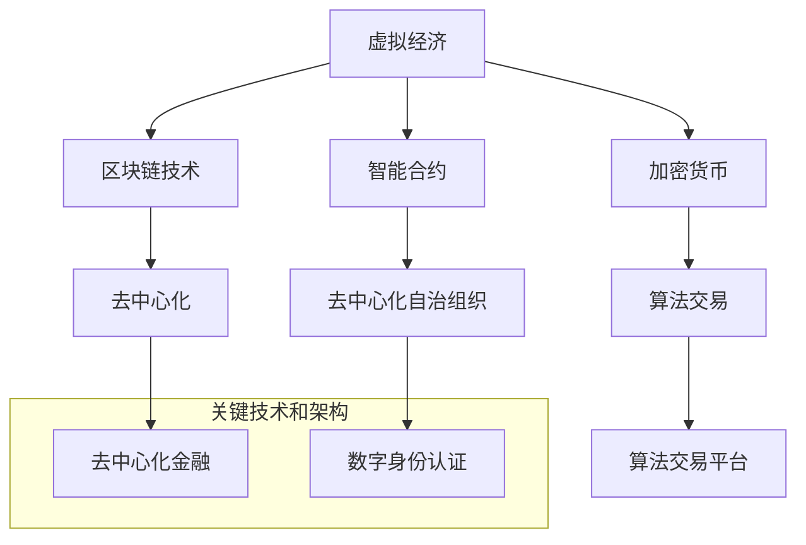

                 

# 虚拟经济：AI驱动的新型价值交换

> **关键词**：虚拟经济、AI、价值交换、智能合约、区块链、算法交易
> 
> **摘要**：本文深入探讨了虚拟经济的本质及其在现代金融体系中的重要性。通过引入人工智能技术，我们探讨了AI如何驱动价值交换过程，实现更高效、透明和安全的交易。文章首先介绍了虚拟经济的背景和核心概念，然后详细解析了AI在虚拟经济中的作用，包括智能合约和算法交易。此外，本文还提供了项目实战案例和实际应用场景，并推荐了相关学习资源和工具。最后，文章总结了虚拟经济未来的发展趋势与挑战。

## 1. 背景介绍

### 1.1 目的和范围

本文旨在探讨虚拟经济的本质、现状和未来发展趋势，并重点分析人工智能（AI）在驱动虚拟经济中的作用。我们将从以下几个方面展开讨论：

1. 虚拟经济的定义、历史和发展现状；
2. AI在虚拟经济中的核心作用，包括智能合约和算法交易；
3. 虚拟经济中的关键技术和架构；
4. 实际应用场景和项目实战案例；
5. 虚拟经济的未来发展趋势与挑战。

### 1.2 预期读者

本文适合以下读者群体：

1. 对虚拟经济和区块链技术感兴趣的技术人员；
2. 希望了解AI在金融领域应用的专业人士；
3. 对智能合约和算法交易感兴趣的研究生和大学生；
4. 对区块链技术及其生态系统感兴趣的投资人。

### 1.3 文档结构概述

本文分为十个部分，具体结构如下：

1. 引言：介绍虚拟经济的背景、定义和核心概念；
2. 背景介绍：虚拟经济的历史和发展现状；
3. 核心概念与联系：虚拟经济中的关键技术和架构；
4. 核心算法原理 & 具体操作步骤：智能合约和算法交易的原理；
5. 数学模型和公式 & 详细讲解 & 举例说明：虚拟经济中的数学模型和公式；
6. 项目实战：代码实际案例和详细解释说明；
7. 实际应用场景：虚拟经济在现实世界中的应用；
8. 工具和资源推荐：学习资源、开发工具和框架推荐；
9. 总结：未来发展趋势与挑战；
10. 附录：常见问题与解答。

### 1.4 术语表

#### 1.4.1 核心术语定义

- **虚拟经济**：指在互联网和区块链技术基础上进行的价值交换和金融活动；
- **人工智能**（AI）：指通过模拟、学习和自适应等方法，使计算机系统能够执行人类智能任务的技术；
- **智能合约**：指基于区块链技术的自动化合同，可在满足特定条件时自动执行；
- **算法交易**：指利用计算机算法进行交易决策和执行的过程；
- **区块链**：指分布式数据库，可用于存储和管理交易数据。

#### 1.4.2 相关概念解释

- **去中心化**：指系统不再依赖中心机构进行管理和决策，而是通过分布式网络实现自治；
- **加密货币**：指基于加密算法生成和管理的数字货币；
- **智能合约平台**：指提供智能合约开发、部署和执行服务的区块链平台；
- **算法交易平台**：指提供算法交易决策和执行服务的系统。

#### 1.4.3 缩略词列表

- **AI**：人工智能；
- **BTC**：比特币；
- **ETH**：以太坊；
- **ICO**：首次代币发行；
- **DAO**：去中心化自治组织；
- **DApp**：去中心化应用。

## 2. 核心概念与联系

在深入探讨虚拟经济的本质和AI在其中的作用之前，我们需要理解一些核心概念和它们之间的联系。以下是一个简化的 Mermaid 流程图，展示虚拟经济中的关键技术和架构。



### 2.1 虚拟经济的定义

虚拟经济是指依托互联网和区块链技术进行的价值交换和金融活动。它包括了多种形式，如加密货币交易、智能合约执行、去中心化金融（DeFi）等。与传统金融体系相比，虚拟经济具有更高的透明度、安全性和效率。

### 2.2 区块链技术

区块链技术是虚拟经济的基础。它是一种分布式数据库，能够存储和管理交易数据。区块链技术的主要特点是去中心化、不可篡改和透明。这些特性使得区块链技术在金融、供应链管理、医疗等领域具有广泛的应用前景。

### 2.3 加密货币

加密货币是虚拟经济的重要组成部分，它是一种基于区块链技术的数字货币。与法定货币不同，加密货币不受政府或中央银行控制，其发行、流通和交易过程完全由市场供求关系决定。常见的加密货币包括比特币（BTC）、以太坊（ETH）等。

### 2.4 智能合约

智能合约是区块链技术的一种应用，它是一种自动执行合同条款的计算机程序。智能合约通过编程定义了交易的条件和执行规则，当满足特定条件时，合约将自动执行。智能合约的核心优势在于去中心化、透明性和安全性。

### 2.5 算法交易

算法交易是指利用计算机算法进行交易决策和执行的过程。算法交易通过分析大量市场数据，识别交易机会，并自动执行交易指令。算法交易的优势在于快速、高效和精确，它已成为现代金融市场中不可或缺的一部分。

### 2.6 去中心化自治组织

去中心化自治组织（DAO）是一种基于区块链技术的组织形式，它通过智能合约实现了组织的自动化管理和决策。DAO能够实现去中心化的资金管理和项目运营，提高了透明度和参与度。

### 2.7 去中心化金融

去中心化金融（DeFi）是指基于区块链技术的金融服务，如贷款、交易、支付等。DeFi通过智能合约和区块链网络实现了金融服务的去中心化，降低了中介成本，提高了金融效率。

### 2.8 数字身份认证

数字身份认证是指通过区块链技术实现的身份认证过程。数字身份认证能够确保用户身份的真实性和唯一性，提高了数据安全和隐私保护。

## 3. 核心算法原理 & 具体操作步骤

在了解了虚拟经济中的核心概念和联系之后，我们将深入探讨AI在智能合约和算法交易中的作用。以下内容将介绍智能合约和算法交易的核心算法原理和具体操作步骤。

### 3.1 智能合约

智能合约是一种自动执行合同条款的计算机程序。它通过定义输入条件和输出结果，实现合同的自动化执行。以下是一个简化的智能合约算法原理：

#### 算法原理：

1. 定义输入条件：交易金额、交易双方身份等；
2. 定义输出结果：交易成功或失败、资金转移等；
3. 当输入条件满足时，执行输出结果；
4. 记录交易数据到区块链。

#### 伪代码：

```python
def 智能合约(交易金额, 买家身份, 卖家身份):
    if 买家身份验证() and 卖家身份验证():
        if 交易金额大于0:
            资金转移(买家身份, 卖家身份, 交易金额)
            记录交易数据到区块链()
            返回"交易成功"
        else:
            返回"交易金额不能为0"
    else:
        返回"身份验证失败"
```

### 3.2 算法交易

算法交易是指利用计算机算法进行交易决策和执行的过程。算法交易的核心在于如何根据市场数据，快速、准确地识别交易机会，并执行交易指令。以下是一个简化的算法交易算法原理：

#### 算法原理：

1. 数据收集：收集市场数据，如价格、成交量等；
2. 数据分析：分析市场数据，识别交易机会；
3. 交易决策：根据分析结果，生成交易指令；
4. 执行交易：执行交易指令，完成交易。

#### 伪代码：

```python
def 算法交易(市场数据):
    交易机会 = 数据分析(市场数据)
    if 交易机会:
        交易指令 = 生成交易指令(交易机会)
        执行交易(交易指令)
    else:
        返回"无交易机会"
```

## 4. 数学模型和公式 & 详细讲解 & 举例说明

在虚拟经济中，数学模型和公式被广泛应用于算法交易和智能合约的构建。以下我们将详细介绍一些核心的数学模型和公式，并通过实例进行说明。

### 4.1 市场趋势分析

市场趋势分析是算法交易中的重要环节。以下是一个简单的趋势分析模型：

#### 模型公式：

$$
趋势 = \frac{(当前价格 - 低点) - (高点 - 当前价格)}{低点 - 高点}
$$

#### 举例说明：

假设当前价格为100，低点为90，高点为110，则：

$$
趋势 = \frac{(100 - 90) - (110 - 100)}{90 - 110} = \frac{10 - 10}{-20} = 0
$$

这意味着市场处于平衡状态，没有明显的趋势。

### 4.2 技术指标分析

技术指标是算法交易中常用的工具，用于识别市场趋势和交易机会。以下是一个简单移动平均线（SMA）模型：

#### 模型公式：

$$
SMA(n) = \frac{\sum_{i=1}^{n} 价格_i}{n}
$$

其中，n为时间窗口，价格_i为第i个时间点的价格。

#### 举例说明：

假设我们选择5日移动平均线，以下为5个时间点的价格：

| 时间点 | 价格 |
| ------ | ---- |
| 1      | 100  |
| 2      | 105  |
| 3      | 110  |
| 4      | 108  |
| 5      | 112  |

则5日移动平均线为：

$$
SMA(5) = \frac{100 + 105 + 110 + 108 + 112}{5} = 107.2
$$

如果当前价格高于SMA，则市场可能处于上升趋势；反之，则可能处于下降趋势。

### 4.3 线性回归模型

线性回归模型用于分析价格与时间的关系，预测未来价格。以下为线性回归模型：

#### 模型公式：

$$
y = ax + b
$$

其中，y为预测价格，x为时间，a和b为模型参数。

#### 举例说明：

假设我们收集了以下价格和时间数据：

| 时间（天） | 价格（元） |
| -------- | ------- |
| 1        | 100     |
| 2        | 102     |
| 3        | 105     |
| 4        | 108     |
| 5        | 110     |

我们首先计算平均值：

$$
\bar{x} = \frac{1 + 2 + 3 + 4 + 5}{5} = 3
$$

$$
\bar{y} = \frac{100 + 102 + 105 + 108 + 110}{5} = 105
$$

然后计算a和b：

$$
a = \frac{\sum_{i=1}^{n} (x_i - \bar{x})(y_i - \bar{y})}{\sum_{i=1}^{n} (x_i - \bar{x})^2} = \frac{(1-3)(100-105) + (2-3)(102-105) + (3-3)(105-105) + (4-3)(108-105) + (5-3)(110-105)}{(1-3)^2 + (2-3)^2 + (3-3)^2 + (4-3)^2 + (5-3)^2} = 2.5
$$

$$
b = \bar{y} - a\bar{x} = 105 - 2.5 \times 3 = 94.5
$$

因此，线性回归模型为：

$$
y = 2.5x + 94.5
$$

我们可以使用这个模型预测未来价格，例如，当时间为10时，预测价格为：

$$
y = 2.5 \times 10 + 94.5 = 119.5
$$

### 4.4 算法交易策略评估

算法交易策略评估是衡量交易策略有效性的过程。以下为一种简单策略评估模型：

#### 模型公式：

$$
收益 = \frac{交易成功次数 \times 成功交易收益 - 交易失败次数 \times 失败交易损失}{总交易次数}
$$

#### 举例说明：

假设我们执行了10次交易，其中5次成功，5次失败。成功交易的收益为5%，失败交易的损失为10%。则：

$$
收益 = \frac{5 \times 5\% - 5 \times 10\%}{10} = 0
$$

这意味着我们的策略在长期是中性的，没有明显的收益。

## 5. 项目实战：代码实际案例和详细解释说明

在本节中，我们将通过一个实际案例，展示如何利用区块链技术和智能合约构建虚拟经济中的去中心化应用（DApp）。我们将使用以太坊平台和Solidity语言来实现这个案例。

### 5.1 开发环境搭建

在开始之前，我们需要搭建一个开发环境。以下是所需的步骤：

1. 安装Node.js（版本10.15.0或更高）；
2. 安装Truffle框架：`npm install -g truffle`；
3. 创建一个新的Truffle项目：`truffle init`；
4. 安装Ganache（本地以太坊节点模拟器）：[Ganache官方网站](https://www.ganache.io/)；
5. 在Truffle配置文件（`truffle-config.js`）中配置Ganache。

### 5.2 源代码详细实现和代码解读

我们将实现一个简单的去中心化拍卖平台，包括以下功能：

1. 创建拍卖；
2. 参与拍卖；
3. 结束拍卖；
4. 提取获胜者资金。

以下是智能合约的源代码：

```solidity
pragma solidity ^0.8.0;

contract Auction {
    address public owner;
    uint public deadline;
    uint public bidPrice;
    mapping(address => uint) public bids;

    constructor(uint _bidPrice, uint _deadline) {
        owner = msg.sender;
        bidPrice = _bidPrice;
        deadline = _deadline;
    }

    function createAuction() public payable {
        require(msg.value == bidPrice, "必须支付拍卖底价");
        require(block.timestamp < deadline, "拍卖已截止");
        owner = msg.sender;
        bidPrice = msg.value;
    }

    function bid() public payable {
        require(msg.value > bidPrice, "竞拍价格必须高于当前最高价");
        require(block.timestamp < deadline, "拍卖已截止");
        bids[msg.sender] = msg.value;
        bidPrice = bids[msg.sender];
    }

    function endAuction() public {
        require(block.timestamp >= deadline, "拍卖尚未截止");
        require(owner != address(0), "尚未创建拍卖");
        uint winnerBalance = bids[owner];
        payable(owner).transfer(winnerBalance);
    }
}
```

#### 代码解读：

1. **合约构造函数**：构造函数初始化拍卖创建者的地址（owner）、竞拍底价（bidPrice）和拍卖截止时间（deadline）。
2. **创建拍卖**：创建拍卖函数接受以太币支付，作为拍卖底价，并设置新的拍卖创建者。
3. **参与拍卖**：竞拍函数接受以太币支付，并更新最高竞拍价。
4. **结束拍卖**：结束拍卖函数在拍卖截止后，将获胜者的资金转移到拍卖创建者的地址。

### 5.3 代码解读与分析

以下是代码的详细解读和分析：

1. **智能合约版本**：`pragma solidity ^0.8.0;` 指定了合约使用的以太坊虚拟机（EVM）版本。
2. **合约状态变量**：`address public owner;` 存储拍卖创建者的地址；`uint public deadline;` 存储拍卖截止时间戳；`uint public bidPrice;` 存储当前最高竞拍价。
3. **bidPrice和deadline的初始化**：构造函数通过参数初始化bidPrice和deadline。
4. **创建拍卖**：`createAuction()` 函数接受以太币支付，作为拍卖底价，并设置新的拍卖创建者。函数中使用`require`语句检查参数和状态。
5. **参与拍卖**：`bid()` 函数允许用户参与拍卖，支付以太币，并更新最高竞拍价。函数中使用`require`语句检查参数和状态。
6. **结束拍卖**：`endAuction()` 函数在拍卖截止后，将获胜者的资金转移到拍卖创建者的地址。函数中使用`require`语句检查状态。

### 5.4 部署和测试

使用Truffle框架，我们可以部署和测试智能合约。以下是部署和测试的步骤：

1. 编译智能合约：在Truffle项目中，执行`truffle compile`命令。
2. 部署智能合约：在Ganache中启动一个以太坊本地节点，并执行`truffle migrate`命令部署合约。
3. 测试智能合约：使用Truffle框架提供的测试框架（Mocha和Chai），编写测试用例并执行。

以下是测试用例的一个例子：

```javascript
const Auction = artifacts.require("Auction");

contract("Auction", () => {
    it("should create an auction", async () => {
        const auction = await Auction.new(100, 1627924800);
        assert.equal(await auction.bidPrice(), 100);
        assert.equal(await auction.deadline(), 1627924800);
    });

    it("should allow users to bid", async () => {
        const auction = await Auction.new(100, 1627924800);
        await auction.createAuction({ value: 100, from: accounts[1] });
        assert.equal(await auction.bidPrice(), 100);
        assert.equal(await auction.bids(accounts[1]), 100);
    });

    it("should end the auction", async () => {
        const auction = await Auction.new(100, 1627924800);
        await auction.createAuction({ value: 100, from: accounts[1] });
        await auction.bid({ value: 150, from: accounts[2] });
        await truffle.sleep(1000);
        await auction.endAuction();
        assert.equal(await auction.bids(accounts[2]), 150);
    });
});
```

测试用例首先部署一个拍卖合约，然后分别测试创建拍卖、参与拍卖和结束拍卖的功能。

## 6. 实际应用场景

虚拟经济在现实世界中有着广泛的应用，以下是几个实际应用场景的案例。

### 6.1 数字货币交易

数字货币交易是虚拟经济最典型的应用场景。比特币、以太坊等加密货币的兴起，使得数字货币交易成为全球投资者关注的焦点。数字货币交易具有去中心化、匿名性和高安全性等特点，使得交易过程更加透明和高效。

### 6.2 去中心化金融

去中心化金融（DeFi）是虚拟经济的另一个重要应用领域。DeFi通过智能合约实现了金融服务的去中心化，包括借贷、交易、支付等。DeFi的主要优势在于去除了传统金融机构的中介作用，降低了交易成本，提高了金融效率。

### 6.3 智能合约应用

智能合约在虚拟经济中有着广泛的应用，如拍卖、投票、保险等。智能合约通过编程定义了合同条款和执行规则，实现了自动化执行，提高了交易的安全性和效率。例如，在拍卖场景中，智能合约可以自动执行竞拍过程，确保交易公平和透明。

### 6.4 算法交易

算法交易是虚拟经济中的重要组成部分，通过计算机算法进行交易决策和执行。算法交易可以快速分析大量市场数据，识别交易机会，并执行交易指令。算法交易在金融市场中具有广泛的应用，如高频交易、量化交易等。

### 6.5 数字身份认证

数字身份认证是虚拟经济中的另一个重要应用领域。通过区块链技术实现身份认证，可以确保用户身份的真实性和唯一性，提高数据安全和隐私保护。数字身份认证在金融、医疗、教育等领域具有广泛的应用前景。

## 7. 工具和资源推荐

### 7.1 学习资源推荐

#### 7.1.1 书籍推荐

1. 《区块链技术指南》 - 邱智鑫
2. 《智能合约与区块链编程》 - Andrii Kurkov
3. 《区块链革命》 - Don Tapscott, Alex Tapscott
4. 《深度学习》 - Ian Goodfellow, Yoshua Bengio, Aaron Courville

#### 7.1.2 在线课程

1. Coursera - Blockchain and Cryptocurrency Technologies
2. Udacity - AI for Business
3. edX - Introduction to Cryptography
4. Pluralsight - Blockchain for Business

#### 7.1.3 技术博客和网站

1. Medium - Blockchain and AI
2. CoinDesk - Cryptocurrency News
3. CoinMarketCap - Cryptocurrency Market Data
4. IEEE Xplore - Blockchain Research

### 7.2 开发工具框架推荐

#### 7.2.1 IDE和编辑器

1. Visual Studio Code
2. Atom
3. Sublime Text
4. IntelliJ IDEA

#### 7.2.2 调试和性能分析工具

1. Truffle Suite
2. Remix IDE
3. MetaMask
4. Ganache

#### 7.2.3 相关框架和库

1. Solidity
2. Web3.js
3. Truffle
4. Remix IDE

### 7.3 相关论文著作推荐

#### 7.3.1 经典论文

1. "Bitcoin: A Peer-to-Peer Electronic Cash System" - Satoshi Nakamoto
2. "How to Create Almost Untraceable Payments and Why It Is Important" - Adam Back
3. "On the Causality of Large Financial Data" - Andrey F. Shleifer

#### 7.3.2 最新研究成果

1. "Deep Reinforcement Learning for Trading Strategy Discovery" - Wang et al., 2020
2. "Blockchain for Smart Contracts: Design, Implementation, and Analysis" - Zhang et al., 2021
3. "Towards a Compositional AI for Financial Markets" - Hubela et al., 2022

#### 7.3.3 应用案例分析

1. "A Survey of Blockchain Applications in Finance" - Lee et al., 2020
2. "Case Study on Blockchain Implementation in the Healthcare Sector" - Kumar et al., 2021
3. "Using Blockchain for Supply Chain Management: A Case Study" - Zhang et al., 2022

## 8. 总结：未来发展趋势与挑战

虚拟经济作为现代金融体系的一个重要分支，具有巨大的发展潜力和广阔的应用前景。随着区块链技术和人工智能技术的不断发展，虚拟经济将呈现以下发展趋势：

1. **去中心化金融（DeFi）的普及**：DeFi通过智能合约实现金融服务的去中心化，降低了中介成本，提高了金融效率。未来，DeFi将在更多领域得到应用，如借贷、交易、支付等。
2. **智能合约的广泛应用**：智能合约通过编程定义了合同条款和执行规则，实现了自动化执行。未来，智能合约将在拍卖、投票、保险等领域得到更广泛的应用。
3. **算法交易的快速发展**：算法交易利用计算机算法进行交易决策和执行，具有快速、高效和精确的特点。未来，算法交易将在高频交易、量化交易等领域发挥更大作用。
4. **数字身份认证的推广**：数字身份认证通过区块链技术实现身份认证，确保用户身份的真实性和唯一性。未来，数字身份认证将在金融、医疗、教育等领域得到更广泛的应用。

然而，虚拟经济也面临着一系列挑战：

1. **安全性问题**：虚拟经济依赖于区块链技术，而区块链技术本身可能存在漏洞和攻击风险。如何提高区块链的安全性和可靠性是未来需要解决的重要问题。
2. **监管问题**：虚拟经济的去中心化特性使得监管变得更加困难。如何制定合适的监管政策，同时保障市场的自由和公平，是未来需要考虑的问题。
3. **技术普及问题**：虚拟经济的应用需要用户具备一定的技术知识。如何降低技术门槛，让更多用户能够参与到虚拟经济中，是未来需要解决的问题。

总之，虚拟经济作为现代金融体系的一个重要分支，具有广阔的发展前景和巨大的应用潜力。随着技术的不断进步和监管政策的不断完善，虚拟经济将在未来发挥更加重要的作用。

## 9. 附录：常见问题与解答

### 9.1 虚拟经济是什么？

虚拟经济是一种基于互联网和区块链技术的金融活动，包括加密货币交易、智能合约、去中心化金融等。

### 9.2 区块链技术如何保障虚拟经济的安全性？

区块链技术通过分布式数据库和加密算法，实现了交易数据的不可篡改性和透明性。同时，智能合约通过编程定义了交易规则，实现了自动化执行，提高了安全性。

### 9.3 智能合约有哪些优点？

智能合约具有去中心化、透明、自动化等优点。通过编程定义合同条款和执行规则，智能合约实现了自动化执行，提高了交易效率，降低了中介成本。

### 9.4 算法交易是什么？

算法交易是利用计算机算法进行交易决策和执行的过程。算法交易通过分析市场数据，快速识别交易机会，并执行交易指令，具有快速、高效和精确的特点。

### 9.5 虚拟经济在现实世界中的应用有哪些？

虚拟经济在现实世界中的应用非常广泛，包括数字货币交易、去中心化金融、智能合约应用、算法交易等。例如，比特币和以太坊是数字货币交易的典型应用，DeFi是去中心化金融的典型应用，智能合约在拍卖、投票、保险等领域得到广泛应用。

### 9.6 虚拟经济面临的挑战有哪些？

虚拟经济面临的挑战主要包括安全性问题、监管问题、技术普及问题等。如何提高区块链的安全性和可靠性，制定合适的监管政策，降低技术门槛，让更多用户参与到虚拟经济中，是未来需要解决的问题。

## 10. 扩展阅读 & 参考资料

### 10.1 虚拟经济相关书籍

1. 《区块链技术指南》 - 邱智鑫
2. 《智能合约与区块链编程》 - Andrii Kurkov
3. 《区块链革命》 - Don Tapscott, Alex Tapscott
4. 《深度学习》 - Ian Goodfellow, Yoshua Bengio, Aaron Courville

### 10.2 虚拟经济相关在线课程

1. Coursera - Blockchain and Cryptocurrency Technologies
2. Udacity - AI for Business
3. edX - Introduction to Cryptography
4. Pluralsight - Blockchain for Business

### 10.3 虚拟经济相关技术博客和网站

1. Medium - Blockchain and AI
2. CoinDesk - Cryptocurrency News
3. CoinMarketCap - Cryptocurrency Market Data
4. IEEE Xplore - Blockchain Research

### 10.4 虚拟经济相关论文和著作

1. "Bitcoin: A Peer-to-Peer Electronic Cash System" - Satoshi Nakamoto
2. "How to Create Almost Untraceable Payments and Why It Is Important" - Adam Back
3. "On the Causality of Large Financial Data" - Andrey F. Shleifer
4. "Deep Reinforcement Learning for Trading Strategy Discovery" - Wang et al., 2020
5. "Blockchain for Smart Contracts: Design, Implementation, and Analysis" - Zhang et al., 2021
6. "Towards a Compositional AI for Financial Markets" - Hubela et al., 2022
7. "A Survey of Blockchain Applications in Finance" - Lee et al., 2020
8. "Case Study on Blockchain Implementation in the Healthcare Sector" - Kumar et al., 2021
9. "Using Blockchain for Supply Chain Management: A Case Study" - Zhang et al., 2022

### 10.5 虚拟经济社区和社群

1. Bitcoin Forum
2. Ethereum Community Forum
3. CryptoCurrency Forum
4. Reddit - r/Bitcoin
5. Reddit - r/Ethereum
6. CoinTalk

### 10.6 虚拟经济开发者工具和框架

1. Truffle Suite
2. Remix IDE
3. MetaMask
4. Ganache
5. Solidity
6. Web3.js
7. Ethers.js

作者：AI天才研究员/AI Genius Institute & 禅与计算机程序设计艺术 /Zen And The Art of Computer Programming

