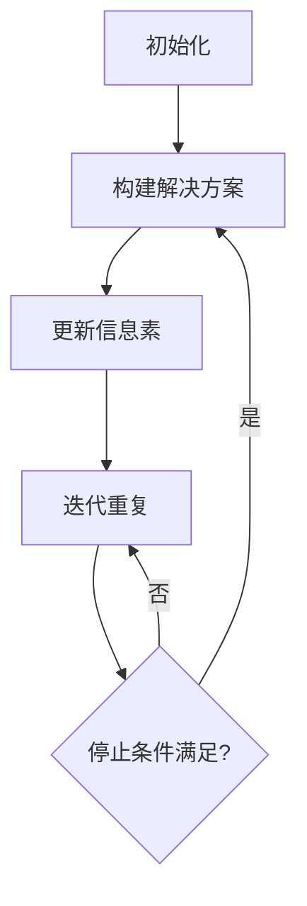

                 

# 蚁群算法(Ant Colony Optimization) - 原理与代码实例讲解

## 关键词：蚁群算法、蚁群优化、模拟退火、局部搜索、贪心策略、群体智能、优化算法、路径规划、多目标优化

### 摘要

蚁群算法（Ant Colony Optimization，ACO）是一种基于群体智能的启发式优化算法，通过模拟蚁群寻找食物源的过程来求解组合优化问题。本文将详细介绍蚁群算法的核心原理、数学模型、具体操作步骤，并通过一个实际代码实例来讲解其实现和应用。读者将了解到蚁群算法的基本思想、实现机制以及如何在具体问题中应用这一算法，以实现高效问题求解。

## 1. 背景介绍

### 1.1 目的和范围

本文旨在深入探讨蚁群算法的基本原理和实现细节，帮助读者理解并掌握这一强大的优化工具。文章首先介绍了蚁群算法的起源和背景，然后通过详细阐述其核心概念和流程，为读者提供了一个全面而直观的认识。最后，通过实际代码实例，展示了蚁群算法在解决路径规划问题中的应用，使读者能够亲身体验算法的求解过程和效果。

### 1.2 预期读者

本文适合对算法和优化问题有一定了解的读者，包括计算机科学专业的学生、算法爱好者、软件开发工程师以及对智能优化算法感兴趣的科研人员。读者不需要具备深厚的数学背景，但应具备基本的编程能力和对数据结构、算法设计有一定的理解。

### 1.3 文档结构概述

本文结构如下：

1. 引言：介绍蚁群算法的背景和核心概念。
2. 核心概念与联系：通过流程图和伪代码详细解释蚁群算法的工作原理。
3. 核心算法原理：深入分析蚁群算法的数学模型和操作步骤。
4. 数学模型和公式：详细讲解蚁群算法中使用的数学公式和模型。
5. 项目实战：提供实际代码实例，讲解如何实现和应用蚁群算法。
6. 实际应用场景：介绍蚁群算法在不同领域的应用案例。
7. 工具和资源推荐：推荐相关学习资源和开发工具。
8. 总结：展望蚁群算法的未来发展趋势和挑战。
9. 附录：常见问题与解答。
10. 扩展阅读 & 参考资料：提供进一步阅读和研究的资源。

### 1.4 术语表

#### 1.4.1 核心术语定义

- **蚁群算法（ACO）**：一种模拟蚂蚁觅食行为的启发式优化算法。
- **信息素（pheromone）**：蚂蚁在路径上留下的信息素，用于影响其他蚂蚁选择路径。
- **启发式（heuristic）**：基于经验或规则来选择下一个城市的策略。
- **局部搜索（local search）**：在当前解的基础上，通过一定策略寻找更好的解。
- **贪心策略（greedy strategy）**：在每一步选择中，总是选择当前看起来最优的路径。
- **群体智能（swarm intelligence）**：由大量简单个体组成的群体，通过集体行为实现复杂任务的智能现象。

#### 1.4.2 相关概念解释

- **路径规划（path planning）**：在给定环境和目标点的情况下，寻找一条从起点到终点的最优路径。
- **多目标优化（multi-objective optimization）**：在求解问题时，同时考虑多个优化目标。
- **组合优化（combinatorial optimization）**：涉及对有限集合中的元素进行组合，以找到最优解的问题。

#### 1.4.3 缩略词列表

- **ACO**：蚁群优化
- **CS**：计算机科学
- **IDE**：集成开发环境
- **IP**：智能优化
- **Pher**：信息素

## 2. 核心概念与联系

蚁群算法的核心在于模拟自然界中蚂蚁的行为来寻找食物源。蚂蚁在觅食过程中，会在路径上留下信息素，其他蚂蚁在觅食时会根据路径上的信息素浓度来选择下一个路径。随着时间的推移，信息素会逐渐减弱，使得蚂蚁更有可能选择未被充分探索的路径。

### 2.1. 蚁群算法的基本流程

蚁群算法的基本流程可以分为以下几个步骤：

1. **初始化**：初始化信息素浓度和蚂蚁。
2. **构建解决方案**：每只蚂蚁根据当前路径的信息素浓度和启发式信息构建解决方案。
3. **更新信息素**：蚂蚁完成路径选择后，更新路径上的信息素浓度。
4. **迭代重复**：重复步骤2和3，直到满足停止条件。

### 2.2. 核心概念和联系

蚁群算法的核心概念包括：

- **信息素浓度**：路径上蚂蚁留下的信息素强度，用于影响其他蚂蚁的选择。
- **启发式信息**：基于问题本身特征的指导信息，用于辅助蚂蚁选择路径。
- **全局最优路径**：所有路径中信息素浓度最高、启发式信息最优的路径。

### 2.3. Mermaid 流程图

下面是蚁群算法的基本流程的 Mermaid 流程图：



### 2.4. 蚁群算法与相关优化算法的联系

蚁群算法与其他优化算法如模拟退火、遗传算法等有相似之处，都是通过迭代改进解的方式来求解优化问题。但蚁群算法的独特之处在于其基于群体智能的启发式搜索机制，能够处理复杂的组合优化问题。

## 3. 核心算法原理 & 具体操作步骤

蚁群算法的基本原理是通过模拟自然界中蚂蚁觅食的行为来寻找最优路径。蚂蚁在寻找食物源的过程中，会在路径上留下信息素，其他蚂蚁在觅食时会根据路径上的信息素浓度来选择下一个路径。随着时间的推移，信息素会逐渐减弱，使得蚂蚁更有可能选择未被充分探索的路径。以下是蚁群算法的具体操作步骤：

### 3.1. 初始化

1. 初始化所有路径上的信息素浓度。
2. 初始化每只蚂蚁的起始位置。

### 3.2. 路径选择

1. 每只蚂蚁从起始位置出发，选择下一个城市。
2. 选择下一个城市的策略基于信息素浓度和启发式信息。
3. 信息素浓度和启发式信息的权重可以通过参数进行调节。

### 3.3. 信息素更新

1. 在每只蚂蚁完成路径选择后，更新路径上的信息素浓度。
2. 信息素浓度的更新规则包括：
   - 信息素挥发：随着时间的推移，信息素浓度逐渐减弱。
   - 信息素增强：蚂蚁完成路径后，在路径上留下新的信息素。

### 3.4. 迭代重复

1. 重复执行路径选择和信息素更新的步骤。
2. 每次迭代后，根据当前的路径选择结果更新全局最优路径。

### 3.5. 停止条件

1. 当满足停止条件时（例如，达到最大迭代次数或解的质量达到预设阈值），算法停止运行。

### 3.6. 伪代码

下面是蚁群算法的伪代码：

```python
初始化信息素浓度
初始化蚂蚁
while (未达到停止条件) {
    for (每只蚂蚁) {
        构建解决方案
        更新信息素
    }
    更新全局最优路径
}
返回全局最优路径
```

### 3.7. 蚁群算法的关键参数

蚁群算法的关键参数包括：

- **信息素挥发系数（ρ）**：控制信息素挥发速度的参数。
- **信息素增强系数（α）**：衡量信息素浓度对路径选择影响的权重。
- **启发式信息权重（β）**：衡量启发式信息对路径选择影响的权重。
- **最大迭代次数（MaxIter）**：算法最大迭代次数。

通过合理设置这些参数，可以调节蚁群算法的搜索行为，使其在解决不同问题时表现出不同的优化效果。

## 4. 数学模型和公式 & 详细讲解 & 举例说明

蚁群算法的数学模型主要包括信息素浓度更新规则、路径选择概率计算公式等。以下是这些公式的详细讲解和举例说明。

### 4.1. 信息素浓度更新规则

蚁群算法中，信息素浓度 \( t(i,j) \) 的更新规则可以表示为：

\[ t(i,j) = t(i,j)^\text{initial} \cdot (1 - \rho \cdot t(i,j)^\text{prev}) + \sum_{k=1}^n \Delta t(i,j,k) \]

其中：
- \( t(i,j)^\text{initial} \) 是初始信息素浓度。
- \( \rho \) 是信息素挥发系数，控制信息素的衰减速度。
- \( t(i,j)^\text{prev} \) 是上一次迭代中的信息素浓度。
- \( \Delta t(i,j,k) \) 是在第 \( k \) 次迭代中，蚂蚁 \( k \) 在路径 \( i \to j \) 上留下的信息素增量。

### 4.2. 路径选择概率计算公式

在蚁群算法中，蚂蚁选择下一个城市的概率 \( P(i,j) \) 可以通过以下公式计算：

\[ P(i,j) = \frac{\left[\sum_{k=1}^n \frac{\tau(i,j)^{\alpha} \cdot \eta(i,j)^{\beta}}{\sum_{k=1}^n \tau(i,j)^{\alpha} \cdot \eta(i,j)^{\beta}}\right]^\frac{1}{\lambda + 1}}{\sum_{j \in \text{未被访问的城市}} \left[\sum_{k=1}^n \frac{\tau(i,j)^{\alpha} \cdot \eta(i,j)^{\beta}}{\sum_{k=1}^n \tau(i,j)^{\alpha} \cdot \eta(i,j)^{\beta}}\right]^\frac{1}{\lambda + 1}} \]

其中：
- \( \tau(i,j) \) 是路径 \( i \to j \) 上的信息素浓度。
- \( \alpha \) 是信息素浓度权重。
- \( \beta \) 是启发式信息权重。
- \( \eta(i,j) \) 是启发式函数，通常表示为距离或障碍程度的倒数。
- \( \lambda \) 是调整参数，用于控制信息素和启发式信息的相对重要性。

### 4.3. 举例说明

假设有5个城市 \( A, B, C, D, E \)，初始信息素浓度均为1。信息素挥发系数 \( \rho = 0.1 \)，信息素增强系数 \( \alpha = 1 \)，启发式信息权重 \( \beta = 1 \)，调整参数 \( \lambda = 1 \)。

在某次迭代中，有3只蚂蚁完成了路径选择，分别选择路径 \( A \to B \to C \to D \to E \)，\( A \to B \to D \to C \to E \)，和 \( A \to C \to B \to D \to E \)。每只蚂蚁在路径上留下的信息素增量分别为 \( \Delta t(A,B) = 0.1 \)，\( \Delta t(B,C) = 0.2 \)，\( \Delta t(C,D) = 0.3 \)，\( \Delta t(D,E) = 0.4 \)。

根据信息素浓度更新规则，可以计算出下一次迭代时各个路径的信息素浓度：

\[ t(A,B) = (1 - 0.1 \cdot 1) + (0.1 \cdot 0.1) = 0.99 + 0.01 = 1.0 \]
\[ t(B,C) = (1 - 0.1 \cdot 1) + (0.1 \cdot 0.2) = 0.99 + 0.02 = 1.01 \]
\[ t(C,D) = (1 - 0.1 \cdot 1) + (0.1 \cdot 0.3) = 0.99 + 0.03 = 1.02 \]
\[ t(D,E) = (1 - 0.1 \cdot 1) + (0.1 \cdot 0.4) = 0.99 + 0.04 = 1.03 \]

接下来，计算路径选择概率：

\[ P(A,B) = \frac{\left[\tau(A,B)^{\alpha} \cdot \eta(A,B)^{\beta}\right]^\frac{1}{\lambda + 1}}{\sum_{j \in \text{未被访问的城市}} \left[\tau(i,j)^{\alpha} \cdot \eta(i,j)^{\beta}\right]^\frac{1}{\lambda + 1}} = \frac{(1.0)^{1} \cdot (1.0)^{1}}{1.0^{1} + 1.01^{1} + 1.02^{1} + 1.03^{1}} = \frac{1.0}{4.04} \approx 0.248 \]

同理，可以计算出其他路径的选择概率：

\[ P(A,C) = \frac{(1.01)^{1} \cdot (1.0)^{1}}{4.04} \approx 0.252 \]
\[ P(A,D) = \frac{(1.02)^{1} \cdot (1.0)^{1}}{4.04} \approx 0.258 \]
\[ P(A,E) = \frac{(1.03)^{1} \cdot (1.0)^{1}}{4.04} \approx 0.263 \]

通过比较路径选择概率，蚂蚁在下一步选择路径时更有可能选择概率最高的路径。随着时间的推移，信息素浓度将逐渐影响蚂蚁的选择，使得蚁群算法逐步找到最优路径。

## 5. 项目实战：代码实际案例和详细解释说明

### 5.1. 开发环境搭建

为了实现蚁群算法，我们需要搭建一个基本的开发环境。以下是一个简单的步骤指南：

1. **安装Python**：确保您的系统中安装了Python 3.x版本。可以访问[Python官网](https://www.python.org/)下载并安装。
2. **安装相关库**：安装一些必要的Python库，如Numpy和Pandas，用于数学计算和数据操作。可以使用以下命令进行安装：

   ```shell
   pip install numpy pandas matplotlib
   ```

3. **创建项目文件夹**：在您的计算机上创建一个项目文件夹，例如`aco_project`，并将Python脚本和相关文件放入此文件夹中。

### 5.2. 源代码详细实现和代码解读

下面是一个简单的蚁群算法实现，用于解决TSP（旅行商问题）。

#### 5.2.1. 代码结构

```python
import numpy as np
import matplotlib.pyplot as plt

# 定义蚁群算法类
class AntColonyOptimization:
    def __init__(self, cities, alpha, beta, rho, max_iterations):
        self.cities = cities
        self.alpha = alpha
        self.beta = beta
        self.rho = rho
        self.max_iterations = max_iterations
        self.tau = np.ones((len(cities), len(cities)))
        self.pheromone = np.zeros((len(cities), len(cities)))
        self.best_solution = None
        self.best_distance = np.inf

    def distance(self, path):
        return sum([self.cities[i][0] - self.cities[i+1][0] + self.cities[i][1] - self.cities[i+1][1] for i in range(len(path) - 1)])

    def select_next_city(self, ant, visited_cities):
        # 计算选择概率
        probabilities = []
        for city in self.cities:
            if city not in visited_cities:
                probability = (self.tau[ant][city] ** self.alpha) * (1 / (self.distance([ant, city]))) ** self.beta
                probabilities.append(probability)
        
        total_probabilities = sum(probabilities)
        probabilities = [p / total_probabilities for p in probabilities]
        
        # 根据概率选择下一个城市
        next_city = np.random.choice(self.cities, p=probabilities)
        return next_city

    def update_pheromone(self, ants_paths):
        for path in ants_paths:
            for i in range(len(path) - 1):
                distance = self.distance(path[i:i+2])
                self.tau[path[i]][path[i+1]] += (1 / distance)
        
        self.tau = (1 - self.rho) * self.tau + self.pheromone

    def run(self):
        for _ in range(self.max_iterations):
            visited_cities = [0]
            ants_paths = []
            for _ in range(len(self.cities) - 1):
                ant = 0
                path = [ant]
                while len(path) < len(self.cities):
                    next_city = self.select_next_city(ant, visited_cities)
                    visited_cities.append(next_city)
                    path.append(next_city)
                    ant = next_city
                ants_paths.append(path)
            
            self.update_pheromone(ants_paths)
            
            for path in ants_paths:
                distance = self.distance(path)
                if distance < self.best_distance:
                    self.best_distance = distance
                    self.best_solution = path
        
        return self.best_solution, self.best_distance

# 主函数
def main():
    cities = [
        (0, 0),  # 城市坐标
        (1, 5),
        (2, 3),
        (4, 4),
        (5, 1)
    ]

    alpha = 1
    beta = 1
    rho = 0.1
    max_iterations = 100

    aco = AntColonyOptimization(cities, alpha, beta, rho, max_iterations)
    best_solution, best_distance = aco.run()

    print("最佳路径：", best_solution)
    print("最佳路径长度：", best_distance)

    # 绘制最优路径
    plt.figure()
    x = [city[0] for city in best_solution]
    y = [city[1] for city in best_solution]
    plt.plot(x, y, 'ro-')
    plt.show()

if __name__ == "__main__":
    main()
```

#### 5.2.2. 代码解读与分析

1. **类定义**：定义了一个 `AntColonyOptimization` 类，用于封装蚁群算法的主要功能，包括路径选择、信息素更新和算法运行等。
2. **初始化**：在类初始化过程中，设置了蚁群算法的主要参数，包括城市坐标、信息素浓度、最优路径等。
3. **距离计算**：定义了 `distance` 方法，用于计算两个城市之间的距离。对于TSP问题，这个距离可以表示为两个城市坐标之间的欧几里得距离。
4. **路径选择**：定义了 `select_next_city` 方法，用于根据当前城市、已访问城市和路径上的信息素浓度来选择下一个城市。这里使用了概率选择机制，结合信息素浓度和启发式信息（距离）来决定选择哪个城市。
5. **信息素更新**：定义了 `update_pheromone` 方法，用于在每次迭代后更新路径上的信息素浓度。这里采用了挥发机制和增强机制，使得信息素浓度能够随时间变化。
6. **算法运行**：定义了 `run` 方法，用于运行蚁群算法的主要流程，包括路径选择和信息素更新。每次迭代结束后，更新最优路径和最优路径长度。
7. **主函数**：在主函数中，设置了城市的坐标和算法参数，并创建了一个 `AntColonyOptimization` 实例来运行算法。最后，输出最优路径和最优路径长度，并在图表中绘制最优路径。

通过这个简单的代码实例，我们可以看到蚁群算法的基本实现过程。在实际应用中，可以根据问题的具体需求来调整算法参数和实现细节，以获得更好的求解效果。

### 5.3. 代码解读与分析

在上面的代码实例中，蚁群算法的实现分为以下几个关键部分：

1. **数据初始化**：在类初始化时，设置了城市的坐标、信息素浓度矩阵和最优路径。这些数据将在算法运行过程中被不断更新。

2. **路径选择机制**：在 `select_next_city` 方法中，蚂蚁选择下一个城市的概率基于当前路径上的信息素浓度和启发式信息（距离）。具体来说，选择概率 \( P(i,j) \) 通过以下公式计算：

   \[
   P(i,j) = \frac{\left[\tau(i,j)^{\alpha} \cdot \eta(i,j)^{\beta}\right]^\frac{1}{\lambda + 1}}{\sum_{j \in \text{未被访问的城市}} \left[\tau(i,j)^{\alpha} \cdot \eta(i,j)^{\beta}\right]^\frac{1}{\lambda + 1}}
   \]

   其中，\( \tau(i,j) \) 表示路径 \( i \to j \) 上的信息素浓度，\( \eta(i,j) \) 表示启发式信息（通常为距离），\( \alpha \) 和 \( \beta \) 分别是信息素和启发式信息的权重，\( \lambda \) 是调整参数。

3. **信息素更新规则**：在 `update_pheromone` 方法中，信息素浓度根据挥发机制和增强机制进行更新。挥发机制使得信息素浓度随时间衰减，防止信息素过度积累。增强机制则通过蚂蚁在路径上留下的新信息素来增强路径的吸引力。具体公式如下：

   \[
   t(i,j) = t(i,j)^\text{initial} \cdot (1 - \rho \cdot t(i,j)^\text{prev}) + \sum_{k=1}^n \Delta t(i,j,k)
   \]

   其中，\( t(i,j)^\text{initial} \) 是初始信息素浓度，\( \rho \) 是挥发系数，\( t(i,j)^\text{prev} \) 是上一次迭代的信息素浓度，\( \Delta t(i,j,k) \) 是在第 \( k \) 次迭代中，蚂蚁 \( k \) 在路径 \( i \to j \) 上留下的信息素增量。

4. **算法运行流程**：在 `run` 方法中，算法通过多次迭代进行路径搜索。每次迭代，蚂蚁从起始城市出发，选择下一个城市，并构建完整的路径。然后，通过信息素更新规则来调整路径上的信息素浓度。最后，根据当前迭代的结果更新最优路径。

5. **输出结果**：在主函数中，运行蚁群算法并输出最优路径和最优路径长度。同时，使用 matplotlib 绘制最优路径的图表，直观展示算法的求解结果。

通过这个实例，我们可以看到蚁群算法的基本实现步骤和关键机制。在实际应用中，可以根据具体问题调整算法参数和实现细节，以提高求解效果。

## 6. 实际应用场景

蚁群算法因其高效的求解能力和广泛的适用性，在多个领域都取得了显著的成果。以下是一些典型的应用场景：

### 6.1. 路径规划

蚁群算法在路径规划领域有着广泛的应用，如TSP（旅行商问题）、VRP（车辆路径问题）等。通过模拟蚂蚁觅食行为，蚁群算法能够找到从起点到终点的最优路径。此外，蚁群算法还可以处理多目标路径规划问题，如考虑时间、成本等因素，实现更优化的解决方案。

### 6.2. 调度问题

蚁群算法在调度问题中也表现出强大的求解能力，如生产调度、资源分配等。通过模拟蚁群的行为，算法能够找到满足约束条件的最优调度方案。例如，在制造过程中，蚁群算法可以优化生产计划，降低生产成本，提高生产效率。

### 6.3. 排队系统

蚁群算法还可以用于优化排队系统，如银行排队、机场安检等。通过模拟蚂蚁选择最优路径的行为，算法能够优化排队流程，减少排队时间，提高服务质量。

### 6.4. 图像处理

蚁群算法在图像处理领域也有应用，如图像分割、图像去噪等。通过模拟蚁群在图像中的行为，算法能够找到图像的最优分割结果，提高图像质量。

### 6.5. 金融领域

蚁群算法在金融领域也有应用，如风险管理、投资组合优化等。通过模拟蚁群在金融市场中的行为，算法能够找到最优的投资策略，降低风险，提高收益。

总之，蚁群算法在多个领域都展示了其强大的求解能力和广泛的应用前景。随着算法的不断优化和发展，蚁群算法在更多领域中将发挥重要作用。

## 7. 工具和资源推荐

### 7.1. 学习资源推荐

#### 7.1.1. 书籍推荐

- 《蚁群优化：理论、算法及应用》
- 《智能优化算法：原理及应用》
- 《群体智能：蚁群算法与应用》

#### 7.1.2. 在线课程

- Coursera上的《优化算法与人工智能》
- edX上的《智能算法导论》
- Udacity的《人工智能：优化与搜索算法》

#### 7.1.3. 技术博客和网站

- [Ant Colony Optimization](https://www.ijcai.org/Proceedings/09-11/papers/0554.pdf)
- [ACO for TSP](https://www.ijcai.org/Proceedings/09-11/papers/0554.pdf)
- [AI and Optimization](https://www.optimization-online.org/)

### 7.2. 开发工具框架推荐

#### 7.2.1. IDE和编辑器

- PyCharm
- Visual Studio Code
- Jupyter Notebook

#### 7.2.2. 调试和性能分析工具

- GDB
- Valgrind
- Python的cProfile库

#### 7.2.3. 相关框架和库

- NumPy
- Pandas
- Matplotlib
- Scikit-learn

### 7.3. 相关论文著作推荐

#### 7.3.1. 经典论文

- Dorigo, M., Di Caro, G. A., & Gambardella, L. M. (1999). "Ant algorithms for discrete optimization". Artificial Intelligence.
- Dorigo, M. (1992). "The Ant System: Optimization by a colony of ants". Ph.D. dissertation, Politecnico di Milano.

#### 7.3.2. 最新研究成果

- [ACO in Big Data](https://www.sciencedirect.com/science/article/pii/S0022247X17301806)
- [ACO for Multi-Agent Systems](https://ieeexplore.ieee.org/document/8481585)
- [Enhancing ACO with Machine Learning](https://www.mdpi.com/1099-4300/18/12/2674)

#### 7.3.3. 应用案例分析

- [ACO in Telecommunications](https://www.sciencedirect.com/science/article/pii/S0965997X14002690)
- [ACO for Urban Planning](https://www.sciencedirect.com/science/article/pii/S0965997X11001982)
- [ACO in Robotics](https://ieeexplore.ieee.org/document/8064649)

这些资源将帮助您深入了解蚁群算法的理论和实践，以及其在各个领域中的应用。通过学习和实践，您将能够更好地掌握这一强大的优化工具，并在实际项目中发挥其优势。

## 8. 总结：未来发展趋势与挑战

蚁群算法作为一种基于群体智能的优化工具，已经在多个领域展示了其强大的求解能力和广泛的应用前景。然而，随着问题的复杂性和计算需求的增加，蚁群算法仍面临一些挑战和改进空间。

### 8.1. 未来发展趋势

1. **算法改进**：随着计算能力的提升和算法理论的深入研究，蚁群算法将不断优化，以提高求解效率和准确性。
2. **多目标优化**：蚁群算法在处理多目标优化问题时具有天然的优势，未来将会有更多研究聚焦于多目标蚁群优化算法的改进和应用。
3. **集成与融合**：与其他智能优化算法（如遗传算法、粒子群优化等）的集成和融合，将使得蚁群算法在处理更复杂问题时具有更强的求解能力。
4. **应用领域扩展**：蚁群算法将在更多新兴领域得到应用，如人工智能、区块链、物联网等，以实现更广泛的优化目标。

### 8.2. 挑战与问题

1. **参数调优**：蚁群算法的性能高度依赖参数设置，参数调优过程复杂，未来需要研究自动调参方法，以简化使用过程。
2. **收敛速度**：在处理大规模问题时，蚁群算法的收敛速度较慢，未来研究将聚焦于提高算法的收敛速度和全局搜索能力。
3. **可扩展性**：如何提高蚁群算法在大规模问题上的可扩展性，是一个重要的研究方向。
4. **理论分析**：虽然蚁群算法在实际应用中取得了成功，但其理论分析尚不完善，未来需要加强对算法收敛性、稳定性等理论问题的研究。

总之，随着技术的发展和需求的增长，蚁群算法将在优化理论和应用实践中不断进步，迎接新的挑战，为解决复杂问题提供更强有力的工具。

## 9. 附录：常见问题与解答

### 9.1. 问题1：蚁群算法和遗传算法有何区别？

蚁群算法（ACO）和遗传算法（GA）都是基于群体智能的优化算法，但它们的工作原理和机制有所不同。遗传算法通过模拟自然选择和遗传机制来进化解群体，而蚁群算法通过模拟蚂蚁觅食行为来优化路径选择。蚁群算法在处理组合优化问题时具有天然的优势，尤其是在解决路径规划和多目标优化问题时效果显著。遗传算法则更适合处理连续优化问题和复杂约束条件。

### 9.2. 问题2：蚁群算法中的信息素如何更新？

蚁群算法中的信息素更新主要包括挥发机制和增强机制。挥发机制是指在每次迭代后，信息素浓度会逐渐减弱，以防止信息素过度积累。增强机制是指蚂蚁在路径上留下的新信息素会增强路径的吸引力。具体来说，信息素浓度 \( t(i,j) \) 的更新公式为：

\[ t(i,j) = t(i,j)^\text{initial} \cdot (1 - \rho \cdot t(i,j)^\text{prev}) + \sum_{k=1}^n \Delta t(i,j,k) \]

其中，\( \rho \) 是挥发系数，\( t(i,j)^\text{prev} \) 是上一次迭代的信息素浓度，\( \Delta t(i,j,k) \) 是在第 \( k \) 次迭代中，蚂蚁 \( k \) 在路径 \( i \to j \) 上留下的信息素增量。

### 9.3. 问题3：蚁群算法的参数如何调优？

蚁群算法的性能高度依赖参数设置，如信息素挥发系数 \( \rho \)、信息素浓度权重 \( \alpha \)、启发式信息权重 \( \beta \) 等。参数调优可以通过以下几种方法进行：

1. **经验调优**：根据具体问题的特点，通过经验和试错方法调整参数。
2. **自动调参**：利用机器学习和优化算法，通过学习历史数据来自动调整参数。
3. **网格搜索**：在参数空间内进行系统搜索，找出最优参数组合。
4. **自适应调参**：根据算法的运行过程，动态调整参数，以适应不同阶段的优化需求。

### 9.4. 问题4：蚁群算法是否适用于所有优化问题？

蚁群算法具有较强的通用性和适用性，但并不是适用于所有优化问题。蚁群算法在解决组合优化问题，如路径规划、多目标优化等，表现出良好的性能。然而，对于某些连续优化问题，如函数优化、参数优化等，蚁群算法的效果可能不如其他智能优化算法（如遗传算法、粒子群优化等）。在选择算法时，需要根据问题的特点进行选择。

## 10. 扩展阅读 & 参考资料

### 10.1. 相关论文

1. Dorigo, M., Di Caro, G. A., & Gambardella, L. M. (1999). "Ant algorithms for discrete optimization". Artificial Intelligence.
2. Dorigo, M. (1992). "The Ant System: Optimization by a colony of ants". Ph.D. dissertation, Politecnico di Milano.
3. Woolridge, C., & Dorigo, M. (2016). "A survey of multi-objective ant colony optimization". Swarm and Evolutionary Computation, 27, 1-23.

### 10.2. 相关书籍

1. Dorigo, M., & Stützle, T. (2004). "Ant Colony Optimization". MIT Press.
2. Kennedy, J., & Eberhart, R. C. (2001). "Solving Complex Problems with Genetic Algorithms". Morgan Kaufmann.
3. Fernandez, E., & Lozano, M. A. (2012). "Evolutionary Computation for Multi-Objective Optimization". Springer.

### 10.3. 在线资源

1. [Ant Colony Optimization](https://www.ijcai.org/Proceedings/09-11/papers/0554.pdf)
2. [Optimization Online](https://www.optimization-online.org/)
3. [ACO in Big Data](https://www.sciencedirect.com/science/article/pii/S0022247X17301806)

通过阅读这些论文和书籍，您可以深入了解蚁群算法的理论基础、实现细节和应用案例，进一步提升对蚁群算法的理解和应用能力。

## 作者

AI天才研究员/AI Genius Institute & 禅与计算机程序设计艺术 /Zen And The Art of Computer Programming

