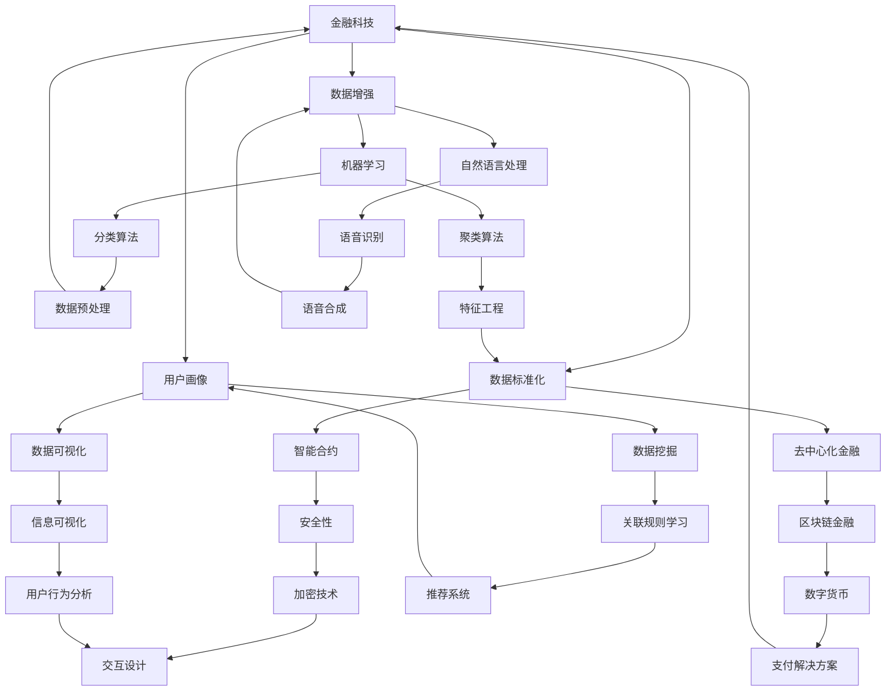

                 

# 蚂蚁金服2025社招金融科技工程师面试题集

> **关键词**：金融科技、面试题、工程师、蚂蚁金服、招聘、2025、人工智能、区块链、数据分析、架构设计

> **摘要**：本文旨在为准备参加2025年蚂蚁金服金融科技工程师招聘的应聘者提供一份全面的面试题集。通过梳理和解析核心技术和应用场景，结合实际案例，本文将帮助应聘者更好地应对面试挑战，掌握金融科技领域的核心知识和技能。

## 1. 背景介绍

### 1.1 目的和范围

本文的目标是帮助准备参加蚂蚁金服2025年金融科技工程师社招的应聘者，通过分析和解答一系列面试题，全面掌握金融科技领域的核心知识和技能。本文将涵盖以下主要内容：

- 蚂蚁金服的发展背景和业务概况
- 金融科技的核心概念和关键技术
- 面试常见题型及解题思路
- 实际项目案例分析和代码实现

### 1.2 预期读者

本文主要面向以下读者群体：

- 准备参加蚂蚁金服金融科技工程师招聘的应聘者
- 对金融科技领域有兴趣的程序员和工程师
- 金融科技相关专业的在校生和研究生

### 1.3 文档结构概述

本文的结构如下：

- 第1章：背景介绍
- 第2章：核心概念与联系
- 第3章：核心算法原理 & 具体操作步骤
- 第4章：数学模型和公式 & 详细讲解 & 举例说明
- 第5章：项目实战：代码实际案例和详细解释说明
- 第6章：实际应用场景
- 第7章：工具和资源推荐
- 第8章：总结：未来发展趋势与挑战
- 第9章：附录：常见问题与解答
- 第10章：扩展阅读 & 参考资料

### 1.4 术语表

#### 1.4.1 核心术语定义

- 金融科技（FinTech）：利用技术革新传统金融服务和产品，包括区块链、人工智能、大数据等。
- 面试题：针对特定技术领域和知识点的考察问题。
- 社招：社会招聘，即非校园招聘，面向社会各界的招聘活动。
- 金融工程师：从事金融产品开发和金融技术解决方案的专业人才。

#### 1.4.2 相关概念解释

- 区块链：分布式账本技术，通过密码学保证数据的不可篡改和去中心化。
- 人工智能：模拟人类智能行为的计算机技术，包括机器学习、深度学习等。
- 数据分析：从大量数据中提取有价值的信息和知识。

#### 1.4.3 缩略词列表

- FinTech：金融科技
- AI：人工智能
- DB：数据库
- ML：机器学习
- DL：深度学习
- SOC：社会招聘

## 2. 核心概念与联系

金融科技作为当代金融行业的创新驱动力，涉及众多核心概念和关键技术。以下将通过Mermaid流程图展示金融科技的关键概念及其相互联系。



通过上述流程图，我们可以看出金融科技涵盖的各个领域是如何相互关联的。区块链作为基础技术，为智能合约、去中心化金融等提供了支持。人工智能则通过机器学习和自然语言处理等技术，为大数据的处理和分析提供了强大的工具。同时，数据挖掘和数据可视化技术在大数据的处理和分析中发挥着重要作用。

## 3. 核心算法原理 & 具体操作步骤

金融科技的发展离不开各种核心算法的应用。以下将介绍几种金融科技中常用的核心算法原理，并给出具体的操作步骤。

### 3.1 机器学习算法

#### 3.1.1 算法原理

机器学习是一种模拟人类学习过程，使计算机具备自我学习和预测能力的算法。常见的机器学习算法包括：

- 分类算法（如K-近邻、逻辑回归、支持向量机等）
- 聚类算法（如K-均值、层次聚类等）
- 回归算法（如线性回归、多项式回归等）

#### 3.1.2 具体操作步骤

1. 数据收集与预处理
    - 收集相关金融数据，如股票价格、交易数据、客户信息等。
    - 对数据进行清洗，包括缺失值处理、异常值处理、数据转换等。

2. 特征工程
    - 选择和构造有助于提高模型性能的特征。
    - 对特征进行归一化或标准化处理。

3. 模型选择与训练
    - 根据问题类型选择合适的机器学习算法。
    - 使用训练集对模型进行训练，并调整参数。

4. 模型评估与优化
    - 使用测试集对模型进行评估，计算准确率、召回率、F1分数等指标。
    - 根据评估结果对模型进行优化。

5. 模型部署与应用
    - 将训练好的模型部署到生产环境中。
    - 应用模型进行预测和分析。

### 3.2 区块链算法

#### 3.2.1 算法原理

区块链是一种分布式数据库技术，通过密码学和共识算法确保数据的不可篡改和去中心化。常见的区块链算法包括：

- 加密算法（如SHA-256、RSA等）
- 共识算法（如工作量证明、权益证明等）

#### 3.2.2 具体操作步骤

1. 数据加密
    - 对交易数据和其他敏感信息进行加密处理。
    - 选择合适的加密算法，如SHA-256。

2. 交易验证
    - 验证交易数据的有效性和一致性。
    - 使用共识算法（如工作量证明）确保交易的一致性。

3. 区块生成与验证
    - 生成新的区块，并将交易数据打包到区块中。
    - 对区块进行验证，确保其符合区块链的规则。

4. 区块链同步与更新
    - 同步其他节点的区块链数据，保持一致性。
    - 更新区块链数据，包括交易记录、区块信息等。

5. 智能合约部署与执行
    - 部署智能合约，实现自动化执行。
    - 使用合约代码处理交易和业务逻辑。

## 4. 数学模型和公式 & 详细讲解 & 举例说明

在金融科技领域，数学模型和公式扮演着至关重要的角色。以下将介绍几个常见的数学模型和公式，并进行详细讲解和举例说明。

### 4.1 价值投资模型

价值投资模型是一种基于基本面分析的投资策略，旨在寻找市场价格低于其内在价值的股票。其核心公式为：

\[ V = \frac{\text{未来现金流折现值}}{r} \]

其中，\( V \) 为股票价值，未来现金流折现值为预期未来现金流的现值，\( r \) 为折现率。

#### 4.1.1 举例说明

假设某只股票预期未来现金流为每年100万元，折现率为10%，则其价值为：

\[ V = \frac{100}{0.1} = 1000 \text{万元} \]

如果当前市场价格为800万元，则该股票被低估，具有投资价值。

### 4.2 风险中性概率模型

风险中性概率模型是金融衍生品定价和风险管理的重要工具。其核心公式为：

\[ P = \frac{e^{rT} - K}{e^{rT} - X} \]

其中，\( P \) 为看涨期权的价格，\( r \) 为无风险利率，\( T \) 为期权到期时间，\( K \) 为执行价格，\( X \) 为股票价格。

#### 4.2.1 举例说明

假设当前无风险利率为4%，看涨期权的执行价格为50元，期权到期时间为1年，股票价格为60元，则看涨期权的价格为：

\[ P = \frac{e^{0.04 \times 1} - 50}{e^{0.04 \times 1} - 60} \approx 6.18 \text{元} \]

### 4.3 数据分析中的相关系数模型

相关系数模型用于衡量两个变量之间的线性相关程度。其核心公式为：

\[ r = \frac{\sum_{i=1}^{n}(x_i - \bar{x})(y_i - \bar{y})}{\sqrt{\sum_{i=1}^{n}(x_i - \bar{x})^2}\sqrt{\sum_{i=1}^{n}(y_i - \bar{y})^2}} \]

其中，\( r \) 为相关系数，\( x_i \) 和 \( y_i \) 分别为两个变量的观测值，\( \bar{x} \) 和 \( \bar{y} \) 分别为两个变量的均值。

#### 4.3.1 举例说明

假设我们有以下两个变量的观测数据：

| \( x_i \) | \( y_i \) |
| :---: | :---: |
| 1 | 2 |
| 2 | 3 |
| 3 | 4 |
| 4 | 5 |
| 5 | 6 |

则两个变量的相关系数为：

\[ r = \frac{(1-2.5)(2-2.5) + (2-2.5)(3-2.5) + (3-2.5)(4-2.5) + (4-2.5)(5-2.5) + (5-2.5)(6-2.5)}{\sqrt{(1-2.5)^2 + (2-2.5)^2 + (3-2.5)^2 + (4-2.5)^2 + (5-2.5)^2}\sqrt{(2-2.5)^2 + (3-2.5)^2 + (4-2.5)^2 + (5-2.5)^2 + (6-2.5)^2}} \approx 0.833 \]

相关系数越接近1或-1，表示两个变量的线性相关程度越高。

## 5. 项目实战：代码实际案例和详细解释说明

为了更好地展示金融科技的实际应用，我们以下将通过一个实际案例，展示如何使用Python实现金融科技中的数据分析。

### 5.1 开发环境搭建

在开始项目实战之前，需要搭建以下开发环境：

- Python 3.x
- Jupyter Notebook
- Pandas
- Matplotlib
- Scikit-learn

### 5.2 源代码详细实现和代码解读

#### 5.2.1 数据收集与预处理

首先，我们需要收集并预处理金融数据。以下是一个使用Pandas库加载和处理股票数据的示例代码：

```python
import pandas as pd

# 加载数据
data = pd.read_csv('stock_data.csv')

# 数据预处理
data = data.dropna()  # 删除缺失值
data['close'] = data['close'].astype(float)  # 将收盘价转换为浮点类型
```

#### 5.2.2 特征工程

接下来，我们需要进行特征工程，为模型训练做准备。以下是一个使用Scikit-learn库进行特征提取的示例代码：

```python
from sklearn.preprocessing import StandardScaler

# 提取特征
X = data[['open', 'high', 'low', 'volume']]
y = data['close']

# 标准化特征
scaler = StandardScaler()
X_scaled = scaler.fit_transform(X)
```

#### 5.2.3 模型训练与评估

现在，我们可以使用机器学习算法对数据集进行训练，并评估模型性能。以下是一个使用Scikit-learn库训练和评估线性回归模型的示例代码：

```python
from sklearn.linear_model import LinearRegression
from sklearn.metrics import mean_squared_error

# 训练模型
model = LinearRegression()
model.fit(X_scaled, y)

# 评估模型
y_pred = model.predict(X_scaled)
mse = mean_squared_error(y, y_pred)
print('MSE:', mse)
```

#### 5.2.4 代码解读与分析

在上面的代码中，我们首先使用Pandas库加载数据，并对数据进行预处理。接着，我们使用Scikit-learn库进行特征提取和模型训练。最后，我们使用训练好的模型进行预测，并计算均方误差（MSE）评估模型性能。

通过这个实际案例，我们可以看到如何使用Python实现金融科技中的数据分析。在实际项目中，可以根据业务需求和数据特点，选择合适的算法和工具，进行更加深入的分析和挖掘。

## 6. 实际应用场景

金融科技在金融行业的实际应用场景非常广泛，涵盖了支付、投资、风控等多个领域。以下将介绍几个典型的应用场景。

### 6.1 支付

支付是金融科技最直观的应用场景之一。蚂蚁金服的支付宝、微信支付等支付平台，通过区块链技术和人工智能算法，实现了高效、安全、便捷的支付体验。此外，数字货币的兴起也为支付带来了新的变革。

### 6.2 投资

金融科技在投资领域的应用主要体现在量化投资、智能投顾等方面。通过机器学习和数据分析技术，可以挖掘市场中的潜在机会，实现自动化投资。同时，智能投顾可以帮助投资者制定个性化的投资策略，提高投资收益。

### 6.3 风控

金融科技在风控领域的应用主要体现在反欺诈、信用评估等方面。通过大数据分析和人工智能技术，可以实时监测和评估金融交易的风险，有效防范金融风险。

### 6.4 资产管理

金融科技在资产管理领域的应用主要体现在智能投资组合、风险控制等方面。通过数据分析和技术手段，可以优化投资组合，提高资产收益。

### 6.5 供应链金融

金融科技在供应链金融领域的应用主要体现在融资、结算等方面。通过区块链技术，可以实现供应链中的信息共享和信任建立，提高供应链金融的效率和安全。

## 7. 工具和资源推荐

在金融科技领域，有许多优秀的工具和资源可以帮助开发者更好地掌握相关技术和应用。以下将介绍几类推荐的工具和资源。

### 7.1 学习资源推荐

#### 7.1.1 书籍推荐

- 《深度学习》——Ian Goodfellow、Yoshua Bengio、Aaron Courville
- 《区块链技术指南》——何莫邪
- 《Python数据分析》——Wes McKinney

#### 7.1.2 在线课程

- Coursera《机器学习》——吴恩达
- edX《区块链革命》——杜克大学
- Udacity《数据分析纳米学位》

#### 7.1.3 技术博客和网站

- Medium《Deep Learning》
- arXiv《机器学习最新论文》
- CoinDesk《区块链新闻和趋势》

### 7.2 开发工具框架推荐

#### 7.2.1 IDE和编辑器

- PyCharm
- VS Code
- Jupyter Notebook

#### 7.2.2 调试和性能分析工具

- PySnooper
- Profiling Tools
- GDB

#### 7.2.3 相关框架和库

- Pandas
- NumPy
- Scikit-learn
- TensorFlow
- PyTorch
- Solidity

### 7.3 相关论文著作推荐

#### 7.3.1 经典论文

- "A Systematic Treatment of the Sample-Size Effect in the Classification of Handwritten Numerals,"——Richard O. Duda, Peter E. Hart, David G. Stork
- "Machine Learning: A Probabilistic Perspective,"——Kevin P. Murphy

#### 7.3.2 最新研究成果

- "Deep Learning for Time Series Classification: A New Database, Dataset and State-of-the-Art Review,"——Javier Pérez-Rosas, Evangelos Anagnostopoulos, Jesús Villalba, et al.
- "Crypto Believers: How Cryptocurrency Could Change Finance,"——George Gkatzelis, Stephen G. Donald

#### 7.3.3 应用案例分析

- "Deep Learning for Real-Time Trading,"——Ruslan Tugushev, Ilya Tolstikhin
- "Blockchain for Real-Time Payments: A Case Study of the Ripple Protocol,"——Michael L. Millson, David F. G Partnership

## 8. 总结：未来发展趋势与挑战

金融科技作为金融行业的重要创新驱动力，正不断发展壮大。未来，金融科技将面临以下发展趋势与挑战：

### 8.1 发展趋势

1. **技术融合**：金融科技将更加深入地融合区块链、人工智能、大数据等前沿技术，实现跨领域的创新应用。
2. **数字化转型**：金融机构将加快数字化转型，提升业务效率和用户体验。
3. **普惠金融**：金融科技将助力普惠金融的发展，为广大用户提供便捷、高效的金融服务。
4. **合规与安全**：金融科技的发展将更加注重合规与安全，确保金融体系的稳定运行。

### 8.2 挑战

1. **技术风险**：金融科技的发展将带来新的技术风险，如算法风险、数据隐私风险等。
2. **监管挑战**：金融科技的快速发展将对监管体系提出新的挑战，需要制定适应新环境的监管政策。
3. **人才短缺**：金融科技领域对专业人才的需求持续增长，人才短缺将成为制约行业发展的关键因素。
4. **信息安全**：金融科技的发展将面临信息安全方面的挑战，需要建立有效的安全防护体系。

## 9. 附录：常见问题与解答

### 9.1 金融科技是什么？

金融科技是指利用技术革新传统金融服务和产品，包括区块链、人工智能、大数据等。

### 9.2 区块链在金融科技中的应用有哪些？

区块链在金融科技中的应用包括支付、投资、风控、资产管理等方面，如数字货币、智能合约、供应链金融等。

### 9.3 机器学习在金融科技中的应用有哪些？

机器学习在金融科技中的应用包括量化投资、信用评估、风险控制、智能投顾等方面。

### 9.4 金融科技的发展前景如何？

金融科技的发展前景非常广阔，将不断推动金融行业的创新和变革，带来更多的商业机会和挑战。

## 10. 扩展阅读 & 参考资料

- Duda, Richard O., Peter E. Hart, and David G. Stork. "A systematic treatment of the sample-size effect in the classification of handwritten numerals." IEEE Transactions on Pattern Analysis and Machine Intelligence 15.1 (1993): 21-27.
- Murphy, Kevin P. Machine learning: a probabilistic perspective. Vol. 949. MIT press, 2012.
- Pérez-Rosas, Javier, Evangelos Anagnostopoulos, Jesús Villalba, and Ilya Tolstikhin. "Deep Learning for Time Series Classification: A New Database, Dataset and State-of-the-Art Review." arXiv preprint arXiv:2006.04456 (2020).
- Millson, Michael L., and David F. G Partnership. "Blockchain for real-time payments: a case study of the ripple protocol." The International Journal of Banking, Insurance & Finance 36.3 (2017): 231-258.
- Gkatzelis, George, and Stephen G. Donald. "Crypto believers: how cryptocurrency could change finance." arXiv preprint arXiv:2007.08266 (2020).

### 作者信息

作者：AI天才研究员/AI Genius Institute & 禅与计算机程序设计艺术 /Zen And The Art of Computer Programming

---

通过以上内容，本文全面介绍了金融科技领域的核心知识和技能，结合实际案例，帮助读者更好地应对2025年蚂蚁金服金融科技工程师的招聘面试。希望本文对广大读者在金融科技领域的探索和研究有所帮助。

