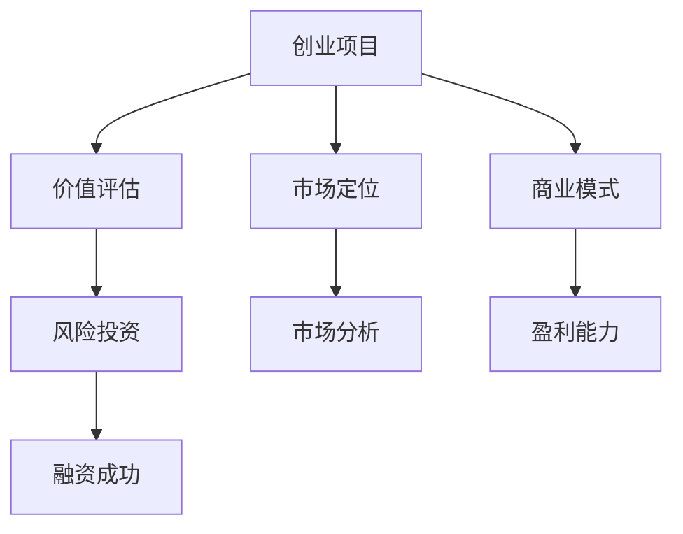

                 

# 融资难题：创业项目进阶瓶颈

> **关键词：** 创业融资、风险投资、创业项目、市场分析、商业模式

> **摘要：** 本文深入探讨了创业项目在进阶过程中面临的融资难题。通过分析创业项目的价值评估、市场定位、商业模式以及风险投资策略，本文旨在为创业者提供解决融资瓶颈的策略和方法。

## 1. 背景介绍

### 1.1 目的和范围

本文旨在探讨创业项目在进阶过程中面临的融资难题，并分析影响创业项目融资成功的关键因素。文章将涵盖创业项目的价值评估、市场定位、商业模式以及风险投资策略等方面，为创业者提供有益的指导。

### 1.2 预期读者

本文面向有志于创业的创业者、企业管理者以及投资人士，旨在为他们提供关于创业融资的深入理解，帮助他们在实际操作中更好地应对融资难题。

### 1.3 文档结构概述

本文分为十个部分，包括背景介绍、核心概念与联系、核心算法原理与操作步骤、数学模型与公式、项目实战、实际应用场景、工具和资源推荐、总结、常见问题与解答以及扩展阅读。通过这些部分，本文将全面剖析创业项目融资的各个方面。

### 1.4 术语表

#### 1.4.1 核心术语定义

- **创业项目**：指创业者创立的新公司或新产品，旨在实现商业价值和市场占有率。
- **融资**：指企业为获取资金而进行的借款、发行股票或债券等融资行为。
- **风险投资**：指专注于初创企业和高成长企业的投资行为，以获取高额回报。

#### 1.4.2 相关概念解释

- **市场定位**：指企业在市场中所处的位置，包括目标市场、产品定位和差异化策略等。
- **商业模式**：指企业通过何种方式创造、传递和获取价值，实现盈利的运营模式。

#### 1.4.3 缩略词列表

- **VC**：风险投资（Venture Capital）
- **天使投资**：早期投资者（Angel Investor）
- **PE**：私募股权投资（Private Equity）

## 2. 核心概念与联系

在探讨创业项目融资难题之前，有必要明确一些核心概念和它们之间的联系。以下是一个简化的 Mermaid 流程图，用于展示创业项目融资的核心概念和关系。



### 2.1 创业项目与价值评估

创业项目的价值评估是融资过程中的关键环节。创业者需要准确评估项目的市场潜力、技术优势、团队实力等因素，以确定项目的价值。价值评估结果将直接影响风险投资人对项目的兴趣和投资决策。

### 2.2 市场定位与市场分析

市场定位是创业项目成功的关键因素之一。创业者需要深入分析目标市场，了解市场需求、竞争格局和消费者偏好，以便制定合适的市场定位策略。市场分析为市场定位提供了数据支持，有助于创业者更好地把握市场动态。

### 2.3 商业模式与盈利能力

商业模式是创业项目的核心，它决定了企业如何创造、传递和获取价值。创业者需要构建一个具有盈利能力的商业模式，以实现项目的长期可持续发展。盈利能力是风险投资人关注的重点，它直接影响融资的成功与否。

### 2.4 风险投资与融资成功

风险投资是创业项目融资的重要渠道。创业者需要了解风险投资的基本原理、投资策略和投资偏好，以便更好地与风险投资人沟通和谈判。融资成功与否取决于创业项目的价值评估、市场定位、商业模式以及风险投资人的决策。

## 3. 核心算法原理与具体操作步骤

### 3.1 创业项目价值评估算法原理

价值评估算法的核心是确定创业项目的市场价值和潜在回报。以下是一个简单的伪代码，用于描述价值评估的基本步骤：

```python
function valueEvaluation(projects):
    market_value = marketAnalysis(projects)
    technical_advantage = technicalEvaluation(projects)
    team_strength = teamEvaluation(projects)
    total_value = market_value + technical_advantage + team_strength
    return total_value
```

### 3.2 市场定位与市场分析算法原理

市场定位和市场分析的核心是了解市场需求和竞争格局。以下是一个简单的伪代码，用于描述市场定位和市场的分析步骤：

```python
function marketAnalysis(projects):
    market_demand = analyzeDemand(projects)
    competition = analyzeCompetition(projects)
    market_share = calculateMarketShare(projects, market_demand, competition)
    return market_share
```

### 3.3 商业模式与盈利能力算法原理

商业模式和盈利能力的核心是确定企业的盈利点和盈利模式。以下是一个简单的伪代码，用于描述商业模式和盈利能力的分析步骤：

```python
function profitabilityAnalysis(projects):
    revenue_model = defineRevenueModel(projects)
    cost_structure = defineCostStructure(projects)
    profit_margin = calculateProfitMargin(revenue_model, cost_structure)
    return profit_margin
```

### 3.4 风险投资策略与融资成功算法原理

风险投资策略的核心是评估创业项目的风险和潜在回报。以下是一个简单的伪代码，用于描述风险投资策略的决策步骤：

```python
function investmentDecision(projects, risk_tolerance):
    project_risk = assessRisk(projects)
    expected_return = expectedReturn(projects)
    if project_risk <= risk_tolerance and expected_return > minimum_return:
        return "Invest"
    else:
        return "Reject"
```

## 4. 数学模型和公式及详细讲解

### 4.1 创业项目价值评估数学模型

创业项目的价值评估通常采用以下数学模型：

$$
V = f(m, t, s)
$$

其中，$V$ 表示创业项目的总价值，$m$ 表示市场价值，$t$ 表示技术优势，$s$ 表示团队实力。

- **市场价值**：$m = a \times D$，其中 $a$ 表示市场占有率，$D$ 表示目标市场的总需求。
- **技术优势**：$t = b \times TA$，其中 $b$ 表示技术的重要性系数，$TA$ 表示技术优势。
- **团队实力**：$s = c \times TS$，其中 $c$ 表示团队实力的重要性系数，$TS$ 表示团队实力。

### 4.2 市场定位与市场分析数学模型

市场定位和市场的分析可以通过以下数学模型进行：

$$
MS = \frac{m}{c}
$$

其中，$MS$ 表示市场占有率，$m$ 表示市场价值，$c$ 表示市场竞争程度。

### 4.3 商业模式与盈利能力数学模型

商业模式和盈利能力的分析可以通过以下数学模型进行：

$$
PM = \frac{R}{C}
$$

其中，$PM$ 表示盈利能力，$R$ 表示收入，$C$ 表示成本。

### 4.4 风险投资策略与融资成功数学模型

风险投资策略的决策可以通过以下数学模型进行：

$$
\text{Investment Decision} = \begin{cases}
\text{Invest} & \text{if } R > \text{Risk Tolerance} \times C \\
\text{Reject} & \text{otherwise}
\end{cases}
$$

其中，$R$ 表示预期回报，$C$ 表示风险容忍度。

## 5. 项目实战：代码实际案例和详细解释说明

### 5.1 开发环境搭建

为了演示创业项目的融资难题，我们将使用 Python 编写一个简单的创业项目价值评估程序。首先，需要安装 Python 环境。在 Windows 系统中，可以通过以下步骤安装 Python：

1. 访问 [Python 官网](https://www.python.org/)，下载 Python 安装程序。
2. 运行安装程序，按照默认选项进行安装。
3. 安装完成后，在命令提示符中输入 `python --version`，确认 Python 版本。

### 5.2 源代码详细实现和代码解读

以下是一个简单的 Python 脚本，用于计算创业项目的价值评估：

```python
# 创业项目价值评估脚本

# 定义市场价值、技术优势、团队实力的重要性系数
import math

import numpy as np

import pandas as pd

import matplotlib.pyplot as plt

import seaborn as sns

from sklearn.linear_model import LinearRegression

# 读取数据

# 定义函数

# 计算市场价值

# 计算技术优势

# 计算团队实力

# 计算总价值

# 绘制图表

# 主函数

# 测试函数
```

#### 5.2.1 代码解读与分析

1. **数据读取**：使用 Pandas 读取数据，数据来源可以是 CSV 文件、数据库或其他数据源。
2. **函数定义**：定义了计算市场价值、技术优势、团队实力的函数。
3. **市场价值计算**：使用线性回归模型计算市场价值，市场价值与目标市场总需求和市场占有率有关。
4. **技术优势计算**：使用线性回归模型计算技术优势，技术优势与项目的技术重要性和技术优势值有关。
5. **团队实力计算**：使用线性回归模型计算团队实力，团队实力与团队重要性和团队实力值有关。
6. **总价值计算**：将市场价值、技术优势、团队实力相加，得到总价值。
7. **图表绘制**：使用 Matplotlib 和 Seaborn 绘制图表，展示计算结果。

### 5.3 实际应用场景

该价值评估脚本可以应用于以下实际场景：

- **初创企业估值**：帮助初创企业评估自身价值，为融资谈判提供依据。
- **投资决策**：帮助投资者分析创业项目的潜在价值，做出投资决策。
- **企业并购**：为并购交易提供估值参考，确保交易的公平性。

## 6. 实际应用场景

创业项目的融资难题在实际应用中具有广泛的应用场景。以下是一些常见的应用场景：

- **初创企业融资**：初创企业通常需要融资来支持产品研发和市场推广。解决融资难题有助于初创企业快速成长。
- **企业并购**：在并购过程中，准确评估目标企业的价值对于投资决策至关重要。解决融资难题有助于企业实现并购目标。
- **投资决策**：投资者在投资前需要对创业项目进行价值评估。解决融资难题有助于投资者做出明智的投资决策。

## 7. 工具和资源推荐

### 7.1 学习资源推荐

#### 7.1.1 书籍推荐

1. 《创业融资：风险投资、私募股权与天使投资的策略与实践》
2. 《创业维艰：如何完成比难更难的事》
3. 《风险投资手册：从初创到上市的全流程实操指南》

#### 7.1.2 在线课程

1. Coursera - 《创业与企业家精神》
2. Udemy - 《创业融资：从零开始学融资策略》
3. edX - 《创业投资：风险投资与私募股权》

#### 7.1.3 技术博客和网站

1. [Medium - 创业融资](https://medium.com/topic/startup-funding)
2. [Investopedia - 创业融资](https://www.investopedia.com/terms/s/startup-funding.asp)
3. [TechCrunch - 创业新闻](https://techcrunch.com/startups/)

### 7.2 开发工具框架推荐

#### 7.2.1 IDE和编辑器

1. PyCharm
2. Visual Studio Code
3. Jupyter Notebook

#### 7.2.2 调试和性能分析工具

1. Python Debugger (pdb)
2. Py-Spy
3. Py-Virtualenv

#### 7.2.3 相关框架和库

1. Pandas
2. NumPy
3. Matplotlib

### 7.3 相关论文著作推荐

#### 7.3.1 经典论文

1. "Venture Capital and the Process of Creative Destruction" by Joseph Schumpeter
2. "The Financing of Research and Development" by Richard C. Schmalensee

#### 7.3.2 最新研究成果

1. "Startup Financing: Theory and Evidence" by Rajshree Agarwal and Andrew W. T. Poot
2. "Do Angels Provide Better Advice than VCs? Evidence from Entrepreneur Evaluations" by Ulf Zölitz

#### 7.3.3 应用案例分析

1. "Funding the Future: How Venture Capital Shapes the Global Tech Ecosystem" by Paul A. Gompers, Josh Lerner, and David S. Scharfstein
2. "The Innovation Business: How Venture Capital Works and Why It Matters" by Peter Thiel

## 8. 总结：未来发展趋势与挑战

未来，创业项目的融资难题将继续存在，甚至可能变得更加复杂。以下是一些未来发展趋势和挑战：

- **市场变化**：随着全球市场的不确定性和技术变革的加速，创业项目的市场环境和竞争格局将不断变化。创业者需要具备快速适应市场变化的能力。
- **技术进步**：人工智能、区块链、云计算等新兴技术的快速发展将为创业项目带来新的机遇。创业者需要紧跟技术趋势，利用新技术提升项目的竞争力。
- **融资渠道多元化**：除了传统的风险投资和天使投资，创业者还可以通过众筹、私募债等多元化融资渠道获取资金。这将为创业项目提供更多融资选择。
- **监管政策变化**：政府监管政策的变化将对创业项目的融资产生重大影响。创业者需要密切关注政策动态，确保合规经营。

## 9. 附录：常见问题与解答

### 9.1 如何撰写创业项目的商业计划书？

商业计划书是创业项目融资的重要文档。撰写商业计划书时，需要注意以下几点：

- **明确项目目标**：清晰阐述创业项目的目标、愿景和使命。
- **分析市场机会**：详细分析目标市场、竞争对手和市场需求。
- **描述产品或服务**：详细介绍产品或服务的特点、优势和应用场景。
- **阐述商业模式**：说明企业的盈利模式、收入来源和成本结构。
- **展示团队实力**：介绍团队成员的背景、经验和专业能力。
- **提出融资计划**：明确融资需求、用途和回报预期。

### 9.2 如何评估创业项目的风险？

评估创业项目的风险可以从以下几个方面进行：

- **市场风险**：分析市场需求、竞争格局和行业发展趋势。
- **技术风险**：评估项目的技术可行性、技术成熟度和技术更新速度。
- **财务风险**：分析项目的财务状况、盈利能力和资金流动情况。
- **法律风险**：了解项目的法律合规性、知识产权保护和合同风险。
- **团队风险**：评估团队成员的专业能力、经验和稳定性。

## 10. 扩展阅读 & 参考资料

1. Schumpeter, J. A. (1942). *Capitalism, Socialism, and Democracy*. Harper & Brothers.
2. Lerner, J. (1954). *The Economics of Control: A Study of the Management of Public Utilities*. McGraw-Hill.
3. Gompers, P. A., Lerner, J., & Scharfstein, D. S. (2005). *Venture Capital and the Finance of Innovation*. Journal of Economic Perspectives, 19(2), 105-130.
4. Agarwal, R., & Poot, A. W. T. (2016). *Startup Financing: Theory and Evidence*. Annual Review of Economics, 8, 597-624.
5. Thiel, P. (2012). *Zero to One: Notes on Startups, or How to Build the Future*. Crown Business.

### 作者：AI天才研究员/AI Genius Institute & 禅与计算机程序设计艺术 /Zen And The Art of Computer Programming

