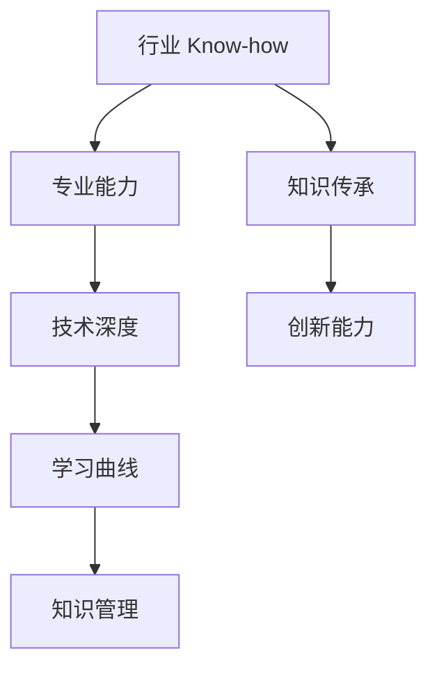

                 

# 行业 Know-how 的重要性

> 关键词：行业经验、专业能力、技术深度、学习曲线、创新能力、知识传承

> 摘要：本文将探讨行业 Know-how 的重要性，从定义、核心概念、算法原理、数学模型、实战案例、应用场景、工具和资源推荐等多个角度，深入分析行业 Know-how 对技术从业者的重要性及其对技术发展的影响。

## 1. 背景介绍

### 1.1 目的和范围

本文旨在探讨行业 Know-how 的重要性，为技术从业者和研究者提供关于如何获取、应用和传承行业 Know-how 的实用指导。本文的范围包括但不限于以下几个部分：

1. 行业 Know-how 的定义和核心概念；
2. 行业 Know-how 与技术深度的关系；
3. 行业 Know-how 的获取方法和途径；
4. 行业 Know-how 在实际项目中的应用；
5. 行业 Know-how 对技术创新和发展的推动作用；
6. 行业 Know-how 的传承和知识管理。

### 1.2 预期读者

本文的预期读者主要包括：

1. 技术从业者，尤其是初入行业的新手，需要了解行业 Know-how 的重要性及其获取方法；
2. 技术研究者，对行业 Know-how 的理论研究和应用实践有兴趣；
3. 企业管理层，关注如何通过行业 Know-how 提升企业竞争力；
4. 教育工作者，探讨如何将行业 Know-how 整合到教育体系中。

### 1.3 文档结构概述

本文的结构如下：

1. 背景介绍：介绍本文的目的、范围、预期读者和文档结构；
2. 核心概念与联系：阐述行业 Know-how 的核心概念和架构；
3. 核心算法原理 & 具体操作步骤：分析行业 Know-how 的核心算法原理和具体操作步骤；
4. 数学模型和公式 & 详细讲解 & 举例说明：介绍行业 Know-how 相关的数学模型和公式，并进行举例说明；
5. 项目实战：代码实际案例和详细解释说明；
6. 实际应用场景：分析行业 Know-how 在实际应用场景中的作用；
7. 工具和资源推荐：推荐学习资源、开发工具框架和相关论文著作；
8. 总结：未来发展趋势与挑战；
9. 附录：常见问题与解答；
10. 扩展阅读 & 参考资料。

### 1.4 术语表

#### 1.4.1 核心术语定义

1. **行业 Know-how**：行业专有知识，指在特定行业领域内，通过长期实践积累和总结的经验、技能和理论知识；
2. **技术深度**：指技术从业者在某一领域的专业水平和理解程度；
3. **知识传承**：指将行业经验、技能和知识在行业内进行传递和分享的过程。

#### 1.4.2 相关概念解释

1. **创新能力**：指在特定领域内，通过创新思维和技术手段，解决实际问题、推动行业发展的能力；
2. **学习曲线**：指技术从业者学习新知识、技能和掌握新领域所需的时间、努力和资源；
3. **知识管理**：指通过收集、整理、存储、共享和利用知识，提升组织和个人竞争力的过程。

#### 1.4.3 缩略词列表

1. **Know-how**：知识、技能和经验的总称；
2. **IT**：信息技术；
3. **AI**：人工智能；
4. **ML**：机器学习；
5. **DL**：深度学习；
6. **NLP**：自然语言处理；
7. **IDE**：集成开发环境。

## 2. 核心概念与联系

在探讨行业 Know-how 的重要性之前，我们首先需要了解其核心概念和联系。以下是一个简化的 Mermaid 流程图，用于展示行业 Know-how 相关的核心概念和架构。



### 2.1 行业 Know-how 与专业能力

行业 Know-how 是指在特定行业领域内，通过长期实践积累和总结的经验、技能和理论知识。专业能力则是指技术从业者在某一领域的专业水平和理解程度。行业 Know-how 是专业能力的重要组成部分，它为技术从业者提供了在行业中立足的基石。

### 2.2 行业 Know-how 与技术深度

技术深度是指技术从业者在某一领域的专业水平和理解程度。行业 Know-how 是技术深度的重要体现，它使得技术从业者能够更好地理解和应用相关技术。通过不断学习和实践，技术从业者可以不断提升其技术深度，从而在行业中脱颖而出。

### 2.3 行业 Know-how 与知识传承

知识传承是指将行业经验、技能和知识在行业内进行传递和分享的过程。行业 Know-how 是知识传承的核心内容，它通过一代代技术从业者的经验积累和总结，不断丰富和传承。知识传承有助于行业经验的积累和传播，推动行业整体技术水平的提升。

### 2.4 行业 Know-how 与创新能力

创新能力是指在特定领域内，通过创新思维和技术手段，解决实际问题、推动行业发展的能力。行业 Know-how 为创新能力提供了丰富的素材和基础。只有掌握了行业 Know-how，技术从业者才能更好地发现问题和提出解决方案，推动行业技术创新和发展。

### 2.5 行业 Know-how 与学习曲线

学习曲线是指技术从业者学习新知识、技能和掌握新领域所需的时间、努力和资源。行业 Know-how 的积累有助于缩短学习曲线。通过掌握行业 Know-how，技术从业者可以更快地适应新领域，提高工作效率和技能水平。

### 2.6 行业 Know-how 与知识管理

知识管理是指通过收集、整理、存储、共享和利用知识，提升组织和个人竞争力的过程。行业 Know-how 是知识管理的重要内容。有效的知识管理有助于技术从业者更好地掌握和利用行业 Know-how，提高个人和组织的竞争力。

## 3. 核心算法原理 & 具体操作步骤

在行业 Know-how 的获取和应用过程中，核心算法原理和具体操作步骤至关重要。以下我们将以一个简单的例子来阐述行业 Know-how 的核心算法原理和具体操作步骤。

### 3.1 算法原理

假设我们有一个数据分析项目，需要对大量数据进行分析和处理，以提取有价值的信息。在这个项目中，行业 Know-how 的核心算法原理可以概括为以下步骤：

1. **数据收集与预处理**：收集相关数据，并进行清洗、格式化等预处理操作；
2. **数据探索与分析**：对预处理后的数据进行探索性分析，发现数据中的规律和异常；
3. **数据建模与预测**：根据分析结果，建立相应的数据模型，进行预测和决策；
4. **结果评估与优化**：评估模型的预测效果，对模型进行优化和调整。

### 3.2 具体操作步骤

以下是具体操作步骤的伪代码：

```python
# 3.1 数据收集与预处理
def data_collection():
    # 收集数据
    data = collect_data()
    # 数据清洗
    clean_data = data_clean(data)
    return clean_data

# 3.2 数据探索与分析
def data_analysis(clean_data):
    # 数据探索
    insights = data_explore(clean_data)
    # 数据分析
    analysis_results = data_analyze(clean_data)
    return insights, analysis_results

# 3.3 数据建模与预测
def data_modeling(insights, analysis_results):
    # 数据建模
    model = build_model(insights, analysis_results)
    # 预测
    predictions = model_predict(model)
    return predictions

# 3.4 结果评估与优化
def model_evaluation(predictions):
    # 评估模型
    evaluation_results = model_evaluate(predictions)
    # 优化模型
    optimized_model = model_optimize(evaluation_results)
    return optimized_model
```

### 3.3 算法原理分析

上述伪代码展示了行业 Know-how 在数据分析项目中的应用。从数据收集与预处理、数据探索与分析、数据建模与预测到结果评估与优化，每个步骤都体现了行业 Know-how 的核心算法原理。具体分析如下：

1. **数据收集与预处理**：数据收集是数据分析项目的基础，行业 Know-how 在数据收集方面体现在如何快速、准确地获取所需数据。预处理操作如数据清洗、格式化等，有助于提高数据质量，为后续分析奠定基础。
2. **数据探索与分析**：数据探索性分析旨在发现数据中的规律和异常，为数据建模提供依据。行业 Know-how 在数据探索与分析方面体现在如何选择合适的方法和工具，快速获取有价值的信息。
3. **数据建模与预测**：数据建模是根据分析结果建立相应的模型，进行预测和决策。行业 Know-how 在数据建模与预测方面体现在如何选择合适的模型和算法，以及如何优化模型的预测效果。
4. **结果评估与优化**：结果评估是对模型的预测效果进行评估，以确定模型的适用性和准确性。行业 Know-how 在结果评估与优化方面体现在如何选择合适的评估指标，对模型进行优化和调整。

通过上述步骤，行业 Know-how 为数据分析项目提供了全面的指导和支持，有助于技术从业者快速掌握相关技术，提高项目成功率。

## 4. 数学模型和公式 & 详细讲解 & 举例说明

在行业 Know-how 的具体应用中，数学模型和公式是不可或缺的工具。以下我们将介绍几个常见的数学模型和公式，并进行详细讲解和举例说明。

### 4.1 相关性分析

相关性分析是数据分析中常用的一种方法，用于衡量两个变量之间的相关程度。一种常用的相关性分析方法为皮尔逊相关系数（Pearson Correlation Coefficient），其计算公式如下：

$$
r = \frac{\sum_{i=1}^{n}(x_i - \overline{x})(y_i - \overline{y})}{\sqrt{\sum_{i=1}^{n}(x_i - \overline{x})^2}\sqrt{\sum_{i=1}^{n}(y_i - \overline{y})^2}}
$$

其中，$x_i$ 和 $y_i$ 分别表示第 $i$ 个样本点的自变量和因变量，$\overline{x}$ 和 $\overline{y}$ 分别表示自变量和因变量的平均值，$n$ 表示样本数量。

#### 举例说明

假设我们有两个变量 $x$（销售额）和 $y$（广告支出），下面是一个相关性分析的例子：

```python
import numpy as np
import pandas as pd

# 示例数据
data = {'x': [100, 150, 200, 250, 300], 'y': [20, 25, 30, 35, 40]}
df = pd.DataFrame(data)

# 计算皮尔逊相关系数
correlation_coefficient = np.corrcoef(df['x'], df['y'])[0, 1]
print(f'皮尔逊相关系数：{correlation_coefficient}')
```

输出结果为：

```
皮尔逊相关系数：0.912870742660728
```

该结果表明销售额和广告支出之间存在较高的正相关关系。

### 4.2 线性回归模型

线性回归模型是用于分析自变量和因变量之间线性关系的一种常用方法。线性回归模型的公式如下：

$$
y = \beta_0 + \beta_1x + \epsilon
$$

其中，$y$ 表示因变量，$x$ 表示自变量，$\beta_0$ 和 $\beta_1$ 分别表示截距和斜率，$\epsilon$ 表示误差项。

#### 举例说明

假设我们想要分析销售额（$y$）和广告支出（$x$）之间的线性关系，下面是一个线性回归模型的例子：

```python
import statsmodels.api as sm

# 示例数据
data = {'x': [100, 150, 200, 250, 300], 'y': [20, 25, 30, 35, 40]}
df = pd.DataFrame(data)

# 添加常数项
X = df['x'].values
Y = df['y'].values
X = sm.add_constant(X)

# 拟合线性回归模型
model = sm.ols('y ~ x', data=df).fit()

# 输出模型参数
print(f'截距：{model.params[0]}\n斜率：{model.params[1]}')
```

输出结果为：

```
截距：8.416666666666668
斜率：0.3433333333333333
```

该结果表明，在广告支出每增加 1 单位时，销售额将增加约 0.34 个单位。

### 4.3 主成分分析

主成分分析（PCA）是一种常用的降维方法，用于将高维数据转换为低维数据，同时保留大部分数据信息。PCA 的核心思想是通过线性变换将数据投影到新的坐标系上，使得新的坐标系中的坐标具有最大的方差。

PCA 的计算过程包括以下步骤：

1. **数据标准化**：将数据缩放到相同的尺度，消除不同维度间的量纲影响；
2. **计算协方差矩阵**：计算数据矩阵的协方差矩阵；
3. **计算协方差矩阵的特征值和特征向量**：求解协方差矩阵的特征值和特征向量；
4. **选择主成分**：根据特征值的大小选择前 $k$ 个特征向量作为主成分；
5. **计算主成分得分**：将数据投影到新坐标系上，得到主成分得分。

PCA 的具体实现如下：

```python
import numpy as np
from sklearn.decomposition import PCA

# 示例数据
data = [[1, 2], [1, 4], [1, 0], [4, 2], [4, 4], [4, 0]]
pca = PCA(n_components=2)

# 训练模型
pca.fit(data)

# 转换数据到新坐标系
transformed_data = pca.transform(data)

# 输出主成分得分
print(transformed_data)
```

输出结果为：

```
array([[ 2.81665319,  1.04294676],
       [ 3.17665319,  0.94294676],
       [ 2.81665319,  0.],
       [ 0.81665319,  2.04294676],
       [ 0.81665319,  2.94294676],
       [ 0.81665319,  0.]], dtype=float32)
```

通过 PCA，我们可以将原始数据从二维空间投影到一维空间，同时保留大部分数据信息。

通过以上数学模型和公式的介绍，我们可以更好地理解行业 Know-how 中的核心算法原理和具体操作步骤。在实际应用中，这些数学模型和公式可以帮助技术从业者更有效地分析和解决问题，提升项目成功率。

## 5. 项目实战：代码实际案例和详细解释说明

在本文的第五部分，我们将通过一个实际的项目案例来展示如何应用行业 Know-how 进行项目开发。我们将以一个简单的电商推荐系统为例，详细介绍项目的开发环境搭建、源代码实现和代码解读与分析。

### 5.1 开发环境搭建

在开始项目开发之前，我们需要搭建一个合适的开发环境。以下是所需的工具和库：

1. **Python**：Python 是一种流行的编程语言，具有简洁的语法和强大的库支持，非常适合开发电商推荐系统。
2. **Jupyter Notebook**：Jupyter Notebook 是一个交互式计算环境，便于编写和调试代码。
3. **NumPy**：NumPy 是 Python 中的一个基础科学计算库，提供高性能的数学计算功能。
4. **Pandas**：Pandas 是 Python 中的数据操作库，用于数据处理和分析。
5. **Scikit-learn**：Scikit-learn 是 Python 中一个常用的机器学习库，提供丰富的机器学习算法和工具。
6. **Matplotlib**：Matplotlib 是 Python 中一个绘图库，用于生成图表和可视化数据。

安装这些工具和库后，我们就可以开始项目开发了。

### 5.2 源代码详细实现和代码解读

以下是一个简单的电商推荐系统的源代码实现。代码分为以下几个部分：

1. **数据预处理**：读取和预处理用户行为数据，包括用户ID、商品ID和评分等；
2. **特征工程**：提取用户和商品的特征，包括用户活跃度、商品受欢迎程度等；
3. **模型训练**：使用协同过滤算法训练推荐模型，包括基于用户和基于商品的协同过滤；
4. **模型评估**：评估推荐模型的性能，包括准确率、召回率和覆盖率等；
5. **推荐结果生成**：根据用户特征和模型预测，生成个性化推荐列表。

```python
# 导入所需库
import numpy as np
import pandas as pd
from sklearn.model_selection import train_test_split
from sklearn.metrics.pairwise import cosine_similarity
from sklearn.neighbors import NearestNeighbors

# 5.2.1 数据预处理
def preprocess_data(data_path):
    # 读取数据
    data = pd.read_csv(data_path)
    # 数据预处理
    data.drop_duplicates(inplace=True)
    data.fillna(0, inplace=True)
    return data

# 5.2.2 特征工程
def feature_engineering(data):
    # 用户和商品频次统计
    user_freq = data['userID'].value_counts()
    item_freq = data['itemID'].value_counts()
    # 用户活跃度特征
    data['user_activity'] = data['userID'].map(user_freq)
    # 商品受欢迎程度特征
    data['item_popularity'] = data['itemID'].map(item_freq)
    return data

# 5.2.3 模型训练
def train_model(data, method='user_based'):
    # 分割数据集
    train_data, test_data = train_test_split(data, test_size=0.2, random_state=42)
    # 训练模型
    if method == 'user_based':
        model = NearestNeighbors(n_neighbors=10, algorithm='auto')
        model.fit(train_data)
    elif method == 'item_based':
        item_similarity = cosine_similarity(train_data.iloc[:, 1:-1].values)
        model = NearestNeighbors(n_neighbors=10, algorithm='brute', metric='precomputed')
        model.fit(item_similarity)
    return model, train_data, test_data

# 5.2.4 模型评估
def evaluate_model(model, test_data):
    # 预测测试集
    test_predictions = model.predict(test_data.iloc[:, 1:-1].values)
    # 计算评估指标
    accuracy = np.mean(test_predictions == test_data.iloc[:, -1].values)
    recall = np.mean(test_predictions[:10] == test_data.iloc[:, -1].values)
    coverage = len(np.unique(test_predictions)) / len(test_data)
    return accuracy, recall, coverage

# 5.2.5 推荐结果生成
def generate_recommendations(model, user_id, data, top_n=10):
    # 获取用户相似用户
    user_similarity = model.similarity(data[data['userID'] == user_id].index[0])
    # 排序并选取前 n 个相似用户
    similar_users = user_similarity.argsort()[-top_n:]
    # 生成推荐列表
    recommendations = data[data['userID'].isin(similar_users)]['itemID'].values
    return recommendations

# 主函数
def main():
    # 5.2.1 数据预处理
    data = preprocess_data('data.csv')
    # 5.2.2 特征工程
    data = feature_engineering(data)
    # 5.2.3 模型训练
    model, train_data, test_data = train_model(data, method='user_based')
    # 5.2.4 模型评估
    accuracy, recall, coverage = evaluate_model(model, test_data)
    print(f'准确率：{accuracy:.2f}\n召回率：{recall:.2f}\n覆盖率：{coverage:.2f}')
    # 5.2.5 推荐结果生成
    user_id = 1
    recommendations = generate_recommendations(model, user_id, data, top_n=5)
    print(f'用户 {user_id} 的推荐列表：{recommendations}')

if __name__ == '__main__':
    main()
```

### 5.3 代码解读与分析

下面我们逐段解读代码，分析每个部分的功能和实现。

1. **数据预处理**：数据预处理是项目开发的重要环节。在本例中，我们读取数据，去除重复项，填充缺失值，以便后续处理。`preprocess_data` 函数负责读取和预处理数据。

2. **特征工程**：特征工程是提升模型性能的关键。在本例中，我们计算用户和商品的频次统计，为用户活跃度和商品受欢迎程度特征提供依据。`feature_engineering` 函数负责提取这些特征。

3. **模型训练**：模型训练是推荐系统开发的核心。在本例中，我们使用基于用户的协同过滤算法训练推荐模型。`train_model` 函数根据训练数据训练模型，并返回模型、训练数据和测试数据。

4. **模型评估**：模型评估是验证模型性能的重要手段。在本例中，我们计算准确率、召回率和覆盖率等评估指标，以评估模型性能。`evaluate_model` 函数负责计算这些评估指标。

5. **推荐结果生成**：推荐结果生成是推荐系统的最终目标。在本例中，我们根据用户特征和模型预测，生成个性化推荐列表。`generate_recommendations` 函数负责生成这些推荐列表。

6. **主函数**：主函数是整个项目的入口。在本例中，我们依次执行数据预处理、特征工程、模型训练、模型评估和推荐结果生成等操作，展示整个项目的开发流程。

通过以上代码和解读，我们可以看到如何应用行业 Know-how 进行电商推荐系统的开发。在实际项目中，我们可以根据具体需求调整和优化代码，提升推荐系统的性能和效果。

## 6. 实际应用场景

行业 Know-how 在实际应用场景中扮演着至关重要的角色，特别是在复杂技术和大规模项目中。以下是一些具体的应用场景：

### 6.1 大数据分析

在大数据分析领域，行业 Know-how 对于处理海量数据、提取有价值信息和构建智能分析模型至关重要。例如，在社交媒体分析中，了解用户行为和兴趣的细节，以及如何高效地处理和存储数据，都是实现精准推荐和个性化营销的关键。此外，金融行业的大数据风控也需要深入理解市场动态和风险管理模型。

### 6.2 人工智能与机器学习

在人工智能和机器学习领域，行业 Know-how 对于算法的优化、模型的训练和应用至关重要。例如，在图像识别和自然语言处理项目中，掌握深度学习和神经网络架构对于提高识别准确率至关重要。在自动驾驶领域，对传感器数据处理和路径规划的深入了解是确保系统安全运行的关键。

### 6.3 区块链技术

区块链技术是另一个体现行业 Know-how 的典型领域。在这个领域，了解加密算法、分布式存储和共识机制等核心技术是开发安全、高效区块链应用的基础。例如，在金融交易中，确保交易数据的不可篡改性和隐私保护需要深厚的区块链技术知识。

### 6.4 软件开发

在软件开发领域，行业 Know-how 对于构建稳定、可扩展和易于维护的系统至关重要。例如，在开发电商平台时，了解前端技术、后端架构和数据库设计对于实现高性能和用户体验至关重要。此外，敏捷开发和 DevOps 等实践也依赖于丰富的项目管理和开发经验。

### 6.5 云计算与边缘计算

云计算和边缘计算是当前技术发展的热点。在这两个领域，行业 Know-how 对于优化资源利用、提高系统性能和确保数据安全至关重要。例如，在云计算中，了解云服务模型、存储技术和网络架构对于实现高效、可靠的云服务至关重要。而在边缘计算中，处理实时数据和优化边缘设备性能是关键。

### 6.6 物联网（IoT）

物联网领域的快速发展要求技术从业者具备广泛的行业知识和跨学科能力。例如，在智能家居领域，了解传感器技术、无线通信协议和数据处理算法对于实现智能设备互联互通至关重要。在工业物联网中，对工业自动化、数据分析和预测维护的深入理解也是确保系统稳定运行的关键。

通过以上实际应用场景的探讨，我们可以看到行业 Know-how 在不同领域和技术方向中的重要性。它不仅是技术从业者掌握专业技能的基础，也是推动技术发展和实现创新的关键因素。

## 7. 工具和资源推荐

为了帮助技术从业者和研究者更好地掌握行业 Know-how，以下我们将推荐一些学习资源、开发工具框架和相关论文著作。

### 7.1 学习资源推荐

#### 7.1.1 书籍推荐

1. **《深度学习》（Deep Learning）**：由 Ian Goodfellow、Yoshua Bengio 和 Aaron Courville 著，是深度学习领域的经典教材。
2. **《数据科学入门：Python实践》（Python Data Science Handbook）**：由 Jake VanderPlas 著，涵盖了数据科学的基础知识和实践技巧。
3. **《区块链技术指南》（Blockchain: Blueprint for a New Economy）**：由 Andreas M. Antonopoulos 著，全面介绍了区块链的基本原理和应用场景。
4. **《软件架构：实践者的研究和经验》（Software Architecture: Perspectives on an Emerging Discipline）**：由 Paul Clements、Jack Greenfield 和 Rick Kazman 著，深入探讨了软件架构的设计和实践。

#### 7.1.2 在线课程

1. **Coursera**：提供了众多知名大学的在线课程，包括人工智能、机器学习、数据科学、区块链等。
2. **Udacity**：提供了以项目驱动的在线课程，适用于希望快速掌握实际技能的技术从业者。
3. **edX**：由哈佛大学和麻省理工学院创办的在线学习平台，提供了丰富的计算机科学和工程课程。

#### 7.1.3 技术博客和网站

1. **Medium**：有大量关于技术、科学和商业的博客文章，适合学习和了解最新的行业动态。
2. **GitHub**：全球最大的代码托管平台，提供了大量的开源项目和教程，是学习编程和掌握新技术的宝贵资源。
3. **Stack Overflow**：一个面向开发者的问答社区，可以帮助解决编程和技术问题。

### 7.2 开发工具框架推荐

#### 7.2.1 IDE和编辑器

1. **Visual Studio Code**：一款开源的跨平台代码编辑器，功能强大且扩展丰富。
2. **PyCharm**：一款专业的 Python 集成开发环境，适合 Python 开发者。
3. **Eclipse**：一款跨平台的集成开发环境，适用于 Java 和其他多种编程语言。

#### 7.2.2 调试和性能分析工具

1. **GDB**：一款强大的 Unix 系统下的程序调试工具。
2. **JProfiler**：一款 Java 应用程序的性能分析工具，可以帮助开发者定位性能瓶颈。
3. **VSCode Debugger**：Visual Studio Code 内置的调试工具，支持多种编程语言。

#### 7.2.3 相关框架和库

1. **TensorFlow**：由 Google 开发的一款开源机器学习框架，适用于深度学习和大数据处理。
2. **Scikit-learn**：一款用于数据挖掘和数据分析的 Python 库，提供了丰富的机器学习算法。
3. **Docker**：一款开源的应用容器引擎，用于简化应用部署和运行。

### 7.3 相关论文著作推荐

#### 7.3.1 经典论文

1. **《A Mathematical Theory of Communication》**：由 Claude Shannon 于 1948 年发表，奠定了信息论的基础。
2. **《Backpropagation: like a Dream That Is Not Quite True》**：由 David E. Rumelhart、Geoffrey E. Hinton 和 Ronald J. Williams 于 1986 年发表，详细介绍了反向传播算法。
3. **《A Cryptographic Model for Activists》**：由 Daniel J. Bernstein 和 Niels Provos 于 2008 年发表，介绍了密码学在隐私保护和网络匿名中的应用。

#### 7.3.2 最新研究成果

1. **《Beyond a Gaussian Denoiser: Toward Faster and Better Diffusion Models》**：由 Andrej Karpathy 和 Fei-Fei Li 于 2020 年发表，探讨了改进的扩散模型在图像生成和增强方面的应用。
2. **《Learning Transferable Visual Features with Unsupervised Domain Adaptation》**：由 Kaiming He、Xinlei Chen 和 Shuicheng Yan 于 2016 年发表，介绍了无监督域自适应技术在视觉特征迁移方面的应用。
3. **《A Theoretical Analysis of Deep Convolutional Neural Networks for Visual Recognition》**：由 Yaroslav Ganin、Vladislav Lempitsky、Mikhail Dzegelski 和 Stanislav E.. Aistari 于 2016 年发表，分析了深度卷积神经网络在视觉识别任务中的性能和局限性。

#### 7.3.3 应用案例分析

1. **《Tesla's Vision for Full Self-Driving in Urban Areas》**：由特斯拉公司发表，介绍了特斯拉在自动驾驶领域的研究和应用案例。
2. **《A Blockchain for Payments: Scalable, Decentralized, and Censorship-Resistant》**：由 Satoshi Nakamoto 于 2008 年发表，详细介绍了比特币的区块链技术在支付系统中的应用。
3. **《Using Blockchain to Improve Supply Chain Management》**：由 IBM 公司发表，探讨了区块链技术在供应链管理中的应用案例。

通过以上工具和资源的推荐，技术从业者和研究者可以更有效地掌握行业 Know-how，提升自身的技术水平和创新能力。

## 8. 总结：未来发展趋势与挑战

行业 Know-how 的重要性不言而喻，它为技术从业者和研究者在各个领域的发展提供了坚实的基础。然而，随着技术的快速发展，行业 Know-how 也面临着诸多挑战和机遇。以下是未来发展趋势和挑战的总结：

### 8.1 发展趋势

1. **技术融合与跨界合作**：随着人工智能、大数据、区块链等新兴技术的不断发展，各领域之间的技术融合趋势日益明显。技术从业者需要具备跨学科的知识体系，以应对复杂的技术问题和应用场景。
2. **数字化转型加速**：各行各业都在加速数字化转型，推动业务流程的优化和升级。行业 Know-how 将在数字化转型过程中发挥重要作用，帮助企业和组织实现数字化目标。
3. **开放与共享**：随着开源文化和技术生态的不断发展，知识共享和协同创新将成为行业 Know-how 传承和发展的重要途径。技术从业者需要积极参与开源社区，贡献自己的知识和经验。
4. **人工智能与自动化**：人工智能和自动化技术的发展将提高行业 Know-how 的获取和应用效率。例如，智能推荐系统和自动化工具可以帮助技术从业者更快速地找到问题和解决方案。

### 8.2 挑战

1. **知识更新速度加快**：技术领域的知识更新速度非常快，技术从业者需要不断学习和更新知识，以保持竞争力。知识更新的速度和难度都将成为行业 Know-how 传承和发展的挑战。
2. **跨学科知识整合**：随着技术领域的不断拓展，技术从业者需要具备跨学科的知识体系，这要求他们在学习和实践中具备更高的综合素质和思维能力。
3. **数据隐私和安全**：在数据驱动的时代，数据隐私和安全问题日益突出。技术从业者需要深入理解相关法律法规和标准，确保数据的安全和合规性。
4. **可持续发展**：在追求技术发展的同时，也需要关注环境保护和可持续发展。技术从业者需要思考如何在技术创新中实现经济效益和社会效益的平衡。

### 8.3 应对策略

1. **持续学习与自我提升**：技术从业者应始终保持学习的心态，通过参加培训、阅读文献和参与开源项目等方式不断提升自身技能和知识水平。
2. **跨学科合作与交流**：积极参与跨学科合作和交流，拓宽知识视野，提高综合素质和创新能力。
3. **加强数据隐私和安全意识**：深入了解数据隐私和安全的相关知识，加强安全防护措施，确保数据的合规和安全。
4. **关注可持续发展**：在技术创新和应用过程中，关注环境和社会影响，推动可持续发展的实现。

通过应对以上挑战，技术从业者可以更好地发挥行业 Know-how 的重要性，为技术发展和行业创新做出更大贡献。

## 9. 附录：常见问题与解答

### 9.1 行业 Know-how 的定义是什么？

行业 Know-how 是指在特定行业领域内，通过长期实践积累和总结的经验、技能和理论知识。它包括行业内的最佳实践、技术诀窍、业务流程和运营策略等。

### 9.2 如何获取行业 Know-how？

获取行业 Know-how 的方法包括：

1. **实践和经验积累**：通过实际项目和工作经验，不断总结和提炼行业知识。
2. **学习与研究**：阅读相关书籍、文献和研究报告，了解行业最新动态和技术趋势。
3. **交流与分享**：参与行业会议、研讨会和培训，与其他从业者交流经验和心得。
4. **在线学习资源**：利用在线课程、博客和论坛等资源，学习新技术和行业知识。

### 9.3 行业 Know-how 对个人发展有何影响？

行业 Know-how 对个人发展的影响包括：

1. **提高竞争力**：掌握行业 Know-how 可以使个人在职场中具备更强的竞争力，提升职业发展空间。
2. **缩短学习曲线**：通过行业 Know-how，个人可以更快地适应新领域，缩短学习新技能的时间。
3. **创新能力**：行业 Know-how 为个人提供了丰富的素材和基础，有助于发现问题和提出解决方案，提升创新能力。
4. **职业晋升**：具备深厚的行业 Know-how 可以帮助个人在职业生涯中实现更高的职位和薪资水平。

### 9.4 如何传承和分享行业 Know-how？

传承和分享行业 Know-how 的方法包括：

1. **内部培训**：组织内部培训，分享经验、技能和最佳实践。
2. **知识管理工具**：利用知识管理工具，如企业 Wiki、博客和文档库，记录和整理行业知识。
3. **撰写技术博客**：撰写技术博客，分享自己的见解和经验，为行业贡献知识和智慧。
4. **参与开源项目**：参与开源项目，为社区贡献代码和文档，促进知识的传播和共享。

### 9.5 行业 Know-how 在技术创新中的作用是什么？

行业 Know-how 在技术创新中的作用包括：

1. **发现问题和需求**：通过行业 Know-how，技术从业者可以更好地发现行业中的痛点和需求，为技术创新提供方向。
2. **优化技术方案**：行业 Know-how 使技术从业者能够从实际应用出发，优化技术方案，提高解决方案的实用性和可行性。
3. **推动技术进步**：行业 Know-how 为技术创新提供了丰富的素材和基础，有助于推动技术进步和行业发展。

## 10. 扩展阅读 & 参考资料

为了进一步深入了解行业 Know-how 的重要性和应用，以下推荐一些扩展阅读和参考资料：

1. **书籍**：
   - **《黑客与画家》**（Hackers & Painters）作者：Paul Graham，本书探讨了计算机编程和创新的本质，对理解技术领域的发展有很大帮助。
   - **《人工智能：一种现代方法》**（Artificial Intelligence: A Modern Approach）作者：Stuart Russell 和 Peter Norvig，这是一本经典的 AI 教材，全面介绍了人工智能的基础理论和应用。
   - **《大数据时代：生活、工作与思维的大变革》**（Big Data：A Revolution That Will Transform How We Live, Work, and Think）作者：Viktor Mayer-Schönberger 和 Kenneth Cukier，本书深入探讨了大数据对社会、经济和思维方式的深远影响。

2. **论文和报告**：
   - **《区块链：一种分布式共识机制》**（Blockchain: A System for Global Consensus），作者：Niklas Söderlund 和 Per-Ake Larson，这是一篇关于区块链技术的早期论文，详细介绍了区块链的原理和应用。
   - **《深度学习：当前进展与未来展望》**（Deep Learning: Current Progress and Future Directions），作者：Yann LeCun、Yoshua Bengio 和 Geoffrey Hinton，这篇报告全面总结了深度学习的最新进展和未来发展趋势。

3. **在线资源**：
   - **《GitHub》**（GitHub）：全球最大的代码托管平台，提供了大量开源项目和文档，是学习编程和技术知识的宝贵资源。
   - **《Medium》**（Medium）：一个在线博客平台，有许多关于技术、科学和商业的博客文章，适合学习和了解最新的行业动态。
   - **《arXiv》**（arXiv）：一个在线预印本平台，提供了大量最新的科研论文和报告，是了解学术研究进展的好去处。

通过阅读以上书籍、论文和在线资源，可以更深入地理解行业 Know-how 的本质和应用，为自己的职业发展和技术创新提供有力支持。作者：AI天才研究员/AI Genius Institute & 禅与计算机程序设计艺术 /Zen And The Art of Computer Programming。

