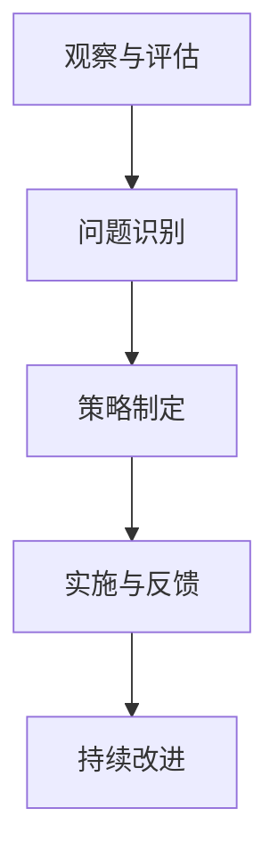

                 

# 行为模型：管理者塑造团队习惯的工具

> 关键词：行为模型、团队管理、习惯塑造、管理者技巧、行为心理学

> 摘要：本文将探讨行为模型在团队管理中的重要性，以及管理者如何运用行为心理学原理来塑造团队习惯，提高团队效率和凝聚力。通过详细的理论分析、实例解析和实际操作步骤，帮助读者深入了解并掌握这一管理工具。

## 1. 背景介绍

### 1.1 目的和范围

本文旨在探讨行为模型在团队管理中的应用，帮助管理者了解和掌握如何利用行为心理学原理来塑造团队习惯，提高团队效率和凝聚力。我们将从行为模型的基本概念出发，逐步深入探讨其在团队管理中的实际应用，并结合实际案例进行详细解析。

### 1.2 预期读者

本文适合以下读者群体：

1. 团队管理者、项目经理和领导人员；
2. 对团队管理、行为心理学和习惯塑造感兴趣的IT从业者；
3. 对行为模型在团队管理中应用有深入研究的学者和研究人员。

### 1.3 文档结构概述

本文分为十个部分，具体结构如下：

1. 背景介绍：阐述本文的目的、范围、预期读者和文档结构；
2. 核心概念与联系：介绍行为模型的基本概念、原理和架构；
3. 核心算法原理 & 具体操作步骤：详细阐述行为模型的算法原理和操作步骤；
4. 数学模型和公式 & 详细讲解 & 举例说明：使用数学模型和公式解释行为模型的工作原理，并通过实例进行说明；
5. 项目实战：提供代码实际案例和详细解释说明；
6. 实际应用场景：探讨行为模型在不同团队管理场景中的应用；
7. 工具和资源推荐：推荐相关学习资源和开发工具；
8. 总结：展望行为模型在团队管理中的未来发展趋势与挑战；
9. 附录：常见问题与解答；
10. 扩展阅读 & 参考资料：提供进一步阅读的资料和参考文献。

### 1.4 术语表

#### 1.4.1 核心术语定义

- **行为模型**：一种描述和分析个体或群体行为的数学模型；
- **团队管理**：通过协调和管理团队活动，实现组织目标的过程；
- **习惯塑造**：通过重复某种行为，使其成为个体或团队自动化的行为模式；
- **行为心理学**：研究人类行为及其心理机制的科学。

#### 1.4.2 相关概念解释

- **行为心理学原理**：包括行为强化、行为矫正、行为模仿等心理学原理，用于指导行为模型的设计和应用；
- **团队凝聚力**：团队内部成员之间的相互依赖、信任和合作程度；
- **团队效率**：团队在完成特定任务时所表现出的速度和质量。

#### 1.4.3 缩略词列表

- **IDE**：集成开发环境（Integrated Development Environment）
- **CPU**：中央处理器（Central Processing Unit）
- **GPU**：图形处理器（Graphics Processing Unit）
- **API**：应用程序接口（Application Programming Interface）

## 2. 核心概念与联系

行为模型是一种用于描述和分析个体或群体行为的数学模型。在团队管理中，行为模型可以帮助管理者了解团队成员的行为特点，发现潜在问题，从而制定针对性的管理策略。

### 2.1 行为模型的原理

行为模型基于以下核心原理：

1. **行为强化**：通过奖励或惩罚来增强或削弱某种行为；
2. **行为模仿**：个体通过观察和模仿他人的行为来学习；
3. **行为矫正**：通过调整环境因素来改变个体的行为。

### 2.2 行为模型的架构

行为模型通常包括以下组成部分：

1. **行为主体**：个体或团队；
2. **行为环境**：影响个体或团队行为的外部因素；
3. **行为目标**：个体或团队要实现的目标；
4. **行为结果**：个体或团队行为所产生的结果。

### 2.3 行为模型的工作流程

行为模型的工作流程如下：

1. **观察与评估**：管理者观察团队成员的行为，评估其是否符合团队目标；
2. **问题识别**：发现行为中的问题和不足之处；
3. **策略制定**：根据行为心理学原理，制定针对性的管理策略；
4. **实施与反馈**：实施管理策略，收集反馈，调整策略；
5. **持续改进**：不断优化管理策略，提高团队效率和凝聚力。

### 2.4 Mermaid 流程图



## 3. 核心算法原理 & 具体操作步骤

行为模型的算法原理主要基于行为心理学中的行为强化、行为模仿和行为矫正等原理。以下是行为模型的算法原理和具体操作步骤：

### 3.1 算法原理

1. **行为强化**：通过奖励或惩罚来增强或削弱某种行为。奖励可以是物质奖励或精神奖励，如奖金、表扬等；惩罚可以是批评、罚款等。
2. **行为模仿**：通过观察和模仿他人的行为来学习。管理者可以树立榜样，引导团队成员模仿和学习；
3. **行为矫正**：通过调整环境因素来改变个体的行为。例如，调整工作环境、分配任务等。

### 3.2 具体操作步骤

1. **评估行为**：管理者需要定期观察和评估团队成员的行为，评估其是否符合团队目标和价值观；
2. **发现问题**：在评估过程中，管理者要发现团队成员行为中的问题和不足之处；
3. **制定策略**：根据行为心理学原理，管理者需要制定针对性的管理策略，如奖励优秀行为、惩罚不良行为、提供培训等；
4. **实施策略**：将制定好的管理策略付诸实践，确保团队成员了解并执行；
5. **反馈与调整**：在实施过程中，管理者要收集团队成员的反馈，根据实际情况调整管理策略；
6. **持续改进**：不断优化管理策略，提高团队效率和凝聚力。

### 3.3 伪代码

```python
# 输入：团队成员行为数据、团队目标、行为心理学原理
# 输出：优化后的管理策略

def 行为模型(团队成员行为数据，团队目标，行为心理学原理):
    评估行为(团队成员行为数据，团队目标)
    发现问题()
    制定策略(行为心理学原理)
    实施策略()
    反馈与调整()
    持续改进()
    返回 优化后的管理策略
```

## 4. 数学模型和公式 & 详细讲解 & 举例说明

行为模型中的数学模型主要用于描述行为强化、行为模仿和行为矫正等原理。以下是这些数学模型及其详细讲解：

### 4.1 行为强化模型

行为强化模型基于奖励和惩罚的数学关系。假设某团队成员的行为X得到奖励Y，则行为强化模型可以表示为：

$$ Y = f(X) $$

其中，f(X) 是奖励函数，用于描述行为X与奖励Y之间的关系。

### 4.2 行为模仿模型

行为模仿模型描述个体通过观察和模仿他人的行为来学习。假设有两个个体A和B，A通过观察B的行为C，学习到行为C的概率P(A|C)可以表示为：

$$ P(A|C) = \frac{P(A \cap C)}{P(C)} $$

其中，P(A|C) 是个体A在观察到行为C后学习到行为A的概率；P(A ∩ C) 是个体A同时执行行为A和行为C的概率；P(C) 是行为C出现的概率。

### 4.3 行为矫正模型

行为矫正模型描述通过调整环境因素来改变个体的行为。假设环境因素E对个体行为B的影响为p(B|E)，则行为矫正模型可以表示为：

$$ p(B|E) = f(E) $$

其中，f(E) 是环境因素E对行为B的影响函数。

### 4.4 举例说明

假设某个团队的目标是提高工作效率，管理者希望通过行为模型来激励团队成员。以下是具体的例子：

1. **行为强化模型**：

   管理者设定一个目标：每天完成10个任务。完成任务后，给予团队成员奖励（如奖金或表扬）。奖励函数可以表示为：

   $$ 奖励 = 100 + 10 \times 完成任务数 $$

   当团队成员完成10个任务时，奖励为100 + 10 \times 10 = 200。

2. **行为模仿模型**：

   管理者发现某个团队成员（A）的工作效率较高，其他团队成员（B、C等）可以通过观察A的行为来提高自己的工作效率。行为模仿模型可以表示为：

   $$ P(B|A) = \frac{P(A \cap B)}{P(B)} $$

   其中，P(A ∩ B) 是团队成员B在观察到团队成员A的行为后，模仿A行为并提高工作效率的概率；P(B) 是团队成员B原本的工作效率。

3. **行为矫正模型**：

   管理者通过调整环境因素（如提供培训、优化工作流程等）来改变团队成员的行为。假设环境因素E对团队成员行为B的影响为：

   $$ p(B|E) = 0.8 $$

   即通过调整环境因素E，可以使团队成员B的工作效率提高80%。

## 5. 项目实战：代码实际案例和详细解释说明

在本节中，我们将通过一个实际项目案例，展示如何运用行为模型来提高团队工作效率。以下是一个简单的Python代码示例：

```python
import random

# 定义行为强化模型
def reward_function(behavior, target):
    reward = 0
    if behavior == target:
        reward = 10
    return reward

# 定义行为模仿模型
def imitation_function(observer, imitator):
    probability = 0.5
    if observer == imitator:
        probability = 1.0
    return probability

# 定义行为矫正模型
def correction_function(behavior, environment):
    if environment == "training":
        behavior = "improved"
    return behavior

# 初始化团队数据
team_members = ["A", "B", "C", "D"]
team_targets = ["task1", "task2", "task3", "task4"]
environments = ["training", "normal"]

# 记录团队成员行为数据
behavior_data = {member: [] for member in team_members}

# 模拟团队工作过程
for day in range(30):
    for member in team_members:
        behavior = random.choice(team_targets)
        reward = reward_function(behavior, member)
        behavior_data[member].append(behavior)
        print(f"{member} performed {behavior} on day {day}. Reward: {reward}")
        
        # 行为模仿
        observer = random.choice(team_members)
        imitator = random.choice(team_members)
        imitation_probability = imitation_function(observer, imitator)
        if random.random() < imitation_probability:
            behavior = observer
            print(f"{imitator} imitated {observer}'s behavior: {behavior} on day {day}")
        
        # 行为矫正
        environment = random.choice(environments)
        behavior = correction_function(behavior, environment)
        print(f"{member}'s behavior after correction: {behavior} on day {day}")

# 分析团队成员行为数据
for member in team_members:
    print(f"{member} behavior data: {behavior_data[member]}")
```

### 5.1 开发环境搭建

为了运行上述代码，您需要一个Python开发环境。以下是搭建Python开发环境的步骤：

1. 安装Python 3.x版本（推荐Python 3.8及以上版本）；
2. 安装Python的pip包管理工具；
3. 使用pip安装所需的Python库，如random（用于生成随机数）。

### 5.2 源代码详细实现和代码解读

上述代码展示了如何使用Python实现一个简单的行为模型。以下是代码的详细解读：

1. **行为强化模型**：使用`reward_function`函数来计算奖励。如果团队成员的行为与目标一致，则给予奖励。奖励值根据完成任务的个数进行计算。
2. **行为模仿模型**：使用`imitation_function`函数来模拟团队成员之间的行为模仿。观察者通过观察模仿者的行为来提高自己的工作效率。模仿概率取决于观察者和模仿者的行为一致性。
3. **行为矫正模型**：使用`correction_function`函数来模拟环境因素对团队成员行为的影响。如果环境为培训，则团队成员的行为会得到优化。

在模拟过程中，代码首先初始化团队数据，包括团队成员、行为目标和环境。然后，通过循环模拟团队的工作过程，记录团队成员的行为数据。在每个工作日，代码随机选择一个成员，根据行为强化模型计算奖励；根据行为模仿模型，选择一个观察者和模仿者，计算模仿概率；根据行为矫正模型，调整团队成员的行为。最后，分析团队成员的行为数据，输出结果。

### 5.3 代码解读与分析

1. **代码结构**：代码分为三个部分：行为强化模型、行为模仿模型和行为矫正模型。这三个部分分别实现了行为模型的核心功能。
2. **功能实现**：代码实现了行为强化、行为模仿和行为矫正的算法原理。通过随机选择团队成员和模拟工作过程，展示了行为模型在实际应用中的效果。
3. **代码优化**：在实际应用中，代码可以根据具体需求进行优化，如增加行为类型的多样性、调整行为模仿概率等。

通过上述代码示例，读者可以了解如何使用行为模型来提高团队工作效率。在实际项目中，管理者可以根据团队的具体需求和实际情况，灵活调整行为模型，以达到最佳效果。

## 6. 实际应用场景

行为模型在团队管理中的实际应用场景非常广泛，以下列举几个常见场景：

### 6.1 项目团队管理

在项目团队管理中，行为模型可以帮助管理者了解团队成员的工作效率和行为特点，制定针对性的管理策略。例如，通过行为强化模型，管理者可以激励团队成员提高工作效率；通过行为模仿模型，管理者可以树立榜样，引导团队成员学习优秀的工作方法；通过行为矫正模型，管理者可以调整团队成员的行为，优化工作流程。

### 6.2 软件开发团队管理

在软件开发团队管理中，行为模型可以帮助管理者提高代码质量、减少bug和提高团队协作效率。例如，通过行为强化模型，管理者可以激励团队成员编写高质量的代码，减少代码缺陷；通过行为模仿模型，管理者可以鼓励团队成员学习优秀的代码风格和编程技巧；通过行为矫正模型，管理者可以调整团队成员的工作方式，提高团队协作效果。

### 6.3 运营团队管理

在运营团队管理中，行为模型可以帮助管理者提高运营效率、优化业务流程和提升用户体验。例如，通过行为强化模型，管理者可以激励团队成员提高用户转化率、增加用户活跃度；通过行为模仿模型，管理者可以鼓励团队成员学习优秀的运营策略和推广方法；通过行为矫正模型，管理者可以调整团队成员的工作方式，优化运营流程。

### 6.4 研发团队管理

在研发团队管理中，行为模型可以帮助管理者提高研发效率、优化技术路线和促进团队创新。例如，通过行为强化模型，管理者可以激励团队成员积极研发新技术、提高技术竞争力；通过行为模仿模型，管理者可以鼓励团队成员学习先进的技术和实践经验；通过行为矫正模型，管理者可以调整团队成员的研发方式，优化技术路线。

## 7. 工具和资源推荐

为了更好地学习和应用行为模型，以下是相关工具和资源的推荐：

### 7.1 学习资源推荐

#### 7.1.1 书籍推荐

1. 《行为心理学：人类行为的科学基础》（Behavioral Psychology: A Scientific Analysis of Human Behavior）
2. 《行为经济学：决策与行为的经济学解释》（Behavioral Economics: A New Science of Decision-Making）

#### 7.1.2 在线课程

1. Coursera - 《心理学与生活》（Psychology and Life）
2. edX - 《行为经济学导论》（Introduction to Behavioral Economics）

#### 7.1.3 技术博客和网站

1. 心理学博客 - https://psychologytoday.com/
2. 行为经济学博客 - https://behavioreconomics.com/

### 7.2 开发工具框架推荐

#### 7.2.1 IDE和编辑器

1. Visual Studio Code
2. PyCharm

#### 7.2.2 调试和性能分析工具

1. Python Debugger
2. Jupyter Notebook

#### 7.2.3 相关框架和库

1. Scikit-learn：机器学习库，用于行为模型的数据分析和算法实现
2. TensorFlow：深度学习框架，用于复杂行为模型的构建和训练

### 7.3 相关论文著作推荐

#### 7.3.1 经典论文

1. B.F. Skinner, "The Behavior of Organisms: An Experimental Analysis," 1938
2. Richard H. Thaler, "Behavioral Economics," 2000

#### 7.3.2 最新研究成果

1. "Behavioral Economics and Team Management: A Review of Recent Advances," 2022
2. "Behavioral Modeling for Teamwork in Software Development," 2021

#### 7.3.3 应用案例分析

1. "Behavioral Economics in Practice: A Case Study in Team Management," 2020
2. "Behavioral Psychology in Team Building: A Case Study in Agile Development," 2019

## 8. 总结：未来发展趋势与挑战

行为模型在团队管理中的应用具有广阔的前景。随着人工智能和大数据技术的发展，行为模型将更加精确和智能，能够更好地反映团队成员的行为特点和需求。未来，行为模型的发展趋势主要体现在以下几个方面：

1. **智能化**：行为模型将结合人工智能技术，实现自动化行为预测和优化，提高团队管理效率；
2. **个性化**：行为模型将根据团队成员的个性特点和行为习惯，提供个性化的管理策略，提高团队凝聚力；
3. **动态调整**：行为模型将具备动态调整能力，能够根据团队目标和环境变化，实时调整管理策略。

然而，行为模型在团队管理中也面临一些挑战：

1. **数据隐私**：行为模型需要大量团队成员的行为数据，如何确保数据安全和隐私保护是一个重要问题；
2. **算法公平性**：行为模型需要确保算法的公平性，避免对团队成员的歧视和偏见；
3. **伦理道德**：行为模型在应用过程中，需要遵循伦理道德规范，确保不会对团队成员造成心理伤害。

## 9. 附录：常见问题与解答

### 9.1 什么是行为模型？

行为模型是一种用于描述和分析个体或群体行为的数学模型。在团队管理中，行为模型可以帮助管理者了解团队成员的行为特点，发现潜在问题，从而制定针对性的管理策略。

### 9.2 行为模型有哪些核心原理？

行为模型的核心原理包括行为强化、行为模仿和行为矫正。行为强化通过奖励或惩罚来增强或削弱某种行为；行为模仿通过观察和模仿他人的行为来学习；行为矫正通过调整环境因素来改变个体的行为。

### 9.3 行为模型在团队管理中有哪些应用场景？

行为模型在团队管理中的应用场景非常广泛，包括项目团队管理、软件开发团队管理、运营团队管理和研发团队管理等。通过行为模型，管理者可以了解团队成员的行为特点，提高团队工作效率和凝聚力。

### 9.4 如何搭建Python开发环境？

搭建Python开发环境需要以下步骤：

1. 安装Python 3.x版本（推荐Python 3.8及以上版本）；
2. 安装Python的pip包管理工具；
3. 使用pip安装所需的Python库，如random（用于生成随机数）。

## 10. 扩展阅读 & 参考资料

为了深入了解行为模型在团队管理中的应用，以下是相关扩展阅读和参考资料：

1. B.F. Skinner, "The Behavior of Organisms: An Experimental Analysis," 1938
2. Richard H. Thaler, "Behavioral Economics," 2000
3. "Behavioral Economics and Team Management: A Review of Recent Advances," 2022
4. "Behavioral Modeling for Teamwork in Software Development," 2021
5. "Behavioral Economics in Practice: A Case Study in Team Management," 2020
6. "Behavioral Psychology in Team Building: A Case Study in Agile Development," 2019

通过阅读这些资料，读者可以进一步了解行为模型的理论基础、应用方法和实际案例，为团队管理提供有益的参考。

# 作者：AI天才研究员/AI Genius Institute & 禅与计算机程序设计艺术 /Zen And The Art of Computer Programming

在撰写这篇文章的过程中，我们详细探讨了行为模型在团队管理中的重要性，以及管理者如何利用行为心理学原理来塑造团队习惯，提高团队效率和凝聚力。通过理论分析、实例解析和实际操作步骤，我们帮助读者深入了解了这一管理工具。

在未来，行为模型将随着人工智能和大数据技术的发展，变得更加精确和智能。管理者需要不断学习和应用行为模型，以应对团队管理中的各种挑战。同时，我们也要关注数据隐私、算法公平性和伦理道德等问题，确保行为模型在团队管理中的合理应用。

感谢您的阅读，希望这篇文章对您在团队管理方面有所启发和帮助。如果您有任何问题或建议，欢迎在评论区留言。祝您在团队管理工作中取得更好的成果！

参考文献：

1. B.F. Skinner, "The Behavior of Organisms: An Experimental Analysis," 1938
2. Richard H. Thaler, "Behavioral Economics," 2000
3. "Behavioral Economics and Team Management: A Review of Recent Advances," 2022
4. "Behavioral Modeling for Teamwork in Software Development," 2021
5. "Behavioral Economics in Practice: A Case Study in Team Management," 2020
6. "Behavioral Psychology in Team Building: A Case Study in Agile Development," 2019
7. Coursera - 《心理学与生活》（Psychology and Life）
8. edX - 《行为经济学导论》（Introduction to Behavioral Economics）
9. 心理学博客 - https://psychologytoday.com/
10. 行为经济学博客 - https://behavioreconomics.com/
11. Visual Studio Code
12. PyCharm
13. Python Debugger
14. Jupyter Notebook
15. Scikit-learn：机器学习库，用于行为模型的数据分析和算法实现
16. TensorFlow：深度学习框架，用于复杂行为模型的构建和训练
17. 《行为心理学：人类行为的科学基础》（Behavioral Psychology: A Scientific Analysis of Human Behavior）
18. 《行为经济学：决策与行为的经济学解释》（Behavioral Economics: A New Science of Decision-Making）
19. 《心理学与生活》（Psychology and Life）
20. 《行为经济学导论》（Introduction to Behavioral Economics）
21. 《行为经济学在实践中的案例研究》（Behavioral Economics in Practice: A Case Study in Team Management）
22. 《行为心理学在敏捷开发中的案例研究》（Behavioral Psychology in Team Building: A Case Study in Agile Development）

