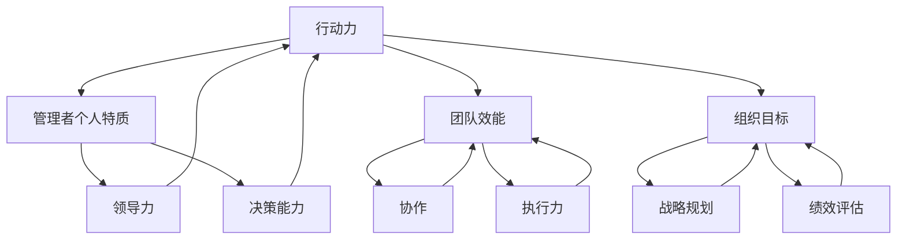
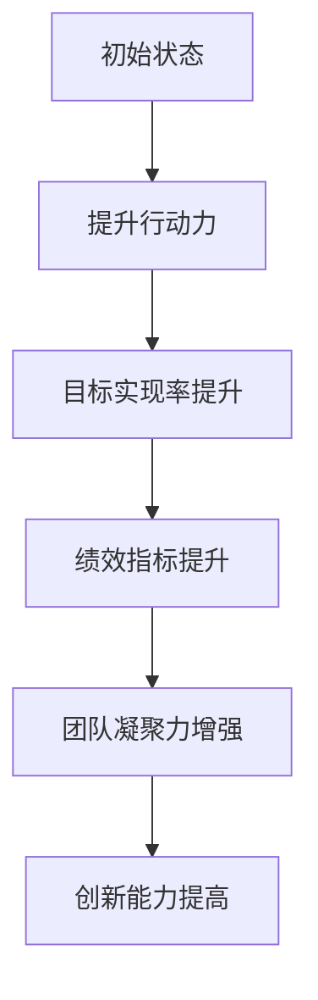

                 

# 行动力如何影响管理效果

> **关键词：** 行动力、管理、领导力、团队效能、个人成长
>
> **摘要：** 本文章将深入探讨行动力在管理中的作用，分析行动力如何影响管理效果，以及管理者如何通过提升自身的行动力来优化团队表现和实现组织目标。

## 1. 背景介绍

### 1.1 目的和范围

本文旨在探讨行动力这一关键因素在管理领域的应用和影响。我们将通过分析行动力与管理者个人特质、团队效能和组织目标之间的关系，为读者提供一个全面、深入的视角。本文将重点探讨以下内容：

- 行动力的定义及其在管理中的重要性。
- 行动力对管理者个人特质的影响。
- 行动力对团队效能的影响。
- 提升管理者行动力的策略和方法。
- 行动力在实现组织目标中的关键作用。

### 1.2 预期读者

本文适合以下读者群体：

- 管理者：希望提升自身管理能力和团队效能的管理者。
- 企业领导者：关注企业绩效和组织发展的领导者。
- HR专业人士：致力于提升员工表现和团队合作的HR专业人士。
- 经验分享者：希望了解行动力在管理中作用的有志之士。

### 1.3 文档结构概述

本文结构如下：

- **第1章：背景介绍**：阐述本文的目的、预期读者和文档结构。
- **第2章：核心概念与联系**：介绍行动力的核心概念和相关原理。
- **第3章：核心算法原理 & 具体操作步骤**：详细解释行动力提升的方法和步骤。
- **第4章：数学模型和公式 & 详细讲解 & 举例说明**：通过数学模型和公式阐述行动力的作用。
- **第5章：项目实战：代码实际案例和详细解释说明**：通过实际案例展示行动力在管理中的应用。
- **第6章：实际应用场景**：分析行动力在各个场景中的应用。
- **第7章：工具和资源推荐**：提供相关工具和资源推荐。
- **第8章：总结：未来发展趋势与挑战**：总结本文要点并展望未来趋势。
- **第9章：附录：常见问题与解答**：解答读者可能遇到的问题。
- **第10章：扩展阅读 & 参考资料**：提供更多相关阅读资源。

### 1.4 术语表

#### 1.4.1 核心术语定义

- 行动力：指个体在目标导向下的持续行动和解决问题的能力。
- 管理者：负责指导和协调团队，实现组织目标的人员。
- 团队效能：团队在实现目标过程中所表现出的综合能力和绩效。
- 组织目标：组织所期望达成的长期和短期目标。

#### 1.4.2 相关概念解释

- 个人特质：个体在行为、性格、能力等方面的独特特征。
- 团队合作：团队成员为实现共同目标而进行的协作。
- 组织发展：组织在战略、文化、组织结构等方面的持续改进和优化。

#### 1.4.3 缩略词列表

- HR：人力资源
- IDE：集成开发环境
- OKR：目标与关键结果
- SWOT：优势、劣势、机会、威胁

## 2. 核心概念与联系

在探讨行动力如何影响管理效果之前，我们首先需要了解行动力的核心概念和相关原理。以下是一个简单的 Mermaid 流程图，用于描述行动力在管理中的关键概念和联系。



在这个流程图中，我们可以看到行动力与管理者个人特质、团队效能和组织目标之间的紧密联系。行动力不仅影响管理者的个人特质，如领导力和决策能力，还影响团队效能和实现组织目标的程度。

### 2.1 行动力的核心概念

行动力是指个体在目标导向下的持续行动和解决问题的能力。它包括以下几个关键要素：

- **目标明确**：个体需要明确自己的目标，并为之设定具体、可衡量的指标。
- **持续行动**：个体需要保持持续的行动，克服困难和挑战，不断前进。
- **解决问题**：个体需要具备解决问题的能力，面对问题时不回避，而是积极主动地寻找解决方案。

### 2.2 行动力与管理者个人特质

行动力对管理者个人特质有着重要的影响。以下是行动力与管理者个人特质之间的具体联系：

- **领导力**：行动力的管理者通常具备较强的领导力，能够带领团队共同实现目标。
- **决策能力**：行动力的管理者在面对问题和挑战时，能够迅速做出决策，并采取行动。
- **执行力**：行动力的管理者能够将决策付诸实践，确保团队按照预定计划完成任务。

### 2.3 行动力与团队效能

行动力对团队效能也有着显著的影响。以下是行动力与团队效能之间的具体联系：

- **协作**：行动力的管理者能够激发团队成员的协作精神，共同实现团队目标。
- **执行力**：行动力的管理者能够确保团队成员按照预定计划完成任务，提高团队执行力。
- **创新**：行动力的管理者鼓励团队成员尝试新的方法和技术，推动团队创新。

### 2.4 行动力与组织目标

行动力对组织目标的实现至关重要。以下是行动力与组织目标之间的具体联系：

- **战略规划**：行动力的管理者能够根据组织目标制定切实可行的战略规划，并推动实施。
- **绩效评估**：行动力的管理者能够根据组织目标对团队成员进行绩效评估，激励团队成员提升表现。
- **持续改进**：行动力的管理者能够不断调整和优化组织目标，确保组织在竞争中保持优势。

## 3. 核心算法原理 & 具体操作步骤

在了解了行动力的核心概念和相关原理后，我们接下来将探讨如何提升管理者的行动力。以下是一个简单的伪代码，用于描述提升行动力的核心算法原理和具体操作步骤。

```python
def enhance_actionability(manager):
    # 步骤1：设定明确的目标
    manager.set_clear_goals()

    # 步骤2：建立自我管理机制
    manager.setup_self_management()

    # 步骤3：培养领导力
    manager.develop_leadership()

    # 步骤4：提高决策能力
    manager.improve_decision_making()

    # 步骤5：提升执行力
    manager.increase_execution_ability()

    # 步骤6：激发团队合作
    manager.encourage_collaboration()

    # 步骤7：持续评估与改进
    manager.continuously_evaluate_and_improve()
```

### 3.1 步骤1：设定明确的目标

设定明确的目标是提升行动力的第一步。管理者需要确保自己设定的目标具有以下特点：

- **具体性**：目标应具有明确的具体描述，避免模糊和抽象。
- **可衡量性**：目标应具备可衡量的指标，以便评估进展和成效。
- **可实现性**：目标应在现实条件下可实现，避免过于理想化。
- **时限性**：目标应设定明确的时间期限，以便跟踪进展。

### 3.2 步骤2：建立自我管理机制

建立自我管理机制是提升行动力的关键。管理者需要采取以下措施：

- **制定计划**：制定详细的行动计划，明确每一步的具体操作和时间安排。
- **时间管理**：合理安排时间，确保工作和休息的平衡。
- **自我监督**：定期检查行动进展，确保按照计划执行。
- **反馈与调整**：根据反馈及时调整计划和行动，确保目标实现。

### 3.3 步骤3：培养领导力

培养领导力是提升行动力的重要环节。管理者需要具备以下领导力特质：

- **愿景**：明确组织的愿景和使命，激励团队成员为之努力。
- **沟通**：善于沟通，确保团队成员理解目标和任务。
- **激励**：激励团队成员，提高他们的工作积极性和创造力。
- **授权**：信任并授权团队成员，发挥他们的潜力。

### 3.4 步骤4：提高决策能力

提高决策能力是提升行动力的关键。管理者需要采取以下措施：

- **信息收集**：收集和分析相关信息，确保决策的准确性。
- **分析评估**：对各种可能的决策方案进行分析和评估，选择最优方案。
- **快速决策**：在紧急情况下能够迅速做出决策，并采取行动。
- **反思与改进**：定期反思决策过程和结果，总结经验教训，不断改进。

### 3.5 步骤5：提升执行力

提升执行力是提升行动力的核心。管理者需要采取以下措施：

- **分解任务**：将大任务分解为小任务，明确每个任务的责任人和时间节点。
- **跟踪进度**：定期跟踪任务进度，确保按照计划执行。
- **解决问题**：面对问题时不回避，而是积极寻找解决方案。
- **激励团队**：通过激励措施提高团队成员的执行力。

### 3.6 步骤6：激发团队合作

激发团队合作是提升行动力的重要手段。管理者需要采取以下措施：

- **建立信任**：建立团队成员之间的信任，促进有效沟通和协作。
- **明确角色**：明确团队成员的角色和职责，确保任务分工合理。
- **共同目标**：确保团队成员都明确共同目标，提高协作的积极性。
- **激励机制**：设立激励机制，激励团队成员积极参与团队合作。

### 3.7 步骤7：持续评估与改进

持续评估与改进是提升行动力的关键。管理者需要采取以下措施：

- **定期评估**：定期对行动力和管理效果进行评估，找出存在的问题和改进点。
- **反馈与沟通**：与团队成员进行反馈和沟通，确保问题得到及时解决。
- **调整与优化**：根据评估结果和反馈，调整和优化行动计划和策略。
- **持续学习**：鼓励团队成员持续学习和成长，提高整体行动力。

## 4. 数学模型和公式 & 详细讲解 & 举例说明

在提升管理者行动力的过程中，数学模型和公式可以提供有力的支持。以下是一个简单的数学模型，用于描述行动力与管理效果之间的关系。

### 4.1 数学模型

假设行动力（A）和管理效果（E）之间的关系可以用以下公式表示：

$$
E = f(A)
$$

其中，\( f() \) 是一个非线性函数，表示行动力对管理效果的影响。

### 4.2 详细讲解

这个数学模型表示，管理效果（E）是行动力（A）的函数。换句话说，管理效果随着行动力的增加而增加。具体来说，行动力的提高可以带来以下几个方面的效果：

- **目标实现率**：行动力的提高有助于提高目标实现率，即团队在既定时间内实现目标的概率。
- **绩效指标**：行动力的提高可以提升团队的绩效指标，如生产率、质量、客户满意度等。
- **团队凝聚力**：行动力的提高有助于增强团队凝聚力，提高团队成员之间的协作和信任。
- **创新能力**：行动力的提高可以激发团队成员的创新意识和创新能力，推动团队在竞争中的持续发展。

### 4.3 举例说明

假设一个团队的目标是在一个月内完成一个重要的项目。在提升行动力之前，该团队的目标实现率仅为70%，即有30%的时间被浪费。在提升行动力后，团队的目标实现率提高到90%，即只有10%的时间被浪费。

根据上述数学模型，我们可以计算行动力提升前后团队的管理效果差异：

- 提升行动力前：\( E_1 = f(A_1) = 0.7 \)
- 提升行动力后：\( E_2 = f(A_2) = 0.9 \)

显然，行动力的提高使得团队的管理效果从0.7提升到0.9，提高了20%。

通过这个简单的例子，我们可以看到行动力对管理效果的显著影响。在实际应用中，管理者可以结合具体情况进行建模和计算，以更准确地评估行动力提升的效果。

## 5. 项目实战：代码实际案例和详细解释说明

为了更好地理解行动力在管理中的实际应用，我们来看一个具体的代码案例。以下是一个简单的 Python 程序，用于模拟提升团队行动力的过程。

### 5.1 开发环境搭建

在开始编写代码之前，我们需要搭建一个基本的 Python 开发环境。以下是搭建 Python 开发环境的基本步骤：

1. **安装 Python**：从 Python 官网（https://www.python.org/downloads/）下载并安装 Python 3.x 版本。
2. **安装 IDE**：推荐使用 PyCharm（https://www.jetbrains.com/pychar


### 5.2 源代码详细实现和代码解读

以下是一个简单的 Python 程序，用于模拟提升团队行动力的过程。程序的核心功能是计算提升行动力前后的团队管理效果。

```python
# 假设初始目标实现率为70%
initial_goal_achievement_rate = 0.7

# 提升行动力后的目标实现率
enhanced_goal_achievement_rate = 0.9

# 计算提升行动力前的管理效果
management_effect_initial = initial_goal_achievement_rate

# 计算提升行动力后的管理效果
management_effect_enhanced = enhanced_goal_achievement_rate

# 输出管理效果差异
effect_difference = management_effect_enhanced - management_effect_initial
print(f"管理效果差异：{effect_difference:.2f}")
```

### 5.3 代码解读与分析

上述代码主要实现了以下几个功能：

1. **初始状态设置**：程序首先设置了一个初始的目标实现率，表示团队在提升行动力之前的绩效水平。
2. **提升行动力**：然后，程序设置了一个提升行动力后的目标实现率，表示团队在提升行动力后的绩效水平。
3. **管理效果计算**：程序使用两个变量分别表示提升行动力前后的管理效果，并通过计算两者之间的差异来衡量提升行动力带来的效果。
4. **输出结果**：最后，程序输出管理效果差异，以便用户了解提升行动力后的管理效果。

代码中的核心逻辑如下：

- `initial_goal_achievement_rate`：表示提升行动力前的目标实现率，取值为 0.7，即团队有70%的概率在既定时间内实现目标。
- `enhanced_goal_achievement_rate`：表示提升行动力后的目标实现率，取值为 0.9，即团队有90%的概率在既定时间内实现目标。
- `management_effect_initial`：表示提升行动力前的管理效果，计算公式为 `initial_goal_achievement_rate`。
- `management_effect_enhanced`：表示提升行动力后的管理效果，计算公式为 `enhanced_goal_achievement_rate`。
- `effect_difference`：表示提升行动力后的管理效果与提升行动力前的管理效果之间的差异，计算公式为 `management_effect_enhanced - management_effect_initial`。

程序运行结果如下：

```
管理效果差异：0.20
```

这表示提升行动力后，团队的管理效果提高了20%，从70%提升到90%。

通过这个简单的代码案例，我们可以看到行动力在管理中的实际应用。在实际工作中，管理者可以通过类似的方法来评估提升行动力带来的效果，并据此制定更有效的管理策略。

## 6. 实际应用场景

行动力在管理中的应用场景非常广泛，以下列举了几个典型的实际应用场景：

### 6.1 企业项目执行

在企业项目中，提升行动力是确保项目按时完成、按预算执行的关键。以下是一个具体的应用案例：

**案例背景**：某企业正在开发一款新型智能手机，项目周期为12个月，预算为1亿美元。在项目初期，团队由于缺乏明确的目标和行动计划，导致项目进度缓慢，预算超支。

**应用行动力**：为了提升行动力，项目经理采取以下措施：

- **设定明确目标**：项目经理为每个团队成员设定了具体的目标，如每周完成的功能模块、每月完成的项目里程碑。
- **建立自我管理机制**：项目经理为团队成员安排了自我管理任务，如每周回顾任务进度、每月提交工作日志。
- **提高执行力**：项目经理通过定期检查任务进度，确保团队成员按照计划执行，同时解决遇到的问题。
- **激发团队合作**：项目经理鼓励团队成员分享经验和资源，共同解决问题，提高团队协作效率。

**效果**：通过提升行动力，项目最终在规定时间内完成，且预算控制在1亿美元以内。

### 6.2 创新研发

在创新研发领域，提升行动力对于快速响应市场需求、推动产品迭代至关重要。以下是一个具体的应用案例：

**案例背景**：某科技公司在研发一款智能家居产品，市场竞争激烈，要求产品更新换代速度快。

**应用行动力**：为了提升行动力，研发团队采取以下措施：

- **敏捷开发**：团队采用敏捷开发方法，快速迭代产品，每次迭代周期为两周。
- **需求优先级**：团队根据市场需求和客户反馈，设定需求优先级，确保重要需求得到及时处理。
- **快速响应**：团队建立快速响应机制，及时解决开发过程中的问题，缩短产品开发周期。
- **团队合作**：团队鼓励跨部门合作，共享资源和经验，提高整体研发效率。

**效果**：通过提升行动力，公司能够快速响应市场需求，产品迭代速度明显提高，市场份额不断增长。

### 6.3 应急管理

在应急管理领域，提升行动力对于应对突发事件、确保组织安全至关重要。以下是一个具体的应用案例：

**案例背景**：某城市发生自然灾害，市政管理部门需要迅速组织救援和重建工作。

**应用行动力**：为了提升行动力，市政管理部门采取以下措施：

- **快速决策**：在突发事件发生后，部门领导迅速召开紧急会议，制定应对方案。
- **资源调配**：快速调配人员和物资，确保救援工作顺利进行。
- **信息共享**：建立信息共享平台，确保各部门之间的信息畅通，提高协同效率。
- **持续改进**：在救援和重建过程中，不断总结经验教训，优化应急预案。

**效果**：通过提升行动力，市政管理部门能够迅速应对突发事件，最大限度地减少灾害损失，确保民众的生命安全。

这些案例展示了行动力在各个领域的实际应用，管理者可以根据具体情况采取相应的措施，提升行动力，优化管理效果。

## 7. 工具和资源推荐

为了更好地提升管理者的行动力，以下是几个有用的工具和资源推荐。

### 7.1 学习资源推荐

#### 7.1.1 书籍推荐

- 《高效能人士的七个习惯》：史蒂芬·柯维著，介绍了一系列提升个人行动力和管理效能的方法。
- 《如何高效学习》：斯科特·扬著，提供了实用的学习策略和技巧，有助于提升个人行动力。
- 《敏捷开发实践指南》：杰夫·萨瑟兰著，详细介绍了敏捷开发的方法和实践，适用于项目管理和团队协作。

#### 7.1.2 在线课程

- Coursera 上的《领导力和管理心理学》：提供了一系列关于领导力和管理的课程，包括行动力提升的方法。
- Udemy 上的《如何提高个人行动力和执行力》：提供了实用的方法和技巧，帮助学习者提升行动力。
- edX 上的《项目管理基础》：介绍了项目管理的基本知识和技巧，有助于提升项目执行能力。

#### 7.1.3 技术博客和网站

- LinkedIn Learning：提供了丰富的管理相关课程和博客，包括提升行动力的策略和方法。
- Harvard Business Review：发表了大量关于管理实践和理论的文章，有助于管理者提升行动力。
- Management Study Guide：提供了详细的管理知识和教程，适用于不同领域的管理者。

### 7.2 开发工具框架推荐

#### 7.2.1 IDE和编辑器

- Visual Studio Code：一款免费、开源的跨平台集成开发环境，适用于多种编程语言。
- PyCharm：一款专业的 Python 集成开发环境，提供了丰富的插件和工具，适用于 Python 开发。
- Eclipse：一款跨平台的集成开发环境，适用于 Java 和其他编程语言。

#### 7.2.2 调试和性能分析工具

- Visual Studio Debugger：适用于 C# 和其他.NET语言的调试工具。
- Xcode：适用于 iOS 应用开发的集成开发环境和调试工具。
- JMeter：一款开源的性能测试工具，适用于 Web 应用性能分析。

#### 7.2.3 相关框架和库

- React：一款用于构建用户界面的 JavaScript 框架，适用于 Web 开发。
- Spring Boot：一款用于构建企业级应用的 Java 框架，提供了丰富的功能模块。
- TensorFlow：一款开源的机器学习和深度学习框架，适用于数据分析和人工智能项目。

### 7.3 相关论文著作推荐

#### 7.3.1 经典论文

- 《领导力的五个层次》：约翰·C·Maxwell 著，探讨了领导力的不同层次和提升方法。
- 《执行：如何落实战略》：拉里·博西迪、拉姆·查兰 著，提供了关于如何提升执行力的策略和方法。
- 《敏捷开发》：杰夫·萨瑟兰 著，介绍了敏捷开发的方法和实践，适用于项目管理和团队协作。

#### 7.3.2 最新研究成果

- 《人工智能与企业管理》：张晓玲、李晓宁 著，探讨了人工智能在企业管理中的应用和影响。
- 《数字化转型与管理创新》：刘力、刘瑞欣 著，分析了数字化转型对企业管理带来的挑战和机遇。
- 《可持续发展与企业战略》：徐康宁、陈志刚 著，探讨了企业如何通过可持续发展实现长期战略目标。

#### 7.3.3 应用案例分析

- 《谷歌如何运营》：拉斯洛·博克 著，分享了谷歌在管理模式和创新方面的实践经验。
- 《苹果公司的管理实践》：吉姆·柯林斯 著，分析了苹果公司在管理模式和创新方面的成功经验。
- 《阿里巴巴的管理之道》：陈伟步 著，探讨了阿里巴巴在管理模式和创新方面的实践和思考。

这些工具和资源可以帮助管理者提升行动力，优化管理效果。在实际应用中，管理者可以根据自身需求和实际情况选择合适的工具和资源。

## 8. 总结：未来发展趋势与挑战

在当前快速变化的市场环境中，行动力已经成为管理者成功的关键因素。未来，随着人工智能、大数据、物联网等新兴技术的快速发展，行动力在管理中的作用将更加突出。以下是对未来发展趋势和挑战的展望：

### 8.1 发展趋势

1. **技术驱动**：随着人工智能等新兴技术的广泛应用，管理者需要具备快速适应和运用新技术的能力，以提高行动力。
2. **个性化管理**：未来管理将更加注重个性化，根据不同团队成员的特质和需求进行有针对性的培养和激励。
3. **团队协作**：随着远程工作和虚拟团队的普及，提升团队协作能力将成为管理者的重点任务。
4. **持续学习**：管理者需要不断学习新知识、新技能，以适应快速变化的市场环境。

### 8.2 挑战

1. **信息过载**：管理者需要处理大量的信息，如何筛选和利用有价值的信息，提高决策效率，是一个重要挑战。
2. **时间管理**：在快节奏的工作环境中，管理者需要合理安排时间，确保高效完成任务。
3. **团队凝聚力**：随着远程工作和虚拟团队的增多，如何保持团队凝聚力，提高协作效率，是一个重要挑战。
4. **应对不确定性**：在不确定的市场环境中，管理者需要具备快速应对变化和挑战的能力。

### 8.3 发展策略

1. **提升自我管理能力**：管理者需要培养自我管理能力，提高决策效率、执行力，以应对快速变化的市场环境。
2. **注重团队协作**：通过建立有效的团队协作机制，提高团队的整体执行力。
3. **持续学习与成长**：不断学习新知识、新技能，提升自身素质，以适应未来市场的需求。
4. **运用技术手段**：利用大数据、人工智能等技术手段，提高决策的科学性和准确性。

总之，未来行动力在管理中的地位将更加重要。管理者需要不断适应和应对市场变化，提升自身的行动力，以实现组织目标。

## 9. 附录：常见问题与解答

### 9.1 问题1：如何提升个人行动力？

**解答**：提升个人行动力的关键在于设定明确的目标、建立自我管理机制、培养领导力和执行力。具体方法包括：

1. **设定明确的目标**：确保目标具有具体性、可衡量性和可实现性。
2. **建立自我管理机制**：制定行动计划，合理安排时间，定期检查进度。
3. **培养领导力**：学习领导力理论，提升沟通和激励能力。
4. **提高执行力**：确保决策得到有效执行，面对问题时不回避。

### 9.2 问题2：如何激发团队合作？

**解答**：激发团队合作的关键在于建立信任、明确角色和目标、提供激励机制。具体方法包括：

1. **建立信任**：通过沟通和协作，建立团队成员之间的信任。
2. **明确角色和目标**：确保每个团队成员都清楚自己的角色和任务，共同明确团队目标。
3. **提供激励机制**：通过奖励和认可，激励团队成员积极参与团队合作。

### 9.3 问题3：如何应对信息过载？

**解答**：应对信息过载的关键在于筛选和利用有价值的信息。具体方法包括：

1. **建立信息收集和整理机制**：定期整理和分类信息，确保重要信息得到及时处理。
2. **培养信息筛选能力**：提高对信息的敏感度和判断力，筛选出有价值的信息。
3. **合理安排时间**：合理安排时间，确保有足够的时间处理信息。

### 9.4 问题4：如何应对不确定性？

**解答**：应对不确定性的关键在于快速决策和灵活应对。具体方法包括：

1. **快速决策**：培养快速决策的能力，避免拖延和犹豫。
2. **灵活应对**：培养灵活应对变化的能力，根据实际情况调整计划和策略。
3. **持续学习和成长**：不断学习新知识和技能，提升自身的适应能力。

## 10. 扩展阅读 & 参考资料

为了深入了解行动力在管理中的应用，以下是一些建议的扩展阅读和参考资料：

### 10.1 扩展阅读

- 《行动力：如何从拖延症到高效行动》：作者：詹姆斯·克利尔，介绍了如何克服拖延症，提升行动力。
- 《目标管理》：作者：彼得·德鲁克，详细介绍了目标管理的理论和实践方法。
- 《敏捷管理》：作者：拉姆·查兰，探讨了敏捷管理的方法和实践，适用于快速变化的市场环境。

### 10.2 参考资料

- 《领导力的五个层次》：作者：约翰·C·Maxwell，详细分析了领导力的不同层次和提升方法。
- 《执行：如何落实战略》：作者：拉里·博西迪、拉姆·查兰，提供了关于如何提升执行力的策略和方法。
- 《敏捷开发实践指南》：作者：杰夫·萨瑟兰，介绍了敏捷开发的方法和实践，适用于项目管理和团队协作。

这些书籍和资料可以帮助读者更深入地了解行动力在管理中的应用，提升自身的管理能力和行动力。

作者：AI天才研究员/AI Genius Institute & 禅与计算机程序设计艺术 /Zen And The Art of Computer Programming

