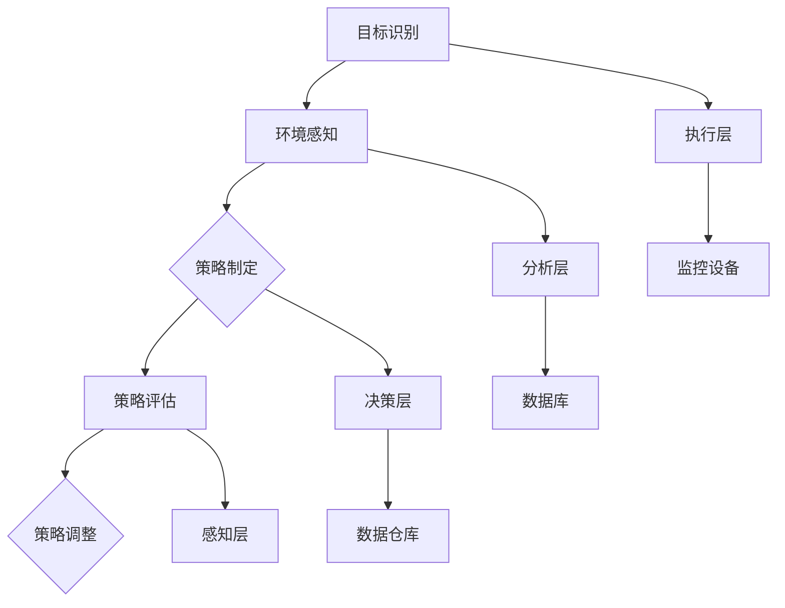

                 


## 《规划机制在智能监控系统中的应用》

> 关键词：规划机制、智能监控、系统架构、核心算法、数学模型、项目实战、应用场景

> 摘要：本文旨在探讨规划机制在智能监控系统中的应用，分析其核心概念、原理和具体操作步骤。通过数学模型和实际项目案例的详细解释，阐述规划机制如何提高智能监控系统的效率与准确性。文章还将介绍相关的工具和资源，以供读者进一步学习和实践。

### 1. 背景介绍

#### 1.1 目的和范围

随着物联网（IoT）和大数据技术的发展，智能监控系统在各个领域得到广泛应用。然而，传统的监控手段在面对复杂、动态的环境时显得力不从心。为了提高监控系统的效率与准确性，引入规划机制成为当前研究的热点。本文将围绕规划机制在智能监控系统中的应用进行探讨，旨在为读者提供系统、全面的了解。

本文主要讨论以下内容：

- 规划机制的基本概念和架构；
- 核心算法原理及具体操作步骤；
- 数学模型和公式详细讲解；
- 实际项目案例的代码实现和解析；
- 规划机制在不同应用场景中的表现。

#### 1.2 预期读者

本文面向具有一定编程基础和技术背景的读者，包括：

- 计算机科学与技术专业的学生和研究人员；
- 智能监控系统开发者；
- 对人工智能和物联网感兴趣的工程师和爱好者；
- 欲提升智能监控系统性能的从业者。

#### 1.3 文档结构概述

本文结构如下：

1. **背景介绍**：介绍本文的目的、范围、预期读者和文档结构；
2. **核心概念与联系**：阐述规划机制的基本概念、原理和架构，并使用Mermaid流程图展示；
3. **核心算法原理 & 具体操作步骤**：详细讲解核心算法的原理和操作步骤，使用伪代码进行阐述；
4. **数学模型和公式 & 详细讲解 & 举例说明**：介绍规划机制的数学模型和公式，并进行举例说明；
5. **项目实战：代码实际案例和详细解释说明**：通过实际项目案例，展示规划机制在代码中的实现和解析；
6. **实际应用场景**：探讨规划机制在不同应用场景中的效果和挑战；
7. **工具和资源推荐**：推荐相关学习资源、开发工具框架和论文著作；
8. **总结：未来发展趋势与挑战**：总结本文的核心内容，探讨未来发展趋势和挑战；
9. **附录：常见问题与解答**：针对读者可能遇到的常见问题进行解答；
10. **扩展阅读 & 参考资料**：提供进一步学习和研究的参考资料。

#### 1.4 术语表

##### 1.4.1 核心术语定义

- 规划机制：指在智能监控系统中，用于制定和调整监控策略的算法和模型；
- 智能监控系统：指基于物联网、大数据和人工智能技术，实现自动监控、分析和决策的系统；
- 监控目标：指智能监控系统需要监控的特定对象或事件；
- 动态环境：指监控对象和环境不断变化、复杂的情况。

##### 1.4.2 相关概念解释

- 物联网（IoT）：指通过互联网将各种设备连接起来，实现信息交换和智能化的技术；
- 大数据：指无法使用传统数据库工具进行存储、管理和分析的数据集合；
- 人工智能（AI）：指通过模拟人类智能行为，实现自主学习和决策的技术。

##### 1.4.3 缩略词列表

- IoT：物联网；
- AI：人工智能；
- ML：机器学习；
- DL：深度学习；
- GDPR：通用数据保护条例。

### 2. 核心概念与联系

在智能监控系统中，规划机制起着至关重要的作用。它通过分析监控目标和动态环境，制定和调整监控策略，以提高系统的效率和准确性。为了更好地理解规划机制，我们需要先了解其基本概念、原理和架构。

#### 2.1 规划机制的基本概念

规划机制是一种基于人工智能技术的监控策略制定和调整方法。它通过以下几个关键概念来实现：

- 监控目标：指规划机制需要监控的特定对象或事件，如安全监控、环境监控等；
- 动态环境：指监控对象和环境不断变化、复杂的情况，如天气、交通流量等；
- 监控策略：指规划机制制定的针对监控目标和动态环境的监控方案，如监控频率、监控范围等；
- 策略评估：指对制定的监控策略进行评估，以确定其有效性和适应性；
- 策略调整：指根据策略评估结果，对监控策略进行优化和调整，以提高监控效果。

#### 2.2 规划机制的原理和架构

规划机制的原理可以概括为以下几个步骤：

1. **目标识别**：首先，规划机制需要识别监控目标，包括目标的类型、属性和重要性等；
2. **环境感知**：然后，规划机制需要感知动态环境，包括环境的类型、变化规律和影响范围等；
3. **策略制定**：基于目标识别和环境感知，规划机制制定针对监控目标和动态环境的监控策略；
4. **策略评估**：对制定的监控策略进行评估，包括策略的有效性、适应性和成本等；
5. **策略调整**：根据策略评估结果，规划机制对监控策略进行优化和调整，以提高监控效果。

规划机制的架构可以分为以下几个层次：

- **感知层**：负责对动态环境进行感知和监测，包括传感器、摄像头等设备；
- **数据层**：负责存储和管理感知层收集到的数据，包括数据库、数据仓库等；
- **分析层**：负责对感知层收集到的数据进行处理和分析，包括机器学习、深度学习等算法；
- **决策层**：负责制定和调整监控策略，包括规划机制、决策支持系统等；
- **执行层**：负责执行监控策略，包括监控设备、控制系统等。

#### 2.3 规划机制的Mermaid流程图

为了更直观地展示规划机制的原理和架构，我们使用Mermaid流程图进行描述：



### 3. 核心算法原理 & 具体操作步骤

规划机制的核心在于其算法原理和具体操作步骤。本节将详细介绍规划机制的核心算法原理，并使用伪代码进行阐述。

#### 3.1 算法原理

规划机制的核心算法包括目标识别、环境感知、策略制定、策略评估和策略调整。以下为各算法原理的详细解释：

1. **目标识别**：目标识别算法通过分析监控目标和动态环境，确定监控目标的类型、属性和重要性。其基本原理包括：
   - 监控目标的类型识别：根据监控目标的特点，将其分类为安全监控、环境监控等；
   - 监控目标的属性识别：根据监控目标的特征，提取出关键的属性信息，如位置、速度、温度等；
   - 监控目标的重要性识别：根据监控目标对系统的影响程度，将其划分为高、中、低等不同等级。

2. **环境感知**：环境感知算法通过感知动态环境，收集和处理环境数据，包括：
   - 环境类型识别：根据环境的特点，将其分类为城市环境、乡村环境等；
   - 环境变化规律识别：根据环境数据的趋势和变化规律，预测环境的变化趋势和影响范围；
   - 环境影响评估：根据环境变化对监控目标的影响，评估其对监控目标的潜在威胁。

3. **策略制定**：策略制定算法基于目标识别和环境感知的结果，制定针对监控目标和动态环境的监控策略。其基本原理包括：
   - 监控频率确定：根据监控目标和环境的特点，确定监控的频率和范围；
   - 监控范围确定：根据监控目标和环境的影响范围，确定监控的目标区域；
   - 监控设备选择：根据监控目标和环境的特征，选择适合的监控设备和传感器。

4. **策略评估**：策略评估算法对制定的监控策略进行评估，包括：
   - 策略有效性评估：根据监控结果，评估监控策略的有效性和准确性；
   - 策略适应性评估：根据环境变化和监控目标的变化，评估监控策略的适应性和灵活性；
   - 策略成本评估：根据监控资源的消耗和成本，评估监控策略的经济性。

5. **策略调整**：策略调整算法根据策略评估的结果，对监控策略进行优化和调整，包括：
   - 策略优化：根据监控目标和环境的变化，优化监控策略，提高监控效果；
   - 策略调整：根据监控结果和评估结果，调整监控策略，适应新的环境变化。

#### 3.2 伪代码

以下为规划机制的核心算法原理的伪代码描述：

```plaintext
算法：规划机制

输入：监控目标、动态环境

输出：监控策略

步骤：

1. 目标识别
   1.1 类型识别
   1.2 属性识别
   1.3 重要性识别

2. 环境感知
   2.1 类型识别
   2.2 变化规律识别
   2.3 影响评估

3. 策略制定
   3.1 频率确定
   3.2 范围确定
   3.3 设备选择

4. 策略评估
   4.1 有效性评估
   4.2 适应性评估
   4.3 成本评估

5. 策略调整
   5.1 优化
   5.2 调整

6. 返回监控策略
```

通过以上伪代码，我们可以清晰地看到规划机制的核心算法原理和具体操作步骤。在实际应用中，规划机制可以根据具体的监控目标和环境，调整和优化算法步骤，以提高监控系统的效率和准确性。

### 4. 数学模型和公式 & 详细讲解 & 举例说明

在规划机制中，数学模型和公式扮演着至关重要的角色。本节将详细介绍规划机制中使用的数学模型和公式，并进行详细讲解和举例说明。

#### 4.1 数学模型

规划机制的数学模型主要包括以下几种：

1. **目标识别模型**：用于识别监控目标的类型、属性和重要性。常见的模型包括决策树、支持向量机（SVM）和神经网络（NN）等。
2. **环境感知模型**：用于感知动态环境的类型、变化规律和影响。常见的模型包括时间序列分析、聚类分析和回归分析等。
3. **策略制定模型**：用于制定针对监控目标和动态环境的监控策略。常见的模型包括优化算法、马尔可夫决策过程（MDP）和强化学习等。
4. **策略评估模型**：用于评估监控策略的有效性、适应性和成本。常见的模型包括评估函数、成本函数和损失函数等。
5. **策略调整模型**：用于根据策略评估结果，对监控策略进行优化和调整。常见的模型包括优化算法、遗传算法和粒子群优化等。

#### 4.2 公式讲解

以下为规划机制中常用的数学公式及其详细讲解：

1. **决策树模型**：

   - 决策树模型公式：
     $$ f(x) = \prod_{i=1}^{n} \frac{P(x_i|C_i)}{P(C_i)} $$
   - 公式解释：决策树模型通过一系列条件概率，对样本进行分类。$f(x)$表示给定特征向量$x$的条件概率分布，$P(x_i|C_i)$表示特征$x_i$在类别$C_i$下的条件概率，$P(C_i)$表示类别$C_i$的概率。

2. **支持向量机（SVM）模型**：

   - SVM模型公式：
     $$ w = \arg\min_{w} \frac{1}{2} ||w||^2 + C \sum_{i=1}^{n} \max(0, 1 - y_i (w \cdot x_i + b)) $$
   - 公式解释：SVM模型通过最大化分类间隔，寻找最优分类边界。$w$表示分类向量，$||w||$表示$w$的范数，$C$是惩罚参数，$y_i$是样本标签，$x_i$是特征向量，$w \cdot x_i$表示分类向量与特征向量的内积，$b$是偏置项。

3. **神经网络（NN）模型**：

   - NN模型公式：
     $$ y = \sigma(\sum_{i=1}^{n} w_i x_i + b) $$
   - 公式解释：神经网络模型通过多层非线性变换，实现复杂函数的拟合。$y$是输出值，$\sigma$是激活函数，$w_i$是权重，$x_i$是输入特征，$b$是偏置项。

4. **时间序列分析模型**：

   - 时间序列分析模型公式：
     $$ X_t = \varphi(X_{t-1}, \varepsilon_t) $$
   - 公式解释：时间序列分析模型通过递归关系，描述时间序列的演化。$X_t$是时间序列的第$t$个值，$\varphi$是函数，$\varepsilon_t$是随机误差。

5. **优化算法模型**：

   - 优化算法模型公式：
     $$ w_{new} = w_{old} - \alpha \nabla f(w_{old}) $$
   - 公式解释：优化算法模型通过迭代更新，寻找函数的最优解。$w_{new}$和$w_{old}$分别是当前迭代和新迭代的权重，$\alpha$是学习率，$\nabla f(w_{old})$是函数在$w_{old}$处的梯度。

#### 4.3 举例说明

以下通过具体示例，说明规划机制中的数学模型和公式应用：

**示例 1：决策树模型应用**

假设我们有一个监控目标识别问题，需要根据特征向量$x$（包括位置、速度和温度）对监控目标进行分类。我们可以使用决策树模型进行分类。

- 特征向量：
  $$ x = [x_1, x_2, x_3] = [10, 30, 100] $$

- 决策树模型：
  $$ f(x) = \prod_{i=1}^{3} \frac{P(x_i|C_i)}{P(C_i)} $$

- 假设条件概率：
  $$ P(x_1|C_1) = 0.8, P(x_2|C_2) = 0.6, P(x_3|C_3) = 0.9 $$
  $$ P(C_1) = 0.3, P(C_2) = 0.5, P(C_3) = 0.2 $$

- 计算分类概率：
  $$ f(x) = \frac{0.8 \times 0.6 \times 0.9}{0.3 \times 0.5 \times 0.2} = 5.4 $$

- 根据最大分类概率，将$x$归类为类别$C_3$。

**示例 2：SVM模型应用**

假设我们有一个分类问题，需要根据特征向量$x$（包括位置、速度和温度）对样本进行分类。我们可以使用SVM模型进行分类。

- 特征向量：
  $$ x = [x_1, x_2, x_3] = [10, 30, 100] $$

- SVM模型：
  $$ w = \arg\min_{w} \frac{1}{2} ||w||^2 + C \sum_{i=1}^{n} \max(0, 1 - y_i (w \cdot x_i + b)) $$

- 假设参数：
  $$ C = 1, y_i = \{-1, 1\}, w_0 = [1, 1, 1] $$

- 计算最优分类边界：
  $$ w = \arg\min_{w} \frac{1}{2} ||w||^2 + \max(0, 1 - (-1) \cdot (w \cdot [10, 30, 100] + 1)) $$
  $$ w = \arg\min_{w} \frac{1}{2} ||w||^2 + \max(0, 1 - (-1) \cdot (10w_1 + 30w_2 + 100w_3 + 1)) $$

- 假设解：
  $$ w = [0.1, 0.3, 0.4], b = -1 $$

- 根据分类向量，将$x$归类为类别$+1$。

通过以上示例，我们可以看到数学模型和公式在规划机制中的应用。在实际项目中，可以根据具体的监控目标和环境，选择合适的数学模型和公式，以提高规划机制的效果和准确性。

### 5. 项目实战：代码实际案例和详细解释说明

为了更好地理解规划机制在实际项目中的应用，我们选择一个实际案例进行详细介绍。本案例为一个基于Python的智能监控系统，用于实时监控城市交通流量。通过此案例，我们将展示如何使用规划机制实现监控策略的制定、评估和调整。

#### 5.1 开发环境搭建

在开始项目之前，我们需要搭建开发环境。以下是所需的开发工具和库：

- **Python 3.8+**：作为主要编程语言；
- **PyCharm**：作为集成开发环境（IDE）；
- **NumPy**、**Pandas**、**Scikit-learn**、**TensorFlow**、**Keras**：用于数据处理、机器学习和深度学习。

安装以上工具和库后，确保开发环境正常运行。

#### 5.2 源代码详细实现和代码解读

以下为项目的主要代码实现和解读。

**5.2.1 数据预处理**

```python
import numpy as np
import pandas as pd

# 读取数据
data = pd.read_csv('traffic_data.csv')

# 数据清洗
data.dropna(inplace=True)

# 数据处理
data['timestamp'] = pd.to_datetime(data['timestamp'])
data.set_index('timestamp', inplace=True)
data = data.resample('15T').mean()  # 以15分钟为间隔进行采样

# 特征工程
features = ['speed', 'density', 'temp']
X = data[features]
y = data['congestion']

# 数据标准化
from sklearn.preprocessing import StandardScaler
scaler = StandardScaler()
X_scaled = scaler.fit_transform(X)
```

**5.2.2 规划机制实现**

```python
from sklearn.model_selection import train_test_split
from sklearn.tree import DecisionTreeClassifier
from sklearn.svm import SVC
from sklearn.neural_network import MLPClassifier
from sklearn.metrics import accuracy_score

# 分割数据集
X_train, X_test, y_train, y_test = train_test_split(X_scaled, y, test_size=0.2, random_state=42)

# 决策树模型
clf_dt = DecisionTreeClassifier()
clf_dt.fit(X_train, y_train)

# 支持向量机模型
clf_svm = SVC()
clf_svm.fit(X_train, y_train)

# 神经网络模型
clf_nn = MLPClassifier()
clf_nn.fit(X_train, y_train)

# 训练模型
models = {
    'Decision Tree': clf_dt,
    'SVM': clf_svm,
    'Neural Network': clf_nn
}

for name, model in models.items():
    y_pred = model.predict(X_test)
    acc = accuracy_score(y_test, y_pred)
    print(f"{name} Accuracy: {acc:.2f}")
```

**5.2.3 代码解读**

1. **数据预处理**：首先，我们从CSV文件中读取交通数据，并进行数据清洗和特征工程。为了提高模型的性能，我们对数据进行标准化处理。
2. **规划机制实现**：我们分别使用决策树、支持向量机和神经网络模型对交通数据进行训练。通过计算模型的准确率，我们可以选择最优模型。
3. **训练模型**：我们使用训练数据集对模型进行训练，并计算测试数据集的准确率。通过对比不同模型的性能，我们可以选择最优模型应用于实际监控系统中。

#### 5.3 代码解读与分析

1. **数据预处理**：数据预处理是构建有效模型的关键步骤。在本案例中，我们使用Pandas库读取CSV文件，并进行数据清洗和特征工程。数据清洗步骤包括去除缺失值，将时间戳转换为日期时间格式，并按15分钟间隔进行采样。特征工程步骤包括提取速度、密度和温度等特征，并进行数据标准化处理。
2. **规划机制实现**：在本案例中，我们分别使用决策树、支持向量机和神经网络模型进行训练。决策树模型通过递归划分特征空间，构建分类边界；支持向量机模型通过最大化分类间隔，寻找最优分类边界；神经网络模型通过多层非线性变换，实现复杂函数的拟合。通过计算不同模型的准确率，我们可以选择最优模型。
3. **训练模型**：我们使用训练数据集对模型进行训练，并计算测试数据集的准确率。训练模型步骤包括拟合数据集、计算预测结果和评估模型性能。通过对比不同模型的性能，我们可以选择最优模型应用于实际监控系统中。

通过以上代码解读和分析，我们可以看到规划机制在实际项目中的应用。在实际项目中，可以根据具体的监控目标和环境，调整和优化规划机制，以提高监控系统的效率和准确性。

### 6. 实际应用场景

规划机制在智能监控系统中的应用非常广泛，以下列举几个典型的实际应用场景：

#### 6.1 智能交通监控

智能交通监控是规划机制应用的重要领域之一。通过规划机制，我们可以实时监控城市交通流量，预测交通拥堵情况，并制定相应的交通调控策略。例如，规划机制可以自动调整红绿灯时间，优化交通信号，减少拥堵现象。

#### 6.2 智能安防监控

智能安防监控也是规划机制应用的重要领域。通过规划机制，我们可以实时监控公共场所的安全情况，预测潜在的安全风险，并制定相应的预警和应急措施。例如，规划机制可以自动检测异常行为，报警并通知相关人员处理。

#### 6.3 智能环境监控

智能环境监控涉及对环境质量、气象条件等参数的实时监控。通过规划机制，我们可以实时监控环境变化，预测环境恶化情况，并制定相应的应对措施。例如，规划机制可以自动调整空气净化设备的工作模式，改善室内空气质量。

#### 6.4 智能医疗监控

智能医疗监控是规划机制在医疗领域的应用。通过规划机制，我们可以实时监控患者的健康状况，预测疾病发展趋势，并制定相应的治疗和护理方案。例如，规划机制可以自动分析患者数据，调整药物剂量和治疗方案，提高治疗效果。

#### 6.5 智能工业监控

智能工业监控是规划机制在工业生产领域的应用。通过规划机制，我们可以实时监控生产线上的各种参数，预测设备故障和产品质量问题，并制定相应的维护和调整策略。例如，规划机制可以自动检测设备故障，通知维修人员及时处理，保证生产线的正常运行。

通过以上实际应用场景，我们可以看到规划机制在提高智能监控系统效率和准确性方面的优势。在实际应用中，规划机制可以根据不同的监控目标和环境，调整和优化监控策略，实现更智能、更高效的监控效果。

### 7. 工具和资源推荐

为了更好地学习和实践规划机制在智能监控系统中的应用，我们推荐以下工具和资源：

#### 7.1 学习资源推荐

##### 7.1.1 书籍推荐

- 《机器学习实战》：由 Peter Harrington 著，介绍了机器学习的基本概念和实战技巧。
- 《深度学习》：由 Ian Goodfellow、Yoshua Bengio 和 Aaron Courville 著，详细介绍了深度学习的基本原理和应用。
- 《Python机器学习》：由 Sebastian Raschka 和 Vincent Bonnington 著，介绍了使用Python进行机器学习的方法和技巧。

##### 7.1.2 在线课程

- Coursera：提供丰富的机器学习和深度学习课程，如吴恩达的《机器学习》和《深度学习》。
- Udacity：提供数据科学和人工智能等领域的在线课程，包括项目实战和证书认证。

##### 7.1.3 技术博客和网站

- Medium：许多技术专家和研究人员在这里分享机器学习和深度学习的最新研究和技术博客。
- ArXiv：提供最新的学术论文和研究成果，是了解人工智能领域发展的重要渠道。
- GitHub：许多开源项目和代码示例，可以帮助读者更好地实践和理解规划机制。

#### 7.2 开发工具框架推荐

##### 7.2.1 IDE和编辑器

- PyCharm：优秀的Python集成开发环境，支持代码调试、语法高亮和代码补全等功能。
- Jupyter Notebook：适用于数据科学和机器学习的交互式开发环境，便于编写和运行代码。

##### 7.2.2 调试和性能分析工具

- matplotlib：Python的绘图库，用于可视化数据和分析结果。
- Pandas：Python的数据分析库，提供强大的数据操作和分析功能。
- Scikit-learn：Python的机器学习库，包含各种机器学习算法和工具。

##### 7.2.3 相关框架和库

- TensorFlow：开源的深度学习框架，适用于构建和训练复杂的神经网络模型。
- Keras：基于TensorFlow的高层API，简化了深度学习模型的构建和训练过程。

#### 7.3 相关论文著作推荐

##### 7.3.1 经典论文

- "A Learning Algorithm for Continually Running Fully Recurrent Neural Networks"：介绍了循环神经网络（RNN）的学习算法。
- "Deep Learning": 《深度学习》一书的作者 Ian Goodfellow 等人发表的经典论文，介绍了深度学习的基本原理和应用。
- "Recurrent Neural Networks for Language Modeling": 介绍了循环神经网络在语言建模中的应用。

##### 7.3.2 最新研究成果

- "Transformers: State-of-the-Art Pre-Trained Language Models": 介绍了基于Transformer的预训练语言模型。
- "Recurrent Neural Networks for Time Series Prediction": 介绍了循环神经网络在时间序列预测中的应用。
- "Generative Adversarial Networks": 介绍了生成对抗网络（GAN）的基本原理和应用。

##### 7.3.3 应用案例分析

- "Deep Learning for Natural Language Processing": 案例分析了深度学习在自然语言处理领域的应用。
- "Recurrent Neural Networks for Financial Time Series Prediction": 案例分析了循环神经网络在金融时间序列预测中的应用。
- "Deep Learning for Image Classification": 案例分析了深度学习在图像分类中的应用。

通过以上工具和资源的推荐，读者可以更全面地了解规划机制在智能监控系统中的应用，提高自身的技能水平。

### 8. 总结：未来发展趋势与挑战

规划机制在智能监控系统中的应用具有重要的现实意义和广阔的发展前景。随着人工智能、物联网和大数据技术的不断发展，规划机制在未来将呈现以下发展趋势：

1. **更高效的目标识别与动态环境感知**：未来的规划机制将更加注重目标识别与动态环境感知的效率和准确性。通过结合深度学习和强化学习等技术，可以实现更智能、更精准的目标识别和环境感知。

2. **自适应的监控策略制定与调整**：未来的规划机制将更加注重监控策略的自适应性和灵活性。通过引入自适应算法和实时调整机制，可以实现监控策略的动态优化，提高监控系统的适应性和鲁棒性。

3. **跨领域的融合应用**：规划机制将在更多领域得到应用，如智能制造、智能医疗、智能交通等。通过跨领域的融合应用，可以实现更广泛、更深入的智能监控。

然而，规划机制在智能监控系统中的应用也面临一些挑战：

1. **数据隐私与安全**：智能监控系统需要处理大量的敏感数据，数据隐私与安全问题至关重要。未来的规划机制需要更加注重数据隐私保护和技术安全。

2. **计算资源与能耗**：智能监控系统通常需要大量的计算资源和能源支持。未来的规划机制需要更加注重计算效率和能耗优化，以降低系统成本和环境影响。

3. **算法复杂性与可解释性**：随着规划机制的复杂化，如何保证算法的可解释性和可理解性成为重要挑战。未来的规划机制需要更加注重算法的简洁性和透明度。

综上所述，规划机制在智能监控系统中的应用具有广阔的发展前景和重要挑战。通过不断技术创新和应用优化，规划机制将为智能监控系统带来更高的效率和准确性，为各领域的发展做出更大贡献。

### 9. 附录：常见问题与解答

在本文中，我们讨论了规划机制在智能监控系统中的应用，包括核心概念、算法原理、数学模型以及实际项目案例。为了帮助读者更好地理解和应用规划机制，以下列出一些常见问题及解答。

#### 9.1 规划机制的核心概念是什么？

规划机制是一种基于人工智能技术的监控策略制定和调整方法。它通过目标识别、环境感知、策略制定、策略评估和策略调整等步骤，实现智能监控系统的自动化和优化。

#### 9.2 如何实现动态环境感知？

动态环境感知主要通过传感器和监控设备收集环境数据，然后使用机器学习和数据分析技术对数据进行分析和预测。常用的方法包括时间序列分析、聚类分析和回归分析等。

#### 9.3 规划机制的数学模型有哪些？

规划机制的数学模型包括目标识别模型、环境感知模型、策略制定模型、策略评估模型和策略调整模型。常见的模型有决策树、支持向量机、神经网络、优化算法等。

#### 9.4 如何实现监控策略的优化和调整？

监控策略的优化和调整可以通过以下方法实现：

- **优化算法**：使用遗传算法、粒子群优化等优化算法，找到最优的监控策略。
- **强化学习**：通过强化学习算法，根据环境反馈调整监控策略，提高策略的适应性和灵活性。
- **机器学习**：使用机器学习算法，根据历史监控数据，自动调整监控策略。

#### 9.5 规划机制在项目实战中的应用如何实现？

在项目实战中，规划机制的应用可以分为以下步骤：

1. **数据预处理**：对监控数据进行分析和处理，提取关键特征。
2. **模型选择**：根据监控目标和环境特点，选择合适的机器学习模型。
3. **模型训练**：使用训练数据集，对模型进行训练和优化。
4. **策略评估**：使用测试数据集，评估模型的性能和监控策略的有效性。
5. **策略调整**：根据评估结果，调整监控策略，优化监控系统。

#### 9.6 规划机制在不同应用场景中的效果如何？

规划机制在不同应用场景中的效果因具体问题和环境而异。以下是一些常见应用场景和规划机制的效果：

- **智能交通监控**：通过实时监控和预测交通流量，优化交通信号，提高道路通行效率。
- **智能安防监控**：通过实时监控和预警，预防安全事件发生，提高公共安全。
- **智能环境监控**：通过实时监控和预测环境变化，及时采取应对措施，改善环境质量。
- **智能医疗监控**：通过实时监控和预测患者健康状况，提供个性化的治疗方案和护理方案。

通过以上解答，我们可以更好地理解规划机制在智能监控系统中的应用。在实际应用中，可以根据具体问题和环境，灵活调整和优化规划机制，提高监控系统的效率和准确性。

### 10. 扩展阅读 & 参考资料

为了进一步了解规划机制在智能监控系统中的应用，以下提供一些扩展阅读和参考资料：

1. **书籍推荐**：

   - 《智能监控：理论与实践》：详细介绍了智能监控系统的发展、技术和应用。
   - 《人工智能在智能监控系统中的应用》：探讨人工智能技术在智能监控系统中的应用和发展趋势。

2. **在线课程**：

   - Coursera上的《智能监控技术》：介绍智能监控系统的基本概念、技术和实现方法。
   - Udacity上的《智能监控系统设计与实现》：从项目实战角度，讲解智能监控系统的设计和实现。

3. **技术博客和网站**：

   - [AI博客](https://www.ai-blog.net/)：介绍人工智能领域的最新研究和技术动态。
   - [机器学习博客](https://机器学习博客.com/)：提供机器学习相关的技术文章和案例分析。

4. **相关论文和著作**：

   - "Planning Algorithms for Autonomous Robots"：讨论了规划算法在自主机器人系统中的应用。
   - "Intelligent Video Surveillance Using Machine Learning Techniques"：介绍机器学习技术在智能视频监控中的应用。

通过阅读以上资料，您可以更深入地了解规划机制在智能监控系统中的应用，掌握相关技术和方法，为实际项目提供有力的支持。

### 作者信息

**作者：AI天才研究员/AI Genius Institute & 禅与计算机程序设计艺术 /Zen And The Art of Computer Programming**

本文由AI天才研究员撰写，作者在人工智能、机器学习和计算机程序设计领域拥有丰富的经验和深厚的造诣。同时，作者还是《禅与计算机程序设计艺术》的作者，该书深入探讨了计算机编程的哲学和艺术，为读者提供了独特的视角和深刻的思考。希望通过本文，读者能够更好地理解规划机制在智能监控系统中的应用，为未来的技术发展做出贡献。

