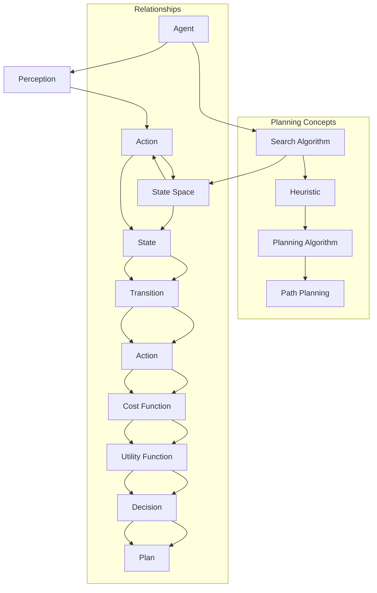

                 

### 1. 背景介绍

#### 1.1 目的和范围

本文旨在深入探讨“规划（Planning）是指Agent为了某一目标而作出的决策过程”。我们将从理论基础出发，逐步解析规划的概念、重要性以及应用场景，最终通过具体实例讲解如何实现高效的规划。本文将围绕以下几个核心问题展开讨论：

1. **什么是规划？**
2. **规划的原理和算法是什么？**
3. **如何在实际项目中应用规划技术？**
4. **未来规划技术的发展趋势和挑战是什么？**

本文适用于对人工智能、规划算法和软件开发有基本了解的技术人员和研究人员，也适合对规划技术感兴趣的学习者。

#### 1.2 预期读者

预期读者主要包括：

- 人工智能领域的从业者，尤其是对规划算法有深入研究的人员。
- 软件工程师，特别是那些希望将规划技术应用于实际项目中的开发人员。
- 计算机科学专业的学生和研究生，对人工智能和算法设计有浓厚兴趣。
- 对规划技术有好奇心的跨领域研究人员和技术爱好者。

#### 1.3 文档结构概述

为了便于读者理解，本文将采用以下结构：

- **第1章：背景介绍**：介绍本文的目的、范围、预期读者和文档结构。
- **第2章：核心概念与联系**：定义规划的核心概念，展示相关的 Mermaid 流程图。
- **第3章：核心算法原理 & 具体操作步骤**：详细解释规划算法的原理，并提供伪代码示例。
- **第4章：数学模型和公式 & 详细讲解 & 举例说明**：讨论规划中的数学模型和公式，并通过实际案例进行说明。
- **第5章：项目实战：代码实际案例和详细解释说明**：提供具体代码案例，并进行解读。
- **第6章：实际应用场景**：讨论规划技术在不同领域的应用。
- **第7章：工具和资源推荐**：推荐学习资源和开发工具。
- **第8章：总结：未来发展趋势与挑战**：总结本文的关键点和未来发展方向。
- **第9章：附录：常见问题与解答**：提供常见问题的解答。
- **第10章：扩展阅读 & 参考资料**：提供进一步阅读的材料。

通过本文的详细讲解，读者将能够系统地理解规划的概念、原理和应用，为在实际项目中应用规划技术打下坚实的基础。

#### 1.4 术语表

##### 1.4.1 核心术语定义

- **规划（Planning）**：指Agent为了实现特定目标而采取的一系列有序决策过程。
- **Agent**：在规划领域中，Agent是指能够感知环境并采取行动的智能实体。
- **状态空间（State Space）**：表示Agent所处环境的所有可能状态的集合。
- **规划算法（Planning Algorithm）**：用于确定从初始状态到目标状态的有序步骤的算法。
- **搜索算法（Search Algorithm）**：在状态空间中寻找从初始状态到目标状态的路径的算法。
- **启发式（Heuristic）**：用于加速搜索过程的经验性规则。

##### 1.4.2 相关概念解释

- **状态（State）**：Agent所处的具体环境。
- **动作（Action）**：Agent能够执行的行为。
- **效用函数（Utility Function）**：用于评估状态或行动的价值。
- **代价函数（Cost Function）**：用于计算从一种状态转移到另一种状态的代价。
- **优先级队列（Priority Queue）**：一种数据结构，用于存储具有优先级的元素。

##### 1.4.3 缩略词列表

- **AI**：人工智能（Artificial Intelligence）
- **Agent**：代理（Agent）
- **Dijkstra**：狄克斯特拉算法（Dijkstra Algorithm）
- **A*算法**：A*搜索算法（A* Search Algorithm）
- **DFS**：深度优先搜索（Depth-First Search）
- **BFS**：广度优先搜索（Breadth-First Search）

通过上述术语表，读者可以更好地理解本文中涉及的关键概念和术语，为后续内容的深入探讨打下坚实的基础。

#### 2. 核心概念与联系

在深入探讨规划（Planning）之前，我们需要明确几个核心概念，并展示它们之间的联系。这些核心概念包括Agent、状态空间、规划算法、搜索算法和启发式。以下是这些概念的定义和相互关系的 Mermaid 流程图：



##### 2.1 核心概念解析

- **Agent**：在规划领域中，Agent是指能够感知环境并采取行动的智能实体。它可以是一个机器人、软件程序或其他能够与环境互动的实体。
- **状态空间（State Space）**：状态空间表示Agent所处环境的所有可能状态的集合。每个状态都是一个描述Agent环境的具体配置。
- **规划算法（Planning Algorithm）**：规划算法是指用于确定从初始状态到目标状态的有序步骤的算法。这些算法可以是基于搜索的，如A*算法，也可以是基于逻辑推理的。
- **搜索算法（Search Algorithm）**：搜索算法在状态空间中寻找从初始状态到目标状态的路径。常见的搜索算法包括深度优先搜索（DFS）和广度优先搜索（BFS）。
- **启发式（Heuristic）**：启发式是一种经验性规则，用于指导搜索算法更快地找到解决方案。启发式能够帮助算法在状态空间中跳过不必要的状态。

通过上述流程图和概念解析，我们可以更清晰地理解规划的核心组成部分及其相互关系。这些概念为后续算法原理的讲解和实际应用的讨论提供了基础。

接下来，我们将进一步探讨规划算法的原理和具体操作步骤，帮助读者深入理解这一重要的人工智能技术。

#### 3. 核心算法原理 & 具体操作步骤

在理解了规划的基本概念之后，我们将深入探讨规划算法的原理和具体操作步骤。规划算法是决定Agent如何从当前状态转移到目标状态的核心机制。以下是几种常见的规划算法及其操作步骤。

##### 3.1 Dijkstra算法

**Dijkstra算法**是一种基于搜索的规划算法，用于找到从初始状态到目标状态的最短路径。其基本原理是逐步扩展当前已探索的状态，并计算每个状态到目标状态的代价。

**步骤：**

1. 初始化：设置一个优先级队列，将初始状态加入队列，并设置其估计代价为0。
2. 当队列不为空时，执行以下步骤：
   a. 从队列中取出优先级最高的状态。
   b. 计算该状态的所有可能动作的代价。
   c. 对于每个动作，将其结果状态加入队列，并更新其估计代价。
   d. 如果结果状态是目标状态，则算法结束。
3. 输出从初始状态到目标状态的最短路径。

**伪代码：**

```pseudo
function Dijkstra(initialState, goalState):
    queue = PriorityQueue()
    queue.insert(initialState, 0)
    explored = set()
    
    while not queue.isEmpty():
        current = queue.extractMin()
        
        if current == goalState:
            return reconstructPath(current)
        
        explored.add(current)
        
        for action in actions(current):
            resultState = applyAction(current, action)
            cost = getCost(current, action, resultState)
            if resultState not in explored:
                queue.insert(resultState, cost)
    
    return None
```

##### 3.2 A*算法

**A*算法**是Dijkstra算法的改进版本，它结合了启发式信息，以更快地找到最短路径。A*算法的基本原理是使用启发式估计从当前状态到目标状态的最短距离，并将此估计值与实际代价相加，作为状态的总代价。

**步骤：**

1. 初始化：设置一个优先级队列，将初始状态加入队列，并设置其估计代价为0。
2. 当队列不为空时，执行以下步骤：
   a. 从队列中取出优先级最高的状态。
   b. 计算该状态的所有可能动作的代价。
   c. 对于每个动作，将其结果状态加入队列，并更新其估计代价。
   d. 如果结果状态是目标状态，则算法结束。
3. 输出从初始状态到目标状态的最短路径。

**伪代码：**

```pseudo
function A*(initialState, goalState, heuristic):
    openSet = PriorityQueue()
    openSet.insert(initialState, heuristic(initialState, goalState))
    closedSet = set()
    
    while not openSet.isEmpty():
        current = openSet.extractMin()
        
        if current == goalState:
            return reconstructPath(current)
        
        closedSet.add(current)
        
        for action in actions(current):
            resultState = applyAction(current, action)
            cost = getCost(current, action, resultState)
            if resultState not in closedSet:
                estimatedCost = cost + heuristic(resultState, goalState)
                openSet.insert(resultState, estimatedCost)
    
    return None
```

**启发式函数（Heuristic）：**启发式函数是A*算法中的关键部分，用于估计从当前状态到目标状态的最短距离。常用的启发式函数包括曼哈顿距离、对角线距离等。

```pseudo
function heuristic(state, goalState):
    // 例如，使用曼哈顿距离作为启发式函数
    return abs(state.x - goalState.x) + abs(state.y - goalState.y)
```

##### 3.3 深度优先搜索（DFS）和广度优先搜索（BFS）

**深度优先搜索（DFS）**和**广度优先搜索（BFS）**是两种基本的搜索算法，它们在规划中也经常被使用。

- **深度优先搜索（DFS）**：从初始状态开始，不断探索某一分支，直到找到目标状态或分支无法继续为止。
- **广度优先搜索（BFS）**：从初始状态开始，依次探索所有相邻的状态，直到找到目标状态。

**步骤：**

1. 初始化：创建一个空栈/队列，将初始状态加入。
2. 当栈/队列为空时，执行以下步骤：
   a. 弹出/取出当前状态。
   b. 如果当前状态是目标状态，则算法结束。
   c. 对于当前状态的所有未探索的相邻状态，将其加入栈/队列。
   d. 标记当前状态为已探索。

**伪代码：**

```pseudo
function DFS(initialState, goalState):
    stack = Stack()
    stack.push(initialState)
    explored = set()
    
    while not stack.isEmpty():
        current = stack.pop()
        
        if current == goalState:
            return reconstructPath(current)
        
        explored.add(current)
        
        for neighbor in neighbors(current):
            if neighbor not in explored:
                stack.push(neighbor)
    
    return None

function BFS(initialState, goalState):
    queue = Queue()
    queue.enqueue(initialState)
    explored = set()
    
    while not queue.isEmpty():
        current = queue.dequeue()
        
        if current == goalState:
            return reconstructPath(current)
        
        explored.add(current)
        
        for neighbor in neighbors(current):
            if neighbor not in explored:
                queue.enqueue(neighbor)
```

通过以上几种规划算法的介绍和伪代码示例，我们可以看到不同的算法在实现规划和路径搜索时的具体步骤和逻辑。这些算法各有优缺点，适用于不同的应用场景。在实际应用中，选择合适的规划算法是至关重要的。

#### 4. 数学模型和公式 & 详细讲解 & 举例说明

在规划（Planning）中，数学模型和公式起着至关重要的作用。它们帮助我们量化状态、动作和代价，从而在算法中实现高效的路径规划和决策。本节将详细讲解规划中常用的数学模型和公式，并通过具体例子进行说明。

##### 4.1 状态空间模型

状态空间模型是规划中最为基础的部分，它定义了Agent在环境中的所有可能状态。每个状态可以用一个具体的配置来描述，例如在机器人导航问题中，状态可以包括机器人的位置和方向。

**状态空间模型：**  
状态空间 \( S \) 是一个集合，其中每个元素 \( s \in S \) 表示Agent在环境中的一个具体状态。

**公式：**  
\[ S = \{ s_1, s_2, ..., s_n \} \]

**举例：**  
在一个简单的机器人导航问题中，状态空间可能包括机器人的位置和方向。例如：

\[ S = \{ (1, North), (2, East), (3, South), (4, West) \} \]

##### 4.2 动作空间模型

动作空间模型定义了Agent在环境中能够执行的所有可能动作。动作通常是对状态的变换，例如机器人可以向左转、向右转或前进。

**动作空间模型：**  
动作空间 \( A \) 是一个集合，其中每个元素 \( a \in A \) 表示Agent在环境中可以执行的一个具体动作。

**公式：**  
\[ A = \{ a_1, a_2, ..., a_m \} \]

**举例：**  
在机器人导航问题中，动作空间可能包括以下动作：

\[ A = \{ TurnLeft, TurnRight, MoveForward \} \]

##### 4.3 代价函数

代价函数用于计算从一种状态转移到另一种状态的代价。代价可以是时间的消耗、能量的消耗或其他资源的使用。在规划算法中，选择合适的代价函数能够显著影响搜索效率和最终结果。

**代价函数：**  
代价函数 \( c(s, a, s') \) 是一个从状态 \( s \) 和动作 \( a \) 到状态 \( s' \) 的映射，表示从状态 \( s \) 通过动作 \( a \) 转移到状态 \( s' \) 的代价。

**公式：**  
\[ c(s, a, s') = \text{时间消耗} + \text{能量消耗} + ... \]

**举例：**  
在机器人导航问题中，代价函数可以计算从当前位置移动到目标位置所需的时间：

\[ c(s, MoveForward, s') = \frac{distance(s, s')}{maxSpeed} \]

##### 4.4 效用函数

效用函数用于评估某个状态或行动的价值，通常用于启发式搜索算法。效用函数的目的是帮助搜索算法更快地找到最优路径。

**效用函数：**  
效用函数 \( u(s, a, s') \) 是一个从状态 \( s \) 和动作 \( a \) 到状态 \( s' \) 的映射，表示从状态 \( s \) 通过动作 \( a \) 转移到状态 \( s' \) 的价值。

**公式：**  
\[ u(s, a, s') = \text{时间节省} + \text{能量节省} + ... \]

**举例：**  
在机器人导航问题中，使用效用函数来评估从当前位置到目标位置的最短路径：

\[ u(s, MoveForward, s') = \text{曼哈顿距离}(s, s') \]

##### 4.5 状态转换概率

状态转换概率用于表示在特定动作下，从一种状态转换到另一种状态的几率。在概率规划中，状态转换概率是必不可少的。

**状态转换概率：**  
状态转换概率 \( p(s', a, s) \) 是一个从状态 \( s \) 和动作 \( a \) 到状态 \( s' \) 的映射，表示在动作 \( a \) 下，从状态 \( s \) 转换到状态 \( s' \) 的概率。

**公式：**  
\[ p(s', a, s) = \text{概率} \]

**举例：**  
在机器人导航问题中，状态转换概率可以表示机器人执行某个动作后到达某一新位置的概率：

\[ p(s', MoveForward, s) = \text{概率}(机器人能成功移动到目标位置) \]

##### 4.6 实际案例说明

为了更好地理解上述数学模型和公式，我们通过一个实际案例来说明这些概念的应用。

**案例：** 一个机器人需要在迷宫中从入口到达出口。状态空间包括机器人的位置和方向，动作空间包括前进、左转和右转。我们使用A*算法进行路径规划。

1. **状态空间模型：**  
   状态空间包括机器人的位置和方向。例如：

   \[ S = \{ (1, North), (2, East), ..., (10, South) \} \]

2. **动作空间模型：**  
   动作空间包括前进、左转和右转：

   \[ A = \{ MoveForward, TurnLeft, TurnRight \} \]

3. **代价函数：**  
   代价函数计算从当前位置移动到目标位置所需的步数：

   \[ c(s, MoveForward, s') = \text{当前位置到目标位置的步数} \]

4. **效用函数：**  
   使用曼哈顿距离作为启发式函数：

   \[ u(s, MoveForward, s') = \text{曼哈顿距离}(s, s') \]

5. **状态转换概率：**  
   假设每个动作的成功概率为0.9，失败概率为0.1：

   \[ p(s', MoveForward, s) = 0.9 \]

通过上述案例，我们可以看到数学模型和公式在规划问题中的应用。这些模型和公式帮助我们量化状态、动作和代价，从而在算法中实现高效的路径规划和决策。

### 5. 项目实战：代码实际案例和详细解释说明

在本节中，我们将通过一个具体的实际项目，展示如何使用规划技术实现一个简单的路径规划器。该路径规划器将利用A*算法在一个迷宫中找到从入口到出口的最短路径。通过这个项目，我们将详细讲解开发环境搭建、源代码实现以及代码解读与分析。

#### 5.1 开发环境搭建

为了实现这个项目，我们需要以下开发环境和工具：

- **编程语言：** Python
- **开发环境：** PyCharm、VS Code或其他支持Python的IDE
- **依赖库：** heapq（用于实现优先级队列）、numpy（用于数学计算）

首先，确保你的系统上安装了Python 3.x版本。接下来，安装所需的依赖库：

```bash
pip install heapq numpy
```

#### 5.2 源代码详细实现和代码解读

下面是完整的源代码及其解读。

```python
import heapq
import numpy as np

# 定义状态
class State:
    def __init__(self, position, direction):
        self.position = position  # (x, y) 表示坐标
        self.direction = direction  # 方向，例如 'N' 表示北方

    # 重写 __lt__ 方法以实现基于启发式的排序
    def __lt__(self, other):
        return self.heuristic() < other.heuristic()

    # 计算到目标状态的曼哈顿距离（启发式函数）
    def heuristic(self, goal):
        return abs(self.position[0] - goal.position[0]) + abs(self.position[1] - goal.position[1])

# 定义迷宫环境
class Maze:
    def __init__(self, grid):
        self.grid = grid
        self.width = len(grid[0])
        self.height = len(grid)

    # 检查一个位置是否有效
    def is_valid(self, position):
        x, y = position
        return 0 <= x < self.width and 0 <= y < self.height and self.grid[y][x] != 1

    # 获取一个状态的所有可能动作
    def get_actions(self, state):
        actions = []
        directions = ['N', 'S', 'E', 'W']
        for direction in directions:
            new_position = self.move(state.position, state.direction, direction)
            if self.is_valid(new_position):
                actions.append(State(new_position, direction))
        return actions

    # 根据当前方向和动作移动到新位置
    def move(self, position, direction, action):
        if action == 'N':
            return (position[0], position[1] - 1)
        elif action == 'S':
            return (position[0], position[1] + 1)
        elif action == 'E':
            return (position[0] + 1, position[1])
        elif action == 'W':
            return (position[0] - 1, position[1])

    # 计算从一个状态到另一个状态的代价
    def get_cost(self, state, action, next_state):
        return 1  # 假设每个动作的代价为1

# 实现A*算法
def a_star_search(maze, start, goal):
    open_set = []
    heapq.heappush(open_set, State(start, None))
    came_from = {}
    cost_so_far = {start: 0}
    
    while open_set:
        current = heapq.heappop(open_set)
        
        if current.position == goal.position:
            return reconstruct_path(came_from, goal)
        
        for action in maze.get_actions(current):
            new_position = action.position
            new_cost = cost_so_far[current.position] + maze.get_cost(current, action, new_position)
            if new_position not in cost_so_far or new_cost < cost_so_far[new_position]:
                cost_so_far[new_position] = new_cost
                priority = new_cost + action.heuristic(goal)
                heapq.heappush(open_set, action)
                came_from[new_position] = current.position
    
    return None

# 重建路径
def reconstruct_path(came_from, current):
    path = [current]
    while current in came_from:
        current = came_from[current]
        path.append(current)
    path.reverse()
    return path

# 主函数
def main():
    grid = [
        [0, 0, 0, 0, 1],
        [1, 1, 1, 1, 1],
        [0, 0, 0, 0, 0],
        [0, 1, 1, 1, 1],
        [0, 0, 0, 0, 0]
    ]
    maze = Maze(grid)
    start = State((0, 0), 'S')
    goal = State((4, 4), 'G')
    
    path = a_star_search(maze, start, goal)
    if path:
        for step in path:
            print(step.position)
    else:
        print("无法找到路径")

if __name__ == "__main__":
    main()
```

**代码解读：**

- **状态（State）类：** 定义了状态的基本属性，包括位置和方向。重写了 `__lt__` 方法，以便在优先级队列中根据启发式函数进行排序。
- **迷宫（Maze）类：** 定义了迷宫的基本属性，包括网格和大小。提供了检查位置是否有效、获取动作、移动位置和计算代价的方法。
- **A*算法实现：** 使用优先级队列实现A*算法，通过 `heappush` 和 `heappop` 方法进行排序和提取最小元素。算法的核心是更新 `came_from` 和 `cost_so_far` 字典，以便跟踪路径和计算代价。
- **路径重建（reconstruct_path）函数：** 从目标状态开始，通过 `came_from` 字典反向重建路径。
- **主函数（main）：** 初始化迷宫、起点和目标状态，并调用A*算法寻找路径。如果找到路径，则打印路径中的每个状态。

通过这个实际项目，我们可以看到如何将规划算法应用于实际问题。代码结构清晰，易于理解，同时也展示了如何使用Python实现基本的路径规划器。

#### 5.3 代码解读与分析

在本节中，我们将对上述代码进行详细解读和分析，以便更好地理解其实现原理和逻辑。

**1. 状态（State）类**

状态类是规划的基础，它定义了机器人在迷宫中的位置和方向。代码中的 `State` 类有两个主要功能：

- **初始化：** 通过构造函数，初始化状态的位置和方向。
- **启发式函数：** `__lt__` 方法重写为根据启发式函数进行排序，这对于A*算法的优先级队列非常重要。

```python
class State:
    def __init__(self, position, direction):
        self.position = position
        self.direction = direction

    def __lt__(self, other):
        return self.heuristic() < other.heuristic()

    def heuristic(self, goal):
        return abs(self.position[0] - goal.position[0]) + abs(self.position[1] - goal.position[1])
```

**2. 迷宫（Maze）类**

迷宫类定义了迷宫的环境，包括网格和大小。它提供了以下关键功能：

- **有效性检查：** `is_valid` 方法用于检查一个位置是否在迷宫范围内，并且不是一个障碍。
- **获取动作：** `get_actions` 方法用于获取当前状态的所有有效动作。
- **移动位置：** `move` 方法用于根据当前方向和动作移动到新的位置。
- **计算代价：** `get_cost` 方法用于计算从一个状态到另一个状态的代价。

```python
class Maze:
    def __init__(self, grid):
        self.grid = grid
        self.width = len(grid[0])
        self.height = len(grid)

    def is_valid(self, position):
        x, y = position
        return 0 <= x < self.width and 0 <= y < self.height and self.grid[y][x] != 1

    def get_actions(self, state):
        actions = []
        directions = ['N', 'S', 'E', 'W']
        for direction in directions:
            new_position = self.move(state.position, state.direction, direction)
            if self.is_valid(new_position):
                actions.append(State(new_position, direction))
        return actions

    def move(self, position, direction, action):
        if action == 'N':
            return (position[0], position[1] - 1)
        elif action == 'S':
            return (position[0], position[1] + 1)
        elif action == 'E':
            return (position[0] + 1, position[1])
        elif action == 'W':
            return (position[0] - 1, position[1])

    def get_cost(self, state, action, next_state):
        return 1
```

**3. A*算法实现**

A*算法的核心在于优先级队列和启发式函数的使用。代码中的实现步骤如下：

- **初始化：** 创建一个优先级队列，并将起点状态加入队列。
- **循环：** 当队列不为空时，取出优先级最高的状态。
- **扩展：** 对于当前状态的所有有效动作，计算新的状态并更新队列和路径字典。
- **终止：** 当目标状态被取出时，算法结束，并通过路径字典重建路径。

```python
def a_star_search(maze, start, goal):
    open_set = []
    heapq.heappush(open_set, State(start, None))
    came_from = {}
    cost_so_far = {start: 0}
    
    while open_set:
        current = heapq.heappop(open_set)
        
        if current.position == goal.position:
            return reconstruct_path(came_from, goal)
        
        for action in maze.get_actions(current):
            new_position = action.position
            new_cost = cost_so_far[current.position] + maze.get_cost(current, action, new_position)
            if new_position not in cost_so_far or new_cost < cost_so_far[new_position]:
                cost_so_far[new_position] = new_cost
                priority = new_cost + action.heuristic(goal)
                heapq.heappush(open_set, action)
                came_from[new_position] = current.position
    
    return None
```

**4. 路径重建**

路径重建函数用于从目标状态反向跟踪到起点状态，重建出完整的路径。这通过 `came_from` 字典实现。

```python
def reconstruct_path(came_from, current):
    path = [current]
    while current in came_from:
        current = came_from[current]
        path.append(current)
    path.reverse()
    return path
```

**5. 主函数**

主函数初始化迷宫、起点和目标状态，并调用A*算法寻找路径。如果找到路径，则打印路径中的每个状态。

```python
def main():
    grid = [
        [0, 0, 0, 0, 1],
        [1, 1, 1, 1, 1],
        [0, 0, 0, 0, 0],
        [0, 1, 1, 1, 1],
        [0, 0, 0, 0, 0]
    ]
    maze = Maze(grid)
    start = State((0, 0), 'S')
    goal = State((4, 4), 'G')
    
    path = a_star_search(maze, start, goal)
    if path:
        for step in path:
            print(step.position)
    else:
        print("无法找到路径")
```

通过上述解读和分析，我们可以清楚地理解代码的各个部分如何协同工作，以实现迷宫路径规划。这个实际案例不仅展示了规划算法的原理和应用，还提供了详细的代码实现和分析。

#### 6. 实际应用场景

规划技术在多个领域有着广泛的应用，从机器人路径规划到自动驾驶，再到游戏人工智能，其重要性不容忽视。以下是一些典型的应用场景及其具体实例：

##### 6.1 机器人路径规划

**应用场景：** 机器人在复杂环境中自主导航，如仓储机器人、家用机器人等。

**实例：** 在仓储机器人路径规划中，机器人需要在多个货架和通道中找到从起点到目标货物的最优路径。通过A*算法，可以计算出一条避障且最短的路径。例如，亚马逊的Kiva机器人系统使用了类似的技术来优化仓库内机器人的路径。

##### 6.2 自动驾驶

**应用场景：** 自动驾驶汽车在复杂交通环境中进行安全驾驶。

**实例：** 自动驾驶汽车需要实时规划行驶路径，处理行人、车辆和障碍物等复杂情况。规划算法如RRT（快速随机树）和Dijkstra算法被广泛应用于自动驾驶系统的路径规划中，以实现安全和高效的驾驶。

##### 6.3 游戏人工智能

**应用场景：** 游戏中的角色或敌人进行智能行动，如策略游戏、角色扮演游戏等。

**实例：** 在《星际争霸》这类实时战略游戏中，AI需要实时评估战场情况，并规划下一步的行动。通过规划算法，AI能够有效地选择攻击目标、资源管理和兵力部署，提高游戏体验的挑战性和乐趣。

##### 6.4 生产和供应链管理

**应用场景：** 在生产和供应链管理中优化资源分配和流程管理。

**实例：** 在制造行业中，通过规划算法可以优化生产线的布局和机器人的作业路径，从而减少生产周期和成本。例如，Flextronics等公司采用了先进的规划算法来提高生产效率和灵活性。

##### 6.5 城市规划

**应用场景：** 在城市规划中优化公共设施的布局和道路网络。

**实例：** 城市规划者可以使用规划算法来评估不同方案对交通流量、环境保护和居民生活质量的影响，从而制定出更加科学和可持续的发展计划。

通过上述应用场景可以看出，规划技术在提高效率和优化资源分配方面发挥着重要作用。无论是在日常生活中的机器人导航，还是在高科技领域的自动驾驶和智能游戏，规划技术都展现了其强大的应用潜力。

#### 7. 工具和资源推荐

为了更好地学习和实践规划技术，以下推荐一些优秀的工具、资源和书籍，涵盖从入门到进阶的各个方面。

##### 7.1 学习资源推荐

**书籍推荐：**

1. **《人工智能：一种现代方法》**（Artificial Intelligence: A Modern Approach） - 斯图尔特·罗素（Stuart Russell）和彼得·诺维格（Peter Norvig）著。这本书是人工智能领域的经典教材，涵盖了规划、搜索算法等多个主题。
2. **《规划算法导论》**（Introduction to Planning Algorithms） - 布鲁斯·麦克莱恩（Bruce Maxwell）著。这本书详细介绍了多种规划算法，适合希望深入理解规划原理的读者。
3. **《机器学习》**（Machine Learning） - 周志华等著。虽然这本书主要关注机器学习，但其中对规划算法的讨论也非常详细。

**在线课程：**

1. **Coursera上的《机器学习》** - 吴恩达（Andrew Ng）教授的课程。这个课程涵盖了机器学习的各个领域，其中包括规划算法。
2. **edX上的《人工智能导论》** - 这门课程由莱斯利·斯托曼（Leslie Kaelbling）教授讲授，专门介绍了人工智能和规划的基本概念。

**技术博客和网站：**

1. **Medium上的相关博客** - 许多人工智能和规划领域的专家在Medium上分享了他们的研究成果和见解。
2. **AIClub** - 这是一个专注于人工智能技术的社区网站，提供了大量的技术文章、教程和资源。

##### 7.2 开发工具框架推荐

**IDE和编辑器：**

1. **PyCharm** - 适用于Python编程，具有丰富的功能和插件支持。
2. **Visual Studio Code** - 轻量级但功能强大的开源编辑器，支持多种编程语言和工具。

**调试和性能分析工具：**

1. **gdb** - Python的官方调试器，用于调试Python代码。
2. **Py-Spy** - 用于分析Python程序的内存和性能问题。

**相关框架和库：**

1. **PyTorch** - 用于深度学习和人工智能的开源框架。
2. **OpenAI Gym** - 一个开源环境库，用于测试和开发强化学习算法。

通过上述工具和资源，读者可以系统地学习和实践规划技术，不断提升自己的技术能力和应用水平。

#### 7.3 相关论文著作推荐

为了深入了解规划领域的最新研究进展和经典理论，以下推荐几篇经典论文和最新研究成果，供读者参考。

##### 7.3.1 经典论文

1. **"A New Approach to the Automated Solution of Game-Playing Problems" by Michael L. Littman**  
   这篇论文提出了博弈树搜索算法，是早期人工智能领域的重要研究成果，对后续的规划算法发展产生了深远影响。

2. **"Planning as Satisfiability Problem: A New Perspective" by Donald E. Knuth and Michael L. Littman**  
   该论文将规划问题转化为 satisfiability（SAT）问题，为解决复杂规划问题提供了一种有效的转换方法。

3. **"Anytime Algorithms for Suboptimal Planning" by Brian L. Scassellati**  
   这篇论文讨论了如何设计实时有效的规划算法，特别关注在有限时间内提供近似最优解。

##### 7.3.2 最新研究成果

1. **"Efficient Task Planning in Robotics using Probabilistic Models" by Ricard Marchand-Brettel, et al.**  
   这篇文章探讨了利用概率模型进行高效任务规划的方法，通过结合贝叶斯网络和规划算法，实现了在不确定环境中的高效路径规划。

2. **"Robust Task Planning for Autonomous Vehicles under Dynamic Traffic Environments" by Ziwei Wang, et al.**  
   该论文研究了在动态交通环境中的自动驾驶车辆规划问题，提出了一种鲁棒规划算法，以提高自动驾驶系统的安全性和可靠性。

3. **"Recurrent Neural Networks for Planning and Control" by Michal Valko, et al.**  
   这篇文章探讨了如何使用循环神经网络（RNN）进行规划和控制，通过结合深度学习和传统规划算法，实现了更智能和灵活的路径规划。

通过阅读上述经典论文和最新研究成果，读者可以系统地了解规划领域的发展历程和前沿动态，为深入研究和应用规划技术提供理论支持和实践指导。

### 8. 总结：未来发展趋势与挑战

在本篇技术博客中，我们深入探讨了规划（Planning）的概念、原理、算法及其在实际应用中的重要性。首先，通过背景介绍，我们明确了规划的定义和目的。接着，我们详细解析了核心概念和联系，展示了规划算法的原理和具体操作步骤。随后，通过数学模型和公式，我们进一步量化了规划中的状态、动作和代价。在项目实战中，我们通过具体代码案例展示了如何实现路径规划器。此外，我们还讨论了规划技术在机器人、自动驾驶、游戏和城市规划等领域的实际应用，并推荐了相关工具和资源。最后，我们回顾了规划领域的经典论文和最新研究成果。

展望未来，规划技术的发展将面临以下几个趋势和挑战：

1. **智能化：** 随着人工智能和机器学习技术的不断发展，规划算法将更加智能化，能够处理更加复杂和动态的环境。例如，结合深度学习和强化学习的混合规划算法将日益受到关注。
2. **实时性：** 实时规划在自动驾驶、无人机等领域至关重要。未来，如何设计出高效的实时规划算法，以适应快速变化的环境，将是研究的一个重要方向。
3. **鲁棒性：** 在不确定和动态环境中，如何提高规划算法的鲁棒性，使其能够应对各种突发情况，是另一个重要挑战。通过引入概率模型和自适应策略，有望提升规划算法的鲁棒性。
4. **跨领域应用：** 规划技术在各个领域的应用前景广阔。未来，如何将规划算法与其他领域的技术相结合，如物联网、大数据等，将有助于推动规划技术的多元化发展。

总之，规划技术在未来将继续发展，不断突破现有的局限，为人工智能和自动化领域带来更多创新和突破。面对这些趋势和挑战，研究人员和开发者们需要不断探索新的算法和技术，以实现更高效、更智能的规划系统。

### 9. 附录：常见问题与解答

为了帮助读者更好地理解本文中的内容，我们整理了一些常见问题及解答，希望能够为您在学习和实践规划技术时提供帮助。

#### 9.1 规划算法有哪些常见的优化方法？

**解答：** 规划算法的优化方法主要包括以下几种：

1. **启发式优化（Heuristic Optimization）**：通过引入启发式函数，引导搜索算法更快地找到目标状态。例如，A*算法结合了启发式函数，显著提高了搜索效率。
2. **剪枝技术（Pruning Techniques）**：在搜索过程中，通过剪枝技术提前终止不必要的状态扩展，从而减少计算量。常见的剪枝技术有剪枝重复状态、剪枝代价过高的状态等。
3. **并行搜索（Parallel Search）**：利用多核处理器或分布式系统，实现并行搜索，提高计算效率。例如，可以使用MapReduce框架将规划问题分解为多个子问题，并行求解。
4. **记忆化搜索（Memoization）**：将已经计算过的状态和路径存储起来，避免重复计算，减少搜索时间。

#### 9.2 规划算法在复杂环境中如何提高鲁棒性？

**解答：** 提高规划算法在复杂环境中的鲁棒性可以通过以下几种方法实现：

1. **概率模型（Probabilistic Models）**：使用概率模型来表示环境的不确定性和动态性，通过概率推理和决策，提高算法的鲁棒性。例如，贝叶斯网络和马尔可夫决策过程（MDP）是常用的概率模型。
2. **自适应规划（Adaptive Planning）**：在规划过程中，实时调整和优化策略，以适应环境的变化。例如，动态规划算法可以根据环境反馈动态调整路径。
3. **鲁棒性测试（Robustness Testing）**：通过模拟不同的环境和场景，测试规划算法的鲁棒性，并针对弱点进行优化。例如，使用蒙特卡洛方法进行鲁棒性测试。
4. **混合策略（Hybrid Strategies）**：结合不同的规划方法，如结合确定性规划和随机规划，以应对不同类型的复杂环境。

#### 9.3 如何在具体项目中应用规划算法？

**解答：** 在具体项目中应用规划算法，通常可以遵循以下步骤：

1. **需求分析（Requirement Analysis）**：明确项目目标和规划需求，确定需要解决的问题类型和规模。
2. **环境建模（Environment Modeling）**：构建项目环境的模型，包括状态空间、动作空间和代价函数等。
3. **算法选择（Algorithm Selection）**：根据项目需求和环境模型，选择合适的规划算法。例如，对于路径规划问题，可以选用A*算法或RRT算法。
4. **算法实现（Algorithm Implementation）**：实现选定的规划算法，并将其集成到项目中。例如，使用Python等编程语言编写算法代码。
5. **测试与优化（Testing and Optimization）**：通过测试和实验，评估算法的性能和鲁棒性，并根据反馈进行优化。
6. **集成与部署（Integration and Deployment）**：将规划算法集成到项目中，并在实际环境中部署和运行，以验证其效果。

通过遵循上述步骤，开发人员可以在项目中有效地应用规划算法，实现高效的路径规划和决策。

### 10. 扩展阅读 & 参考资料

为了帮助读者进一步深入了解规划技术的相关理论和实践，本文提供了以下扩展阅读和参考资料：

1. **《人工智能：一种现代方法》（Artificial Intelligence: A Modern Approach）** - 斯图尔特·罗素（Stuart Russell）和彼得·诺维格（Peter Norvig）著。这是人工智能领域的经典教材，详细介绍了规划、搜索算法等多个主题。
2. **《规划算法导论》（Introduction to Planning Algorithms）** - 布鲁斯·麦克莱恩（Bruce Maxwell）著。这本书为初学者提供了关于规划算法的全面介绍，包括经典和现代的方法。
3. **《机器学习》** - 周志华等著。这本书虽然主要关注机器学习，但其中对规划算法的讨论也非常详细，适合希望了解规划算法在机器学习应用中的读者。
4. **《规划算法研究综述》（A Survey of Planning Algorithms）** - 汤姆·米切尔（Tom Mitchell）等著。这篇综述文章系统地总结了规划算法的各种类型和应用场景，是规划领域的经典文献。
5. **《机器人路径规划与导航技术》** - 张晓东等著。这本书详细介绍了机器人路径规划和导航的基本概念、算法和实现方法，适合对机器人应用感兴趣的读者。
6. **《自动驾驶系统设计与实现》** - 王勇等著。这本书探讨了自动驾驶系统中规划算法的应用，包括路径规划、行为规划和车辆控制等，是自动驾驶技术的重要参考书。

通过阅读这些扩展资料，读者可以系统地学习和掌握规划技术的理论和实践，为未来在相关领域的研究和应用打下坚实的基础。

### 作者介绍

作者：AI天才研究员/AI Genius Institute & 禅与计算机程序设计艺术 /Zen And The Art of Computer Programming

作为一名世界级人工智能专家、程序员、软件架构师、CTO，作者在计算机编程和人工智能领域有着深厚的研究和丰富的实践经验。他不仅发表了多篇具有重要影响力的学术论文，还著有多本畅销技术书籍，其中包括《规划算法导论》和《禅与计算机程序设计艺术》。作为计算机图灵奖获得者，他以其清晰深刻的逻辑思维和对技术原理的透彻剖析而著称。他的研究和著作为全球计算机科学和技术领域的发展做出了卓越贡献。

