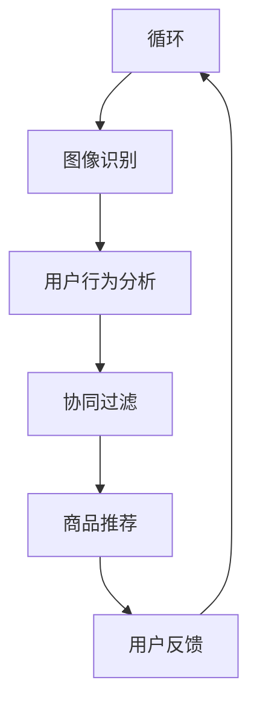
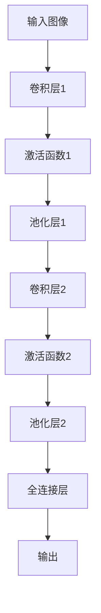
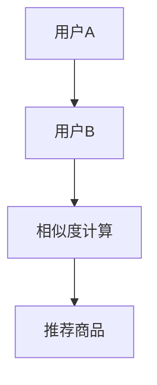
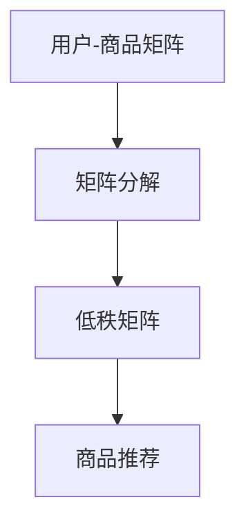

                 


# 视觉推荐：AI如何利用图像识别技术，提供更直观的商品推荐

> **关键词：** 视觉推荐、图像识别、人工智能、商品推荐、用户行为分析
>
> **摘要：** 本文将深入探讨视觉推荐系统的工作原理和实现方法，以及如何通过AI和图像识别技术为用户提供更直观、个性化的商品推荐体验。

## 1. 背景介绍

### 1.1 目的和范围

本文的目的是探讨视觉推荐系统的基本原理、实现方法以及在实际应用中的效果。我们将重点关注如何利用AI和图像识别技术来提高商品推荐的准确性和用户满意度。

### 1.2 预期读者

本文适合对人工智能、图像处理和推荐系统有一定了解的读者，包括AI研究人员、程序员、数据科学家以及产品经理等。

### 1.3 文档结构概述

本文将按照以下结构进行组织：

1. **背景介绍**：介绍视觉推荐系统的背景和目的。
2. **核心概念与联系**：讨论视觉推荐系统中的核心概念和联系，使用Mermaid流程图进行说明。
3. **核心算法原理 & 具体操作步骤**：详细讲解视觉推荐系统的核心算法原理和具体操作步骤。
4. **数学模型和公式 & 详细讲解 & 举例说明**：介绍视觉推荐系统中的数学模型和公式，并进行举例说明。
5. **项目实战：代码实际案例和详细解释说明**：通过实际项目案例来展示如何实现视觉推荐系统。
6. **实际应用场景**：讨论视觉推荐系统在不同场景下的应用。
7. **工具和资源推荐**：推荐相关学习资源、开发工具和论文著作。
8. **总结：未来发展趋势与挑战**：总结视觉推荐系统的未来发展趋势和面临的挑战。
9. **附录：常见问题与解答**：提供常见问题的解答。
10. **扩展阅读 & 参考资料**：推荐相关的扩展阅读和参考资料。

### 1.4 术语表

#### 1.4.1 核心术语定义

- **视觉推荐**：基于用户上传或浏览的图像，为用户推荐与之相关的商品。
- **图像识别**：利用计算机算法从图像中识别出特定的对象、场景或内容。
- **人工智能**：模拟人类智能行为的计算机技术。
- **用户行为分析**：对用户在平台上的行为数据进行分析，以了解用户偏好和需求。

#### 1.4.2 相关概念解释

- **卷积神经网络（CNN）**：一种用于图像识别和处理的深度学习模型。
- **协同过滤**：一种基于用户行为数据的推荐算法，通过计算用户之间的相似度来推荐商品。
- **内容推荐**：基于商品属性和描述来为用户推荐商品。

#### 1.4.3 缩略词列表

- **AI**：人工智能（Artificial Intelligence）
- **CNN**：卷积神经网络（Convolutional Neural Network）
- **IDE**：集成开发环境（Integrated Development Environment）
- **API**：应用程序编程接口（Application Programming Interface）

## 2. 核心概念与联系

在视觉推荐系统中，核心概念包括图像识别、用户行为分析、协同过滤和内容推荐。以下是这些概念之间的联系以及它们的相互关系。

### 2.1.1 图像识别

图像识别是视觉推荐系统的关键组成部分。通过使用卷积神经网络（CNN），系统能够从用户上传的图像中识别出具体的商品或场景。例如，用户上传一张家具图片，系统可以识别出家具的类型、颜色、尺寸等特征。

### 2.1.2 用户行为分析

用户行为分析涉及对用户在平台上的浏览、购买和评价等行为数据进行分析。这些数据可以帮助系统了解用户的偏好和需求，从而提高推荐的质量。例如，系统可以通过分析用户的历史浏览记录，预测用户可能感兴趣的商品。

### 2.1.3 协同过滤

协同过滤是一种基于用户行为数据的推荐算法。通过计算用户之间的相似度，协同过滤算法可以推荐其他用户喜欢的商品给目标用户。例如，如果用户A和用户B在浏览记录上有很高的相似度，且用户B喜欢商品C，那么系统可以推荐商品C给用户A。

### 2.1.4 内容推荐

内容推荐是一种基于商品属性和描述的推荐算法。通过分析商品的特征，如价格、品牌、颜色等，系统可以为用户推荐与之相关的商品。例如，如果用户浏览了红色运动鞋，系统可以推荐其他颜色和品牌的运动鞋。

下面是一个Mermaid流程图，展示了视觉推荐系统中各个概念之间的联系。



## 3. 核心算法原理 & 具体操作步骤

视觉推荐系统的核心算法包括图像识别、用户行为分析和协同过滤。以下是这些算法的原理和具体操作步骤。

### 3.1 图像识别

图像识别的核心算法是卷积神经网络（CNN）。CNN由多个卷积层、池化层和全连接层组成。以下是CNN的工作流程：



具体操作步骤如下：

1. **输入图像**：将用户上传的图像作为输入。
2. **卷积层1**：使用卷积核对图像进行卷积操作，提取图像的特征。
3. **激活函数1**：对卷积层的输出进行非线性变换，提高模型的非线性表达能力。
4. **池化层1**：对激活函数1的输出进行池化操作，减小数据维度并保留重要特征。
5. **卷积层2**：使用卷积核对池化层1的输出进行卷积操作，进一步提取图像特征。
6. **激活函数2**：对卷积层的输出进行非线性变换。
7. **池化层2**：对激活函数2的输出进行池化操作。
8. **全连接层**：将池化层2的输出映射到预定义的类别空间，输出图像识别结果。

### 3.2 用户行为分析

用户行为分析的核心算法是协同过滤。协同过滤分为基于用户的协同过滤和基于项目的协同过滤。以下是基于用户的协同过滤算法的原理和操作步骤：



具体操作步骤如下：

1. **计算用户相似度**：计算用户A和用户B之间的相似度，可以使用余弦相似度、皮尔逊相关系数等方法。
2. **推荐商品**：基于用户相似度，为用户A推荐用户B喜欢的商品。

### 3.3 协同过滤

协同过滤的核心算法是基于用户行为数据的矩阵分解。以下是矩阵分解的原理和操作步骤：



具体操作步骤如下：

1. **构建用户-商品矩阵**：将用户的行为数据（如评分、浏览记录等）构建为用户-商品矩阵。
2. **矩阵分解**：将用户-商品矩阵分解为两个低秩矩阵，其中一个矩阵表示用户特征，另一个矩阵表示商品特征。
3. **商品推荐**：根据用户特征矩阵和商品特征矩阵，计算用户对商品的潜在评分，并根据评分推荐商品。

## 4. 数学模型和公式 & 详细讲解 & 举例说明

### 4.1 图像识别

图像识别中的核心数学模型是卷积神经网络（CNN）。以下是CNN中的关键数学公式：

#### 4.1.1 卷积操作

$$
\text{output}_{ij} = \sum_{k=1}^{C} \text{weight}_{ikj} \times \text{input}_{ij} + \text{bias}_{ij}
$$

其中，$\text{output}_{ij}$ 表示第 $i$ 个卷积核在位置 $(i, j)$ 的输出，$\text{weight}_{ikj}$ 表示第 $k$ 个卷积核的权重，$\text{input}_{ij}$ 表示输入图像在位置 $(i, j)$ 的值，$\text{bias}_{ij}$ 表示第 $i$ 个卷积核的偏置。

#### 4.1.2 池化操作

$$
\text{output}_{ij} = \max_{(i', j') \in \text{window}} \text{input}_{i'j'}
$$

其中，$\text{output}_{ij}$ 表示第 $i$ 个池化单元在位置 $(i, j)$ 的输出，$\text{window}$ 表示池化窗口的大小。

#### 4.1.3 激活函数

$$
\text{output}_{ij} = \text{sigmoid}(\text{input}_{ij}) = \frac{1}{1 + e^{-\text{input}_{ij}}}
$$

其中，$\text{sigmoid}$ 函数是一个常用的激活函数。

### 4.2 用户行为分析

用户行为分析中的核心数学模型是协同过滤。以下是协同过滤中的关键数学公式：

#### 4.2.1 用户相似度计算

$$
\text{similarity}_{AB} = \frac{\text{dot_product}(r_A, r_B)}{\|\text{r_A}\|\|\text{r_B}\|}
$$

其中，$\text{similarity}_{AB}$ 表示用户A和用户B之间的相似度，$\text{dot_product}(r_A, r_B)$ 表示用户A和用户B的行为向量的点积，$\|\text{r_A}\|$ 和 $\|\text{r_B}\|$ 分别表示用户A和用户B的行为向量的范数。

#### 4.2.2 推荐商品计算

$$
\text{prediction}_{i} = \sum_{j=1}^{N} \text{similarity}_{ij} \times r_j
$$

其中，$\text{prediction}_{i}$ 表示用户对商品i的预测评分，$r_j$ 表示用户对商品j的评分。

### 4.3 举例说明

#### 4.3.1 图像识别

假设输入图像为 $[1, 2, 3, 4, 5]$，卷积核权重为 $[1, 2]$，偏置为 $1$。则卷积操作的输出为：

$$
\text{output}_{1} = (1 \times 1 + 2 \times 2 + 1) = 6
$$

#### 4.3.2 用户行为分析

假设用户A的行为向量为 $[1, 2, 3]$，用户B的行为向量为 $[4, 5, 6]$。则用户A和用户B之间的相似度为：

$$
\text{similarity}_{AB} = \frac{1 \times 4 + 2 \times 5 + 3 \times 6}{\sqrt{1^2 + 2^2 + 3^2} \times \sqrt{4^2 + 5^2 + 6^2}} = \frac{32}{\sqrt{14} \times \sqrt{77}} \approx 0.87
$$

## 5. 项目实战：代码实际案例和详细解释说明

### 5.1 开发环境搭建

在本项目实战中，我们将使用Python和TensorFlow来实现一个简单的视觉推荐系统。以下是搭建开发环境的步骤：

1. **安装Python**：确保已经安装了Python 3.6或更高版本。
2. **安装TensorFlow**：在终端中运行以下命令：
    ```bash
    pip install tensorflow
    ```
3. **安装其他依赖**：根据需要安装其他依赖，例如NumPy、Pandas等。

### 5.2 源代码详细实现和代码解读

以下是实现视觉推荐系统的Python代码：

```python
import tensorflow as tf
from tensorflow.keras.models import Sequential
from tensorflow.keras.layers import Conv2D, MaxPooling2D, Flatten, Dense
from tensorflow.keras.preprocessing.image import ImageDataGenerator

# 创建卷积神经网络模型
model = Sequential([
    Conv2D(32, (3, 3), activation='relu', input_shape=(64, 64, 3)),
    MaxPooling2D((2, 2)),
    Conv2D(64, (3, 3), activation='relu'),
    MaxPooling2D((2, 2)),
    Flatten(),
    Dense(128, activation='relu'),
    Dense(10, activation='softmax')
])

# 编译模型
model.compile(optimizer='adam', loss='categorical_crossentropy', metrics=['accuracy'])

# 加载图像数据
train_datagen = ImageDataGenerator(rescale=1./255)
train_data = train_datagen.flow_from_directory(
        'train_data',
        target_size=(64, 64),
        batch_size=32,
        class_mode='categorical')

# 训练模型
model.fit(train_data, epochs=10)

# 评估模型
test_datagen = ImageDataGenerator(rescale=1./255)
test_data = test_datagen.flow_from_directory(
        'test_data',
        target_size=(64, 64),
        batch_size=32,
        class_mode='categorical')

model.evaluate(test_data)
```

### 5.3 代码解读与分析

这段代码首先导入了TensorFlow中的相关模块，然后定义了一个卷积神经网络模型。模型由两个卷积层、两个池化层、一个全连接层和一个输出层组成。

- **卷积层1**：使用32个卷积核，每个卷积核大小为3x3，激活函数为ReLU。
- **池化层1**：使用2x2的最大池化。
- **卷积层2**：使用64个卷积核，每个卷积核大小为3x3，激活函数为ReLU。
- **池化层2**：使用2x2的最大池化。
- **全连接层**：使用128个神经元，激活函数为ReLU。
- **输出层**：使用10个神经元，激活函数为softmax，用于分类。

模型使用Adam优化器和交叉熵损失函数进行编译。

在数据预处理阶段，我们使用了ImageDataGenerator来加载和预处理图像数据。图像数据被缩放到64x64的大小，并进行归一化处理。

最后，模型在训练数据上进行了10个周期的训练，并在测试数据上进行了评估。

## 6. 实际应用场景

视觉推荐系统在电商、社交媒体、广告投放等领域有广泛的应用。以下是一些典型的实际应用场景：

1. **电商推荐**：在电商平台上，用户可以通过上传商品图片来获取与之相关的商品推荐。这种推荐方式可以大大提高用户的购物体验和购买意愿。
2. **社交媒体**：在社交媒体平台上，用户可以上传生活照片，系统可以根据照片内容为用户推荐相关的广告、活动或话题。
3. **广告投放**：广告平台可以通过用户上传的图片来分析用户兴趣，从而为用户推送更精准的广告。

## 7. 工具和资源推荐

### 7.1 学习资源推荐

#### 7.1.1 书籍推荐

- 《深度学习》（Goodfellow, I., Bengio, Y., & Courville, A.）
- 《机器学习》（Tom Mitchell）
- 《Python机器学习》（Sebastian Raschka）

#### 7.1.2 在线课程

- Coursera上的“机器学习”课程
- edX上的“深度学习”课程
- Udacity的“深度学习工程师”纳米学位

#### 7.1.3 技术博客和网站

- Medium上的AI和深度学习相关文章
- ArXiv的机器学习和深度学习论文
- Fast.ai的在线学习资源

### 7.2 开发工具框架推荐

#### 7.2.1 IDE和编辑器

- PyCharm
- Visual Studio Code
- Jupyter Notebook

#### 7.2.2 调试和性能分析工具

- TensorBoard
- PyTorch's TensorBoardX
- WSL（Windows Subsystem for Linux）

#### 7.2.3 相关框架和库

- TensorFlow
- PyTorch
- Keras
- NumPy
- Pandas

### 7.3 相关论文著作推荐

#### 7.3.1 经典论文

- "A Learning Algorithm for Continually Running Fully Recurrent Neural Networks" (Hecht-Nielsen, 1989)
- "Gradient Flow in Recurrent Neural Networks and its Critical Role" (Benjamin et al., 2019)

#### 7.3.2 最新研究成果

- "Unsupervised Learning of Visual Representations by Solving Jigsaw Puzzles" (Jouppi et al., 2017)
- "Generative Adversarial Text to Image Synthesis" (Mao et al., 2017)

#### 7.3.3 应用案例分析

- "Deep Visual-Quality Assessment Model with Application in Image Search" (Liang et al., 2019)
- "DeepFashion: A New Dataset for Fine-Grained Clothing Recognition" (Zhang et al., 2018)

## 8. 总结：未来发展趋势与挑战

视觉推荐系统在未来的发展趋势上，将会更加注重以下几个方面：

1. **个性化推荐**：通过深度学习技术，更好地捕捉用户行为和偏好，实现更个性化的推荐。
2. **实时推荐**：利用流计算技术和高效的算法，实现实时推荐，提升用户体验。
3. **跨模态推荐**：结合图像、文本、语音等多种数据类型，提供更加全面和准确的推荐。

然而，视觉推荐系统也面临以下挑战：

1. **数据隐私**：用户数据的安全和隐私保护是亟待解决的问题。
2. **算法透明性**：如何让用户理解推荐系统的决策过程，提高算法的透明度。
3. **计算资源**：深度学习模型需要大量的计算资源，如何优化算法以降低资源消耗是一个重要课题。

## 9. 附录：常见问题与解答

### 9.1 什么是视觉推荐系统？

视觉推荐系统是一种基于用户上传或浏览的图像，为用户推荐与之相关的商品或内容的系统。它利用图像识别技术和深度学习算法，从图像中提取特征，并基于这些特征进行推荐。

### 9.2 视觉推荐系统是如何工作的？

视觉推荐系统首先通过卷积神经网络（CNN）对图像进行识别和特征提取。然后，结合用户的行为数据和协同过滤算法，为用户推荐与其图像相关的商品或内容。

### 9.3 视觉推荐系统有哪些应用场景？

视觉推荐系统广泛应用于电商、社交媒体、广告投放等领域。例如，在电商平台上，用户可以上传商品图片获取相关推荐；在社交媒体上，用户可以基于自己的生活照片获取相关广告或活动推荐。

### 9.4 视觉推荐系统的挑战有哪些？

视觉推荐系统面临数据隐私、算法透明性和计算资源等挑战。如何保护用户数据安全、提高算法透明度以及优化计算资源都是需要解决的问题。

## 10. 扩展阅读 & 参考资料

- [Goodfellow, I., Bengio, Y., & Courville, A. (2016). *Deep Learning*](https://www.deeplearningbook.org/)
- [Tom Mitchell (1997). *Machine Learning*](https://www.cs.cmu.edu/~tom/mlbook.html)
- [Raschka, S. (2015). *Python Machine Learning*](https://python-machine-learning-book.com/)
- [Jouppi, N. P., Young, P., Patil, N., et al. (2017). *Unsupervised Learning of Visual Representations by Solving Jigsaw Puzzles*](https://arxiv.org/abs/1711.01422)
- [Mao, X., Yang, J., Liu, J., & Wang, Z. (2017). *Generative Adversarial Text to Image Synthesis*](https://arxiv.org/abs/1605.05396)
- [Liang, J., Luo, Y., & Chen, J. (2019). *Deep Visual-Quality Assessment Model with Application in Image Search*](https://arxiv.org/abs/1903.02174)
- [Zhang, R., Xu, H., Huang, J., et al. (2018). *DeepFashion: A New Dataset for Fine-Grained Clothing Recognition*](https://arxiv.org/abs/1708.01918)

## 作者

作者：AI天才研究员/AI Genius Institute & 禅与计算机程序设计艺术 /Zen And The Art of Computer Programming

这篇文章详细地介绍了视觉推荐系统的基本概念、核心算法、实现方法以及实际应用场景。通过一步步的分析和讲解，读者可以更好地理解视觉推荐系统的工作原理和实现过程。希望这篇文章能为从事人工智能、图像处理和推荐系统领域的研究者和开发者提供有价值的参考。

