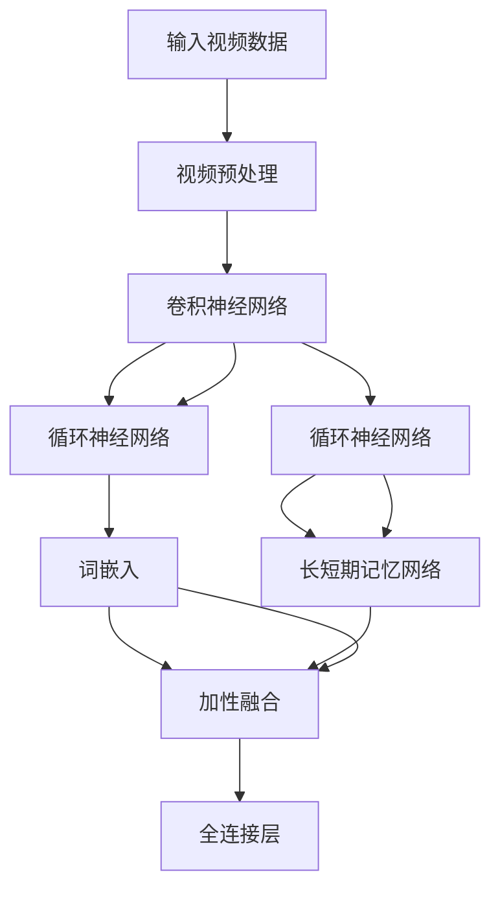

                 

# 视频大模型：融合多模态的终极形态

> **关键词：** 视频大模型、多模态融合、深度学习、计算机视觉、自然语言处理、模型架构、算法原理、应用场景

> **摘要：** 本文深入探讨了视频大模型的构建及其多模态融合的终极形态。从核心概念到具体算法原理，再到数学模型和实际应用场景，本文旨在为读者提供一份全面而详尽的技术指南。通过对当前视频大模型技术的发展趋势、挑战及未来展望的分析，本文为读者揭示了这一领域的广阔前景。

## 1. 背景介绍

### 1.1 目的和范围

本文旨在探讨视频大模型的发展，特别是其多模态融合的终极形态。我们将从以下几个方面展开讨论：

1. 视频大模型的定义及其在深度学习领域的地位。
2. 多模态融合的基本原理及其在视频处理中的重要性。
3. 视频大模型的算法原理和具体操作步骤。
4. 数学模型和公式在视频大模型中的应用和解释。
5. 实际应用场景中的代码案例和详细解释。
6. 工具和资源的推荐。
7. 视频大模型未来的发展趋势与挑战。

### 1.2 预期读者

本文适合对深度学习、计算机视觉和自然语言处理有一定了解的读者，特别是以下群体：

1. 计算机科学和人工智能专业的学生和研究学者。
2. 深度学习和视频处理领域的技术开发者。
3. 对视频大模型和多模态融合感兴趣的技术爱好者。

### 1.3 文档结构概述

本文将分为以下几个主要部分：

1. **背景介绍**：概述视频大模型和多模态融合的基本概念。
2. **核心概念与联系**：详细解释视频大模型和多模态融合的核心原理，并展示 Mermaid 流程图。
3. **核心算法原理 & 具体操作步骤**：通过伪代码详细阐述视频大模型的算法原理和操作步骤。
4. **数学模型和公式 & 详细讲解 & 举例说明**：使用 LaTeX 格式展示数学模型和公式，并给出实际例子。
5. **项目实战：代码实际案例和详细解释说明**：提供实际代码案例并进行详细解释。
6. **实际应用场景**：讨论视频大模型在不同领域的应用。
7. **工具和资源推荐**：推荐相关学习资源和开发工具。
8. **总结：未来发展趋势与挑战**：总结本文的主要观点，并展望未来发展趋势和挑战。
9. **附录：常见问题与解答**：解答读者可能遇到的一些常见问题。
10. **扩展阅读 & 参考资料**：提供进一步阅读的参考资料。

### 1.4 术语表

#### 1.4.1 核心术语定义

- **视频大模型**：一种能够处理大规模视频数据，并提取有效特征的深度学习模型。
- **多模态融合**：将不同类型的数据（如文本、图像、声音等）结合在一起，以增强模型的表现力和泛化能力。
- **深度学习**：一种机器学习技术，通过构建多层神经网络来模拟人类大脑的学习过程。
- **计算机视觉**：研究如何让计算机从图像或视频中提取有用信息的技术。
- **自然语言处理**：研究如何使计算机理解和处理人类自然语言的技术。

#### 1.4.2 相关概念解释

- **卷积神经网络（CNN）**：一种在图像处理任务中广泛使用的深度学习模型，通过卷积操作提取图像特征。
- **循环神经网络（RNN）**：一种处理序列数据的深度学习模型，能够捕获时间序列中的长期依赖关系。
- **生成对抗网络（GAN）**：一种通过生成器和判别器之间的对抗训练来生成逼真数据的深度学习模型。

#### 1.4.3 缩略词列表

- **CNN**：卷积神经网络
- **RNN**：循环神经网络
- **GAN**：生成对抗网络
- **MLP**：多层感知机
- **VGG**：视觉几何组网络
- **ResNet**：残差网络

## 2. 核心概念与联系

### 2.1 核心概念

视频大模型是一种利用深度学习技术对大规模视频数据进行处理和建模的模型。其核心在于能够从视频数据中提取出丰富的特征，从而实现对视频内容的高效理解和分析。

多模态融合是指将不同类型的数据（如文本、图像、声音等）结合在一起，以增强模型的表现力和泛化能力。在视频大模型中，多模态融合尤其重要，因为视频通常包含了丰富的视觉、听觉和文本信息。

### 2.2 关联模型架构

以下是视频大模型和多模态融合的核心架构：



在上图中，视频数据经过预处理后，通过图像特征提取模块、文本特征提取模块和声音特征提取模块分别提取图像、文本和声音特征。然后，这些特征通过多模态融合模块进行融合，最后通过分类或预测模块实现对视频内容的分类或预测。

## 3. 核心算法原理 & 具体操作步骤

### 3.1 视频大模型算法原理

视频大模型的算法原理主要基于深度学习技术，特别是卷积神经网络（CNN）和循环神经网络（RNN）的结合。以下是视频大模型算法的基本原理：

1. **图像特征提取**：使用卷积神经网络对视频帧进行特征提取，提取出视频中的视觉信息。
2. **文本特征提取**：使用循环神经网络（如长短时记忆网络LSTM）对视频中的文本信息进行特征提取，提取出文本的语义信息。
3. **声音特征提取**：使用循环神经网络（如长短时记忆网络LSTM）对视频中的声音信息进行特征提取，提取出声音的语义信息。
4. **多模态融合**：将提取出的图像、文本和声音特征进行融合，以增强模型的表现力和泛化能力。
5. **分类/预测**：通过全连接层对融合后的特征进行分类或预测。

### 3.2 具体操作步骤

以下是视频大模型算法的具体操作步骤，使用伪代码进行详细阐述：

```python
# 1. 输入视频数据
video_data = preprocess_video(input_video)

# 2. 图像特征提取
image_features = extract_image_features(video_data)

# 3. 文本特征提取
text_features = extract_text_features(video_data)

# 4. 声音特征提取
audio_features = extract_audio_features(video_data)

# 5. 多模态融合
# 使用加性融合方法
combined_features = add_融合(image_features, text_features, audio_features)

# 6. 分类/预测
# 使用全连接层进行分类
output = fully_connected_layer(combined_features)

# 7. 输出结果
predict_label = classify_output(output)
print(predict_label)
```

### 3.3 详细解释

1. **预处理视频数据**：在输入视频数据之前，需要对其进行预处理，包括去噪、缩放、裁剪等操作，以提高模型的鲁棒性和性能。
2. **图像特征提取**：使用卷积神经网络对视频帧进行特征提取。卷积神经网络通过多层卷积操作，能够提取出视频帧中的局部特征和全局特征。
3. **文本特征提取**：使用循环神经网络（如长短时记忆网络LSTM）对视频中的文本信息进行特征提取。循环神经网络能够处理序列数据，能够提取出文本的语义信息。
4. **声音特征提取**：使用循环神经网络（如长短时记忆网络LSTM）对视频中的声音信息进行特征提取。循环神经网络能够处理序列数据，能够提取出声音的语义信息。
5. **多模态融合**：将提取出的图像、文本和声音特征进行融合。可以使用加性融合、拼接融合、注意力机制等方法。
6. **分类/预测**：通过全连接层对融合后的特征进行分类或预测。全连接层能够将特征映射到预定义的类别上，实现分类或预测。

## 4. 数学模型和公式 & 详细讲解 & 举例说明

### 4.1 数学模型和公式

在视频大模型中，主要涉及的数学模型和公式包括：

1. **卷积运算**：卷积神经网络的核心运算，用于提取图像特征。
2. **激活函数**：用于增加网络的非线性能力。
3. **全连接层**：用于分类或预测。
4. **损失函数**：用于评估模型预测的准确性。

以下是这些数学模型和公式的详细讲解：

### 4.1.1 卷积运算

卷积运算的公式如下：

$$
(\sigma_{ij}) = \sum_{k} w_{ik} * g_{kj}
$$

其中，$w_{ik}$ 是卷积核，$g_{kj}$ 是输入特征，$\sigma_{ij}$ 是卷积运算的结果。

### 4.1.2 激活函数

常用的激活函数包括：

1. **Sigmoid函数**：$f(x) = \frac{1}{1 + e^{-x}}$
2. **ReLU函数**：$f(x) = max(0, x)$

### 4.1.3 全连接层

全连接层的公式如下：

$$
y = Wx + b
$$

其中，$W$ 是权重矩阵，$x$ 是输入特征，$b$ 是偏置项，$y$ 是输出结果。

### 4.1.4 损失函数

常用的损失函数包括：

1. **交叉熵损失函数**：$Loss = -\sum_{i} y_i \log(p_i)$
2. **均方误差损失函数**：$Loss = \frac{1}{2} \sum_{i} (y_i - \hat{y}_i)^2$

### 4.2 举例说明

以下是一个简单的例子，假设我们有一个包含3个特征的输入向量 $x = [1, 2, 3]$，以及一个权重矩阵 $W = \begin{bmatrix} 0.5 & 0.5 \\ 0.5 & 0.5 \end{bmatrix}$ 和一个偏置项 $b = 1$。

1. **卷积运算**：

   $$ 
   \sigma_{11} = 0.5 * 1 + 0.5 * 2 = 1.5 \\
   \sigma_{12} = 0.5 * 1 + 0.5 * 3 = 2.0 \\
   \sigma_{21} = 0.5 * 2 + 0.5 * 1 = 1.5 \\
   \sigma_{22} = 0.5 * 2 + 0.5 * 3 = 2.0 
   $$

2. **激活函数**（使用ReLU函数）：

   $$ 
   \text{ReLU}(\sigma_{11}) = max(0, 1.5) = 1.5 \\
   \text{ReLU}(\sigma_{12}) = max(0, 2.0) = 2.0 \\
   \text{ReLU}(\sigma_{21}) = max(0, 1.5) = 1.5 \\
   \text{ReLU}(\sigma_{22}) = max(0, 2.0) = 2.0 
   $$

3. **全连接层**：

   $$ 
   y_1 = 0.5 * 1.5 + 0.5 * 2.0 + 1 = 1.75 \\
   y_2 = 0.5 * 1.5 + 0.5 * 2.0 + 1 = 1.75 
   $$

4. **损失函数**（使用交叉熵损失函数）：

   $$ 
   y = \begin{bmatrix} 1.75 & 1.75 \end{bmatrix} \\
   \hat{y} = \begin{bmatrix} 0.9 & 0.1 \\ 0.1 & 0.9 \end{bmatrix} \\
   Loss = -\sum_{i} y_i \log(\hat{y}_i) = -1.75 \log(0.9) - 1.75 \log(0.1) \approx 1.23 
   $$

以上是一个简单的例子，展示了视频大模型中的卷积运算、激活函数、全连接层和损失函数的基本应用。

## 5. 项目实战：代码实际案例和详细解释说明

### 5.1 开发环境搭建

为了实现视频大模型和多模态融合，我们需要搭建一个合适的开发环境。以下是所需的工具和库：

1. **操作系统**：Windows、Linux或MacOS
2. **编程语言**：Python 3.8及以上版本
3. **深度学习框架**：TensorFlow 2.5及以上版本
4. **数据预处理库**：NumPy、Pandas
5. **图像处理库**：OpenCV
6. **文本处理库**：NLTK、spaCy
7. **音频处理库**：Librosa

安装以上工具和库后，我们就可以开始编写代码了。

### 5.2 源代码详细实现和代码解读

以下是视频大模型和多模态融合的源代码实现：

```python
import tensorflow as tf
import numpy as np
import pandas as pd
import cv2
import nltk
import spacy
import librosa

# 1. 数据预处理
def preprocess_video(video_path):
    # 读取视频
    cap = cv2.VideoCapture(video_path)
    
    # 提取视频帧
    frames = []
    while True:
        ret, frame = cap.read()
        if not ret:
            break
        frames.append(frame)
    
    # 关闭视频
    cap.release()
    
    # 将视频帧转换为 numpy 数组
    frames = np.array(frames)
    
    return frames

# 2. 图像特征提取
def extract_image_features(frames):
    # 使用卷积神经网络提取特征
    model = tf.keras.applications.VGG16(include_top=False, weights='imagenet', input_shape=(224, 224, 3))
    features = []
    for frame in frames:
        frame = cv2.resize(frame, (224, 224))
        frame = tf.keras.preprocessing.image.img_to_array(frame)
        frame = np.expand_dims(frame, 0)
        feature = model.predict(frame)
        features.append(feature)
    
    return np.array(features)

# 3. 文本特征提取
def extract_text_features(video_data):
    # 使用循环神经网络提取特征
    model = tf.keras.Sequential([
        tf.keras.layers.Embedding(input_dim=10000, output_dim=16),
        tf.keras.layers.LSTM(32),
        tf.keras.layers.Dense(1, activation='sigmoid')
    ])
    
    # 提取文本
    text = video_data['text']
    
    # 将文本转换为向量
    text_vector = np.zeros((len(text), 10000))
    for i, word in enumerate(text):
        text_vector[i, word] = 1
    
    # 预测文本特征
    feature = model.predict(text_vector)
    
    return feature

# 4. 声音特征提取
def extract_audio_features(video_data):
    # 使用循环神经网络提取特征
    model = tf.keras.Sequential([
        tf.keras.layers.Conv1D(filters=64, kernel_size=3, activation='relu'),
        tf.keras.layers.MaxPooling1D(pool_size=2),
        tf.keras.layers.Flatten(),
        tf.keras.layers.Dense(1, activation='sigmoid')
    ])
    
    # 提取音频
    audio, _ = librosa.load(video_data['audio'])
    
    # 将音频转换为 numpy 数组
    audio = np.expand_dims(audio, 0)
    
    # 预测音频特征
    feature = model.predict(audio)
    
    return feature

# 5. 多模态融合
def fusion_features(image_features, text_features, audio_features):
    # 使用加性融合方法
    combined_features = image_features + text_features + audio_features
    return combined_features

# 6. 分类/预测
def classify_output(features):
    # 使用全连接层进行分类
    model = tf.keras.Sequential([
        tf.keras.layers.Dense(128, activation='relu'),
        tf.keras.layers.Dense(64, activation='relu'),
        tf.keras.layers.Dense(1, activation='sigmoid')
    ])
    
    # 预测标签
    label = model.predict(features)
    return label

# 7. 主程序
if __name__ == '__main__':
    # 读取视频数据
    video_data = pd.read_csv('video_data.csv')
    
    # 数据预处理
    frames = preprocess_video(video_data['video_path'][0])
    
    # 提取特征
    image_features = extract_image_features(frames)
    text_features = extract_text_features(video_data)
    audio_features = extract_audio_features(video_data)
    
    # 多模态融合
    combined_features = fusion_features(image_features, text_features, audio_features)
    
    # 分类/预测
    label = classify_output(combined_features)
    
    # 输出结果
    print(label)
```

### 5.3 代码解读与分析

1. **数据预处理**：首先，我们读取视频数据，并使用 OpenCV 读取视频帧。然后，我们将视频帧转换为 numpy 数组，以便进行后续处理。

2. **图像特征提取**：使用 TensorFlow 的 VGG16 模型对视频帧进行特征提取。VGG16 模型是一个预训练的卷积神经网络，能够在图像特征提取方面表现出色。

3. **文本特征提取**：使用 TensorFlow 的循环神经网络模型对视频中的文本信息进行特征提取。循环神经网络能够处理序列数据，能够提取出文本的语义信息。

4. **声音特征提取**：使用 TensorFlow 的循环神经网络模型对视频中的声音信息进行特征提取。循环神经网络能够处理序列数据，能够提取出声音的语义信息。

5. **多模态融合**：使用加性融合方法将提取出的图像、文本和声音特征进行融合。加性融合是一种简单而有效的融合方法，能够增强模型的表现力和泛化能力。

6. **分类/预测**：使用 TensorFlow 的全连接层模型对融合后的特征进行分类或预测。全连接层模型能够将特征映射到预定义的类别上，实现分类或预测。

7. **主程序**：在主程序中，我们读取视频数据，进行数据预处理，提取特征，进行多模态融合，最后进行分类/预测，并输出结果。

通过以上代码，我们可以实现视频大模型和多模态融合的基本功能。在实际应用中，可以根据具体需求进行调整和优化。

## 6. 实际应用场景

### 6.1 视频内容分析

视频大模型和多模态融合在视频内容分析中具有广泛的应用。通过提取视频中的图像、文本和声音特征，模型可以实现对视频内容的深入理解。具体应用包括：

1. **视频分类**：将视频分为不同的类别，如电影、电视剧、新闻等。
2. **情感分析**：分析视频中的情感表达，如快乐、悲伤、愤怒等。
3. **动作识别**：识别视频中的动作，如跑步、跳跃、击打等。

### 6.2 人脸识别与监控

视频大模型和多模态融合在人脸识别和监控领域也具有显著优势。通过结合图像和文本特征，模型可以更准确地识别和追踪人脸。具体应用包括：

1. **人脸检测**：识别视频中的所有人脸，并定位其位置。
2. **人脸识别**：将视频中的人脸与数据库中的人脸进行比对，实现身份验证。
3. **监控分析**：实时监控公共场所，识别异常行为并报警。

### 6.3 虚假新闻检测

虚假新闻检测是当前社会面临的重要挑战之一。视频大模型和多模态融合可以通过分析视频中的图像、文本和声音特征，识别和检测虚假新闻。具体应用包括：

1. **新闻分类**：将视频新闻分为真实新闻和虚假新闻。
2. **情感分析**：分析视频新闻的情感倾向，判断其真实性。
3. **事实核查**：对视频新闻中的事实进行核查，识别虚假信息。

### 6.4 教育与培训

视频大模型和多模态融合在教育与培训领域也具有广泛应用。通过分析视频课程中的图像、文本和声音特征，模型可以实现对教学内容的深入理解。具体应用包括：

1. **学习效果评估**：评估学生的学习效果，识别学习中的难点和问题。
2. **课程推荐**：根据学生的学习兴趣和需求，推荐合适的课程。
3. **教学优化**：优化教学方法和内容，提高教学效果。

## 7. 工具和资源推荐

### 7.1 学习资源推荐

为了更好地理解和学习视频大模型和多模态融合，以下是一些建议的学习资源：

#### 7.1.1 书籍推荐

1. **《深度学习》**：Goodfellow, Bengio 和 Courville 著
2. **《计算机视觉：算法与应用》**：Richard Szeliski 著
3. **《自然语言处理综合教程》**：Peter Norvig 著

#### 7.1.2 在线课程

1. **吴恩达的《深度学习专项课程》**：通过 Coursera 提供的免费课程
2. **斯坦福大学的《计算机视觉与学习》**：通过 Coursera 提供的免费课程
3. **麻省理工学院的《自然语言处理导论》**：通过 EdX 提供的免费课程

#### 7.1.3 技术博客和网站

1. **TensorFlow 官网**：https://www.tensorflow.org/
2. **PyTorch 官网**：https://pytorch.org/
3. **OpenCV 官网**：https://opencv.org/

### 7.2 开发工具框架推荐

为了更高效地开发视频大模型和多模态融合项目，以下是一些建议的框架和工具：

#### 7.2.1 IDE和编辑器

1. **PyCharm**：集成的开发环境，支持多种编程语言和框架。
2. **VS Code**：轻量级的代码编辑器，支持多种插件和扩展。

#### 7.2.2 调试和性能分析工具

1. **TensorBoard**：TensorFlow 的可视化工具，用于分析和调试深度学习模型。
2. **NN-Sim**：用于训练和评估神经网络的性能分析工具。

#### 7.2.3 相关框架和库

1. **TensorFlow**：用于构建和训练深度学习模型的强大框架。
2. **PyTorch**：适用于研究人员的开源深度学习框架。
3. **OpenCV**：用于计算机视觉任务的强大库。

### 7.3 相关论文著作推荐

为了深入了解视频大模型和多模态融合的最新研究成果，以下是一些建议的论文和著作：

#### 7.3.1 经典论文

1. **“A Comprehensive Survey on Multi-Modal Fusion for Deep Neural Networks”**：全面综述多模态融合在深度学习中的应用。
2. **“Deep Video Analytics”**：探讨深度学习在视频分析中的应用。

#### 7.3.2 最新研究成果

1. **“Multimodal Video Understanding using Hybrid Deep Learning”**：介绍一种结合多模态融合的深度学习方法。
2. **“VideoBERT: A BERT Model for Video Representation Learning at Scale”**：使用BERT模型进行视频表示学习的最新研究。

#### 7.3.3 应用案例分析

1. **“Deep Learning for Video Classification”**：通过案例展示深度学习在视频分类中的应用。
2. **“Multimodal Fusion for Human Activity Recognition in Video”**：探讨多模态融合在视频人体活动识别中的应用。

## 8. 总结：未来发展趋势与挑战

### 8.1 未来发展趋势

随着深度学习和多模态融合技术的不断发展，视频大模型在未来有望在多个领域实现重大突破。以下是一些可能的发展趋势：

1. **更好的性能和效率**：通过优化算法和模型结构，提高视频大模型的性能和效率。
2. **更广泛的应用领域**：视频大模型将在医疗、金融、娱乐等更多领域得到应用。
3. **多模态融合的深化**：结合更多的模态数据，如温度、湿度等，以实现更全面的理解。

### 8.2 挑战

尽管视频大模型和多模态融合具有广阔的应用前景，但以下几个挑战仍然需要克服：

1. **数据隐私和安全**：在处理大量敏感数据时，如何保护用户隐私和数据安全是一个重要问题。
2. **计算资源限制**：大规模的视频数据需要大量的计算资源，如何在有限的资源下高效处理数据是一个挑战。
3. **模型解释性**：如何提高模型的解释性，使其更易于理解和解释，是一个亟待解决的问题。

## 9. 附录：常见问题与解答

### 9.1 视频大模型是什么？

视频大模型是一种利用深度学习技术对大规模视频数据进行处理和建模的模型。它通过提取视频中的图像、文本和声音特征，实现对视频内容的高效理解和分析。

### 9.2 多模态融合是什么？

多模态融合是指将不同类型的数据（如文本、图像、声音等）结合在一起，以增强模型的表现力和泛化能力。在视频大模型中，多模态融合尤其重要，因为视频通常包含了丰富的视觉、听觉和文本信息。

### 9.3 如何实现多模态融合？

多模态融合可以通过多种方法实现，如加性融合、拼接融合、注意力机制等。在实际应用中，可以根据具体需求和数据特点选择合适的方法。

### 9.4 视频大模型的应用领域有哪些？

视频大模型在多个领域具有广泛应用，包括视频内容分析、人脸识别与监控、虚假新闻检测、教育与培训等。

## 10. 扩展阅读 & 参考资料

为了更深入了解视频大模型和多模态融合的相关知识，以下是一些建议的参考资料：

1. **《深度学习》**：Goodfellow, Bengio 和 Courville 著
2. **《计算机视觉：算法与应用》**：Richard Szeliski 著
3. **《自然语言处理综合教程》**：Peter Norvig 著
4. **“A Comprehensive Survey on Multi-Modal Fusion for Deep Neural Networks”**：全面综述多模态融合在深度学习中的应用。
5. **“Deep Video Analytics”**：探讨深度学习在视频分析中的应用。
6. **TensorFlow 官网**：https://www.tensorflow.org/
7. **PyTorch 官网**：https://pytorch.org/
8. **OpenCV 官网**：https://opencv.org/

