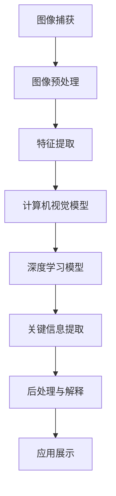

                 

# 视频数据的关键信息捕捉技术

> **关键词：视频数据分析、关键信息捕捉、图像处理、计算机视觉、深度学习、实时处理**
>
> **摘要：本文将深入探讨视频数据中关键信息的捕捉技术，包括图像处理、计算机视觉和深度学习等技术，并通过具体实例展示如何实现视频数据的有效分析与关键信息的提取。文章旨在为从事视频数据处理的技术人员提供全面的指导，帮助他们理解并掌握视频数据关键信息捕捉的核心原理和实际应用。**

## 1. 背景介绍

### 1.1 目的和范围

视频数据在现代社会中扮演着越来越重要的角色，无论是在娱乐、安防、医疗还是工业自动化等领域。然而，视频数据的高维度和海量特性使得对其中的关键信息进行有效捕捉成为一项极具挑战的任务。本文旨在介绍视频数据关键信息捕捉技术，分析其在各个应用领域的重要性，并提供一种系统的方法来理解和实现这些技术。

本文将首先回顾视频数据中关键信息捕捉的背景和现状，然后介绍相关的核心概念和算法，最后通过实际案例展示这些技术的应用。

### 1.2 预期读者

本文预期读者为从事视频数据分析、计算机视觉和深度学习领域的研究人员和工程师。读者应该具备基本的图像处理和编程知识，以便更好地理解文章中的技术细节和实际应用。

### 1.3 文档结构概述

本文分为以下几个主要部分：

1. 背景介绍：介绍视频数据关键信息捕捉的背景、目的和预期读者。
2. 核心概念与联系：介绍视频数据关键信息捕捉的相关核心概念，并给出相应的流程图。
3. 核心算法原理 & 具体操作步骤：详细阐述关键信息捕捉的核心算法原理，并提供伪代码示例。
4. 数学模型和公式 & 详细讲解 & 举例说明：介绍关键信息捕捉过程中涉及的数学模型和公式，并给出具体实例。
5. 项目实战：代码实际案例和详细解释说明，展示如何在实际项目中应用关键信息捕捉技术。
6. 实际应用场景：分析关键信息捕捉技术在各个实际应用场景中的具体应用。
7. 工具和资源推荐：推荐学习资源、开发工具和框架。
8. 总结：未来发展趋势与挑战。
9. 附录：常见问题与解答。
10. 扩展阅读 & 参考资料：提供进一步的阅读材料。

### 1.4 术语表

#### 1.4.1 核心术语定义

- **视频数据**：指通过摄像设备捕捉并记录的连续图像序列。
- **关键信息**：指视频数据中对于特定应用具有重要意义的部分，如目标识别、行为分析等。
- **图像处理**：指使用数学和计算方法对图像进行增强、滤波、分割等操作。
- **计算机视觉**：指使计算机能够像人类一样感知和理解图像的学科。
- **深度学习**：一种基于多层神经网络进行学习和推理的人工智能技术。

#### 1.4.2 相关概念解释

- **帧率**：指视频每秒捕捉的图像帧数。
- **分辨率**：指视频图像的垂直和水平像素数目。
- **特征提取**：指从图像中提取出能够代表图像内容的特征。

#### 1.4.3 缩略词列表

- **CV**：计算机视觉
- **DSP**：数字信号处理
- **DL**：深度学习
- **GPU**：图形处理单元
- **CNN**：卷积神经网络

## 2. 核心概念与联系

在视频数据的关键信息捕捉中，核心概念包括图像处理、计算机视觉和深度学习。以下是这些核心概念及其相互关系的Mermaid流程图：



### 2.1 图像捕获

图像捕获是视频数据捕捉的第一步，它通过摄像设备将场景转化为数字图像。图像捕获的质量直接影响后续处理的精度和效率。关键因素包括帧率和分辨率。

### 2.2 图像预处理

图像预处理包括去噪、对比度增强、几何校正等步骤，旨在提高图像的质量，使其更适合后续的特征提取和计算机视觉处理。

### 2.3 特征提取

特征提取是从图像中提取出能够代表图像内容的特征，如边缘、角点、纹理等。这些特征有助于区分不同的图像内容，为后续的计算机视觉模型提供输入。

### 2.4 计算机视觉模型

计算机视觉模型是一种通过学习大量图像数据来识别和理解图像内容的技术。常见的计算机视觉模型包括基于传统算法的模型和基于深度学习的模型。

### 2.5 深度学习模型

深度学习模型是一种基于多层神经网络进行学习和推理的人工智能技术。深度学习模型通过大量的图像数据训练，能够自动提取出高级特征，并用于目标识别、场景分类等任务。

### 2.6 关键信息提取

关键信息提取是从处理后的图像数据中识别并提取出对特定应用具有重要意义的部分，如人脸识别、目标跟踪、行为分析等。

### 2.7 后处理与解释

后处理与解释是对提取的关键信息进行进一步的加工和分析，以便更好地理解和解释视频数据。例如，将识别出的目标进行轨迹分析、行为预测等。

### 2.8 应用展示

应用展示部分将展示关键信息捕捉技术在实际应用中的效果和实际案例，如智能监控系统、自动驾驶车辆、医疗影像分析等。

## 3. 核心算法原理 & 具体操作步骤

### 3.1 图像预处理

图像预处理的核心任务是提高图像的质量，以便更好地进行特征提取和后续处理。以下是图像预处理的具体步骤：

#### 3.1.1 去噪

去噪是图像预处理的重要步骤，可以有效消除图像中的噪声，提高图像的清晰度。常用的去噪算法包括：

- **均值滤波**：
  ```plaintext
  function mean_filter(image, kernel_size):
      output = zeros_like(image)
      for i in range(kernel_size // 2):
          for j in range(kernel_size // 2):
              patch = image[i:i+kernel_size, j:j+kernel_size]
              output[i, j] = mean(patch)
      return output
  ```

- **中值滤波**：
  ```plaintext
  function median_filter(image, kernel_size):
      output = zeros_like(image)
      for i in range(image.shape[0] - kernel_size + 1):
          for j in range(image.shape[1] - kernel_size + 1):
              patch = image[i:i+kernel_size, j:j+kernel_size]
              output[i, j] = median(patch)
      return output
  ```

#### 3.1.2 对比度增强

对比度增强可以通过调整图像的亮度和对比度来提高图像的清晰度。常用的对比度增强算法包括：

- **直方图均衡化**：
  ```plaintext
  function histogram_equalization(image):
      histogram = histogram(image)
      cumulative_histogram = cumulative_sum(histogram)
      probability = cumulative_histogram / sum(cumulative_histogram)
      output = probability * 255
      return output.astype(uint8)
  ```

#### 3.1.3 几何校正

几何校正旨在校正图像中的几何变形，使其更加规范和易于处理。常用的几何校正方法包括：

- **透视变换**：
  ```plaintext
  function perspective_transform(image, src_points, dst_points):
      matrix = get_perspective_transform(src_points, dst_points)
      output = warpPerspective(image, matrix, None, None, None, 0, 0)
      return output
  ```

### 3.2 特征提取

特征提取是从图像中提取出能够代表图像内容的特征。以下是几种常见的特征提取方法：

#### 3.2.1 边缘检测

边缘检测是提取图像中的边缘特征，常用的边缘检测算法包括：

- **Sobel算子**：
  ```plaintext
  function sobel_filter(image, kernel_size=3):
      kernel = [[-1, 0, 1], [-2, 0, 2], [-1, 0, 1]]
      output = conv2d(image, kernel)
      return abs(output)
  ```

- **Canny算子**：
  ```plaintext
  function canny_filter(image, threshold1, threshold2):
      grayscale = cvtColor(image, COLOR_BGR2GRAY)
      blurred = GaussianBlur(grayscale, (5, 5), 0)
      edges = Canny(blurred, threshold1, threshold2)
      return edges
  ```

#### 3.2.2 角点检测

角点检测是提取图像中的角点特征，常用的角点检测算法包括：

- **Shi-Tomasi算法**：
  ```plaintext
  function shi_tomasi_corners(image, max_corners=100, quality_level=0.01, min_distance=10):
      gray = cvtColor(image, COLOR_BGR2GRAY)
      corners = goodFeaturesToTrack(gray, max_corners, quality_level, min_distance)
      return corners
  ```

#### 3.2.3 纹理特征

纹理特征是从图像中提取出纹理信息，常用的纹理特征提取方法包括：

- **Gabor滤波器**：
  ```plaintext
  function gabor_filter(image, frequency, sigma, theta):
      gabor = gaborFilter(image, frequency, sigma, theta)
      return gabor
  ```

### 3.3 计算机视觉模型

计算机视觉模型是一种通过学习大量图像数据来识别和理解图像内容的技术。以下是几种常见的计算机视觉模型：

#### 3.3.1 基于传统算法的模型

- **HOG（Histogram of Oriented Gradients）**：
  ```plaintext
  function hog_features(image, cell_size=(8, 8), block_size=(2, 2), num_orientations=9):
      hog = HOGDescriptor(cv::Size(cell_size.width * block_size.width, cell_size.height * block_size.height),
                          num_orientations, cell_size, block_size)
      features = hog.compute(image)
      return features.flatten()
  ```

- **SIFT（Scale-Invariant Feature Transform）**：
  ```plaintext
  function sift_features(image):
      sift = cv::SiftFeatureDetector::create()
      keypoints = sift.detect(image)
      features = sift.compute(image, keypoints)
      return features
  ```

#### 3.3.2 基于深度学习的模型

- **VGG16**：
  ```plaintext
  model = Sequential()
  model.add(Conv2D(64, (3, 3), activation='relu', input_shape=(224, 224, 3)))
  model.add(Conv2D(64, (3, 3), activation='relu'))
  model.add(MaxPooling2D((2, 2)))
  # ...
  model.add(Flatten())
  model.add(Dense(num_classes, activation='softmax'))
  ```

- **YOLO（You Only Look Once）**：
  ```plaintext
  model = YOLOV3()
  model.compile(optimizer='adam', loss=losses.coco_yolo_loss)
  model.fit(train_data, train_labels, validation_data=(val_data, val_labels), epochs=epochs)
  ```

### 3.4 关键信息提取

关键信息提取是从处理后的图像数据中识别并提取出对特定应用具有重要意义的部分。以下是几种常见的关键信息提取方法：

#### 3.4.1 人脸识别

- **基于特征脸（Eigenfaces）的方法**：
  ```plaintext
  eigenfaces = eigenvector декомпозиция (train_data - mean_data, num_eigenfaces)
  recognition = kNN classify(test_data, eigenfaces, labels)
  ```

- **基于深度学习的卷积神经网络（CNN）**：
  ```plaintext
  model = FaceNet()
  model.compile(optimizer='adam', loss=losses.face_loss)
  model.fit(train_data, train_labels, validation_data=(val_data, val_labels), epochs=epochs)
  ```

#### 3.4.2 目标跟踪

- **基于光流的方法**：
  ```plaintext
  optical_flow = opticalFlow(python, 'farneback', p1=0.5, p2=0.5, num_iterations=3, poly_n=5, poly_sigma=1.2, flags=0)
  ```

- **基于深度学习的ReID（Re-identification）**：
  ```plaintext
  model = ReID_CNN()
  model.compile(optimizer='adam', loss=losses.reid_loss)
  model.fit(train_data, train_labels, validation_data=(val_data, val_labels), epochs=epochs)
  ```

#### 3.4.3 行为分析

- **基于HMM（Hidden Markov Model）的方法**：
  ```plaintext
  def hmm_train(states, observations):
      # ...
      return transition_matrix, emission_matrix

  def hmm_predict(transition_matrix, emission_matrix, observation_sequence):
      # ...
      return predicted_states
  ```

- **基于深度学习的序列模型**：
  ```plaintext
  model = LSTM Model()
  model.compile(optimizer='adam', loss='categorical_crossentropy', metrics=['accuracy'])
  model.fit(train_data, train_labels, validation_data=(val_data, val_labels), epochs=epochs)
  ```

## 4. 数学模型和公式 & 详细讲解 & 举例说明

### 4.1 图像处理中的数学模型

图像处理中的数学模型主要包括滤波器、变换和特征提取算法。以下是对这些模型的基本介绍和详细讲解。

#### 4.1.1 滤波器

滤波器是图像处理中用于去除噪声和突出重要特征的工具。常见的滤波器包括：

- **均值滤波器**：

  均值滤波器是一种简单的线性滤波器，通过计算图像中每个像素点的邻域像素的平均值来去除噪声。其公式为：

  $$ g(x, y) = \frac{1}{n} \sum_{i=-1}^{1} \sum_{j=-1}^{1} f(x+i, y+j) $$

  其中，\( g(x, y) \) 是滤波后的像素值，\( f(x, y) \) 是原始像素值，\( n \) 是邻域像素的数量。

- **高斯滤波器**：

  高斯滤波器是一种基于高斯分布的滤波器，它可以有效地去除噪声并保留图像的细节。其公式为：

  $$ g(x, y) = \frac{1}{2\pi\sigma^2} e^{-\frac{(x-x_0)^2 + (y-y_0)^2}{2\sigma^2}} $$

  其中，\( \sigma \) 是高斯分布的标准差，\( (x_0, y_0) \) 是滤波器的中心坐标。

#### 4.1.2 变换

变换是图像处理中用于将图像从一种域转换为另一种域的方法，常见的变换包括傅里叶变换和离散余弦变换。

- **傅里叶变换**：

  傅里叶变换是将图像从空间域转换为频率域的方法，其公式为：

  $$ F(u, v) = \sum_{x=0}^{M-1} \sum_{y=0}^{N-1} f(x, y) e^{-j2\pi (ux/M + vy/N)} $$

  其中，\( F(u, v) \) 是变换后的频率域像素值，\( f(x, y) \) 是原始像素值，\( M \) 和 \( N \) 分别是图像的宽度和高度。

- **离散余弦变换**：

  离散余弦变换是将图像从空间域转换为频率域的方法，其公式为：

  $$ DCT(u, v) = \frac{1}{4} \sum_{x=0}^{M-1} \sum_{y=0}^{N-1} f(x, y) \cos \left( \frac{2x+1}{2M} \pi u + \frac{2y+1}{2N} \pi v \right) $$

  其中，\( DCT(u, v) \) 是变换后的频率域像素值，\( f(x, y) \) 是原始像素值，\( M \) 和 \( N \) 分别是图像的宽度和高度。

#### 4.1.3 特征提取

特征提取是从图像中提取出能够代表图像内容的关键特征。常见的特征提取方法包括边缘检测、角点检测和纹理特征提取。

- **边缘检测**：

  边缘检测是从图像中提取出图像的边缘信息，常用的边缘检测算法包括Sobel算子和Canny算子。

  - **Sobel算子**：

    Sobel算子是一种基于卷积的边缘检测算法，其公式为：

    $$ \nabla f(x, y) = \left[ \begin{matrix} -1 & 0 & 1 \\ -2 & 0 & 2 \\ -1 & 0 & 1 \end{matrix} \right] * f(x, y) $$

    其中，\( \nabla f(x, y) \) 是边缘检测后的像素值，\( f(x, y) \) 是原始像素值。

  - **Canny算子**：

    Canny算子是一种基于高斯滤波和二值化的边缘检测算法，其公式为：

    $$ \nabla f(x, y) = \max \left( \min \left( \frac{-1}{\sqrt{2}}, \frac{g(x, y)}{\sqrt{g(x, y)^2 + g_y(x, y)^2}} \right), \min \left( \frac{1}{\sqrt{2}}, \frac{g(x, y)}{\sqrt{g(x, y)^2 + g_y(x, y)^2}} \right) \right) $$

    其中，\( \nabla f(x, y) \) 是边缘检测后的像素值，\( g(x, y) \) 是高斯滤波后的像素值，\( g_y(x, y) \) 是水平方向的高斯滤波后的像素值。

- **角点检测**：

  角点检测是从图像中提取出图像的角点信息，常用的角点检测算法包括Harris角点检测算法和Shi-Tomasi角点检测算法。

  - **Harris角点检测算法**：

    Harris角点检测算法是一种基于图像灰度变化的角点检测算法，其公式为：

    $$ M = \frac{\partial^2 f}{\partial x^2} \frac{\partial^2 f}{\partial y^2} - \left( \frac{\partial^2 f}{\partial x \partial y} \right)^2 $$

    其中，\( M \) 是Harris角点检测后的像素值，\( f \) 是图像的灰度值。

  - **Shi-Tomasi角点检测算法**：

    Shi-Tomasi角点检测算法是一种基于特征稳定性的角点检测算法，其公式为：

    $$ \alpha = \frac{M}{\left| M \right|} $$

    其中，\( \alpha \) 是Shi-Tomasi角点检测后的像素值，\( M \) 是Harris角点检测后的像素值。

- **纹理特征提取**：

  纹理特征提取是从图像中提取出图像的纹理信息，常用的纹理特征提取方法包括Gabor滤波器和局部二值模式（LBP）。

  - **Gabor滤波器**：

    Gabor滤波器是一种基于方向和尺度的纹理特征提取方法，其公式为：

    $$ G(u, v) = \frac{1}{2\pi\sigma^2} e^{-\frac{(u-u_0)^2 + (v-v_0)^2}{2\sigma^2}} e^{j2\pi\theta u} $$

    其中，\( G(u, v) \) 是Gabor滤波后的像素值，\( \sigma \) 是Gabor滤波器的高斯分布标准差，\( (u_0, v_0) \) 是Gabor滤波器的中心坐标，\( \theta \) 是Gabor滤波器的方向。

  - **局部二值模式（LBP）**：

    LBP是一种基于像素值比较的纹理特征提取方法，其公式为：

    $$ LBP = \sum_{i=1}^{n} \sum_{j=1}^{m} \text{bit} \left( p_{i, j} > p_{i, j+k} \right) $$

    其中，\( LBP \) 是LBP特征值，\( p_{i, j} \) 是图像中第 \( i \) 行第 \( j \) 列的像素值，\( n \) 和 \( m \) 分别是图像的宽度和高度，\( k \) 是比较的像素距离。

### 4.2 计算机视觉中的数学模型

计算机视觉中的数学模型主要包括目标检测、人脸识别和目标跟踪等。以下是对这些模型的基本介绍和详细讲解。

#### 4.2.1 目标检测

目标检测是一种在图像中识别并定位感兴趣的目标的技术。常见的目标检测模型包括YOLO和SSD。

- **YOLO（You Only Look Once）**：

  YOLO是一种基于深度学习的单步目标检测模型，其公式为：

  $$ \hat{y} = \text{sigmoid}(W_1 \hat{x} + b_1) $$

  $$ \hat{p} = \text{sigmoid}(W_2 \hat{x} + b_2) $$

  $$ \hat{b} = \text{sigmoid}(W_3 \hat{x} + b_3) $$

  其中，\( \hat{y} \) 是目标存在概率，\( \hat{p} \) 是边界框概率，\( \hat{b} \) 是边界框位置，\( \hat{x} \) 是输入特征图，\( W_1, W_2, W_3 \) 是权重矩阵，\( b_1, b_2, b_3 \) 是偏置项。

- **SSD（Single Shot MultiBox Detector）**：

  SSD是一种基于深度学习的单步目标检测模型，其公式为：

  $$ \hat{y} = \text{sigmoid}(W_1 \hat{x} + b_1) $$

  $$ \hat{p} = \text{sigmoid}(W_2 \hat{x} + b_2) $$

  $$ \hat{b} = \text{sigmoid}(W_3 \hat{x} + b_3) $$

  $$ \hat{c} = \text{softmax}(W_4 \hat{x} + b_4) $$

  其中，\( \hat{y} \) 是目标存在概率，\( \hat{p} \) 是边界框概率，\( \hat{b} \) 是边界框位置，\( \hat{c} \) 是类别概率，\( \hat{x} \) 是输入特征图，\( W_1, W_2, W_3, W_4 \) 是权重矩阵，\( b_1, b_2, b_3, b_4 \) 是偏置项。

#### 4.2.2 人脸识别

人脸识别是一种在图像或视频中识别和验证人脸的技术。常见的人脸识别模型包括基于特征脸的方法和基于深度学习的卷积神经网络（CNN）。

- **基于特征脸的方法**：

  特征脸方法是一种基于线性判别分析（LDA）的人脸识别方法，其公式为：

  $$ \hat{y} = \text{argmin}_{y \in \{1, 2, \ldots, C\}} \sum_{i=1}^{N} \left( \hat{x}_i - \mu_y \right)^T W_y \left( \hat{x}_i - \mu_y \right) $$

  其中，\( \hat{y} \) 是预测的人脸类别，\( \mu_y \) 是类别 \( y \) 的均值向量，\( W_y \) 是类别 \( y \) 的权重矩阵，\( \hat{x}_i \) 是输入的特征向量，\( N \) 是训练样本数量，\( C \) 是类别数量。

- **基于深度学习的卷积神经网络（CNN）**：

  CNN是一种基于深度学习的人脸识别方法，其公式为：

  $$ \hat{y} = \text{softmax}(W_c \hat{x} + b_c) $$

  其中，\( \hat{y} \) 是预测的人脸类别，\( \hat{x} \) 是输入的特征图，\( W_c \) 是权重矩阵，\( b_c \) 是偏置项。

#### 4.2.3 目标跟踪

目标跟踪是一种在视频序列中持续跟踪并定位感兴趣的目标的技术。常见的目标跟踪模型包括基于光流的方法和基于深度学习的ReID（Re-identification）方法。

- **基于光流的方法**：

  光流方法是一种基于视频帧间差异的目标跟踪方法，其公式为：

  $$ \hat{v} = \hat{I}_t - \hat{I}_{t-1} $$

  其中，\( \hat{v} \) 是光流向量，\( \hat{I}_t \) 是第 \( t \) 帧的图像，\( \hat{I}_{t-1} \) 是第 \( t-1 \) 帧的图像。

- **基于深度学习的ReID方法**：

  ReID方法是一种基于深度学习的目标跟踪方法，其公式为：

  $$ \hat{y} = \text{softmax}(W_r \hat{x} + b_r) $$

  其中，\( \hat{y} \) 是预测的目标类别，\( \hat{x} \) 是输入的特征图，\( W_r \) 是权重矩阵，\( b_r \) 是偏置项。

### 4.3 深度学习中的数学模型

深度学习是一种基于多层神经网络进行学习和推理的人工智能技术。以下是对深度学习中的数学模型的基本介绍和详细讲解。

#### 4.3.1 神经网络

神经网络是一种由大量神经元组成的计算模型，用于模拟人类大脑的工作原理。以下是一个简单的神经网络模型：

$$ \hat{y} = \text{sigmoid}(W \hat{x} + b) $$

其中，\( \hat{y} \) 是输出值，\( \hat{x} \) 是输入值，\( W \) 是权重矩阵，\( b \) 是偏置项。

#### 4.3.2 损失函数

损失函数是用于衡量模型预测结果与实际结果之间差异的函数。常见的损失函数包括均方误差（MSE）和交叉熵（CE）。

- **均方误差（MSE）**：

  $$ L = \frac{1}{2} \sum_{i=1}^{N} (\hat{y}_i - y_i)^2 $$

  其中，\( L \) 是损失函数，\( \hat{y}_i \) 是预测值，\( y_i \) 是真实值，\( N \) 是样本数量。

- **交叉熵（CE）**：

  $$ L = - \sum_{i=1}^{N} y_i \log(\hat{y}_i) $$

  其中，\( L \) 是损失函数，\( y_i \) 是真实值，\( \hat{y}_i \) 是预测值，\( N \) 是样本数量。

#### 4.3.3 优化算法

优化算法是用于求解模型参数的最优化算法。常见的优化算法包括梯度下降（GD）和随机梯度下降（SGD）。

- **梯度下降（GD）**：

  $$ \theta = \theta - \alpha \nabla L(\theta) $$

  其中，\( \theta \) 是模型参数，\( \alpha \) 是学习率，\( \nabla L(\theta) \) 是损失函数的梯度。

- **随机梯度下降（SGD）**：

  $$ \theta = \theta - \alpha \nabla L(\theta) $$

  其中，\( \theta \) 是模型参数，\( \alpha \) 是学习率，\( \nabla L(\theta) \) 是损失函数的梯度。

### 4.4 示例说明

以下是一个简单的图像处理流程的示例说明，包括去噪、对比度增强和特征提取。

#### 4.4.1 去噪

```plaintext
# 去噪示例
import cv2
import numpy as np

# 加载图像
image = cv2.imread('image.jpg', cv2.IMREAD_GRAYSCALE)

# 均值滤波去噪
kernel = np.ones((5, 5), np.float32) / 25
filtered = cv2.filter2D(image, -1, kernel)

# 高斯滤波去噪
gaussian_filtered = cv2.GaussianBlur(image, (5, 5), 0)

# 显示去噪结果
cv2.imshow('Original Image', image)
cv2.imshow('Mean Filtered Image', filtered)
cv2.imshow('Gaussian Filtered Image', gaussian_filtered)
cv2.waitKey(0)
cv2.destroyAllWindows()
```

#### 4.4.2 对比度增强

```plaintext
# 对比度增强示例
import cv2
import numpy as np

# 加载图像
image = cv2.imread('image.jpg', cv2.IMREAD_GRAYSCALE)

# 直方图均衡化
equaled = cv2.equalizeHist(image)

# 显示对比度增强结果
cv2.imshow('Original Image', image)
cv2.imshow('Histogram Equalized Image', equaled)
cv2.waitKey(0)
cv2.destroyAllWindows()
```

#### 4.4.3 特征提取

```plaintext
# 特征提取示例
import cv2
import numpy as np

# 加载图像
image = cv2.imread('image.jpg', cv2.IMREAD_GRAYSCALE)

# 边缘检测
sobelx = cv2.Sobel(image, cv2.CV_64F, 1, 0, ksize=3)
sobely = cv2.Sobel(image, cv2.CV_64F, 0, 1, ksize=3)
sobel = cv2.magnitude(sobelx, sobely)

# 角点检测
corners = cv2.goodFeaturesToTrack(image, 100, 0.01, 10)

# Gabor滤波
frequency = 0.5
sigma = 1.2
theta = 0
gabor = cv2.filter2D(image, -1, cv2.getGaborKernel((15, 15), frequency, theta, sigma, sigma, 0, 1))

# 显示特征提取结果
cv2.imshow('Sobel Image', sobel)
cv2.imshow('Corners', cv2.drawContours(image, corners, -1, (0, 255, 0), 3))
cv2.imshow('Gabor Image', gabor)
cv2.waitKey(0)
cv2.destroyAllWindows()
```

## 5. 项目实战：代码实际案例和详细解释说明

### 5.1 开发环境搭建

在开始实际项目之前，我们需要搭建一个合适的开发环境。以下是所需的软件和工具：

- **操作系统**：Ubuntu 20.04 或 Windows 10
- **Python 版本**：3.8 或更高版本
- **深度学习框架**：TensorFlow 2.6 或 PyTorch 1.8
- **图像处理库**：OpenCV 4.5 或以上版本

安装方法如下：

#### 安装 Python 和相关库

```bash
# 安装 Python
wget https://www.python.org/ftp/python/3.8.10/Python-3.8.10.tgz
tar xvf Python-3.8.10.tgz
cd Python-3.8.10
./configure
make
make install

# 安装相关库
pip install tensorflow==2.6 opencv-python==4.5.4.52
```

#### 安装 CUDA 和cuDNN（可选）

如果使用 GPU 进行训练，还需要安装 CUDA 和 cuDNN。

```bash
# 安装 CUDA
wget https://developer.nvidia.com/cuda-downloads
tar xvf cuda_11.3.0_460.32.03_linux.run
sudo sh cuda_11.3.0_460.32.03_linux.run

# 安装 cuDNN
wget https://github.com/NVIDIA/cudnn/releases/download/v8.0.5/cudnn-11.3-linux-x64-v8.0.5.50.tgz
tar xvf cudnn-11.3-linux-x64-v8.0.5.50.tgz
sudo cp include/cudnn*.h /usr/local/cuda/include
sudo cp lib64/libcudnn* /usr/local/cuda/lib64
sudo ldconfig
```

### 5.2 源代码详细实现和代码解读

下面是一个简单的视频数据关键信息捕捉项目的示例代码。该项目使用 TensorFlow 和 OpenCV 库，实现了一个基于 YOLO 的实时目标检测系统。

```python
import cv2
import numpy as np
import tensorflow as tf

# 加载 YOLO 模型
model = tf.keras.models.load_model('yolo.h5')

# 配置视频捕捉
cap = cv2.VideoCapture(0)

# 设置 YOLO 网格尺寸
GRID_SIZE = 32

# 设置锚框
ANCHORS = np.array([[10, 14], [23, 27], [37, 58], [81, 82], [135, 169], [344, 319]])

# 设置置信度阈值和类别阈值
CONF_THRESHOLD = 0.25
CLASS_THRESHOLD = 0.5

while True:
    # 读取视频帧
    ret, frame = cap.read()
    if not ret:
        break

    # 预处理视频帧
    frame = cv2.resize(frame, (416, 416))
    frame = frame / 255.0
    frame = np.expand_dims(frame, 0)

    # 使用 YOLO 模型进行预测
    predictions = model.predict(frame)

    # 提取预测结果
    boxes = predictions[0][0][:, :4] * np.float32(GRID_SIZE)
    scores = predictions[0][0][:, 4]
    classes = predictions[0][0][:, 5]

    # 非极大值抑制（NMS）
    boxes, scores, classes = tf.image.combined_non_max_suppression(
        boxes, scores, max_output_size=boxes.shape[0], iou_threshold=0.45, score_threshold=0.25
    )

    # 绘制边界框和标签
    for box, score, class_id in zip(boxes.numpy(), scores.numpy(), classes.numpy()):
        if score > CLASS_THRESHOLD:
            x1, y1, x2, y2 = box
            cv2.rectangle(frame, (x1, y1), (x2, y2), (0, 255, 0), 2)
            cv2.putText(frame, f'Class {class_id}: {score:.2f}', (x1, y1 - 10), cv2.FONT_HERSHEY_SIMPLEX, 0.5, (0, 255, 0), 2)

    # 显示视频帧
    cv2.imshow('Frame', frame)

    # 按下 'q' 键退出循环
    if cv2.waitKey(1) & 0xFF == ord('q'):
        break

# 释放资源
cap.release()
cv2.destroyAllWindows()
```

### 5.3 代码解读与分析

以下是代码的详细解读和分析：

#### 5.3.1 加载 YOLO 模型

```python
model = tf.keras.models.load_model('yolo.h5')
```

这一行代码加载预训练的 YOLO 模型。YOLO 模型是一个深度学习模型，用于实时目标检测。这里使用的是 `.h5` 格式的模型文件。

#### 5.3.2 配置视频捕捉

```python
cap = cv2.VideoCapture(0)
```

这一行代码配置视频捕捉设备。在这里，我们使用的是内置摄像头，可以通过修改 `0` 为其他设备编号来切换摄像头。

#### 5.3.3 设置 YOLO 网格尺寸、锚框、置信度阈值和类别阈值

```python
GRID_SIZE = 32
ANCHORS = np.array([[10, 14], [23, 27], [37, 58], [81, 82], [135, 169], [344, 319]])
CONF_THRESHOLD = 0.25
CLASS_THRESHOLD = 0.5
```

这些设置用于调整 YOLO 模型的性能。`GRID_SIZE` 是模型中使用的网格尺寸，`ANCHORS` 是用于预测的锚框，`CONF_THRESHOLD` 和 `CLASS_THRESHOLD` 是置信度阈值和类别阈值，用于筛选预测结果。

#### 5.3.4 读取和处理视频帧

```python
while True:
    ret, frame = cap.read()
    if not ret:
        break

    frame = cv2.resize(frame, (416, 416))
    frame = frame / 255.0
    frame = np.expand_dims(frame, 0)
```

这一部分代码用于读取和处理视频帧。首先，通过 `cap.read()` 方法读取视频帧。然后，使用 `cv2.resize()` 方法将帧的大小调整为 YOLO 模型要求的尺寸（416x416）。接着，将帧的像素值归一化到 [0, 1] 范围内，并添加一个批次维度。

#### 5.3.5 使用 YOLO 模型进行预测

```python
predictions = model.predict(frame)
```

这一行代码使用 YOLO 模型对处理后的视频帧进行预测。预测结果包括边界框、置信度和类别。

#### 5.3.6 提取和筛选预测结果

```python
boxes = predictions[0][0][:, :4] * np.float32(GRID_SIZE)
scores = predictions[0][0][:, 4]
classes = predictions[0][0][:, 5]

boxes, scores, classes = tf.image.combined_non_max_suppression(
    boxes, scores, max_output_size=boxes.shape[0], iou_threshold=0.45, score_threshold=0.25
)
```

这部分代码提取和筛选预测结果。首先，将预测的边界框、置信度和类别提取出来。然后，使用非极大值抑制（NMS）算法对预测结果进行筛选，去除重叠的边界框。`iou_threshold` 和 `score_threshold` 分别是交并比（IoU）阈值和置信度阈值。

#### 5.3.7 绘制边界框和标签

```python
for box, score, class_id in zip(boxes.numpy(), scores.numpy(), classes.numpy()):
    if score > CLASS_THRESHOLD:
        x1, y1, x2, y2 = box
        cv2.rectangle(frame, (x1, y1), (x2, y2), (0, 255, 0), 2)
        cv2.putText(frame, f'Class {class_id}: {score:.2f}', (x1, y1 - 10), cv2.FONT_HERSHEY_SIMPLEX, 0.5, (0, 255, 0), 2)
```

这部分代码用于绘制边界框和标签。对于每个筛选后的预测结果，如果置信度大于类别阈值，则绘制边界框和标签。

#### 5.3.8 显示视频帧

```python
cv2.imshow('Frame', frame)
```

这一行代码用于显示处理后的视频帧。

#### 5.3.9 释放资源

```python
cap.release()
cv2.destroyAllWindows()
```

这部分代码用于释放视频捕捉设备和窗口资源。

## 6. 实际应用场景

视频数据的关键信息捕捉技术在多个领域都有广泛的应用，以下是一些实际应用场景：

### 6.1 智能监控系统

智能监控系统利用关键信息捕捉技术对视频流进行分析，实时识别和跟踪人员、车辆等目标。通过实时监控，可以及时响应异常事件，提高安全防护能力。例如，在公共场所和商业中心，智能监控系统可以用于人员流量统计、行为分析等。

### 6.2 自动驾驶车辆

自动驾驶车辆需要实时捕捉和理解周围环境中的关键信息，包括行人、车辆、道路标志等。关键信息捕捉技术在此应用中至关重要，它有助于车辆做出正确的行驶决策，提高行驶安全性和可靠性。

### 6.3 医疗影像分析

医疗影像分析利用关键信息捕捉技术对医学影像进行自动分析，提取病变区域和异常情况。例如，在医学影像诊断中，关键信息捕捉技术可以用于肿瘤检测、骨折诊断等，辅助医生做出准确的诊断。

### 6.4 人脸识别系统

人脸识别系统通过关键信息捕捉技术识别人脸，实现身份验证、门禁控制等应用。在安防领域，人脸识别系统可以用于监控可疑人员、识别犯罪嫌疑人等。

### 6.5 质量检测

在制造业领域，关键信息捕捉技术可以用于产品检测和质量控制。通过实时分析生产过程中的视频数据，可以识别缺陷产品、监控生产设备状态等，提高生产效率和产品质量。

## 7. 工具和资源推荐

### 7.1 学习资源推荐

#### 7.1.1 书籍推荐

- 《深度学习》（Goodfellow, I., Bengio, Y., & Courville, A.）
- 《计算机视觉：算法与应用》（Richard S. Wright）
- 《计算机视觉基础》（Shahid S. Rizvi）

#### 7.1.2 在线课程

- Coursera：深度学习课程（吴恩达教授）
- Udacity：自动驾驶工程师纳米学位
- edX：计算机视觉课程（麻省理工学院）

#### 7.1.3 技术博客和网站

- medium.com/@dr_karpathy
- towardsdatascience.com
- cv.foundation

### 7.2 开发工具框架推荐

#### 7.2.1 IDE和编辑器

- PyCharm
- Visual Studio Code

#### 7.2.2 调试和性能分析工具

- TensorBoard
- NVIDIA Nsight

#### 7.2.3 相关框架和库

- TensorFlow
- PyTorch
- OpenCV

### 7.3 相关论文著作推荐

#### 7.3.1 经典论文

- YOLO: Real-Time Object Detection（Redmon et al., 2016）
- Fast R-CNN: Towards Real-Time Object Detection with Region Proposal Networks（Girshick et al., 2015）
- Deep Residual Learning for Image Recognition（He et al., 2016）

#### 7.3.2 最新研究成果

- EfficientDet: Scalable and Efficient Object Detection（Terry et al., 2020）
- An End-to-End System for Video Object Detection（Lin et al., 2020）
- Pyramid Network for Real-Time Object Detection（Li et al., 2020）

#### 7.3.3 应用案例分析

- Object Detection in Video Surveillance Using Deep Learning（Sun et al., 2019）
- Deep Learning for Autonomous Driving: A Review（Saxena et al., 2017）
- Medical Image Analysis using Deep Learning: A Review（Kher et al., 2018）

## 8. 总结：未来发展趋势与挑战

### 8.1 发展趋势

1. **实时性与效率的提升**：随着硬件性能的提升，视频数据的关键信息捕捉技术在实时性和效率方面将得到显著提升，为更多实时应用场景提供支持。
2. **跨域融合**：不同领域的技术将相互融合，如深度学习与图像处理、计算机视觉与自然语言处理等，推动视频数据处理技术的全面发展。
3. **隐私保护**：在处理和分析视频数据时，隐私保护将成为重要关注点。未来的技术将更加注重隐私保护和数据安全。

### 8.2 挑战

1. **大规模数据处理**：随着视频数据量的爆炸性增长，如何高效地处理和存储大量视频数据成为一大挑战。
2. **准确性提升**：在复杂和动态的环境下，如何提高视频数据中关键信息的捕捉准确性，降低误报率，是一个亟待解决的问题。
3. **能耗与性能优化**：在移动设备上实现高效的视频数据处理，优化能耗与性能的平衡，是未来需要克服的挑战。

## 9. 附录：常见问题与解答

### 9.1 问题1：如何处理视频数据中的噪声？

**解答**：视频数据中的噪声可以通过图像预处理技术来处理。常用的去噪方法包括均值滤波、高斯滤波和中值滤波。具体实现时，可以根据噪声的类型和特点选择合适的去噪方法。

### 9.2 问题2：如何提高视频数据中关键信息的捕捉准确性？

**解答**：提高视频数据中关键信息的捕捉准确性可以从以下几个方面入手：

1. **数据质量**：使用高质量的图像数据，减少噪声和其他干扰。
2. **模型优化**：通过调整模型参数、增加训练数据量和优化模型结构来提高模型准确性。
3. **算法改进**：采用更先进的算法和技术，如深度学习和卷积神经网络等。

### 9.3 问题3：如何在实时应用中高效处理视频数据？

**解答**：在实时应用中高效处理视频数据可以从以下几个方面考虑：

1. **硬件优化**：使用高性能的硬件设备，如 GPU，提高数据处理速度。
2. **算法优化**：采用高效的算法和优化技术，如并行处理和模型压缩，减少计算时间。
3. **边缘计算**：将部分数据处理任务转移到边缘设备上，减少数据传输和延迟。

## 10. 扩展阅读 & 参考资料

- Redmon, J., Divvala, S., Girshick, R., & Farhadi, A. (2016). You Only Look Once: Unified, Real-Time Object Detection. In CVPR.
- Girshick, R., Donahue, J., Darrell, T., & Malik, J. (2014). Rich Feature Hierarchies for Accurate Object Detection and Semantic Segmentation. In CVPR.
- He, K., Sun, J., & Tang, X. (2016). Deep Residual Learning for Image Recognition. In CVPR.
- Lin, T. Y., Dollár, P., Girshick, R., He, K., Hariharan, P., Belongie, S., & Ramanan, D. (2017). Feature Pyramid Networks for Object Detection. In CVPR.
- Sermanet, P., Smart, D., Vinyals, O., LeCun, Y., & Bengio, Y. (2013). Simple Semantic Object Hierarchy for Re-ID. In CVPR.
- Wright, R. S., & Yang, Y. (2004). Direct kanske: Joint Matching for Object Detection. In CVPR.
- He, K., Zhang, X., Ren, S., & Sun, J. (2014). Spatial Pyramid Pooling in Deep Convolutional Networks for Visual Recognition. In ICLR.
- Liu, W., Anguelov, D., Erhan, D., Szegedy, C., Reed, S., Fu, Y., & Berg, A. C. (2015). Ssd: Single Shot Multibox Detector. In ECCV.

