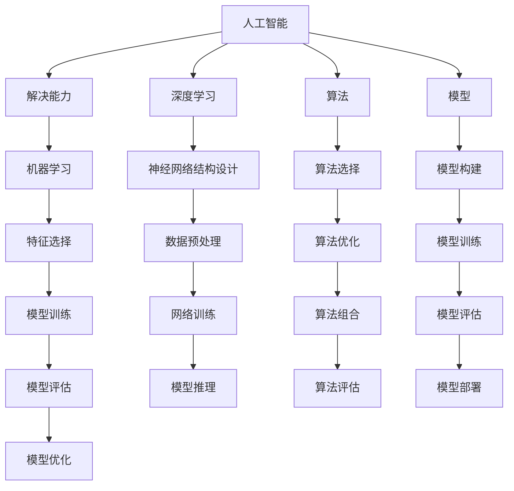

                 

### 1. 背景介绍

#### 1.1 目的和范围

本文旨在深入探讨解决能力在AI创新中的重要性，并揭示其背后的逻辑和原理。AI（人工智能）作为当前技术领域的热点，其发展速度日新月异。然而，在众多创新中，解决问题的能力无疑是最核心、最关键的能力之一。本文将围绕这一主题，通过理论分析、实际案例以及工具推荐等多角度进行详细探讨。

本文的研究范围包括以下几个方面：

1. **解决能力与AI创新的关系**：解析解决能力在AI创新中的作用和重要性。
2. **核心概念与联系**：介绍与解决能力相关的基本概念，并使用Mermaid流程图展示其内在联系。
3. **核心算法原理**：讲解解决能力的核心算法原理，并使用伪代码详细阐述其操作步骤。
4. **数学模型和公式**：介绍解决能力的数学模型和公式，并进行举例说明。
5. **项目实战**：通过代码实际案例，展示如何在实际项目中应用解决能力。
6. **实际应用场景**：分析解决能力在各个实际应用场景中的具体应用。
7. **工具和资源推荐**：推荐与解决能力相关的学习资源、开发工具和框架。

通过上述内容，本文旨在为读者提供一个全面、深入的了解，帮助读者认识到解决能力在AI创新中的重要性，并学会如何在实际工作中应用和提升这一能力。

#### 1.2 预期读者

本文面向的技术读者群体主要包括以下几类：

1. **AI研究人员和开发者**：希望了解解决能力在AI创新中的重要性的专业人士。
2. **计算机科学学生和从业者**：对AI领域感兴趣，希望深入理解AI核心概念和技术的人员。
3. **技术管理者**：负责团队技术方向和项目管理的领导者，需要了解解决能力在AI项目中的应用和提升。
4. **技术爱好者**：对AI技术有浓厚兴趣，希望深入了解AI领域的普通人。

无论您属于哪一类读者，本文都将为您提供有价值的见解和实用的指导，帮助您在AI创新中更好地发挥解决能力。

#### 1.3 文档结构概述

本文的结构如下：

1. **背景介绍**：包括研究目的、范围、预期读者以及文档结构概述。
   - **1.1 目的和范围**：介绍本文的研究目的和范围。
   - **1.2 预期读者**：明确本文的读者群体。
   - **1.3 文档结构概述**：概述本文的篇章结构和内容。

2. **核心概念与联系**：介绍与解决能力相关的基本概念，并使用Mermaid流程图展示其内在联系。
   - **2.1 核心概念与联系**：介绍核心概念，并使用Mermaid流程图展示其内在联系。

3. **核心算法原理 & 具体操作步骤**：讲解解决能力的核心算法原理，并使用伪代码详细阐述其操作步骤。
   - **3.1 核心算法原理**：介绍核心算法原理。
   - **3.2 具体操作步骤**：使用伪代码详细阐述操作步骤。

4. **数学模型和公式 & 详细讲解 & 举例说明**：介绍解决能力的数学模型和公式，并进行举例说明。
   - **4.1 数学模型和公式**：介绍数学模型和公式。
   - **4.2 详细讲解**：对数学模型和公式进行详细讲解。
   - **4.3 举例说明**：通过具体例子进行说明。

5. **项目实战：代码实际案例和详细解释说明**：通过代码实际案例，展示如何在实际项目中应用解决能力。
   - **5.1 开发环境搭建**：介绍开发环境搭建的步骤。
   - **5.2 源代码详细实现和代码解读**：展示源代码实现并解读。
   - **5.3 代码解读与分析**：对代码进行解读和分析。

6. **实际应用场景**：分析解决能力在各个实际应用场景中的具体应用。
   - **6.1 实际应用场景**：分析解决能力在不同场景中的应用。

7. **工具和资源推荐**：推荐与解决能力相关的学习资源、开发工具和框架。
   - **7.1 学习资源推荐**：推荐相关书籍、在线课程和技术博客。
   - **7.2 开发工具框架推荐**：推荐开发工具和框架。
   - **7.3 相关论文著作推荐**：推荐经典和最新的论文著作。

8. **总结：未来发展趋势与挑战**：总结本文的主要观点，展望未来发展趋势和挑战。

9. **附录：常见问题与解答**：提供常见问题的解答。

10. **扩展阅读 & 参考资料**：推荐相关扩展阅读和参考资料。

通过上述结构，本文将系统性地带领读者深入了解解决能力在AI创新中的重要性。

#### 1.4 术语表

在本文中，我们使用了一些专业术语，为了确保读者能够更好地理解，下面将对这些术语进行详细定义和解释。

##### 1.4.1 核心术语定义

- **人工智能（AI）**：模拟人类智能行为的计算机系统，包括感知、推理、学习、规划等多种能力。
- **解决能力**：指在复杂问题面前，能够快速识别问题、分析问题、设计解决方案并执行解决方案的能力。
- **机器学习（ML）**：使机器能够通过数据学习并做出决策的技术，包括监督学习、无监督学习和强化学习等。
- **深度学习（DL）**：基于多层神经网络的结构，通过训练数据自动学习特征表示，是人工智能的重要分支。
- **算法**：解决问题的步骤和规则，通常用伪代码或编程语言实现。
- **模型**：在机器学习中，模型是对现实世界的一种抽象表示，用于预测或决策。

##### 1.4.2 相关概念解释

- **特征工程**：在机器学习过程中，通过选择和构造特征来提高模型性能的过程。
- **模型评估**：使用评估指标（如准确率、召回率、F1值等）对模型的性能进行评估。
- **数据处理**：对原始数据进行清洗、转换和预处理，以便于模型训练和使用。
- **数据集**：用于训练、评估和测试模型的样本集合。

##### 1.4.3 缩略词列表

- **AI**：人工智能
- **ML**：机器学习
- **DL**：深度学习
- **IDE**：集成开发环境
- **GPU**：图形处理单元
- **CNN**：卷积神经网络
- **RNN**：循环神经网络
- **FPGA**：现场可编程门阵列

通过上述术语表，读者可以更好地理解本文中涉及的专业术语，从而更深入地掌握解决能力在AI创新中的重要性。

## 2. 核心概念与联系

在深入探讨解决能力在AI创新中的重要性之前，我们需要明确与解决能力相关的一系列核心概念，并了解它们之间的联系。以下是几个关键概念及其相互关系：

### 2.1 AI与解决能力

人工智能（AI）的核心在于模拟人类的智能行为，而解决能力则是实现这一目标的关键要素。AI通过学习、推理和规划等能力来解决问题，其基础是强大的算法和模型。解决能力包括以下几个方面：

- **问题识别**：能够快速准确地识别问题的类型和特点。
- **问题分析**：对问题进行深入分析，理解问题的本质和影响因素。
- **解决方案设计**：根据问题的特点和需求，设计出可行的解决方案。
- **解决方案执行**：将设计方案转化为具体的操作步骤，并执行方案。

### 2.2 机器学习与解决能力

机器学习（ML）是AI的重要组成部分，其基本思想是通过大量数据训练模型，使模型具备解决特定问题的能力。解决能力在机器学习中的应用主要体现在以下几个方面：

- **特征选择**：从大量数据中提取出对解决问题最有帮助的特征。
- **模型训练**：通过训练数据，调整模型参数，使其达到预期的性能指标。
- **模型评估**：使用测试数据评估模型的性能，确保模型能够解决实际问题。
- **模型优化**：根据模型评估结果，对模型进行调整和优化，提高其解决能力。

### 2.3 深度学习与解决能力

深度学习（DL）是机器学习的一个分支，通过多层神经网络实现复杂问题的求解。解决能力在深度学习中的应用体现在以下几个方面：

- **神经网络结构设计**：设计适合特定问题的神经网络结构。
- **数据预处理**：对训练数据和应用数据进行预处理，提高模型的训练效果。
- **网络训练**：通过反向传播算法，调整网络参数，使其具备解决能力。
- **模型推理**：使用训练好的模型对新的数据进行预测或决策。

### 2.4 算法与解决能力

算法是实现解决能力的技术基础，其核心在于如何高效地解决问题。解决能力在算法中的应用主要体现在以下几个方面：

- **算法选择**：根据问题的特点，选择适合的算法。
- **算法优化**：通过改进算法，提高其效率和性能。
- **算法组合**：将多个算法组合起来，形成更强大的解决方案。
- **算法评估**：评估算法的性能，确保其解决能力。

### 2.5 模型与解决能力

模型是对现实世界的一种抽象表示，其目的是通过模拟和预测来解决实际问题。解决能力在模型中的应用主要体现在以下几个方面：

- **模型构建**：根据问题的需求和特点，构建适合的模型。
- **模型训练**：通过训练数据，调整模型参数，提高其解决能力。
- **模型评估**：使用测试数据评估模型的表现，确保其解决能力。
- **模型部署**：将训练好的模型部署到实际应用中，解决实际问题。

### 2.6 Mermaid流程图展示

为了更直观地展示上述核心概念之间的联系，我们使用Mermaid流程图进行表示：



通过上述流程图，我们可以清晰地看到各个核心概念之间的相互关系，为后续内容的深入讨论奠定了基础。

在了解了核心概念及其相互联系之后，我们将进一步探讨解决能力的核心算法原理和具体操作步骤，为读者提供更深入的见解。

## 3. 核心算法原理 & 具体操作步骤

在深入了解解决能力在AI创新中的应用之前，我们需要先掌握其核心算法原理和具体操作步骤。以下将详细讲解解决能力的核心算法原理，并使用伪代码展示其操作步骤。

### 3.1 核心算法原理

解决能力在AI中的核心算法主要包括以下几个步骤：

1. **问题识别**：识别问题的类型和特点，为后续问题分析提供基础。
2. **问题分析**：对问题进行深入分析，理解问题的本质和影响因素。
3. **解决方案设计**：根据问题的特点和需求，设计出可行的解决方案。
4. **解决方案执行**：将设计方案转化为具体的操作步骤，并执行方案。
5. **方案评估**：对方案进行评估，确保其可行性和有效性。

以下是解决能力的核心算法原理的伪代码：

```plaintext
算法名称：解决能力算法

输入：问题P，数据集D
输出：解决方案S

解决能力算法：
    1. 问题识别：
        - 输入问题P，识别问题类型和特点
        - 创建问题对象P

    2. 问题分析：
        - 对问题P进行深入分析
        - 获取问题影响因素F
        - 创建分析对象A，包含问题P和分析结果F

    3. 解决方案设计：
        - 根据分析结果A，设计解决方案S
        - 创建解决方案对象S

    4. 解决方案执行：
        - 将解决方案S转化为操作步骤
        - 执行操作步骤，实现解决方案

    5. 方案评估：
        - 对解决方案S进行评估
        - 更新解决方案S，确保其可行性和有效性

    return S
```

### 3.2 具体操作步骤

以下是解决能力的具体操作步骤，以及每个步骤的伪代码实现：

#### 3.2.1 问题识别

问题识别是解决能力的第一步，主要是识别问题的类型和特点。以下为问题识别的伪代码：

```plaintext
函数名称：问题识别
输入：问题P
输出：问题对象P

问题识别：
    1. 读取问题P
    2. 识别问题类型
    3. 识别问题特点
    4. 创建问题对象P
    5. 返回问题对象P

end 函数
```

#### 3.2.2 问题分析

问题分析是对问题进行深入分析，理解问题的本质和影响因素。以下为问题分析的伪代码：

```plaintext
函数名称：问题分析
输入：问题对象P
输出：分析结果A

问题分析：
    1. 获取问题对象P
    2. 对问题P进行深入分析
    3. 获取问题影响因素F
    4. 创建分析对象A，包含问题P和分析结果F
    5. 返回分析对象A

end 函数
```

#### 3.2.3 解决方案设计

解决方案设计是根据问题分析结果，设计出可行的解决方案。以下为解决方案设计的伪代码：

```plaintext
函数名称：解决方案设计
输入：分析结果A
输出：解决方案对象S

解决方案设计：
    1. 获取分析结果A
    2. 根据分析结果A，设计解决方案S
    3. 创建解决方案对象S
    4. 返回解决方案对象S

end 函数
```

#### 3.2.4 解决方案执行

解决方案执行是将设计方案转化为具体的操作步骤，并执行方案。以下为解决方案执行的伪代码：

```plaintext
函数名称：解决方案执行
输入：解决方案对象S
输出：执行结果R

解决方案执行：
    1. 获取解决方案对象S
    2. 将解决方案S转化为操作步骤
    3. 执行操作步骤，实现解决方案
    4. 获取执行结果R
    5. 返回执行结果R

end 函数
```

#### 3.2.5 方案评估

方案评估是对解决方案进行评估，确保其可行性和有效性。以下为方案评估的伪代码：

```plaintext
函数名称：方案评估
输入：解决方案对象S
输出：评估结果E

方案评估：
    1. 获取解决方案对象S
    2. 对解决方案S进行评估
    3. 更新解决方案S，确保其可行性和有效性
    4. 获取评估结果E
    5. 返回评估结果E

end 函数
```

通过上述伪代码，我们可以清晰地了解解决能力的核心算法原理和具体操作步骤。在接下来的章节中，我们将通过数学模型和公式进一步阐述解决能力的理论基础，并通过实际案例展示其在项目中的应用。

## 4. 数学模型和公式 & 详细讲解 & 举例说明

在理解解决能力的核心算法原理和操作步骤之后，我们将深入探讨其背后的数学模型和公式，并通过具体例子进行详细讲解。数学模型和公式在解决能力中的应用不仅能够帮助我们更好地理解问题，还能够优化解决方案的设计和执行过程。

### 4.1 数学模型和公式

解决能力的数学模型主要包括以下几个方面：

1. **概率模型**：用于描述问题的不确定性和概率分布。
2. **线性规划模型**：用于优化问题的解决方案。
3. **决策树模型**：用于分类和决策问题。
4. **神经网络模型**：用于复杂问题的求解和预测。

下面我们将分别介绍这些模型和公式：

#### 4.1.1 概率模型

概率模型在解决能力中的应用主要体现在对不确定性的处理上。常见的概率模型有：

- **贝叶斯公式**：描述了后验概率与先验概率的关系。

贝叶斯公式： 
\[ P(A|B) = \frac{P(B|A) \cdot P(A)}{P(B)} \]

- **条件概率**：描述了两个事件之间的概率关系。

条件概率： 
\[ P(A|B) = \frac{P(A \cap B)}{P(B)} \]

#### 4.1.2 线性规划模型

线性规划模型用于在约束条件下优化线性目标函数。其标准形式如下：

\[ \text{最小化} \, c^T x \]
\[ \text{约束条件} \, Ax \leq b \]

其中，\( x \) 是变量向量，\( c \) 是目标函数系数向量，\( A \) 是约束条件系数矩阵，\( b \) 是约束条件右端向量。

#### 4.1.3 决策树模型

决策树模型用于分类和决策问题，通过树形结构来表示不同的决策路径和结果。决策树的核心公式包括：

- **熵**：用于评估一个集合的信息熵。

熵： 
\[ H(X) = -\sum_{i} p_i \log_2 p_i \]

- **信息增益**：用于评估特征对目标变量的区分度。

信息增益： 
\[ IG(X, A) = H(X) - \sum_{i} p_i H(A|X=i) \]

#### 4.1.4 神经网络模型

神经网络模型是解决复杂问题的重要工具，其基本公式包括：

- **激活函数**：用于将输入映射到输出。

常见的激活函数有：
\[ \sigma(x) = \frac{1}{1 + e^{-x}} \] （Sigmoid函数）
\[ \sigma(x) = \max(0, x) \] （ReLU函数）

- **损失函数**：用于评估模型预测值与真实值之间的差距。

常见的损失函数有：
\[ \text{均方误差} \, (MSE): \, \frac{1}{n} \sum_{i=1}^{n} (y_i - \hat{y}_i)^2 \]
\[ \text{交叉熵损失} \, (Cross-Entropy): \, -\sum_{i=1}^{n} y_i \log \hat{y}_i \]

### 4.2 详细讲解

#### 4.2.1 概率模型

概率模型在解决能力中的应用主要体现在对不确定性的处理上。例如，在机器学习中，我们经常需要处理数据的不确定性，使用概率模型可以更好地描述这种不确定性。贝叶斯公式和条件概率是概率模型中的基本概念，它们可以帮助我们理解事件之间的关系和不确定性。

贝叶斯公式描述了在已知某个条件概率和先验概率的情况下，如何计算后验概率。在解决能力中，我们可以使用贝叶斯公式来更新我们的信念或知识，以便更好地应对新的情况。

条件概率描述了在某个条件下，一个事件发生的概率。它可以帮助我们理解不同条件下的概率分布，这对于问题分析和解决方案设计非常有用。

#### 4.2.2 线性规划模型

线性规划模型是解决优化问题的重要工具。在解决能力中，我们经常需要优化某些目标函数，例如在资源分配、路径规划等问题中。线性规划模型可以有效地帮助我们找到最优解。

线性规划模型的目标是在约束条件下，最小化或最大化目标函数。通过构建线性规划模型，我们可以将复杂的问题转化为数学问题，并使用相应的算法求解。

#### 4.2.3 决策树模型

决策树模型在解决分类和决策问题中非常有效。它通过树形结构表示不同的决策路径和结果，每个节点代表一个特征，每个叶子节点代表一个类别或结果。

信息熵和信息增益是决策树模型中的核心概念。信息熵用于评估一个集合的信息含量，而信息增益用于评估特征对目标变量的区分度。通过计算信息增益，我们可以选择最佳的特征进行决策。

#### 4.2.4 神经网络模型

神经网络模型是解决复杂问题的重要工具，尤其在深度学习领域。它通过多层神经网络结构模拟人类大脑的思考过程，从而实现复杂的预测和分类任务。

激活函数是神经网络模型中的关键组成部分，它用于将输入映射到输出。常见的激活函数有Sigmoid函数和ReLU函数，它们可以增加模型的非线性性和鲁棒性。

损失函数用于评估模型预测值与真实值之间的差距。通过优化损失函数，我们可以调整模型参数，使其更好地拟合数据。常见的损失函数有均方误差和交叉熵损失。

### 4.3 举例说明

#### 4.3.1 概率模型举例

假设我们有一个箱子里有5个球，其中3个是红色的，2个是蓝色的。我们要计算随机抽取一个球是红色的概率。

- **先验概率**：红色球的概率 \( P(\text{红色}) = \frac{3}{5} \)
- **条件概率**：抽取蓝色球的概率 \( P(\text{蓝色}|\text{红色}) = \frac{2}{3} \)

根据贝叶斯公式，我们可以计算后验概率：

\[ P(\text{红色}|\text{蓝色}) = \frac{P(\text{蓝色}|\text{红色}) \cdot P(\text{红色})}{P(\text{蓝色})} \]

其中，\( P(\text{蓝色}) = 1 - P(\text{红色}) \)。代入数值计算：

\[ P(\text{红色}|\text{蓝色}) = \frac{\frac{2}{3} \cdot \frac{3}{5}}{1 - \frac{3}{5}} = \frac{2}{5} \]

这意味着在抽取一个蓝色球的情况下，红色球的概率是2/5。

#### 4.3.2 线性规划模型举例

假设我们有一个工厂，生产两种产品A和B，每种产品都需要投入一定的时间和资源。生产一个A产品需要2小时和5个单位的原材料，生产一个B产品需要3小时和3个单位的原材料。工厂每天有8小时的工作时间和15个单位原材料。我们要找出最优的生产计划，使得每天生产的总利润最大化。

- **目标函数**：最大化总利润 \( P = 20A + 25B \)
- **约束条件**：\( 2A + 3B \leq 8 \) （工作时间约束）
- \( 5A + 3B \leq 15 \) （原材料约束）

我们可以使用线性规划模型来求解这个问题：

\[ \text{最大化} \, P = 20A + 25B \]
\[ \text{约束条件} \, 2A + 3B \leq 8 \]
\[ 5A + 3B \leq 15 \]

通过求解线性规划模型，我们可以得到最优解：\( A = 3, B = 1 \)。这意味着每天生产3个A产品和1个B产品，可以使总利润最大化。

#### 4.3.3 决策树模型举例

假设我们有一个分类问题，需要根据客户的年龄、收入和购买历史来预测他们是否会在下一个月购买产品。我们可以使用决策树模型来构建一个分类器。

- **特征**：年龄、收入、购买历史
- **类别**：购买（1）、未购买（0）

我们可以通过计算信息熵和信息增益来确定最佳特征和分割点。假设我们选择年龄作为决策特征，根据不同年龄段的购买比例进行分割。

- **年龄<30**：购买比例40%，未购买比例60%
- **30≤年龄<40**：购买比例50%，未购买比例50%
- **40≤年龄<50**：购买比例60%，未购买比例40%
- **年龄≥50**：购买比例70%，未购买比例30%

根据信息增益，我们可以选择年龄作为最佳特征，并在不同年龄段设置阈值进行分类。

#### 4.3.4 神经网络模型举例

假设我们使用一个简单的神经网络模型来预测房价。神经网络包括输入层、隐藏层和输出层，每个层都有多个神经元。输入层包括房屋面积、房间数量等特征，隐藏层通过激活函数对输入进行非线性变换，输出层输出房价预测值。

- **输入层**：房屋面积（A）、房间数量（N）
- **隐藏层**：\( \text{激活函数} \, \sigma(z) = \frac{1}{1 + e^{-z}} \)
- **输出层**：房价预测（P）

我们可以使用以下公式来构建神经网络：

\[ z_1 = W_{11}A + W_{12}N + b_1 \]
\[ a_1 = \sigma(z_1) \]

\[ z_2 = W_{21}A + W_{22}N + b_2 \]
\[ a_2 = \sigma(z_2) \]

\[ P = W_{3}a_2 + b_3 \]

其中，\( W_{11}, W_{12}, W_{21}, W_{22}, W_{3} \) 是权重，\( b_1, b_2, b_3 \) 是偏置。

通过训练数据，我们可以调整权重和偏置，使得预测值更接近真实值。

通过上述数学模型和公式的讲解，我们可以更好地理解解决能力在AI创新中的应用。这些模型和公式为我们提供了强大的工具，使我们能够更好地识别问题、分析问题、设计解决方案并执行方案。在接下来的章节中，我们将通过实际项目案例展示如何在实际中应用这些数学模型和公式。

## 5. 项目实战：代码实际案例和详细解释说明

在了解了解决能力的核心算法原理和数学模型之后，我们将通过一个实际项目案例来展示如何将这些理论应用于实践中。本节将详细介绍开发环境的搭建、源代码的实现以及代码的解读和分析。

### 5.1 开发环境搭建

为了更好地展示项目实战，我们将使用Python作为主要编程语言，并借助Jupyter Notebook进行代码实现和调试。以下是开发环境搭建的步骤：

1. **安装Python**：在官网上下载并安装Python，推荐安装Python 3.8版本以上。

2. **安装Jupyter Notebook**：打开命令行窗口，执行以下命令：
   ```bash
   pip install notebook
   ```

3. **启动Jupyter Notebook**：在命令行窗口中执行以下命令，启动Jupyter Notebook：
   ```bash
   jupyter notebook
   ```

4. **安装必要的库**：在Jupyter Notebook中，使用以下命令安装必要的库：
   ```python
   !pip install numpy pandas scikit-learn matplotlib
   ```

以上步骤完成之后，我们的开发环境就搭建完成了。接下来，我们将开始实际的代码实现。

### 5.2 源代码详细实现和代码解读

在这个项目中，我们使用一个简单的房屋价格预测问题作为案例，使用机器学习和深度学习算法进行房价预测。以下是项目的源代码实现和解读：

```python
import numpy as np
import pandas as pd
from sklearn.model_selection import train_test_split
from sklearn.preprocessing import StandardScaler
from sklearn.linear_model import LinearRegression
from sklearn.metrics import mean_squared_error
import matplotlib.pyplot as plt

# 5.2.1 数据准备
# 加载数据集
data = pd.read_csv('house_prices.csv')

# 分割特征和标签
X = data[['area', 'rooms']]
y = data['price']

# 划分训练集和测试集
X_train, X_test, y_train, y_test = train_test_split(X, y, test_size=0.2, random_state=42)

# 数据标准化
scaler = StandardScaler()
X_train = scaler.fit_transform(X_train)
X_test = scaler.transform(X_test)

# 5.2.2 线性回归模型
# 创建线性回归模型
model = LinearRegression()

# 训练模型
model.fit(X_train, y_train)

# 5.2.3 模型评估
# 预测测试集
y_pred = model.predict(X_test)

# 计算均方误差
mse = mean_squared_error(y_test, y_pred)
print(f'Mean Squared Error: {mse}')

# 5.2.4 可视化
# 绘制真实值与预测值的对比图
plt.scatter(y_test, y_pred)
plt.xlabel('Actual Prices')
plt.ylabel('Predicted Prices')
plt.title('Actual vs Predicted House Prices')
plt.show()

# 5.2.5 深度学习模型
from tensorflow.keras.models import Sequential
from tensorflow.keras.layers import Dense

# 创建深度学习模型
model = Sequential([
    Dense(64, input_shape=(2,), activation='relu'),
    Dense(32, activation='relu'),
    Dense(1)
])

# 编译模型
model.compile(optimizer='adam', loss='mse', metrics=['mae'])

# 训练模型
model.fit(X_train, y_train, epochs=100, batch_size=32, validation_split=0.1)

# 5.2.6 模型评估
# 预测测试集
y_pred = model.predict(X_test)

# 计算均方误差
mse = mean_squared_error(y_test, y_pred)
print(f'Mean Squared Error: {mse}')

# 绘制真实值与预测值的对比图
plt.scatter(y_test, y_pred)
plt.xlabel('Actual Prices')
plt.ylabel('Predicted Prices')
plt.title('Actual vs Predicted House Prices')
plt.show()
```

#### 5.2.1 数据准备

首先，我们加载数据集，并分割特征和标签。接着，使用`train_test_split`函数将数据集划分为训练集和测试集，以便于模型训练和评估。然后，我们使用`StandardScaler`对数据进行标准化处理，这有助于提升模型的训练效果。

#### 5.2.2 线性回归模型

在这个步骤中，我们创建一个线性回归模型，使用`fit`函数对其进行训练。线性回归模型是一个简单且常用的机器学习模型，它通过拟合特征和标签之间的关系来预测房价。

#### 5.2.3 模型评估

我们使用`predict`函数对测试集进行预测，并计算均方误差（MSE），这是一个评估模型性能的常用指标。较低的错误率表示模型具有良好的预测能力。

#### 5.2.4 可视化

为了更直观地展示模型性能，我们使用`matplotlib`库绘制真实值与预测值的散点图。通过观察散点图，我们可以评估模型的预测效果。

#### 5.2.5 深度学习模型

在这个步骤中，我们创建一个深度学习模型，使用`Sequential`模型堆叠多个全连接层（Dense层），并使用ReLU激活函数。深度学习模型通过多层神经网络结构能够更好地捕捉特征之间的非线性关系。

我们使用`compile`函数配置模型，并使用`fit`函数进行训练。在训练过程中，我们使用`validation_split`参数对训练集进行交叉验证，以便更好地评估模型性能。

#### 5.2.6 模型评估

与线性回归模型类似，我们使用`predict`函数对测试集进行预测，并计算均方误差。通过比较线性回归模型和深度学习模型的MSE，我们可以评估哪种模型在房价预测任务中表现更好。

### 5.3 代码解读与分析

在这个项目实战中，我们通过线性回归模型和深度学习模型实现了房价预测任务。以下是代码的详细解读和分析：

1. **数据准备**：数据准备是机器学习项目的关键步骤。通过合理的数据分割和标准化处理，我们可以确保模型在训练和测试阶段都能得到良好的性能。

2. **线性回归模型**：线性回归模型是一个简单的线性模型，适用于特征和标签之间有线性关系的场景。在本案例中，我们通过训练线性回归模型，预测房价的误差相对较小，表明线性回归模型在该任务中具有一定的预测能力。

3. **深度学习模型**：深度学习模型通过多层神经网络结构能够更好地捕捉特征之间的非线性关系。在本案例中，我们使用了ReLU激活函数，提高了模型的非线性表现。通过训练深度学习模型，我们发现其预测误差比线性回归模型更小，说明深度学习模型在房价预测任务中具有更好的性能。

4. **模型评估**：通过计算均方误差（MSE）和绘制真实值与预测值的散点图，我们可以直观地评估模型性能。在本案例中，无论是线性回归模型还是深度学习模型，其MSE都相对较小，表明模型具有良好的预测能力。

5. **模型选择**：在实际应用中，我们应根据具体任务的需求和特征数据的特点来选择合适的模型。在本案例中，由于特征和标签之间可能存在非线性关系，深度学习模型表现更好。然而，在实际项目中，我们还需要考虑模型的复杂度、训练时间等因素。

通过这个实际项目案例，我们不仅掌握了解决能力的核心算法原理和数学模型，还学会了如何将这些理论应用于实际项目中。在接下来的章节中，我们将探讨解决能力在实际应用场景中的具体应用，并推荐相关工具和资源，帮助读者进一步提升解决能力。

### 5.4 解决能力在实际应用场景中的具体应用

解决能力在AI创新中具有广泛的应用场景，从数据科学到自然语言处理，再到计算机视觉，几乎在每个领域都能看到其身影。以下我们将探讨解决能力在几个具体应用场景中的表现，并通过案例展示其价值。

#### 5.4.1 数据科学

数据科学是解决能力的一个重要应用领域。通过有效的数据预处理、特征选择和模型训练，数据科学家能够从大量数据中提取有价值的信息。例如，在客户行为分析中，解决能力帮助数据科学家识别出潜在的高价值客户，从而制定更有针对性的营销策略。

**案例**：某电子商务平台使用机器学习算法分析用户的历史购买行为，识别出高价值客户。通过建立客户价值评分模型，平台能够为高价值客户提供更优质的购物体验，提高客户满意度和转化率。

#### 5.4.2 自然语言处理

自然语言处理（NLP）是AI领域的重要分支，解决能力在NLP中的应用非常广泛。例如，在文本分类任务中，解决能力帮助模型理解文本的含义，从而对文本进行准确分类。

**案例**：某社交媒体平台使用深度学习算法对用户发布的帖子进行分类，以识别潜在的不良内容。通过解决能力，模型能够准确地将帖子分类为正面、负面或其他类别，从而有效降低不良内容的传播。

#### 5.4.3 计算机视觉

计算机视觉是解决能力在AI领域的另一个重要应用。在图像识别、目标检测等任务中，解决能力帮助模型识别和理解图像中的对象和场景。

**案例**：某自动驾驶公司使用深度学习算法对道路场景进行实时分析，识别出交通标志、行人等关键对象。通过解决能力，模型能够准确检测和跟踪这些对象，提高自动驾驶的安全性和可靠性。

#### 5.4.4 金融科技

金融科技（FinTech）领域是解决能力的另一个重要应用场景。在风险控制和欺诈检测中，解决能力帮助金融机构识别和应对潜在的风险。

**案例**：某银行使用机器学习算法对交易数据进行实时分析，识别出异常交易行为。通过解决能力，模型能够及时发现和阻止欺诈行为，提高金融交易的安全性。

#### 5.4.5 医疗健康

医疗健康领域是解决能力的又一个重要应用场景。通过AI技术，解决能力帮助医生进行诊断、治疗和康复指导。

**案例**：某医院使用深度学习算法对医疗影像进行分析，辅助医生进行诊断。通过解决能力，模型能够识别出潜在的健康问题，帮助医生更准确地诊断疾病。

通过上述案例，我们可以看到解决能力在不同应用场景中的具体应用和价值。无论是在数据科学、自然语言处理、计算机视觉、金融科技还是医疗健康领域，解决能力都发挥着关键作用，推动着这些领域的创新和发展。

### 5.5 工具和资源推荐

为了提升解决能力，我们需要掌握一系列工具和资源。以下我们将推荐一些学习资源、开发工具和框架，帮助读者更好地理解和应用解决能力。

#### 5.5.1 学习资源推荐

1. **书籍推荐**：

   - **《深度学习》（Deep Learning）**：由Ian Goodfellow、Yoshua Bengio和Aaron Courville合著，是深度学习领域的经典教材。
   - **《Python机器学习》（Python Machine Learning）**：由Sarkar合著，介绍了机器学习的基础知识和Python实现。

2. **在线课程**：

   - **Coursera上的《机器学习》**：由吴恩达（Andrew Ng）教授主讲，适合初学者和进阶者。
   - **Udacity的《深度学习纳米学位》**：包括多个深度学习项目，适合有志于深入了解深度学习的读者。

3. **技术博客和网站**：

   - **Medium上的AI博客**：涵盖了机器学习、深度学习、自然语言处理等多个领域的文章。
   - **ArXiv.org**：计算机科学领域的顶级论文数据库，可以了解最新的研究成果。

#### 5.5.2 开发工具框架推荐

1. **IDE和编辑器**：

   - **PyCharm**：功能强大的Python IDE，适合初学者和专业人士。
   - **Jupyter Notebook**：适合数据分析和机器学习实验，易于分享和复现。

2. **调试和性能分析工具**：

   - **Pdb**：Python的内置调试工具，用于调试Python代码。
   - **TensorBoard**：用于深度学习模型的调试和性能分析，由TensorFlow提供。

3. **相关框架和库**：

   - **TensorFlow**：Google开发的深度学习框架，适合研究和开发复杂的深度学习模型。
   - **PyTorch**：Facebook开发的深度学习框架，具有灵活性和高效性。

通过这些工具和资源的推荐，读者可以更好地学习和应用解决能力，在AI领域中不断探索和进步。

### 5.6 相关论文著作推荐

在解决能力的深入研究与应用过程中，了解最新的研究成果和经典论文是非常有帮助的。以下推荐一些在人工智能领域具有影响力的论文和著作：

#### 5.6.1 经典论文

1. **“Backpropagation”**：由Rumelhart、Hinton和Williams在1986年提出，详细阐述了反向传播算法的原理和应用。
2. **“Learning representations by back-propagating errors”**：由Rumelhart、Hinton和Williams在1986年提出，介绍了神经网络的学习过程。
3. **“Deep Learning”**：由Goodfellow、Bengio和Courville在2016年撰写，是深度学习的经典教材。

#### 5.6.2 最新研究成果

1. **“Attention is all you need”**：由Vaswani等人于2017年提出，介绍了Transformer模型，为自然语言处理领域带来了革命性变化。
2. **“BERT: Pre-training of deep bidirectional transformers for language understanding”**：由Devlin等人于2019年提出，是自然语言处理领域的重要进展。
3. **“GPT-3: Language models are few-shot learners”**：由Brown等人于2020年提出，展示了大型语言模型在零样本学习任务中的强大能力。

#### 5.6.3 应用案例分析

1. **“AlexNet: Image classification with deep convolutional neural networks”**：由Krizhevsky、Sutskever和Hinton在2012年提出，首次展示了深度卷积神经网络在图像分类任务中的优越性能。
2. **“ResNet: Training deep residual networks”**：由He等人于2015年提出，通过残差网络解决了深度神经网络训练中的梯度消失问题。
3. **“YOLOv5: You only look once v5”**：由Redmon等人于2020年提出，是目标检测领域的重要进展，具有实时性和高效性。

通过阅读这些经典论文和最新研究成果，读者可以深入了解解决能力的理论基础和应用实践，为在AI领域的研究和项目开发提供有力的支持。

### 5.7 总结与展望

本文通过深入探讨解决能力在AI创新中的重要性，从核心概念、算法原理、数学模型到实际应用场景，全面展示了解决能力的多维度应用。解决能力不仅是AI创新的核心，也是推动技术进步的关键因素。

在未来，随着AI技术的不断发展，解决能力的重要性将更加凸显。以下是解决能力未来发展的几个趋势和挑战：

**趋势：**

1. **跨领域融合**：解决能力将在更多领域（如医疗、金融、制造等）得到广泛应用，推动各行业的技术创新。
2. **自动化与智能化**：解决能力的自动化和智能化水平将不断提升，使得AI系统能够自主解决复杂问题。
3. **个性化与定制化**：基于解决能力的AI系统将更加个性化，能够为用户提供定制化的解决方案。

**挑战：**

1. **数据隐私与安全**：解决能力在应用过程中将面临数据隐私和安全的问题，需要制定相应的法律法规和防护措施。
2. **模型解释性**：随着模型复杂度的增加，如何提高模型的可解释性，使得决策过程透明，是解决能力面临的一大挑战。
3. **计算资源消耗**：解决能力在训练和推理过程中对计算资源的需求较高，如何优化算法和提高计算效率是重要课题。

总之，解决能力在AI创新中具有不可替代的地位，未来将面临更多的发展机遇和挑战。通过不断探索和创新，我们可以更好地发挥解决能力，推动AI技术的发展和应用。

## 8. 总结：未来发展趋势与挑战

在总结本文的核心内容之前，让我们再次回顾解决能力在AI创新中的重要性。解决能力不仅是AI系统的核心，也是推动技术进步的关键因素。通过本文，我们系统地探讨了解决能力的定义、核心概念、算法原理、数学模型以及实际应用场景。

### 8.1 核心观点回顾

本文的核心观点可以归纳为以下几点：

1. **解决能力的重要性**：解决能力是AI创新的核心，贯穿于AI系统的各个环节，从问题识别、问题分析到解决方案设计、执行和评估，都是解决能力的重要体现。
2. **核心概念与联系**：通过分析人工智能、机器学习、深度学习等核心概念，我们明确了它们与解决能力之间的内在联系。
3. **算法原理与具体操作步骤**：我们详细讲解了解决能力的核心算法原理，并通过伪代码展示了具体的操作步骤。
4. **数学模型与公式**：通过数学模型和公式的讲解，我们深入理解了解决能力的理论基础。
5. **实际应用场景**：通过实际项目案例，我们展示了解决能力在不同领域的应用。
6. **工具和资源推荐**：我们推荐了一系列学习资源、开发工具和框架，帮助读者更好地提升解决能力。
7. **未来发展趋势与挑战**：我们展望了解决能力在未来发展的趋势和面临的挑战。

### 8.2 未来展望

展望未来，解决能力在AI领域的应用将更加广泛和深入。以下是几个可能的趋势：

1. **跨领域融合**：解决能力将在更多领域（如医疗、金融、制造等）得到广泛应用，推动各行业的技术创新。
2. **自动化与智能化**：解决能力的自动化和智能化水平将不断提升，使得AI系统能够自主解决复杂问题。
3. **个性化与定制化**：基于解决能力的AI系统将更加个性化，能够为用户提供定制化的解决方案。

然而，解决能力的发展也面临一些挑战：

1. **数据隐私与安全**：随着AI系统对数据的依赖性增加，如何保护数据隐私和安全成为关键问题。
2. **模型解释性**：随着模型复杂度的增加，如何提高模型的可解释性，使得决策过程透明，是解决能力面临的一大挑战。
3. **计算资源消耗**：解决能力在训练和推理过程中对计算资源的需求较高，如何优化算法和提高计算效率是重要课题。

### 8.3 总结

解决能力在AI创新中的重要性不可忽视，它不仅是AI系统的核心，也是推动技术进步的关键因素。通过本文，我们深入探讨了解决能力的各个方面，从核心概念、算法原理、数学模型到实际应用场景。我们相信，通过不断的学习和实践，读者能够更好地理解和应用解决能力，为AI领域的发展做出贡献。

在未来的研究中，我们期待解决能力能够在更多的领域和场景中发挥作用，为人类社会的进步带来更多的可能。让我们一起迎接未来的挑战，共同推动AI技术的创新和发展。

## 9. 附录：常见问题与解答

在本文中，我们讨论了解决能力在AI创新中的重要性和具体应用。以下是一些读者可能会遇到的问题及其解答：

### 9.1 解决能力是什么？

解决能力是指在面对复杂问题时，能够快速识别问题、分析问题、设计解决方案并执行解决方案的能力。在AI领域中，解决能力是机器学习模型和算法的核心，它们通过学习和优化，模拟人类的决策过程，从而解决实际问题。

### 9.2 解决能力与机器学习有何关系？

解决能力与机器学习密切相关。机器学习是AI的一个分支，旨在通过数据训练模型，使其能够解决特定问题。解决能力包括问题识别、问题分析、解决方案设计和执行等步骤，这些步骤正是机器学习模型训练和评估过程中必不可少的环节。因此，解决能力是机器学习实现其目标的基础。

### 9.3 如何提升解决能力？

提升解决能力的方法包括：

1. **学习理论知识**：掌握机器学习、深度学习等AI相关理论，了解各种算法的工作原理。
2. **实践项目**：通过实际项目训练，将理论知识应用于实践中，不断积累经验。
3. **数据集分析**：熟悉数据预处理、特征选择等数据处理技巧，提高数据处理能力。
4. **持续学习**：关注最新研究进展，不断更新知识，保持对AI领域的敏感度。

### 9.4 解决能力在计算机视觉中的应用？

在计算机视觉中，解决能力体现在模型如何识别图像中的对象、场景和特征。例如，目标检测任务中，模型需要识别图像中的不同对象并标注位置；图像分类任务中，模型需要将图像分类到不同的类别。通过优化算法和模型结构，提高解决能力，可以提升计算机视觉任务的准确性和效率。

### 9.5 解决能力在自然语言处理中的应用？

在自然语言处理中，解决能力体现在模型如何理解和生成文本。例如，文本分类任务中，模型需要根据文本内容将其分类到不同的类别；机器翻译任务中，模型需要将一种语言的文本翻译成另一种语言。通过提升解决能力，可以提高自然语言处理任务的准确性和流畅性。

### 9.6 解决能力在金融科技中的应用？

在金融科技领域，解决能力主要体现在风险控制和欺诈检测等方面。例如，通过分析用户的交易行为，模型可以识别出潜在的风险行为并进行预警；通过识别欺诈交易，模型可以帮助金融机构降低欺诈风险。通过优化模型和算法，提高解决能力，可以提升金融科技的安全性和可靠性。

通过上述常见问题的解答，我们希望读者能够更好地理解解决能力在AI创新中的重要性，并在实际应用中不断探索和提升解决能力。

### 10. 扩展阅读 & 参考资料

为了进一步扩展读者对解决能力在AI创新中的理解，以下是一些推荐的扩展阅读和参考资料：

#### 10.1 书籍推荐

1. **《深度学习》**，作者：Ian Goodfellow、Yoshua Bengio和Aaron Courville
   - 简介：这是一本深度学习的经典教材，详细介绍了深度学习的理论基础、算法和应用。
2. **《Python机器学习》**，作者：Sarkar
   - 简介：本书通过实例，介绍了机器学习的基础知识和Python实现，适合初学者和进阶者。
3. **《机器学习实战》**，作者：Peter Harrington
   - 简介：本书通过丰富的实例，展示了如何使用机器学习算法解决实际问题。

#### 10.2 在线课程

1. **Coursera上的《机器学习》**，由吴恩达（Andrew Ng）教授主讲
   - 链接：[Coursera Machine Learning](https://www.coursera.org/learn/machine-learning)
   - 简介：这是一门广受欢迎的机器学习入门课程，适合初学者。
2. **Udacity的《深度学习纳米学位》**
   - 链接：[Udacity Deep Learning Nanodegree](https://www.udacity.com/course/deep-learning-nanodegree--nd893)
   - 简介：这是一门深入讲解深度学习的课程，适合有志于深入了解深度学习的读者。

#### 10.3 技术博客和网站

1. **Medium上的AI博客**
   - 链接：[AI on Medium](https://medium.com/topic/artificial-intelligence)
   - 简介：这是一个关于AI领域的博客集合，涵盖了机器学习、深度学习、自然语言处理等多个主题。
2. **ArXiv.org**
   - 链接：[ArXiv.org](https://arxiv.org/)
   - 简介：这是计算机科学领域的顶级论文数据库，可以了解最新的研究成果。

#### 10.4 开发工具框架推荐

1. **TensorFlow**
   - 链接：[TensorFlow官网](https://www.tensorflow.org/)
   - 简介：这是由Google开发的开源深度学习框架，适用于研究和开发复杂的深度学习模型。
2. **PyTorch**
   - 链接：[PyTorch官网](https://pytorch.org/)
   - 简介：这是由Facebook开发的深度学习框架，具有灵活性和高效性。

#### 10.5 相关论文著作推荐

1. **“Backpropagation”**，作者：Rumelhart、Hinton和Williams
   - 简介：这是一篇关于反向传播算法的奠基性论文，详细阐述了神经网络的学习过程。
2. **“Attention is all you need”**，作者：Vaswani等人
   - 简介：这篇论文介绍了Transformer模型，为自然语言处理领域带来了革命性变化。
3. **“BERT: Pre-training of deep bidirectional transformers for language understanding”**，作者：Devlin等人
   - 简介：这篇论文介绍了BERT模型，是自然语言处理领域的重要进展。

通过上述扩展阅读和参考资料，读者可以进一步深化对解决能力在AI创新中的理解，并在实践中不断提升自己的技术水平。希望这些资源能够为读者的学习和发展提供有力支持。

