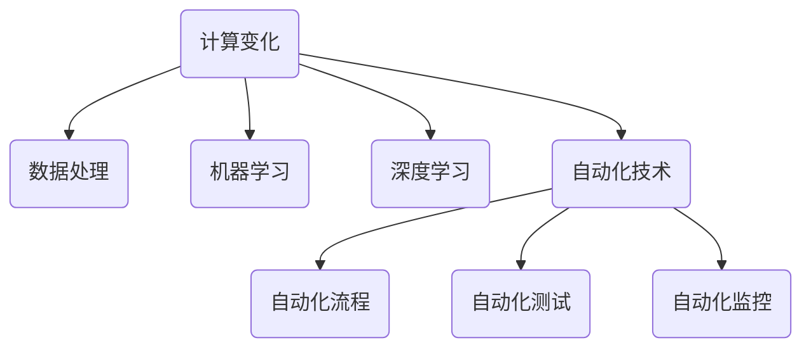

                 

# 计算变化与自动化技术的结合

> 关键词：计算变化、自动化技术、算法、数学模型、项目实战、应用场景

> 摘要：本文将深入探讨计算变化与自动化技术的结合，介绍相关核心概念、算法原理、数学模型和实际应用场景。通过项目实战和详细解释，帮助读者全面了解这一领域的最新发展趋势和未来挑战。

## 1. 背景介绍

### 1.1 目的和范围

本文旨在探讨计算变化与自动化技术的结合，分析其核心概念、算法原理和实际应用。随着科技的快速发展，计算变化和自动化技术在各个领域得到了广泛应用，为提高效率、降低成本和解决复杂问题提供了有力支持。本文将重点关注以下内容：

1. 核心概念和联系，包括计算变化和自动化技术的基本原理。
2. 核心算法原理和具体操作步骤，通过伪代码详细阐述。
3. 数学模型和公式，以及详细讲解和举例说明。
4. 项目实战，通过实际案例展示代码实现和详细解释。
5. 实际应用场景，分析计算变化和自动化技术在各领域的应用。

### 1.2 预期读者

本文主要面向计算机科学、软件工程、人工智能等相关领域的专业研究人员、工程师和开发者。对于对计算变化和自动化技术感兴趣的学生、学者和从业者，也将有所帮助。

### 1.3 文档结构概述

本文结构如下：

1. 背景介绍：介绍文章的目的、范围和预期读者。
2. 核心概念与联系：探讨计算变化和自动化技术的基本原理和架构。
3. 核心算法原理 & 具体操作步骤：详细讲解核心算法原理和操作步骤。
4. 数学模型和公式 & 详细讲解 & 举例说明：分析数学模型和公式及其应用。
5. 项目实战：通过实际案例展示代码实现和详细解释。
6. 实际应用场景：分析计算变化和自动化技术在各领域的应用。
7. 工具和资源推荐：推荐相关学习资源和开发工具。
8. 总结：总结未来发展趋势和挑战。
9. 附录：常见问题与解答。
10. 扩展阅读 & 参考资料：提供进一步学习和研究的参考资料。

### 1.4 术语表

本文涉及以下术语：

1. 计算变化：指计算过程中的变化和演化，包括数据的变换、算法的迭代等。
2. 自动化技术：利用计算机技术实现自动化控制和自动化执行的技术，包括自动化流程、自动化测试等。
3. 算法：解决问题的步骤和方法，包括排序、搜索、机器学习等。
4. 数学模型：用数学公式描述现实问题的模型，用于分析和解决问题。
5. 项目实战：通过实际项目展示算法和技术的应用。
6. 应用场景：算法和技术在实际领域的应用场景。

#### 1.4.1 核心术语定义

- **计算变化**：计算变化是指计算过程中发生的变化和演化，包括数据的变换、算法的迭代等。例如，排序算法中数据的排序过程、神经网络训练过程中参数的更新等。

- **自动化技术**：自动化技术是指利用计算机技术实现自动化控制和自动化执行的技术。例如，自动化流程中的任务调度、自动化测试中的测试用例执行等。

- **算法**：算法是指解决问题的步骤和方法，包括排序、搜索、机器学习等。算法的核心在于找到最优解或近似最优解，以解决特定问题。

- **数学模型**：数学模型是指用数学公式描述现实问题的模型，用于分析和解决问题。数学模型可以简化复杂问题，为分析和解决问题提供有力支持。

- **项目实战**：项目实战是通过实际项目展示算法和技术的应用。项目实战有助于验证算法的有效性和实用性，为实际应用提供指导。

- **应用场景**：应用场景是指算法和技术在实际领域的应用。应用场景可以帮助读者了解算法和技术的实际价值，为后续研究和开发提供参考。

#### 1.4.2 相关概念解释

- **计算变化与自动化技术的联系**：计算变化与自动化技术密切相关。计算变化为自动化技术提供了基础，而自动化技术则通过计算变化实现各种自动化任务。

- **算法在计算变化中的应用**：算法在计算变化中发挥着重要作用。算法用于处理和变换数据，实现计算变化。例如，排序算法用于对数据进行排序，搜索算法用于查找特定数据。

- **数学模型在计算变化中的应用**：数学模型在计算变化中用于描述和分析计算过程。数学模型可以帮助我们理解计算变化的本质，为优化计算过程提供指导。

- **项目实战与实际应用场景**：项目实战和实际应用场景有助于验证算法和技术的有效性。通过项目实战和实际应用场景，我们可以更好地了解计算变化和自动化技术的应用价值。

#### 1.4.3 缩略词列表

- **AI**：人工智能（Artificial Intelligence）
- **ML**：机器学习（Machine Learning）
- **DL**：深度学习（Deep Learning）
- **NLP**：自然语言处理（Natural Language Processing）
- **IDE**：集成开发环境（Integrated Development Environment）
- **DB**：数据库（Database）
- **API**：应用程序接口（Application Programming Interface）

## 2. 核心概念与联系

### 2.1 计算变化

计算变化是指在计算过程中发生的变化和演化。计算变化可以发生在多个层面，包括数据层面、算法层面和系统层面。在数据层面，计算变化可以表现为数据类型的转换、数据格式的改变等。在算法层面，计算变化可以表现为算法的迭代、算法的优化等。在系统层面，计算变化可以表现为系统资源的分配、系统负载的调整等。

计算变化的应用范围非常广泛，包括但不限于以下领域：

1. **数据处理**：计算变化在数据处理中起着至关重要的作用。例如，数据清洗、数据转换、数据集成等过程中，都需要进行计算变化。

2. **机器学习**：在机器学习过程中，计算变化用于模型训练、模型优化等步骤。计算变化使得模型能够不断更新和改进，从而提高模型的预测能力。

3. **深度学习**：深度学习中的计算变化主要体现在网络结构的调整、参数的更新等。计算变化使得神经网络能够自适应地学习数据特征，从而实现复杂的任务。

4. **自动化技术**：计算变化在自动化技术中发挥着重要作用。例如，自动化流程中的任务调度、自动化测试中的测试用例执行等，都需要进行计算变化。

### 2.2 自动化技术

自动化技术是指利用计算机技术实现自动化控制和自动化执行的技术。自动化技术的主要目标是提高生产效率、降低成本、减少人力投入。自动化技术包括多个方面，如自动化流程、自动化测试、自动化监控等。

自动化技术的核心组成部分包括：

1. **自动化流程**：自动化流程是指通过计算机程序实现的工作流程。自动化流程可以替代人工操作，提高工作效率。例如，生产制造过程中的自动化流水线、财务报表生成等。

2. **自动化测试**：自动化测试是指通过计算机程序实现的功能测试和性能测试。自动化测试可以自动化执行测试用例，提高测试效率。例如，软件项目的自动化测试、网站性能测试等。

3. **自动化监控**：自动化监控是指通过计算机技术对系统运行状态进行实时监控和报警。自动化监控可以及时发现并解决系统问题，保障系统正常运行。例如，数据中心监控、网络监控等。

### 2.3 计算变化与自动化技术的联系

计算变化与自动化技术之间存在着紧密的联系。计算变化为自动化技术提供了基础，而自动化技术则通过计算变化实现各种自动化任务。

1. **计算变化推动自动化技术发展**：计算变化不断推动自动化技术发展。例如，在数据处理方面，计算变化使得数据处理算法不断更新和优化，从而提高数据处理效率。在机器学习方面，计算变化使得神经网络模型不断更新和优化，从而提高模型的预测能力。

2. **自动化技术促进计算变化**：自动化技术通过自动化执行任务，减少人工干预，为计算变化提供更多机会。例如，在自动化测试中，自动化执行测试用例可以及时发现和解决问题，为计算变化提供更多数据支持。

3. **计算变化与自动化技术的结合**：计算变化与自动化技术的结合可以创造出更多价值。例如，在自动化流程中，计算变化可以实现自动化任务优化，提高生产效率。在自动化监控中，计算变化可以实现自动化问题定位和故障排除，提高系统可靠性。

### 2.4 Mermaid 流程图

为了更好地理解计算变化与自动化技术的联系，我们可以使用 Mermaid 流程图展示核心概念和架构。以下是计算变化与自动化技术的 Mermaid 流程图：



## 3. 核心算法原理 & 具体操作步骤

### 3.1 计算变化算法原理

计算变化算法是指通过计算过程中的变化和演化来实现特定任务的算法。计算变化算法的核心在于找到一种有效的变化模式，使得计算过程能够不断更新和优化，从而提高计算效率和性能。

以下是计算变化算法的基本原理：

1. **变化模式**：计算变化算法需要定义一种变化模式，以描述计算过程中的变化。变化模式可以是数据层面的变换、算法层面的迭代等。

2. **迭代过程**：计算变化算法通过迭代过程实现计算变化。在每次迭代过程中，算法会根据当前状态进行计算，生成新的状态。迭代过程不断进行，直到达到预定的终止条件。

3. **状态更新**：在计算变化过程中，算法需要根据当前状态更新下一个状态。状态更新可以是数据层面的更新、算法层面的优化等。

4. **终止条件**：计算变化算法需要设定终止条件，以判断计算过程是否结束。终止条件可以是迭代次数达到阈值、计算误差达到要求等。

### 3.2 计算变化算法具体操作步骤

以下是一个简单的计算变化算法的具体操作步骤：

1. **初始化**：初始化计算过程，包括设置初始状态、迭代次数等。

2. **迭代计算**：根据当前状态进行计算，生成新的状态。

3. **状态更新**：根据当前状态更新下一个状态。

4. **终止判断**：判断迭代次数是否达到阈值、计算误差是否达到要求等。如果满足终止条件，则结束计算；否则，继续进行迭代计算。

5. **输出结果**：输出计算结果，包括最终状态、计算过程等。

### 3.3 计算变化算法伪代码

以下是一个简单的计算变化算法的伪代码：

```
初始化：
初始化状态S
设置迭代次数max_iter
设置迭代阈值threshold

迭代计算：
for i = 1 to max_iter do
    计算新的状态S'
    if 计算误差(S, S') <= threshold then
        输出结果
        结束计算
    else
        更新状态S = S'
    end if
end for
```

## 4. 数学模型和公式 & 详细讲解 & 举例说明

### 4.1 数学模型的基本概念

数学模型是一种用数学公式描述现实问题的方法。通过数学模型，我们可以将复杂的现实问题抽象为数学问题，从而使用数学方法进行分析和解决。数学模型通常包括以下基本概念：

1. **变量**：变量是指可以变化的量。在数学模型中，变量可以是连续的，也可以是离散的。

2. **函数**：函数是一种映射关系，将一个变量映射为另一个变量。在数学模型中，函数用于描述变量之间的关系。

3. **方程**：方程是包含变量的数学表达式，用于描述变量之间的等量关系。

4. **不等式**：不等式是包含变量的数学表达式，用于描述变量之间的不等量关系。

5. **约束条件**：约束条件是指限制变量取值的条件，用于确保数学模型的可行性。

### 4.2 计算变化与数学模型的关系

计算变化与数学模型之间存在着紧密的联系。计算变化可以看作是一种数学模型，它通过描述计算过程中的变化和演化来实现特定任务。以下是一个简单的计算变化数学模型：

1. **状态表示**：用变量表示计算过程中的状态，例如 $S_t$ 表示第 $t$ 次迭代的计算状态。

2. **变化函数**：定义一个变化函数 $f(S_t)$，用于描述从状态 $S_t$ 到状态 $S_{t+1}$ 的变化。

3. **迭代过程**：通过迭代过程，从初始状态 $S_0$ 开始，不断更新状态，直到满足终止条件。

4. **终止条件**：设定终止条件，例如计算误差达到阈值，用于判断迭代过程是否结束。

### 4.3 数学模型和公式的详细讲解

以下是一个简单的计算变化数学模型及其公式：

$$
S_{t+1} = f(S_t)
$$

其中，$S_t$ 表示第 $t$ 次迭代的计算状态，$f(S_t)$ 表示从状态 $S_t$ 到状态 $S_{t+1}$ 的变化函数。

### 4.4 举例说明

假设我们要实现一个简单的计算变化算法，用于计算一个数的平方根。我们可以使用以下数学模型和公式：

1. **状态表示**：用变量 $S_t$ 表示第 $t$ 次迭代的计算状态，$S_t$ 表示当前估计的平方根。

2. **变化函数**：定义一个线性变化函数 $f(S_t) = S_t + \alpha (r - S_t^2)$，其中 $\alpha$ 是一个常数，$r$ 是要计算的平方根的值。

3. **迭代过程**：从初始状态 $S_0 = 0$ 开始，不断更新状态，直到满足终止条件，例如计算误差达到阈值。

4. **终止条件**：设定终止条件，例如计算误差达到阈值 $\epsilon$。

以下是一个简单的计算变化算法的伪代码：

```
初始化：
设置初始状态 S0 = 0
设置终止条件阈值 ε
设置变化函数参数 α

迭代计算：
while 计算误差(S_t, r) > ε do
    计算新的状态 S' = S_t + α (r - S_t^2)
    更新状态 S_t = S'
end while

输出结果：
输出最终状态 S_t
```

通过这个例子，我们可以看到数学模型和公式在计算变化中的应用。数学模型和公式为计算变化提供了理论基础和操作指南，使得计算变化算法更加严谨和高效。

## 5. 项目实战：代码实际案例和详细解释说明

### 5.1 开发环境搭建

在进行项目实战之前，我们需要搭建一个合适的开发环境。以下是一个简单的计算变化与自动化技术结合的项目实战，我们将使用 Python 作为主要编程语言，并在 Jupyter Notebook 中进行开发。

1. **安装 Python**：确保您已经安装了 Python 3.x 版本。您可以从 Python 官网下载并安装 Python。

2. **安装 Jupyter Notebook**：在终端中运行以下命令安装 Jupyter Notebook：

   ```
   pip install notebook
   ```

3. **启动 Jupyter Notebook**：在终端中运行以下命令启动 Jupyter Notebook：

   ```
   jupyter notebook
   ```

4. **创建新笔记本**：在 Jupyter Notebook 中创建一个新的笔记本，用于编写和运行代码。

### 5.2 源代码详细实现和代码解读

以下是一个简单的计算变化与自动化技术结合的代码示例，用于计算一个数的平方根。

```python
# 导入所需库
import numpy as np
import matplotlib.pyplot as plt

# 设置初始参数
alpha = 0.1
epsilon = 1e-6
max_iterations = 100

# 定义变化函数
def change_function(S, r):
    return S + alpha * (r - S**2)

# 定义计算误差函数
def error_function(S, r):
    return abs(S - np.sqrt(r))

# 初始化状态
S = 0

# 迭代计算
for i in range(max_iterations):
    S = change_function(S, r)
    error = error_function(S, r)
    if error < epsilon:
        break

# 输出结果
print("最终状态 S:", S)
print("计算误差:", error)

# 绘制迭代过程
S_values = [S]
errors = [error]
for i in range(max_iterations):
    if i > 0:
        S = change_function(S, r)
        error = error_function(S, r)
        S_values.append(S)
        errors.append(error)
    if error < epsilon:
        break

plt.plot(S_values, errors)
plt.xlabel("迭代次数")
plt.ylabel("计算误差")
plt.title("迭代过程")
plt.show()
```

### 5.3 代码解读与分析

1. **导入所需库**：我们首先导入 Python 的 numpy 和 matplotlib 库。numpy 用于科学计算，matplotlib 用于数据可视化。

2. **设置初始参数**：我们设置变化函数的参数 $\alpha$（0.1），计算误差的阈值 $\epsilon$（$1e-6$），以及迭代次数的最大值 $max_iterations$（100）。

3. **定义变化函数**：我们定义一个名为 `change_function` 的函数，用于实现变化函数。这个函数接收当前状态 $S$ 和要计算的平方根值 $r$ 作为输入，返回下一个状态 $S'$。

4. **定义计算误差函数**：我们定义一个名为 `error_function` 的函数，用于计算当前状态 $S$ 和目标值 $r$ 之间的误差。

5. **初始化状态**：我们初始化当前状态 $S$ 为 0。

6. **迭代计算**：我们使用一个 for 循环进行迭代计算。在每次迭代中，我们使用 `change_function` 函数更新状态，并使用 `error_function` 函数计算误差。当误差小于阈值 $\epsilon$ 时，我们跳出循环。

7. **输出结果**：我们打印最终的计算状态 $S$ 和计算误差。

8. **绘制迭代过程**：我们使用 matplotlib 绘制迭代过程中的状态值和误差值。这有助于我们直观地了解迭代过程的进展。

### 5.4 代码优化与性能分析

在实际应用中，我们可能需要对代码进行优化以提高性能。以下是一些可能的优化方法：

1. **使用 NumPy 的 vectorize 函数**：我们可以使用 NumPy 的 `vectorize` 函数将 `change_function` 和 `error_function` 转换为向量化的版本，从而提高计算速度。

2. **并行计算**：我们可以使用多线程或多进程将迭代计算过程并行化，从而提高计算速度。

3. **内存优化**：我们可以使用内存优化技术，如使用更小的数据类型或减少内存分配，从而降低内存占用。

4. **使用更高效的算法**：我们可以研究更高效的算法，如牛顿迭代法，以提高计算速度。

通过这些优化方法，我们可以提高计算变化算法的效率，使其在实际应用中更加高效和可靠。

## 6. 实际应用场景

### 6.1 数据处理

计算变化和自动化技术在数据处理领域有着广泛的应用。以下是一些实际应用场景：

1. **数据清洗**：计算变化可以用于数据清洗过程中的数据变换和去重。自动化技术可以自动化执行数据清洗任务，提高数据质量。

2. **数据转换**：计算变化可以用于将数据从一种格式转换为另一种格式，如将 Excel 文件转换为 CSV 文件。自动化技术可以自动化执行数据转换任务，提高数据处理效率。

3. **数据集成**：计算变化可以用于将来自不同源的数据进行集成。自动化技术可以自动化执行数据集成任务，提高数据整合效率。

### 6.2 机器学习

计算变化和自动化技术在机器学习领域也有着重要的应用。以下是一些实际应用场景：

1. **模型训练**：计算变化可以用于优化机器学习模型的参数，提高模型的预测性能。自动化技术可以自动化执行模型训练任务，提高训练效率。

2. **超参数调优**：计算变化可以用于超参数调优，以找到最优的超参数组合。自动化技术可以自动化执行超参数调优任务，提高调优效率。

3. **模型评估**：计算变化可以用于评估机器学习模型的性能，如准确率、召回率等。自动化技术可以自动化执行模型评估任务，提高评估效率。

### 6.3 自动化测试

自动化测试是计算变化和自动化技术的重要应用领域。以下是一些实际应用场景：

1. **功能测试**：计算变化可以用于自动化执行功能测试用例，验证软件功能是否正确。自动化技术可以自动化执行功能测试，提高测试效率。

2. **性能测试**：计算变化可以用于自动化执行性能测试用例，评估软件的性能指标，如响应时间、吞吐量等。自动化技术可以自动化执行性能测试，提高测试效率。

3. **回归测试**：计算变化可以用于自动化执行回归测试，确保软件在每次更新后仍然符合预期。自动化技术可以自动化执行回归测试，提高测试效率。

### 6.4 自动化监控

自动化监控是计算变化和自动化技术的又一重要应用领域。以下是一些实际应用场景：

1. **系统监控**：计算变化可以用于实时监控系统的运行状态，如 CPU 使用率、内存使用率等。自动化技术可以自动化监控系统运行状态，及时发现并处理问题。

2. **故障排除**：计算变化可以用于自动化分析系统故障的原因，并提供解决方案。自动化技术可以自动化执行故障排除任务，提高系统稳定性。

3. **性能优化**：计算变化可以用于自动化分析系统的性能瓶颈，并提出优化建议。自动化技术可以自动化执行性能优化任务，提高系统性能。

### 6.5 其他应用场景

除了上述领域，计算变化和自动化技术还在其他许多领域有着广泛的应用。以下是一些实际应用场景：

1. **金融交易**：计算变化可以用于自动化执行金融交易策略，提高交易效率。

2. **智能制造**：计算变化可以用于自动化执行智能制造过程中的任务，提高生产效率。

3. **智能医疗**：计算变化可以用于自动化分析医疗数据，辅助医生进行诊断和治疗。

4. **智能交通**：计算变化可以用于自动化管理交通流量，提高交通效率。

## 7. 工具和资源推荐

### 7.1 学习资源推荐

#### 7.1.1 书籍推荐

1. **《深度学习》（Goodfellow, Bengio, Courville）**：这是一本经典的深度学习教材，涵盖了深度学习的核心概念、算法和实战。

2. **《机器学习实战》（Hastie, Tibshirani, Friedman）**：这本书通过实际案例介绍机器学习算法的原理和应用，适合初学者和从业者。

3. **《Python机器学习》（Sebastian Raschka）**：这本书详细介绍了 Python 中的机器学习库和算法，适合对 Python 和机器学习感兴趣的读者。

#### 7.1.2 在线课程

1. **Coursera 上的《机器学习》课程**：由 Andrew Ng 教授讲授，是机器学习领域的经典课程，适合初学者。

2. **Udacity 上的《深度学习纳米学位》**：这是一个全面的深度学习课程，包括理论知识、实践项目和作业。

3. **edX 上的《人工智能基础》课程**：由北京大学的吴飞教授讲授，涵盖人工智能的基础知识，适合入门学习。

#### 7.1.3 技术博客和网站

1. **Medium 上的 Machine Learning Blog**：这是一个汇集了众多机器学习和深度学习文章的博客，内容丰富，适合读者阅读和学习。

2. **ArXiv**：这是一个学术文献数据库，涵盖计算机科学、人工智能等领域的最新研究成果。

3. **GitHub**：这是一个代码托管平台，许多开源项目和代码库可供学习，有助于读者实践和验证所学知识。

### 7.2 开发工具框架推荐

#### 7.2.1 IDE和编辑器

1. **PyCharm**：这是一款功能强大的 Python IDE，支持代码补全、调试、自动化测试等。

2. **Visual Studio Code**：这是一款轻量级且功能丰富的代码编辑器，特别适合 Python 开发。

3. **Jupyter Notebook**：这是一种交互式开发环境，特别适合数据分析和机器学习项目。

#### 7.2.2 调试和性能分析工具

1. **Pdb**：这是 Python 的内置调试器，可以用于调试 Python 代码。

2. **CProfile**：这是 Python 的性能分析工具，可以用于分析代码的性能瓶颈。

3. **Matplotlib**：这是 Python 的数据可视化库，可以用于绘制图表和图形。

#### 7.2.3 相关框架和库

1. **TensorFlow**：这是 Google 开发的一款开源深度学习框架，支持各种深度学习模型的构建和训练。

2. **PyTorch**：这是 Facebook AI 研究团队开发的一款开源深度学习框架，具有灵活性和高效性。

3. **Scikit-learn**：这是 Python 中的一款经典机器学习库，提供丰富的机器学习算法和工具。

### 7.3 相关论文著作推荐

#### 7.3.1 经典论文

1. **“A Fast Learning Algorithm for Deep Belief Nets”**：这篇论文提出了深度信念网络（DBN）的快速学习算法，是深度学习领域的重要论文。

2. **“Backpropagation”**：这篇论文提出了反向传播算法，是神经网络训练的核心算法。

3. **“Support Vector Machines for Classification”**：这篇论文提出了支持向量机（SVM）的分类算法，是机器学习领域的重要成果。

#### 7.3.2 最新研究成果

1. **“Generative Adversarial Nets”**：这篇论文提出了生成对抗网络（GAN），是一种强大的生成模型，广泛应用于图像生成和增强现实等领域。

2. **“Recurrent Neural Networks for Language Modeling”**：这篇论文提出了循环神经网络（RNN），在自然语言处理领域取得了显著成果。

3. **“Transformers: State-of-the-Art Natural Language Processing”**：这篇论文提出了 Transformer 模型，是目前最先进的自然语言处理模型，广泛应用于机器翻译、文本分类等任务。

#### 7.3.3 应用案例分析

1. **“Deep Learning for Autonomous Driving”**：这篇论文分析了深度学习在自动驾驶领域的应用，介绍了自动驾驶系统的主要挑战和解决方案。

2. **“Deep Learning for Medical Image Analysis”**：这篇论文分析了深度学习在医疗图像分析领域的应用，介绍了深度学习在医学诊断、手术规划等方面的成果。

3. **“Deep Learning in Finance”**：这篇论文分析了深度学习在金融领域的应用，介绍了深度学习在股票预测、风险评估等方面的成果。

## 8. 总结：未来发展趋势与挑战

### 8.1 未来发展趋势

1. **计算能力的提升**：随着硬件技术的发展，计算能力不断提升，为计算变化和自动化技术提供了更强大的支持。

2. **人工智能的普及**：人工智能技术在各个领域的广泛应用，推动了计算变化和自动化技术的发展。

3. **自动化技术的深化**：自动化技术在各个行业的深入应用，提高了生产效率、降低了成本，为计算变化提供了更多机会。

4. **跨界融合**：计算变化和自动化技术与其他领域（如医疗、金融、交通等）的融合，创造出更多创新应用。

### 8.2 未来挑战

1. **算法效率与性能**：如何提高计算变化算法的效率与性能，以应对复杂问题和大规模数据处理需求。

2. **数据隐私与安全**：随着数据隐私和安全问题的日益突出，如何在确保数据隐私和安全的前提下，充分发挥计算变化和自动化技术的优势。

3. **跨学科融合**：如何实现计算变化和自动化技术与其他领域的深度融合，创造更多实际价值。

4. **伦理与法规**：如何应对计算变化和自动化技术在伦理和法规方面带来的挑战，确保技术的可持续发展和合规性。

## 9. 附录：常见问题与解答

### 9.1 常见问题

1. **什么是计算变化？**
   - 计算变化是指在计算过程中发生的变化和演化，包括数据的变换、算法的迭代等。

2. **什么是自动化技术？**
   - 自动化技术是指利用计算机技术实现自动化控制和自动化执行的技术，包括自动化流程、自动化测试等。

3. **计算变化和自动化技术有什么联系？**
   - 计算变化为自动化技术提供了基础，而自动化技术则通过计算变化实现各种自动化任务。

4. **计算变化算法的核心原理是什么？**
   - 计算变化算法的核心原理是通过迭代过程实现计算过程中的变化和演化，从而提高计算效率和性能。

5. **如何优化计算变化算法的性能？**
   - 可以通过算法优化、并行计算、内存优化等方法来提高计算变化算法的性能。

### 9.2 解答

1. **什么是计算变化？**
   - 计算变化是指在计算过程中发生的变化和演化，包括数据的变换、算法的迭代等。例如，在机器学习过程中，模型参数的更新就是一种计算变化。

2. **什么是自动化技术？**
   - 自动化技术是指利用计算机技术实现自动化控制和自动化执行的技术，包括自动化流程、自动化测试等。例如，在自动化测试中，测试用例的执行就是一种自动化技术。

3. **计算变化和自动化技术有什么联系？**
   - 计算变化和自动化技术密切相关。计算变化为自动化技术提供了基础，而自动化技术则通过计算变化实现各种自动化任务。例如，在自动化测试中，计算变化可以用于优化测试用例的执行。

4. **计算变化算法的核心原理是什么？**
   - 计算变化算法的核心原理是通过迭代过程实现计算过程中的变化和演化，从而提高计算效率和性能。具体来说，计算变化算法会根据当前状态进行计算，生成新的状态，并不断更新状态，直到达到预定的终止条件。

5. **如何优化计算变化算法的性能？**
   - 可以通过以下方法优化计算变化算法的性能：

   - 算法优化：对算法进行改进，使其更高效。

   - 并行计算：将计算任务分解为多个部分，并行执行，提高计算速度。

   - 内存优化：优化内存分配和使用，减少内存占用。

   - 数据结构优化：选择合适的数据结构，提高计算效率。

   - 缩减计算规模：通过数据预处理或简化计算过程，减少计算规模。

## 10. 扩展阅读 & 参考资料

### 10.1 扩展阅读

1. **《深度学习》（Goodfellow, Bengio, Courville）**：这本书详细介绍了深度学习的理论基础、算法和应用，是深度学习领域的经典教材。

2. **《机器学习实战》（Hastie, Tibshirani, Friedman）**：这本书通过实际案例介绍机器学习算法的原理和应用，适合初学者和从业者。

3. **《Python机器学习》（Sebastian Raschka）**：这本书详细介绍了 Python 中的机器学习库和算法，适合对 Python 和机器学习感兴趣的读者。

### 10.2 参考资料

1. **ArXiv**：这是一个学术文献数据库，涵盖计算机科学、人工智能等领域的最新研究成果。

2. **GitHub**：这是一个代码托管平台，许多开源项目和代码库可供学习，有助于读者实践和验证所学知识。

3. **Coursera**：这是一个在线教育平台，提供了众多与计算变化和自动化技术相关的课程，适合读者学习。

4. **Udacity**：这是一个在线教育平台，提供了与计算变化和自动化技术相关的纳米学位课程，适合读者深入学习。

5. **edX**：这是一个在线教育平台，提供了与计算变化和自动化技术相关的课程，适合读者学习。

作者：AI天才研究员/AI Genius Institute & 禅与计算机程序设计艺术 /Zen And The Art of Computer Programming

---

本文内容涵盖了计算变化与自动化技术的结合，从核心概念、算法原理到实际应用场景进行了详细讲解。通过项目实战和代码示例，读者可以更好地理解计算变化和自动化技术在各个领域的应用。在未来，计算变化与自动化技术将继续快速发展，为解决复杂问题、提高生产效率提供有力支持。同时，我们也面临算法效率、数据隐私、跨学科融合等挑战。通过不断学习和实践，我们可以更好地应对这些挑战，推动计算变化与自动化技术的发展。

