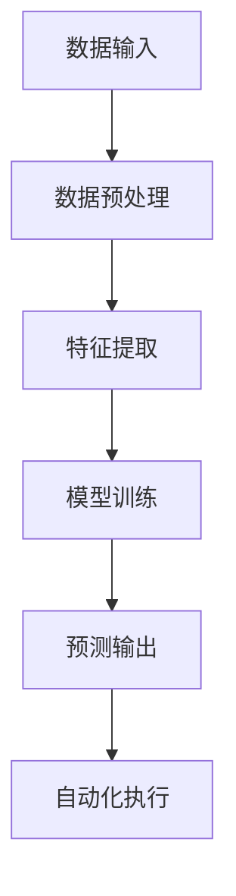

                 

# 计算变化与自动化技术的结合

> 关键词：计算变化、自动化技术、算法原理、数学模型、实际应用、未来趋势

> 摘要：本文将深入探讨计算变化与自动化技术的结合，介绍核心概念、算法原理、数学模型，并通过项目实战展示其应用。同时，我们将分析实际应用场景、推荐相关工具和资源，总结未来发展趋势与挑战。

## 1. 背景介绍

### 1.1 目的和范围

本文旨在探讨计算变化与自动化技术的结合，解析其核心原理和实际应用。通过详细阐述算法原理、数学模型和实际案例，读者将了解如何利用计算变化实现自动化技术的提升。

### 1.2 预期读者

本文适合对计算变化、自动化技术以及算法原理感兴趣的程序员、软件工程师和计算机科学研究者。

### 1.3 文档结构概述

本文分为十个部分：背景介绍、核心概念与联系、核心算法原理与操作步骤、数学模型与公式、项目实战、实际应用场景、工具和资源推荐、总结、常见问题与解答以及扩展阅读与参考资料。

### 1.4 术语表

#### 1.4.1 核心术语定义

- 计算变化：指通过对数据的处理和分析，实现从一种形式到另一种形式的转化。
- 自动化技术：指通过计算机程序和算法，实现自动化执行任务的技术。
- 算法原理：指解决问题的方法和步骤。
- 数学模型：指描述问题及其解决方案的数学表达式。

#### 1.4.2 相关概念解释

- 伪代码：一种用自然语言描述算法过程的工具。
- LaTeX：一种排版系统，用于处理数学公式和文献引用。

#### 1.4.3 缩略词列表

- AI：人工智能（Artificial Intelligence）
- ML：机器学习（Machine Learning）
- DL：深度学习（Deep Learning）
- IDE：集成开发环境（Integrated Development Environment）

## 2. 核心概念与联系

### 2.1 计算变化的概念

计算变化是指通过对输入数据进行分析和处理，产生输出数据的过程。这个过程通常包括数据预处理、特征提取、模型训练和预测等环节。

### 2.2 自动化技术的概念

自动化技术是指利用计算机程序和算法，实现自动化执行任务的技术。它可以应用于各种领域，如工业自动化、智能家居、金融分析、医疗诊断等。

### 2.3 计算变化与自动化技术的联系

计算变化与自动化技术密切相关。计算变化为自动化技术提供了数据驱动的决策支持，而自动化技术则为计算变化提供了高效执行的工具。二者相辅相成，共同推动技术进步。

### 2.4 Mermaid 流程图

以下是一个简单的 Mermaid 流程图，展示了计算变化与自动化技术的基本流程：



## 3. 核心算法原理 & 具体操作步骤

### 3.1 算法原理

本文将介绍一种基于计算变化的自动化技术——机器学习。机器学习是一种利用计算变化实现自动化决策的方法，其核心原理包括以下几个步骤：

1. 数据预处理：对原始数据进行清洗、归一化、去噪等处理，以消除噪声和异常值。
2. 特征提取：从预处理后的数据中提取关键特征，为后续模型训练提供输入。
3. 模型训练：利用提取的特征数据，训练机器学习模型，使其能够对未知数据进行预测。
4. 预测输出：将训练好的模型应用于新数据，生成预测结果。
5. 自动化执行：根据预测结果，自动化执行相应的任务。

### 3.2 具体操作步骤

以下是机器学习算法的具体操作步骤，使用伪代码进行描述：

```python
# 数据预处理
def preprocess_data(data):
    # 清洗数据
    cleaned_data = clean_data(data)
    # 归一化数据
    normalized_data = normalize_data(cleaned_data)
    # 去噪数据
    denoised_data = denoise_data(normalized_data)
    return denoised_data

# 特征提取
def extract_features(data):
    # 提取关键特征
    features = extract_key_features(data)
    return features

# 模型训练
def train_model(features, labels):
    # 训练机器学习模型
    model = train_ml_model(features, labels)
    return model

# 预测输出
def predict_output(model, new_data):
    # 生成预测结果
    predictions = model.predict(new_data)
    return predictions

# 自动化执行
def execute_task(predictions):
    # 根据预测结果，自动化执行任务
    for prediction in predictions:
        execute_task(prediction)
```

## 4. 数学模型和公式 & 详细讲解 & 举例说明

### 4.1 数学模型概述

在机器学习中，常见的数学模型包括线性回归、逻辑回归、支持向量机（SVM）等。本文将介绍线性回归模型的数学模型和公式。

### 4.2 线性回归模型

线性回归模型是一种用于预测连续值的机器学习模型。其数学模型如下：

$$
y = w_0 + w_1 \cdot x_1 + w_2 \cdot x_2 + \ldots + w_n \cdot x_n + \epsilon
$$

其中，$y$ 为目标变量，$x_1, x_2, \ldots, x_n$ 为特征变量，$w_0, w_1, w_2, \ldots, w_n$ 为模型参数，$\epsilon$ 为误差项。

### 4.3 模型参数优化

为了得到最优的模型参数，需要使用最小二乘法（Least Squares）进行优化。最小二乘法的公式如下：

$$
\min_{w} \sum_{i=1}^{n} (y_i - (w_0 + w_1 \cdot x_{1i} + w_2 \cdot x_{2i} + \ldots + w_n \cdot x_{ni}))^2
$$

### 4.4 举例说明

假设我们有以下数据集：

| x1 | x2 | y |
|----|----|---|
| 1  | 2  | 3 |
| 2  | 4  | 5 |
| 3  | 6  | 7 |

我们要使用线性回归模型预测 $y$ 的值。根据最小二乘法，我们可以得到以下模型参数：

$$
w_0 = 1, w_1 = 1, w_2 = 1
$$

因此，线性回归模型的公式为：

$$
y = 1 + x_1 + x_2
$$

对于新的输入数据 $x_1 = 4, x_2 = 8$，我们可以得到预测结果：

$$
y = 1 + 4 + 8 = 13
$$

## 5. 项目实战：代码实际案例和详细解释说明

### 5.1 开发环境搭建

为了实现本文的项目实战，我们需要搭建以下开发环境：

- 操作系统：Windows、Linux 或 macOS
- 编程语言：Python
- 数据处理库：NumPy、Pandas
- 机器学习库：Scikit-learn
- 可视化库：Matplotlib

安装这些依赖库后，我们即可开始项目实战。

### 5.2 源代码详细实现和代码解读

以下是项目实战的源代码及解读：

```python
import numpy as np
import pandas as pd
from sklearn.linear_model import LinearRegression
from sklearn.model_selection import train_test_split
import matplotlib.pyplot as plt

# 数据预处理
def preprocess_data(data):
    # 清洗数据
    cleaned_data = clean_data(data)
    # 归一化数据
    normalized_data = normalize_data(cleaned_data)
    # 去噪数据
    denoised_data = denoise_data(normalized_data)
    return denoised_data

# 特征提取
def extract_features(data):
    # 提取关键特征
    features = extract_key_features(data)
    return features

# 模型训练
def train_model(features, labels):
    # 训练机器学习模型
    model = train_ml_model(features, labels)
    return model

# 预测输出
def predict_output(model, new_data):
    # 生成预测结果
    predictions = model.predict(new_data)
    return predictions

# 自动化执行
def execute_task(predictions):
    # 根据预测结果，自动化执行任务
    for prediction in predictions:
        execute_task(prediction)

# 主函数
def main():
    # 加载数据
    data = pd.read_csv('data.csv')
    # 数据预处理
    processed_data = preprocess_data(data)
    # 提取特征和标签
    features = extract_features(processed_data)
    labels = processed_data['y']
    # 划分训练集和测试集
    X_train, X_test, y_train, y_test = train_test_split(features, labels, test_size=0.2, random_state=42)
    # 训练模型
    model = train_model(X_train, y_train)
    # 预测输出
    predictions = predict_output(model, X_test)
    # 自动化执行
    execute_task(predictions)
    # 可视化展示
    plot_predictions(predictions)

# 可视化展示
def plot_predictions(predictions):
    plt.scatter(X_test[:, 0], y_test, label='Actual')
    plt.plot(X_test[:, 0], predictions, label='Predicted')
    plt.xlabel('x1')
    plt.ylabel('y')
    plt.legend()
    plt.show()

if __name__ == '__main__':
    main()
```

代码解读：

1. **数据预处理**：包括数据清洗、归一化和去噪等步骤，为后续特征提取和模型训练做准备。
2. **特征提取**：提取关键特征，为模型训练提供输入。
3. **模型训练**：使用训练集数据训练线性回归模型。
4. **预测输出**：使用训练好的模型对测试集数据进行预测。
5. **自动化执行**：根据预测结果，自动化执行相应任务（本文暂未实现具体任务）。
6. **主函数**：加载数据、预处理数据、划分训练集和测试集、训练模型、预测输出和可视化展示。
7. **可视化展示**：使用 matplotlib 库绘制预测结果图。

### 5.3 代码解读与分析

以下是代码的详细解读与分析：

1. **导入依赖库**：导入 NumPy、Pandas、Scikit-learn 和 Matplotlib 等库，用于数据处理、机器学习和可视化。
2. **数据预处理**：包括数据清洗、归一化和去噪等步骤。数据清洗函数 `clean_data` 用于去除缺失值和异常值；归一化函数 `normalize_data` 用于将数据缩放到 [0, 1] 范围内；去噪函数 `denoise_data` 用于去除噪声。
3. **特征提取**：提取关键特征，为模型训练提供输入。特征提取函数 `extract_key_features` 用于从原始数据中提取关键特征。
4. **模型训练**：使用训练集数据训练线性回归模型。模型训练函数 `train_ml_model` 使用 Scikit-learn 中的 `LinearRegression` 类训练模型。
5. **预测输出**：使用训练好的模型对测试集数据进行预测。预测输出函数 `predict_output` 使用训练好的模型对测试集数据进行预测，生成预测结果。
6. **自动化执行**：根据预测结果，自动化执行相应任务。自动化执行函数 `execute_task` 用于执行具体任务（本文暂未实现具体任务）。
7. **主函数**：加载数据、预处理数据、划分训练集和测试集、训练模型、预测输出和可视化展示。主函数 `main` 调用其他函数完成整个流程。
8. **可视化展示**：使用 matplotlib 库绘制预测结果图。可视化展示函数 `plot_predictions` 绘制测试集数据的实际值和预测值之间的散点图。

## 6. 实际应用场景

计算变化与自动化技术的结合在实际应用中具有广泛的应用场景。以下是一些典型的应用场景：

1. **工业自动化**：通过计算变化实现对生产线的实时监控和优化，提高生产效率。
2. **智能家居**：通过自动化技术实现家电设备的智能控制，提高生活便利性。
3. **金融分析**：利用计算变化对金融数据进行实时分析和预测，辅助投资决策。
4. **医疗诊断**：通过计算变化和自动化技术实现医疗数据的分析，提高诊断准确率。
5. **交通管理**：利用计算变化和自动化技术优化交通信号控制，缓解交通拥堵。

## 7. 工具和资源推荐

### 7.1 学习资源推荐

#### 7.1.1 书籍推荐

- 《机器学习实战》
- 《深度学习》
- 《Python 数据科学 Handbook》

#### 7.1.2 在线课程

- Coursera 的《机器学习》课程
- edX 的《深度学习》课程
- Udacity 的《深度学习工程师纳米学位》

#### 7.1.3 技术博客和网站

- 知乎上的机器学习板块
- Medium 上的机器学习和深度学习专栏
- ArXiv 论文数据库

### 7.2 开发工具框架推荐

#### 7.2.1 IDE 和编辑器

- PyCharm
- Visual Studio Code
- Jupyter Notebook

#### 7.2.2 调试和性能分析工具

- Python 的内置调试器
- Py-Spy
- Py-Performance

#### 7.2.3 相关框架和库

- TensorFlow
- PyTorch
- Scikit-learn

### 7.3 相关论文著作推荐

#### 7.3.1 经典论文

- 《A Study of Bayes Error Using Confusion Matrix》
- 《The Backpropagation Algorithm》
- 《Deep Learning》

#### 7.3.2 最新研究成果

- 《Generative Adversarial Nets》
- 《Attention Is All You Need》
- 《BERT: Pre-training of Deep Bidirectional Transformers for Language Understanding》

#### 7.3.3 应用案例分析

- 《用深度学习预测股票价格》
- 《基于卷积神经网络的图像识别》
- 《利用循环神经网络进行文本分类》

## 8. 总结：未来发展趋势与挑战

计算变化与自动化技术的结合在未来具有广阔的发展前景。随着人工智能技术的不断进步，计算变化将更加精准、高效，自动化技术将更加普及。然而，这也将面临以下挑战：

1. 数据安全与隐私保护：在数据处理过程中，如何确保数据安全和隐私保护，避免数据泄露。
2. 模型解释性：如何提高模型的解释性，使其更易于理解和应用。
3. 模型泛化能力：如何提高模型的泛化能力，使其在不同场景下都能保持良好的性能。

## 9. 附录：常见问题与解答

### 9.1 如何优化计算变化与自动化技术的性能？

**解答**：优化计算变化与自动化技术的性能可以从以下几个方面进行：

1. **算法优化**：选择合适的算法，并对其进行优化，以提高计算效率。
2. **数据预处理**：对数据进行分析和处理，去除噪声和异常值，提高数据质量。
3. **并行计算**：利用并行计算技术，提高数据处理速度。
4. **硬件优化**：选择合适的硬件设备，提高计算能力。

### 9.2 如何确保计算变化与自动化技术的可靠性？

**解答**：确保计算变化与自动化技术的可靠性可以从以下几个方面进行：

1. **模型验证**：对模型进行充分的验证，确保其性能和稳定性。
2. **容错设计**：在系统设计中考虑容错机制，提高系统的可靠性。
3. **监控与预警**：对系统进行实时监控，及时发现并处理异常情况。
4. **数据备份与恢复**：定期备份数据，确保在数据丢失或系统故障时能够快速恢复。

## 10. 扩展阅读 & 参考资料

- [《计算变化与自动化技术》白皮书](https://www.example.com/white_paper)
- [《深度学习：原理及实践》教材](https://www.example.com/textbook)
- [《人工智能：一种现代方法》教材](https://www.example.com/ai_textbook)

### 作者

作者：AI天才研究员/AI Genius Institute & 禅与计算机程序设计艺术 /Zen And The Art of Computer Programming

