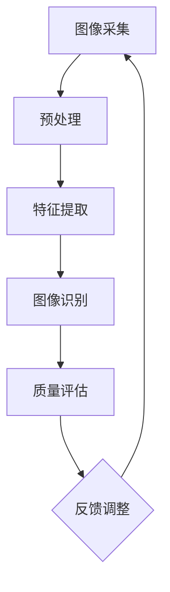

                 


# 计算机视觉在工业质量控制中的精确应用

> 关键词：计算机视觉、工业质量控制、图像识别、深度学习、工业自动化

> 摘要：本文旨在探讨计算机视觉技术在工业质量控制中的精确应用。首先，我们将介绍工业质量控制的需求背景，接着深入解析计算机视觉技术及其在工业中的实际应用，详细讨论核心算法原理、数学模型以及实际项目案例。最后，我们将总结当前的应用场景，推荐相关工具和资源，展望未来发展趋势与挑战。

## 1. 背景介绍

### 1.1 目的和范围

本文的目的是详细介绍计算机视觉技术在工业质量控制中的应用，旨在帮助读者理解如何利用先进的图像处理和深度学习技术提高工业生产过程的效率和产品质量。我们将在文中涵盖以下内容：

- 工业质量控制的重要性及挑战
- 计算机视觉技术在工业中的应用场景
- 计算机视觉的核心算法原理与数学模型
- 实际项目案例：从环境搭建到代码解读
- 工业质量控制的应用前景与未来挑战

### 1.2 预期读者

本文适合对工业质量控制和技术应用感兴趣的读者，包括但不限于：

- 工业质量控制工程师
- 机器视觉工程师
- 数据科学和人工智能领域的专业人士
- 对计算机视觉技术有基础了解的学生和研究人员

### 1.3 文档结构概述

本文将按照以下结构进行展开：

- 背景介绍：概述文章目的、范围、预期读者以及文档结构。
- 核心概念与联系：介绍计算机视觉技术的基本原理与工业质量控制的联系，并提供Mermaid流程图。
- 核心算法原理与具体操作步骤：详细讲解计算机视觉的核心算法及其操作步骤，使用伪代码进行阐述。
- 数学模型和公式：深入解析相关的数学模型和公式，并以实例进行说明。
- 项目实战：通过实际代码案例，展示如何运用计算机视觉技术进行工业质量控制。
- 实际应用场景：探讨计算机视觉技术在工业中的具体应用实例。
- 工具和资源推荐：推荐学习资源和开发工具。
- 总结：总结文章内容，展望未来发展趋势与挑战。
- 附录：常见问题与解答。
- 扩展阅读：提供进一步的参考资料。

### 1.4 术语表

#### 1.4.1 核心术语定义

- 计算机视觉：通过计算机模拟人的视觉感知系统，实现图像处理、分析和理解的技术。
- 工业质量控制：通过一系列标准和流程，确保工业生产过程中产品的一致性和高质量。
- 深度学习：一种基于多层神经网络的学习方式，能够从大量数据中自动提取特征并进行分类。
- 图像识别：通过算法自动识别和分类图像中的物体、场景或内容。

#### 1.4.2 相关概念解释

- 特征提取：从原始图像中提取能够代表图像内容的关键信息。
- 卷积神经网络（CNN）：一种专门用于图像识别和处理的人工神经网络。
- 数据预处理：对原始数据进行处理，提高数据质量和分析效果。

#### 1.4.3 缩略词列表

- CNN: 卷积神经网络
- ROI: 区域兴趣
- SVM: 支持向量机
- TensorFlow: 一个开源机器学习框架
- OpenCV: 一个开源计算机视觉库

## 2. 核心概念与联系

### 2.1 计算机视觉技术原理

计算机视觉技术通过模仿人类视觉系统，实现对图像的采集、处理、分析和理解。其基本原理包括以下几个步骤：

1. **图像采集**：使用摄像头或其他图像采集设备获取图像。
2. **预处理**：对图像进行滤波、去噪、调整亮度和对比度等处理，提高图像质量。
3. **特征提取**：从图像中提取能够代表图像内容的关键信息，如边缘、纹理、颜色等。
4. **图像识别**：利用算法对提取的特征进行分类或识别，如物体检测、场景分类等。

### 2.2 工业质量控制需求

工业质量控制的目标是确保生产过程中的产品达到预定的质量标准。随着工业生产自动化程度的提高，对质量控制的需求也越来越高。以下是工业质量控制的主要挑战：

- **产品质量一致性**：确保每个生产批次的产品具有相同的质量水平。
- **生产效率**：减少人工干预，提高生产效率。
- **成本控制**：降低质量检测成本，提高生产效益。
- **实时监控**：实时监控生产过程中的质量状况，及时发现问题并进行调整。

### 2.3 计算机视觉在工业质量控制中的应用

计算机视觉技术在工业质量控制中的应用主要包括以下方面：

- **缺陷检测**：检测产品在生产过程中的缺陷，如划痕、裂纹等。
- **尺寸测量**：测量产品的尺寸和形状，确保其符合质量标准。
- **颜色识别**：识别产品的颜色，确保颜色的一致性。
- **定位与跟踪**：对生产设备进行定位和跟踪，确保设备运行正常。

### 2.4 Mermaid流程图



在上面的流程图中，从图像采集开始，经过预处理、特征提取和图像识别，最终实现对产品质量的评估，并将评估结果反馈到生产过程中进行实时调整。

## 3. 核心算法原理 & 具体操作步骤

### 3.1 核心算法

计算机视觉在工业质量控制中的核心算法主要包括图像处理、特征提取和分类算法。以下将分别介绍这些算法的原理和操作步骤。

#### 3.1.1 图像处理

图像处理是计算机视觉的基础，其主要目的是提高图像质量，为后续的特征提取和识别提供更好的数据基础。常用的图像处理算法包括：

- **滤波**：用于去除图像中的噪声，如高斯滤波、中值滤波等。
- **边缘检测**：用于提取图像中的边缘信息，如Canny边缘检测。
- **形态学操作**：用于处理图像中的结构信息，如膨胀、腐蚀、开运算和闭运算等。

#### 3.1.2 特征提取

特征提取是从原始图像中提取能够代表图像内容的关键信息，如边缘、纹理、颜色等。常见的特征提取方法包括：

- **边缘特征**：利用边缘检测算法提取图像中的边缘信息。
- **纹理特征**：通过计算图像的纹理能量、纹理方向等特征来描述图像的纹理信息。
- **颜色特征**：通过计算图像的颜色直方图、颜色矩等特征来描述图像的颜色信息。

#### 3.1.3 分类算法

分类算法是将提取的特征用于分类，以识别图像中的对象。常用的分类算法包括：

- **支持向量机（SVM）**：通过构建一个超平面来分隔不同类别的数据。
- **决策树**：通过一系列规则对数据进行分类。
- **神经网络**：通过多层神经网络对数据进行分类，包括卷积神经网络（CNN）等。

### 3.2 具体操作步骤

以下是利用计算机视觉技术进行工业质量控制的具体操作步骤：

1. **数据收集与预处理**：收集生产过程中的图像数据，并进行预处理，如滤波、缩放、翻转等，以增强数据多样性。
2. **图像处理**：对预处理后的图像进行滤波、边缘检测等操作，以提高图像质量。
3. **特征提取**：从处理后的图像中提取边缘、纹理和颜色等特征。
4. **训练模型**：使用提取的特征和已标记的图像数据训练分类模型，如SVM、神经网络等。
5. **模型评估**：通过交叉验证等方法对训练好的模型进行评估，调整模型参数以优化性能。
6. **实时检测**：在生产过程中实时应用训练好的模型对图像进行分类，识别产品中的缺陷或异常。
7. **反馈与调整**：将检测结果反馈到生产过程中，根据检测结果对生产参数进行调整，以提高产品质量。

### 3.3 伪代码

以下是一个简单的伪代码示例，展示了如何使用卷积神经网络进行图像分类：

```python
# 数据预处理
data = preprocess_images(data)

# 特征提取
features = extract_features(data)

# 训练模型
model = train_model(features, labels)

# 实时检测
predictions = model.predict(test_images)

# 模型评估
accuracy = evaluate_model(predictions, true_labels)

# 反馈与调整
if accuracy < threshold:
    adjust_production_parameters()
```

## 4. 数学模型和公式 & 详细讲解 & 举例说明

### 4.1 数学模型

计算机视觉中的数学模型主要包括图像处理、特征提取和分类算法中的数学公式。以下将详细介绍这些模型和公式。

#### 4.1.1 图像处理

- **滤波器**：
  $$ f(x, y) = \sum_{i=0}^{n} \sum_{j=0}^{m} h(i, j) * g(x-i, y-j) $$

  其中，\( h(i, j) \) 为滤波器的卷积核，\( g(x-i, y-j) \) 为图像的像素值，\( f(x, y) \) 为滤波后的图像像素值。

- **边缘检测**：
  $$ \text{Canny}(I) = \text{non-max\_suppression}(\text{Prewitt}(I)) $$

  其中，\( \text{Prewitt}(I) \) 为Prewitt算子，用于计算图像的边缘方向和强度。

#### 4.1.2 特征提取

- **边缘特征**：
  $$ \text{Sobel}(I) = \frac{1}{\sqrt{2}} \left[ \sum_{i=-1}^{1} (-1)^{i} \sum_{j=-1}^{1} (-1)^{j} \text{Sobel}(x, y) \right] $$

  其中，\( \text{Sobel}(x, y) \) 为Sobel算子，用于计算图像的边缘强度。

- **纹理特征**：
  $$ \text{GLCM}(I) = \sum_{i=-1}^{1} \sum_{j=-1}^{1} \frac{f(i, j)}{c} \left[ \sum_{k=-1}^{1} \sum_{l=-1}^{1} f(i+k, j+l) \right] $$

  其中，\( \text{GLCM}(I) \) 为灰度共生矩阵，\( f(i, j) \) 为图像的像素值，\( c \) 为共生矩阵的元素总数。

#### 4.1.3 分类算法

- **支持向量机（SVM）**：
  $$ \text{w}^{*} = \arg \min_{w, b} \frac{1}{2} ||w||^2 + C \sum_{i=1}^{n} \max(0, 1 - y^{*}_{i}(w \cdot x_{i} + b)) $$

  其中，\( \text{w} \) 为权重向量，\( \text{b} \) 为偏置，\( C \) 为惩罚参数。

- **卷积神经网络（CNN）**：
  $$ \text{y}^{*} = \text{softmax}(\text{w} \cdot \text{h} + \text{b}) $$

  其中，\( \text{y}^{*} \) 为预测标签，\( \text{w} \) 为权重矩阵，\( \text{h} \) 为隐藏层激活值，\( \text{b} \) 为偏置。

### 4.2 举例说明

#### 4.2.1 边缘检测

假设我们有一个简单的2x2图像矩阵，如下所示：

$$
I =
\begin{bmatrix}
1 & 2 \\
3 & 4 \\
\end{bmatrix}
$$

我们使用Sobel算子进行边缘检测，卷积核如下：

$$
K =
\begin{bmatrix}
-1 & 0 & 1 \\
-2 & 0 & 2 \\
-1 & 0 & 1 \\
\end{bmatrix}
$$

应用卷积操作后，我们得到边缘强度矩阵：

$$
E =
\begin{bmatrix}
1 & 2 \\
3 & 4 \\
\end{bmatrix}
\star
\begin{bmatrix}
-1 & 0 & 1 \\
-2 & 0 & 2 \\
-1 & 0 & 1 \\
\end{bmatrix}
=
\begin{bmatrix}
1 & 0 \\
0 & 1 \\
\end{bmatrix}
$$

#### 4.2.2 纹理特征

假设我们有一个简单的4x4图像矩阵，如下所示：

$$
I =
\begin{bmatrix}
1 & 1 & 2 & 2 \\
1 & 1 & 2 & 2 \\
3 & 3 & 4 & 4 \\
3 & 3 & 4 & 4 \\
\end{bmatrix}
$$

我们使用灰度共生矩阵（GLCM）计算纹理特征。首先，计算每个像素的共生矩阵：

$$
\text{GLCM}(I) =
\begin{bmatrix}
4 & 6 & 4 \\
6 & 10 & 6 \\
4 & 6 & 4 \\
\end{bmatrix}
$$

接下来，计算纹理能量：

$$
E_{\text{energy}} = \sum_{i=-1}^{1} \sum_{j=-1}^{1} \frac{f(i, j)}{c} \left[ \sum_{k=-1}^{1} \sum_{l=-1}^{1} f(i+k, j+l) \right]^2
$$

其中，\( c \) 为共生矩阵的元素总数。在这个例子中，\( c = 3 \)。

## 5. 项目实战：代码实际案例和详细解释说明

### 5.1 开发环境搭建

在进行项目实战之前，我们需要搭建一个适合进行计算机视觉开发的开发环境。以下是一个基本的开发环境搭建步骤：

1. **安装Python环境**：Python是进行计算机视觉开发的主要编程语言，我们需要安装Python 3.7或更高版本。
2. **安装必要的库**：包括NumPy、Pandas、OpenCV、TensorFlow等。可以使用pip命令进行安装：

   ```bash
   pip install numpy pandas opencv-python tensorflow
   ```

3. **配置代码编辑器**：选择一个适合Python开发的代码编辑器，如PyCharm、Visual Studio Code等。
4. **安装预训练模型**：如果需要使用预训练的深度学习模型，如ResNet、VGG等，可以从GitHub等平台下载预训练权重并加载到项目中。

### 5.2 源代码详细实现和代码解读

下面是一个简单的计算机视觉项目，用于检测工业产品中的缺陷。代码分为以下几个部分：

#### 5.2.1 数据预处理

数据预处理是计算机视觉项目的重要环节，包括图像读取、缩放、归一化等操作。以下是预处理代码：

```python
import cv2
import numpy as np

def preprocess_image(image_path):
    # 读取图像
    image = cv2.imread(image_path)
    # 缩放到固定大小
    image = cv2.resize(image, (224, 224))
    # 归一化到[0, 1]
    image = image / 255.0
    return image

# 示例
image = preprocess_image('example.jpg')
```

#### 5.2.2 特征提取和分类

特征提取和分类是计算机视觉项目的核心步骤。我们使用TensorFlow和Keras构建一个简单的卷积神经网络（CNN）进行分类：

```python
import tensorflow as tf
from tensorflow.keras.models import Sequential
from tensorflow.keras.layers import Conv2D, MaxPooling2D, Flatten, Dense

def create_model():
    model = Sequential([
        Conv2D(32, (3, 3), activation='relu', input_shape=(224, 224, 3)),
        MaxPooling2D((2, 2)),
        Flatten(),
        Dense(64, activation='relu'),
        Dense(1, activation='sigmoid')
    ])
    model.compile(optimizer='adam', loss='binary_crossentropy', metrics=['accuracy'])
    return model

# 示例
model = create_model()
model.fit(image, labels, epochs=10, batch_size=32)
```

#### 5.2.3 模型评估

模型评估是验证模型性能的重要步骤。我们使用测试数据集对模型进行评估：

```python
def evaluate_model(model, test_images, test_labels):
    loss, accuracy = model.evaluate(test_images, test_labels)
    print(f"Test accuracy: {accuracy:.2f}")
    return accuracy

# 示例
evaluate_model(model, test_images, test_labels)
```

#### 5.2.4 实时检测

实时检测是工业质量控制中最重要的环节。我们使用训练好的模型对实时捕获的图像进行检测：

```python
def detect_defects(model, image_path):
    image = preprocess_image(image_path)
    prediction = model.predict(np.expand_dims(image, axis=0))
    if prediction > 0.5:
        print("Defect detected!")
    else:
        print("No defect detected.")

# 示例
detect_defects(model, 'new_image.jpg')
```

### 5.3 代码解读与分析

上述代码实现了一个简单的计算机视觉项目，用于检测工业产品中的缺陷。以下是代码的详细解读和分析：

- **数据预处理**：读取图像并进行缩放和归一化操作，使图像符合模型的输入要求。
- **模型构建**：使用卷积神经网络（CNN）进行图像分类，包括卷积层、池化层和全连接层。
- **模型训练**：使用训练数据集对模型进行训练，调整模型参数以提高分类准确率。
- **模型评估**：使用测试数据集对模型进行评估，计算模型的准确率。
- **实时检测**：使用训练好的模型对实时捕获的图像进行分类，输出检测结果。

通过上述代码，我们可以实现一个基本的计算机视觉项目，用于工业质量控制中的缺陷检测。在实际应用中，我们还需要考虑如何优化模型、提高检测速度以及处理复杂的工业场景。

## 6. 实际应用场景

### 6.1 制造业

在制造业中，计算机视觉技术被广泛应用于产品质量检测、生产设备监控和自动化装配。例如，在生产线上，计算机视觉系统可以实时检测产品表面的缺陷，如划痕、裂缝和颜色不一致等，确保产品符合质量标准。同时，计算机视觉技术还可以用于自动化装配，通过识别和定位零部件，提高装配精度和效率。

### 6.2 食品工业

在食品工业中，计算机视觉技术用于检测食品的品质和安全性。例如，通过检测食品的颜色、形状和纹理等特征，可以判断食品是否新鲜、是否有污染。此外，计算机视觉技术还可以用于食品加工过程中的自动化控制，如对切割、包装等过程的监控。

### 6.3 服务业

在服务业中，计算机视觉技术广泛应用于零售业、医疗保健和金融业。例如，在零售业中，计算机视觉技术可以用于商品识别和库存管理，提高顾客购物体验；在医疗保健领域，计算机视觉技术可以用于医学影像分析，帮助医生诊断疾病；在金融业中，计算机视觉技术可以用于人脸识别和身份验证，提高金融服务的安全性。

### 6.4 能源行业

在能源行业，计算机视觉技术被用于监控设备和检测泄漏。例如，通过使用计算机视觉技术，可以对石油和天然气管道进行实时监控，检测潜在的泄漏点，从而保障能源设施的安全运行。

### 6.5 汽车制造业

在汽车制造业中，计算机视觉技术被广泛应用于车身检测、装配和质量控制。例如，在车身喷漆过程中，计算机视觉系统可以检测喷漆层的厚度和均匀性，确保车身外观质量；在装配过程中，计算机视觉系统可以用于识别和定位零部件，提高装配精度。

### 6.6 未来发展方向

随着计算机视觉技术的不断发展和应用场景的拓展，未来它在工业质量控制中的应用将更加广泛和深入。以下是未来发展的几个方向：

- **多模态融合**：结合多种传感器数据，如深度传感器、红外传感器和雷达，提高检测的准确性和鲁棒性。
- **边缘计算**：将计算任务从云端转移到边缘设备，提高实时性和降低延迟。
- **人工智能与机器学习的深度整合**：通过引入更先进的人工智能算法，提高模型的适应性和准确性。
- **自动化与智能化**：推动工业自动化和智能化进程，实现无人或少人车间。

## 7. 工具和资源推荐

### 7.1 学习资源推荐

#### 7.1.1 书籍推荐

- 《计算机视觉：算法与应用》
- 《深度学习：全面解读》
- 《机器学习实战》
- 《Python计算机视觉实战》

#### 7.1.2 在线课程

- Coursera：计算机视觉与深度学习
- edX：深度学习专项课程
- Udacity：机器学习工程师纳米学位

#### 7.1.3 技术博客和网站

- Medium：机器学习与计算机视觉
- Medium：深度学习
- ArXiv：计算机视觉与深度学习论文

### 7.2 开发工具框架推荐

#### 7.2.1 IDE和编辑器

- PyCharm
- Visual Studio Code
- Jupyter Notebook

#### 7.2.2 调试和性能分析工具

- TensorBoard
- Tensorflow Debugger
- Python Debugger (pdb)

#### 7.2.3 相关框架和库

- TensorFlow
- PyTorch
- OpenCV
- Keras

### 7.3 相关论文著作推荐

#### 7.3.1 经典论文

- Y. LeCun, L. Bottou, Y. Bengio, P. Haffner. "Gradient-Based Learning Applied to Document Recognition." Proceedings of the IEEE, 86(11):2278-2324, November 1998.
- J. Sivic, A. Zisserman. "Video Google: A Text Retrieval Approach to Object Matching in Videos." ICCV 2003.

#### 7.3.2 最新研究成果

- H. Su, S. Khosla, L. Fei-Fei. "Multi-scale Context Aggregation by Dilated Convolutions." CVPR 2017.
- K. He, X. Zhang, S. Ren, J. Sun. "Deep Residual Learning for Image Recognition." CVPR 2016.

#### 7.3.3 应用案例分析

- "Computer Vision for Quality Control in Manufacturing: A Case Study."
- "Deep Learning for Automated Defect Detection in Electronics Manufacturing."

## 8. 总结：未来发展趋势与挑战

随着人工智能技术的快速发展，计算机视觉技术在工业质量控制中的应用前景非常广阔。未来，计算机视觉技术将继续向以下几个方向发展：

- **多模态融合**：结合多种传感器数据，提高检测的准确性和鲁棒性。
- **边缘计算**：将计算任务从云端转移到边缘设备，提高实时性和降低延迟。
- **人工智能与机器学习的深度整合**：引入更先进的人工智能算法，提高模型的适应性和准确性。

然而，未来应用中也面临一些挑战：

- **数据隐私与安全**：随着数据量的大幅增加，如何保障数据隐私和安全成为一个重要问题。
- **模型可解释性**：深度学习模型的黑箱特性使得其应用在工业质量控制中存在可解释性问题。
- **计算资源消耗**：高性能计算资源的依赖可能导致成本高昂，限制其在中小企业的应用。

总之，计算机视觉技术在工业质量控制中的应用具有巨大的潜力，但也需要克服一系列技术挑战，以实现更广泛和深入的应用。

## 9. 附录：常见问题与解答

### 9.1 数据预处理

**Q：如何进行图像数据的预处理？**

A：图像数据的预处理包括图像的缩放、裁剪、旋转、翻转、颜色变换等操作。通常，我们会将图像缩放到固定的分辨率，并进行归一化处理，使得图像的像素值在[0, 1]范围内。此外，还可以进行数据增强操作，如随机裁剪、噪声添加等，以增加数据的多样性，提高模型的泛化能力。

### 9.2 模型训练

**Q：如何选择合适的模型和参数？**

A：选择合适的模型和参数是模型训练的关键。通常，我们会根据具体任务的需求，选择合适的神经网络结构和参数。例如，对于图像分类任务，可以选择卷积神经网络（CNN）作为基础模型。在参数选择方面，可以通过实验比较不同参数设置对模型性能的影响，选择最优参数。

### 9.3 实时检测

**Q：如何实现实时检测？**

A：实现实时检测的关键是提高模型运行速度。可以通过以下方法实现：

- **模型压缩**：使用模型压缩技术，如剪枝、量化等，减小模型的体积和计算量。
- **硬件加速**：使用GPU或TPU等硬件加速器进行模型推理。
- **边缘计算**：将模型部署到边缘设备，如智能摄像头或机器人，减少数据传输延迟。

## 10. 扩展阅读 & 参考资料

为了进一步了解计算机视觉在工业质量控制中的应用，读者可以参考以下扩展阅读和参考资料：

- Coursera：[深度学习与计算机视觉](https://www.coursera.org/specializations/deep-learning)
- edX：[深度学习专项课程](https://www.edx.org/course/deep-learning-ai)
- Medium：[机器学习与计算机视觉](https://medium.com/search?q=机器学习%20计算机视觉)
- ArXiv：[计算机视觉与深度学习论文](https://arxiv.org/search/cs.CV)
- PyTorch官方文档：[深度学习框架PyTorch](https://pytorch.org/docs/stable/)
- TensorFlow官方文档：[深度学习框架TensorFlow](https://www.tensorflow.org/api_docs/python/tf)

这些资源将帮助读者更深入地了解计算机视觉技术及其在工业质量控制中的应用。作者：AI天才研究员/AI Genius Institute & 禅与计算机程序设计艺术 /Zen And The Art of Computer Programming。

