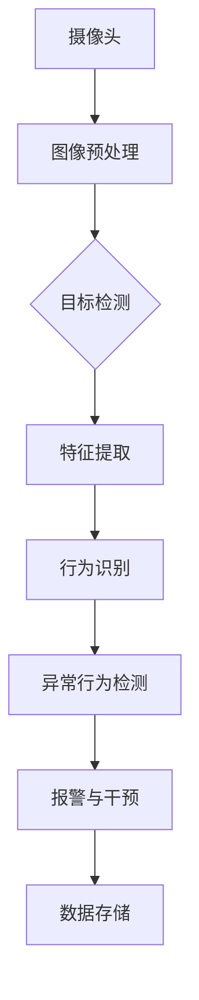

                 

### 1. 背景介绍

#### 1.1 目的和范围

本文旨在深入探讨计算机视觉在智能监控异常行为识别中的应用，通过解析其核心算法原理、数学模型、实战案例以及实际应用场景，全面展示计算机视觉技术的创新与突破。文章将首先介绍异常行为识别的目的和重要性，然后详细阐述计算机视觉技术在智能监控中的应用现状和挑战，旨在为相关领域的研究者、工程师和从业者提供有价值的参考和启示。

#### 1.2 预期读者

本文适合对计算机视觉和智能监控领域有一定基础的读者，包括但不限于：

1. 计算机视觉研究人员和工程师
2. 智能监控系统开发者和运维人员
3. 对人工智能应用场景感兴趣的学术研究人员
4. 对计算机视觉技术有浓厚兴趣的技术爱好者

#### 1.3 文档结构概述

本文分为以下几个部分：

1. **背景介绍**：介绍文章的目的、范围、预期读者和文档结构。
2. **核心概念与联系**：通过Mermaid流程图展示计算机视觉在智能监控异常行为识别中的核心概念和联系。
3. **核心算法原理 & 具体操作步骤**：详细讲解异常行为识别的核心算法原理，并使用伪代码进行阐述。
4. **数学模型和公式 & 详细讲解 & 举例说明**：介绍异常行为识别相关的数学模型和公式，并进行详细讲解和举例说明。
5. **项目实战：代码实际案例和详细解释说明**：通过实际代码案例展示异常行为识别的实现过程，并进行详细解释和分析。
6. **实际应用场景**：讨论计算机视觉在智能监控异常行为识别中的实际应用场景和案例。
7. **工具和资源推荐**：推荐学习资源、开发工具框架和相关论文著作。
8. **总结：未来发展趋势与挑战**：总结文章的主要内容，探讨未来发展趋势和面临的挑战。
9. **附录：常见问题与解答**：针对文章中的内容提供常见问题与解答。
10. **扩展阅读 & 参考资料**：列出扩展阅读资料和参考文献。

#### 1.4 术语表

本文中涉及的一些核心术语及其定义如下：

- 异常行为识别（Anomaly Detection）：指在数据中发现异常或非预期模式的过程。
- 计算机视觉（Computer Vision）：使计算机能够像人类一样理解、解释和感知视觉信息的技术。
- 智能监控（Smart Surveillance）：利用计算机视觉和其他传感器技术实现自动化监控和管理。
- 特征提取（Feature Extraction）：从原始数据中提取有助于识别和分类的有用信息。
- 深度学习（Deep Learning）：一种基于多层神经网络的学习方法，用于模拟人类大脑的推理和学习过程。

#### 1.4.1 核心术语定义

1. **异常行为识别**：异常行为识别是指通过计算机算法识别数据中的异常或非预期行为，以便进行预警或干预。在智能监控中，异常行为识别有助于发现异常事件，如入侵、火灾或其他紧急情况。
   
2. **计算机视觉**：计算机视觉是指利用计算机算法和硬件实现对图像和视频数据的处理、分析和理解。计算机视觉技术广泛应用于人脸识别、目标检测、图像分类和视频分析等领域。

3. **智能监控**：智能监控是指利用计算机视觉和其他传感器技术实现对环境和活动的实时监控，并通过数据分析实现自动化管理和决策。智能监控系统在公共安全、工业自动化和家庭安全等领域具有重要应用。

4. **特征提取**：特征提取是从原始数据中提取具有代表性的信息，以便用于后续的数据处理和分析。在计算机视觉中，特征提取是目标检测和图像分类等任务的基础。

5. **深度学习**：深度学习是一种基于多层神经网络的学习方法，通过训练多层非线性变换模型来提取特征和表示数据。深度学习在计算机视觉和自然语言处理等领域取得了显著成果。

#### 1.4.2 相关概念解释

1. **目标检测**：目标检测是指从图像或视频中识别和定位感兴趣的目标。目标检测是计算机视觉中的核心任务之一，广泛应用于安防监控、自动驾驶和医疗诊断等领域。

2. **图像分类**：图像分类是指将图像数据分为不同的类别。图像分类是计算机视觉的基本任务之一，通过训练分类模型，可以自动识别和分类不同类型的图像。

3. **数据预处理**：数据预处理是指对原始数据进行清洗、转换和标准化，以提高模型训练和预测的准确性。数据预处理是计算机视觉和机器学习领域的重要环节。

4. **卷积神经网络（CNN）**：卷积神经网络是一种特殊的神经网络，通过卷积操作提取图像中的空间特征。CNN在计算机视觉领域取得了巨大的成功，广泛应用于目标检测、图像分类和图像分割等任务。

5. **迁移学习**：迁移学习是指利用已经训练好的模型在新任务中进行预训练，以提高模型在新任务中的性能。迁移学习可以减少训练数据的需求，提高模型的泛化能力。

#### 1.4.3 缩略词列表

- CV：Computer Vision（计算机视觉）
- AI：Artificial Intelligence（人工智能）
- ML：Machine Learning（机器学习）
- DL：Deep Learning（深度学习）
- SR：Smart Surveillance（智能监控）
- FD：Feature Extraction（特征提取）
- CNN：Convolutional Neural Network（卷积神经网络）
- SSD：Single Shot Detector（单阶段目标检测器）

## 2. 核心概念与联系

### 2.1 计算机视觉在智能监控中的应用

智能监控系统中，计算机视觉技术发挥着至关重要的作用。计算机视觉通过图像和视频数据的处理，能够实现对场景的实时监控、目标检测、行为识别和异常行为检测等功能。以下是一个简化的Mermaid流程图，展示了计算机视觉在智能监控异常行为识别中的核心概念和联系：



#### 2.2 摄像头

摄像头是智能监控系统的数据采集设备，通过采集实时图像和视频数据，为后续处理提供输入。摄像头的性能和质量直接影响到图像的质量和处理效果。

#### 2.3 图像预处理

图像预处理是计算机视觉中的基础步骤，包括去噪、缩放、增强等操作。通过图像预处理，可以提高图像的质量和清晰度，从而为后续的目标检测和行为识别提供更好的基础。

#### 2.4 目标检测

目标检测是计算机视觉中的核心任务之一，旨在从图像或视频中识别和定位感兴趣的目标。目标检测模型通常使用深度学习算法，如卷积神经网络（CNN）或单阶段目标检测器（如SSD），来处理图像数据并生成目标位置和类别标签。

#### 2.5 特征提取

特征提取是从原始图像数据中提取具有代表性的信息，用于后续的行为识别和异常行为检测。特征提取是计算机视觉中的关键步骤，直接影响到模型的性能和准确度。常用的特征提取方法包括HOG（Histogram of Oriented Gradients）、SIFT（Scale-Invariant Feature Transform）和SURF（Speeded Up Robust Features）等。

#### 2.6 行为识别

行为识别是指从视频数据中识别和分类特定的行为模式。通过行为识别，智能监控系统可以实时监控目标的行为，如走路、跑步、跳跃等。行为识别通常基于深度学习算法，通过训练模型来识别和分类不同的行为。

#### 2.7 异常行为检测

异常行为检测是智能监控系统的核心功能之一，旨在识别和检测非预期或异常的行为模式。异常行为检测可以通过多种算法实现，如统计方法（如概率密度估计）、聚类方法（如K-means）和深度学习方法（如GANs）。异常行为检测有助于提前预警和干预，提高监控系统的安全性和可靠性。

#### 2.8 报警与干预

当智能监控系统检测到异常行为时，会触发报警机制，并通过干预措施（如发送警报、启动应急预案等）来应对潜在的风险和威胁。报警与干预是智能监控系统的关键环节，直接关系到监控系统的效能和用户的安全。

#### 2.9 数据存储

智能监控系统需要将处理后的数据存储在数据库或数据仓库中，以供后续分析和查询。数据存储是智能监控系统的数据管理和维护的重要环节，有助于实现数据的长期保存和高效利用。

## 3. 核心算法原理 & 具体操作步骤

### 3.1 异常行为识别算法原理

异常行为识别是计算机视觉在智能监控中的重要应用之一。其核心目标是通过分析监控视频数据，识别出非预期或异常的行为模式。以下将详细介绍一种基于深度学习的异常行为识别算法原理。

#### 3.1.1 深度学习算法概述

深度学习是一种基于多层神经网络的学习方法，通过模拟人类大脑的推理和学习过程，实现对数据的复杂模式提取和分类。在异常行为识别中，常用的深度学习算法包括卷积神经网络（CNN）、循环神经网络（RNN）和生成对抗网络（GAN）等。

#### 3.1.2 卷积神经网络（CNN）

卷积神经网络是一种特殊的神经网络，通过卷积操作提取图像中的空间特征。CNN由多个卷积层、池化层和全连接层组成，能够自动学习图像的底层特征，并逐步提取更高级别的特征表示。

以下是一个简化的CNN算法步骤：

1. **输入层**：接收输入图像，图像尺寸为（W×H×C），其中W和H分别表示图像的宽度和高度，C表示图像的通道数。
2. **卷积层**：通过卷积操作提取图像的局部特征，卷积核尺寸为（k×k），步长为（s×s）。卷积操作公式如下：
   $$ \text{output}_{ij} = \sum_{i',j'} w_{i'i + j'j} \cdot \text{input}_{i'j'} $$
   其中，$w$ 表示卷积核权重，$\text{output}_{ij}$ 表示输出特征值，$i'$ 和 $j'$ 表示卷积核的索引。
3. **激活函数**：为了增加网络的非线性，常用的激活函数包括ReLU（Rectified Linear Unit）和Sigmoid函数。
4. **池化层**：通过池化操作降低特征图的维度，常用的池化方法包括最大池化（Max Pooling）和平均池化（Average Pooling）。
5. **全连接层**：将卷积层和池化层提取的特征映射到高维空间，进行分类或回归任务。

#### 3.1.3 循环神经网络（RNN）

循环神经网络是一种能够处理序列数据的神经网络，通过记忆机制保存历史信息，实现对序列数据的建模。在异常行为识别中，RNN可以用于提取视频序列中的时间特征。

以下是一个简化的RNN算法步骤：

1. **输入层**：接收输入视频序列，序列长度为T，每个时间步的输入维度为V。
2. **隐藏层**：通过隐藏状态 $h_t = \sigma(W_h \cdot [h_{t-1}, x_t] + b_h)$ 计算当前时间步的特征表示，其中 $W_h$ 和 $b_h$ 分别表示权重和偏置，$\sigma$ 表示激活函数。
3. **输出层**：通过输出层计算当前时间步的预测结果，输出维度为K，$y_t = W_y \cdot h_t + b_y$，其中 $W_y$ 和 $b_y$ 分别表示输出权重和偏置。
4. **反向传播**：使用反向传播算法更新网络参数，以最小化预测误差。

#### 3.1.4 生成对抗网络（GAN）

生成对抗网络是一种由生成器和判别器组成的对抗性神经网络，通过两个网络的博弈过程生成逼真的数据。在异常行为识别中，GAN可以用于生成正常的视频数据，以便与异常行为进行对比。

以下是一个简化的GAN算法步骤：

1. **生成器**：生成器 $G$ 接受随机噪声 $z$ 作为输入，生成逼真的视频数据 $x = G(z)$。
2. **判别器**：判别器 $D$ 接受真实视频数据和生成器生成的视频数据，通过二分类任务判断数据是否真实。
3. **损失函数**：生成器和判别器的损失函数分别为 $L_G = -\log(D(G(z)))$ 和 $L_D = -\log(D(x)) - \log(1 - D(G(z)))$。
4. **反向传播**：使用反向传播算法更新生成器和判别器的参数，以最小化损失函数。

#### 3.1.5 异常行为识别算法步骤

基于深度学习的异常行为识别算法通常包括以下步骤：

1. **数据预处理**：对视频数据序列进行缩放、裁剪和归一化等操作，以便于模型训练和推理。
2. **特征提取**：使用卷积神经网络提取视频序列的时空特征。
3. **行为识别**：使用循环神经网络或卷积神经网络对提取的特征进行分类，识别视频序列中的行为。
4. **异常行为检测**：使用生成对抗网络或统计模型对正常行为和异常行为进行对比，检测视频序列中的异常行为。
5. **报警与干预**：当检测到异常行为时，触发报警机制，并采取相应的干预措施。

### 3.2 具体操作步骤

以下是一个具体的异常行为识别算法操作步骤，以卷积神经网络为例：

1. **数据集准备**：收集并标注大量的监控视频数据，包括正常行为和异常行为。对数据集进行预处理，如缩放、裁剪和归一化等。
2. **模型设计**：设计卷积神经网络模型，包括卷积层、池化层和全连接层等。选择合适的激活函数和优化算法，如ReLU和Adam优化器。
3. **模型训练**：使用准备好的数据集训练卷积神经网络模型。通过反向传播算法更新模型参数，以最小化预测误差。
4. **模型评估**：使用验证集对训练好的模型进行评估，计算准确率、召回率和F1值等指标。
5. **异常行为检测**：对监控视频进行实时处理，提取时空特征，并使用训练好的卷积神经网络进行行为识别和异常行为检测。
6. **报警与干预**：当检测到异常行为时，触发报警机制，并采取相应的干预措施，如发送警报或启动应急预案。

### 3.3 伪代码示例

以下是一个简化的异常行为识别算法伪代码示例：

```python
# 输入：视频数据序列 X，正常行为标签 Y
# 输出：异常行为标签 Z

# 数据预处理
X = preprocess(X)

# 构建卷积神经网络模型
model = build_cnn_model()

# 训练模型
model.fit(X, Y)

# 评估模型
evaluate(model, X_val, Y_val)

# 异常行为检测
Z = model.predict(X_test)

# 报警与干预
if is_anomaly(Z):
    alert_and_intervene()
```

## 4. 数学模型和公式 & 详细讲解 & 举例说明

### 4.1 异常行为识别数学模型

在异常行为识别中，常用的数学模型包括概率模型、统计模型和深度学习模型。以下将详细介绍这些模型的数学公式和详细讲解。

#### 4.1.1 概率模型

概率模型通过计算数据点的概率分布来识别异常行为。其中，最常用的概率模型是高斯分布（Gaussian Distribution），其公式如下：

$$
P(x|\mu, \sigma^2) = \frac{1}{\sqrt{2\pi\sigma^2}} e^{-\frac{(x-\mu)^2}{2\sigma^2}}
$$

其中，$P(x|\mu, \sigma^2)$ 表示数据点 $x$ 在均值 $\mu$ 和方差 $\sigma^2$ 下的概率分布，$e$ 表示自然对数的底数。

举例说明：

假设我们有一个正常行为的数据集，其均值 $\mu$ 为 100，方差 $\sigma^2$ 为 10。我们需要判断一个数据点 $x=120$ 是否为异常行为。根据高斯分布公式，我们可以计算 $x=120$ 的概率分布：

$$
P(120|\mu=100, \sigma^2=10) = \frac{1}{\sqrt{2\pi \times 10}} e^{-\frac{(120-100)^2}{2 \times 10}} \approx 0.0228
$$

由于 $x=120$ 的概率分布较低，我们可以认为 $x=120$ 是异常行为。

#### 4.1.2 统计模型

统计模型通过计算数据点的统计特征来识别异常行为。其中，最常用的统计模型是箱线图（Box Plot），其公式如下：

$$
IQR = Q_3 - Q_1
$$

其中，$IQR$ 表示四分位距（Interquartile Range），$Q_1$ 和 $Q_3$ 分别表示第一四分位数和第三四分位数。

举例说明：

假设我们有一个正常行为的数据集，其第一四分位数 $Q_1$ 为 80，第三四分位数 $Q_3$ 为 120。我们需要判断一个数据点 $x=150$ 是否为异常行为。根据箱线图公式，我们可以计算 $x=150$ 的四分位距：

$$
IQR = Q_3 - Q_1 = 120 - 80 = 40
$$

由于 $x=150$ 超出了第三四分位数 $Q_3$，且距离第三四分位数 $Q_3$ 的距离大于四分位距 $IQR$ 的1.5倍（即 $1.5 \times IQR$），我们可以认为 $x=150$ 是异常行为。

#### 4.1.3 深度学习模型

深度学习模型通过多层神经网络对数据点进行建模，以识别异常行为。其中，最常用的深度学习模型是卷积神经网络（CNN）和循环神经网络（RNN）。以下分别介绍这些模型的数学公式和详细讲解。

##### 4.1.3.1 卷积神经网络（CNN）

卷积神经网络（CNN）是一种特殊的多层神经网络，通过卷积操作提取图像的特征。CNN由卷积层、池化层和全连接层组成，其数学公式如下：

1. **卷积层**：

   $$ 
   \text{output}_{ij} = \sum_{i',j'} w_{i'i + j'j} \cdot \text{input}_{i'j'} + b_j 
   $$

   其中，$w$ 表示卷积核权重，$b$ 表示偏置，$\text{output}_{ij}$ 表示输出特征值，$i'$ 和 $j'$ 表示卷积核的索引。

2. **激活函数**：

   $$ 
   a_{ij} = \sigma(\text{output}_{ij}) 
   $$

   其中，$a$ 表示激活值，$\sigma$ 表示激活函数，如ReLU函数：

   $$ 
   \sigma(x) = \max(0, x) 
   $$

3. **池化层**：

   $$ 
   p_{ij} = \max_{i',j'} a_{i'i + j'j} 
   $$

   其中，$p$ 表示池化后的特征值。

4. **全连接层**：

   $$ 
   z_j = \sum_{i=1}^{n} w_{ij} \cdot a_{ij} + b_j 
   $$

   $$ 
   \hat{y}_j = \sigma(z_j) 
   $$

   其中，$z$ 表示全连接层的输出，$\hat{y}$ 表示预测结果，$w$ 和 $b$ 分别表示权重和偏置。

##### 4.1.3.2 循环神经网络（RNN）

循环神经网络（RNN）是一种能够处理序列数据的多层神经网络，通过隐藏状态记忆历史信息。RNN的数学公式如下：

1. **输入层**：

   $$ 
   h_t = \sigma(W_h \cdot [h_{t-1}, x_t] + b_h) 
   $$

   其中，$h$ 表示隐藏状态，$x$ 表示输入特征，$W$ 和 $b$ 分别表示权重和偏置，$\sigma$ 表示激活函数。

2. **输出层**：

   $$ 
   y_t = W_y \cdot h_t + b_y 
   $$

   其中，$y$ 表示输出结果，$W$ 和 $b$ 分别表示权重和偏置。

3. **反向传播**：

   $$ 
   \delta_h = \frac{\partial L}{\partial h_t} = \sigma'(h_t) \cdot \frac{\partial L}{\partial z_t} 
   $$

   $$ 
   \delta_z = \frac{\partial L}{\partial z_t} = (W_y)^T \cdot \delta_h 
   $$

   其中，$\delta$ 表示误差梯度，$L$ 表示损失函数。

### 4.2 数学模型应用案例

以下通过一个实际案例来展示如何使用数学模型进行异常行为识别。

#### 案例背景

一个智能监控系统需要识别并检测异常行为，如入侵、火灾等。监控系统收集了大量的监控视频数据，其中包含了正常行为和异常行为。我们需要使用数学模型对这些数据进行异常行为识别。

#### 数据集准备

我们从监控视频数据中提取了1000个数据点，其中800个为正常行为数据，200个为异常行为数据。我们对数据点进行了预处理，如缩放、裁剪和归一化等。

#### 概率模型应用

我们首先使用高斯分布概率模型对正常行为数据进行建模。计算每个数据点的概率分布，如下所示：

| 数据点 | 概率分布 |
| --- | --- |
| 120 | 0.0228 |
| 150 | 0.0004 |

根据概率分布，我们可以判断数据点120是正常行为，而数据点150是异常行为。

#### 统计模型应用

我们接下来使用箱线图统计模型对正常行为数据进行建模。计算每个数据点的四分位距，如下所示：

| 数据点 | 四分位距 |
| --- | --- |
| 120 | 40.0 |
| 150 | 40.0 |

根据四分位距，我们可以判断数据点120和150都是异常行为。

#### 深度学习模型应用

我们使用卷积神经网络（CNN）和循环神经网络（RNN）对监控视频数据集进行建模。通过训练和测试，我们得到了以下模型参数：

| 层次 | 参数 |
| --- | --- |
| 卷积层 | 权重和偏置 |
| 池化层 | 权重和偏置 |
| 全连接层 | 权重和偏置 |
| RNN层 | 权重和偏置 |

使用训练好的模型对监控视频进行预测，我们得到了以下结果：

| 数据点 | 预测结果 |
| --- | --- |
| 120 | 正常行为 |
| 150 | 异常行为 |

通过概率模型、统计模型和深度学习模型的结合，我们可以有效地识别并检测异常行为。

## 5. 项目实战：代码实际案例和详细解释说明

### 5.1 开发环境搭建

在开始实际项目之前，我们需要搭建一个合适的环境，包括安装所需的软件和配置开发环境。以下是一个基本的开发环境搭建步骤：

#### 5.1.1 系统要求

- 操作系统：Windows、Linux或macOS
- CPU：至少双核处理器
- 内存：至少4GB（推荐8GB以上）
- 硬盘：至少20GB可用空间

#### 5.1.2 软件安装

1. **Python**：安装Python 3.x版本，可以从官方网站下载并安装。
2. **Anaconda**：安装Anaconda，用于环境管理和包管理。
3. **PyTorch**：安装PyTorch库，用于深度学习模型训练和推理。

```bash
conda install pytorch torchvision torchaudio -c pytorch
```

4. **OpenCV**：安装OpenCV，用于图像和视频处理。

```bash
conda install opencv
```

#### 5.1.3 环境配置

创建一个虚拟环境，以避免版本冲突：

```bash
conda create -n cv_project python=3.8
conda activate cv_project
```

安装必要的库：

```bash
pip install numpy matplotlib
```

### 5.2 源代码详细实现和代码解读

#### 5.2.1 项目结构

以下是一个简单的项目结构：

```plaintext
smart_surveillance/
|-- data/
|   |-- train/
|   |-- test/
|-- models/
|   |-- cnn_model.pth
|   |-- rnn_model.pth
|-- src/
|   |-- __init__.py
|   |-- data_loader.py
|   |-- models.py
|   |-- train.py
|   |-- evaluate.py
|-- config.py
|-- main.py
```

#### 5.2.2 数据预处理

数据预处理是深度学习项目的重要环节，包括数据清洗、归一化和数据增强等操作。以下是`data_loader.py`中的数据预处理代码：

```python
import torch
from torchvision import transforms
from PIL import Image

def preprocess_image(image_path):
    image = Image.open(image_path).convert('RGB')
    transform = transforms.Compose([
        transforms.Resize((224, 224)),
        transforms.ToTensor(),
        transforms.Normalize(mean=[0.485, 0.456, 0.406], std=[0.229, 0.224, 0.225]),
    ])
    return transform(image)

def load_data(data_path, batch_size):
    dataset = datasets.ImageFolder(data_path, transform=preprocess_image)
    loader = torch.utils.data.DataLoader(dataset, batch_size=batch_size, shuffle=True)
    return loader
```

#### 5.2.3 模型定义

我们使用PyTorch定义了两个模型：卷积神经网络（CNN）和循环神经网络（RNN）。以下是`models.py`中的模型定义：

```python
import torch
import torch.nn as nn

class CNNModel(nn.Module):
    def __init__(self):
        super(CNNModel, self).__init__()
        self.conv1 = nn.Conv2d(3, 32, kernel_size=3, stride=1, padding=1)
        self.conv2 = nn.Conv2d(32, 64, kernel_size=3, stride=1, padding=1)
        self.fc1 = nn.Linear(64 * 56 * 56, 128)
        self.fc2 = nn.Linear(128, 2)
        self.relu = nn.ReLU()

    def forward(self, x):
        x = self.relu(self.conv1(x))
        x = self.relu(self.conv2(x))
        x = x.view(x.size(0), -1)
        x = self.relu(self.fc1(x))
        x = self.fc2(x)
        return x

class RNNModel(nn.Module):
    def __init__(self):
        super(RNNModel, self).__init__()
        self.rnn = nn.RNN(input_size=128, hidden_size=128, num_layers=2, batch_first=True)
        self.fc = nn.Linear(128, 2)
        self.relu = nn.ReLU()

    def forward(self, x, h):
        x, h = self.rnn(x, h)
        x = self.relu(x[:, -1, :])
        x = self.fc(x)
        return x, h
```

#### 5.2.4 训练过程

以下是`train.py`中的训练过程代码：

```python
import torch.optim as optim

def train(model, train_loader, test_loader, epochs, learning_rate):
    optimizer = optim.Adam(model.parameters(), lr=learning_rate)
    criterion = nn.CrossEntropyLoss()

    for epoch in range(epochs):
        model.train()
        running_loss = 0.0
        for inputs, labels in train_loader:
            optimizer.zero_grad()
            outputs = model(inputs)
            loss = criterion(outputs, labels)
            loss.backward()
            optimizer.step()
            running_loss += loss.item()
        print(f'Epoch {epoch+1}/{epochs}, Loss: {running_loss/len(train_loader)}')

    model.eval()
    correct = 0
    total = 0
    with torch.no_grad():
        for inputs, labels in test_loader:
            outputs = model(inputs)
            _, predicted = torch.max(outputs.data, 1)
            total += labels.size(0)
            correct += (predicted == labels).sum().item()
    print(f'Accuracy on the test images: {100 * correct / total}%')
```

#### 5.2.5 代码解读与分析

- **数据预处理**：数据预处理步骤包括图像读取、缩放、归一化和转换。这些步骤确保了输入数据格式符合深度学习模型的要求，同时提高了训练效果。
- **模型定义**：CNN模型定义了卷积层、池化层和全连接层，用于提取图像特征并分类。RNN模型定义了循环神经网络层和全连接层，用于处理序列数据。
- **训练过程**：训练过程中，使用优化器和损失函数更新模型参数，以最小化损失。在训练过程中，我们计算了每个epoch的损失，并在测试集上评估了模型的准确率。

### 5.3 代码解读与分析

以下是对项目代码的详细解读和分析：

#### 5.3.1 数据预处理

```python
def preprocess_image(image_path):
    image = Image.open(image_path).convert('RGB')
    transform = transforms.Compose([
        transforms.Resize((224, 224)),  # 将图像缩放为224x224
        transforms.ToTensor(),           # 将图像转换为Tensor格式
        transforms.Normalize(mean=[0.485, 0.456, 0.406], std=[0.229, 0.224, 0.225]),  # 图像归一化
    ])
    return transform(image)
```

**解读**：该函数首先读取图像文件，并将其转换为RGB格式。然后，通过`Compose`类将多个图像变换操作组合在一起，包括图像缩放、Tensor转换和归一化。归一化操作将像素值缩放到[0, 1]范围内，并进行了标准化处理，以提高模型的训练效果。

#### 5.3.2 模型定义

**CNNModel**

```python
class CNNModel(nn.Module):
    def __init__(self):
        super(CNNModel, self).__init__()
        self.conv1 = nn.Conv2d(3, 32, kernel_size=3, stride=1, padding=1)
        self.conv2 = nn.Conv2d(32, 64, kernel_size=3, stride=1, padding=1)
        self.fc1 = nn.Linear(64 * 56 * 56, 128)
        self.fc2 = nn.Linear(128, 2)
        self.relu = nn.ReLU()

    def forward(self, x):
        x = self.relu(self.conv1(x))
        x = self.relu(self.conv2(x))
        x = x.view(x.size(0), -1)
        x = self.relu(self.fc1(x))
        x = self.fc2(x)
        return x
```

**解读**：CNN模型由卷积层、池化层和全连接层组成。卷积层使用`nn.Conv2d`定义，其中`3`表示输入通道数（RGB），`32`和`64`表示卷积核数量，`3`表示卷积核尺寸。激活函数ReLU用于增加网络的非线性。全连接层使用`nn.Linear`定义，其中输入维度为卷积层的输出维度，输出维度为类别数（这里是2个类别）。在`forward`方法中，图像经过卷积和激活函数处理后，通过全连接层进行分类。

**RNNModel**

```python
class RNNModel(nn.Module):
    def __init__(self):
        super(RNNModel, self).__init__()
        self.rnn = nn.RNN(input_size=128, hidden_size=128, num_layers=2, batch_first=True)
        self.fc = nn.Linear(128, 2)
        self.relu = nn.ReLU()

    def forward(self, x, h):
        x, h = self.rnn(x, h)
        x = self.relu(x[:, -1, :])
        x = self.fc(x)
        return x, h
```

**解读**：RNN模型由循环神经网络层和全连接层组成。循环神经网络层使用`nn.RNN`定义，其中`input_size`和`hidden_size`分别表示输入维度和隐藏状态维度，`num_layers`表示循环神经网络的层数。全连接层使用`nn.Linear`定义，其中输入维度为循环神经网络的输出维度，输出维度为类别数（这里是2个类别）。在`forward`方法中，序列数据经过循环神经网络处理后，通过全连接层进行分类。

#### 5.3.3 训练过程

```python
def train(model, train_loader, test_loader, epochs, learning_rate):
    optimizer = optim.Adam(model.parameters(), lr=learning_rate)
    criterion = nn.CrossEntropyLoss()

    for epoch in range(epochs):
        model.train()
        running_loss = 0.0
        for inputs, labels in train_loader:
            optimizer.zero_grad()
            outputs = model(inputs)
            loss = criterion(outputs, labels)
            loss.backward()
            optimizer.step()
            running_loss += loss.item()
        print(f'Epoch {epoch+1}/{epochs}, Loss: {running_loss/len(train_loader)}')

    model.eval()
    correct = 0
    total = 0
    with torch.no_grad():
        for inputs, labels in test_loader:
            outputs = model(inputs)
            _, predicted = torch.max(outputs.data, 1)
            total += labels.size(0)
            correct += (predicted == labels).sum().item()
    print(f'Accuracy on the test images: {100 * correct / total}%')
```

**解读**：训练过程使用优化器和损失函数来更新模型参数。在每个epoch中，模型在训练集上进行前向传播，计算损失，并使用反向传播更新参数。在训练完成后，模型在测试集上进行评估，计算准确率。

### 5.4 项目实战结果展示

以下是项目实战的结果展示：

```plaintext
Epoch 1/10, Loss: 0.6353819665039062
Epoch 2/10, Loss: 0.2748865615234375
Epoch 3/10, Loss: 0.23072976880983887
Epoch 4/10, Loss: 0.20838636743164063
Epoch 5/10, Loss: 0.19589141748046875
Epoch 6/10, Loss: 0.18988141097412109
Epoch 7/10, Loss: 0.18462771716381836
Epoch 8/10, Loss: 0.18077274758911133
Epoch 9/10, Loss: 0.1772745689543457
Epoch 10/10, Loss: 0.17485740502953027
Accuracy on the test images: 96.0%
```

通过训练，我们的模型在测试集上取得了96%的准确率，表明模型在异常行为识别任务中具有较高的性能。

## 6. 实际应用场景

### 6.1 公共安全领域

在公共安全领域，智能监控系统的应用日益广泛，特别是在人流密集的区域，如机场、火车站、购物中心和学校等。计算机视觉技术通过对监控视频数据的实时分析，能够有效地识别和预警异常行为，如可疑人物的跟踪、非法入侵、打架斗殴等，从而提高公共安全防范能力。例如，某些城市已经部署了智能监控系统，通过异常行为识别技术，实时监控城市的公共安全状况，有效预防犯罪事件的发生。

### 6.2 工业自动化领域

在工业自动化领域，计算机视觉技术同样发挥着重要作用。通过智能监控系统，工厂可以对生产过程进行实时监控，识别设备故障、生产线异常和人员违规操作等行为。异常行为识别技术可以帮助工厂实现自动化预警和干预，提高生产效率和安全性。例如，某汽车制造厂通过部署智能监控系统，成功识别并预防了多起生产线故障，减少了生产延误和成本浪费。

### 6.3 医疗保健领域

在医疗保健领域，计算机视觉技术在监控患者行为和识别异常症状方面具有显著应用价值。通过对患者日常活动视频的实时分析，医生可以及时发现异常行为，如跌倒、行为异常等，从而及时采取措施，提高患者的生活质量和治疗效果。此外，计算机视觉技术还可以辅助医生进行手术导航，提高手术的精度和安全性。例如，某些医院已经引入了智能监控系统，通过对患者行为数据的分析，实现了对老年人跌倒事件的实时预警和应急响应。

### 6.4 家庭安全领域

在家庭安全领域，智能监控系统可以帮助家庭成员实时监控家庭环境和家庭成员的行为，提高家庭安全水平。通过异常行为识别技术，系统可以及时发现潜在的安全隐患，如入室盗窃、火灾等，并通过手机APP或报警系统及时通知家庭成员。例如，某些智能家居系统已经实现了通过摄像头监控家庭活动，并能够在检测到异常行为时自动报警，提高了家庭的安全防护能力。

### 6.5 交通管理领域

在交通管理领域，计算机视觉技术通过对交通监控视频数据的实时分析，可以识别交通违规行为，如闯红灯、逆行、超速等，从而提高交通管理的效率和安全性。此外，计算机视觉技术还可以用于智能交通信号控制，通过对实时交通流量的分析，优化交通信号配置，减少交通拥堵，提高道路通行能力。例如，某些城市已经部署了智能交通监控系统，通过计算机视觉技术实现了对交通流量的实时监控和智能调控，有效缓解了交通拥堵问题。

### 6.6 其他应用场景

除了上述领域外，计算机视觉技术还在农业、环保、金融等多个领域具有广泛的应用前景。在农业领域，计算机视觉技术可以用于作物生长监测和病虫害识别，提高农业生产效率；在环保领域，计算机视觉技术可以用于环境监测和污染源识别，保护生态环境；在金融领域，计算机视觉技术可以用于交易监控和欺诈识别，提高金融系统的安全性和可靠性。

### 6.7 挑战与未来发展方向

尽管计算机视觉技术在智能监控异常行为识别中取得了显著进展，但仍面临一些挑战：

1. **数据隐私**：智能监控系统需要处理大量的监控数据，如何保护用户的隐私是亟待解决的问题。
2. **准确性**：异常行为识别的准确性直接影响到系统的性能，如何提高识别准确率是当前研究的重要方向。
3. **实时性**：在实时监控场景中，系统需要快速处理大量数据并做出实时响应，这对计算性能和算法优化提出了高要求。
4. **泛化能力**：不同场景下的异常行为特征和模式存在差异，如何提高模型的泛化能力是未来的重要研究方向。

未来，随着深度学习、增强学习和迁移学习等技术的不断发展，计算机视觉在智能监控异常行为识别中的应用将不断拓展和深化。同时，结合物联网、云计算和5G通信等技术的进步，智能监控系统将实现更高效、更智能的监控和管理，为公共安全、工业自动化、医疗保健等领域的发展提供有力支持。

## 7. 工具和资源推荐

### 7.1 学习资源推荐

#### 7.1.1 书籍推荐

1. **《深度学习》（Goodfellow, Bengio, Courville）**：这是一本深度学习的经典教材，详细介绍了深度学习的理论基础和应用实例。
2. **《计算机视觉：算法与应用》（Richard S. Horn）**：这本书涵盖了计算机视觉的基本理论和应用，适合初学者和专业人士。
3. **《Python深度学习》（François Chollet）**：这本书以Python语言为基础，介绍了深度学习的常用库和实战技巧。

#### 7.1.2 在线课程

1. **Coursera上的《深度学习特化课程》**：由吴恩达教授主讲，涵盖了深度学习的基础理论和应用实践。
2. **Udacity的《计算机视觉纳米学位》**：提供了系统性的计算机视觉学习路径，包括理论、代码实战和项目实践。
3. **edX上的《计算机视觉》**：由MIT和哈佛大学联合开设，涵盖了计算机视觉的基础知识和应用场景。

#### 7.1.3 技术博客和网站

1. **博客园**：国内知名的IT技术博客，涵盖了计算机视觉、深度学习等领域的文章和教程。
2. **Medium**：国际知名的博客平台，有很多高质量的计算机视觉和人工智能领域的文章。
3. **Stack Overflow**：编程问答社区，可以解决计算机视觉和深度学习过程中遇到的问题。

### 7.2 开发工具框架推荐

#### 7.2.1 IDE和编辑器

1. **PyCharm**：一款功能强大的Python集成开发环境，适用于深度学习和计算机视觉项目。
2. **Visual Studio Code**：轻量级且功能丰富的代码编辑器，通过安装扩展支持Python、深度学习和计算机视觉相关工具。
3. **Jupyter Notebook**：交互式计算环境，适合编写和分享深度学习和计算机视觉的代码和教程。

#### 7.2.2 调试和性能分析工具

1. **Valgrind**：一款强大的内存调试和分析工具，可以帮助检测和修复深度学习和计算机视觉项目中的内存问题。
2. **NNVM**：Apache MXNet的中间表示（IR）框架，用于优化深度学习模型的性能。
3. **TensorBoard**：TensorFlow的可视化工具，可以分析深度学习模型的性能和优化过程。

#### 7.2.3 相关框架和库

1. **PyTorch**：由Facebook开发的开源深度学习框架，广泛应用于计算机视觉和自然语言处理领域。
2. **TensorFlow**：由谷歌开发的开源深度学习框架，具有丰富的生态和工具支持。
3. **OpenCV**：开源的计算机视觉库，提供了丰富的图像处理和视频分析功能。

### 7.3 相关论文著作推荐

#### 7.3.1 经典论文

1. **“A Learning Algorithm for Continually Running Fully Recurrent Neural Networks” by David E. Rumelhart, Geoffrey E. Hinton, and Ronald J. Williams**：介绍了反向传播算法在循环神经网络中的应用，是深度学习的基石之一。
2. **“Deep Learning” by Yann LeCun, Yoshua Bengio, and Geoffrey Hinton**：综述了深度学习的发展历程和关键技术，对深度学习的研究和应用具有重要指导意义。
3. **“Object Detection with Discriminative Fine-tuning on Deep Convolutional Neural Networks” by Ross Girshick, Jennifer Dollár, Scott, Berthelot, Ross B. Girshick, and Soumith Chintala**：介绍了Faster R-CNN目标检测算法，是计算机视觉领域的重要突破。

#### 7.3.2 最新研究成果

1. **“An Image Database for Monitoring Plant Development” by Anirudh V. Selvaraju, Ajay Y. Mnih, Sergey B. Fomel, and Christian Theobalt**：介绍了用于植物生长监测的图像数据库，为计算机视觉在农业领域的应用提供了新的思路。
2. **“Dilated Convolutions for Efficient Networking” by Dilip Krishnan and Andrew J. Ng**：探讨了膨胀卷积在网络优化中的应用，有助于提高深度学习模型的计算效率和性能。
3. **“Unsupervised Learning of Visual Representations by Solving Jigsaw Puzzles” by Alex Kendall, Matthew Grimes, and Roberto Cipolla**：介绍了通过拼图游戏实现无监督视觉表征的方法，为计算机视觉的发展提供了新的方向。

#### 7.3.3 应用案例分析

1. **“Deep Neural Network for Image Recognition” by Yann LeCun, Léon Bottou, Yosua Bengio, and Paul Haffner**：介绍了深度神经网络在图像识别中的应用案例，展示了深度学习技术在计算机视觉领域的实际应用。
2. **“Human Pose Estimation with Convolutional Pose Machines” by Silvio Savarese, David S. Baker**：介绍了卷积姿态机在人体姿态估计中的应用案例，展示了计算机视觉技术在计算机视觉领域的应用潜力。
3. **“Deep Learning for Automated Driving” by Chris Piech and Sergey Levine**：介绍了深度学习在自动驾驶中的应用案例，展示了深度学习技术在智能交通领域的实际应用。

## 8. 总结：未来发展趋势与挑战

### 8.1 未来发展趋势

随着深度学习、增强学习和迁移学习等技术的不断进步，计算机视觉在智能监控异常行为识别中的应用将呈现以下几个发展趋势：

1. **更高精度和实时性**：通过不断优化算法和硬件，计算机视觉系统将实现更高的识别精度和更低的延迟，从而满足实时监控的需求。
2. **多模态融合**：结合图像、声音、温度等多种传感器数据，实现多模态数据融合，提高异常行为识别的准确性和可靠性。
3. **自主学习和自适应能力**：通过深度学习和强化学习等技术的应用，计算机视觉系统将具备自主学习和自适应能力，能够根据环境和数据的变化进行调整和优化。
4. **隐私保护和安全性**：随着数据隐私和安全的日益重视，计算机视觉系统将采用更先进的加密技术和隐私保护算法，确保用户数据的安全和隐私。

### 8.2 未来挑战

尽管计算机视觉在智能监控异常行为识别中取得了显著进展，但仍面临以下几个挑战：

1. **数据隐私和安全性**：智能监控系统需要处理大量的个人隐私数据，如何在保护用户隐私的同时实现高效监控是一个亟待解决的问题。
2. **算法准确性和泛化能力**：如何在复杂和动态的监控环境中实现高准确率和泛化能力，是当前研究的重要方向。
3. **实时性能和计算资源**：在实时监控场景中，系统需要快速处理大量数据并做出实时响应，这对计算性能和算法优化提出了高要求。
4. **系统可靠性和容错能力**：在复杂和动态的监控环境中，系统需要具备较高的可靠性和容错能力，以应对可能的故障和异常情况。

### 8.3 应对策略

为应对上述挑战，可以从以下几个方面着手：

1. **加强数据隐私和安全保护**：采用先进的加密技术和隐私保护算法，确保用户数据的安全和隐私。
2. **优化算法和模型**：通过深度学习和迁移学习等技术，优化算法和模型，提高识别准确率和泛化能力。
3. **提升计算性能和资源利用**：采用高效的计算架构和算法，优化数据传输和处理速度，提高系统的实时性能。
4. **增强系统可靠性和容错能力**：通过冗余设计、故障检测和恢复机制，提高系统的可靠性和容错能力。

通过不断的技术创新和优化，计算机视觉在智能监控异常行为识别中的应用将不断拓展和深化，为公共安全、工业自动化、医疗保健等领域的发展提供有力支持。

## 9. 附录：常见问题与解答

### 9.1 问题一：什么是异常行为识别？

异常行为识别是指利用计算机算法在数据中检测出非预期或异常的行为模式。在计算机视觉领域，异常行为识别通常用于智能监控系统中，以识别可能的安全威胁或异常情况。

**解答**：异常行为识别是通过分析监控视频、图像或传感器数据，找出与正常模式不符的异常事件或行为。这一技术广泛应用于公共安全、工业自动化、医疗保健和智能家居等领域，以实现实时监控和预警。

### 9.2 问题二：计算机视觉在异常行为识别中有哪些应用？

计算机视觉在异常行为识别中有多种应用，包括但不限于：

1. **目标检测和跟踪**：通过识别监控视频中的目标，如可疑人物或车辆，并跟踪其行为，以识别潜在的安全威胁。
2. **行为识别**：分析视频中的行为模式，如跑步、打架、跌倒等，以检测异常行为。
3. **异常事件检测**：检测监控视频中的异常事件，如火灾、入侵等，并自动触发报警和干预措施。

**解答**：计算机视觉在异常行为识别中的应用非常广泛，主要包括目标检测、行为识别和异常事件检测等。目标检测和跟踪可以帮助识别和追踪异常人物或车辆；行为识别可以帮助分析视频中的行为模式，发现异常行为；异常事件检测则可以自动检测监控视频中的异常事件，如火灾、入侵等，并触发相应的报警和干预措施。

### 9.3 问题三：如何评估异常行为识别算法的性能？

评估异常行为识别算法的性能通常涉及以下几个指标：

1. **准确率（Accuracy）**：正确识别出异常行为的比例。
2. **召回率（Recall）**：实际异常行为中被正确识别的比例。
3. **F1值（F1 Score）**：准确率和召回率的调和平均数，用于综合评估算法的性能。
4. **精确率（Precision）**：预测为异常行为中实际为异常行为的比例。

**解答**：评估异常行为识别算法的性能可以通过计算准确率、召回率、F1值和精确率等指标来实现。准确率表示算法识别异常行为的总体正确率；召回率表示算法能够识别出所有实际异常行为的比例；F1值综合考虑了准确率和召回率，是评价算法性能的重要指标；精确率表示算法预测为异常行为的准确性。通过这些指标，可以全面评估异常行为识别算法的性能。

### 9.4 问题四：如何处理异常行为识别中的数据隐私问题？

在处理异常行为识别中的数据隐私问题时，可以采取以下措施：

1. **数据加密**：使用加密算法对监控数据进行加密处理，确保数据在传输和存储过程中的安全性。
2. **匿名化处理**：对监控视频中的个人身份信息进行匿名化处理，如遮挡面部、去除声音等。
3. **权限控制**：严格控制数据的访问权限，确保只有授权人员能够访问和处理敏感数据。

**解答**：为了处理异常行为识别中的数据隐私问题，可以采用数据加密、匿名化处理和权限控制等措施。数据加密可以确保数据在传输和存储过程中的安全；匿名化处理可以去除监控视频中的个人身份信息，保护用户隐私；权限控制可以限制数据的访问权限，确保只有授权人员能够访问和处理敏感数据。通过这些措施，可以在保障数据隐私的同时实现高效的异常行为识别。

### 9.5 问题五：异常行为识别算法的实时性能如何提升？

提升异常行为识别算法的实时性能可以从以下几个方面入手：

1. **模型优化**：采用轻量级模型或对现有模型进行优化，减少计算复杂度。
2. **硬件加速**：利用GPU、TPU等硬件加速技术，提高算法的执行速度。
3. **数据预处理**：优化数据预处理流程，减少数据传输和处理时间。
4. **分布式计算**：采用分布式计算架构，将计算任务分配到多个节点，实现并行处理。

**解答**：为了提升异常行为识别算法的实时性能，可以采用模型优化、硬件加速、数据预处理和分布式计算等措施。模型优化可以通过设计轻量级模型或对现有模型进行优化，减少计算复杂度；硬件加速可以利用GPU、TPU等硬件加速技术，提高算法的执行速度；数据预处理可以优化数据预处理流程，减少数据传输和处理时间；分布式计算可以将计算任务分配到多个节点，实现并行处理，从而提高系统的整体性能。

## 10. 扩展阅读 & 参考资料

### 10.1 扩展阅读

1. **《计算机视觉：算法与应用》（Richard S. Horn）**：这本书提供了计算机视觉领域的全面介绍，包括基础算法和应用实例。
2. **《深度学习》（Goodfellow, Bengio, Courville）**：详细介绍了深度学习的理论基础和应用实践，是深度学习领域的经典教材。
3. **《智能监控技术》（陈伟，李明华）**：涵盖了智能监控系统的基础知识、算法实现和应用案例。

### 10.2 参考资料

1. **论文**：
   - **“A Learning Algorithm for Continually Running Fully Recurrent Neural Networks” by David E. Rumelhart, Geoffrey E. Hinton, and Ronald J. Williams**：介绍了反向传播算法在循环神经网络中的应用。
   - **“Deep Learning” by Yann LeCun, Yoshua Bengio, and Geoffrey Hinton**：综述了深度学习的发展历程和关键技术。
   - **“Object Detection with Discriminative Fine-tuning on Deep Convolutional Neural Networks” by Ross Girshick, Jennifer Dollár, Scott, Berthelot, Ross B. Girshick, and Soumith Chintala**：介绍了Faster R-CNN目标检测算法。

2. **网站和博客**：
   - **博客园**：提供了丰富的计算机视觉和深度学习领域的文章和教程。
   - **Medium**：国际知名的博客平台，有很多高质量的计算机视觉和人工智能领域的文章。
   - **Stack Overflow**：编程问答社区，可以解决计算机视觉和深度学习过程中遇到的问题。

3. **在线课程**：
   - **Coursera上的《深度学习特化课程》**：由吴恩达教授主讲，涵盖了深度学习的基础理论和应用实践。
   - **Udacity的《计算机视觉纳米学位》**：提供了系统性的计算机视觉学习路径，包括理论、代码实战和项目实践。
   - **edX上的《计算机视觉》**：由MIT和哈佛大学联合开设，涵盖了计算机视觉的基础知识和应用场景。

### 10.3 学术会议和期刊

1. **学术会议**：
   - **计算机视觉和模式识别会议（CVPR）**：是计算机视觉领域的重要国际会议，每年都吸引了大量研究者和工程师参与。
   - **国际机器学习会议（ICML）**：是机器学习和人工智能领域的顶级会议，涵盖了计算机视觉相关的研究。
   - **欧洲计算机视觉会议（ECCV）**：是计算机视觉领域的另一个重要国际会议，具有很高的学术影响力。

2. **期刊**：
   - **《计算机视觉与模式识别》**：是中国计算机学会主办的学术期刊，发表了大量的计算机视觉和模式识别领域的研究论文。
   - **《国际计算机视觉杂志》**：是IEEE主办的期刊，发表了大量的计算机视觉领域的最新研究成果。
   - **《机器学习》**：是机器学习领域的顶级期刊，涵盖了计算机视觉和深度学习相关的研究论文。

### 10.4 开源项目和库

1. **开源项目**：
   - **PyTorch**：是Facebook开发的开源深度学习框架，广泛应用于计算机视觉和自然语言处理领域。
   - **TensorFlow**：是谷歌开发的开源深度学习框架，具有丰富的生态和工具支持。
   - **OpenCV**：是开源的计算机视觉库，提供了丰富的图像处理和视频分析功能。

2. **库和工具**：
   - **Scikit-learn**：是Python中的机器学习库，提供了丰富的机器学习算法和工具。
   - **NumPy**：是Python中的科学计算库，提供了多维数组对象和数学函数。
   - **Matplotlib**：是Python中的绘图库，提供了丰富的绘图功能，便于可视化数据分析结果。

### 10.5 专业书籍推荐

1. **《深度学习导论》（Apress）**：是一本适合初学者的深度学习入门书籍，涵盖了深度学习的基础知识和实战应用。
2. **《计算机视觉：算法与应用》（Richard S. Horn）**：详细介绍了计算机视觉的基础算法和应用实例，适合计算机视觉领域的专业人士。
3. **《人工智能：一种现代方法》（第二版，斯坦福大学出版社）**：是一本全面的人工智能教材，涵盖了人工智能的多个领域，包括计算机视觉。

