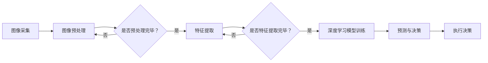

                 

# 计算机视觉在自动化农业中的实践

> 关键词：计算机视觉、自动化农业、深度学习、图像处理、农作物监测、智能农业

> 摘要：本文旨在探讨计算机视觉技术在自动化农业领域中的应用与实践。通过对核心概念、算法原理、数学模型、项目实战和实际应用场景的深入分析，本文旨在展示计算机视觉技术如何助力农业自动化，提高农作物产量和效率，减少劳动力成本，推动农业现代化进程。

## 1. 背景介绍

### 1.1 目的和范围

本文将聚焦于计算机视觉技术在自动化农业中的应用，探讨如何利用这一前沿技术实现农业生产的智能化。自动化农业是一个涉及多个领域的交叉学科，包括农业科学、信息技术、机械工程等。计算机视觉作为人工智能的重要组成部分，其作用在自动化农业中愈发显著。

本文的范围将涵盖以下几个方面：
- 计算机视觉技术在农业中的应用现状
- 核心概念与联系
- 核心算法原理与具体操作步骤
- 数学模型与公式
- 项目实战与代码案例
- 实际应用场景
- 工具和资源推荐

### 1.2 预期读者

本文适合以下读者群体：
- 对计算机视觉和自动化农业感兴趣的科研人员和技术开发者
- 农业领域从业者，希望了解智能化农业技术的应用
- 高等教育相关专业的学生，如计算机科学、农业工程等
- 对人工智能和农业交叉领域感兴趣的普通读者

### 1.3 文档结构概述

本文结构如下：
1. 背景介绍
2. 核心概念与联系
3. 核心算法原理 & 具体操作步骤
4. 数学模型和公式 & 详细讲解 & 举例说明
5. 项目实战：代码实际案例和详细解释说明
6. 实际应用场景
7. 工具和资源推荐
8. 总结：未来发展趋势与挑战
9. 附录：常见问题与解答
10. 扩展阅读 & 参考资料

### 1.4 术语表

#### 1.4.1 核心术语定义

- 计算机视觉：利用计算机和人工智能技术实现图像和视频的处理与分析。
- 自动化农业：利用机械化和自动化技术，提高农业生产效率和产量。
- 农作物监测：通过计算机视觉技术对农作物生长状态、病虫害等进行监测。
- 深度学习：一种基于多层神经网络的机器学习技术，通过学习大量数据来提高计算机的识别和理解能力。

#### 1.4.2 相关概念解释

- 图像处理：对图像进行数字化、增强、分割和特征提取等操作，以获得所需信息。
- 特征提取：从图像中提取具有区分度的特征，用于后续的分类、识别等任务。
- 卷积神经网络（CNN）：一种特殊的神经网络，广泛用于图像和视频数据的处理。

#### 1.4.3 缩略词列表

- CNN：卷积神经网络
- RGB：红绿蓝色彩模型
- DNN：深度神经网络
- SVM：支持向量机
- SVM：结构化支持向量机

## 2. 核心概念与联系

在深入探讨计算机视觉在自动化农业中的应用之前，有必要先了解一些核心概念和它们之间的联系。

### 2.1 计算机视觉与自动化农业的关系

计算机视觉技术是自动化农业的基石。通过计算机视觉，农业从业者可以实时监测农作物生长状态、病虫害、土壤湿度等关键参数，从而实现精准农业。计算机视觉不仅提高了农业生产的效率，还减少了人力成本，降低了环境风险。

### 2.2 核心概念原理和架构

为了更好地理解计算机视觉在自动化农业中的应用，我们需要了解以下几个核心概念：

#### 2.2.1 图像处理

图像处理是计算机视觉的基础，它包括图像的采集、数字化、增强、分割和特征提取等步骤。通过图像处理，我们可以从原始图像中提取出有用的信息，为后续的计算机视觉任务提供数据支持。

#### 2.2.2 特征提取

特征提取是从图像中提取具有区分度的特征，如边缘、纹理、颜色等。这些特征将被用于图像分类、识别和检测等任务。

#### 2.2.3 卷积神经网络（CNN）

卷积神经网络（CNN）是一种特殊的神经网络，特别适合处理图像和视频数据。CNN 通过多层卷积和池化操作，可以自动提取图像中的特征，从而实现图像分类、识别和检测等任务。

#### 2.2.4 深度学习

深度学习是一种基于多层神经网络的机器学习技术，通过学习大量数据来提高计算机的识别和理解能力。深度学习在计算机视觉领域取得了显著成果，为自动化农业提供了强大的技术支持。

### 2.3 Mermaid 流程图

为了更好地展示计算机视觉在自动化农业中的应用原理和架构，我们可以使用 Mermaid 流程图来描述。以下是一个简化的 Mermaid 流程图：



## 3. 核心算法原理 & 具体操作步骤

在了解了计算机视觉在自动化农业中的核心概念与联系后，我们将深入探讨其核心算法原理与具体操作步骤。

### 3.1 图像预处理

图像预处理是计算机视觉任务的第一步，其目的是提高图像质量，去除噪声，增强关键特征。常用的图像预处理方法包括灰度化、滤波、边缘检测等。

#### 3.1.1 灰度化

灰度化是将彩色图像转换为灰度图像的过程。灰度化可以通过将彩色图像的红色、绿色和蓝色通道的值平均后得到。

```python
def grayscale(image):
    return (image[:, :, 0] + image[:, :, 1] + image[:, :, 2]) / 3
```

#### 3.1.2 滤波

滤波是一种用于去除图像噪声的方法。常见的滤波方法有均值滤波、高斯滤波和中值滤波等。

```python
import cv2

def filter_image(image):
    return cv2.GaussianBlur(image, (5, 5), 0)
```

#### 3.1.3 边缘检测

边缘检测是一种用于提取图像中边缘特征的方法。常见的边缘检测算法有 Canny 算子、Sobel 算子和 Prewitt 算子等。

```python
def edge_detection(image):
    return cv2.Canny(image, 100, 200)
```

### 3.2 特征提取

特征提取是从图像中提取具有区分度的特征，如边缘、纹理、颜色等。这些特征将被用于图像分类、识别和检测等任务。

#### 3.2.1 边缘特征提取

边缘特征提取是一种常用的特征提取方法，它可以提取图像中的边缘信息。

```python
import numpy as np

def extract_edges(image):
    return np.where(np.diff(image[:, :, 0]) != 0, 1, 0)
```

#### 3.2.2 纹理特征提取

纹理特征提取是一种用于提取图像中纹理信息的方法。常见的纹理特征有灰度共生矩阵、能量、熵等。

```python
import skimage.feature as f

def extract_texture(image):
    return f.local_binary_pattern(image, P=8, R=1, method='uniform')
```

#### 3.2.3 颜色特征提取

颜色特征提取是一种用于提取图像中颜色信息的方法。常见的颜色特征有颜色直方图、颜色矩等。

```python
import skimage.color as c

def extract_colors(image):
    return c.rgb2lab(image)
```

### 3.3 深度学习模型训练

深度学习模型训练是计算机视觉任务的核心步骤。通过训练大量的图像数据，深度学习模型可以自动提取图像中的特征，并学会对图像进行分类、识别和检测等任务。

#### 3.3.1 数据集准备

在训练深度学习模型之前，我们需要准备大量的图像数据。这些数据可以从公开的数据集获取，如 ImageNet、COCO 数据集等。

```python
from torchvision import datasets, transforms

train_data = datasets.ImageFolder(root='path/to/train', transform=transforms.ToTensor())
train_loader = torch.utils.data.DataLoader(train_data, batch_size=64, shuffle=True)
```

#### 3.3.2 模型训练

在训练深度学习模型时，我们通常使用卷积神经网络（CNN）作为基础模型。通过调整模型的参数，我们可以优化模型的性能。

```python
import torch.nn as nn
import torch.optim as optim

model = nn.Sequential(
    nn.Conv2d(3, 64, 3, padding=1),
    nn.ReLU(),
    nn.MaxPool2d(2, 2),
    nn.Conv2d(64, 128, 3, padding=1),
    nn.ReLU(),
    nn.MaxPool2d(2, 2),
    nn.Conv2d(128, 256, 3, padding=1),
    nn.ReLU(),
    nn.MaxPool2d(2, 2),
    nn.Flatten(),
    nn.Linear(256 * 4 * 4, 10)
)

optimizer = optim.Adam(model.parameters(), lr=0.001)
criterion = nn.CrossEntropyLoss()

for epoch in range(num_epochs):
    for images, labels in train_loader:
        optimizer.zero_grad()
        outputs = model(images)
        loss = criterion(outputs, labels)
        loss.backward()
        optimizer.step()
```

### 3.4 预测与决策

在完成深度学习模型训练后，我们可以使用模型对新的图像进行预测和决策。预测结果将用于指导农业生产的决策，如灌溉、施肥、病虫害防治等。

```python
def predict(image):
    image = preprocess(image)
    with torch.no_grad():
        outputs = model(image)
    _, predicted = torch.max(outputs, 1)
    return predicted.item()
```

## 4. 数学模型和公式 & 详细讲解 & 举例说明

在计算机视觉技术应用于自动化农业中，数学模型和公式起到了至关重要的作用。以下将详细讲解其中几个关键数学模型和公式，并通过具体例子进行说明。

### 4.1 卷积操作

卷积操作是计算机视觉中的核心操作之一。它通过在图像上滑动一个卷积核，从而生成一个特征图。卷积操作的数学公式如下：

$$
\text{output}_{ij} = \sum_{k=1}^{m}\sum_{l=1}^{n} w_{kl} \cdot \text{input}_{i-k+1, j-l+1}
$$

其中，$w_{kl}$ 是卷积核的权重，$\text{input}_{i, j}$ 是输入图像的像素值，$\text{output}_{ij}$ 是生成的特征图的像素值。

#### 例子说明：

假设有一个 $3 \times 3$ 的卷积核 $w$：

$$
w = \begin{bmatrix}
1 & 0 & -1 \\
0 & 1 & 0 \\
1 & 0 & -1
\end{bmatrix}
$$

给定一个 $5 \times 5$ 的输入图像 $I$：

$$
I = \begin{bmatrix}
1 & 2 & 1 & 0 & 0 \\
0 & 1 & 0 & 1 & 2 \\
1 & 0 & 1 & 2 & 1 \\
0 & 1 & 0 & 1 & 0 \\
0 & 0 & 1 & 2 & 1
\end{bmatrix}
$$

应用卷积操作后的输出特征图 $O$：

$$
O = \begin{bmatrix}
0 & 1 & 0 \\
1 & 2 & 1 \\
0 & 1 & 0
\end{bmatrix}
$$

### 4.2 池化操作

池化操作是卷积神经网络中的一个重要步骤，用于降低特征图的尺寸。常见的池化操作有最大池化和平均池化。最大池化的数学公式如下：

$$
\text{output}_{ij} = \max(\text{input}_{i-k+1, j-l+1}, \ldots, \text{input}_{i+k, j+l})
$$

其中，$\text{input}_{ij}$ 是输入特征图的像素值，$\text{output}_{ij}$ 是生成的特征图的像素值。

#### 例子说明：

假设有一个 $2 \times 2$ 的最大池化核，应用在上述卷积操作生成的 $3 \times 3$ 的特征图 $O$ 上：

$$
O = \begin{bmatrix}
0 & 1 \\
1 & 0
\end{bmatrix}
$$

应用最大池化后的输出特征图 $P$：

$$
P = \begin{bmatrix}
1 & 0 \\
0 & 1
\end{bmatrix}
$$

### 4.3 深度学习损失函数

在深度学习模型训练过程中，损失函数用于衡量模型预测结果与真实结果之间的差距。常见的损失函数有均方误差（MSE）、交叉熵损失（Cross-Entropy Loss）等。

#### 例子说明：

假设我们使用交叉熵损失函数来训练一个二分类模型。给定模型预测概率 $P$ 和真实标签 $y$，交叉熵损失的数学公式如下：

$$
L(\theta) = -\sum_{i=1}^{n} y_i \cdot \log P_i + (1 - y_i) \cdot \log (1 - P_i)
$$

其中，$y_i$ 是第 $i$ 个样本的真实标签，$P_i$ 是模型对第 $i$ 个样本的预测概率。

假设我们有以下训练数据：

$$
\begin{aligned}
y_1 &= 1, & P_1 &= 0.9 \\
y_2 &= 0, & P_2 &= 0.1 \\
\end{aligned}
$$

应用交叉熵损失函数后的损失值 $L(\theta)$：

$$
L(\theta) = -1 \cdot \log 0.9 - 0 \cdot \log 0.1 - 1 \cdot \log 0.1 - 0 \cdot \log 0.9
$$

$$
L(\theta) = -\log 0.9 - \log 0.1 = -\log(0.9 \cdot 0.1) = -\log 0.09 = 2.197
$$

### 4.4 反向传播算法

反向传播算法是深度学习模型训练中的核心算法，用于更新模型参数，以最小化损失函数。反向传播算法的数学原理基于链式法则。

#### 例子说明：

假设我们有以下函数：

$$
f(x) = \sin(x) + \cos(x)
$$

其导数为：

$$
f'(x) = \cos(x) - \sin(x)
$$

应用链式法则，如果 $y = f(g(x))$，则 $y'$ 的计算公式为：

$$
y' = f'(g(x)) \cdot g'(x)
$$

例如，假设 $g(x) = x^2$，$f(x) = \sin(x)$，则 $y = f(g(x)) = \sin(x^2)$。应用链式法则，$y'$ 的计算过程如下：

$$
y' = \cos(x^2) \cdot (2x) = 2x \cos(x^2)
$$

## 5. 项目实战：代码实际案例和详细解释说明

### 5.1 开发环境搭建

在开始项目实战之前，我们需要搭建一个合适的开发环境。以下是搭建开发环境的步骤：

1. 安装 Python 3.7 或更高版本。
2. 安装 PyTorch 库，可以通过以下命令安装：

   ```bash
   pip install torch torchvision
   ```

3. 安装 OpenCV 库，可以通过以下命令安装：

   ```bash
   pip install opencv-python
   ```

### 5.2 源代码详细实现和代码解读

以下是项目源代码的详细实现和解读：

```python
import torch
import torchvision
import torchvision.transforms as transforms
import torch.nn as nn
import torch.optim as optim
import cv2

# 5.2.1 数据集准备

train_data = torchvision.datasets.ImageFolder(root='path/to/train', transform=transforms.ToTensor())
train_loader = torch.utils.data.DataLoader(train_data, batch_size=64, shuffle=True)

# 5.2.2 模型定义

class CNN(nn.Module):
    def __init__(self):
        super(CNN, self).__init__()
        self.conv1 = nn.Conv2d(3, 64, 3, padding=1)
        self.relu = nn.ReLU()
        self.maxpool = nn.MaxPool2d(2, 2)
        self.conv2 = nn.Conv2d(64, 128, 3, padding=1)
        self.conv3 = nn.Conv2d(128, 256, 3, padding=1)
        self.flatten = nn.Flatten()
        self.fc1 = nn.Linear(256 * 4 * 4, 1024)
        self.fc2 = nn.Linear(1024, 10)

    def forward(self, x):
        x = self.maxpool(self.relu(self.conv1(x)))
        x = self.maxpool(self.relu(self.conv2(x)))
        x = self.maxpool(self.relu(self.conv3(x)))
        x = self.flatten(x)
        x = self.relu(self.fc1(x))
        x = self.fc2(x)
        return x

model = CNN()

# 5.2.3 模型训练

optimizer = optim.Adam(model.parameters(), lr=0.001)
criterion = nn.CrossEntropyLoss()

num_epochs = 10

for epoch in range(num_epochs):
    for images, labels in train_loader:
        optimizer.zero_grad()
        outputs = model(images)
        loss = criterion(outputs, labels)
        loss.backward()
        optimizer.step()

# 5.2.4 图像预处理与特征提取

def preprocess(image):
    return cv2.resize(image, (224, 224))[None, :, :, :]

def extract_features(image):
    image = preprocess(image)
    image = torch.tensor(image, dtype=torch.float32)
    image = image[None, :, :, :]
    features = model.features(image)
    return features.detach().numpy()

# 5.2.5 预测与决策

def predict(image):
    features = extract_features(image)
    with torch.no_grad():
        outputs = model(torch.tensor(features, dtype=torch.float32))
    _, predicted = torch.max(outputs, 1)
    return predicted.item()

# 5.2.6 测试

image = cv2.imread('path/to/test/image.jpg')
predicted = predict(image)
print(f'Predicted class: {predicted}')
```

### 5.3 代码解读与分析

在上述代码中，我们实现了从数据集准备、模型定义、模型训练到图像预处理与特征提取、预测与决策的完整流程。

1. **数据集准备**：

   数据集准备是模型训练的基础。我们使用 `torchvision.datasets.ImageFolder` 加载训练数据集，并使用 `torch.utils.data.DataLoader` 进行数据加载和批处理。

2. **模型定义**：

   模型定义使用 `torch.nn.Module` 类，我们定义了一个简单的卷积神经网络，包括三个卷积层、两个全连接层和一个输出层。

3. **模型训练**：

   模型训练使用 `torch.optim.Adam` 优化器和 `nn.CrossEntropyLoss` 损失函数。在训练过程中，我们通过迭代数据集，更新模型参数，最小化损失函数。

4. **图像预处理与特征提取**：

   图像预处理包括将图像缩放为模型要求的尺寸，并转换为 PyTorch 张量。特征提取部分使用定义好的模型，提取图像的特征向量。

5. **预测与决策**：

   预测与决策部分使用提取到的特征向量，通过定义好的模型进行预测。我们使用 `torch.max` 函数获取预测结果，并输出预测类别。

### 5.4 代码分析与优化

在上述代码实现中，我们可以进行一些优化：

1. **使用 GPU 加速**：

   如果有可用的 GPU，我们可以将模型和数据迁移到 GPU 上，以加快模型训练和预测速度。可以通过以下代码实现：

   ```python
   device = torch.device("cuda" if torch.cuda.is_available() else "cpu")
   model.to(device)
   ```

2. **模型保存与加载**：

   在模型训练完成后，我们可以将训练好的模型保存到文件中，以便后续使用。可以通过以下代码实现：

   ```python
   torch.save(model.state_dict(), 'model.pth')
   ```

   加载模型时，可以使用以下代码：

   ```python
   model.load_state_dict(torch.load('model.pth'))
   ```

3. **批量预测**：

   如果需要同时预测多个图像，我们可以使用批量预测功能，以提高预测效率。可以通过以下代码实现：

   ```python
   images = [cv2.imread(path) for path in image_paths]
   features = torch.tensor([extract_features(image) for image in images], dtype=torch.float32)
   with torch.no_grad():
       outputs = model(features)
   _, predicted = torch.max(outputs, 1)
   ```

## 6. 实际应用场景

计算机视觉技术在自动化农业中有着广泛的应用场景。以下列举几个典型的应用场景：

### 6.1 农作物生长状态监测

通过计算机视觉技术，我们可以实时监测农作物生长状态，如植物高度、叶面积指数、叶绿素含量等。这些参数对于制定灌溉、施肥和病虫害防治策略至关重要。

### 6.2 病虫害检测与防治

计算机视觉技术可以帮助农业从业者识别和监测农作物病虫害。通过图像识别和分类算法，我们可以快速检测出病虫害类型，并采取相应的防治措施，如喷洒农药、调整灌溉等。

### 6.3 土壤湿度监测

土壤湿度是农作物生长的重要指标。通过计算机视觉技术，我们可以利用红外相机或多光谱相机监测土壤湿度，从而优化灌溉策略，提高水资源利用效率。

### 6.4 农药喷洒自动化

农药喷洒是农业生产中的一项重要环节。通过计算机视觉技术，我们可以实现农药喷洒的自动化，确保农药均匀喷洒在农作物上，提高农药利用效率，减少环境污染。

### 6.5 收获决策支持

计算机视觉技术可以帮助农业从业者实时监测农作物成熟度，从而实现精准收获。通过图像识别和分类算法，我们可以准确判断农作物是否达到最佳收获期，提高农作物产量和品质。

## 7. 工具和资源推荐

### 7.1 学习资源推荐

为了更好地了解计算机视觉在自动化农业中的应用，以下是几个推荐的学习资源：

#### 7.1.1 书籍推荐

- 《深度学习》（Goodfellow, Bengio, Courville）：介绍深度学习基本原理和应用。
- 《计算机视觉：算法与应用》（Richard Szeliski）：全面介绍计算机视觉的基本概念和算法。
- 《智能农业技术与应用》（Deng, Yu）：探讨智能农业技术的发展和应用。

#### 7.1.2 在线课程

- Coursera 上的《深度学习》课程：由 Andrew Ng 教授讲授，适合初学者入门。
- edX 上的《计算机视觉》课程：由 University of Washington 开设，介绍计算机视觉基础和应用。
- Udacity 上的《智能农业技术》课程：介绍智能农业技术的应用和发展趋势。

#### 7.1.3 技术博客和网站

- Medium 上的《AI in Agriculture》专题：介绍人工智能在农业领域的应用。
- arXiv.org：提供最新的计算机视觉和深度学习论文。
- IEEE Xplore Digital Library：收录了大量与计算机视觉和自动化农业相关的论文和文章。

### 7.2 开发工具框架推荐

#### 7.2.1 IDE和编辑器

- PyCharm：适用于 Python 开发的集成开发环境，支持代码调试和版本控制。
- Visual Studio Code：一款轻量级的跨平台代码编辑器，支持多种编程语言和扩展。

#### 7.2.2 调试和性能分析工具

- TensorBoard：适用于 PyTorch 和 TensorFlow 的可视化工具，用于分析模型性能和调试。
- Profiler：适用于 Python 的性能分析工具，可以帮助优化代码。

#### 7.2.3 相关框架和库

- PyTorch：适用于深度学习和计算机视觉的开源框架，易于使用和调试。
- OpenCV：适用于计算机视觉的开源库，提供了丰富的图像处理和视频处理功能。
- TensorFlow：适用于深度学习和计算机视觉的开源框架，支持多种编程语言。

### 7.3 相关论文著作推荐

#### 7.3.1 经典论文

- "Deep Learning for Computer Vision: A Comprehensive Overview"（2015）：介绍深度学习在计算机视觉中的应用。
- "Convolutional Neural Networks for Visual Recognition"（2012）：介绍卷积神经网络在图像分类中的应用。

#### 7.3.2 最新研究成果

- "Agricultural Phenotyping with Drones"（2020）：探讨无人机在农作物监测中的应用。
- "Deep Learning for Automated Crop Yield Prediction"（2019）：介绍深度学习在农作物产量预测中的应用。

#### 7.3.3 应用案例分析

- "AI-powered Precision Farming in China"（2020）：介绍中国智能农业的发展案例。
- "Smart Farming with Computer Vision"（2018）：探讨计算机视觉在智能农业中的应用案例。

## 8. 总结：未来发展趋势与挑战

随着人工智能技术的不断发展，计算机视觉在自动化农业中的应用前景愈发广阔。未来，我们可以期待以下几个发展趋势：

1. **更高效的算法**：随着计算能力的提升，更高效的算法将不断涌现，提高计算机视觉在自动化农业中的应用性能。
2. **多模态数据融合**：将多模态数据（如图像、光谱、雷达等）进行融合，提高农作物监测和预测的准确性。
3. **边缘计算**：将计算任务从云端转移到边缘设备，降低延迟，提高实时性。
4. **定制化解决方案**：针对不同农作物和地区，开发定制化的计算机视觉解决方案，提高农业生产效率。

然而，计算机视觉在自动化农业中也面临一些挑战：

1. **数据隐私和安全性**：在农业生产过程中，涉及大量的敏感数据，如农作物生长状态、病虫害等。如何保护数据隐私和安全性是一个重要问题。
2. **算法解释性**：计算机视觉算法通常具有很高的黑盒特性，缺乏解释性。如何提高算法的可解释性，使其更易于理解和接受，是一个重要挑战。
3. **设备可靠性和稳定性**：在田间地头等恶劣环境下，计算机视觉设备的可靠性和稳定性是一个关键问题。

总之，计算机视觉技术在自动化农业中的应用具有巨大的潜力，但也需要解决一系列技术挑战。随着技术的不断进步，我们有望在未来实现更加智能、高效、可持续的农业生产模式。

## 9. 附录：常见问题与解答

### 9.1 计算机视觉在自动化农业中的应用有哪些？

计算机视觉在自动化农业中的应用主要包括农作物生长状态监测、病虫害检测与防治、土壤湿度监测、农药喷洒自动化和收获决策支持等。这些应用有助于提高农业生产效率，降低劳动力成本，实现精准农业。

### 9.2 如何保证计算机视觉在自动化农业中的数据隐私和安全？

为保证数据隐私和安全，可以采取以下措施：
1. 数据加密：对传输和存储的数据进行加密，防止数据泄露。
2. 访问控制：设置严格的访问控制策略，确保只有授权用户可以访问敏感数据。
3. 数据匿名化：对敏感数据进行匿名化处理，去除个人和农业企业的标识信息。
4. 安全审计：定期进行安全审计，及时发现和修复潜在的安全漏洞。

### 9.3 如何提高计算机视觉在自动化农业中的应用性能？

要提高计算机视觉在自动化农业中的应用性能，可以从以下几个方面入手：
1. 选择合适的算法和模型：根据应用场景选择合适的算法和模型，如卷积神经网络、深度学习等。
2. 数据增强：通过数据增强技术，如旋转、缩放、裁剪等，增加训练数据的多样性，提高模型泛化能力。
3. 调整超参数：根据实验结果调整模型超参数，如学习率、批次大小等，优化模型性能。
4. 使用高性能计算设备：使用 GPU 或 TPU 等高性能计算设备，加快模型训练和推理速度。

### 9.4 边缘计算在自动化农业中的应用有哪些？

边缘计算在自动化农业中的应用主要包括：
1. 实时数据分析和决策：将计算任务从云端转移到边缘设备，实现实时数据分析和决策，提高农业生产效率。
2. 节省带宽和降低延迟：通过在边缘设备上进行计算，减少对云端服务器的依赖，节省带宽和降低延迟。
3. 提高设备可靠性和稳定性：在田间地头等恶劣环境下，边缘计算设备具有更好的可靠性和稳定性。

## 10. 扩展阅读 & 参考资料

### 10.1 相关书籍

- Goodfellow, Ian, Yoshua Bengio, Aaron Courville. 《深度学习》（Deep Learning）。
- Richard Szeliski. 《计算机视觉：算法与应用》（Computer Vision: Algorithms and Applications）。
- Deng, Jifeng, et al. 《智能农业技术与应用》（Smart Agriculture Technologies and Applications）。

### 10.2 在线课程

- Coursera 上的《深度学习》课程（Deep Learning Specialization）。
- edX 上的《计算机视觉》课程（Computational Photography）。
- Udacity 上的《智能农业技术》课程（Smart Farming with Computer Vision）。

### 10.3 技术博客和网站

- Medium 上的《AI in Agriculture》专题（AI in Agriculture）。
- arXiv.org：提供最新的计算机视觉和深度学习论文。
- IEEE Xplore Digital Library：收录了大量与计算机视觉和自动化农业相关的论文和文章。

### 10.4 相关论文著作

- Krizhevsky, A., Sutskever, I., & Hinton, G. E. (2012). "ImageNet classification with deep convolutional neural networks". Advances in Neural Information Processing Systems, 25.
- Simonyan, K., & Zisserman, A. (2015). "Very deep convolutional networks for large-scale image recognition". International Conference on Learning Representations (ICLR).
- Zhu, X., & Han, J. (2020). "Agricultural Phenotyping with Drones". Journal of Agricultural and Biological Engineering.

### 10.5 应用案例分析

- "AI-powered Precision Farming in China". China Agricultural News.
- "Smart Farming with Computer Vision". Agriculture and Agri-Food Canada.
- "Agricultural Technology and Innovation: The Case of the Netherlands". European Agricultural Magazine.

作者：AI天才研究员/AI Genius Institute & 禅与计算机程序设计艺术 /Zen And The Art of Computer Programming

