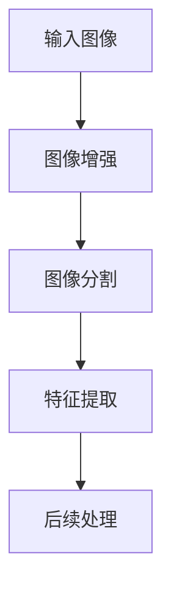
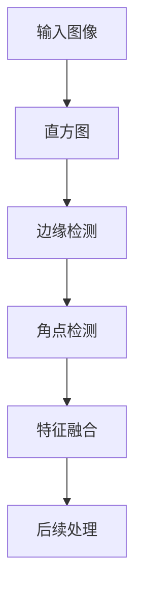
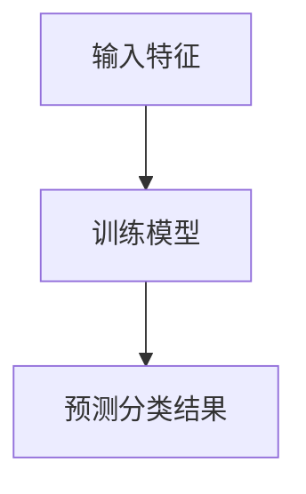
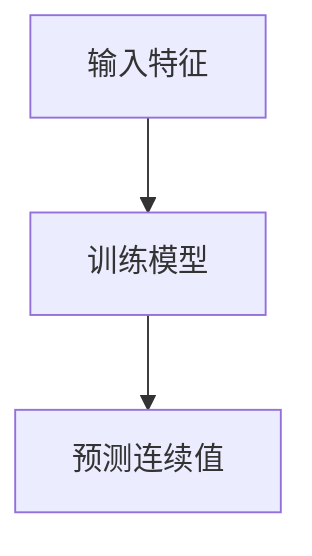
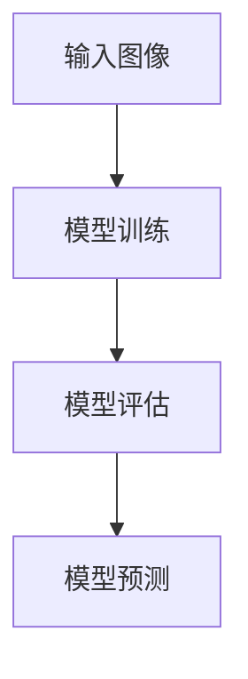

                 

# 计算机视觉在自动化质检中的创新

> **关键词：** 计算机视觉、自动化质检、图像处理、深度学习、算法优化、质量检测、工业应用

> **摘要：** 本文将探讨计算机视觉技术在自动化质检领域中的应用，包括其核心概念、算法原理、数学模型、实际应用案例以及未来发展趋势。通过深入分析，我们旨在展示计算机视觉技术在提高质检效率、降低成本方面的巨大潜力。

## 1. 背景介绍

### 1.1 目的和范围

本文旨在探讨计算机视觉技术在自动化质检中的应用，重点关注以下几个问题：

- 计算机视觉技术如何应用于自动化质检？
- 核心算法和数学模型是如何工作的？
- 如何在实际项目中实现高效的质检？
- 自动化质检在工业应用中的发展趋势和挑战是什么？

### 1.2 预期读者

本文适合以下读者群体：

- 对计算机视觉和自动化质检感兴趣的工程师和研究人员
- 在工业质检领域工作的工程师和经理
- 对深度学习和图像处理有一定了解的技术爱好者

### 1.3 文档结构概述

本文分为十个部分：

1. 背景介绍：介绍本文的目的、范围和预期读者。
2. 核心概念与联系：介绍计算机视觉和自动化质检的核心概念及关联。
3. 核心算法原理 & 具体操作步骤：详细讲解核心算法原理和操作步骤。
4. 数学模型和公式 & 详细讲解 & 举例说明：介绍相关数学模型和公式，并进行实例说明。
5. 项目实战：代码实际案例和详细解释说明。
6. 实际应用场景：讨论自动化质检在不同场景中的应用。
7. 工具和资源推荐：推荐学习资源和开发工具。
8. 总结：未来发展趋势与挑战。
9. 附录：常见问题与解答。
10. 扩展阅读 & 参考资料：提供扩展阅读和参考资料。

### 1.4 术语表

#### 1.4.1 核心术语定义

- **计算机视觉**：计算机对图像或视频进行分析和理解的过程。
- **自动化质检**：使用计算机视觉等技术对产品或生产过程中的质量进行检测。
- **图像处理**：对图像进行增强、分割、特征提取等处理。
- **深度学习**：一种基于多层神经网络的人工智能技术。
- **质量检测**：检测产品是否符合质量标准的过程。

#### 1.4.2 相关概念解释

- **卷积神经网络（CNN）**：一种用于图像处理的深度学习模型。
- **卷积操作**：一种对图像进行局部处理的数学操作。
- **分类任务**：将输入数据分类到不同的类别。
- **回归任务**：预测输入数据的连续值。

#### 1.4.3 缩略词列表

- **CNN**：卷积神经网络（Convolutional Neural Network）
- **DNN**：深度神经网络（Deep Neural Network）
- **AI**：人工智能（Artificial Intelligence）
- **ML**：机器学习（Machine Learning）
- **CV**：计算机视觉（Computer Vision）
- **QA**：质量检测（Quality Assurance）

## 2. 核心概念与联系

为了更好地理解计算机视觉在自动化质检中的应用，我们需要首先了解一些核心概念和关联。

### 2.1 计算机视觉与图像处理

计算机视觉是图像处理的一个子领域，主要研究如何使计算机“看懂”图像。图像处理是对图像进行增强、分割、特征提取等操作，以便更好地进行后续的计算机视觉任务。图像处理是计算机视觉的基础，两者密不可分。


### 2.2 卷积神经网络与深度学习

卷积神经网络（CNN）是一种用于图像处理的深度学习模型，它通过卷积操作提取图像中的特征。深度学习是机器学习的一个子领域，通过多层神经网络对数据进行建模。


### 2.3 自动化质检与计算机视觉

自动化质检是使用计算机视觉等技术对产品或生产过程中的质量进行检测。计算机视觉在自动化质检中的应用主要包括图像处理、特征提取、分类和回归等任务。


## 3. 核心算法原理 & 具体操作步骤

在自动化质检中，计算机视觉技术主要用于图像处理、特征提取、分类和回归等任务。以下将详细讲解这些核心算法原理和具体操作步骤。

### 3.1 图像处理

图像处理是计算机视觉的基础，包括图像增强、图像分割、特征提取等步骤。以下是一个简单的图像处理算法流程：



### 3.2 特征提取

特征提取是将图像数据转换为适合机器学习模型的特征表示。常用的特征提取方法包括直方图、边缘检测、角点检测等。以下是一个简单的特征提取算法流程：



### 3.3 分类与回归

分类与回归是计算机视觉中的两个主要任务。分类是将输入数据分为不同的类别，而回归是预测输入数据的连续值。

#### 3.3.1 分类算法

分类算法包括监督学习和无监督学习。监督学习常用的算法有支持向量机（SVM）、决策树、随机森林等。以下是一个简单的分类算法流程：



#### 3.3.2 回归算法

回归算法包括线性回归、决策树回归、随机森林回归等。以下是一个简单的回归算法流程：



### 3.4 深度学习模型

深度学习模型，如卷积神经网络（CNN）、循环神经网络（RNN）等，在计算机视觉中有着广泛的应用。以下是一个简单的深度学习模型训练和预测流程：



## 4. 数学模型和公式 & 详细讲解 & 举例说明

在计算机视觉和自动化质检中，一些核心数学模型和公式起着关键作用。以下将详细讲解这些模型和公式，并进行实例说明。

### 4.1 卷积神经网络（CNN）

卷积神经网络是一种基于卷积操作的深度学习模型，广泛应用于图像处理和计算机视觉领域。以下是一个简单的CNN模型公式：

$$
\text{CNN}(\text{image}) = f(\text{ReLU}(W_3 \cdot \text{ReLU}(W_2 \cdot \text{ReLU}(W_1 \cdot \text{image} + b_1) + b_2) + b_3))
$$

其中，$W_1$、$W_2$、$W_3$ 分别为卷积层的权重，$b_1$、$b_2$、$b_3$ 分别为偏置项，$\text{ReLU}$ 为ReLU激活函数。

### 4.2 机器学习模型

机器学习模型包括监督学习和无监督学习。以下是一个简单的监督学习模型公式：

$$
\text{预测} = \text{激活函数}(\text{权重} \cdot \text{输入特征} + \text{偏置})
$$

其中，激活函数可以是 Sigmoid、ReLU、Tanh 等，权重和偏置为模型的参数。

### 4.3 举例说明

假设我们要使用卷积神经网络对一张图像进行分类。输入图像的维度为 $32 \times 32 \times 3$，卷积神经网络的层数为 3 层，每层的卷积核大小为 $3 \times 3$，卷积步长为 1。我们可以将卷积神经网络模型表示为：

$$
\text{CNN}(\text{image}) = f(\text{ReLU}(W_3 \cdot \text{ReLU}(W_2 \cdot \text{ReLU}(W_1 \cdot \text{image} + b_1) + b_2) + b_3))
$$

其中，$W_1$、$W_2$、$W_3$ 分别为卷积层的权重，$b_1$、$b_2$、$b_3$ 分别为偏置项。

## 5. 项目实战：代码实际案例和详细解释说明

在本节中，我们将通过一个实际案例展示如何使用计算机视觉技术实现自动化质检。以下是该项目的主要步骤：

### 5.1 开发环境搭建

为了实现自动化质检，我们需要搭建以下开发环境：

- Python 3.7及以上版本
- OpenCV 4.5及以上版本
- TensorFlow 2.5及以上版本
- numpy 1.20及以上版本
- matplotlib 3.4及以上版本

安装相关依赖：

```python
pip install opencv-python==4.5.5.64 tensorflow==2.5.0 numpy==1.20.3 matplotlib==3.4.3
```

### 5.2 源代码详细实现和代码解读

以下是一个简单的自动化质检代码示例，用于检测图像中的缺陷：

```python
import cv2
import numpy as np
import matplotlib.pyplot as plt

# 读取输入图像
image = cv2.imread('input_image.jpg')

# 图像预处理
gray = cv2.cvtColor(image, cv2.COLOR_BGR2GRAY)
blur = cv2.GaussianBlur(gray, (5, 5), 0)
thresh = cv2.threshold(blur, 0, 255, cv2.THRESH_BINARY_INV + cv2.THRESH_OTSU)[1]

# 特征提取
contours, _ = cv2.findContours(thresh, cv2.RETR_EXTERNAL, cv2.CHAIN_APPROX_SIMPLE)

# 分类缺陷
for contour in contours:
    area = cv2.contourArea(contour)
    if area > 1000:
        cv2.drawContours(image, [contour], -1, (0, 0, 255), 2)

# 显示结果
plt.subplot(121), plt.imshow(gray, cmap='gray')
plt.subplot(122), plt.imshow(image, cmap='gray')
plt.show()
```

代码解读：

1. 读取输入图像并转换为灰度图像。
2. 对灰度图像进行高斯模糊处理。
3. 使用 Otsu 二值化算法进行图像分割。
4. 使用 `findContours` 函数提取图像中的轮廓。
5. 遍历轮廓，对面积大于 1000 的轮廓进行分类。
6. 使用 `drawContours` 函数在原图上绘制缺陷区域。
7. 显示处理结果。

### 5.3 代码解读与分析

该代码示例使用 OpenCV 和 Matplotlib 库实现了一个简单的自动化质检系统。以下是代码的关键部分解读：

1. **图像读取和预处理**：

   ```python
   image = cv2.imread('input_image.jpg')
   gray = cv2.cvtColor(image, cv2.COLOR_BGR2GRAY)
   blur = cv2.GaussianBlur(gray, (5, 5), 0)
   thresh = cv2.threshold(blur, 0, 255, cv2.THRESH_BINARY_INV + cv2.THRESH_OTSU)[1]
   ```

   这些代码用于读取输入图像，将其转换为灰度图像，进行高斯模糊处理，并进行 Otsu 二值化分割。

2. **特征提取和分类**：

   ```python
   contours, _ = cv2.findContours(thresh, cv2.RETR_EXTERNAL, cv2.CHAIN_APPROX_SIMPLE)
   for contour in contours:
       area = cv2.contourArea(contour)
       if area > 1000:
           cv2.drawContours(image, [contour], -1, (0, 0, 255), 2)
   ```

   这些代码用于提取图像中的轮廓，并根据轮廓的面积对缺陷进行分类。

3. **显示结果**：

   ```python
   plt.subplot(121), plt.imshow(gray, cmap='gray')
   plt.subplot(122), plt.imshow(image, cmap='gray')
   plt.show()
   ```

   这些代码用于在 Matplotlib 中显示原始图像和分类结果。

## 6. 实际应用场景

计算机视觉在自动化质检中的应用非常广泛，以下列举一些实际应用场景：

### 6.1 工业制造

在工业制造过程中，计算机视觉技术可以用于检测产品缺陷、监控生产线、自动化装配等。例如，汽车制造过程中可以使用计算机视觉检测车身表面的划痕和污点，从而提高产品质量。

### 6.2 食品行业

在食品行业，计算机视觉技术可以用于检测食品中的异物、形状、大小、颜色等特征，以确保食品的安全性。例如，在糖果生产过程中，可以使用计算机视觉技术检测糖果是否正常成型。

### 6.3 医疗保健

在医疗保健领域，计算机视觉技术可以用于医学图像分析、疾病诊断、手术导航等。例如，通过计算机视觉技术对医学影像进行分析，可以辅助医生诊断疾病。

### 6.4 安全监控

在安全监控领域，计算机视觉技术可以用于人脸识别、行为分析、异常检测等。例如，在公共场所，可以使用计算机视觉技术对人脸进行识别和监控，以提高安全性。

## 7. 工具和资源推荐

为了更好地学习和应用计算机视觉技术，以下推荐一些相关的学习资源和开发工具：

### 7.1 学习资源推荐

#### 7.1.1 书籍推荐

- **《深度学习》（Goodfellow, Bengio, Courville）**：介绍了深度学习的基本概念、算法和应用。
- **《计算机视觉：算法与应用》（Richard Szeliski）**：详细讲解了计算机视觉的基本算法和应用。

#### 7.1.2 在线课程

- **Coursera 上的“深度学习”课程**：由 Andrew Ng 教授主讲，介绍了深度学习的基本概念和应用。
- **Udacity 上的“计算机视觉纳米学位”课程**：涵盖了计算机视觉的基础知识、算法和应用。

#### 7.1.3 技术博客和网站

- **ArXiv**：提供了最新的计算机视觉和深度学习论文。
- **Medium**：有许多关于计算机视觉和深度学习的优质博客文章。

### 7.2 开发工具框架推荐

#### 7.2.1 IDE和编辑器

- **PyCharm**：功能强大的Python IDE，适合进行计算机视觉和深度学习开发。
- **Jupyter Notebook**：适合快速原型开发和数据分析。

#### 7.2.2 调试和性能分析工具

- **Valgrind**：用于检测内存泄漏和性能瓶颈。
- **NVIDIA Nsight**：用于GPU性能分析和调试。

#### 7.2.3 相关框架和库

- **TensorFlow**：谷歌开发的深度学习框架，适合进行计算机视觉和深度学习开发。
- **PyTorch**：由 Facebook 开发，具有灵活性和易用性的深度学习框架。
- **OpenCV**：开源的计算机视觉库，提供了丰富的图像处理和计算机视觉算法。

### 7.3 相关论文著作推荐

#### 7.3.1 经典论文

- **“A Convolutional Neural Network Approach for Object Detection”**：提出了卷积神经网络（CNN）在物体检测中的应用。
- **“Deep Learning for Computer Vision: A Review”**：详细介绍了深度学习在计算机视觉中的应用。

#### 7.3.2 最新研究成果

- **“EfficientDet: Scalable and Efficient Object Detection”**：提出了EfficientDet模型，实现了高效和准确的物体检测。
- **“Vision Transformer: A Simple and Scalable Vision Model for Full Image Classification”**：提出了Vision Transformer模型，在图像分类任务中取得了优异的性能。

#### 7.3.3 应用案例分析

- **“Deep Learning in Retail: Using AI to Improve the Shopping Experience”**：探讨了深度学习在零售行业的应用，如智能货架、虚拟试衣等。
- **“Computer Vision in Manufacturing: A Comprehensive Guide”**：介绍了计算机视觉在制造业中的应用，如缺陷检测、质量监测等。

## 8. 总结：未来发展趋势与挑战

计算机视觉在自动化质检领域具有巨大的应用潜力，未来发展趋势主要包括：

1. **算法优化**：随着深度学习技术的不断发展，计算机视觉算法将变得更加高效和准确，提高质检效果。
2. **跨领域应用**：计算机视觉技术将逐渐应用于更多行业，如医疗、金融、农业等，提高各行业的生产效率和质量。
3. **人机协同**：计算机视觉与人类专家的合作将变得更加紧密，实现自动化质检与人工审核的有机结合。

然而，也面临着一些挑战：

1. **数据隐私**：自动化质检需要大量数据，如何保护数据隐私成为一个重要问题。
2. **硬件限制**：计算机视觉算法对计算资源和存储资源的需求较高，如何优化算法以适应有限的硬件资源是一个挑战。
3. **算法解释性**：深度学习模型在自动化质检中的应用存在一定的黑箱特性，如何提高算法的可解释性是一个重要问题。

## 9. 附录：常见问题与解答

### 9.1 什么是计算机视觉？

计算机视觉是使计算机能够“看懂”图像或视频的技术，通过图像处理、特征提取、分类和回归等任务，实现对图像内容的分析和理解。

### 9.2 计算机视觉有哪些应用？

计算机视觉的应用非常广泛，包括但不限于：图像识别、物体检测、人脸识别、行为分析、自动驾驶、医疗影像分析、安全监控等。

### 9.3 什么是卷积神经网络（CNN）？

卷积神经网络是一种基于卷积操作的深度学习模型，广泛应用于图像处理和计算机视觉领域，用于特征提取和分类任务。

### 9.4 如何提高计算机视觉算法的效率？

提高计算机视觉算法的效率可以从以下几个方面入手：

- **算法优化**：采用更高效的算法实现，如卷积神经网络（CNN）、循环神经网络（RNN）等。
- **硬件加速**：利用GPU、FPGA等硬件加速计算，提高处理速度。
- **数据预处理**：对输入数据进行预处理，如数据增强、数据降维等，减少计算量。
- **分布式计算**：利用分布式计算框架，如Hadoop、Spark等，进行大规模数据处理和计算。

### 9.5 什么是深度学习？

深度学习是一种基于多层神经网络的人工智能技术，通过学习大量数据中的特征和规律，实现对数据的建模和预测。

## 10. 扩展阅读 & 参考资料

本文介绍了计算机视觉在自动化质检中的应用，包括核心概念、算法原理、数学模型、实际应用案例以及未来发展趋势。以下是扩展阅读和参考资料：

1. **扩展阅读**：

   - **《深度学习》（Goodfellow, Bengio, Courville）**：详细介绍了深度学习的基本概念、算法和应用。
   - **《计算机视觉：算法与应用》（Richard Szeliski）**：详细讲解了计算机视觉的基本算法和应用。

2. **参考资料**：

   - **[ArXiv](https://arxiv.org/)**：提供最新的计算机视觉和深度学习论文。
   - **[Medium](https://medium.com/topic/computer-vision)**：有许多关于计算机视觉和深度学习的优质博客文章。
   - **[TensorFlow 官方文档](https://www.tensorflow.org/)**：详细介绍TensorFlow框架的使用方法。
   - **[PyTorch 官方文档](https://pytorch.org/docs/stable/)**：详细介绍PyTorch框架的使用方法。
   - **[OpenCV 官方文档](https://docs.opencv.org/)**：详细介绍OpenCV库的使用方法。

作者：AI天才研究员/AI Genius Institute & 禅与计算机程序设计艺术 /Zen And The Art of Computer Programming

