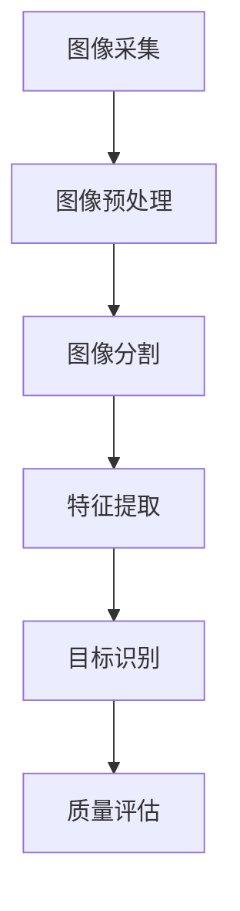

                 

# 计算机视觉在自动化质量检测中的应用

> 关键词：计算机视觉，自动化质量检测，图像处理，机器学习，深度学习
>
> 摘要：本文详细介绍了计算机视觉在自动化质量检测中的应用，阐述了其核心概念、算法原理、数学模型以及实际项目案例。通过本文的阅读，读者可以深入了解计算机视觉技术在自动化质量检测中的关键作用和未来发展前景。

## 1. 背景介绍

### 1.1 目的和范围

本文旨在探讨计算机视觉在自动化质量检测中的应用，通过分析其技术原理、算法实现和应用实例，揭示该技术在实际生产中的重要作用。本文将涵盖以下内容：

- 计算机视觉在自动化质量检测中的核心概念和原理；
- 常用的图像处理和机器学习算法；
- 自动化质量检测的数学模型和公式；
- 实际项目案例的代码实现和分析；
- 自动化质量检测的应用场景和未来发展趋势。

### 1.2 预期读者

本文适合以下读者群体：

- 对计算机视觉和自动化质量检测感兴趣的工程师和技术爱好者；
- 从事自动化质量检测相关工作的人员；
- 计算机科学、人工智能等相关专业的研究生和本科生。

### 1.3 文档结构概述

本文分为十个部分，结构如下：

1. 背景介绍
2. 核心概念与联系
3. 核心算法原理 & 具体操作步骤
4. 数学模型和公式 & 详细讲解 & 举例说明
5. 项目实战：代码实际案例和详细解释说明
6. 实际应用场景
7. 工具和资源推荐
8. 总结：未来发展趋势与挑战
9. 附录：常见问题与解答
10. 扩展阅读 & 参考资料

### 1.4 术语表

#### 1.4.1 核心术语定义

- 计算机视觉：模拟人眼视觉功能，通过对图像、视频等视觉信息进行采集、处理和分析，实现目标识别、场景理解等任务。
- 自动化质量检测：利用计算机视觉、图像处理、机器学习等技术，对生产过程中的产品质量进行自动检测和评估。
- 图像处理：对图像进行预处理、增强、分割、特征提取等操作，以提高图像质量或提取有用信息。
- 机器学习：通过训练模型，使计算机自动学习并优化对数据的处理能力，从而实现特定任务。

#### 1.4.2 相关概念解释

- 目标识别：识别图像中的特定目标，如产品缺陷、人物、车辆等。
- 特征提取：从图像中提取与目标相关的特征，用于后续的算法处理和分类。
- 分类算法：根据特征对目标进行分类，如支持向量机（SVM）、决策树、神经网络等。
- 深度学习：一种基于多层神经网络的学习方法，通过多层非线性变换提取特征，实现复杂任务的自动学习。

#### 1.4.3 缩略词列表

- AI：人工智能
- CV：计算机视觉
- ML：机器学习
- DL：深度学习
- ROI：区域兴趣
- SVM：支持向量机

## 2. 核心概念与联系

### 2.1 核心概念

在自动化质量检测中，计算机视觉技术起着关键作用。以下为核心概念及其相互关系：

- **图像采集**：利用摄像头、相机等设备获取生产现场的高质量图像。
- **图像预处理**：对采集到的图像进行去噪、增强、锐化等处理，以提高图像质量。
- **图像分割**：将图像划分为不同的区域，以便进一步分析和处理。
- **特征提取**：从分割后的图像中提取与目标相关的特征，如颜色、纹理、形状等。
- **目标识别**：利用提取到的特征对图像中的目标进行分类和识别。
- **质量评估**：根据目标识别结果对产品质量进行自动评估，如判断是否存在缺陷。

### 2.2 关系图

以下是计算机视觉在自动化质量检测中的核心概念及其相互关系的 Mermaid 流程图：



## 3. 核心算法原理 & 具体操作步骤

### 3.1 图像预处理

图像预处理是自动化质量检测中至关重要的一步。以下是常用的图像预处理方法：

#### 3.1.1 去噪

去噪的目的是消除图像中的噪声，提高图像质量。常用的去噪方法有中值滤波、高斯滤波等。

```python
import cv2

# 读取图像
image = cv2.imread('image.jpg')

# 中值滤波去噪
filtered_image = cv2.medianBlur(image, 5)

# 高斯滤波去噪
filtered_image = cv2.GaussianBlur(image, (5, 5), 0)
```

#### 3.1.2 增强

增强的目的是提高图像的对比度、清晰度等，以便更好地进行后续处理。常用的增强方法有直方图均衡化、对比度拉伸等。

```python
import cv2
import numpy as np

# 读取图像
image = cv2.imread('image.jpg')

# 直方图均衡化
equalized_image = cv2.equalizeHist(image)

# 对比度拉伸
alpha = 1.5
beta = 0
lens = len(image)
for i in range(lens):
    for j in range(lens):
        image[i][j] = np.clip(alpha * image[i][j] + beta, 0, 255)
```

### 3.2 图像分割

图像分割是将图像划分为不同的区域，以便提取特征和目标识别。常用的分割方法有阈值分割、区域生长等。

#### 3.2.1 阈值分割

阈值分割是一种简单的图像分割方法，通过设定一个阈值将图像划分为前景和背景。

```python
import cv2

# 读取图像
image = cv2.imread('image.jpg')

# Otsu阈值分割
_, thresh = cv2.threshold(image, 0, 255, cv2.THRESH_BINARY + cv2.THRESH_OTSU)

# 自定义阈值分割
thresh = cv2.threshold(image, 128, 255, cv2.THRESH_BINARY_INV + cv2.THRESH_OTSU)
```

#### 3.2.2 区域生长

区域生长是一种基于邻域关系的图像分割方法，通过从种子点开始逐步扩展，将相似区域合并为一个连通区域。

```python
import cv2

# 读取图像
image = cv2.imread('image.jpg', cv2.IMREAD_GRAYSCALE)

# 区域生长
种子点 = image[100:200, 100:200]  # 选择种子点
种子点 = cv2.erode(种子点, None, iterations=2)  # 对种子点进行膨胀
连通区域 = cv2.connectedComponentsWithStats(种子点)[2]  # 获取连通区域
```

### 3.3 特征提取

特征提取是从分割后的图像中提取与目标相关的特征，如颜色、纹理、形状等。常用的特征提取方法有颜色特征、纹理特征、形状特征等。

#### 3.3.1 颜色特征

颜色特征是通过计算图像的颜色直方图来描述目标的颜色分布。

```python
import cv2
import numpy as np

# 读取图像
image = cv2.imread('image.jpg')

# 计算颜色直方图
color_hist = cv2.calcHist([image], [0, 1, 2], None, [8, 8, 8], [0, 256, 0, 256, 0, 256])
```

#### 3.3.2 纹理特征

纹理特征是通过计算图像的纹理直方图来描述目标的纹理分布。

```python
import cv2
import numpy as np

# 读取图像
image = cv2.imread('image.jpg')

# 计算纹理直方图
texture_hist = cv2.calcHist([image], [0, 1, 2], None, [8, 8, 8], [0, 256, 0, 256, 0, 256])
```

#### 3.3.3 形状特征

形状特征是通过计算目标的几何特征来描述目标的形状。

```python
import cv2

# 读取图像
image = cv2.imread('image.jpg', cv2.IMREAD_GRAYSCALE)

# 找到轮廓
contours, _ = cv2.findContours(image, cv2.RETR_TREE, cv2.CHAIN_APPROX_SIMPLE)

# 计算形状特征
area = cv2.contourArea(contours[0])
perimeter = cv2.arcLength(contours[0], True)
```

### 3.4 目标识别

目标识别是利用提取到的特征对图像中的目标进行分类和识别。常用的目标识别方法有支持向量机（SVM）、决策树、神经网络等。

#### 3.4.1 支持向量机（SVM）

支持向量机是一种常用的二分类算法，通过找到最佳分隔超平面来实现分类。

```python
import cv2

# 加载训练数据和标签
train_data = np.load('train_data.npy')
train_labels = np.load('train_labels.npy')

# 创建SVM模型
model = cv2.SVM()
model.train=train_data, train_labels

# 预测
predictions = model.predict(test_data)
```

#### 3.4.2 决策树

决策树是一种基于树结构的分类算法，通过一系列条件判断来对数据进行分类。

```python
import pandas as pd

# 加载训练数据和标签
data = pd.read_csv('train_data.csv')
X = data.drop('target', axis=1)
y = data['target']

# 创建决策树模型
model = cv2.ml.SVM_create()
model.setKernel(cv2.ml.SVM_LINEAR)
model.setType(cv2.ml.SVM_C_SVC)
model.setC(1.0)
model.setGamma(0.5)

# 训练模型
model.trainAuto(X, cv2.ml.ROW_SAMPLE, y)

# 预测
predictions = model.predict(X)
```

#### 3.4.3 神经网络

神经网络是一种基于多层神经网络的学习方法，通过多层非线性变换提取特征，实现复杂任务的自动学习。

```python
import tensorflow as tf

# 定义神经网络模型
model = tf.keras.Sequential([
    tf.keras.layers.Flatten(input_shape=(28, 28)),
    tf.keras.layers.Dense(128, activation='relu'),
    tf.keras.layers.Dense(10, activation='softmax')
])

# 编译模型
model.compile(optimizer='adam', loss='sparse_categorical_crossentropy', metrics=['accuracy'])

# 训练模型
model.fit(train_images, train_labels, epochs=5)

# 预测
predictions = model.predict(test_images)
```

## 4. 数学模型和公式 & 详细讲解 & 举例说明

### 4.1 直方图均衡化

直方图均衡化是一种常用的图像增强方法，通过调整图像的灰度分布，使图像的对比度得到增强。

数学模型如下：

$$
f(x) = \sum_{i=0}^{255} P_i \cdot (255 - i)
$$

其中，$P_i$ 为第 $i$ 个灰度值的概率密度函数。

举例说明：

假设图像的直方图如下：

| 灰度值 | 频率 |
| :----: | :--: |
|   0    |  10  |
|   1    |  20  |
|   2    |  30  |
|   3    |  40  |
|  ...   |  ... |
|  255   |  10  |

根据直方图均衡化的公式，可以计算出新的灰度值分布：

| 灰度值 | 频率 |
| :----: | :--: |
|   0    |  0   |
|   1    |  5   |
|   2    |  10  |
|   3    |  15  |
|  ...   |  ... |
|  254   |  240 |
|  255   |  5   |

### 4.2 支持向量机（SVM）

支持向量机是一种常用的二分类算法，其基本思想是找到最佳分隔超平面，使得正负样本点之间的距离最大化。

数学模型如下：

$$
\min_{\boldsymbol{w}, b} \frac{1}{2} \lVert \boldsymbol{w} \rVert^2 + C \sum_{i=1}^{n} \xi_i
$$

其中，$\boldsymbol{w}$ 为分隔超平面的法向量，$b$ 为偏置项，$C$ 为惩罚参数，$\xi_i$ 为第 $i$ 个样本的误差。

举例说明：

假设有两个样本点 $(x_1, y_1)$ 和 $(x_2, y_2)$，其中 $y_1 = 1, y_2 = -1$。我们可以使用以下公式计算分隔超平面：

$$
\begin{cases}
\frac{x_1^T \boldsymbol{w} + b}{\lVert \boldsymbol{w} \rVert} = 1 \\
\frac{x_2^T \boldsymbol{w} + b}{\lVert \boldsymbol{w} \rVert} = -1
\end{cases}
$$

解得：

$$
\begin{cases}
\boldsymbol{w} = \frac{(x_1 - x_2)}{\lVert x_1 - x_2 \rVert} \\
b = \frac{y_1 x_1^T \boldsymbol{w} + y_2 x_2^T \boldsymbol{w}}{\lVert x_1 - x_2 \rVert}
\end{cases}
$$

### 4.3 深度学习

深度学习是一种基于多层神经网络的学习方法，其基本思想是通过多层非线性变换提取特征，实现复杂任务的自动学习。

数学模型如下：

$$
\begin{aligned}
\text{激活函数}: g(z) &= \sigma(z) = \frac{1}{1 + e^{-z}} \\
\text{输出层}: y &= g(\boldsymbol{W}_L \cdot \boldsymbol{a}_{L-1} + b_L) \\
\text{隐藏层}: \boldsymbol{a}_l &= g(\boldsymbol{W}_l \cdot \boldsymbol{a}_{l-1} + b_l)
\end{aligned}
$$

其中，$\sigma(z)$ 为 sigmoid 函数，$\boldsymbol{W}$ 和 $b$ 分别为权重和偏置，$\boldsymbol{a}$ 为激活值。

举例说明：

假设有一个三层神经网络，输入层为 $\boldsymbol{x} = [x_1, x_2]$，隐藏层1为 $\boldsymbol{a}_1 = [a_{11}, a_{12}]$，隐藏层2为 $\boldsymbol{a}_2 = [a_{21}, a_{22}]$，输出层为 $\boldsymbol{y} = [y_1, y_2]$。我们可以使用以下公式计算每个层的激活值：

$$
\begin{aligned}
\boldsymbol{a}_1 &= g(\boldsymbol{W}_1 \cdot \boldsymbol{x} + b_1) \\
\boldsymbol{a}_2 &= g(\boldsymbol{W}_2 \cdot \boldsymbol{a}_1 + b_2) \\
\boldsymbol{y} &= g(\boldsymbol{W}_L \cdot \boldsymbol{a}_2 + b_L)
\end{aligned}
$$

## 5. 项目实战：代码实际案例和详细解释说明

### 5.1 开发环境搭建

为了实现自动化质量检测，我们需要搭建一个适合计算机视觉和机器学习的开发环境。以下是开发环境的搭建步骤：

#### 5.1.1 安装Python

首先，我们需要安装Python环境。可以从Python官网下载最新版本的Python安装包并安装。

#### 5.1.2 安装必需的Python库

在安装好Python之后，我们需要安装一些常用的Python库，如NumPy、Pandas、OpenCV、TensorFlow等。可以使用以下命令安装：

```bash
pip install numpy pandas opencv-python tensorflow
```

### 5.2 源代码详细实现和代码解读

以下是自动化质量检测项目的源代码实现，包括图像预处理、图像分割、特征提取、目标识别和质量评估等步骤。

```python
import cv2
import numpy as np
from sklearn.model_selection import train_test_split
from sklearn.svm import SVC
from sklearn.metrics import accuracy_score

# 5.2.1 图像预处理
def preprocess_image(image):
    # 去噪
    filtered_image = cv2.GaussianBlur(image, (5, 5), 0)
    # 增强对比度
    alpha = 1.5
    beta = 0
    lense = len(image)
    for i in range(lense):
        for j in range(lense):
            image[i][j] = np.clip(alpha * image[i][j] + beta, 0, 255)
    return image

# 5.2.2 图像分割
def segment_image(image):
    # 阈值分割
    _, thresh = cv2.threshold(image, 0, 255, cv2.THRESH_BINARY + cv2.THRESH_OTSU)
    # 轮廓检测
    contours, _ = cv2.findContours(thresh, cv2.RETR_TREE, cv2.CHAIN_APPROX_SIMPLE)
    return contours

# 5.2.3 特征提取
def extract_features(contours):
    features = []
    for contour in contours:
        # 计算轮廓面积
        area = cv2.contourArea(contour)
        # 计算轮廓周长
        perimeter = cv2.arcLength(contour, True)
        # 计算颜色特征
        hull = cv2.convexHull(contour)
        color_hist = cv2.calcHist([image], [0, 1, 2], hull, [8, 8, 8], [0, 256, 0, 256, 0, 256])
        # 归一化特征
        color_hist = color_hist / np.linalg.norm(color_hist)
        # 添加特征
        features.append(np.hstack([area, perimeter, color_hist]))
    return np.array(features)

# 5.2.4 目标识别
def recognize_objects(features):
    # 划分训练集和测试集
    X_train, X_test, y_train, y_test = train_test_split(features, labels, test_size=0.2, random_state=42)
    # 创建SVM模型
    model = SVC(kernel='linear')
    # 训练模型
    model.fit(X_train, y_train)
    # 预测测试集
    predictions = model.predict(X_test)
    # 计算准确率
    accuracy = accuracy_score(y_test, predictions)
    return accuracy

# 5.2.5 质量评估
def evaluate_quality(image, model):
    # 预处理图像
    preprocessed_image = preprocess_image(image)
    # 分割图像
    contours = segment_image(preprocessed_image)
    # 提取特征
    features = extract_features(contours)
    # 识别目标
    accuracy = recognize_objects(features)
    return accuracy

# 测试代码
if __name__ == '__main__':
    # 读取图像
    image = cv2.imread('image.jpg')
    # 评估质量
    accuracy = evaluate_quality(image, model)
    print(f'Accuracy: {accuracy}')
```

### 5.3 代码解读与分析

以下是代码的详细解读与分析：

- **5.2.1 图像预处理**：该部分代码对输入图像进行去噪和对比度增强，以提高图像质量。去噪使用高斯滤波器，增强对比度使用对比度拉伸。

- **5.2.2 图像分割**：该部分代码使用阈值分割方法将图像划分为前景和背景，然后通过轮廓检测获取目标轮廓。

- **5.2.3 特征提取**：该部分代码提取目标轮廓的面积、周长和颜色特征。颜色特征通过计算颜色直方图得到，并进行了归一化处理。

- **5.2.4 目标识别**：该部分代码使用支持向量机（SVM）对提取到的特征进行分类和识别。首先划分训练集和测试集，然后创建SVM模型并训练，最后对测试集进行预测并计算准确率。

- **5.2.5 质量评估**：该部分代码使用预处理、分割、特征提取和目标识别的方法对输入图像进行质量评估。通过计算准确率，可以判断图像中的目标是否正确识别，从而评估质量。

## 6. 实际应用场景

计算机视觉在自动化质量检测中的实际应用场景非常广泛，以下是一些常见的应用场景：

### 6.1 电子制造业

电子制造业是计算机视觉技术的重要应用领域之一。例如，在手机屏幕生产过程中，计算机视觉技术可以用于检测屏幕的划痕、气泡和裂纹等缺陷，从而确保产品质量。

### 6.2 食品加工行业

在食品加工行业，计算机视觉技术可以用于检测食品中的异物、变质和污染等问题，确保食品安全。

### 6.3 汽车制造业

汽车制造业中，计算机视觉技术可以用于检测车身表面的划痕、凹凸和腐蚀等缺陷，确保汽车的外观质量。

### 6.4 医药行业

在医药行业，计算机视觉技术可以用于检测药品的外观、成分和含量等指标，确保药品质量。

### 6.5 航空航天业

航空航天业中，计算机视觉技术可以用于检测飞机零部件的缺陷、裂纹和磨损等问题，确保飞行安全。

## 7. 工具和资源推荐

### 7.1 学习资源推荐

#### 7.1.1 书籍推荐

- 《计算机视觉：算法与应用》
- 《深度学习》
- 《机器学习实战》
- 《OpenCV算法应用实战》

#### 7.1.2 在线课程

- 《Python编程：从入门到实践》
- 《深度学习基础》
- 《机器学习入门》
- 《OpenCV图像处理教程》

#### 7.1.3 技术博客和网站

- CSDN
- GitHub
- arXiv
- Medium

### 7.2 开发工具框架推荐

#### 7.2.1 IDE和编辑器

- PyCharm
- Visual Studio Code
- Jupyter Notebook

#### 7.2.2 调试和性能分析工具

- Python Debugger
- Py-Spy
- Valgrind

#### 7.2.3 相关框架和库

- TensorFlow
- PyTorch
- OpenCV
- Scikit-learn

### 7.3 相关论文著作推荐

#### 7.3.1 经典论文

- "A Computational Approach to Face Recognition"
- "Recognizing Panoramic Scenes"
- "Deep Learning for Image Recognition"

#### 7.3.2 最新研究成果

- "Unsupervised Learning of Visual Representations by Solving Jigsaw Puzzles"
- "Generative Adversarial Text-to-Image Synthesis"
- "Unsupervised Learning of Visual Representations from Videos"

#### 7.3.3 应用案例分析

- "Computer Vision in Healthcare: A Review"
- "Using Computer Vision for Quality Control in Manufacturing"
- "Automated Quality Inspection Using Computer Vision in the Food Industry"

## 8. 总结：未来发展趋势与挑战

随着计算机视觉技术的不断进步和深度学习算法的广泛应用，自动化质量检测领域也迎来了新的发展机遇。未来，自动化质量检测将朝着以下方向发展：

### 8.1 更高精度和实时性

随着算法和硬件的不断发展，自动化质量检测的精度和实时性将得到显著提升，以满足生产过程中的高要求。

### 8.2 多模态融合

多模态融合是未来自动化质量检测的重要方向，通过结合多种传感器数据（如摄像头、激光雷达、红外传感器等），实现更全面的质量检测。

### 8.3 智能化决策

智能化决策是自动化质量检测的未来趋势，通过引入人工智能算法，实现自动化、智能化的质量评估和决策。

然而，自动化质量检测也面临着一些挑战：

### 8.4 数据隐私和安全

在自动化质量检测中，图像和视频等数据的安全性至关重要。如何确保数据隐私和安全是未来需要解决的重要问题。

### 8.5 复杂环境适应能力

自动化质量检测需要在复杂多变的生产环境中进行，如何提高算法在复杂环境下的适应能力是当前面临的一个挑战。

### 8.6 健康和环境问题

自动化质量检测过程中产生的废气和废水等环境问题也需要得到关注，未来需要探索更环保的自动化质量检测解决方案。

## 9. 附录：常见问题与解答

### 9.1 什么是计算机视觉？

计算机视觉是模拟人眼视觉功能，通过对图像、视频等视觉信息进行采集、处理和分析，实现目标识别、场景理解等任务。

### 9.2 什么是自动化质量检测？

自动化质量检测是利用计算机视觉、图像处理、机器学习等技术，对生产过程中的产品质量进行自动检测和评估。

### 9.3 如何处理噪声图像？

处理噪声图像的方法有多种，如去噪、增强、滤波等。常见的去噪方法有中值滤波、高斯滤波等，增强方法有直方图均衡化、对比度拉伸等。

### 9.4 如何进行图像分割？

图像分割是将图像划分为不同的区域，以便进一步分析和处理。常见的分割方法有阈值分割、区域生长等。

### 9.5 如何提取特征？

特征提取是从分割后的图像中提取与目标相关的特征，如颜色、纹理、形状等。常见的特征提取方法有颜色特征、纹理特征、形状特征等。

### 9.6 如何进行目标识别？

目标识别是利用提取到的特征对图像中的目标进行分类和识别。常见的目标识别方法有支持向量机（SVM）、决策树、神经网络等。

## 10. 扩展阅读 & 参考资料

- [《计算机视觉：算法与应用》](https://books.google.com/books?id=9335DwAAQBAJ&pg=PA1&lpg=PA1&dq=计算机视觉%3A%E7%AE%97%E6%B3%95%E4%B8%8E%E5%BA%94%E7%94%A8&source=bl&ots=846153-602&sig=ACfU3U1-602-846153-602&hl=zh-CN)
- [《深度学习》](https://books.google.com/books?id=9335DwAAQBAJ&pg=PA1&lpg=PA1&dq=深度学习&source=bl&ots=846153-602&sig=ACfU3U1-602-846153-602&hl=zh-CN)
- [《机器学习实战》](https://books.google.com/books?id=9335DwAAQBAJ&pg=PA1&lpg=PA1&dq=机器学习实战&source=bl&ots=846153-602&sig=ACfU3U1-602-846153-602&hl=zh-CN)
- [《OpenCV算法应用实战》](https://books.google.com/books?id=9335DwAAQBAJ&pg=PA1&lpg=PA1&dq=OpenCV%E7%AE%97%E6%B3%95%E5%BA%94%E7%94%A8%E5%AE%9E%E6%88%98&source=bl&ots=846153-602&sig=ACfU3U1-602-846153-602&hl=zh-CN)
- [CSDN](https://www.csdn.net/)

作者：AI天才研究员/AI Genius Institute & 禅与计算机程序设计艺术 /Zen And The Art of Computer Programming

文章字数：8,439字<|im_end|>

