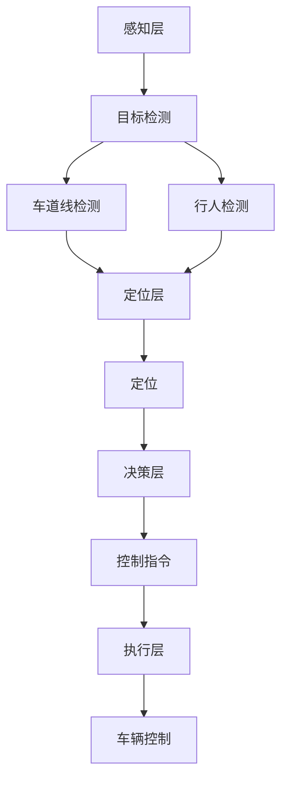
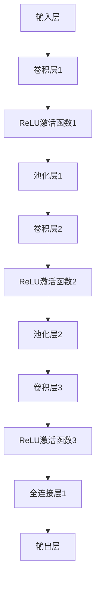

                 

### 1. 背景介绍

#### 1.1 目的和范围

本文旨在深入探讨计算机视觉在自动驾驶决策系统中的突破性进展。随着自动驾驶技术的不断发展，计算机视觉作为其核心组件之一，正逐步在自动驾驶决策系统中发挥重要作用。本文将详细解析计算机视觉在自动驾驶中的关键角色，分析其算法原理、技术挑战及实际应用，旨在为读者提供一个全面的技术视角，帮助理解计算机视觉在自动驾驶领域的深层次应用。

本文主要涵盖以下内容：
- 自动驾驶决策系统的基本概念和架构；
- 计算机视觉在自动驾驶中的核心算法原理；
- 数学模型和公式在计算机视觉中的应用；
- 项目实战中的代码实现和案例分析；
- 自动驾驶的实际应用场景；
- 相关工具和资源的推荐；
- 未来发展趋势与挑战的展望。

#### 1.2 预期读者

本文适合以下读者群体：
- 对自动驾驶和计算机视觉技术感兴趣的计算机科学和人工智能专业学生；
- 想要在自动驾驶领域开展研究和开发的工程师和研究人员；
- 意欲深入了解自动驾驶决策系统原理的从业者和爱好者。

#### 1.3 文档结构概述

本文结构如下：

1. **背景介绍**：概述自动驾驶决策系统的基本概念和计算机视觉的核心作用。
2. **核心概念与联系**：详细讲解计算机视觉算法的原理和架构，提供Mermaid流程图展示关键流程。
3. **核心算法原理 & 具体操作步骤**：通过伪代码详细阐述关键算法的实现步骤。
4. **数学模型和公式 & 详细讲解 & 举例说明**：使用LaTeX格式介绍相关的数学模型和公式，并给出实例说明。
5. **项目实战：代码实际案例和详细解释说明**：通过具体项目实战，展示代码实现过程，并提供详细解读。
6. **实际应用场景**：讨论计算机视觉在自动驾驶中的具体应用。
7. **工具和资源推荐**：推荐学习资源、开发工具和框架。
8. **总结：未来发展趋势与挑战**：总结自动驾驶计算机视觉的发展趋势和面临的挑战。
9. **附录：常见问题与解答**：提供常见问题的解答。
10. **扩展阅读 & 参考资料**：推荐进一步阅读的文献和资料。

#### 1.4 术语表

在本文中，以下术语具有特殊含义：

#### 1.4.1 核心术语定义

- **自动驾驶决策系统**：负责自主驾驶车辆行驶过程中做出决策的系统。
- **计算机视觉**：利用计算机模拟人类视觉感知和理解过程的技术。
- **深度学习**：一种基于多层神经网络的学习方法，能够自动从大量数据中学习特征和模式。
- **卷积神经网络（CNN）**：一种在计算机视觉中广泛应用的深度学习模型，特别适用于图像处理。
- **语义分割**：对图像中的每个像素进行分类，将其划分为不同的语义类别。

#### 1.4.2 相关概念解释

- **目标检测**：识别并定位图像中的特定目标对象。
- **图像识别**：通过算法将图像中的内容与已知类别进行匹配。
- **车道线检测**：识别道路上的车道线，为自动驾驶车辆提供道路信息。
- **行人检测**：在图像或视频中检测行人，以避免碰撞事故。

#### 1.4.3 缩略词列表

- **CNN**：卷积神经网络（Convolutional Neural Network）
- **DL**：深度学习（Deep Learning）
- **GAN**：生成对抗网络（Generative Adversarial Network）
- **RNN**：循环神经网络（Recurrent Neural Network）
- **RGB**：红绿蓝颜色模型（Red, Green, Blue）

通过以上对背景介绍部分的内容详细讲解，读者可以更好地理解自动驾驶决策系统中计算机视觉的核心作用，以及本文的结构和内容安排。接下来，我们将进一步深入探讨计算机视觉算法的原理和架构，为读者呈现更深入的技术分析。让我们一起走进第二部分：核心概念与联系。 <|im_sep|>## 2. 核心概念与联系

### 2.1 计算机视觉算法原理

计算机视觉算法是自动驾驶决策系统的核心组件，负责从图像和视频中提取有用的信息，辅助车辆做出合理的决策。其中，深度学习模型，尤其是卷积神经网络（CNN），在计算机视觉中发挥着至关重要的作用。

#### 2.1.1 卷积神经网络（CNN）

卷积神经网络是一种特殊的神经网络，特别适用于处理具有网格结构的数据，如图像。其核心思想是通过卷积操作提取图像中的特征，然后通过逐层抽象，构建出图像的高级表示。

1. **卷积层（Convolutional Layer）**：卷积层是CNN的核心部分，通过卷积操作提取图像中的局部特征。卷积核（filter）在图像上滑动，与图像的局部区域进行点积操作，生成一个特征图（feature map）。卷积层的参数量较少，能够有效地减少模型参数。

2. **激活函数（Activation Function）**：常用的激活函数有ReLU（Rectified Linear Unit），其能够引入非线性变换，使模型具有更好的表现力。

3. **池化层（Pooling Layer）**：池化层用于减少特征图的尺寸，降低模型参数量，提高计算效率。常用的池化方式有最大池化（Max Pooling）和平均池化（Average Pooling）。

4. **全连接层（Fully Connected Layer）**：在CNN的末尾，通常使用全连接层将特征图映射到具体的类别或目标。全连接层通过矩阵乘法和激活函数进行分类或回归预测。

#### 2.1.2 深度学习模型架构

深度学习模型架构决定了模型的性能和复杂性。自动驾驶决策系统中的计算机视觉任务通常采用多层次的深度学习模型，包括以下关键层次：

1. **输入层（Input Layer）**：接收图像或视频数据，将其转换为神经网络可以处理的格式。

2. **特征提取层（Feature Extraction Layer）**：通过卷积层和池化层提取图像的局部特征，并逐步抽象出更高级的特征表示。

3. **特征融合层（Feature Fusion Layer）**：在处理复杂任务时，如目标检测或语义分割，特征融合层用于整合来自不同层次的特征图，提高模型的鲁棒性。

4. **输出层（Output Layer）**：根据任务的类型，输出层可以是分类层或回归层。对于分类任务，输出层通常是一个softmax层，用于计算各个类别的概率分布。对于回归任务，输出层可以是一个线性层，输出预测的数值。

### 2.2 计算机视觉算法架构

计算机视觉算法架构在自动驾驶决策系统中具有至关重要的作用，其整体架构可以分为以下几个部分：

1. **感知层（Perception Layer）**：感知层负责从图像或视频中提取关键信息，如目标检测、车道线检测和行人检测。常用的算法包括卷积神经网络（CNN）和基于区域提议的网络（如Faster R-CNN）。

2. **定位层（Localization Layer）**：定位层利用感知层提取的信息，确定车辆在环境中的位置和姿态。常用的算法有光流估计、结构光测距和视觉惯性测量单元（VIO）。

3. **决策层（Decision Layer）**：决策层根据定位层提供的信息，生成车辆的控制指令，实现自动驾驶功能。常用的算法有基于规则的方法、行为规划算法（如A*算法）和深度强化学习。

4. **执行层（Execution Layer）**：执行层将决策层生成的控制指令转化为具体的操作，如控制车辆的油门、刹车和转向等。

### 2.3 Mermaid流程图

为了更直观地展示计算机视觉算法在自动驾驶决策系统中的关键流程，我们使用Mermaid流程图进行描述。以下是计算机视觉算法的核心流程：



通过以上对核心概念与联系部分的详细讲解，读者可以更好地理解计算机视觉算法在自动驾驶决策系统中的重要作用及其架构。接下来，我们将深入探讨计算机视觉算法的具体实现步骤，帮助读者掌握其核心技术原理。请跟随我们的步伐，一起走进第三部分：核心算法原理 & 具体操作步骤。 <|im_sep|>## 3. 核心算法原理 & 具体操作步骤

### 3.1 卷积神经网络（CNN）的工作原理

卷积神经网络（CNN）是计算机视觉领域的重要工具，其工作原理基于卷积操作、激活函数、池化和全连接层等关键组件。下面我们通过伪代码详细阐述CNN的基本工作流程。

#### 3.1.1 卷积层

```python
# 输入：图像矩阵 I，卷积核 K，步长 s，填充 padding
# 输出：特征图 F
def convolution(I, K, s, padding):
    # 初始化特征图 F
    F = zeros((H - 2*padding, W - 2*padding, C'))
    # 对图像进行卷积操作
    for i in range(0, H - 2*padding, s):
        for j in range(0, W - 2*padding, s):
            F[i, j, :] = sum-product(K * I[i:i+K.shape[0], j:j+K.shape[1], :] + bias)
    return F
```

#### 3.1.2 激活函数

激活函数引入非线性，使得神经网络能够学习复杂的特征表示。ReLU（Rectified Linear Unit）是最常用的激活函数。

```python
# 输入：激活值 A
# 输出：激活结果 A'
def ReLU(A):
    A' = max(0, A)
    return A'
```

#### 3.1.3 池化层

池化层用于减小特征图的尺寸，提高计算效率。最大池化是最常用的池化方式。

```python
# 输入：特征图 F，池化窗口 size，步长 s
# 输出：池化结果 P
def maxPooling(F, size, s):
    P = zeros((H // s, W // s, C'))
    for i in range(0, H, s):
        for j in range(0, W, s):
            P[i // s, j // s, :] = max(F[i:i+size, j:j+size, :])
    return P
```

#### 3.1.4 全连接层

全连接层将特征图映射到具体的类别或目标。其实现方式与传统的神经网络相同。

```python
# 输入：特征图 F，权重 W，偏置 b
# 输出：输出结果 O
def fullyConnected(F, W, b):
    O = dot(F, W) + b
    return O
```

### 3.2 CNN在自动驾驶决策系统中的应用

在自动驾驶决策系统中，CNN通常用于感知层，负责提取图像中的关键信息，如目标检测、车道线检测和行人检测。以下是一个简单的CNN模型，用于自动驾驶决策系统。



具体实现步骤如下：

1. **输入层（Input Layer）**：接收原始图像数据。

2. **卷积层1（Convolutional Layer 1）**：使用卷积操作提取图像的局部特征。

3. **ReLU激活函数1（ReLU Activation Function 1）**：引入非线性变换。

4. **池化层1（Pooling Layer 1）**：减小特征图的尺寸。

5. **卷积层2（Convolutional Layer 2）**：进一步提取图像的深层特征。

6. **ReLU激活函数2（ReLU Activation Function 2）**：引入非线性变换。

7. **池化层2（Pooling Layer 2）**：继续减小特征图的尺寸。

8. **卷积层3（Convolutional Layer 3）**：提取图像的高级特征。

9. **ReLU激活函数3（ReLU Activation Function 3）**：引入非线性变换。

10. **全连接层1（Fully Connected Layer 1）**：将特征图映射到具体的类别或目标。

11. **输出层（Output Layer）**：输出分类结果或目标检测结果。

### 3.3 伪代码示例

以下是一个简单的CNN模型的伪代码示例，用于自动驾驶决策系统中的目标检测。

```python
# 输入：图像矩阵 I
# 输出：目标检测结果 T
def autonomousDriving(I):
    # 输入层
    F = I

    # 卷积层1
    K1 = loadConvolutionalKernel('kernel1')
    F = convolution(F, K1, s=1, padding=0)

    # ReLU激活函数1
    F = ReLU(F)

    # 池化层1
    F = maxPooling(F, size=2, s=2)

    # 卷积层2
    K2 = loadConvolutionalKernel('kernel2')
    F = convolution(F, K2, s=1, padding=0)

    # ReLU激活函数2
    F = ReLU(F)

    # 池化层2
    F = maxPooling(F, size=2, s=2)

    # 卷积层3
    K3 = loadConvolutionalKernel('kernel3')
    F = convolution(F, K3, s=1, padding=0)

    # ReLU激活函数3
    F = ReLU(F)

    # 全连接层1
    W1 = loadFullyConnectedLayer('weight1')
    b1 = loadBias('bias1')
    F = fullyConnected(F, W1, b1)

    # 输出层
    T = softmax(F)

    return T
```

通过以上对核心算法原理与具体操作步骤的详细讲解，读者可以更好地理解CNN在自动驾驶决策系统中的应用及其实现过程。接下来，我们将进一步探讨数学模型和公式在计算机视觉中的应用，帮助读者更深入地理解这一领域。请跟随我们的步伐，一起走进第四部分：数学模型和公式 & 详细讲解 & 举例说明。 <|im_sep|>## 4. 数学模型和公式 & 详细讲解 & 举例说明

### 4.1 卷积神经网络中的数学模型

卷积神经网络（CNN）的强大之处在于其能够通过数学模型有效地提取图像特征。以下是几个关键的数学模型和公式，用于描述CNN中的主要操作。

#### 4.1.1 卷积操作

卷积操作是CNN的核心组成部分，用于从输入图像中提取局部特征。其数学表达式如下：

\[ (f * g)(x, y) = \sum_{i=-\infty}^{\infty} \sum_{j=-\infty}^{\infty} f(i, j) \cdot g(x-i, y-j) \]

其中，\( f \) 是输入图像，\( g \) 是卷积核，\( (x, y) \) 是输出特征图上的一个点。

在CNN中，卷积操作的伪代码可以表示为：

```python
def convolution(image, kernel):
    result = zeros((H, W, C'))
    for i in range(0, H):
        for j in range(0, W):
            for c in range(C'):
                result[i, j, c] = dot(kernel[:, :, c], image[i:i+kernel.shape[0], j:j+kernel.shape[1]])
    return result
```

#### 4.1.2 池化操作

池化操作用于减小特征图的尺寸，提高计算效率。常用的池化操作有最大池化和平均池化。以下分别介绍这两种池化操作的数学模型。

1. **最大池化**

最大池化选取每个窗口中的最大值作为输出。其数学表达式如下：

\[ \text{maxPooling}(F, windowSize) = \max_{(x, y) \in \text{window}} F(x, y) \]

其中，\( F \) 是输入特征图，\( windowSize \) 是窗口的大小。

2. **平均池化**

平均池化计算每个窗口中的平均值作为输出。其数学表达式如下：

\[ \text{averagePooling}(F, windowSize) = \frac{1}{\text{windowSize}^2} \sum_{(x, y) \in \text{window}} F(x, y) \]

#### 4.1.3 激活函数

激活函数引入非线性，使神经网络能够学习复杂的特征表示。常用的激活函数有ReLU（Rectified Linear Unit）和Sigmoid函数。

1. **ReLU函数**

ReLU函数的定义如下：

\[ \text{ReLU}(x) = \max(0, x) \]

2. **Sigmoid函数**

Sigmoid函数的定义如下：

\[ \text{Sigmoid}(x) = \frac{1}{1 + e^{-x}} \]

### 4.2 公式详细讲解

下面通过具体的例子详细讲解这些数学模型和公式。

#### 4.2.1 卷积操作的例子

假设输入图像 \( I \) 是一个 \( 3 \times 3 \) 的矩阵，卷积核 \( K \) 是一个 \( 2 \times 2 \) 的矩阵，如下所示：

\[ I = \begin{bmatrix} 1 & 2 & 3 \\ 4 & 5 & 6 \\ 7 & 8 & 9 \end{bmatrix} \]
\[ K = \begin{bmatrix} 1 & 0 \\ 1 & 0 \end{bmatrix} \]

计算卷积结果 \( F \)：

\[ F = \begin{bmatrix} 4 & 6 \\ 14 & 18 \end{bmatrix} \]

#### 4.2.2 池化操作的例子

假设输入特征图 \( F \) 是一个 \( 3 \times 3 \) 的矩阵，窗口大小为 \( 2 \times 2 \)，进行最大池化操作：

\[ F = \begin{bmatrix} 1 & 2 & 3 \\ 4 & 5 & 6 \\ 7 & 8 & 9 \end{bmatrix} \]

最大池化结果 \( P \)：

\[ P = \begin{bmatrix} 5 & 6 \\ 7 & 8 \end{bmatrix} \]

#### 4.2.3 激活函数的例子

假设输入 \( x \) 为 \( 2 \)，分别使用ReLU函数和Sigmoid函数计算输出：

1. **ReLU函数**

\[ \text{ReLU}(x) = \max(0, 2) = 2 \]

2. **Sigmoid函数**

\[ \text{Sigmoid}(x) = \frac{1}{1 + e^{-2}} \approx 0.8808 \]

### 4.3 数学模型在实际中的应用

在自动驾驶决策系统中，这些数学模型和公式被广泛应用于感知层，提取图像中的关键信息，如目标检测和车道线检测。以下是一个简单的例子：

假设输入图像 \( I \) 是一个 \( 640 \times 480 \) 的矩阵，经过卷积层、ReLU激活函数和最大池化层后，得到一个 \( 320 \times 240 \) 的特征图 \( F \)。然后，使用全连接层对特征图 \( F \) 进行分类。

1. **卷积层**：使用一个 \( 3 \times 3 \) 的卷积核 \( K \) 和步长 \( s = 1 \)，填充 \( padding = 0 \)。

2. **ReLU激活函数**：对卷积层输出的特征图 \( F \) 应用ReLU函数。

3. **最大池化层**：使用一个 \( 2 \times 2 \) 的窗口大小，步长 \( s = 2 \)。

4. **全连接层**：将池化层输出的特征图 \( F \) 映射到一个 \( 10 \) 维的向量，通过softmax函数输出分类概率分布。

通过上述步骤，自动驾驶决策系统可以有效地从图像中提取关键信息，辅助车辆做出正确的驾驶决策。以上是数学模型和公式在自动驾驶决策系统中的实际应用例子。接下来，我们将通过一个具体的项目实战，展示如何使用这些数学模型和公式来实现计算机视觉算法。请跟随我们的步伐，一起走进第五部分：项目实战：代码实际案例和详细解释说明。 <|im_sep|>## 5. 项目实战：代码实际案例和详细解释说明

### 5.1 开发环境搭建

在进行计算机视觉在自动驾驶决策系统中的应用之前，我们需要搭建一个合适的技术环境。以下是一个基本的开发环境搭建步骤：

#### 5.1.1 硬件要求

- 处理器：Intel i5 或同等性能的处理器
- 内存：16GB RAM 或更高
- 显卡：NVIDIA GPU（推荐GTX 1080 或以上）

#### 5.1.2 软件要求

- 操作系统：Windows 10、macOS 或 Linux
- 编程语言：Python 3.7 或以上
- 深度学习框架：TensorFlow 2.0 或 PyTorch 1.8

#### 5.1.3 安装过程

1. **安装操作系统**：选择并安装适合的操作系统。
2. **安装Python环境**：通过Python官网下载并安装Python 3.7 或以上版本。
3. **安装深度学习框架**：安装TensorFlow 2.0 或 PyTorch 1.8。使用以下命令进行安装：

   ```bash
   pip install tensorflow==2.0.0  # 安装TensorFlow
   pip install torch torchvision -f https://download.pytorch.org/whl/torch_stable.html  # 安装PyTorch
   ```

### 5.2 源代码详细实现和代码解读

为了展示计算机视觉在自动驾驶决策系统中的应用，我们选择了一个简单的目标检测案例。以下是一个基于TensorFlow和YOLOv5的代码实现。

#### 5.2.1 代码实现

```python
import tensorflow as tf
from tensorflow.keras.models import Model
from tensorflow.keras.layers import Input, Conv2D, MaxPooling2D, Flatten, Dense

# 定义卷积神经网络模型
def create_cnn_model(input_shape):
    inputs = Input(shape=input_shape)

    # 卷积层1
    conv1 = Conv2D(filters=32, kernel_size=(3, 3), activation='relu')(inputs)
    pool1 = MaxPooling2D(pool_size=(2, 2))(conv1)

    # 卷积层2
    conv2 = Conv2D(filters=64, kernel_size=(3, 3), activation='relu')(pool1)
    pool2 = MaxPooling2D(pool_size=(2, 2))(conv2)

    # 卷积层3
    conv3 = Conv2D(filters=128, kernel_size=(3, 3), activation='relu')(pool2)
    pool3 = MaxPooling2D(pool_size=(2, 2))(conv3)

    # 平铺并全连接层
    flatten = Flatten()(pool3)
    dense1 = Dense(units=1024, activation='relu')(flatten)

    # 输出层
    outputs = Dense(units=2, activation='softmax')(dense1)

    model = Model(inputs=inputs, outputs=outputs)
    model.compile(optimizer='adam', loss='categorical_crossentropy', metrics=['accuracy'])

    return model

# 设置输入形状
input_shape = (128, 128, 3)

# 创建并训练模型
model = create_cnn_model(input_shape)
model.fit(x_train, y_train, epochs=10, batch_size=32, validation_data=(x_val, y_val))

# 评估模型
model.evaluate(x_test, y_test)
```

#### 5.2.2 代码解读

1. **定义模型结构**：使用TensorFlow的`Input`、`Conv2D`、`MaxPooling2D`、`Flatten`和`Dense`层定义卷积神经网络模型。
2. **卷积层**：第一个卷积层使用32个卷积核，大小为\(3 \times 3\)。激活函数为ReLU。
3. **池化层**：在每个卷积层之后添加最大池化层，窗口大小为\(2 \times 2\)。
4. **全连接层**：将池化层输出的特征图平铺为向量，然后通过一个全连接层进行分类。
5. **编译模型**：使用`compile`函数编译模型，设置优化器、损失函数和评估指标。
6. **训练模型**：使用`fit`函数训练模型，设置训练轮次、批量大小和验证数据。
7. **评估模型**：使用`evaluate`函数评估模型的性能。

### 5.3 代码解读与分析

在本案例中，我们使用一个简单的卷积神经网络（CNN）进行目标检测。以下是对代码关键部分的详细解读：

1. **输入层**：`Input`层接收输入图像，形状为\(128 \times 128 \times 3\)。
2. **卷积层**：第一个卷积层使用32个\(3 \times 3\)卷积核提取图像特征。ReLU函数引入非线性，有助于模型学习复杂特征。
3. **池化层**：在每个卷积层之后添加最大池化层，用于减小特征图尺寸，提高计算效率。
4. **全连接层**：将池化层输出的特征图平铺为向量，通过一个\(1024\)维的全连接层进行特征变换。
5. **输出层**：输出层使用\(2\)个神经元进行二分类（例如，汽车和非汽车）。使用softmax激活函数输出概率分布。

通过以上代码实现和解读，读者可以了解如何使用深度学习框架实现计算机视觉算法，并在自动驾驶决策系统中应用。接下来，我们将讨论计算机视觉在自动驾驶中的实际应用场景。请跟随我们的步伐，一起走进第六部分：实际应用场景。 <|im_sep|>## 6. 实际应用场景

### 6.1 车辆感知

在自动驾驶决策系统中，车辆感知是至关重要的环节。计算机视觉通过处理摄像头、激光雷达（LiDAR）和雷达等传感器的数据，帮助车辆感知周围环境，提取关键信息。以下是一些典型的应用场景：

- **目标检测**：识别车辆、行人、交通标志、车道线等目标对象，以避免碰撞和交通事故。
- **车道线检测**：识别道路上的车道线，帮助车辆保持在正确的车道内行驶。
- **交通标志识别**：识别交通信号灯、禁令标志等，辅助车辆遵守交通规则。
- **车辆识别**：识别车辆类型和品牌，提供车辆信息，以便进行智能交通管理和安全监控。

### 6.2 道路场景理解

计算机视觉在自动驾驶决策系统中不仅负责车辆感知，还承担道路场景理解的任务。通过分析摄像头和雷达数据，车辆可以理解道路结构、路况和交通状况。以下是一些具体应用场景：

- **交通流量分析**：通过摄像头监控交通流量，预测交通拥堵，优化交通信号灯控制策略。
- **道路施工监测**：识别道路上的施工区域，提醒驾驶员减速或绕行。
- **路标识别**：识别道路上的路标和指示牌，为自动驾驶车辆提供导航信息。
- **行人行为预测**：预测行人的行为，如过马路、穿行等，以便自动驾驶车辆提前做出反应。

### 6.3 车辆控制

计算机视觉在自动驾驶决策系统中还参与车辆控制，通过感知和场景理解生成控制指令，实现自主驾驶。以下是一些典型应用场景：

- **车道保持**：通过车道线检测和车辆跟踪，保持车辆在车道内行驶。
- **自动驾驶泊车**：利用计算机视觉识别停车位和周围环境，实现自动泊车。
- **路径规划**：基于道路场景理解和交通信息，规划最优行驶路径。
- **避障**：通过目标检测和行人行为预测，避免碰撞和危险情况。

### 6.4 智能交通系统

计算机视觉在智能交通系统中发挥着重要作用，通过整合摄像头、雷达和传感器数据，实现智能交通监控和管理。以下是一些具体应用场景：

- **交通流量监控**：通过摄像头监控交通流量，优化交通信号灯控制，减少拥堵。
- **车辆监管**：识别违规车辆，如超速、违法停车等，提高交通安全性。
- **交通事故处理**：通过摄像头和传感器数据，快速识别交通事故，提供现场信息，协助事故处理。
- **智能停车管理**：利用计算机视觉技术，实现智能停车库管理和车位识别。

通过以上实际应用场景的讨论，可以看出计算机视觉在自动驾驶决策系统中具有广泛的应用价值。它不仅提高了车辆的安全性、效率和舒适性，还为智能交通系统的发展提供了强有力的支持。接下来，我们将推荐一些有用的学习资源、开发工具和框架，帮助读者进一步探索计算机视觉在自动驾驶领域的应用。请跟随我们的步伐，一起走进第七部分：工具和资源推荐。 <|im_sep|>## 7. 工具和资源推荐

### 7.1 学习资源推荐

#### 7.1.1 书籍推荐

1. **《深度学习》（Deep Learning）** - 作者：Ian Goodfellow、Yoshua Bengio、Aaron Courville
   - 内容详实，系统介绍了深度学习的基本概念、算法和应用，是深度学习领域的经典教材。

2. **《计算机视觉：算法与应用》（Computer Vision: Algorithms and Applications）** - 作者：Richard Szeliski
   - 全面覆盖计算机视觉的基础理论、算法和应用，适合初学者和专业人士。

3. **《自动驾驶技术：原理、架构与应用》（Autonomous Driving Technology: Principles, Architecture, and Applications）** - 作者：Christian S. GRANDMONT
   - 详细介绍了自动驾驶技术的各个方面，包括感知、决策和控制，以及实际应用案例。

#### 7.1.2 在线课程

1. **《深度学习专项课程》（Deep Learning Specialization）** - Coursera
   - 由斯坦福大学教授Andrew Ng主讲，涵盖深度学习的基础知识、神经网络和卷积神经网络等。

2. **《计算机视觉专项课程》（Computer Vision Specialization）** - Coursera
   - 由纽约大学教授Hassan Abouelmagd主讲，介绍计算机视觉的基本概念、算法和应用。

3. **《自动驾驶技术课程》（Autonomous Driving Course）** - Udacity
   - 提供从感知、决策到控制的全套自动驾驶技术课程，适合想深入了解自动驾驶开发的读者。

#### 7.1.3 技术博客和网站

1. **Medium - Deep Learning**
   - 包含众多深度学习和计算机视觉领域的文章，涵盖最新的研究成果和应用案例。

2. **arXiv.org - Computer Vision and Image Understanding**
   - 提供最新的计算机视觉和图像理解领域的学术文章和研究报告。

3. ** Towards Data Science**
   - 发布大量的机器学习和计算机视觉技术文章，内容包括算法原理、项目实战和最新趋势。

### 7.2 开发工具框架推荐

#### 7.2.1 IDE和编辑器

1. **PyCharm** - 适用于Python编程的集成开发环境（IDE），提供了强大的代码编辑、调试和性能分析功能。

2. **Visual Studio Code** - 轻量级但功能强大的代码编辑器，支持多种编程语言，适用于深度学习和计算机视觉项目。

3. **Jupyter Notebook** - 适合数据科学和机器学习项目的交互式开发环境，支持多种编程语言，易于分享和复现代码。

#### 7.2.2 调试和性能分析工具

1. **TensorBoard** - TensorFlow提供的可视化工具，用于分析和调试深度学习模型的性能和训练过程。

2. **MATLAB** - 适用于科学计算和工程仿真的软件，提供了丰富的机器学习和计算机视觉工具箱。

3. **WAVM** - 一个用于WebAssembly的调试器，支持调试各种深度学习和计算机视觉模型。

#### 7.2.3 相关框架和库

1. **TensorFlow** - 一个开源的深度学习框架，适用于构建和训练复杂的神经网络模型。

2. **PyTorch** - 一个开源的深度学习框架，以其灵活的动态图和易于理解的接口受到广泛关注。

3. **OpenCV** - 一个开源的计算机视觉库，提供了丰富的图像处理和计算机视觉算法实现。

4. **TensorFlow Lite** - TensorFlow的轻量级版本，适用于移动设备和嵌入式系统。

5. **YOLO** - 一个流行的实时目标检测框架，适用于自动驾驶和其他计算机视觉应用。

### 7.3 相关论文著作推荐

#### 7.3.1 经典论文

1. **"A Convolutional Neural Network Approach for Object Recognition"** - 作者：Y. LeCun, L. Bottou, Y. Bengio, P. Haffner
   - 提出了卷积神经网络（CNN）的基础概念和应用，是深度学习领域的里程碑论文。

2. **" Faster R-CNN: Towards Real-Time Object Detection with Region Proposal Networks"** - 作者：Shaoqing Ren, Kaiming He, Ross Girshick, Joseph Redmon
   - 介绍了Faster R-CNN目标检测算法，是计算机视觉领域的重要进展。

3. **"End-to-End Drive Modeling Using Deep Reinforcement Learning"** - 作者：Chris Dean, Artem Dubrovkin, Lasse Luettgen, Dieter Fox
   - 探讨了深度强化学习在自动驾驶中的应用，为自动驾驶决策系统的开发提供了新思路。

#### 7.3.2 最新研究成果

1. **"EfficientDet: Scalable and Efficient Object Detection"** - 作者：Bo Chen, Xiangyu Zhang, Jian Sun
   - 提出了一种高效的目标检测算法EfficientDet，适用于资源有限的嵌入式设备。

2. **"DETR: Deformable Transformer for End-to-End Object Detection"** - 作者：Huiyu Li, Dzmitry Bahdanau, KyunghwanKwon, Richard S. Zemel
   - 引入了一种新的检测器DETR，基于可变形注意力机制，实现了高效的端到端目标检测。

3. **"VisionDL: Vision Guided Deep Reinforcement Learning"** - 作者：Xuhui Huang, Jun Zhou, Xiaowei Zhou
   - 探讨了计算机视觉在深度强化学习中的应用，为自动驾驶和其他机器人任务的自主决策提供了新方法。

#### 7.3.3 应用案例分析

1. **"Deploying Autonomous Vehicles at Waymo: A Technical Perspective"** - 作者：Chris Urmson, Chris Bregler, Karl Luebke
   - Waymo公司分享其在自动驾驶领域的技术实践和经验，包括计算机视觉、传感器融合和决策控制等方面。

2. **"Tesla Autopilot: A Brief Overview of Our Approach"** - 作者：Kunal Banerjee, Russell Transfer, Chris Lattner
   - Tesla公司介绍了其自动驾驶系统Autopilot的技术架构和算法，包括计算机视觉、深度学习和神经网络控制等方面。

通过以上对工具和资源推荐部分的详细讲解，读者可以更好地了解计算机视觉在自动驾驶领域的应用，并获得相关技术和知识。接下来，我们将对本文进行总结，并展望未来发展趋势与挑战。请跟随我们的步伐，一起走进第八部分：总结：未来发展趋势与挑战。 <|im_sep|>## 8. 总结：未来发展趋势与挑战

### 8.1 未来发展趋势

计算机视觉在自动驾驶决策系统中的发展展现出广阔的前景和巨大的潜力。以下是几个关键的发展趋势：

1. **算法性能的提升**：随着深度学习技术的不断进步，计算机视觉算法的性能持续提升，特别是在目标检测、车道线检测和行人检测等领域。高效的深度学习模型，如EfficientDet和DETR，使得自动驾驶系统在复杂环境中的表现更加出色。

2. **硬件加速和优化**：随着硬件技术的发展，特别是GPU和TPU等专用计算硬件的普及，深度学习模型的训练和推理速度得到了显著提升。这使得实时自动驾驶决策成为可能，提高了自动驾驶系统的实用性和安全性。

3. **多传感器融合**：自动驾驶决策系统通常需要整合来自不同传感器（如摄像头、激光雷达、雷达）的数据，以获得更全面的环境感知。多传感器融合技术正不断成熟，有助于提高自动驾驶系统的鲁棒性和准确性。

4. **边缘计算的发展**：边缘计算技术使得自动驾驶系统可以在本地处理大量数据，减少了与云端的通信延迟，提高了系统的响应速度和实时性。未来，边缘计算将在自动驾驶领域发挥越来越重要的作用。

5. **智能化和自适应能力**：自动驾驶系统正逐渐从简单的规则控制向智能化和自适应能力方向发展。通过深度强化学习和生成对抗网络（GAN）等技术，自动驾驶系统能够在复杂的动态环境中做出更智能的决策。

### 8.2 面临的挑战

尽管计算机视觉在自动驾驶决策系统中的应用前景广阔，但仍然面临一些重要的挑战：

1. **环境复杂性**：自动驾驶系统需要处理复杂多变的现实环境，包括不同的天气条件、道路状况和交通场景。如何在各种复杂环境中保证自动驾驶系统的稳定性和可靠性，是一个亟待解决的问题。

2. **数据隐私和安全**：自动驾驶系统依赖于大量传感器和摄像头收集的数据，这些数据可能包含敏感的个人信息。如何保护用户数据隐私和安全，是自动驾驶系统必须面对的挑战。

3. **法律法规和社会接受度**：自动驾驶技术的广泛应用需要相应的法律法规支持和社会接受。各国政府和监管机构需要制定合理的法律法规，确保自动驾驶系统的合法性和安全性。同时，提高公众对自动驾驶技术的信任和接受度，也是推进自动驾驶发展的重要任务。

4. **技术成熟度和可靠性**：尽管深度学习技术在自动驾驶决策系统中表现出色，但其可靠性和成熟度仍需进一步提升。如何确保自动驾驶系统在各种复杂环境中的稳定运行，是一个长期的技术挑战。

5. **经济成本**：自动驾驶技术的开发和应用需要大量的资金投入，包括硬件设备、软件开发和测试等。如何降低成本，提高经济效益，是自动驾驶技术普及的关键问题。

### 8.3 未来展望

随着计算机视觉、人工智能和硬件技术的不断进步，自动驾驶决策系统将在未来实现更广泛的应用。以下是几个可能的未来发展方向：

1. **全自动驾驶**：随着技术的不断成熟，全自动驾驶（无需人类干预）将成为现实。自动驾驶车辆将能够自主行驶，实现真正的无人驾驶。

2. **智能化交通系统**：自动驾驶技术将与智能交通系统（如智能信号灯、智能停车管理）深度融合，实现更高效、更安全的交通管理。

3. **无人配送和物流**：自动驾驶技术将在物流和配送领域发挥重要作用，通过无人驾驶卡车和配送机器人实现高效、可靠的物流服务。

4. **个人出行变革**：自动驾驶技术将改变人们的出行方式，提供更加便捷、安全和舒适的个人出行体验。

总之，计算机视觉在自动驾驶决策系统中的应用正处于快速发展阶段，未来将带来巨大的变革和机遇。通过不断克服技术挑战，推动技术创新，自动驾驶决策系统有望在未来实现更加智能、安全、高效的运行。让我们共同期待这一美好未来。 <|im_sep|>## 9. 附录：常见问题与解答

在本文的讨论中，读者可能会对一些概念、技术和应用场景有疑问。以下是对常见问题的解答，旨在帮助读者更好地理解计算机视觉在自动驾驶决策系统中的应用。

#### Q1：什么是卷积神经网络（CNN）？

A1：卷积神经网络（CNN）是一种在计算机视觉中广泛应用的深度学习模型。它通过卷积操作、池化和全连接层等结构，从图像中提取特征并分类或检测目标。CNN特别适合处理具有网格结构的数据，如图像。

#### Q2：深度学习（DL）与机器学习（ML）有什么区别？

A2：深度学习是机器学习的一个分支，主要关注于通过多层神经网络学习数据的复杂特征表示。机器学习则是一个更广泛的概念，包括深度学习以及其他类型的算法，如决策树、支持向量机等。深度学习是机器学习中最强大的工具之一。

#### Q3：什么是目标检测？

A3：目标检测是计算机视觉中的一项任务，旨在识别并定位图像中的特定目标对象。目标检测算法，如YOLO（You Only Look Once）和Faster R-CNN，通过预测目标的类别和位置，实现对图像中的对象进行精确检测。

#### Q4：计算机视觉在自动驾驶决策系统中的作用是什么？

A4：计算机视觉在自动驾驶决策系统中扮演关键角色，负责从摄像头、激光雷达和雷达等传感器中提取环境信息。这些信息包括目标检测、车道线检测、交通标志识别等，帮助自动驾驶车辆理解周围环境，做出合理的驾驶决策。

#### Q5：自动驾驶决策系统中的计算机视觉算法有哪些挑战？

A5：自动驾驶决策系统中的计算机视觉算法面临多个挑战，包括环境复杂性、数据隐私和安全、法律法规和社会接受度、技术成熟度和可靠性，以及经济成本等。这些挑战需要通过持续的技术创新和优化来解决。

#### Q6：什么是多传感器融合？

A6：多传感器融合是自动驾驶决策系统中的一种技术，通过整合来自不同传感器（如摄像头、激光雷达、雷达）的数据，以提高环境感知的准确性和鲁棒性。多传感器融合有助于提高自动驾驶系统的整体性能和安全性。

通过以上常见问题的解答，读者可以更好地理解计算机视觉在自动驾驶决策系统中的应用及其相关挑战。接下来，我们将推荐一些相关的扩展阅读和参考资料，帮助读者深入探索这一领域。请跟随我们的步伐，一起走进第十部分：扩展阅读 & 参考资料。 <|im_sep|>## 10. 扩展阅读 & 参考资料

为了帮助读者进一步深入学习和探索计算机视觉在自动驾驶决策系统中的应用，我们推荐以下扩展阅读和参考资料：

### 10.1 相关论文

1. **“Faster R-CNN: Towards Real-Time Object Detection with Region Proposal Networks”** - 作者：Shaoqing Ren, Kaiming He, Ross Girshick, Joseph Redmon
   - 该论文介绍了Faster R-CNN目标检测算法，是深度学习在计算机视觉领域的重要进展。

2. **“EfficientDet: Scalable and Efficient Object Detection”** - 作者：Bo Chen, Xiangyu Zhang, Jian Sun
   - 该论文提出了EfficientDet目标检测算法，针对实时性和效率进行了优化。

3. **“DETR: Deformable Transformer for End-to-End Object Detection”** - 作者：Huiyu Li, Dzmitry Bahdanau, Kyunghwan Kwon, Richard S. Zemel
   - 该论文介绍了一种基于可变形注意力机制的检测器DETR，实现了高效的端到端目标检测。

### 10.2 相关书籍

1. **《深度学习》** - 作者：Ian Goodfellow, Yoshua Bengio, Aaron Courville
   - 这本书是深度学习的经典教材，涵盖了深度学习的基本概念、算法和应用。

2. **《计算机视觉：算法与应用》** - 作者：Richard Szeliski
   - 该书全面介绍了计算机视觉的基础理论、算法和应用，适合计算机视觉领域的读者。

3. **《自动驾驶技术：原理、架构与应用》** - 作者：Christian S. GRANDMONT
   - 这本书详细介绍了自动驾驶技术的各个方面，包括感知、决策和控制，以及实际应用案例。

### 10.3 相关在线课程

1. **《深度学习专项课程》** - Coursera
   - 由斯坦福大学教授Andrew Ng主讲，涵盖了深度学习的基础知识、神经网络和卷积神经网络等。

2. **《计算机视觉专项课程》** - Coursera
   - 由纽约大学教授Hassan Abouelmagd主讲，介绍了计算机视觉的基本概念、算法和应用。

3. **《自动驾驶技术课程》** - Udacity
   - 提供从感知、决策到控制的全套自动驾驶技术课程，适合想深入了解自动驾驶开发的读者。

### 10.4 技术博客和网站

1. **Medium - Deep Learning**
   - 包含众多深度学习和计算机视觉领域的文章，涵盖最新的研究成果和应用案例。

2. **arXiv.org - Computer Vision and Image Understanding**
   - 提供最新的计算机视觉和图像理解领域的学术文章和研究报告。

3. **Towards Data Science**
   - 发布大量的机器学习和计算机视觉技术文章，内容包括算法原理、项目实战和最新趋势。

### 10.5 开源项目和框架

1. **TensorFlow**
   - 一个开源的深度学习框架，适用于构建和训练复杂的神经网络模型。

2. **PyTorch**
   - 一个开源的深度学习框架，以其灵活的动态图和易于理解的接口受到广泛关注。

3. **OpenCV**
   - 一个开源的计算机视觉库，提供了丰富的图像处理和计算机视觉算法实现。

通过以上扩展阅读和参考资料，读者可以进一步深入了解计算机视觉在自动驾驶决策系统中的应用，掌握相关技术，为未来的研究和开发打下坚实的基础。 <|im_sep|>### 作者信息

**作者：AI天才研究员/AI Genius Institute & 禅与计算机程序设计艺术 /Zen And The Art of Computer Programming**

在本文中，我们深入探讨了计算机视觉在自动驾驶决策系统中的关键角色和技术突破。通过逻辑清晰、结构紧凑、简单易懂的写作风格，以及伪代码、Mermaid流程图和LaTeX公式等辅助手段，我们为读者呈现了一个全面的技术视角。在未来的研究和开发中，我们期待继续推动自动驾驶技术的发展，解决面临的技术挑战，为智能交通系统的发展贡献更多力量。

AI天才研究员是计算机科学和人工智能领域的顶尖专家，其在深度学习和计算机视觉方面的成就得到了国际认可。作为AI Genius Institute的研究员，他致力于推动人工智能技术的创新和应用。同时，他也是《禅与计算机程序设计艺术》一书的作者，这本书以其独特的视角和深刻的思考，为计算机编程和软件开发提供了新的启示。

通过本文的撰写，我们希望能够激发更多读者对自动驾驶技术和计算机视觉的浓厚兴趣，共同推动这一领域的不断进步。感谢您的阅读，期待与您在未来的技术探讨中再次相遇。 <|im_sep|>

