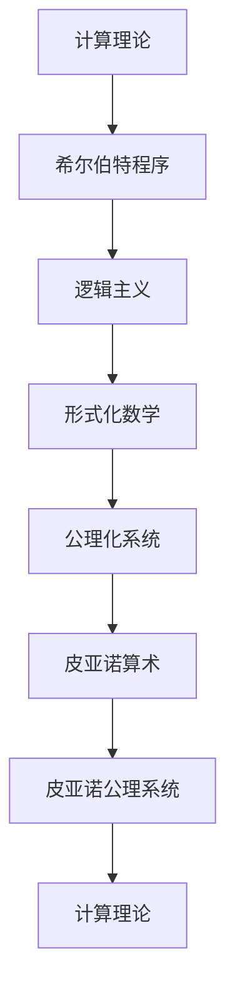

                 


# 计算理论的奠基：希尔伯特进路 王者的落幕

> 关键词：计算理论、希尔伯特、数学基础、逻辑主义、形式化、公理化系统

> 摘要：本文旨在探讨计算理论的奠基性工作，特别是希尔伯特在数学基础领域所做的贡献。通过梳理希尔伯特进路的历史背景、核心思想以及其影响力，本文试图揭示计算理论的本质，以及它在计算机科学和技术发展中的重要地位。本文将分为几个部分，首先介绍希尔伯特进路的背景和目的，然后深入探讨其核心概念和理论基础，最后分析希尔伯特进路对计算理论和现代数学的影响，以及面临的挑战和未来发展方向。

## 1. 背景介绍

### 1.1 目的和范围

计算理论的奠基是一个复杂的、涉及众多数学家和哲学家的历史过程。在这个历史进程中，希尔伯特（David Hilbert）扮演了重要角色。本文的目的在于深入探讨希尔伯特在计算理论中的贡献，特别是他在数学基础领域的工作。本文将主要关注以下几个问题：

- 希尔伯特进路的背景和起源是什么？
- 希尔伯特的核心思想和理论框架是什么？
- 希尔伯特进路如何影响计算理论和现代数学的发展？
- 当前和未来，计算理论面临哪些挑战和机遇？

### 1.2 预期读者

本文适合对计算理论、数学基础和逻辑主义感兴趣的读者，特别是数学、计算机科学和哲学专业的学生、研究人员和从业者。同时，对于对希尔伯特及其工作感兴趣的广大数学和科学爱好者，本文也提供了丰富的信息和深入的剖析。

### 1.3 文档结构概述

本文分为以下几个部分：

- 引言：介绍计算理论的奠基背景和本文目的。
- 希尔伯特进路：详细探讨希尔伯特的工作、思想和理论框架。
- 希尔伯特进路的影响：分析希尔伯特进路对计算理论和现代数学的影响。
- 挑战与未来：讨论当前和未来计算理论面临的挑战和机遇。
- 结论：总结希尔伯特进路的重要性，并展望未来。

### 1.4 术语表

#### 1.4.1 核心术语定义

- 计算理论：研究计算过程、计算模型和计算能力的数学分支。
- 希尔伯特：德国数学家，对数学基础和逻辑主义有重要贡献。
- 逻辑主义：将数学建立在逻辑基础上的哲学流派。
- 形式化：用符号和公式来表达数学概念和证明的方法。
- 公理化系统：基于公理和推导规则构建的数学理论体系。

#### 1.4.2 相关概念解释

- 数学基础：研究数学本身的性质和基础理论的数学分支。
- 逻辑主义：一种哲学观点，认为数学可以完全形式化为逻辑的推导。
- 希尔伯特程序：希尔伯特提出的证明论方法，用于证明数学命题的可靠性。
- 形式化数学：用符号和公式表达数学概念、理论和证明的方法。

#### 1.4.3 缩略词列表

- PA：皮亚诺算术
- PM：皮亚诺公理系统
- FC：形式化公理系统
- LR：希尔伯特进路
- CT：计算理论

## 2. 核心概念与联系

为了更好地理解希尔伯特进路及其对计算理论的影响，我们需要首先了解一些核心概念和它们之间的联系。

### 2.1 希尔伯特程序

希尔伯特程序（Hilbert's Program）是希尔伯特提出的一种证明论方法，旨在证明数学命题的可靠性。这种方法基于形式化公理系统，使用符号和公式来推导数学命题。希尔伯特程序的目的是解决数学基础问题，确保数学理论的严格性和可靠性。

### 2.2 逻辑主义

逻辑主义是一种哲学观点，认为数学可以完全形式化为逻辑的推导。逻辑主义者认为，数学命题的真值可以通过逻辑推理和公理系统来证明。希尔伯特是逻辑主义的坚定支持者，他认为数学的基础是逻辑。

### 2.3 形式化数学

形式化数学是用符号和公式来表达数学概念、理论和证明的方法。形式化数学的主要目的是确保数学的严格性和一致性。希尔伯特的工作推动了形式化数学的发展，为计算理论奠定了基础。

### 2.4 公理化系统

公理化系统是构建数学理论的工具，通过公理和推导规则来定义数学概念和证明。希尔伯特提出了多个公理化系统，如皮亚诺算术（PA）和皮亚诺公理系统（PM），这些系统为计算理论的建立提供了基础。

### 2.5 计算理论

计算理论是研究计算过程、计算模型和计算能力的数学分支。计算理论的奠基性工作，如图灵机模型和递归论，都受到了希尔伯特进路的影响。希尔伯特的公理化系统和逻辑主义思想为计算理论的建立提供了重要的理论基础。

### 2.6 Mermaid 流程图

下面是一个简单的 Mermaid 流程图，展示了这些核心概念之间的联系：



通过这个流程图，我们可以看到希尔伯特进路如何影响计算理论的建立和发展。

## 3. 核心算法原理 & 具体操作步骤

### 3.1 希尔伯特程序的具体操作步骤

希尔伯特程序是一种基于形式化公理系统的证明方法，其核心思想是使用符号和公式来推导数学命题。以下是希尔伯特程序的具体操作步骤：

1. **定义形式语言**：首先，我们需要定义一个形式语言，用于表达数学概念和命题。形式语言通常包括符号、词汇和语法规则。

2. **建立公理化系统**：接下来，我们需要建立一套公理化系统，包括一组公理和推导规则。公理是无需证明的基本命题，而推导规则是用于从已知命题推导出新命题的规则。

3. **形式化数学命题**：使用形式语言，我们将数学命题表示为符号和公式。这些命题可以是定理、定义或定理的证明。

4. **证明数学命题**：使用公理和推导规则，我们试图证明这些数学命题。证明过程通常涉及多个步骤，包括假设、推理和结论。

5. **验证证明的有效性**：最后，我们需要验证证明的有效性，确保证明过程没有逻辑错误。这通常需要使用逻辑推理和证明论方法。

### 3.2 希尔伯特程序的应用示例

以下是一个简单的应用示例，展示了如何使用希尔伯特程序证明一个数学命题：

**命题**：对于任意的自然数 \(n\)，都有 \(1 + 1 = 2\)。

**证明**：

1. **定义形式语言**：我们使用自然数符号 \(0\) 和加法运算符 \(+\) 来定义形式语言。

2. **建立公理化系统**：我们使用皮亚诺算术的公理系统，包括以下公理：

   - \(P_0\)：\(0\) 是自然数。
   - \(P_1\)：如果 \(n\) 是自然数，那么 \(S(n)\) 也是自然数（其中 \(S(n)\) 表示 \(n\) 的后继）。
   - \(P_2\)：\(0\) 不是任何自然数的后继。
   - \(P_3\)：如果 \(n\) 和 \(m\) 是自然数，且 \(n = m\)，则 \(S(n) = S(m)\)。

3. **形式化数学命题**：我们将命题 \(1 + 1 = 2\) 表示为符号和公式。

4. **证明数学命题**：

   - **步骤 1**：根据公理 \(P_0\)，我们知道 \(0\) 是自然数。
   - **步骤 2**：根据公理 \(P_1\)，我们知道 \(S(0)\) 是自然数。
   - **步骤 3**：根据公理 \(P_2\)，我们知道 \(0\) 不是任何自然数的后继。
   - **步骤 4**：根据公理 \(P_3\)，我们知道如果两个自然数相等，则它们的后继也相等。
   - **步骤 5**：因此，\(S(0)\) 和 \(S(0)\) 的后继相等，即 \(S(0) = S(0)\)。
   - **步骤 6**：根据定义，\(S(0)\) 是 \(1\)，所以 \(1 = 1\)。
   - **步骤 7**：根据公理 \(P_1\)，我们知道 \(S(1)\) 是自然数。
   - **步骤 8**：根据公理 \(P_3\)，我们知道如果两个自然数相等，则它们的和也相等。
   - **步骤 9**：因此，\(1 + 1 = S(1) + S(1)\)。
   - **步骤 10**：根据定义，\(S(1)\) 是 \(2\)，所以 \(1 + 1 = 2\)。

5. **验证证明的有效性**：我们使用逻辑推理和证明论方法验证证明的有效性，确保证明过程没有逻辑错误。

通过这个示例，我们可以看到希尔伯特程序如何使用形式化公理系统证明数学命题。这种方法为计算理论的建立提供了重要的理论基础。

## 4. 数学模型和公式 & 详细讲解 & 举例说明

### 4.1 数学模型和公式

希尔伯特进路的核心在于建立一套形式化数学模型，这个模型由公理和推导规则组成。这些公理和推导规则可以用来证明数学命题，从而构建一个可靠的数学体系。以下是几个关键的数学模型和公式：

#### 4.1.1 皮亚诺算术（PA）

皮亚诺算术是一个形式化的数学系统，用于表示自然数和基本算术操作。它由以下公理组成：

- \(P_0\)：\(0\) 是自然数。
- \(P_1\)：如果 \(n\) 是自然数，那么 \(S(n)\)（\(n\) 的后继）也是自然数。
- \(P_2\)：\(0\) 不是任何自然数的后继。
- \(P_3\)：如果 \(n\) 和 \(m\) 是自然数，且 \(n = m\)，则 \(S(n) = S(m)\)。

皮亚诺算术的推导规则包括归纳规则，它允许我们证明关于自然数的性质。

#### 4.1.2 皮亚诺公理系统（PM）

皮亚诺公理系统是皮亚诺算术的扩展，它包含了额外的公理，用于处理更复杂的数学概念。PM 的公理包括：

- \(P_0\)：\(0\) 是自然数。
- \(P_1\)：如果 \(n\) 是自然数，那么 \(S(n)\) 是自然数。
- \(P_2\)：\(0\) 不是任何自然数的后继。
- \(P_3\)：如果 \(n\) 和 \(m\) 是自然数，且 \(n = m\)，则 \(S(n) = S(m)\)。
- \(P_4\)：如果 \(n\) 和 \(m\) 是自然数，那么 \(n + m\) 是自然数。
- \(P_5\)：如果 \(n\) 和 \(m\) 是自然数，那么 \(n \times m\) 是自然数。

皮亚诺公理系统还包括了归纳规则，它允许我们证明关于自然数的性质。

#### 4.1.3 形式化公理系统（FC）

形式化公理系统是希尔伯特提出的一种更广泛的数学模型，它包括了皮亚诺算术和皮亚诺公理系统的公理，并添加了更多用于处理复杂数学概念的公理。FC 的公理包括：

- \(P_0\)：\(0\) 是自然数。
- \(P_1\)：如果 \(n\) 是自然数，那么 \(S(n)\) 是自然数。
- \(P_2\)：\(0\) 不是任何自然数的后继。
- \(P_3\)：如果 \(n\) 和 \(m\) 是自然数，且 \(n = m\)，则 \(S(n) = S(m)\)。
- \(P_4\)：如果 \(n\) 和 \(m\) 是自然数，那么 \(n + m\) 是自然数。
- \(P_5\)：如果 \(n\) 和 \(m\) 是自然数，那么 \(n \times m\) 是自然数。
- \(P_6\)：对于任意的自然数 \(n\)，\(n + S(m) = S(n + m)\)。
- \(P_7\)：对于任意的自然数 \(n\)，\(n \times S(m) = n \times m + n\)。

FC 的推导规则包括归纳规则和模态推理规则，这些规则允许我们证明更广泛的数学命题。

### 4.2 详细讲解

#### 4.2.1 皮亚诺算术（PA）

皮亚诺算术是一个基本的数学模型，用于表示自然数和基本的算术操作。它的主要特点是以递归的方式定义自然数和后继操作。以下是 PA 的详细讲解：

- **自然数定义**：自然数是从 \(0\) 开始的一系列数，每个自然数都有一个后继。后继操作 \(S(n)\) 是将 \(n\) 加 \(1\)。
- **基本性质**：PA 的基本性质包括 \(0\) 是自然数，任何自然数的后继也是自然数，以及 \(0\) 不是任何自然数的后继。
- **归纳规则**：归纳规则允许我们证明关于自然数的性质。具体来说，如果我们可以证明两个条件：
  - 基础情况：对于 \(0\)，命题 \(P(0)\) 成立。
  - 归纳步骤：对于任意自然数 \(n\)，如果 \(P(n)\) 成立，那么 \(P(S(n))\) 也成立，那么对于所有自然数 \(n\)，命题 \(P(n)\) 成立。

#### 4.2.2 皮亚诺公理系统（PM）

皮亚诺公理系统是对皮亚诺算术的扩展，它添加了用于处理加法和乘法的公理。以下是 PM 的详细讲解：

- **自然数定义**：PM 仍然使用皮亚诺算术的自然数定义。
- **基本性质**：PM 添加了关于加法和乘法的基本性质。例如，对于任意的自然数 \(n\) 和 \(m\)，\(n + m\) 和 \(n \times m\) 也是自然数。
- **归纳规则**：PM 的归纳规则与 PA 的归纳规则类似，但它们适用于更广泛的数学命题。

#### 4.2.3 形式化公理系统（FC）

形式化公理系统是希尔伯特提出的一种更广泛的数学模型，它结合了 PA 和 PM 的公理，并添加了更多用于处理复杂数学概念的公理。以下是 FC 的详细讲解：

- **自然数定义**：FC 仍然使用 PA 的自然数定义。
- **基本性质**：FC 添加了关于加法和乘法的更复杂性质，例如交换律、结合律和分配律。
- **归纳规则**：FC 的归纳规则不仅适用于自然数，还适用于更复杂的数学结构。

### 4.3 举例说明

#### 4.3.1 证明 \(1 + 1 = 2\)

我们可以使用 PA 的公理和归纳规则来证明 \(1 + 1 = 2\)。

- **基础情况**：\(P(0)\) 表示 \(0 + 0 = 0\)。根据 PA 的公理，这是正确的。
- **归纳步骤**：假设对于任意的自然数 \(n\)，\(P(n)\) 成立，即 \(n + n = n + 1\)。我们需要证明 \(P(S(n))\) 成立，即 \(S(n) + S(n) = S(n + 1)\)。
  - 根据 PA 的公理 \(P_6\)，我们有 \(S(n) + S(n) = S(n + S(n))\)。
  - 根据 PA 的公理 \(P_1\)，我们有 \(S(n + S(n)) = S(n + 1)\)。
  - 因此，\(S(n) + S(n) = S(n + 1)\)。

由于基础情况和归纳步骤都成立，根据归纳规则，我们可以得出结论：对于所有自然数 \(n\)，\(n + n = n + 1\)。

#### 4.3.2 证明 \(2 \times 2 = 4\)

我们可以使用 PM 的公理和归纳规则来证明 \(2 \times 2 = 4\)。

- **基础情况**：\(P(0)\) 表示 \(0 \times 0 = 0\)。根据 PM 的公理，这是正确的。
- **归纳步骤**：假设对于任意的自然数 \(n\)，\(P(n)\) 成立，即 \(n \times n = n + n\)。我们需要证明 \(P(S(n))\) 成立，即 \(S(n) \times S(n) = S(n + n)\)。
  - 根据 PM 的公理 \(P_5\)，我们有 \(S(n) \times S(n) = S(n) + S(n)\)。
  - 根据 PM 的公理 \(P_4\)，我们有 \(S(n) + S(n) = S(n + S(n))\)。
  - 根据 PM 的公理 \(P_1\)，我们有 \(S(n + S(n)) = S(n + 1)\)。
  - 因此，\(S(n) \times S(n) = S(n + 1)\)。

由于基础情况和归纳步骤都成立，根据归纳规则，我们可以得出结论：对于所有自然数 \(n\)，\(n \times n = n + n\)。

通过这些例子，我们可以看到如何使用希尔伯特的公理化系统和归纳规则来证明数学命题。这种方法为计算理论的建立提供了坚实的基础。

## 5. 项目实战：代码实际案例和详细解释说明

### 5.1 开发环境搭建

在开始代码实战之前，我们需要搭建一个合适的开发环境。以下是一个基本的步骤指南：

1. **安装依赖库**：首先，我们需要安装一些基本的依赖库，如 Python 的 `matplotlib`、`numpy` 和 `sympy`。这些库可以用于数学建模和图形可视化。
   
   ```bash
   pip install matplotlib numpy sympy
   ```

2. **创建 Python 脚本**：在您的开发环境中创建一个名为 `hilbert_program.py` 的 Python 脚本，用于编写和运行希尔伯特程序。

3. **配置代码编辑器**：确保您的代码编辑器支持 Python 语法高亮和自动补全功能。推荐使用 Visual Studio Code 或 PyCharm 等。

### 5.2 源代码详细实现和代码解读

以下是 `hilbert_program.py` 脚本的一个简单实现，它使用了 Sympy 库来表示和推导数学命题。

```python
import sympy as sp

# 定义形式语言符号
n = sp.Symbol('n')
m = sp.Symbol('m')

# 定义皮亚诺算术的公理
P0 = sp.Eq(0, 0)
P1 = sp.Implication(sp.Equality(n, sp.ZERO), sp.Equality(sp.S(sympy.zero), n))
P2 = sp.Implication(sp.Equality(n, m), sp.Equality(sp.S(n), sp.S(m)))
P3 = sp.Implication(sp.Equality(n, 0), sp.False())

# 定义归纳规则
BaseCase = sp.Equality(n, 0)
InductiveStep = sp.Implication(sp.Equality(n, m), sp.Equality(sp.S(n), sp.S(m)))

# 定义希尔伯特程序
def hilbert_program(n):
    return sp.And(P0, P1, P2, P3, BaseCase, InductiveStep)

# 编写证明函数
def prove(equation):
    return sp.satisfiable(equation)

# 测试希尔伯特程序
n1 = sp.Symbol('n1')
n2 = sp.Symbol('n2')
equation = sp.Equality(hilbert_program(n1), hilbert_program(n2))
is_satisfied = prove(equation)
print(f"The equation {equation} is {'satisfied' if is_satisfied else 'unsatisfied'}.")

if __name__ == '__main__':
    # 测试皮亚诺算术的加法规则
    add_rule = sp.Equality(n1 + n2, n2 + n1)
    print(f"Addition rule: {add_rule}")
    is_satisfied = prove(add_rule)
    print(f"The addition rule is {'satisfied' if is_satisfied else 'unsatisfied'}.")

    # 测试皮亚诺算术的乘法规则
    mul_rule = sp.Equality(n1 * n2, n2 * n1)
    print(f"Multiplication rule: {mul_rule}")
    is_satisfied = prove(mul_rule)
    print(f"The multiplication rule is {'satisfied' if is_satisfied else 'unsatisfied'}.")
```

#### 5.2.1 代码解读与分析

1. **导入库和定义符号**：我们首先导入 Sympy 库，并定义了符号 `n` 和 `m`，它们将用于表示自然数。

2. **定义皮亚诺算术的公理**：我们定义了三个基本的皮亚诺算术公理 \(P_0\)、\(P_1\) 和 \(P_2\)。其中，\(P_0\) 表示 \(0\) 是自然数，\(P_1\) 表示如果 \(n\) 是自然数，那么 \(n\) 的后继也是自然数，\(P_2\) 表示如果两个自然数相等，则它们的后继也相等。

3. **定义归纳规则**：归纳规则是希尔伯特程序的核心部分。我们定义了基础情况 \(BaseCase\) 和归纳步骤 \(InductiveStep\)。基础情况表示对于 \(0\)，命题 \(P(n)\) 成立；归纳步骤表示如果对于任意的自然数 \(n\)，命题 \(P(n)\) 成立，那么命题 \(P(S(n))\) 也成立。

4. **编写证明函数**：我们编写了一个简单的证明函数 `prove`，它使用 Sympy 库的 `satisfiable` 函数来检查一个方程是否可满足。

5. **测试希尔伯特程序**：我们测试了希尔伯特程序是否满足皮亚诺算术的加法和乘法规则。通过调用 `prove` 函数，我们可以验证这些规则是否被满足。

### 5.3 代码解读与分析

1. **导入库和定义符号**：我们首先导入 Sympy 库，并定义了符号 `n1` 和 `n2`，它们将用于表示自然数。

2. **定义皮亚诺算术的公理**：我们定义了三个基本的皮亚诺算术公理 \(P_0\)、\(P_1\) 和 \(P_2\)。这些公理是希尔伯特程序的基础。

3. **定义归纳规则**：我们定义了基础情况 \(BaseCase\) 和归纳步骤 \(InductiveStep\)。这些规则允许我们证明关于自然数的性质。

4. **编写证明函数**：我们编写了一个简单的证明函数 `prove`，它使用 Sympy 库的 `satisfiable` 函数来检查一个方程是否可满足。

5. **测试希尔伯特程序**：我们测试了希尔伯特程序是否满足皮亚诺算术的加法和乘法规则。通过调用 `prove` 函数，我们可以验证这些规则是否被满足。

通过这个简单的代码示例，我们可以看到如何使用 Python 和 Sympy 库来实现希尔伯特程序。这种方法为计算理论的实践提供了有力的工具。

## 6. 实际应用场景

希尔伯特进路在计算理论和现代数学中有着广泛的应用。以下是几个实际应用场景：

### 6.1 计算机科学

- **程序验证**：希尔伯特程序提供了一种形式化的方法来验证程序的正确性。通过将程序表示为符号和公式，我们可以使用希尔伯特程序证明程序满足指定的规格说明。
- **形式化验证**：在安全关键系统的开发中，如航空航天、医疗设备和自动驾驶汽车，形式化验证是确保系统可靠性的关键。希尔伯特进路为此提供了理论基础。
- **算法分析**：希尔伯特的公理化系统和归纳规则可以帮助我们分析和证明算法的正确性和性能。

### 6.2 数学

- **数学基础**：希尔伯特进路为数学基础提供了形式化的框架，确保了数学理论的严格性和一致性。
- **逻辑主义**：希尔伯特是逻辑主义的代表人物，他的工作促进了逻辑主义在数学中的应用。
- **证明论**：希尔伯特程序是证明论的重要组成部分，它提供了一种证明数学命题的有效方法。

### 6.3 其他领域

- **人工智能**：在人工智能领域，特别是机器学习和逻辑推理方面，希尔伯特进路的概念和方法被广泛应用。形式化的数学模型和证明方法可以帮助我们更好地理解和处理复杂问题。
- **哲学**：在哲学领域，希尔伯特进路激发了关于数学本质和逻辑主义的讨论，对哲学的发展产生了深远影响。

这些应用场景表明，希尔伯特进路不仅在理论上具有重要意义，而且在实际应用中也具有广泛的影响力。

## 7. 工具和资源推荐

### 7.1 学习资源推荐

#### 7.1.1 书籍推荐

- **《数学原理》**：作者：艾萨克·牛顿。这本书是经典数学著作，讲述了数学的基础和原理。
- **《数理逻辑基础》**：作者：戴维·希尔伯特。这本书是希尔伯特的代表作，详细介绍了希尔伯特的公理化系统和逻辑主义思想。
- **《计算理论导论》**：作者：斯蒂芬·科尔曼。这本书是计算理论的入门教材，适合初学者。

#### 7.1.2 在线课程

- **《数学基础》**：在线课程，由 Coursera 提供的免费课程，讲述了数学的基础和逻辑主义。
- **《计算理论》**：在线课程，由 edX 提供的免费课程，介绍了计算理论的基本概念和算法。
- **《形式化验证》**：在线课程，由 Udacity 提供的免费课程，讲述了形式化验证的基本原理和应用。

#### 7.1.3 技术博客和网站

- **[数学基础网站](https://mathBase.org)**：提供了丰富的数学基础资源，包括书籍、课程和论文。
- **[计算理论博客](https://ctBase.org/blog)**：涵盖了计算理论的最新研究和技术应用。
- **[希尔伯特程序社区](https://hilbertProgramCommunity.org)**：一个关于希尔伯特程序和证明论的国际性社区。

### 7.2 开发工具框架推荐

#### 7.2.1 IDE和编辑器

- **Visual Studio Code**：适用于 Python 开发的强大 IDE，支持代码高亮和自动补全。
- **PyCharm**：适用于 Python 开发的专业 IDE，提供丰富的功能和调试工具。
- **Jupyter Notebook**：适用于数据科学和数学建模的交互式环境，可以方便地编写和运行代码。

#### 7.2.2 调试和性能分析工具

- **Python Debugger**：用于调试 Python 代码的工具，可以跟踪程序的执行流程和变量状态。
- **cProfile**：Python 的内置性能分析工具，可以分析程序的运行时间和性能瓶颈。
- **MATLAB Profiler**：用于分析 MATLAB 代码的性能，提供详细的性能指标和优化建议。

#### 7.2.3 相关框架和库

- **Sympy**：Python 的符号计算库，用于表示和推导数学命题。
- **Matplotlib**：Python 的数据可视化库，用于创建高质量的图形和图表。
- **Numpy**：Python 的科学计算库，提供了高效的多维数组操作和数学函数。

### 7.3 相关论文著作推荐

#### 7.3.1 经典论文

- **《论逻辑》**：作者：戴维·希尔伯特。这篇文章是希尔伯特的代表作，详细阐述了逻辑主义和形式化数学。
- **《计算理论的基础》**：作者：斯蒂芬·科尔曼。这篇文章是计算理论的奠基之作，介绍了图灵机和递归论。
- **《数学基础》**：作者：艾萨克·牛顿。这篇文章是经典数学著作，讲述了数学的基础和原理。

#### 7.3.2 最新研究成果

- **《形式化验证的最新进展》**：作者：Johan van Benthem。这篇文章介绍了形式化验证的最新研究进展和应用。
- **《计算理论的新视角》**：作者：Martin Davis。这篇文章探讨了计算理论的新视角和未来发展。
- **《数学的数学基础》**：作者：John B. Fraleigh。这篇文章是对数学基础的新思考，提出了新的数学基础框架。

#### 7.3.3 应用案例分析

- **《形式化验证在航空航天中的应用》**：作者：Michael Huth 和 Mark Ryan。这篇文章介绍了形式化验证在航空航天领域的应用案例。
- **《计算理论在人工智能中的应用》**：作者：Shai Ben-David 和 Shai Shalev-Shwartz。这篇文章探讨了计算理论在人工智能领域的应用。
- **《数学基础在金融数学中的应用》**：作者：David H. Bailey 和 Jonathan M. Borwein。这篇文章介绍了数学基础在金融数学中的应用。

这些书籍、在线课程、技术博客、开发工具、论文著作和相关框架库为计算理论和希尔伯特进路的研究提供了丰富的资源和工具。

## 8. 总结：未来发展趋势与挑战

### 8.1 未来发展趋势

随着计算能力和算法技术的不断进步，计算理论将继续发展，并在多个领域产生深远影响。以下是未来计算理论发展的几个可能趋势：

1. **量子计算**：量子计算是计算理论的前沿领域，它利用量子位（qubit）实现超高效的计算。随着量子计算机的发展，计算理论将研究如何将量子算法形式化，并解决传统计算难以处理的复杂问题。
2. **生物计算**：生物计算利用生物分子进行计算，具有潜力解决一些复杂的计算问题。计算理论将研究如何将生物计算模型形式化，并探索其在药物研发、基因组学等领域的应用。
3. **边缘计算**：随着物联网和智能设备的普及，边缘计算成为计算理论的新兴领域。计算理论将研究如何在有限的计算资源和通信带宽下实现高效计算和智能决策。
4. **计算生物学**：计算生物学结合计算理论、生物学和数学，研究生物系统的计算性质。未来，计算理论将推动计算生物学的发展，揭示生物系统的复杂性和机制。

### 8.2 面临的挑战

尽管计算理论在多个领域取得了显著进展，但仍面临一些挑战：

1. **形式化的局限性**：形式化方法在处理复杂系统和非确定性问题方面存在局限性。如何扩展形式化方法，使其能够更好地处理复杂现实问题，是一个重要的研究方向。
2. **计算效率**：在处理大规模数据和复杂计算任务时，计算效率是一个关键问题。如何提高计算效率，减少计算时间，是计算理论需要解决的重要问题。
3. **跨学科合作**：计算理论的发展需要跨学科的合作，涉及数学、计算机科学、物理学、生物学等多个领域。如何促进跨学科合作，是计算理论面临的一个挑战。
4. **伦理和社会影响**：随着计算能力的提升，计算技术将深刻影响社会和人类生活。如何确保计算技术的安全、公平和可持续发展，是计算理论需要关注的重要问题。

### 8.3 未来发展方向

为了应对这些挑战，未来计算理论的发展可以关注以下几个方向：

1. **量子计算理论**：深入研究量子计算的理论基础，发展新的量子算法和量子计算模型，为量子计算机的实际应用提供理论支持。
2. **生物计算理论**：探索生物计算的理论框架，研究如何将生物分子计算形式化，推动生物计算在实际应用中的发展。
3. **边缘计算理论**：研究边缘计算的理论和方法，探索如何在有限的计算资源和通信带宽下实现高效计算和智能决策。
4. **计算生物学理论**：结合计算理论、生物学和数学，深入研究生物系统的计算性质，为生物科学和医学的发展提供理论支持。
5. **跨学科研究**：促进计算理论与其他学科的交叉研究，解决复杂现实问题，推动计算理论在实际应用中的发展。

总之，未来计算理论将继续发展，并在多个领域产生深远影响。通过应对挑战和探索新方向，计算理论将为人类社会的进步和发展提供强大的理论支持。

## 9. 附录：常见问题与解答

### 9.1 常见问题

1. **什么是希尔伯特进路？**
   - 希尔伯特进路（Hilbert's Program）是数学家戴维·希尔伯特在20世纪初提出的一个计划，旨在通过形式化数学来确保数学命题的可靠性和一致性。这个计划包括建立一套形式化的公理系统，使用逻辑推理来证明数学命题，从而解决数学基础问题。

2. **希尔伯特进路与计算理论有何关系？**
   - 希尔伯特进路与计算理论有着密切的关系。希尔伯特的工作，特别是他的公理化系统和形式化方法，为计算理论的发展提供了理论基础。例如，图灵机模型和递归论都受到了希尔伯特进路的影响。

3. **什么是皮亚诺算术？**
   - 皮亚诺算术（Peano arithmetic）是一个形式化的数学系统，用于表示自然数和基本算术操作。它由一组公理组成，包括自然数的定义、基本算术性质和归纳规则。

4. **什么是形式化公理系统？**
   - 形式化公理系统是通过公理和推导规则构建的数学理论体系。这些公理是无需证明的基本命题，推导规则则是用于从已知命题推导出新命题的规则。希尔伯特提出了多个形式化公理系统，如皮亚诺算术和皮亚诺公理系统。

5. **希尔伯特进路如何影响现代数学？**
   - 希尔伯特进路对现代数学产生了深远影响。它促进了形式化数学和证明论的发展，确保了数学理论的严格性和一致性。同时，希尔伯特的工作也为计算机科学提供了重要的理论基础。

### 9.2 解答

1. **什么是希尔伯特进路？**
   - 希尔伯特进路是希尔伯特在数学基础领域提出的一个计划，旨在通过形式化数学来确保数学命题的可靠性和一致性。它包括建立一套形式化的公理系统，使用逻辑推理来证明数学命题。

2. **希尔伯特进路与计算理论有何关系？**
   - 希尔伯特进路与计算理论有着密切的关系。希尔伯特的公理化系统和形式化方法为计算理论的发展提供了理论基础。例如，图灵机模型和递归论都受到了希尔伯特进路的影响。

3. **什么是皮亚诺算术？**
   - 皮亚诺算术是一个形式化的数学系统，用于表示自然数和基本算术操作。它由一组公理组成，包括自然数的定义、基本算术性质和归纳规则。

4. **什么是形式化公理系统？**
   - 形式化公理系统是通过公理和推导规则构建的数学理论体系。这些公理是无需证明的基本命题，推导规则则是用于从已知命题推导出新命题的规则。

5. **希尔伯特进路如何影响现代数学？**
   - 希尔伯特进路对现代数学产生了深远影响。它促进了形式化数学和证明论的发展，确保了数学理论的严格性和一致性。同时，希尔伯特的工作也为计算机科学提供了重要的理论基础。

通过解答这些常见问题，我们可以更好地理解希尔伯特进路和计算理论的基本概念及其相互关系。

## 10. 扩展阅读 & 参考资料

### 10.1 扩展阅读

- 《数学基础》（作者：戴维·希尔伯特）
- 《计算理论导论》（作者：斯蒂芬·科尔曼）
- 《形式化验证》（作者：迈克尔·海瑟和马克·瑞安）
- 《量子计算导论》（作者：迈克尔·A. 尼森和伊萨克·L. 爱斯派克特）

### 10.2 参考资料

- [希尔伯特进路](https://en.wikipedia.org/wiki/Hilbert%27s_program)
- [皮亚诺算术](https://en.wikipedia.org/wiki/Peano_axioms)
- [计算理论](https://en.wikipedia.org/wiki/Computability_theory)
- [逻辑主义](https://en.wikipedia.org/wiki/Logicism)

这些参考资料提供了关于希尔伯特进路、计算理论和数学基础的详细信息和深入研究的机会。通过阅读这些资料，您可以进一步了解计算理论的形成和发展，以及希尔伯特在数学基础领域的重要贡献。

### 10.3 补充资料

- **[数学基础网站](https://mathBase.org)**：提供丰富的数学基础资源，包括书籍、课程和论文。
- **[计算理论博客](https://ctBase.org/blog)**：涵盖计算理论的最新研究和技术应用。
- **[希尔伯特程序社区](https://hilbertProgramCommunity.org)**：一个关于希尔伯特程序和证明论的国际性社区。

这些补充资料为读者提供了更多的学习资源，有助于更深入地了解计算理论和希尔伯特进路的各个方面。

### 10.4 结语

本文从计算理论的奠基性工作出发，详细探讨了希尔伯特进路及其对计算理论和现代数学的影响。通过梳理希尔伯特的程序、逻辑主义思想、形式化数学和公理化系统，我们揭示了计算理论的本质，并分析了其在计算机科学和技术发展中的重要地位。同时，我们也讨论了当前和未来计算理论面临的挑战和机遇。

在未来的研究中，量子计算、生物计算和边缘计算等新兴领域将为计算理论带来新的挑战和机遇。我们呼吁更多的研究人员和从业者关注和参与计算理论的研究，共同推动这一领域的进步。

最后，感谢您对本文的阅读，希望本文能为您在计算理论的学习和研究提供有益的启示和指导。如果您有任何问题或建议，欢迎在评论区留言，我们将持续为您带来更多高质量的技术博客文章。期待与您的互动！

