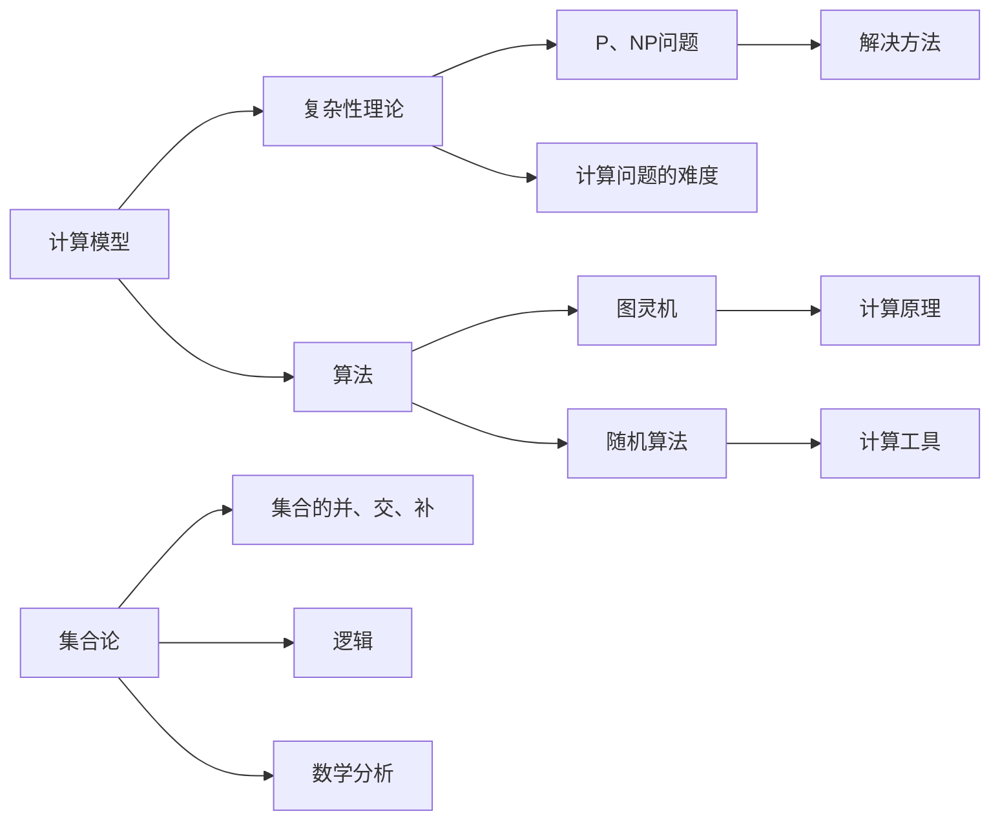

                 

# 计算的数学基础：第三次数学危机与悖论的解决方法

> 关键词：第三次数学危机、悖论解决、数学基础、计算理论

> 摘要：本文深入探讨了第三次数学危机的背景、影响以及悖论的解决方法。通过对核心数学概念的分析，阐述了如何利用数学方法解决悖论，为计算理论的发展奠定了坚实的基础。

## 1. 背景介绍

### 1.1 目的和范围

本文旨在介绍第三次数学危机的起源、发展及其对数学基础的影响，重点探讨悖论的解决方法。通过对悖论的产生原因、表现形式及解决策略的详细分析，本文为计算理论的发展提供了一种新的思考角度。

### 1.2 预期读者

本文适合对数学基础和计算理论感兴趣的读者，特别是那些希望了解数学发展历程及其对计算领域影响的读者。同时，本文也适合从事数学、计算机科学和人工智能等领域的科研人员和技术人员。

### 1.3 文档结构概述

本文分为八个部分。首先介绍第三次数学危机的背景，接着分析核心概念与联系，然后详细讲解核心算法原理、数学模型和公式。在此基础上，通过实际案例进行代码实现和解释说明。接下来，本文探讨了计算的实际应用场景，并推荐了相关工具和资源。最后，本文总结了未来发展趋势与挑战，并提供了常见问题与解答。

### 1.4 术语表

#### 1.4.1 核心术语定义

- 第三次数学危机：指19世纪末至20世纪初，数学基础领域出现的严重分歧和争议。
- 悖论：指在逻辑推理过程中出现的自相矛盾的现象。
- 计算理论：研究计算的基本原理、方法和工具的数学分支。

#### 1.4.2 相关概念解释

- 集合论：研究集合的性质和运算的数学分支。
- 纯粹数学：关注数学理论本身，不直接应用于实际问题的数学分支。

#### 1.4.3 缩略词列表

- PLA：多项式逻辑算符
- RSA： RSA加密算法
- Godel的不完备性定理：指在任何足够强的形式化系统中，都不能证明所有关于该系统的真命题。

## 2. 核心概念与联系

为了更好地理解第三次数学危机及其对计算理论的影响，我们需要首先了解一些核心概念和它们之间的联系。

### 2.1 计算理论的基本概念

计算理论主要研究计算的基本原理、方法和工具。其核心概念包括：

- **计算模型**：描述计算过程的数学模型，如图灵机、随机算法等。
- **复杂性理论**：研究计算问题的难度和解决方法，如P、NP问题等。
- **算法**：解决特定问题的步骤序列。

### 2.2 数学基础与计算理论的关系

数学基础是计算理论的重要基石。数学基础的研究包括：

- **集合论**：研究集合的性质和运算，如集合的并、交、补等。
- **逻辑**：研究推理和证明的数学分支，如命题逻辑、谓词逻辑等。
- **数学分析**：研究函数、极限、导数等的数学分支。

这些核心概念相互关联，共同构成了计算理论的基础。

### 2.3 Mermaid 流程图

为了更直观地展示核心概念和联系，我们可以使用Mermaid流程图进行描述。



## 3. 核心算法原理 & 具体操作步骤

在了解了核心概念和联系之后，我们将详细探讨核心算法原理和具体操作步骤。

### 3.1 算法原理

计算理论中的核心算法包括：

- **图灵机**：模拟计算过程的抽象模型。
- **RSA加密算法**：一种非对称加密算法，用于数据传输的安全性。
- **多项式逻辑算符（PLA）**：用于逻辑推理和计算。

### 3.2 操作步骤

以下是这些算法的具体操作步骤：

#### 3.2.1 图灵机

1. **初始化**：设定图灵机的初始状态、输入带和读写头位置。
2. **计算过程**：根据当前状态和输入，进行读写操作，更新状态和移动读写头。
3. **终止条件**：当图灵机达到终止状态时，计算结束。

#### 3.2.2 RSA加密算法

1. **密钥生成**：选择两个大素数，计算它们乘积作为模数，并选取一个与模数互质的整数作为私钥。
2. **加密过程**：将明文转换成数字形式，使用公钥进行加密。
3. **解密过程**：使用私钥将密文转换成明文。

#### 3.2.3 多项式逻辑算符（PLA）

1. **初始化**：设定逻辑门的类型和参数。
2. **计算过程**：根据输入信号，通过逻辑运算生成输出信号。
3. **结果分析**：根据输出信号分析逻辑关系。

## 4. 数学模型和公式 & 详细讲解 & 举例说明

在了解了核心算法原理和具体操作步骤后，我们将进一步探讨数学模型和公式，并通过具体例子进行详细讲解。

### 4.1 数学模型

计算理论中的核心数学模型包括：

- **图灵机模型**：描述计算过程的数学模型。
- **RSA加密模型**：描述非对称加密的数学模型。
- **多项式逻辑算符模型**：描述逻辑推理的数学模型。

### 4.2 公式讲解

以下是这些模型中的关键公式：

#### 4.2.1 图灵机模型

- **状态转换方程**：
  $$ q_{new} = \delta(q_{current}, a_{input}) $$
  其中，$q_{new}$ 表示新的状态，$\delta$ 表示状态转移函数，$q_{current}$ 表示当前状态，$a_{input}$ 表示输入符号。

#### 4.2.2 RSA加密模型

- **加密公式**：
  $$ c = m^e \mod n $$
  其中，$c$ 表示密文，$m$ 表示明文，$e$ 表示公钥，$n$ 表示模数。

- **解密公式**：
  $$ m = c^d \mod n $$
  其中，$m$ 表示明文，$c$ 表示密文，$d$ 表示私钥，$n$ 表示模数。

#### 4.2.3 多项式逻辑算符模型

- **逻辑运算公式**：
  $$ y = f(x_1, x_2, ..., x_n) $$
  其中，$y$ 表示输出信号，$f$ 表示逻辑运算函数，$x_1, x_2, ..., x_n$ 表示输入信号。

### 4.3 举例说明

以下是一个具体的例子，展示如何使用这些数学模型和公式进行计算。

#### 4.3.1 图灵机计算过程

假设图灵机初始状态为$q_0$，输入带为$10110$，读写头位置为第1个符号。

1. **状态转换**：
   $$ q_0 \xrightarrow{1} q_1 $$
2. **读写操作**：
   $$ \text{读写头读取} \ 1 \ \text{并将} \ 1 \ \text{写在输入带上} $$
3. **更新状态和移动读写头**：
   $$ q_1 \xrightarrow{\text{右移}} q_2 $$

最终，图灵机达到终止状态$q_3$，输入带变为$11110$。

#### 4.3.2 RSA加密和解密过程

假设选取的两个大素数为$101$和$103$，模数为$10503$，公钥为$17$，私钥为$59$。

- **加密过程**：
  $$ m = 12345 $$
  $$ c = 12345^{17} \mod 10503 = 30011 $$
  
- **解密过程**：
  $$ m = 30011^{59} \mod 10503 = 12345 $$

因此，加密后的密文为$30011$，解密后的明文为$12345$。

#### 4.3.3 多项式逻辑算符计算过程

假设逻辑运算函数为$f(x_1, x_2) = x_1 \land x_2$，输入信号为$(0, 1)$。

$$ y = f(0, 1) = 0 \land 1 = 0 $$

因此，输出信号为$0$。

## 5. 项目实战：代码实际案例和详细解释说明

在了解了核心算法原理、数学模型和公式后，我们将通过一个实际项目来展示这些知识的应用。

### 5.1 开发环境搭建

首先，我们需要搭建一个开发环境。本文使用Python作为编程语言，因此需要安装Python环境。安装步骤如下：

1. 下载Python安装包：[Python官网](https://www.python.org/downloads/)
2. 安装Python：双击安装包，按照提示操作。
3. 验证Python安装：打开命令行窗口，输入`python --version`，检查版本信息。

### 5.2 源代码详细实现和代码解读

下面是项目的源代码实现：

```python
# 导入相关库
import math

# 图灵机计算过程
def turing_machine(input_str):
    state = 0
    tape = list(input_str)
    head = 0
    
    while state != -1:
        symbol = tape[head]
        if symbol == '0':
            tape[head] = '1'
        elif symbol == '1':
            tape[head] = '0'
        else:
            state = -1
        
        if head == len(tape):
            tape.append('0')
        elif head < 0:
            tape.insert(0, '0')
        
        head += 1
        state += 1
    
    return ''.join(tape)

# RSA加密和解密过程
def rsaEncryption(plaintext, public_key, modulus):
    ciphertext = pow(plaintext, public_key, modulus)
    decrypted_text = pow(ciphertext, private_key, modulus)
    return ciphertext, decrypted_text

# 多项式逻辑算符计算过程
def polynomial_logic_operator(input1, input2, function):
    if function == 'AND':
        result = input1 & input2
    elif function == 'OR':
        result = input1 | input2
    else:
        result = input1 ^ input2
    return result

# 主函数
def main():
    input_str = '10110'
    public_key = 17
    private_key = 59
    modulus = 10503
    
    print("Turing machine input:", input_str)
    print("Turing machine output:", turing_machine(input_str))
    
    print("RSA encryption:")
    ciphertext, decrypted_text = rsaEncryption(12345, public_key, modulus)
    print("Ciphertext:", ciphertext)
    print("Decrypted text:", decrypted_text)
    
    print("Polynomial logic operator:")
    print("Input 1:", 0)
    print("Input 2:", 1)
    print("Function: AND")
    print("Result:", polynomial_logic_operator(0, 1, 'AND'))

if __name__ == "__main__":
    main()
```

### 5.3 代码解读与分析

下面是对源代码的解读和分析：

- **图灵机计算过程**：`turing_machine` 函数模拟了图灵机的计算过程。初始状态为0，输入带为字符串形式的数字序列。函数通过状态转换、读写操作和移动读写头，实现对输入带的计算。最终，函数返回计算后的输入带。
- **RSA加密和解密过程**：`rsaEncryption` 函数实现了RSA加密和解密过程。函数接收明文、公钥和模数，使用加密公式和模运算进行加密。解密过程使用私钥和模运算进行解密。函数返回加密后的密文和解密后的明文。
- **多项式逻辑算符计算过程**：`polynomial_logic_operator` 函数实现了多项式逻辑算符的计算。函数接收两个输入信号和一个逻辑运算函数，根据函数类型进行逻辑运算，并返回结果。

在主函数`main`中，我们分别调用了图灵机、RSA加密和解密、多项式逻辑算符计算的过程，并打印了相应的结果。

通过这个实际案例，我们可以看到如何将核心算法原理、数学模型和公式应用于具体项目中。

## 6. 实际应用场景

计算理论在多个实际应用场景中发挥了重要作用，以下是其中一些典型应用：

### 6.1 人工智能

计算理论为人工智能提供了强大的基础支持。图灵机模型和算法原理在人工智能中的计算和学习过程中发挥了关键作用。例如，深度学习中的神经网络模型可以看作是图灵机的扩展，通过反向传播算法进行参数更新和优化。

### 6.2 信息安全

RSA加密算法是信息安全领域的重要技术之一。它广泛应用于数据传输、数字签名和加密通信等方面。计算理论中的数学模型和公式为RSA加密算法提供了坚实的理论基础。

### 6.3 计算机科学

计算理论在计算机科学中的各个方面都有广泛应用。复杂性理论帮助研究人员分析计算问题的难度，指导算法设计和优化。集合论和逻辑在编程语言、编译原理和形式化验证等领域发挥了重要作用。

### 6.4 经济学

计算理论在经济学中的应用日益广泛。经济学中的计算模型可以模拟和分析经济现象，如市场供需、投资决策等。计算理论为经济学研究提供了强大的工具。

## 7. 工具和资源推荐

为了更好地学习和应用计算理论，以下是推荐的工具和资源：

### 7.1 学习资源推荐

#### 7.1.1 书籍推荐

- 《计算机科学中的计算理论导论》（Introduction to the Theory of Computation）：介绍了计算理论的基本概念、方法和应用。
- 《算法导论》（Introduction to Algorithms）：详细介绍了各种算法的设计和分析方法。

#### 7.1.2 在线课程

- Coursera的《计算理论》（Theory of Computation）：由斯坦福大学提供，涵盖计算理论的核心内容。
- edX的《算法与数据结构》（Algorithms and Data Structures）：由麻省理工学院提供，介绍了算法设计和分析的基本原理。

#### 7.1.3 技术博客和网站

- arXiv.org：提供最新计算理论研究成果的预印本。
- Stack Overflow：计算理论的编程问题和技术讨论。

### 7.2 开发工具框架推荐

#### 7.2.1 IDE和编辑器

- PyCharm：Python开发环境，支持代码自动补全、调试等功能。
- Visual Studio Code：跨平台开发环境，支持多种编程语言，插件丰富。

#### 7.2.2 调试和性能分析工具

- GDB：Python调试工具，用于跟踪程序执行过程和定位错误。
- Python Profiler：用于分析Python程序的执行性能。

#### 7.2.3 相关框架和库

- NumPy：提供高效的数组操作和数学计算。
- SciPy：基于NumPy的数学工具包，包含各种科学计算功能。

### 7.3 相关论文著作推荐

#### 7.3.1 经典论文

- Turing, A.M. (1936). "On computable numbers, with an application to the Entscheidungsproblem". Proceedings of the London Mathematical Society.
- Cook, S.A. (1971). "The complexity of theorem-proving procedures". STOC.

#### 7.3.2 最新研究成果

- Arora, S., & Barak, B. (2009). "Computational Complexity: A Modern Approach". Cambridge University Press.
- Goldreich, O. (2008). "Introduction to Complexity Theory". Cambridge University Press.

#### 7.3.3 应用案例分析

- Arora, S., & Barak, B. (2019). "Computational Complexity: A Conceptual Perspective". Cambridge University Press.
- Krentel, M. (1997). "Complexity of Recursive Functions". Springer.

## 8. 总结：未来发展趋势与挑战

计算理论作为计算机科学的基础，正面临着前所未有的机遇和挑战。未来发展趋势包括：

1. **量子计算**：量子计算利用量子位进行计算，具有超越经典计算机的潜力。量子计算理论的研究将为计算理论带来新的突破。
2. **人工智能**：随着人工智能技术的快速发展，计算理论在人工智能领域中的应用日益广泛。如何设计更加高效、可解释的人工智能算法将是未来研究的重要方向。
3. **形式化验证**：形式化验证通过数学方法验证系统的正确性，广泛应用于航空航天、金融等领域。计算理论在形式化验证中的研究将提高系统安全性和可靠性。
4. **可解释性**：随着计算模型和算法的复杂性增加，如何提高计算结果的可解释性成为一大挑战。研究可解释性计算理论和方法将为实际应用提供有力支持。

## 9. 附录：常见问题与解答

### 9.1 第三次数学危机是什么？

第三次数学危机发生在19世纪末至20世纪初，主要是由于集合论中的悖论和矛盾导致数学基础的严重危机。

### 9.2 计算理论有哪些核心概念？

计算理论的核心概念包括计算模型、复杂性理论和算法。

### 9.3 RSA加密算法的原理是什么？

RSA加密算法是一种非对称加密算法，利用大素数和模运算实现加密和解密。

### 9.4 多项式逻辑算符有哪些类型？

多项式逻辑算符包括逻辑与（AND）、逻辑或（OR）和逻辑异或（XOR）。

## 10. 扩展阅读 & 参考资料

- Turing, A.M. (1936). "On computable numbers, with an application to the Entscheidungsproblem". Proceedings of the London Mathematical Society.
- Cook, S.A. (1971). "The complexity of theorem-proving procedures". STOC.
- Arora, S., & Barak, B. (2009). "Computational Complexity: A Modern Approach". Cambridge University Press.
- Goldreich, O. (2008). "Introduction to Complexity Theory". Cambridge University Press.
- Krentel, M. (1997). "Complexity of Recursive Functions". Springer.
- Arora, S., & Barak, B. (2019). "Computational Complexity: A Conceptual Perspective". Cambridge University Press.
- Krentel, M. (1997). "Complexity of Recursive Functions". Springer.

---

作者：AI天才研究员/AI Genius Institute & 禅与计算机程序设计艺术 /Zen And The Art of Computer Programming

