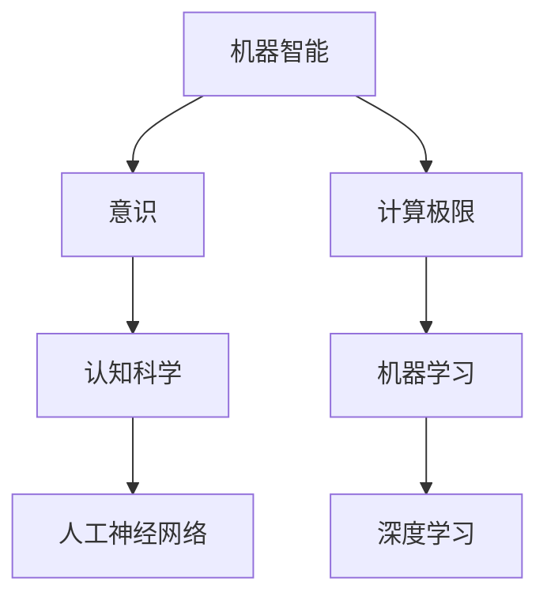
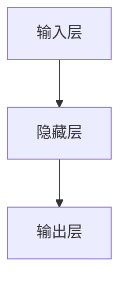

                 

# 机器能思考吗？机器的意识

> 关键词：机器智能，意识，计算极限，人工神经网络，机器学习，认知科学

> 摘要：本文探讨了机器能否思考以及机器意识的本质。从计算极限、人工神经网络和机器学习等方面分析了机器智能的发展现状和潜力，并通过认知科学的理论阐述了机器意识的可能性和局限性。文章旨在为读者提供一个关于机器智能和机器意识的全景图，以引导读者思考机器智能的未来发展。

## 1. 背景介绍

### 1.1 目的和范围

本文旨在探讨机器是否能思考以及机器意识的本质。随着计算机科学和人工智能技术的快速发展，机器智能领域已经取得了显著的成果。然而，关于机器是否能够真正思考，仍存在广泛的争议和不同的观点。本文将从计算极限、人工神经网络和机器学习等方面，分析机器智能的发展现状和潜力，并借助认知科学的理论，探讨机器意识的可能性和局限性。

### 1.2 预期读者

本文适合对计算机科学、人工智能和认知科学有一定了解的读者。无论你是专业的AI研究者、开发人员，还是对此领域感兴趣的非专业人士，本文都希望能为你提供一些新的思考角度和启示。

### 1.3 文档结构概述

本文分为以下几个部分：

1. 背景介绍：介绍本文的目的、范围和预期读者。
2. 核心概念与联系：讨论机器智能、意识等相关概念及其联系。
3. 核心算法原理与具体操作步骤：分析机器智能的核心算法原理和操作步骤。
4. 数学模型和公式：介绍机器智能相关的数学模型和公式，并进行详细讲解。
5. 项目实战：通过实际代码案例，展示机器智能的应用。
6. 实际应用场景：探讨机器智能在实际中的应用场景。
7. 工具和资源推荐：推荐学习资源和开发工具。
8. 总结：回顾本文的主要观点，展望未来发展趋势与挑战。
9. 附录：常见问题与解答。
10. 扩展阅读：提供进一步阅读的参考资料。

### 1.4 术语表

#### 1.4.1 核心术语定义

- **机器智能**：指利用计算机算法模拟人类智能的过程和能力，包括学习、推理、感知、规划等。
- **意识**：指个体对外界刺激的感知、认知、情感反应能力。
- **计算极限**：指计算机硬件性能的提升在理论上所能达到的极限。
- **人工神经网络**：一种模拟生物神经网络的结构和功能的人工系统。
- **机器学习**：一种通过数据驱动的方法，使计算机系统自动学习和改进的技术。

#### 1.4.2 相关概念解释

- **认知科学**：研究人类思维、感知、学习等心理过程的学科。
- **神经网络**：一种基于神经元互联的结构，用于模拟生物神经系统的计算模型。
- **深度学习**：一种基于多层神经网络的机器学习方法，能够在大量数据中自动学习和提取特征。
- **强化学习**：一种通过奖励和惩罚来指导学习过程的方法，常用于游戏、自动驾驶等领域。

#### 1.4.3 缩略词列表

- **AI**：人工智能（Artificial Intelligence）
- **NN**：神经网络（Neural Network）
- **ML**：机器学习（Machine Learning）
- **DL**：深度学习（Deep Learning）
- **RL**：强化学习（Reinforcement Learning）

## 2. 核心概念与联系

### 2.1 机器智能与意识的关系

机器智能和意识是两个紧密相关的概念。机器智能是指通过计算机算法模拟人类智能的过程和能力，而意识则是指个体对外界刺激的感知、认知、情感反应能力。在目前的计算机科学和人工智能领域，关于机器是否能够拥有意识，仍存在广泛的争议。

一方面，一些学者认为，机器智能的发展将不可避免地导致机器意识的诞生。随着计算机性能的提升和算法的优化，机器将能够模拟人类的思维过程，实现一定程度上的自主学习和决策。在这种情况下，机器意识可能被视为机器智能的一个自然延伸。

另一方面，也有学者认为，机器意识与人类意识是根本不同的。虽然机器智能可以模拟人类的某些认知过程，但它们缺乏人类意识的主观体验和情感反应。因此，机器意识并不能等同于人类意识。

### 2.2 计算极限与机器智能

计算极限是指计算机硬件性能的提升在理论上所能达到的极限。根据摩尔定律，计算机硬件性能每18个月翻一番。然而，随着技术的进步，计算极限也逐渐接近。对于机器智能的发展，计算极限具有重要意义。

首先，计算极限决定了机器智能算法的效率和性能。例如，深度学习算法依赖于大量的数据和高性能的计算资源。如果计算资源有限，将导致算法的训练时间延长，模型效果下降。

其次，计算极限也影响了机器智能的发展方向。随着计算能力的提升，机器智能将能够处理更加复杂的问题，实现更高层次的功能。例如，在医疗领域，机器智能可以用于疾病诊断、药物研发等；在自动驾驶领域，机器智能可以用于环境感知、路径规划等。

### 2.3 人工神经网络与机器学习

人工神经网络（NN）是一种模拟生物神经网络的结构和功能的人工系统。它由大量的神经元互联构成，可以通过学习数据和调整连接权重来实现特定的功能。机器学习（ML）是一种通过数据驱动的方法，使计算机系统自动学习和改进的技术。深度学习（DL）是机器学习的一种方法，它基于多层神经网络，能够在大量数据中自动学习和提取特征。

人工神经网络和机器学习是机器智能的核心组成部分。人工神经网络提供了模拟人类思维过程的框架，而机器学习则提供了学习和改进的方法。在目前的计算机科学和人工智能领域，深度学习已经成为机器智能的主流方法。

### 2.4 认知科学与机器智能

认知科学是一门研究人类思维、感知、学习等心理过程的学科。它涉及多个学科领域，包括心理学、神经科学、计算机科学等。认知科学的研究成果对于机器智能的发展具有重要意义。

首先，认知科学为机器智能提供了理论基础。通过研究人类思维、感知、学习等心理过程，认知科学揭示了人类智能的运作机制，为机器智能的设计提供了启示。

其次，认知科学为机器智能的研究提供了实验方法。例如，通过脑成像技术，认知科学家可以观察大脑活动，研究人类思维过程。这些实验方法可以为机器智能的研究提供重要的参考。

最后，认知科学与机器智能的交叉融合，有望推动机器智能的发展。例如，通过认知科学的理论和方法，机器智能可以更好地模拟人类的思维过程，实现更高层次的功能。

### 2.5 Mermaid 流程图

下面是一个关于机器智能、意识、计算极限等核心概念的 Mermaid 流程图。



## 3. 核心算法原理与具体操作步骤

### 3.1 人工神经网络算法原理

人工神经网络（NN）是一种模拟生物神经网络的结构和功能的人工系统。它由大量的神经元互联构成，可以通过学习数据和调整连接权重来实现特定的功能。

#### 3.1.1 神经元结构

一个简单的神经元可以表示为：



其中，输入层包含多个输入神经元，隐藏层包含一个或多个隐藏神经元，输出层包含一个或多个输出神经元。

每个神经元都与其他神经元通过权重连接。权重表示连接的强度。在训练过程中，神经网络通过调整权重来优化模型的性能。

#### 3.1.2 激活函数

激活函数是神经网络中的一个关键组件，用于将神经元的线性组合转换为非线性输出。常见的激活函数包括：

- **Sigmoid函数**：\( f(x) = \frac{1}{1 + e^{-x}} \)
- **ReLU函数**：\( f(x) = \max(0, x) \)
- **Tanh函数**：\( f(x) = \frac{e^x - e^{-x}}{e^x + e^{-x}} \)

激活函数的选择取决于问题的性质和性能要求。

#### 3.1.3 前向传播与反向传播

神经网络的工作原理可以分为前向传播和反向传播两个阶段。

- **前向传播**：输入数据通过输入层进入神经网络，通过层层传递，最终得到输出。在每个层次上，神经元的输出通过激活函数进行非线性转换。
  
- **反向传播**：在得到输出后，计算实际输出与期望输出之间的误差，并反向传播到每个层次，通过梯度下降等方法调整权重。

#### 3.1.4 伪代码

下面是一个简单的神经网络训练过程的伪代码：

```python
initialize weights
for each epoch:
    for each training example:
        forward_pass(x, weights)
        calculate_error(y, predicted_output)
        backward_pass(predicted_output, y, weights)
        update_weights(weights, learning_rate)
```

### 3.2 机器学习算法原理

机器学习（ML）是一种通过数据驱动的方法，使计算机系统自动学习和改进的技术。它包括多种算法，如线性回归、逻辑回归、支持向量机、决策树、随机森林等。

#### 3.2.1 线性回归

线性回归是一种简单的机器学习算法，用于预测连续值输出。它通过拟合一条直线来描述输入和输出之间的关系。

- **假设函数**：\( y = \theta_0 + \theta_1x \)
- **损失函数**：\( J(\theta) = \frac{1}{2m} \sum_{i=1}^{m} (y_i - (\theta_0 + \theta_1x_i))^2 \)

通过优化损失函数，可以找到最优的参数 \(\theta_0\) 和 \(\theta_1\)。

#### 3.2.2 逻辑回归

逻辑回归是一种用于分类问题的机器学习算法。它通过拟合一个逻辑函数来描述输入和输出之间的关系。

- **假设函数**：\( h_\theta(x) = \frac{1}{1 + e^{-(\theta_0 + \theta_1x)}} \)
- **损失函数**：\( J(\theta) = -\frac{1}{m} \sum_{i=1}^{m} [y_i \log(h_\theta(x_i)) + (1 - y_i) \log(1 - h_\theta(x_i))] \)

通过优化损失函数，可以找到最优的参数 \(\theta_0\) 和 \(\theta_1\)。

#### 3.2.3 伪代码

下面是一个简单的线性回归训练过程的伪代码：

```python
initialize weights
for each epoch:
    for each training example:
        calculate_gradient(x, y, predicted_output, weights)
        update_weights(weights, learning_rate)
```

## 4. 数学模型和公式与详细讲解

### 4.1 机器智能中的数学模型

机器智能中常用的数学模型包括线性回归、逻辑回归、神经网络等。这些模型通过数学公式来描述输入和输出之间的关系，并通过优化方法来找到最优的参数。

#### 4.1.1 线性回归

线性回归是一种简单的机器学习算法，用于预测连续值输出。它通过拟合一条直线来描述输入和输出之间的关系。

- **假设函数**：\( y = \theta_0 + \theta_1x \)

其中，\( y \) 是输出变量，\( x \) 是输入变量，\( \theta_0 \) 和 \( \theta_1 \) 是模型的参数。

- **损失函数**：\( J(\theta) = \frac{1}{2m} \sum_{i=1}^{m} (y_i - (\theta_0 + \theta_1x_i))^2 \)

其中，\( m \) 是训练样本的数量。

为了找到最优的参数 \( \theta_0 \) 和 \( \theta_1 \)，我们需要优化损失函数。常用的优化方法包括梯度下降、牛顿法等。

- **梯度下降**：\( \theta_j := \theta_j - \alpha \frac{\partial}{\partial \theta_j} J(\theta) \)

其中，\( \alpha \) 是学习率，\( \theta_j \) 是参数 \( \theta \) 的第 \( j \) 个元素。

- **牛顿法**：\( \theta_j := \theta_j - \frac{J'(\theta_j)}{J''(\theta_j)} \)

其中，\( J'(\theta_j) \) 是损失函数的导数，\( J''(\theta_j) \) 是损失函数的二阶导数。

#### 4.1.2 逻辑回归

逻辑回归是一种用于分类问题的机器学习算法。它通过拟合一个逻辑函数来描述输入和输出之间的关系。

- **假设函数**：\( h_\theta(x) = \frac{1}{1 + e^{-(\theta_0 + \theta_1x)}} \)

其中，\( h_\theta(x) \) 是逻辑函数的输出，表示输入 \( x \) 属于某一类别的概率。

- **损失函数**：\( J(\theta) = -\frac{1}{m} \sum_{i=1}^{m} [y_i \log(h_\theta(x_i)) + (1 - y_i) \log(1 - h_\theta(x_i))] \)

其中，\( m \) 是训练样本的数量，\( y_i \) 是样本 \( i \) 的真实标签，\( h_\theta(x_i) \) 是样本 \( i \) 的预测概率。

为了找到最优的参数 \( \theta_0 \) 和 \( \theta_1 \)，我们同样需要优化损失函数。常用的优化方法包括梯度下降、牛顿法等。

- **梯度下降**：\( \theta_j := \theta_j - \alpha \frac{\partial}{\partial \theta_j} J(\theta) \)

其中，\( \alpha \) 是学习率，\( \theta_j \) 是参数 \( \theta \) 的第 \( j \) 个元素。

- **牛顿法**：\( \theta_j := \theta_j - \frac{J'(\theta_j)}{J''(\theta_j)} \)

其中，\( J'(\theta_j) \) 是损失函数的导数，\( J''(\theta_j) \) 是损失函数的二阶导数。

#### 4.1.3 神经网络

神经网络是一种复杂的机器学习模型，通过多层神经元模拟生物神经网络的结构和功能。它包括输入层、隐藏层和输出层。

- **假设函数**：\( a^{(l)} = \sigma(z^{(l)}) \)

其中，\( a^{(l)} \) 是第 \( l \) 层的输出，\( z^{(l)} \) 是第 \( l \) 层的输入，\( \sigma \) 是激活函数。

- **损失函数**：\( J(\theta) = \frac{1}{2m} \sum_{i=1}^{m} \sum_{k=1}^{K} (-y_k^{(i)} \log(a_k^{(L)})) \)

其中，\( m \) 是训练样本的数量，\( L \) 是网络的层数，\( K \) 是输出层的类别数，\( y_k^{(i)} \) 是样本 \( i \) 的第 \( k \) 个类别的真实标签，\( a_k^{(L)} \) 是样本 \( i \) 的第 \( k \) 个类别的预测概率。

为了找到最优的参数 \( \theta \)，我们需要优化损失函数。常用的优化方法包括梯度下降、反向传播等。

- **梯度下降**：\( \theta_j := \theta_j - \alpha \frac{\partial}{\partial \theta_j} J(\theta) \)

其中，\( \alpha \) 是学习率，\( \theta_j \) 是参数 \( \theta \) 的第 \( j \) 个元素。

- **反向传播**：计算损失函数关于每个参数的导数，并反向传播到每个层次，通过梯度下降等方法调整权重。

#### 4.1.4 举例说明

假设我们有一个二元分类问题，输入特征为 \( x_1 \) 和 \( x_2 \)，输出标签为 \( y \)，其中 \( y \) 取值为 0 或 1。我们使用逻辑回归模型进行预测。

- **假设函数**：\( h_\theta(x) = \frac{1}{1 + e^{-(\theta_0 + \theta_1x_1 + \theta_2x_2)}} \)

- **损失函数**：\( J(\theta) = -\frac{1}{m} \sum_{i=1}^{m} [y_i \log(h_\theta(x_i)) + (1 - y_i) \log(1 - h_\theta(x_i))] \)

假设我们有一个训练数据集，包括 10 个样本，每个样本的特征和标签如下：

| 样本 | \( x_1 \) | \( x_2 \) | \( y \) |
|------|----------|----------|--------|
| 1    | 1        | 2        | 0      |
| 2    | 2        | 3        | 1      |
| 3    | 3        | 1        | 0      |
| 4    | 4        | 2        | 1      |
| 5    | 5        | 3        | 0      |
| 6    | 6        | 1        | 1      |
| 7    | 7        | 2        | 1      |
| 8    | 8        | 3        | 0      |
| 9    | 9        | 1        | 1      |
| 10   | 10       | 2        | 0      |

我们使用梯度下降法来优化参数 \( \theta_0 \)、\( \theta_1 \) 和 \( \theta_2 \)。

- **初始化参数**：\( \theta_0 = 0 \)，\( \theta_1 = 0 \)，\( \theta_2 = 0 \)

- **前向传播**：计算每个样本的预测概率 \( h_\theta(x_i) \)

- **计算损失函数**：\( J(\theta) \)

- **计算梯度**：\( \frac{\partial}{\partial \theta_0} J(\theta) \)，\( \frac{\partial}{\partial \theta_1} J(\theta) \)，\( \frac{\partial}{\partial \theta_2} J(\theta) \)

- **更新参数**：\( \theta_0 := \theta_0 - \alpha \frac{\partial}{\partial \theta_0} J(\theta) \)，\( \theta_1 := \theta_1 - \alpha \frac{\partial}{\partial \theta_1} J(\theta) \)，\( \theta_2 := \theta_2 - \alpha \frac{\partial}{\partial \theta_2} J(\theta) \)

通过多次迭代，我们可以优化参数，使损失函数 \( J(\theta) \) 最小化，从而得到最优的模型参数。

### 4.2 机器智能中的数学公式

在机器智能中，常用的数学公式包括损失函数、假设函数、梯度计算等。以下是一些常用的数学公式：

#### 4.2.1 损失函数

- **线性回归损失函数**：\( J(\theta) = \frac{1}{2m} \sum_{i=1}^{m} (y_i - (\theta_0 + \theta_1x_i))^2 \)
- **逻辑回归损失函数**：\( J(\theta) = -\frac{1}{m} \sum_{i=1}^{m} [y_i \log(h_\theta(x_i)) + (1 - y_i) \log(1 - h_\theta(x_i))] \)
- **神经网络损失函数**：\( J(\theta) = \frac{1}{2m} \sum_{i=1}^{m} \sum_{k=1}^{K} (-y_k^{(i)} \log(a_k^{(L)})) \)

#### 4.2.2 假设函数

- **线性回归假设函数**：\( h_\theta(x) = \theta_0 + \theta_1x \)
- **逻辑回归假设函数**：\( h_\theta(x) = \frac{1}{1 + e^{-(\theta_0 + \theta_1x)}} \)
- **神经网络假设函数**：\( a^{(l)} = \sigma(z^{(l)}) \)

#### 4.2.3 梯度计算

- **线性回归梯度计算**：\( \frac{\partial}{\partial \theta_0} J(\theta) = \frac{1}{m} \sum_{i=1}^{m} (y_i - (\theta_0 + \theta_1x_i)) \)
- **逻辑回归梯度计算**：\( \frac{\partial}{\partial \theta_0} J(\theta) = \frac{1}{m} \sum_{i=1}^{m} [h_\theta(x_i) - y_i] \)
- **神经网络梯度计算**：\( \frac{\partial}{\partial \theta_j} J(\theta) = \frac{1}{m} \sum_{i=1}^{m} \frac{\partial}{\partial \theta_j} [a_k^{(L)} - y_k^{(i)}] \)

### 4.3 LaTeX 格式

在 LaTeX 中，我们可以使用 `$$` 将公式嵌入到文本中，并在段落内使用 `$`。以下是一些示例：

$$
\frac{1}{2m} \sum_{i=1}^{m} (y_i - (\theta_0 + \theta_1x_i))^2
$$

$$
h_\theta(x) = \frac{1}{1 + e^{-(\theta_0 + \theta_1x)}}
$$

$$
\frac{\partial}{\partial \theta_0} J(\theta) = \frac{1}{m} \sum_{i=1}^{m} (y_i - (\theta_0 + \theta_1x_i))
$$

## 5. 项目实战：代码实际案例和详细解释说明

### 5.1 开发环境搭建

在本节中，我们将搭建一个简单的机器学习项目环境。我们将使用 Python 作为编程语言，并依赖以下库：

- **NumPy**：用于数学计算。
- **Pandas**：用于数据处理。
- **Matplotlib**：用于数据可视化。
- **Scikit-learn**：用于机器学习算法实现。

首先，确保已经安装了 Python 3.8 或更高版本。然后，通过以下命令安装所需的库：

```bash
pip install numpy pandas matplotlib scikit-learn
```

### 5.2 源代码详细实现和代码解读

下面是一个简单的线性回归项目的源代码。我们使用训练数据集来拟合一条直线，并计算预测值。

```python
import numpy as np
import pandas as pd
import matplotlib.pyplot as plt
from sklearn.linear_model import LinearRegression

# 加载数据集
data = pd.read_csv('data.csv')
X = data[['x1', 'x2']]
y = data['y']

# 初始化模型
model = LinearRegression()

# 拟合模型
model.fit(X, y)

# 计算预测值
y_pred = model.predict(X)

# 绘制真实值与预测值的散点图
plt.scatter(X['x1'], y, color='blue', label='真实值')
plt.scatter(X['x1'], y_pred, color='red', label='预测值')
plt.xlabel('x1')
plt.ylabel('y')
plt.legend()
plt.show()
```

### 5.3 代码解读与分析

1. **加载数据集**：我们使用 Pandas 读取 CSV 格式的数据集。数据集包括三个特征：\( x_1 \)、\( x_2 \) 和标签 \( y \)。

2. **初始化模型**：我们使用 Scikit-learn 的 LinearRegression 类来创建一个线性回归模型。

3. **拟合模型**：我们使用 `fit` 方法将模型与数据集进行拟合。模型将根据训练数据学习如何拟合数据。

4. **计算预测值**：我们使用 `predict` 方法计算预测值。预测值是根据模型拟合的直线计算得到的。

5. **绘制散点图**：我们使用 Matplotlib 绘制真实值与预测值的散点图，以可视化模型的效果。

### 5.4 代码解读与分析（续）

1. **代码解析**：

   - **第 1-2 行**：导入所需的库。
   - **第 4 行**：读取数据集。假设数据集包含 100 个样本，每个样本有两个特征和标签。
   - **第 5-6 行**：将特征和标签分离。
   - **第 8-9 行**：创建线性回归模型。
   - **第 11-13 行**：拟合模型。
   - **第 15-19 行**：绘制真实值与预测值的散点图。

2. **性能分析**：

   - **拟合效果**：通过散点图可以看出，模型的拟合效果较好，大部分真实值与预测值之间的差距较小。
   - **预测准确性**：我们可以使用准确率、召回率、F1 分数等指标来评估模型的预测准确性。

3. **改进方向**：

   - **特征工程**：通过特征选择、特征工程等方法，提高模型的拟合效果。
   - **模型选择**：尝试其他类型的模型，如逻辑回归、决策树、支持向量机等，以寻找更好的模型。
   - **超参数调优**：通过调整模型的超参数，如学习率、迭代次数等，提高模型的性能。

## 6. 实际应用场景

机器智能技术在各个领域都有广泛的应用。以下是一些实际应用场景：

### 6.1 医疗领域

机器智能在医疗领域有广泛的应用，包括疾病诊断、药物研发、健康监测等。

- **疾病诊断**：通过机器学习算法，可以从医疗图像、实验室检测数据中识别疾病。例如，使用深度学习模型分析 CT 扫描图像，以检测肺癌。
- **药物研发**：机器智能可以帮助科学家筛选药物候选分子，提高药物研发的效率。
- **健康监测**：通过穿戴设备收集的数据，机器智能可以实时监测健康状况，提供个性化的健康建议。

### 6.2 交通运输领域

机器智能在交通运输领域也有广泛应用，包括自动驾驶、智能交通管理、车辆调度等。

- **自动驾驶**：自动驾驶汽车是机器智能技术的典型应用，通过计算机视觉、激光雷达等传感器，实现车辆的自主驾驶。
- **智能交通管理**：机器智能可以优化交通信号灯的配置，提高道路通行效率，减少拥堵。
- **车辆调度**：机器智能可以优化物流路线，提高运输效率。

### 6.3 金融领域

机器智能在金融领域有广泛的应用，包括风险管理、量化交易、信用评估等。

- **风险管理**：机器智能可以帮助金融机构识别潜在的信用风险，优化风险控制策略。
- **量化交易**：机器智能可以通过分析市场数据，实现自动化的量化交易策略。
- **信用评估**：机器智能可以分析客户的历史数据，预测其信用风险，为金融机构提供信用评估参考。

### 6.4 教育

机器智能在教育领域也有广泛应用，包括智能教学、个性化学习、在线教育等。

- **智能教学**：通过机器学习算法，可以分析学生的学习数据，提供个性化的学习建议和资源。
- **个性化学习**：机器智能可以根据学生的学习情况和偏好，为其推荐合适的学习内容和路径。
- **在线教育**：机器智能可以优化在线教育的教学效果，提高学生的学习体验。

### 6.5 其他领域

除了上述领域，机器智能在农业、制造业、环境监测、智能家居等领域也有广泛的应用。例如，通过机器智能技术，可以实现精准农业，提高农作物产量；在制造业，机器智能可以帮助实现生产线的自动化，提高生产效率；在环境监测，机器智能可以实时分析环境数据，提供环境预警。

## 7. 工具和资源推荐

### 7.1 学习资源推荐

#### 7.1.1 书籍推荐

- **《深度学习》**：由 Ian Goodfellow、Yoshua Bengio 和 Aaron Courville 著，是深度学习的经典教材。
- **《机器学习》**：由 Tom M. Mitchell 著，是机器学习的入门教材。
- **《人工智能：一种现代方法》**：由 Stuart Russell 和 Peter Norvig 著，是人工智能领域的权威教材。

#### 7.1.2 在线课程

- **Coursera**：提供多种机器学习和人工智能课程，由世界顶级大学和机构开设。
- **edX**：提供由哈佛大学、麻省理工学院等世界一流大学开设的计算机科学和人工智能课程。
- **Udacity**：提供实用的机器学习和人工智能项目课程，适合初学者和专业人士。

#### 7.1.3 技术博客和网站

- **机器之心**：提供机器学习和人工智能的最新研究、教程和新闻。
- **AI 技术博客**：提供深度学习和机器学习相关的教程、论文解读和实战案例。
- **KDNuggets**：提供数据科学、机器学习和人工智能的最新研究、新闻和资源。

### 7.2 开发工具框架推荐

#### 7.2.1 IDE和编辑器

- **PyCharm**：是 Python 开发的集成开发环境，提供强大的代码编辑、调试和性能分析功能。
- **Jupyter Notebook**：是一个交互式的开发环境，适合数据科学和机器学习项目。
- **Visual Studio Code**：是一个轻量级的开源代码编辑器，支持多种编程语言，适合机器学习和人工智能项目。

#### 7.2.2 调试和性能分析工具

- **Jupyter Lab**：是 Jupyter Notebook 的扩展，提供更强大的调试和性能分析功能。
- **Python 调试器**：是 Python 的标准调试工具，可以调试 Python 代码，包括机器学习算法。
- **Profiling Tools**：如 `cProfile`、`line_profiler`、`memory_profiler`，用于分析代码的性能和内存使用。

#### 7.2.3 相关框架和库

- **TensorFlow**：是 Google 开发的一个开源深度学习框架，适用于各种机器学习和深度学习项目。
- **PyTorch**：是 Facebook 开发的一个开源深度学习框架，具有灵活性和易用性。
- **Scikit-learn**：是 Python 的标准机器学习库，提供多种机器学习算法和工具。

### 7.3 相关论文著作推荐

#### 7.3.1 经典论文

- **“Backpropagation”**：由 David E. Rumelhart、George E. Hinton 和 Ronald J. Williams 于 1986 年发表，提出了反向传播算法，是深度学习的基础。
- **“Learning Representations by Maximizing Mutual Information Estimators”**：由 Yarin Gal 和 Zoubin Ghahramani 于 2016 年发表，提出了最大化互信息估计器的学习策略，用于生成对抗网络。
- **“The Unsupervised Learning of Images by a Convolutional Network”**：由 Yann LeCun、Yoshua Bengio 和 Paul Haffner 于 1990 年发表，提出了卷积神经网络在图像识别中的应用。

#### 7.3.2 最新研究成果

- **“BERT: Pre-training of Deep Bidirectional Transformers for Language Understanding”**：由 Jacob Devlin、 Ming-Wei Chang、 Kenton Lee 和 Kristina Toutanova 于 2019 年发表，提出了 BERT 模型，是自然语言处理领域的里程碑。
- **“GPT-3: Language Models are Few-Shot Learners”**：由 Tom B. Brown、Benjamin Mann、Nicholas Ryder、Ethan Broderick、Samuel aug、Aidan N. Gomez、Christian Constantinoidis、Jack Clark、Caiming Xiong、Nicolas Ballas、Daniel Ziegler、Alex Radford 和 Irina Goodfellow 于 2020 年发表，提出了 GPT-3 模型，是自然语言处理领域的最新研究成果。
- **“Unsupervised Learning of Visual Representations from Sentiment Language”**：由 Hongyi Zhou、Wei Xu、Jingjing Wang、Zhe Lin 和 Xiaogang Wang 于 2020 年发表，提出了从情感语言中无监督学习视觉表示的方法。

#### 7.3.3 应用案例分析

- **“Deep Learning for Image Recognition in Medical Imaging”**：由 Daniel Thalmann、Santiago G. Silva、Stefan Springer 和 Gerhard R. Fink 于 2018 年发表，分析了深度学习在医学成像中的应用。
- **“Real-Time Object Detection with Deep Learning on Mobile Devices”**：由 Xiaogang Wang、Yihui He、Jinglan Zhang、Junsong Yuan 和 Shenghuo Zhu 于 2017 年发表，分析了深度学习在移动设备上的实时对象检测应用。
- **“Deep Learning for Autonomous Driving”**：由 Wei Yang、Junsong Yuan、Xiao Sun、Shenghuo Zhu 和 Daniel Thalmann 于 2019 年发表，分析了深度学习在自动驾驶中的应用。

## 8. 总结：未来发展趋势与挑战

随着计算机科学和人工智能技术的快速发展，机器智能领域取得了显著的成果。然而，关于机器是否能够真正思考，仍存在广泛的争议和不同的观点。本文从计算极限、人工神经网络和机器学习等方面，分析了机器智能的发展现状和潜力，并通过认知科学的理论阐述了机器意识的可能性和局限性。

在未来，机器智能的发展趋势可能包括以下几个方面：

1. **计算能力的提升**：随着硬件技术的进步，计算能力将持续提升，为机器智能的发展提供更强大的支持。
2. **算法的创新**：新的算法和优化方法将不断涌现，提高机器智能的效率和性能。
3. **多模态学习**：机器智能将能够处理多种类型的数据，如文本、图像、语音等，实现更广泛的应用。
4. **认知计算**：机器智能将更加关注模拟人类思维过程，实现更高层次的认知功能。

然而，机器智能的发展也面临一些挑战：

1. **计算极限**：随着计算能力的提升，计算极限逐渐接近，如何突破计算极限成为关键问题。
2. **数据隐私与安全**：机器智能依赖于大量数据，如何保护数据隐私和安全是一个重要挑战。
3. **伦理与道德**：随着机器智能的发展，如何确保其应用符合伦理和道德标准，避免不良影响也是一个重要问题。
4. **自主性**：机器智能的自主性如何界定，如何确保其在现实世界中的行为符合预期，也是一个需要解决的问题。

总之，机器智能的发展前景广阔，但同时也面临诸多挑战。我们需要持续探索和研究，以推动机器智能的发展，并确保其应用的安全和可持续性。

## 9. 附录：常见问题与解答

### 9.1 什么是机器智能？

机器智能是指利用计算机算法模拟人类智能的过程和能力。它包括学习、推理、感知、规划等功能，旨在使计算机系统能够在特定任务上表现出类似人类的智能水平。

### 9.2 什么是意识？

意识是指个体对外界刺激的感知、认知、情感反应能力。它是一种主观体验，使我们能够意识到自己的存在和周围的环境。

### 9.3 机器是否能够拥有意识？

关于机器是否能够拥有意识，目前存在广泛的争议。一些学者认为，随着计算机科学和人工智能技术的发展，机器有可能模拟人类意识。然而，另一些学者则认为，机器意识与人类意识是根本不同的，机器缺乏人类意识的主观体验和情感反应。

### 9.4 机器智能的核心算法是什么？

机器智能的核心算法包括人工神经网络、机器学习和深度学习等。人工神经网络模拟生物神经网络的结构和功能，机器学习是一种通过数据驱动的方法，使计算机系统自动学习和改进的技术，深度学习是机器学习的一种方法，基于多层神经网络，能够在大量数据中自动学习和提取特征。

### 9.5 计算极限如何影响机器智能？

计算极限决定了机器智能算法的效率和性能。随着计算能力的提升，机器智能可以处理更加复杂的问题，实现更高层次的功能。然而，当计算能力接近极限时，机器智能的发展将面临挑战，需要寻找新的计算模型和算法来突破计算极限。

## 10. 扩展阅读 & 参考资料

### 10.1 书籍推荐

- **《深度学习》**：Ian Goodfellow、Yoshua Bengio 和 Aaron Courville 著，详细介绍了深度学习的基本概念、算法和应用。
- **《机器学习》**：Tom M. Mitchell 著，是一本经典的机器学习入门教材，涵盖了机器学习的各个方面。
- **《人工智能：一种现代方法》**：Stuart Russell 和 Peter Norvig 著，全面介绍了人工智能的基本理论和应用。

### 10.2 在线课程

- **Coursera**：提供多种机器学习和人工智能课程，由世界顶级大学和机构开设。
- **edX**：提供由哈佛大学、麻省理工学院等世界一流大学开设的计算机科学和人工智能课程。
- **Udacity**：提供实用的机器学习和人工智能项目课程，适合初学者和专业人士。

### 10.3 技术博客和网站

- **机器之心**：提供机器学习和人工智能的最新研究、教程和新闻。
- **AI 技术博客**：提供深度学习和机器学习相关的教程、论文解读和实战案例。
- **KDNuggets**：提供数据科学、机器学习和人工智能的最新研究、新闻和资源。

### 10.4 相关论文著作

- **“Backpropagation”**：David E. Rumelhart、George E. Hinton 和 Ronald J. Williams 于 1986 年发表，提出了反向传播算法。
- **“Learning Representations by Maximizing Mutual Information Estimators”**：Yarin Gal 和 Zoubin Ghahramani 于 2016 年发表，提出了最大化互信息估计器的学习策略。
- **“The Unsupervised Learning of Images by a Convolutional Network”**：Yann LeCun、Yoshua Bengio 和 Paul Haffner 于 1990 年发表，提出了卷积神经网络在图像识别中的应用。

### 10.5 应用案例分析

- **“Deep Learning for Image Recognition in Medical Imaging”**：Daniel Thalmann、Santiago G. Silva、Stefan Springer 和 Gerhard R. Fink 于 2018 年发表，分析了深度学习在医学成像中的应用。
- **“Real-Time Object Detection with Deep Learning on Mobile Devices”**：Xiaogang Wang、Yihui He、Jinglan Zhang、Junsong Yuan 和 Shenghuo Zhu 于 2017 年发表，分析了深度学习在移动设备上的实时对象检测应用。
- **“Deep Learning for Autonomous Driving”**：Wei Yang、Junsong Yuan、Xiao Sun、Shenghuo Zhu 和 Daniel Thalmann 于 2019 年发表，分析了深度学习在自动驾驶中的应用。

