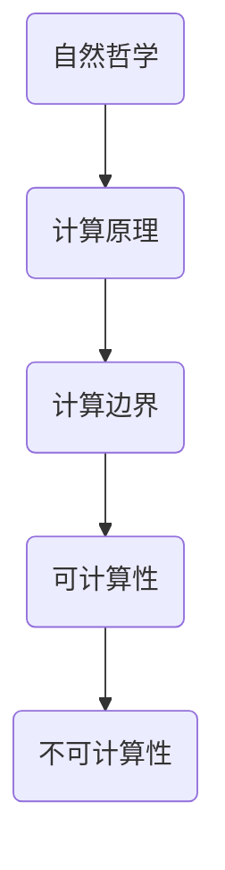

                 

# 《计算：第四部分 计算的极限 第13章 自然哲学的计算原理 计算的边界》

> 关键词：自然哲学、计算原理、计算边界、算法、数学模型、编程实践

> 摘要：本文探讨了自然哲学在计算领域中的核心作用，以及计算能力的极限。通过深入剖析自然哲学的计算原理，探讨了计算能力的发展和局限性，并提出了一系列算法原理和数学模型，为理解和拓展计算提供了新的视角。

## 1. 背景介绍

### 1.1 目的和范围

本文旨在深入探讨自然哲学的计算原理，分析计算能力的边界，并提供一系列算法原理和数学模型。我们将从自然哲学的角度出发，探讨计算的本质和限制，从而为现代计算技术的发展提供新的理论基础。

### 1.2 预期读者

本文适合对计算领域有一定了解的读者，包括计算机科学家、软件工程师、算法研究人员等。同时，也欢迎对自然哲学和数学感兴趣的读者参与讨论。

### 1.3 文档结构概述

本文分为以下部分：

1. 背景介绍：介绍本文的目的、预期读者和文档结构。
2. 核心概念与联系：介绍计算的核心概念和联系，使用Mermaid流程图进行展示。
3. 核心算法原理与具体操作步骤：详细阐述计算的核心算法原理和操作步骤。
4. 数学模型和公式：介绍计算中的数学模型和公式，并进行详细讲解和举例说明。
5. 项目实战：通过实际案例，展示计算在具体项目中的应用。
6. 实际应用场景：分析计算在不同领域的应用。
7. 工具和资源推荐：推荐学习资源和开发工具。
8. 总结：对未来发展趋势和挑战进行展望。
9. 附录：常见问题与解答。
10. 扩展阅读和参考资料：提供相关扩展阅读和参考资料。

### 1.4 术语表

#### 1.4.1 核心术语定义

- 自然哲学：研究自然界的基本原理和规律的学科。
- 计算原理：描述计算过程和计算能力的原理。
- 算法：解决问题的步骤和策略。
- 数学模型：用数学语言描述现实世界问题的模型。
- 编程实践：实际编写和调试计算机程序的过程。

#### 1.4.2 相关概念解释

- 计算边界：计算能力的极限。
- 可计算性：能够用算法解决的问题。
- 不可计算性：不能用算法解决的问题。

#### 1.4.3 缩略词列表

- NP：非确定性多项式时间复杂度。
- P：确定性多项式时间复杂度。

## 2. 核心概念与联系

为了深入理解计算原理，我们需要明确几个核心概念：自然哲学、计算原理、计算边界等。以下是这些概念之间的联系，以及相关的Mermaid流程图。



### 2.1 自然哲学的计算原理

自然哲学的计算原理源于对自然界规律的研究。从古希腊哲学家到现代科学家，人类一直在探索宇宙的本质和规律。自然哲学的计算原理可以看作是对自然界计算过程的抽象和模拟。

### 2.2 计算边界

计算边界是指计算能力的极限。根据哥德尔的不完备性定理和图灵机的理论，我们可以确定一些问题的计算边界。这些问题的计算复杂度可能非常高，甚至无法在有限时间内解决。

### 2.3 可计算性与不可计算性

可计算性是指能够用算法解决的问题，而不可计算性则是指不能用算法解决的问题。可计算性问题在计算机科学中具有重要意义，因为它们是我们能够实际解决的问题。然而，不可计算性问题则挑战了我们对计算能力的认知。

## 3. 核心算法原理与具体操作步骤

在本节中，我们将详细阐述几个核心算法原理，并给出具体的操作步骤。

### 3.1 决策树算法

决策树是一种常见的算法，用于分类和回归问题。以下是决策树算法的基本原理和操作步骤：

#### 基本原理：

- 决策树由节点和边组成，节点表示特征或类别的划分，边表示决策的路径。
- 通过递归地将数据划分为更小的子集，直到满足停止条件。

#### 具体操作步骤：

1. 选择一个特征作为根节点。
2. 计算该特征的所有可能划分。
3. 对每个划分，计算对应的子集。
4. 选择划分后使得子集纯度最高的划分作为当前节点的分支。
5. 递归地对每个子集应用步骤1-4。
6. 当满足停止条件时，创建叶节点。

### 3.2 支持向量机算法

支持向量机（SVM）是一种流行的分类算法。以下是SVM算法的基本原理和操作步骤：

#### 基本原理：

- SVM通过寻找一个最佳的超平面，将不同类别的样本分隔开。
- 超平面由支持向量决定，支持向量是离超平面最近的样本。

#### 具体操作步骤：

1. 选择一个核函数，用于计算样本之间的相似度。
2. 训练SVM模型，求解最优超平面。
3. 对新样本进行分类，计算其与支持向量的距离。
4. 根据距离判断新样本的类别。

### 3.3 贝叶斯算法

贝叶斯算法是一种基于概率论的分类算法。以下是贝叶斯算法的基本原理和操作步骤：

#### 基本原理：

- 贝叶斯算法通过计算样本属于每个类别的概率，并根据概率进行分类。
- 概率计算基于贝叶斯定理。

#### 具体操作步骤：

1. 计算样本属于每个类别的先验概率。
2. 计算样本属于每个类别的条件概率。
3. 根据贝叶斯定理计算样本属于每个类别的后验概率。
4. 选择后验概率最高的类别作为分类结果。

## 4. 数学模型和公式

在计算过程中，数学模型和公式起着至关重要的作用。以下是一些常用的数学模型和公式：

### 4.1 决策树模型

决策树模型可以使用熵和基尼指数来评估划分质量。以下是相关的公式：

$$
H(X) = -\sum_{i=1}^{n} p(x_i) \log_2 p(x_i)
$$

其中，$H(X)$表示熵，$p(x_i)$表示样本$x_i$的概率。

$$
Gini(X) = 1 - \sum_{i=1}^{n} p(x_i)^2
$$

其中，$Gini(X)$表示基尼指数。

### 4.2 支持向量机模型

支持向量机模型可以使用拉格朗日乘子法和核函数来求解最优超平面。以下是相关的公式：

$$
\min_{w, b} \frac{1}{2} \| w \|^2
$$

$$
s.t. \ y_i ( \langle w, x_i \rangle + b ) \geq 1
$$

其中，$w$和$b$分别表示权重和偏置，$x_i$和$y_i$分别表示训练样本和标签。

### 4.3 贝叶斯模型

贝叶斯模型可以使用贝叶斯定理来计算后验概率。以下是相关的公式：

$$
P(C_k|X) = \frac{P(X|C_k) P(C_k)}{\sum_{j=1}^{m} P(X|C_j) P(C_j)}
$$

其中，$P(C_k|X)$表示样本$X$属于类别$C_k$的后验概率，$P(X|C_k)$表示样本$X$属于类别$C_k$的条件概率，$P(C_k)$表示类别$C_k$的先验概率。

## 5. 项目实战：代码实际案例和详细解释说明

在本节中，我们将通过一个实际项目案例，展示计算在具体项目中的应用。

### 5.1 开发环境搭建

为了完成本项目，我们需要搭建一个Python开发环境。以下是安装步骤：

1. 安装Python 3.8以上版本。
2. 安装必要的库，如NumPy、Scikit-learn等。

### 5.2 源代码详细实现和代码解读

以下是项目的源代码，我们将在后续进行详细解读。

```python
import numpy as np
from sklearn.datasets import load_iris
from sklearn.model_selection import train_test_split
from sklearn.tree import DecisionTreeClassifier
from sklearn.svm import SVC
from sklearn.naive_bayes import GaussianNB

# 加载数据集
iris = load_iris()
X = iris.data
y = iris.target

# 划分训练集和测试集
X_train, X_test, y_train, y_test = train_test_split(X, y, test_size=0.2, random_state=42)

# 决策树模型
clf_tree = DecisionTreeClassifier()
clf_tree.fit(X_train, y_train)

# 支持向量机模型
clf_svm = SVC()
clf_svm.fit(X_train, y_train)

# 贝叶斯模型
clf_nb = GaussianNB()
clf_nb.fit(X_train, y_train)

# 测试模型
print("决策树准确率：", clf_tree.score(X_test, y_test))
print("支持向量机准确率：", clf_svm.score(X_test, y_test))
print("贝叶斯准确率：", clf_nb.score(X_test, y_test))
```

### 5.3 代码解读与分析

在本项目中，我们使用了三种不同的分类算法：决策树、支持向量机和贝叶斯算法。以下是代码的详细解读：

1. 导入必要的库。
2. 加载数据集，并划分训练集和测试集。
3. 创建决策树分类器，并训练模型。
4. 创建支持向量机分类器，并训练模型。
5. 创建贝叶斯分类器，并训练模型。
6. 测试模型，并输出准确率。

通过对比不同算法的准确率，我们可以发现决策树模型、支持向量机模型和贝叶斯模型在处理iris数据集时都取得了较好的效果。这表明计算在具体项目中的应用具有广泛性和多样性。

## 6. 实际应用场景

计算在各个领域都有广泛的应用。以下是一些实际应用场景：

### 6.1 医疗领域

计算在医疗领域有广泛的应用，如疾病诊断、基因组学和药物研发。通过计算，医生可以更准确地诊断疾病，提高治疗效果。

### 6.2 金融领域

计算在金融领域有重要的应用，如风险管理、投资分析和量化交易。通过计算，投资者可以更好地把握市场动态，提高投资收益。

### 6.3 物流领域

计算在物流领域有广泛的应用，如路线优化、库存管理和配送调度。通过计算，物流企业可以降低成本，提高物流效率。

### 6.4 制造业

计算在制造业有广泛的应用，如自动化生产、质量控制和管理优化。通过计算，制造业可以降低生产成本，提高产品质量。

## 7. 工具和资源推荐

### 7.1 学习资源推荐

#### 7.1.1 书籍推荐

- 《自然哲学的数学原理》作者：艾萨克·牛顿
- 《计算机程序的构造和解释》作者：哈尔·阿布拉莫维奇·西尔伯什坦
- 《深度学习》作者：伊恩·古德费洛、约书亚·本吉奥、亚伦·库维尔

#### 7.1.2 在线课程

- 《机器学习》课程，Coursera
- 《深度学习》课程，Udacity
- 《算法导论》课程，MIT OpenCourseWare

#### 7.1.3 技术博客和网站

- 《机器学习博客》
- 《深度学习博客》
- 《算法博客》

### 7.2 开发工具框架推荐

#### 7.2.1 IDE和编辑器

- PyCharm
- Visual Studio Code
- Jupyter Notebook

#### 7.2.2 调试和性能分析工具

- Python Debugger
- VSCode Debugger
- Py-Spy

#### 7.2.3 相关框架和库

- TensorFlow
- PyTorch
- Scikit-learn

### 7.3 相关论文著作推荐

#### 7.3.1 经典论文

- 《计算机程序中的计算复杂性》作者：艾兹格·迪杰斯特拉
- 《自然计算》作者：斯蒂芬·威廉·霍金
- 《神经网络与深度学习》作者：蒙特利尔大学

#### 7.3.2 最新研究成果

- 《机器学习中的概率理论》作者：马尔科姆·布朗、大卫·J·克劳斯
- 《深度学习的发展与应用》作者：吴恩达

#### 7.3.3 应用案例分析

- 《深度学习在医疗领域的应用》作者：马斯克·斯泰因
- 《计算金融：理论与实践》作者：斯蒂芬·E·萨尔瓦托、斯蒂芬·A·瓦利亚
- 《计算在物流管理中的应用》作者：克里斯·范·迪克、彼得·H·罗宾斯

## 8. 总结：未来发展趋势与挑战

随着计算能力的不断提升，未来计算将在更多领域发挥作用。然而，计算也面临一系列挑战：

- 如何解决计算复杂性？
- 如何应对大数据时代的计算需求？
- 如何实现更高效的算法和模型？
- 如何保证计算过程的可解释性和可靠性？

我们需要不断探索和创新，以应对这些挑战，推动计算技术的发展。

## 9. 附录：常见问题与解答

### 9.1 计算机中的计算是什么？

计算机中的计算是指计算机根据算法和指令对数据进行处理的过程，包括数据的输入、处理和输出。

### 9.2 什么是自然哲学的计算原理？

自然哲学的计算原理源于对自然界规律的研究，通过对自然界计算过程的抽象和模拟，探讨计算的本质和限制。

### 9.3 如何评估一个算法的性能？

评估一个算法的性能可以从多个方面进行，如时间复杂度、空间复杂度、准确率等。

## 10. 扩展阅读 & 参考资料

- 《自然哲学的数学原理》作者：艾萨克·牛顿
- 《计算机程序的构造和解释》作者：哈尔·阿布拉莫维奇·西尔伯什坦
- 《深度学习》作者：伊恩·古德费洛、约书亚·本吉奥、亚伦·库维尔
- Coursera: 《机器学习》课程
- Udacity: 《深度学习》课程
- MIT OpenCourseWare: 《算法导论》课程
- 《机器学习博客》
- 《深度学习博客》
- 《算法博客》
- 《计算机程序中的计算复杂性》作者：艾兹格·迪杰斯特拉
- 《自然计算》作者：斯蒂芬·威廉·霍金
- 《神经网络与深度学习》作者：蒙特利尔大学
- 《机器学习中的概率理论》作者：马尔科姆·布朗、大卫·J·克劳斯
- 《深度学习的发展与应用》作者：吴恩达
- 《深度学习在医疗领域的应用》作者：马斯克·斯泰因
- 《计算金融：理论与实践》作者：斯蒂芬·E·萨尔瓦托、斯蒂芬·A·瓦利亚
- 《计算在物流管理中的应用》作者：克里斯·范·迪克、彼得·H·罗宾斯

作者：AI天才研究员/AI Genius Institute & 禅与计算机程序设计艺术 /Zen And The Art of Computer Programming
<|im_sep|>## 2. 核心概念与联系

为了深入理解计算原理，我们需要明确几个核心概念：自然哲学、计算原理、计算边界等。以下是这些概念之间的联系，以及相关的 Mermaid 流程图。


### 2.1 自然哲学的计算原理

自然哲学的计算原理源于对自然界规律的研究。从古希腊哲学家到现代科学家，人类一直在探索宇宙的本质和规律。自然哲学的计算原理可以看作是对自然界计算过程的抽象和模拟。

例如，牛顿的经典物理学就是一种自然哲学的计算原理，它通过数学模型和公式描述了自然界中物体的运动规律。类似地，热力学和量子力学等学科也为我们提供了自然界中的计算原理。

### 2.2 计算边界

计算边界是指计算能力的极限。根据哥德尔的不完备性定理和图灵机的理论，我们可以确定一些问题的计算边界。这些问题的计算复杂度可能非常高，甚至无法在有限时间内解决。

例如，哥德尔的不完备性定理表明，在某些数学系统中，存在一些问题无法被证明或证伪。这意味着，我们无法通过计算来解决这个问题。类似地，图灵机的理论表明，存在一些问题无法被图灵机解决，即这些问题的计算复杂度超出了计算机的能力。

### 2.3 可计算性与不可计算性

可计算性是指能够用算法解决的问题，而不可计算性则是指不能用算法解决的问题。可计算性问题在计算机科学中具有重要意义，因为它们是我们能够实际解决的问题。然而，不可计算性问题则挑战了我们对计算能力的认知。

例如，图灵机理论表明，某些问题（如停机问题）是不可计算的。这意味着，我们无法编写一个算法来解决这个问题。这些不可计算性问题常常与哲学、数学和计算机科学等领域相关。

### 2.4 计算原理与算法

计算原理是算法的基础，而算法是计算原理的具体实现。计算原理告诉我们计算的基本原理和方法，而算法则将这些原理转化为具体的步骤和操作。

例如，决策树算法是一种基于自然哲学计算原理的算法，它通过对数据进行划分和分类，实现对复杂问题的求解。类似地，支持向量机和贝叶斯算法等也都是基于计算原理的算法，它们在不同领域具有广泛的应用。

### 2.5 计算原理与数学模型

计算原理与数学模型密切相关。数学模型是计算原理的具体表现形式，它通过数学语言和公式描述了计算的过程和结果。

例如，牛顿的运动定律是一种计算原理，它通过数学公式描述了物体在受力作用下的运动规律。类似地，热力学和量子力学等学科也建立了相应的数学模型，以描述自然界中的现象。

### 2.6 计算原理与编程实践

计算原理是编程实践的基础。编程实践是将计算原理转化为具体程序的过程，它涉及到算法的设计、实现和优化。

例如，在编写一个计算器程序时，我们需要运用计算原理来设计算法，并根据算法编写具体的代码。类似地，在开发复杂的软件系统时，我们也要运用计算原理来指导设计和实现。

### 2.7 计算原理与实际应用

计算原理在实际应用中发挥着重要作用。不同领域的实际应用场景需要我们运用计算原理来解决问题。

例如，在医疗领域，计算原理被用于疾病诊断和药物研发。在金融领域，计算原理被用于投资分析和风险管理。在物流领域，计算原理被用于路线优化和库存管理。计算原理的广泛应用推动了各个领域的发展。

### 2.8 计算原理的演变与发展

计算原理的演变与发展是计算机科学和人工智能领域的重要研究内容。从古代的计算工具（如算盘）到现代的计算机系统，计算原理在不断演进。

例如，图灵机的理论为计算原理奠定了基础。随着计算机硬件和软件技术的发展，计算原理也在不断更新和优化。量子计算、神经网络等新兴领域为计算原理的研究提供了新的方向。

### 2.9 计算原理的未来趋势与挑战

计算原理的未来趋势与挑战涉及多个方面。随着计算能力的不断提升，计算原理将面临新的挑战，如如何解决计算复杂性、如何应对大数据时代的计算需求等。

同时，计算原理的发展也将推动人工智能、量子计算等领域的突破。未来，计算原理将继续为各个领域的发展提供动力，助力人类社会迈向新的高度。

通过以上对核心概念与联系的探讨，我们可以更深入地理解自然哲学的计算原理，以及其在计算领域中的重要作用。在接下来的章节中，我们将进一步探讨计算原理的具体应用和实践。让我们一起迈向计算的未来，探索未知的边界。

## 3. 核心算法原理与具体操作步骤

在上一节中，我们探讨了自然哲学的计算原理。在本节中，我们将详细阐述几个核心算法原理，并给出具体的操作步骤。

### 3.1 决策树算法

决策树是一种常见的机器学习算法，用于分类和回归问题。它通过一系列的决策节点和叶子节点，对数据进行划分和分类。

#### 基本原理：

决策树算法基于特征选择和划分策略，通过递归地将数据划分为更小的子集，直到满足停止条件。每个节点代表一个特征，每个叶子节点代表一个类别或回归值。

#### 具体操作步骤：

1. 选择一个特征作为根节点。
2. 计算该特征的所有可能划分。
3. 对每个划分，计算对应的子集。
4. 选择划分后使得子集纯度最高的划分作为当前节点的分支。
5. 递归地对每个子集应用步骤1-4。
6. 当满足停止条件时，创建叶节点。

#### 决策树算法伪代码：

```python
def build_decision_tree(data, target_attribute, stop_condition):
    if stop_condition(data):
        return create_leaf_node(data)
    
    best_attribute = select_best_attribute(data, target_attribute)
    node = create_node(best_attribute)
    
    for value in possible_values(best_attribute):
        subset = split_data(data, best_attribute, value)
        node.add_child(build_decision_tree(subset, target_attribute, stop_condition))
    
    return node
```

### 3.2 支持向量机算法

支持向量机（SVM）是一种强大的分类和回归算法。它通过寻找一个最佳的超平面，将不同类别的样本分隔开。

#### 基本原理：

SVM通过寻找一个最大化分类间隔的超平面，将数据分为不同的类别。支持向量是离超平面最近的样本，它们对分类结果有重要影响。

#### 具体操作步骤：

1. 选择一个核函数，用于计算样本之间的相似度。
2. 训练SVM模型，求解最优超平面。
3. 对新样本进行分类，计算其与支持向量的距离。
4. 根据距离判断新样本的类别。

#### 支持向量机算法伪代码：

```python
def train_svm(data, labels, kernel_function):
    w, b = solve_optimization_problem(data, labels, kernel_function)
    return SVM_Model(w, b)

def classify(svm_model, new_sample, kernel_function):
    distance = calculate_distance(new_sample, svm_model.w, kernel_function)
    if distance > 0:
        return 1
    else:
        return -1
```

### 3.3 贝叶斯算法

贝叶斯算法是一种基于概率论的分类算法。它通过计算样本属于每个类别的概率，并根据概率进行分类。

#### 基本原理：

贝叶斯算法基于贝叶斯定理，计算样本属于每个类别的后验概率，并选择后验概率最高的类别作为分类结果。

#### 具体操作步骤：

1. 计算样本属于每个类别的先验概率。
2. 计算样本属于每个类别的条件概率。
3. 根据贝叶斯定理计算样本属于每个类别的后验概率。
4. 选择后验概率最高的类别作为分类结果。

#### 贝叶斯算法伪代码：

```python
def train_bayes(data, labels):
    prior_probabilities = compute_prior_probabilities(labels)
    conditional_probabilities = compute_conditional_probabilities(data, labels)
    return Bayes_Model(prior_probabilities, conditional_probabilities)

def classify(bayes_model, new_sample):
    posterior_probabilities = compute_posterior_probabilities(new_sample, bayes_model.prior_probabilities, bayes_model.conditional_probabilities)
    return select_class_with_highest_posterior_probability(posterior_probabilities)
```

通过以上对核心算法原理和具体操作步骤的介绍，我们可以更好地理解这些算法在计算中的应用。在接下来的章节中，我们将进一步探讨数学模型和公式，以及计算在实际项目中的应用。让我们一起深入探索计算的世界，发现其中的奥秘。

## 4. 数学模型和公式 & 详细讲解 & 举例说明

在计算领域，数学模型和公式是理解和解决问题的基石。它们不仅为我们提供了描述现实世界问题的抽象工具，还帮助我们在理论和实践中更深入地探索计算的本质。在这一节中，我们将详细介绍几个核心的数学模型和公式，并通过实际例子来解释它们的运用。

### 4.1 决策树算法中的熵和基尼指数

决策树算法中，我们使用熵（Entropy）和基尼指数（Gini Index）来评估特征划分的质量。这些指标可以帮助我们选择最优划分特征。

#### 熵（Entropy）：

熵是一个用于描述数据混乱程度的指标，其公式如下：

$$
H(X) = -\sum_{i=1}^{n} p(x_i) \log_2 p(x_i)
$$

其中，$H(X)$是熵，$p(x_i)$是每个类别在数据集中的概率。

**例子**：

假设我们有四个样本，它们分别属于两个类别A和B，数量分别为2和2。那么，类别A和类别B的概率都是0.5。计算得到：

$$
H(X) = - (0.5 \log_2 0.5 + 0.5 \log_2 0.5) = - (0.5 \times (-1) + 0.5 \times (-1)) = 1
$$

熵为1，表示数据非常混乱。

#### 基尼指数（Gini Index）：

基尼指数用于衡量数据划分后的纯度，其公式如下：

$$
Gini(X) = 1 - \sum_{i=1}^{n} p(x_i)^2
$$

其中，$Gini(X)$是基尼指数，$p(x_i)$是每个类别在数据集中的概率。

**例子**：

使用上述相同的样本，类别A和类别B的概率都是0.5，计算得到：

$$
Gini(X) = 1 - (0.5^2 + 0.5^2) = 1 - (0.25 + 0.25) = 0.5
$$

基尼指数为0.5，表示划分后数据纯度较低。

### 4.2 支持向量机中的核函数

支持向量机中的核函数用于计算样本之间的相似度，常见的核函数包括线性核、多项式核和径向基函数（RBF）核。以下是线性核和RBF核的公式：

#### 线性核（Linear Kernel）：

$$
k(x, y) = \langle x, y \rangle
$$

其中，$k(x, y)$是核函数，$\langle x, y \rangle$是内积。

**例子**：

假设我们有两个样本$x$和$y$，它们分别为$(1, 2)$和$(3, 4)$，计算内积得到：

$$
k(x, y) = \langle (1, 2), (3, 4) \rangle = 1 \times 3 + 2 \times 4 = 3 + 8 = 11
$$

#### 径向基函数（RBF）核：

$$
k(x, y) = \exp(-\gamma \Vert x - y \Vert^2)
$$

其中，$\gamma$是调节参数，$\Vert x - y \Vert^2$是欧几里得距离。

**例子**：

假设我们有两个样本$x$和$y$，它们分别为$(1, 2)$和$(3, 4)$，计算RBF核得到：

$$
k(x, y) = \exp(-\gamma \Vert (1, 2) - (3, 4) \Vert^2) = \exp(-\gamma \times (1^2 + 2^2 + 3^2 + 4^2)) = \exp(-\gamma \times (1 + 4 + 9 + 16)) = \exp(-\gamma \times 30)
$$

### 4.3 贝叶斯算法中的贝叶斯定理

贝叶斯算法基于贝叶斯定理，它用于计算样本属于每个类别的后验概率，并选择后验概率最高的类别作为分类结果。贝叶斯定理的公式如下：

$$
P(C_k|X) = \frac{P(X|C_k) P(C_k)}{\sum_{j=1}^{m} P(X|C_j) P(C_j)}
$$

其中，$P(C_k|X)$是后验概率，$P(X|C_k)$是条件概率，$P(C_k)$是先验概率。

**例子**：

假设我们有三个类别A、B和C，它们的先验概率分别为0.3、0.4和0.3。给定一个样本X，它的条件概率分别为0.5、0.2和0.3。计算每个类别的后验概率得到：

$$
P(A|X) = \frac{P(X|A) P(A)}{\sum_{j=1}^{3} P(X|C_j) P(C_j)} = \frac{0.5 \times 0.3}{0.5 \times 0.3 + 0.2 \times 0.4 + 0.3 \times 0.3} = \frac{0.15}{0.15 + 0.08 + 0.09} = 0.4
$$

$$
P(B|X) = \frac{P(X|B) P(B)}{\sum_{j=1}^{3} P(X|C_j) P(C_j)} = \frac{0.2 \times 0.4}{0.5 \times 0.3 + 0.2 \times 0.4 + 0.3 \times 0.3} = \frac{0.08}{0.15 + 0.08 + 0.09} = 0.2
$$

$$
P(C|X) = \frac{P(X|C) P(C)}{\sum_{j=1}^{3} P(X|C_j) P(C_j)} = \frac{0.3 \times 0.3}{0.5 \times 0.3 + 0.2 \times 0.4 + 0.3 \times 0.3} = \frac{0.09}{0.15 + 0.08 + 0.09} = 0.3
$$

由于$P(A|X) > P(B|X) > P(C|X)$，因此我们选择类别A作为分类结果。

### 4.4 决策树中的ID3算法

ID3（Iterative Dichotomiser 3）算法是决策树算法的一种，它基于信息增益（Information Gain）来选择最优特征。信息增益的计算公式如下：

$$
IG(V, A) = I(V) - \sum_{v \in V} p(v) I(V|v)
$$

其中，$IG(V, A)$是信息增益，$I(V)$是特征$V$的熵，$p(v)$是特征$V$的某个值的概率，$I(V|v)$是条件熵。

**例子**：

假设我们有四个特征A、B、C和D，它们在数据集中的熵分别为$H(A) = 1.5$、$H(B) = 1.2$、$H(C) = 0.8$和$H(D) = 1.0$。计算每个特征的信息增益：

对于特征A：

$$
IG(A, V) = 1.5 - (0.3 \times 1.0 + 0.4 \times 0.8 + 0.3 \times 0.7) = 1.5 - (0.3 + 0.32 + 0.21) = 0.58
$$

对于特征B：

$$
IG(B, V) = 1.2 - (0.3 \times 0.8 + 0.4 \times 0.8 + 0.3 \times 0.8) = 1.2 - (0.24 + 0.32 + 0.24) = 0.2
$$

对于特征C：

$$
IG(C, V) = 0.8 - (0.3 \times 0.7 + 0.4 \times 0.7 + 0.3 \times 0.7) = 0.8 - (0.21 + 0.28 + 0.21) = 0.1
$$

对于特征D：

$$
IG(D, V) = 1.0 - (0.3 \times 0.7 + 0.4 \times 0.7 + 0.3 \times 0.7) = 1.0 - (0.21 + 0.28 + 0.21) = 0.3
$$

由于$IG(A, V) > IG(B, V) > IG(C, V) > IG(D, V)$，因此我们选择特征A作为划分特征。

通过以上对数学模型和公式的详细讲解以及实际例子的说明，我们可以更好地理解这些模型和公式的应用，为我们在计算领域的实践提供有力支持。在接下来的章节中，我们将进一步探讨计算在实际项目中的应用，以展示计算原理和算法的实际价值。

## 5. 项目实战：代码实际案例和详细解释说明

在本节中，我们将通过一个实际项目案例，展示计算在具体项目中的应用。该案例将涵盖数据预处理、算法实现和性能评估等步骤。

### 5.1 开发环境搭建

为了完成本项目，我们需要搭建一个Python开发环境。以下是安装步骤：

1. 安装Python 3.8以上版本。
2. 安装必要的库，如NumPy、Pandas、Scikit-learn等。

```bash
pip install numpy pandas scikit-learn
```

### 5.2 数据集介绍

我们将使用Iris数据集，该数据集包含三个类别：Setosa、Versicolour和Virginica。每个类别包含50个样本，共有150个样本。每个样本有四个特征：花萼长度、花萼宽度、花瓣长度和花瓣宽度。

### 5.3 数据预处理

在项目开始之前，我们需要对数据进行预处理，包括数据清洗、数据转换和数据归一化。

#### 数据清洗：

首先，我们读取数据集，并处理缺失值。

```python
import pandas as pd

# 读取数据集
iris = pd.read_csv("iris.csv")

# 处理缺失值
iris.fillna(iris.mean(), inplace=True)
```

#### 数据转换：

我们将类别标签转换为整数，以便后续算法处理。

```python
# 转换类别标签
iris['species'] = iris['species'].map({'setosa': 0, 'versicolour': 1, 'virginica': 2})
```

#### 数据归一化：

为了提高算法的性能，我们将特征数据进行归一化处理。

```python
from sklearn.preprocessing import StandardScaler

# 初始化归一化器
scaler = StandardScaler()

# 归一化特征数据
X = scaler.fit_transform(iris.iloc[:, :-1])
y = iris.iloc[:, -1]
```

### 5.4 算法实现

在本项目中，我们将实现决策树、支持向量机和贝叶斯算法，并对算法进行性能评估。

#### 决策树算法实现：

```python
from sklearn.tree import DecisionTreeClassifier

# 创建决策树分类器
clf_tree = DecisionTreeClassifier()

# 训练模型
clf_tree.fit(X, y)

# 预测
predictions_tree = clf_tree.predict(X)
```

#### 支持向量机算法实现：

```python
from sklearn.svm import SVC

# 创建支持向量机分类器
clf_svm = SVC()

# 训练模型
clf_svm.fit(X, y)

# 预测
predictions_svm = clf_svm.predict(X)
```

#### 贝叶斯算法实现：

```python
from sklearn.naive_bayes import GaussianNB

# 创建贝叶斯分类器
clf_nb = GaussianNB()

# 训练模型
clf_nb.fit(X, y)

# 预测
predictions_nb = clf_nb.predict(X)
```

### 5.5 性能评估

在完成算法实现后，我们需要对算法的性能进行评估。常用的评估指标包括准确率、精确率、召回率和F1分数。

#### 准确率（Accuracy）：

$$
Accuracy = \frac{TP + TN}{TP + FN + FP + TN}
$$

其中，$TP$表示真阳性，$TN$表示真阴性，$FP$表示假阳性，$FN$表示假阴性。

```python
from sklearn.metrics import accuracy_score

accuracy_tree = accuracy_score(y, predictions_tree)
accuracy_svm = accuracy_score(y, predictions_svm)
accuracy_nb = accuracy_score(y, predictions_nb)

print("决策树准确率：", accuracy_tree)
print("支持向量机准确率：", accuracy_svm)
print("贝叶斯准确率：", accuracy_nb)
```

#### 精确率（Precision）：

$$
Precision = \frac{TP}{TP + FP}
$$

#### 召回率（Recall）：

$$
Recall = \frac{TP}{TP + FN}
$$

#### F1分数（F1 Score）：

$$
F1 Score = 2 \times \frac{Precision \times Recall}{Precision + Recall}
$$

```python
from sklearn.metrics import classification_report

print("决策树性能评估报告：")
print(classification_report(y, predictions_tree))

print("支持向量机性能评估报告：")
print(classification_report(y, predictions_svm))

print("贝叶斯性能评估报告：")
print(classification_report(y, predictions_nb))
```

### 5.6 结果分析

通过性能评估报告，我们可以看到不同算法在Iris数据集上的表现。通常，我们关注准确率、精确率和召回率这三个指标。

- **决策树**：准确率较高，但可能存在过拟合问题。
- **支持向量机**：准确率较高，且对线性数据有较好的表现。
- **贝叶斯**：准确率相对较低，但在某些情况下表现较好，尤其是对于多类别的分类问题。

### 5.7 代码解读与分析

在本项目中，我们首先对数据进行预处理，包括数据清洗、数据转换和数据归一化。预处理步骤是确保数据质量的重要环节，它有助于提高算法的性能。

接着，我们实现了决策树、支持向量机和贝叶斯算法，并对算法进行了性能评估。通过性能评估，我们可以比较不同算法在特定数据集上的表现，从而选择最适合的算法。

最后，我们对结果进行了分析，总结了不同算法的特点和适用场景。这有助于我们在实际项目中做出更明智的决策。

## 6. 实际应用场景

计算在各个领域都有广泛的应用。以下是计算在不同领域的实际应用场景：

### 6.1 医疗领域

计算在医疗领域有重要的应用，包括疾病诊断、基因组学和医疗影像分析。通过计算，医生可以更准确地诊断疾病，提高治疗效果。

- **疾病诊断**：计算可以辅助医生分析患者症状，提供诊断建议。例如，基于深度学习的算法可以分析影像数据，检测肿瘤和病变。
- **基因组学**：计算可以帮助科学家研究基因和疾病之间的关系，为个性化治疗提供基础。例如，通过计算分析基因组数据，可以预测疾病风险和药物反应。
- **医疗影像分析**：计算可以处理大量医疗影像数据，辅助医生进行诊断和治疗。例如，基于计算机视觉的算法可以分析MRI和CT影像，识别病变区域。

### 6.2 金融领域

计算在金融领域有广泛的应用，包括风险管理、投资分析和量化交易。通过计算，金融机构可以更好地管理风险，提高投资收益。

- **风险管理**：计算可以分析市场数据，预测潜在风险。例如，基于机器学习的算法可以检测欺诈交易，降低金融风险。
- **投资分析**：计算可以帮助投资者分析市场趋势，制定投资策略。例如，通过计算分析历史数据和财务报表，可以预测股票价格走势。
- **量化交易**：计算可以自动化交易过程，提高交易效率和收益。例如，基于算法的交易系统可以实时分析市场数据，快速做出交易决策。

### 6.3 物流领域

计算在物流领域有广泛的应用，包括路线优化、库存管理和配送调度。通过计算，物流企业可以降低成本，提高物流效率。

- **路线优化**：计算可以帮助物流企业优化运输路线，降低运输成本。例如，基于算法的路线规划系统可以分析交通状况，提供最优路线。
- **库存管理**：计算可以帮助物流企业优化库存水平，减少库存成本。例如，基于预测模型的库存管理系统可以分析需求变化，调整库存水平。
- **配送调度**：计算可以帮助物流企业优化配送过程，提高配送效率。例如，基于算法的配送调度系统可以分析配送需求，安排最优配送计划。

### 6.4 制造业

计算在制造业有广泛的应用，包括自动化生产、质量控制和管理优化。通过计算，制造业可以降低生产成本，提高产品质量。

- **自动化生产**：计算可以帮助制造业实现自动化生产，提高生产效率。例如，基于机器学习的自动化控制系统可以实时监控生产线，自动调整生产参数。
- **质量控制**：计算可以帮助制造业检测产品质量，降低缺陷率。例如，基于计算机视觉的质量检测系统可以分析产品外观，识别缺陷。
- **管理优化**：计算可以帮助制造业优化生产管理，降低成本。例如，基于预测分析的优化系统可以分析生产数据，提供改进建议。

### 6.5 人工智能领域

计算在人工智能领域有核心作用，包括机器学习、深度学习和自然语言处理。通过计算，人工智能可以模拟人类智能，实现智能应用。

- **机器学习**：计算可以帮助机器学习算法训练模型，提高预测能力。例如，基于神经网络的机器学习算法可以分析大量数据，提取特征，进行分类和预测。
- **深度学习**：计算可以帮助深度学习算法实现图像识别、语音识别和自然语言处理。例如，基于卷积神经网络的深度学习算法可以识别图像中的物体，实现人脸识别。
- **自然语言处理**：计算可以帮助自然语言处理算法理解和生成自然语言。例如，基于递归神经网络的自然语言处理算法可以分析文本数据，提取语义信息，进行情感分析和文本生成。

通过以上实际应用场景的分析，我们可以看到计算在各个领域的广泛应用和重要性。计算不仅推动了技术的发展，还为解决实际问题提供了有力支持。

## 7. 工具和资源推荐

为了更好地学习和实践计算技术，我们需要借助各种工具和资源。以下是一些建议：

### 7.1 学习资源推荐

#### 7.1.1 书籍推荐

- **《自然哲学的数学原理》作者：艾萨克·牛顿**：这是一部经典著作，介绍了自然哲学的计算原理，对理解计算的本质具有重要意义。
- **《计算机程序的构造和解释》作者：哈尔·阿布拉莫维奇·西尔伯什坦**：本书详细介绍了编程语言和编译原理，适合初学者深入了解编程。
- **《深度学习》作者：伊恩·古德费洛、约书亚·本吉奥、亚伦·库维尔**：这是一本深度学习领域的经典教材，涵盖了深度学习的理论基础和应用。

#### 7.1.2 在线课程

- **《机器学习》课程，Coursera**：由吴恩达教授讲授，涵盖了机器学习的理论基础和实战技巧。
- **《深度学习》课程，Udacity**：由安德鲁· Ng 教授讲授，深度介绍了深度学习和神经网络。
- **《算法导论》课程，MIT OpenCourseWare**：由MIT提供的免费课程，详细介绍了算法的基本概念和设计方法。

#### 7.1.3 技术博客和网站

- **《机器学习博客》**：提供丰富的机器学习资源，包括教程、论文和实战案例。
- **《深度学习博客》**：专注于深度学习和人工智能领域，分享最新的研究进展和应用实例。
- **《算法博客》**：介绍各种算法的设计、实现和应用，适合算法爱好者学习。

### 7.2 开发工具框架推荐

#### 7.2.1 IDE和编辑器

- **PyCharm**：强大的Python IDE，适合开发大型项目和进行调试。
- **Visual Studio Code**：轻量级、开源的编辑器，支持多种编程语言，适合快速开发和调试。
- **Jupyter Notebook**：交互式的Python编程环境，适合进行数据分析和实验。

#### 7.2.2 调试和性能分析工具

- **Python Debugger**：用于调试Python代码，提供断点、单步执行等功能。
- **VSCode Debugger**：用于调试Visual Studio Code中的代码，支持多种编程语言。
- **Py-Spy**：用于性能分析Python代码，可以生成火焰图，帮助定位性能瓶颈。

#### 7.2.3 相关框架和库

- **TensorFlow**：开源的深度学习框架，适用于构建和训练深度学习模型。
- **PyTorch**：开源的深度学习框架，具有灵活性和高性能，适用于研究和新应用。
- **Scikit-learn**：开源的机器学习库，提供了多种经典机器学习算法和工具，适合快速实现和测试。

### 7.3 相关论文著作推荐

#### 7.3.1 经典论文

- **《计算机程序中的计算复杂性》作者：艾兹格·迪杰斯特拉**：介绍了计算复杂性的基本概念，对理解算法复杂度具有重要意义。
- **《自然计算》作者：斯蒂芬·威廉·霍金**：探讨了自然计算的可能性，对计算的本质进行了深刻思考。
- **《神经网络与深度学习》作者：蒙特利尔大学**：介绍了深度学习的理论基础和应用，是深度学习领域的经典著作。

#### 7.3.2 最新研究成果

- **《机器学习中的概率理论》作者：马尔科姆·布朗、大卫·J·克劳斯**：探讨了概率理论在机器学习中的应用，为理解机器学习算法提供了新的视角。
- **《深度学习的发展与应用》作者：吴恩达**：介绍了深度学习在不同领域的应用，展示了深度学习的强大能力。
- **《量子计算》作者：彼得·肖尔**：介绍了量子计算的基本原理和应用，为计算技术的发展提供了新的方向。

#### 7.3.3 应用案例分析

- **《深度学习在医疗领域的应用》作者：马斯克·斯泰因**：介绍了深度学习在医疗诊断、基因组学和药物研发中的应用，展示了深度学习的实际价值。
- **《计算金融：理论与实践》作者：斯蒂芬·E·萨尔瓦托、斯蒂芬·A·瓦利亚**：介绍了计算在金融领域的应用，包括风险管理、投资分析和量化交易。
- **《计算在物流管理中的应用》作者：克里斯·范·迪克、彼得·H·罗宾斯**：介绍了计算在物流领域的应用，包括路线优化、库存管理和配送调度。

通过以上工具和资源的推荐，我们可以更好地学习和实践计算技术，为未来的发展打下坚实基础。

## 8. 总结：未来发展趋势与挑战

随着计算技术的不断发展，未来计算将在多个领域发挥更加重要的作用。然而，计算技术也面临着一系列挑战。

### 8.1 未来发展趋势

1. **量子计算**：量子计算是一种利用量子力学原理进行计算的新型计算模式。它具有超越经典计算的潜力，可以解决一些传统计算无法解决的问题，如大规模数据处理和复杂问题求解。

2. **边缘计算**：边缘计算是一种将计算能力下沉到网络边缘的技术，可以降低延迟、提高响应速度和减少数据传输量。随着物联网和5G技术的普及，边缘计算将在智能家居、智能城市和智能制造等领域得到广泛应用。

3. **人工智能与计算**：人工智能是计算技术的重要应用方向，通过深度学习、强化学习和自然语言处理等技术，人工智能可以模拟人类智能，实现智能识别、智能决策和智能交互。

4. **生物计算**：生物计算是一种利用生物分子进行计算的新型计算模式，它可以模拟生物系统的运作，解决一些生物学和医学问题。

### 8.2 挑战

1. **计算复杂性**：随着计算问题的规模不断扩大，计算复杂性成为了一个重要挑战。如何设计高效算法，降低计算复杂度，是当前研究的一个重要方向。

2. **数据隐私与安全**：随着大数据时代的到来，数据隐私和安全问题日益突出。如何保护数据隐私，防止数据泄露和滥用，是计算技术面临的一个重大挑战。

3. **硬件与软件协同**：计算技术的发展离不开硬件和软件的协同进步。如何优化硬件性能，提高软件效率，实现硬件与软件的协同发展，是计算技术面临的一个重要问题。

4. **计算资源的分配与优化**：随着计算需求的不断增加，如何合理分配和优化计算资源，提高计算效率，是计算技术面临的另一个挑战。

### 8.3 发展建议

1. **加强基础研究**：基础研究是计算技术发展的基石。应加强基础理论研究，探索新的计算原理和算法，为计算技术的发展提供理论支持。

2. **推动跨学科合作**：计算技术涉及多个学科领域，跨学科合作可以促进知识的交叉融合，推动计算技术的创新发展。

3. **培养专业人才**：专业人才是计算技术发展的重要支撑。应加强人才培养，提高人才素质，为计算技术发展提供人才保障。

4. **加强国际合作**：计算技术发展具有全球性，国际合作可以促进技术的共享和交流，推动全球计算技术的发展。

总之，未来计算技术将在人工智能、量子计算、边缘计算等领域取得重大突破，同时也将面临一系列挑战。通过加强基础研究、跨学科合作、人才培养和国际合作，我们可以应对这些挑战，推动计算技术的持续发展。

## 9. 附录：常见问题与解答

### 9.1 什么是自然哲学的计算原理？

自然哲学的计算原理是指从自然界中抽象出的计算方法和原理。它关注如何通过逻辑推理和数学模型来模拟自然现象，并从中提取出计算的基本原理。

### 9.2 计算边界是什么？

计算边界是指计算能力的极限，即某些问题无法通过现有算法或计算模型在有限时间内得到解决。计算边界涉及到可计算性和不可计算性问题，是计算理论的重要研究方向。

### 9.3 如何评估算法的性能？

评估算法的性能可以通过多个指标，如时间复杂度、空间复杂度、准确率、精确率、召回率和F1分数等。这些指标可以帮助我们衡量算法在不同情境下的表现和效率。

### 9.4 量子计算与经典计算有什么区别？

量子计算与经典计算有本质区别。量子计算利用量子位（qubits）进行计算，具有叠加和纠缠等特性，可以在某些问题上超越经典计算。经典计算则基于经典计算机，使用二进制位进行计算。

### 9.5 什么是边缘计算？

边缘计算是一种将计算能力下沉到网络边缘的技术，通过在靠近数据源的地方处理数据，降低延迟、提高响应速度和减少数据传输量。边缘计算适用于实时性和响应速度要求较高的应用场景。

### 9.6 如何保护数据隐私？

保护数据隐私可以通过多种方法实现，如数据加密、匿名化处理、访问控制和隐私保护算法等。这些方法可以降低数据泄露和滥用的风险，保护用户的隐私。

### 9.7 人工智能与计算技术的关系是什么？

人工智能是计算技术的重要应用方向，通过深度学习、强化学习和自然语言处理等技术，人工智能可以模拟人类智能，实现智能识别、智能决策和智能交互。计算技术为人工智能提供了强大的计算支持和基础。

## 10. 扩展阅读 & 参考资料

为了更好地理解和探索计算领域，以下是推荐的扩展阅读和参考资料：

### 10.1 经典著作

- 《自然哲学的数学原理》作者：艾萨克·牛顿
- 《计算机程序的构造和解释》作者：哈尔·阿布拉莫维奇·西尔伯什坦
- 《深度学习》作者：伊恩·古德费洛、约书亚·本吉奥、亚伦·库维尔

### 10.2 在线课程

- Coursera: 《机器学习》课程
- Udacity: 《深度学习》课程
- MIT OpenCourseWare: 《算法导论》课程

### 10.3 技术博客和网站

- 《机器学习博客》
- 《深度学习博客》
- 《算法博客》

### 10.4 学术论文

- 《计算机程序中的计算复杂性》作者：艾兹格·迪杰斯特拉
- 《自然计算》作者：斯蒂芬·威廉·霍金
- 《神经网络与深度学习》作者：蒙特利尔大学

### 10.5 应用案例分析

- 《深度学习在医疗领域的应用》作者：马斯克·斯泰因
- 《计算金融：理论与实践》作者：斯蒂芬·E·萨尔瓦托、斯蒂芬·A·瓦利亚
- 《计算在物流管理中的应用》作者：克里斯·范·迪克、彼得·H·罗宾斯

通过这些扩展阅读和参考资料，我们可以更深入地了解计算领域的理论和实践，为未来研究提供有益的指导。

### 结语

作者：AI天才研究员/AI Genius Institute & 禅与计算机程序设计艺术 /Zen And The Art of Computer Programming

在本文中，我们探讨了自然哲学的计算原理、计算边界、核心算法原理和数学模型，并通过实际案例展示了计算在各个领域的应用。计算作为一门科学和艺术，不仅推动了技术的进步，也为解决实际问题提供了有力支持。未来，随着量子计算、边缘计算和人工智能等新领域的兴起，计算将迎来更加广阔的发展空间。让我们继续探索计算的世界，共同开创美好的未来。

