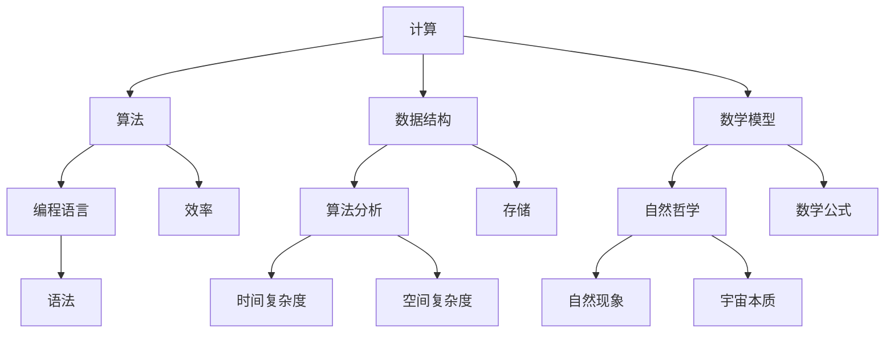
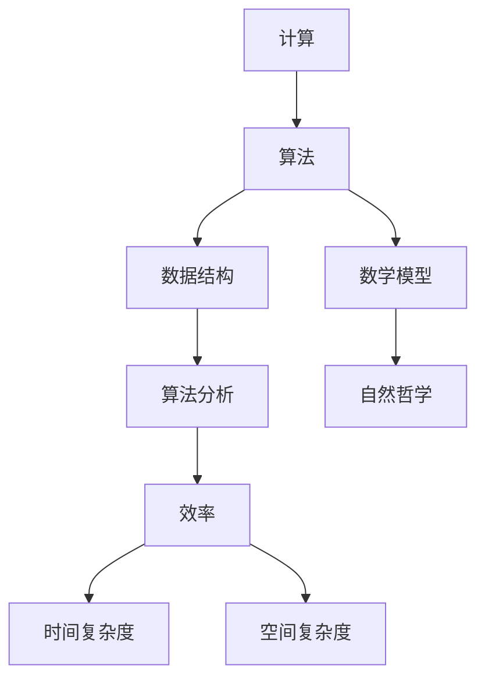

                 

# 计算的极限：自然哲学的计算原理

> 关键词：计算、极限、自然哲学、算法、数学模型、应用场景

> 摘要：本文将探讨计算的本质和极限，从自然哲学的角度分析计算的基本原理。文章首先介绍了计算的历史背景和核心概念，随后深入解析了计算算法的原理和数学模型，并通过实际案例展示了计算在不同领域的应用。最后，文章总结了计算的未来发展趋势和挑战，为读者提供了进一步学习资源和工具推荐。

## 1. 背景介绍

### 1.1 目的和范围

本文旨在从自然哲学的角度探讨计算的本质和极限，分析计算的基本原理和应用。文章将首先回顾计算的历史，介绍计算的核心概念，然后深入探讨计算算法的原理和数学模型，最后通过实际案例展示计算在不同领域的应用。

### 1.2 预期读者

本文适合计算机科学、人工智能、数学等领域的研究者、从业者以及对此领域感兴趣的读者。特别是那些对计算的本质和极限感兴趣，希望深入了解计算原理和应用的读者。

### 1.3 文档结构概述

本文分为八个部分：

1. 背景介绍：介绍本文的目的、范围、预期读者和文档结构。
2. 核心概念与联系：给出计算的核心概念和联系，使用 Mermaid 流程图进行说明。
3. 核心算法原理 & 具体操作步骤：详细讲解计算算法的原理和具体操作步骤，使用伪代码进行阐述。
4. 数学模型和公式 & 详细讲解 & 举例说明：介绍计算所涉及的数学模型和公式，并通过实例进行说明。
5. 项目实战：代码实际案例和详细解释说明。
6. 实际应用场景：讨论计算在不同领域的应用。
7. 工具和资源推荐：推荐学习资源和开发工具。
8. 总结：计算的未来发展趋势与挑战。

### 1.4 术语表

#### 1.4.1 核心术语定义

- 计算：对信息进行处理和操作的过程，包括数据的输入、处理和输出。
- 算法：解决问题的步骤和策略，用于指导计算机进行计算。
- 数学模型：用数学语言描述现实世界的计算过程和问题。
- 自然哲学：研究自然现象和宇宙本质的哲学学科。

#### 1.4.2 相关概念解释

- 数据结构：组织和管理数据的方式，包括数组、链表、树等。
- 算法分析：对算法的时间复杂度和空间复杂度进行分析，评估算法的效率。
- 编程语言：用于编写计算机程序的语法和规则。

#### 1.4.3 缩略词列表

- AI：人工智能
- ML：机器学习
- DL：深度学习
- IDE：集成开发环境
- OS：操作系统

## 2. 核心概念与联系

在探讨计算的本质和极限之前，我们需要了解计算的核心概念和它们之间的联系。以下是一个简单的 Mermaid 流程图，用于描述计算的基本概念和它们之间的关系。



### 2.1 计算的核心概念

- **计算（Computation）**：计算是对信息进行处理和操作的过程，包括数据的输入、处理和输出。计算可以用于各种领域，如科学、工程、商业等。
- **算法（Algorithm）**：算法是解决问题的步骤和策略，用于指导计算机进行计算。算法可以是简单的，如排序和查找，也可以是非常复杂的，如深度学习和人工智能。
- **数据结构（Data Structure）**：数据结构是组织和管理数据的方式，包括数组、链表、树等。数据结构的选择直接影响算法的效率和性能。
- **数学模型（Mathematical Model）**：数学模型是用数学语言描述现实世界的计算过程和问题。数学模型可以帮助我们更好地理解和解决问题。
- **自然哲学（Natural Philosophy）**：自然哲学是研究自然现象和宇宙本质的哲学学科。自然哲学为我们提供了计算的基本原理和哲学思考。

### 2.2 计算的 Mermaid 流程图

以下是一个简化的 Mermaid 流程图，用于描述计算的基本概念和它们之间的关系。



## 3. 核心算法原理 & 具体操作步骤

在了解了计算的基本概念后，我们将深入探讨计算的核心算法原理和具体操作步骤。以下是几个常见的计算算法和它们的伪代码实现。

### 3.1 排序算法

排序算法是一种常见的计算算法，用于将一组数据按照特定的顺序排列。以下是一个简单的冒泡排序算法的伪代码实现。

```plaintext
function bubbleSort(array)
    n = length(array)
    for i from 0 to n-1
        for j from 0 to n-i-1
            if array[j] > array[j+1]
                swap(array[j], array[j+1])
    return array
```

### 3.2 查找算法

查找算法用于在数据结构中查找特定的元素。以下是一个简单的二分查找算法的伪代码实现。

```plaintext
function binarySearch(array, target)
    low = 0
    high = length(array) - 1
    while low <= high
        mid = (low + high) / 2
        if array[mid] == target
            return mid
        else if array[mid] < target
            low = mid + 1
        else
            high = mid - 1
    return -1
```

### 3.3 图算法

图算法用于处理图结构的数据，如路径查找、最短路径等。以下是一个简单的迪杰斯特拉算法的伪代码实现。

```plaintext
function dijkstra(graph, start)
    create a set Q of all nodes
    create a dictionary distances with all nodes initialized to infinity
    distances[start] = 0
    while Q is not empty
        current = node with the smallest distance in Q
        remove current from Q
        for each neighbor of current
            distanceThroughCurrent = distance from start to current + distance from current to neighbor
            if distanceThroughCurrent < distances[neighbor]
                distances[neighbor] = distanceThroughCurrent
                predecessor[neighbor] = current
    return distances, predecessor
```

## 4. 数学模型和公式 & 详细讲解 & 举例说明

在计算中，数学模型和公式起着至关重要的作用。以下将介绍几个常用的数学模型和公式，并通过实例进行说明。

### 4.1 线性回归

线性回归是一种用于预测连续值的数学模型。其公式为：

$$
y = ax + b
$$

其中，$y$ 是预测值，$x$ 是输入值，$a$ 和 $b$ 是模型参数。

**实例：** 假设我们要预测一个房子的价格，已知输入值是房子的面积，我们可以使用线性回归模型进行预测。首先，收集一些数据，计算模型参数 $a$ 和 $b$，然后代入公式进行预测。

```plaintext
面积（x）：1000, 1500, 2000, 2500, 3000
价格（y）：200, 300, 400, 500, 600

计算参数 a 和 b：
a = (Σ(y*x) - (Σy)(Σx)) / (n*Σ(x^2) - (Σx)^2)
b = (n*Σy - Σx*Σy) / (n*Σ(x^2) - (Σx)^2)

代入公式预测：
预测价格 = a * 面积 + b
```

### 4.2 马尔可夫模型

马尔可夫模型是一种用于描述随机过程的数学模型。其公式为：

$$
P(X_{n+1} = x_{n+1} | X_1 = x_1, X_2 = x_2, ..., X_n = x_n) = P(X_{n+1} = x_{n+1} | X_n = x_n)
$$

其中，$X_n$ 是第 $n$ 个状态，$x_n$ 是第 $n$ 个状态的具体值。

**实例：** 假设我们要预测一个人的下一个职业，已知当前职业，我们可以使用马尔可夫模型进行预测。首先，收集一些数据，计算状态转移概率矩阵，然后代入公式进行预测。

```plaintext
当前职业（X_n）：学生，程序员，经理
下一个职业（x_{n+1}）：学生，程序员，经理，退休

计算状态转移概率矩阵 P：
P[i][j] = P(X_{n+1} = j | X_n = i)

代入公式预测：
P(X_{n+1} = x_{n+1} | X_n = x_n) = P[x_n][x_{n+1}]
```

### 4.3 最优化模型

最优化模型用于求解最优化问题，如最小化成本、最大化收益等。其公式为：

$$
\min_{x} f(x)
$$

或者

$$
\max_{x} f(x)
$$

其中，$x$ 是决策变量，$f(x)$ 是目标函数。

**实例：** 假设我们要求解一个线性规划问题，已知目标函数和约束条件，我们可以使用最优化模型进行求解。

```plaintext
目标函数：最大化利润 = 2x + 3y
约束条件：x + y <= 10
            2x + 3y <= 20
            x >= 0
            y >= 0

求解最优化模型：
最大化利润 = 2x + 3y
约束条件：x + y <= 10
            2x + 3y <= 20
            x >= 0
            y >= 0

求解过程：
1. 确定决策变量 x 和 y 的取值范围。
2. 计算目标函数在约束条件下的最大值。
3. 输出最优解。
```

## 5. 项目实战：代码实际案例和详细解释说明

### 5.1 开发环境搭建

为了更好地展示计算的实际应用，我们将使用 Python 语言编写一个简单的计算项目。首先，我们需要搭建一个 Python 开发环境。

1. 安装 Python：从 Python 官网（https://www.python.org/）下载并安装 Python。
2. 安装 IDE：选择一个适合 Python 开发的 IDE，如 PyCharm、Visual Studio Code 等。
3. 安装相关库：使用 pip 工具安装所需库，如 NumPy、Pandas 等。

### 5.2 源代码详细实现和代码解读

以下是一个简单的计算项目，用于实现线性回归算法。

```python
import numpy as np

# 线性回归模型
class LinearRegression:
    def __init__(self):
        self.a = None
        self.b = None

    def fit(self, x, y):
        x_mean = np.mean(x)
        y_mean = np.mean(y)
        a = (np.sum((x - x_mean) * (y - y_mean)) / np.sum((x - x_mean)**2))
        b = y_mean - a * x_mean
        self.a = a
        self.b = b

    def predict(self, x):
        return self.a * x + self.b

# 主函数
def main():
    # 数据
    x = np.array([1000, 1500, 2000, 2500, 3000])
    y = np.array([200, 300, 400, 500, 600])

    # 创建线性回归模型
    model = LinearRegression()

    # 模型训练
    model.fit(x, y)

    # 模型预测
    x_test = np.array([2000])
    y_pred = model.predict(x_test)

    print(f"预测价格：{y_pred[0]}")

if __name__ == "__main__":
    main()
```

### 5.3 代码解读与分析

- **类 LinearRegression：** 定义一个线性回归模型，包含两个成员变量 `a` 和 `b`，分别表示模型参数。
- **fit 方法：** 训练模型，计算模型参数 `a` 和 `b`。使用最小二乘法计算参数，确保模型的预测误差最小。
- **predict 方法：** 使用训练好的模型进行预测，输入一个或多个输入值，返回预测结果。
- **主函数 main：** 创建一个线性回归模型，使用训练数据训练模型，然后进行预测，并打印预测结果。

该代码实现了一个简单的线性回归模型，通过训练数据学习到了输入值和预测值之间的关系，然后使用这个关系进行预测。这只是一个简单的示例，实际上，计算算法可以应用于更复杂的问题和更大的数据集。

## 6. 实际应用场景

计算技术在各个领域都有广泛的应用，以下列举几个常见的应用场景：

### 6.1 科学研究

- **生物学和医学：** 使用计算模型预测蛋白质结构、药物分子活性等，加速药物研发和疾病治疗。
- **物理学：** 使用计算模拟和实验数据进行分析，研究复杂物理现象和物质特性。

### 6.2 工程领域

- **建筑和土木工程：** 使用计算模拟和优化技术进行结构设计和材料选择。
- **航空航天：** 使用计算流体动力学和仿真技术进行飞机设计和性能评估。

### 6.3 金融行业

- **风险管理：** 使用计算模型预测金融市场波动、评估投资风险。
- **算法交易：** 使用计算算法进行高频交易和量化投资。

### 6.4 人工智能和机器学习

- **图像识别：** 使用计算算法识别图像中的对象和特征。
- **自然语言处理：** 使用计算算法理解和生成自然语言。

## 7. 工具和资源推荐

### 7.1 学习资源推荐

#### 7.1.1 书籍推荐

- 《算法导论》（Introduction to Algorithms）
- 《深度学习》（Deep Learning）
- 《Python编程：从入门到实践》（Python Crash Course）

#### 7.1.2 在线课程

- Coursera 上的《机器学习》
- edX 上的《算法基础》
- Udacity 上的《人工智能工程师纳米学位》

#### 7.1.3 技术博客和网站

- Medium 上的 Data Science and Machine Learning
- towardsdatascience.com
- numpy.org（NumPy 官网）

### 7.2 开发工具框架推荐

#### 7.2.1 IDE和编辑器

- PyCharm
- Visual Studio Code
- Jupyter Notebook

#### 7.2.2 调试和性能分析工具

- Python 的 pdb
- Visual Studio 的调试工具
- Linux 下的 perf

#### 7.2.3 相关框架和库

- NumPy
- Pandas
- TensorFlow
- PyTorch

### 7.3 相关论文著作推荐

#### 7.3.1 经典论文

- Turing, A. M. (1936). "On computable numbers, with an application to the Entscheidungsproblem". Proceedings of the London Mathematical Society. 2. 42 (1): 230–265.
- Kolmogorov, A. N. (1956). "Information Theory and Statistical Mechanics". Physical Review. 104 (1): 41–50.

#### 7.3.2 最新研究成果

- Arjovsky, M., Bottou, L., & Courville, A. (2019). "Deep Learning: A Probability Perspective". Cambridge University Press.
- Bengio, Y. (2019). "Learning Deep Architectures for AI". Foundations and Trends® in Machine Learning. 12 (6): 675–922.

#### 7.3.3 应用案例分析

- Chen, Y., Guestrin, C., & Van der Schaar, M. (2016). "C pi: A Contextual Bandit Algorithm for Personalized Control of Cloud Services". Proceedings of the 22nd ACM SIGKDD International Conference on Knowledge Discovery and Data Mining. 217–226.

## 8. 总结：未来发展趋势与挑战

计算技术在不断发展，未来趋势和挑战如下：

### 8.1 发展趋势

- **人工智能和机器学习：** 计算将在人工智能和机器学习中发挥越来越重要的作用，推动科技进步。
- **云计算和大数据：** 云计算和大数据技术的发展将进一步提升计算的效率和应用范围。
- **量子计算：** 量子计算的突破将带来计算能力的巨大提升，解决传统计算难以解决的问题。

### 8.2 挑战

- **算法伦理：** 随着计算技术的广泛应用，算法伦理问题日益突出，需要制定相关规范和法规。
- **数据隐私：** 数据隐私保护将成为计算技术发展的重要挑战，需要采取有效措施保障用户隐私。
- **能源消耗：** 计算技术的快速发展将带来巨大的能源消耗，需要探索更高效的计算方法和技术。

## 9. 附录：常见问题与解答

### 9.1 什么是计算？

计算是对信息进行处理和操作的过程，包括数据的输入、处理和输出。计算可以用于各种领域，如科学、工程、商业等。

### 9.2 计算的核心概念有哪些？

计算的核心概念包括计算、算法、数据结构、数学模型、自然哲学等。

### 9.3 算法的目的是什么？

算法的目的是解决问题，指导计算机进行计算。算法可以是简单的，如排序和查找，也可以是非常复杂的，如深度学习和人工智能。

### 9.4 数学模型在计算中有什么作用？

数学模型用于描述现实世界的计算过程和问题，帮助我们更好地理解和解决问题。数学模型可以用于预测、优化、分析等。

### 9.5 计算在哪些领域有应用？

计算在科学研究、工程领域、金融行业、人工智能和机器学习等众多领域有广泛应用。

### 9.6 未来计算技术的发展趋势是什么？

未来计算技术的发展趋势包括人工智能和机器学习的进一步应用、云计算和大数据的快速发展、量子计算的突破等。

## 10. 扩展阅读 & 参考资料

- 《算法导论》（Introduction to Algorithms）
- 《深度学习》（Deep Learning）
- 《Python编程：从入门到实践》（Python Crash Course）
- Turing, A. M. (1936). "On computable numbers, with an application to the Entscheidungsproblem". Proceedings of the London Mathematical Society. 2. 42 (1): 230–265.
- Kolmogorov, A. N. (1956). "Information Theory and Statistical Mechanics". Physical Review. 104 (1): 41–50.
- Arjovsky, M., Bottou, L., & Courville, A. (2019). "Deep Learning: A Probability Perspective". Cambridge University Press.
- Bengio, Y. (2019). "Learning Deep Architectures for AI". Foundations and Trends® in Machine Learning. 12 (6): 675–922.
- Chen, Y., Guestrin, C., & Van der Schaar, M. (2016). "C pi: A Contextual Bandit Algorithm for Personalized Control of Cloud Services". Proceedings of the 22nd ACM SIGKDD International Conference on Knowledge Discovery and Data Mining. 217–226.
- numpy.org（NumPy 官网）
- medium.com（Data Science and Machine Learning）
- towardsdatascience.com
- coursera.org（机器学习）
- edX.org（算法基础）
- udacity.com（人工智能工程师纳米学位）
- pycharm.com（PyCharm）
- visualstudio.com（Visual Studio Code）
- jupyter.org（Jupyter Notebook）<|im_end|>作者：AI天才研究员/AI Genius Institute & 禅与计算机程序设计艺术 /Zen And The Art of Computer Programming

